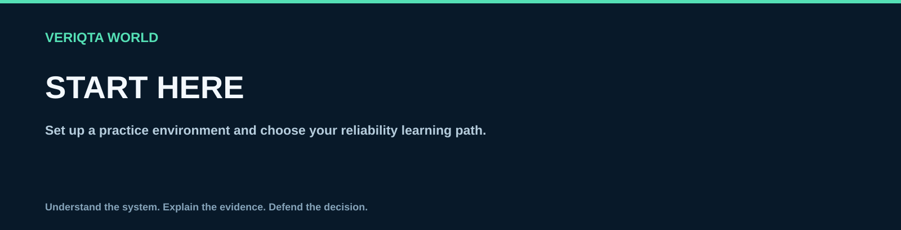

# Start here

Set up a practice environment and choose your reliability learning path.

## Explore

- [How to use sre world](how-to-use-sre-world.md)
- [Choose your learning path](choose-your-learning-path.md)
- [Sre prerequisites](sre-prerequisites.md)
- [Set up your practice environment](set-up-your-practice-environment.md)
- [Reliability lab safety](reliability-lab-safety.md)
- [Learning progress checklist](learning-progress-checklist.md)

[Return to SRE-WORLD](../README.md)
