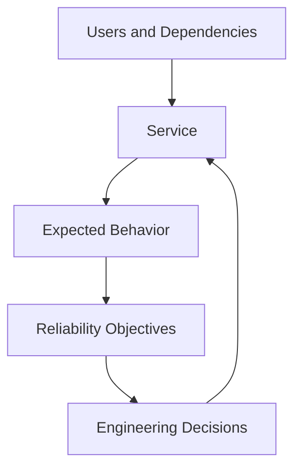
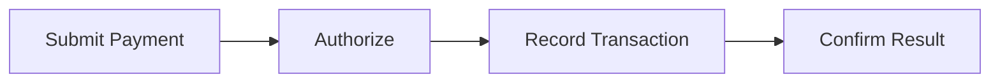
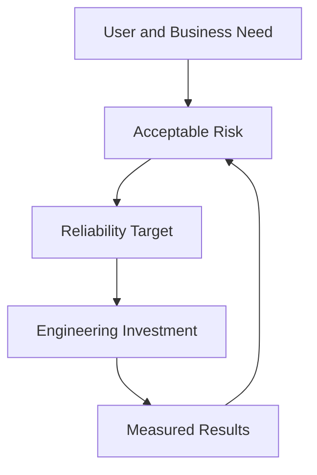
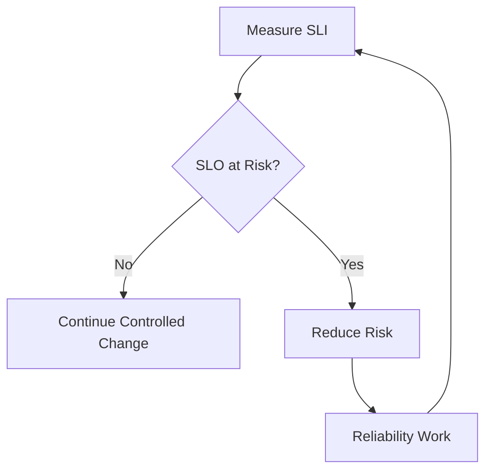
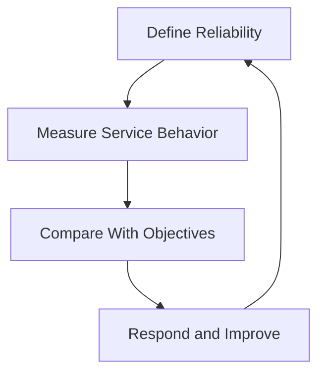
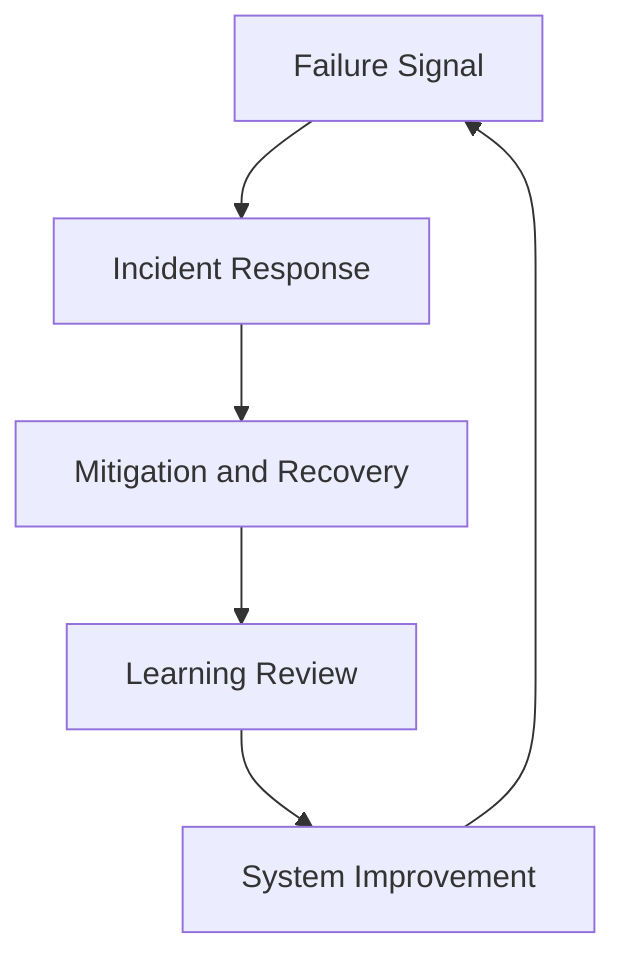
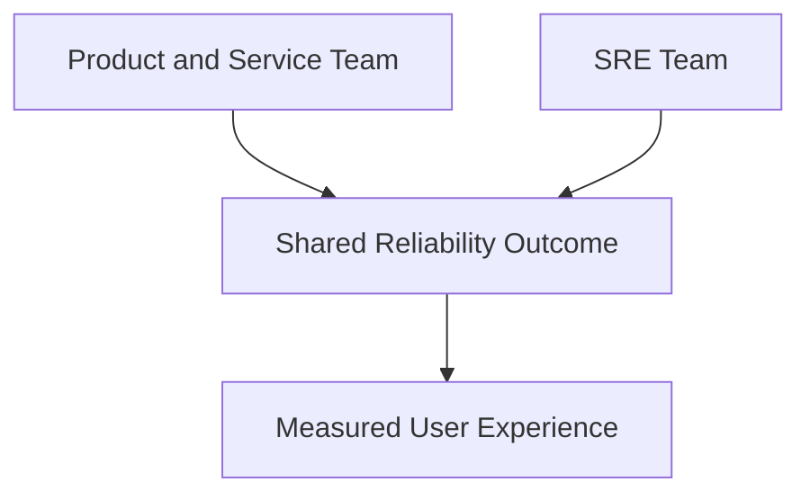

# What Is Site Reliability Engineering?

> Site Reliability Engineering is an engineering discipline for operating services at an explicitly agreed level of reliability. It combines software engineering, systems engineering, production operations, measurement, and organizational decision-making.

## Section Purpose

The term **SRE** is often reduced to monitoring dashboards, cloud administration, Kubernetes operations, automation, or an operations job with a newer title. Those descriptions miss the discipline’s defining ideas.

SRE begins with a service and its users. It asks:

- What must the service do for its users?
- Which service behaviors matter most?
- What level of failure is acceptable?
- How will reliability be measured?
- Who owns the service in production?
- How will engineers detect, respond to, and learn from failure?
- Which recurring operational work should be engineered out of the system?
- How should the organization balance reliability, delivery speed, complexity, and cost?

This chapter establishes the meaning and boundaries of SRE. Later SRE World chapters examine each practice in depth.

---

## Learning Objectives

After completing this chapter, you should be able to:

1. Define SRE without describing a list of tools.
2. Explain why SRE is an engineering approach to production operations.
3. Identify the service, user, and reliability outcome in an SRE problem.
4. Explain how SLOs and error budgets influence engineering decisions.
5. Distinguish engineering work, operational work, toil, and overhead.
6. Describe the role of on-call and incident response in SRE.
7. Explain why automation alone does not create SRE.
8. Distinguish SRE from a renamed system administration or support team.
9. Describe shared ownership between SRE and application teams.
10. Evaluate whether an organization is practicing SRE or only using the title.

---

## 1. A Working Definition

Google describes SRE as the result of treating operations as a software problem. Its stated mission centers on protecting and progressing services while paying close attention to availability, latency, performance, and capacity. The original Google SRE book presents the discipline as software engineers designing an operations function. See [Google SRE](https://sre.google/) and [Introduction to Site Reliability Engineering](https://sre.google/sre-book/introduction/).

A broader working definition is:

> Site Reliability Engineering applies engineering methods to production operations so that services meet explicit reliability objectives with controlled risk and sustainable human effort.

Every part of this definition matters.

### Site

The historical word “site” should not be interpreted as meaning only websites. An SRE may support:

- Public applications
- Internal services
- APIs
- Data pipelines
- Storage systems
- Authentication systems
- Payment services
- Messaging platforms
- Cloud infrastructure
- Kubernetes platforms
- Machine learning services
- Network services
- Other production systems

The object of concern is a service that provides value and has users or dependent systems.

### Reliability

Reliability means that a system performs its intended functions consistently under defined conditions.

Reliability is not simply “the server is running.” A service can be reachable and still be unreliable because it:

- Returns incorrect results
- Responds too slowly
- Loses data
- Serves stale data
- Fails only for an important user segment
- Cannot handle expected load
- Depends on an unavailable downstream service
- Requires unsafe manual intervention to remain operational

Google Cloud’s reliability guidance similarly defines reliability in terms of consistently performing intended functions under defined conditions, with resilience describing the ability to withstand and recover from disruption. See the [Google Cloud reliability pillar](https://docs.cloud.google.com/architecture/framework/reliability).

### Engineering

Engineering means using analysis, measurement, design, software, systems knowledge, experimentation, and feedback to create lasting improvements.

SRE does not attempt to make every operational task disappear. It prevents repetitive reactive work from consuming the team’s capacity to improve the service.

---

## 2. The Unit of SRE Is the Service

SRE is not primarily organized around servers, clusters, dashboards, tickets, or tools. It is organized around services and the value those services provide.

A service has:

- A purpose
- Users or dependent systems
- One or more critical user journeys
- Owners
- Dependencies
- Reliability expectations
- Failure modes
- Operational procedures
- Change mechanisms
- Recovery requirements

An SRE should be able to connect every technical signal to a service behavior or operating decision.



If a team monitors thousands of metrics but cannot explain whether users can complete the service’s critical journeys, it has monitoring activity without a complete reliability model.

---

## 3. SRE Begins With User Experience

Infrastructure health matters because services depend on infrastructure. It is not automatically the same as service reliability.

Consider an online payment service:

- CPU utilization is normal.
- Every server responds to health checks.
- The database is available.
- No alert is firing.
- Payment confirmations are delayed for 40 minutes.

The infrastructure may appear healthy while the service fails its purpose.

An SRE perspective begins with the user journey:



The reliability question is not only “Are the components up?” It is “Can valid users complete the payment journey correctly and within an acceptable time?”

This is why SRE favors service-level indicators that approximate user experience rather than depending only on infrastructure utilization.

---

## 4. Reliability Must Be Defined

“The service should be reliable” is not an operational requirement. It does not state:

- Which behavior matters
- Who experiences the behavior
- How it is measured
- What target applies
- Over which period
- Which failures count
- What happens when performance falls below the target

SRE makes reliability discussable and measurable through service-level concepts.

### Service Level Indicator

An **SLI** is a carefully defined quantitative measure of some aspect of the service level.

Examples:

- Proportion of valid checkout attempts completed successfully
- Proportion of API requests completed in less than 300 milliseconds
- Proportion of scheduled data jobs completed before their deadline
- Proportion of stored objects retrieved without corruption

### Service Level Objective

An **SLO** is a target or acceptable range for an SLI over a defined period.

Example:

> During a rolling 28-day window, 99.9 percent of valid payment authorization requests will complete successfully.

### Service Level Agreement

An **SLA** is an agreement that describes expected service and consequences when commitments are not met. It may have contractual, financial, or legal implications.

Google’s SRE guidance emphasizes that service behavior cannot be managed well without understanding what matters and how it will be evaluated. See [Service Level Objectives](https://sre.google/sre-book/service-level-objectives/) and [Implementing SLOs](https://sre.google/workbook/implementing-slos/).

SLIs, SLOs, and SLAs receive full treatment in [03-SLIs-SLOs-and-SLAs](../03-SLIs-SLOs-and-SLAs/).

---

## 5. SRE Manages Risk, Not Perfection

SRE does not pursue maximum reliability at any cost.

Perfect reliability is generally impossible. Attempting to approach it can require:

- More redundancy
- More complex architecture
- More engineering time
- Slower changes
- More testing
- Higher infrastructure cost
- Greater operational coordination
- Reduced product delivery capacity

The correct question is not:

> How do we prevent every failure?

It is:

> What level and shape of failure can users and the business tolerate, and what engineering investment is justified?

Google’s SRE chapter on risk explains that extreme reliability can cost more, slow delivery, and provide little additional value when users cannot perceive the improvement. It argues for aligning service risk with the level the business is willing to bear. See [Embracing Risk](https://sre.google/sre-book/embracing-risk/).



### Reliability Is Contextual

Different services can justify different objectives.

| Service | Important concern | Possible consequence of failure |
|---|---|---|
| Emergency dispatch | Availability and correctness | Risk to human safety |
| Payment authorization | Correctness, latency, availability | Lost revenue or duplicate charges |
| Internal analytics | Freshness and completion time | Delayed business decisions |
| Photo archive | Durability | Permanent loss of user data |
| Recommendation feed | Latency and graceful degradation | Reduced engagement |
| Development preview | Availability during working hours | Lost engineering time |

The table does not prescribe targets. It shows why reliability requirements must follow purpose and impact.

---

## 6. Error Budgets Turn Reliability Into a Decision System

If an SLO permits some failure, the permitted amount is the **error budget**.

For a request-based SLO:

```text
Error budget = 100% - SLO target
```

If the SLO is 99.9 percent successful requests, the error budget is 0.1 percent failed requests during the measurement window.

The budget creates a shared basis for decisions:

- When the service performs comfortably within its objective, the organization can take controlled change risk.
- When the budget is consumed too quickly, teams may reduce release risk and invest in reliability.
- When measurement shows chronic overperformance, the target and investment may need review.



An error budget is not permission to create careless outages. It is a control mechanism for making risk visible and balancing reliability with change.

Google explains that error budgets create a shared incentive between product development and SRE and replace political arguments with measurable risk. See [Motivation for Error Budgets](https://sre.google/sre-book/embracing-risk/#motivation-for-error-budgets).

Error budgets receive full treatment in [04-Error-Budgets](../04-Error-Budgets/).

---

## 7. The SRE Control Loop

SRE is best understood as a continuous control loop.



### Define

- Identify users and critical journeys.
- Select meaningful indicators.
- Agree on objectives and risk tolerance.
- Define ownership and policies.

### Measure

- Collect appropriate telemetry.
- Measure user-visible outcomes.
- Track error budget consumption.
- Evaluate uncertainty and data quality.

### Compare

- Determine whether the service is within objectives.
- Detect fast and slow reliability deterioration.
- Identify risk before a complete outage.
- Decide whether action is required.

### Respond and Improve

- Mitigate incidents.
- Change release behavior.
- Remove toil.
- Improve architecture.
- Strengthen alerts and runbooks.
- Test recovery.
- Learn from failures and near misses.

The loop prevents SRE from becoming a collection of unrelated practices.

---

## 8. Core SRE Responsibilities

Not every SRE team owns exactly the same work. Common responsibilities include the following.

### Reliability Definition

- Identify critical user journeys
- Define SLIs and SLOs
- Establish error budget policy
- Review service criticality
- Translate business expectations into engineering objectives

### Production Visibility

- Design useful telemetry
- Improve instrumentation
- Build service health views
- Create actionable alerts
- Detect gaps between system metrics and user impact

### Production Operations

- Participate in on-call
- Triage pages
- Mitigate incidents
- Escalate appropriately
- Maintain operational context
- Verify recovery

### Reliability Engineering

- Remove recurring failure modes
- Improve fault isolation
- Reduce blast radius
- Strengthen capacity and overload behavior
- Design graceful degradation
- Improve change safety
- Test recovery mechanisms

### Operational Improvement

- Measure and reduce toil
- Replace manual processes with durable engineering
- Improve runbooks and playbooks
- Conduct production readiness reviews
- Learn from incidents
- Track corrective work

### Organizational Enablement

- Consult on service design
- Establish reusable reliability patterns
- Improve shared operational systems
- Teach service teams to own reliability
- Communicate reliability risk to decision-makers

An SRE team should not silently inherit every task that another team does not want to own.

---

## 9. SRE Is an Engineering Discipline

Production operations always contain work that must be performed. SRE changes how the organization handles that work.

### Engineering Work

Engineering work:

- Requires human judgment
- Creates a lasting improvement
- Is guided by a strategy
- Helps the service or team scale
- Removes or reduces future work

Examples:

- Redesigning a queue consumer to apply backpressure
- Creating safe automated remediation with limits and verification
- Removing a recurring cause of database connection exhaustion
- Designing a reusable SLO framework
- Reducing the blast radius of releases
- Building a capacity model

### Operational Work

Operational work directly supports the running service.

Examples:

- Responding to an incident
- Performing a necessary migration
- Coordinating a regional failover
- Reviewing a risky launch
- Supporting an unusual customer-impacting event

Operational work is not automatically toil.

### Toil

Google’s SRE literature describes toil through characteristics such as manual effort, repetition, automation potential, tactical reaction, lack of enduring value, and growth proportional to service scale. Google’s model sets an upper bound of 50 percent for operational work so that SREs retain time for engineering, though other organizations must choose a boundary appropriate to their situation. See [Eliminating Toil](https://sre.google/sre-book/eliminating-toil/) and [The Site Reliability Workbook’s toil guidance](https://sre.google/workbook/eliminating-toil/).

Examples of toil:

- Manually restarting the same failing process every day
- Repeating an identical access change for every new customer
- Acknowledging a noisy alert that never requires action
- Running a release procedure that could be made safe and self-service
- Cleaning temporary files whenever disk utilization reaches a fixed threshold

### Overhead

Overhead includes work required by the organization but not directly tied to operating the service, such as general meetings, performance administration, and routine organizational processes.

### Classification Test

| Question | Strong indication |
|---|---|
| Is the work repeated? | Possible toil |
| Can a machine perform it safely? | Possible toil |
| Does demand grow with traffic, users, or service count? | Possible toil |
| Does the service remain unchanged afterward? | Possible toil |
| Does the work permanently reduce risk or effort? | Engineering work |
| Does it require novel judgment? | Engineering or essential operational work |

Toil is explored fully in [12-Toil-and-Automation](../12-Toil-and-Automation/).

---

## 10. SRE and Software Engineering

Software engineering is central to SRE, but SRE does not mean that every engineer spends every day developing applications.

SRE uses software engineering to:

- Automate recurring operations
- Build service-level measurement
- Improve system resilience
- Create safe control systems
- Analyze large operational datasets
- Build failure-testing systems
- Improve release safety
- Provide self-service operational capabilities
- Remove scaling limits in human processes

The goal is not automation for its own sake. The goal is a safer, more scalable, more measurable production system.

### A Script Is Not Automatically SRE

A script can reduce typing while preserving a dangerous process.

Example:

```text
Alert fires → script restarts service → metric recovers → cause remains unknown
```

This may create new risks:

- Evidence disappears during restart.
- The restart increases load on dependencies.
- A fault triggers a continuous restart loop.
- A corrupted component repeatedly rejoins service.
- Operators stop investigating the recurring condition.

An SRE approach asks:

- What failure is the script addressing?
- Is the action safe under every triggering condition?
- What limits its scope and frequency?
- How does it determine success?
- When does it stop and escalate?
- What permanent engineering work removes the need?

---

## 11. SRE and On-Call

Many SREs participate in on-call rotations because production feedback is essential to reliability engineering.

On-call provides direct evidence about:

- Actual failure modes
- Alert quality
- Missing telemetry
- Unsafe changes
- Weak runbooks
- Repetitive operational work
- Unclear ownership
- Recovery difficulty
- User-impact patterns

Google’s guidance defines on-call as being available during an assigned period and ready to respond to production incidents with appropriate urgency. SREs may diagnose, mitigate, fix, or escalate incidents. See [Being On-Call](https://sre.google/workbook/on-call/).

On-call is not healthy merely because a rotation exists.

A sustainable rotation requires:

- Actionable pages
- Reasonable page volume
- Clear escalation
- Adequate staffing
- Service knowledge
- Access to evidence
- Safe mitigation options
- Time to address recurring problems
- Psychological safety
- Management attention to operational load

If engineers spend nearly all their time reacting, the team cannot perform the engineering work that distinguishes SRE.

On-call is explored in [08-On-Call-Engineering](../08-On-Call-Engineering/).

---

## 12. SRE and Incident Management

SRE assumes that failures will occur.

The objective is not to promise that incidents disappear. The objective is to improve the system’s ability to:

- Detect impact
- Establish scope
- Coordinate response
- Contain failure
- Mitigate customer harm
- Restore service
- Verify recovery
- Preserve evidence
- Learn
- Reduce recurrence or future impact



Incident response is not only a technical debugging exercise. It also requires:

- Clear authority
- Defined roles
- Decision logs
- Stakeholder communication
- Risk management
- Evidence handling
- Recovery criteria

Incident management is explored in [09-Incident-Management](../09-Incident-Management/).

---

## 13. SRE and Observability

Observability helps engineers understand system behavior from emitted evidence. It supports SRE, but observability is not the whole of SRE.

An organization may have excellent telemetry and still lack:

- Agreed reliability objectives
- Service ownership
- Actionable alerting
- Incident command
- Error budget policy
- Sustainable on-call
- Capacity planning
- Recovery testing
- Learning from failure

SRE asks what decision a signal enables.

Examples:

- Does this metric represent user impact?
- Will this alert wake someone who can act?
- Can traces identify the failing dependency?
- Can logs reconstruct the incident timeline?
- Does the telemetry reveal error budget consumption?
- Can engineers verify recovery?

Observability is explored in [06-Observability-Engineering](../06-Observability-Engineering/).

---

## 14. SRE and Automation

Automation is a means, not the objective.

Useful SRE automation should be:

- Based on a defined operational problem
- Safer than the process it replaces
- Bounded in scope
- Observable
- Idempotent where applicable
- Rate limited where repeated actions create risk
- Reversible where possible
- Capable of stopping
- Able to report its decisions
- Verified after action

Examples of SRE automation:

- Removing unhealthy instances only after independent checks
- Scaling capacity before forecast demand reaches a limit
- Blocking a release when the service burns error budget too quickly
- Automatically collecting incident evidence before remediation
- Detecting configuration divergence
- Testing restoration of backups

Automation becomes dangerous when it increases the speed or scale of a wrong decision.

---

## 15. SRE and Service Ownership

SRE does not remove responsibility from the team that designs and changes the application.

Google’s engagement guidance emphasizes that application owners remain responsible for changing their applications and that SRE engagement should create company-wide value rather than one-off scripts. See [SRE Engagement Model](https://sre.google/workbook/engagement-model/).

A mature ownership model clarifies:

- Who owns application changes
- Who owns reliability objectives
- Who participates in on-call
- Who can declare an incident
- Who can approve high-risk action
- Who owns dependencies
- Who funds reliability work
- Who accepts unresolved risk
- When SRE may return operational responsibility



Shared outcome does not mean unclear accountability. Each responsibility must still have an owner.

Service ownership receives detailed treatment in [02-Service-Ownership](../02-Service-Ownership/).

---

## 16. SRE Is Not One Universal Team Model

Organizations implement SRE in different ways.

### Embedded SRE

SREs work closely within or beside a service team.

**Strengths:**

- Deep service context
- Fast collaboration
- Clear connection to service outcomes

**Risks:**

- Local solutions may not benefit the wider organization
- SREs may be absorbed into feature delivery or support
- Standards may diverge across teams

### Centralized SRE

A dedicated SRE organization supports several services.

**Strengths:**

- Shared standards
- Cross-service learning
- Reusable systems
- Concentrated expertise

**Risks:**

- Distance from application context
- Queue-based relationships
- Operational responsibility may become unclear

### Consulting SRE

SREs advise teams without permanently owning their production operations.

**Strengths:**

- Broad organizational influence
- Teams retain ownership
- Limited SRE capacity can reach more services

**Risks:**

- Advice may not be implemented
- Limited long-term operational feedback
- Success depends on service-team commitment

### Platform-Oriented Reliability

SRE principles are encoded into shared infrastructure and operational capabilities.

**Strengths:**

- Reusable controls
- Consistent measurement
- Reduced repeated work

**Risks:**

- Platform metrics can obscure end-user outcomes
- Teams may treat the platform as responsible for all reliability
- Standardization can ignore important service differences

No model eliminates the need for explicit ownership, reliability objectives, operational feedback, and engineering time.

---

## 17. What SRE Is Not

### Not a Tool Stack

SRE cannot be defined by Prometheus, Grafana, Kubernetes, Terraform, a cloud platform, or any other product.

Tools implement parts of a reliability strategy. They do not decide:

- Which user journey matters
- What risk is acceptable
- Whether an alert deserves a page
- Whether to release during budget exhaustion
- Whether failover creates more risk than remaining in place
- Which corrective action deserves funding

### Not a Renamed Operations Team

Changing job titles without changing responsibility, measurement, engineering capacity, and ownership does not create SRE.

Warning signs include:

- Nearly all work is tickets and manual changes.
- The team cannot modify services or operational systems.
- The team has no engineering time.
- Product teams transfer every production problem to SRE.
- Success is measured only by closing requests.
- There are no SLOs or user-centered reliability measures.

### Not a Monitoring Team

Monitoring is one capability. SRE also includes risk, objectives, incident response, capacity, resilience, production readiness, toil reduction, and organizational learning.

### Not an Incident-Only Team

A team that only responds after failure may perform valuable operations, but it lacks the preventive and improvement loop expected of SRE.

### Not “Keep Everything Up at Any Cost”

SRE aims for justified reliability. Excessive reliability can create unnecessary expense, slower delivery, and architectural complexity.

### Not Automatic Replacement of Service Ownership

SRE should not become the destination for work that application teams refuse to own.

### Not Exclusive to Very Large Companies

Google’s Site Reliability Workbook explicitly addresses applying SRE outside Google’s scale and culture. See the [Site Reliability Workbook preface](https://sre.google/workbook/preface/).

Small organizations can apply SRE principles without copying Google’s team structure. They can:

- Define one meaningful SLO
- Review pages for actionability
- Track recurring toil
- Improve incident roles
- Test one recovery procedure
- Use reliability evidence in release decisions

---

## 18. SRE Compared With Related Functions

This is a high-level boundary. Later chapters examine each comparison in depth.

| Function | Primary emphasis | Relationship to SRE |
|---|---|---|
| Software engineering | Building and changing software | SRE applies software engineering to production reliability problems. |
| Systems engineering | Designing and operating interacting technical systems | SRE depends heavily on systems reasoning. |
| Traditional operations | Running and supporting production systems | SRE limits repetitive operations and creates engineering feedback loops. |
| DevOps | Organizational and technical practices that improve delivery and collaboration | SRE provides specific reliability mechanisms such as SLOs and error budgets. |
| Platform engineering | Building internal platforms and shared capabilities | Platforms may encode reliability controls used by service teams and SREs. |
| Production engineering | Engineering systems for production performance and operability | It often overlaps substantially with SRE, depending on the organization. |
| Incident management | Coordinating response to disruptive events | It is a core SRE practice but not the complete discipline. |
| Observability engineering | Designing telemetry and understanding system behavior | It provides evidence used by SRE decisions. |

Google characterizes DevOps and SRE as related rather than conflicting, with shared emphasis on collaboration, measurement, change, and blameless learning. SRE gives particular weight to SLOs as decision mechanisms. See [How SRE Relates to DevOps](https://sre.google/workbook/how-sre-relates/).

---

## 19. The SRE Mindset

SRE is not only a collection of practices. It is a way of reasoning about production systems.

### Start With the User

Component health is evidence, not the final outcome.

### Make Expectations Explicit

Undefined reliability leads users and teams to form incompatible assumptions.

### Measure Before Arguing

Use reliable data to reduce opinion-based disputes.

### Accept That Failure Will Occur

Design containment, recovery, and learning rather than relying on prevention alone.

### Prefer Lasting Improvement

Repeated heroics are evidence that the system needs engineering.

### Treat Human Work as a Limited Resource

Operational processes must scale without consuming the entire team.

### Control Risk During Change

Changes should be observable, limited, testable, and reversible where possible.

### Learn Without Simplistic Blame

Failures emerge from interacting technical and organizational conditions.

### Verify Recovery

A green component does not prove that the user journey has recovered.

### Preserve Simplicity

Every dependency, automation loop, failover mechanism, and layer adds failure modes.

---

## 20. A Practical SRE Decision Framework

Use this framework when evaluating an SRE problem.

### Step 1: Identify the Service

- What value does it provide?
- Who owns it?
- Who depends on it?

### Step 2: Identify the User Journey

- What is the user trying to complete?
- Which outcome represents success?
- Which failures matter most?

### Step 3: Define Reliability

- Which SLI represents the journey?
- What objective applies?
- Over which measurement window?
- What exclusions are justified?

### Step 4: Determine Risk

- What happens when the service fails?
- How much failure is acceptable?
- Who can accept the remaining risk?

### Step 5: Examine Evidence

- What does telemetry show?
- Is the data complete and trustworthy?
- Does it measure user experience or only component activity?

### Step 6: Choose an Action

- Continue normal change
- Reduce release risk
- Mitigate an incident
- Improve capacity
- Remove toil
- Change architecture
- Test recovery
- Accept and document risk

### Step 7: Bound the Action

- What is the blast radius?
- Can the action be stopped?
- Can it be reversed?
- What conditions require escalation?

### Step 8: Verify the Outcome

- Has the user journey recovered?
- Has the risk decreased?
- Did the action create new failure modes?
- What follow-up work remains?

---

## 21. SRE in a Small Organization

A small company may not need a separate SRE team. It may still need SRE practices.

Example adoption sequence:

1. Assign explicit service ownership.
2. Identify one critical user journey.
3. Define one meaningful SLI and SLO.
4. Review alerts and remove non-actionable pages.
5. Establish simple incident roles.
6. Track repeated manual operational work.
7. Fix the most costly recurring failure.
8. Test backup restoration.
9. Review reliability before major launches.
10. Use measured risk to prioritize further investment.

The organization should not copy a large-company structure that creates more process than value.

---

## 22. SRE in a Large Organization

Large organizations face different challenges:

- Thousands of services
- Inconsistent ownership
- Shared infrastructure
- Multiple regions and business units
- Regulatory constraints
- Complex dependency graphs
- Different service criticalities
- Fragmented incident processes
- Large volumes of telemetry
- Conflicting incentives

SRE at this scale may require:

- Service catalogs
- Standard SLI definitions
- Tiered service criticality
- Shared incident command
- Reusable reliability platforms
- Formal production readiness reviews
- Error budget governance
- Cross-team learning
- Reliability maturity assessment
- Executive risk reporting

The central principles remain the same. The organization must avoid replacing meaningful reliability decisions with process compliance.

---

## 23. Common SRE Misunderstandings

### “SRE Is Just DevOps With a Different Title”

The practices overlap, but SRE has a distinct operational framework built around explicit reliability objectives, error budgets, engineering limits on toil, and production responsibility.

### “SRE Owns Every Production Problem”

Service teams retain responsibility for the software they design and change. Engagement must define responsibilities clearly.

### “More Monitoring Means More Reliability”

More telemetry can create more noise. Reliability improves when evidence enables better decisions and engineering.

### “Automation Eliminates Operations”

Automation changes operations. It can also automate mistakes, hide recurring failures, and introduce new control loops.

### “No Incidents Means the Service Is Reliable”

The absence of reported incidents may mean missing detection, low usage, hidden degradation, or poor reporting.

### “Five Nines Is Always Better”

Each additional reliability requirement carries cost and complexity. The objective must match user and business need.

### “SRE Must Use Kubernetes”

SRE predates Kubernetes and applies to many kinds of systems. Kubernetes is one operating environment, not the definition of SRE.

### “SRE Is Only for Google-Scale Systems”

Team structures should fit the organization, but explicit objectives, actionable alerting, incident learning, toil reduction, and recovery testing provide value at smaller scales.

### “Blameless Means Nobody Is Accountable”

Blameless analysis examines why actions made sense and which system conditions permitted failure. It does not excuse deliberate misconduct or eliminate ownership of corrective work.

---

## 24. Poor Implementation Versus Mature Practice

| Poor implementation | Mature SRE practice |
|---|---|
| Rename operations staff as SRE | Change responsibilities, authority, measurement, and engineering capacity |
| Monitor component uptime only | Measure critical user journeys |
| Page on every anomaly | Page on urgent, actionable impact or risk |
| Set 100 percent availability | Agree on justified reliability and error budget |
| Automate every manual action | Evaluate risk, controls, return, and failure modes |
| Transfer ownership to SRE | Define shared outcomes and explicit accountability |
| Reward incident heroics | Remove recurring conditions and improve recovery |
| Write postmortems to find blame | Study interacting conditions and build corrective controls |
| Create one-off scripts | Build reusable, maintained operational capabilities |
| Treat all services as equally critical | Match investment to user and business impact |
| Track tickets closed | Track reliability outcomes and reduction of operational burden |

---

## 25. Production Scenario: The Renamed Operations Team

### Situation

A company renames its infrastructure operations team “Site Reliability Engineering.”

The team:

- Responds to tickets
- Deploys application releases manually
- Restarts failed services
- Maintains monitoring dashboards
- Receives every production alert
- Cannot change application code
- Has no defined engineering allocation
- Has no service-level objectives
- Is measured by ticket closure and mean time to resolution

### Assessment

This is not yet a mature SRE implementation.

The team performs essential work, but the organization has changed the title without creating the defining SRE mechanisms.

### Gaps

- No user-centered reliability definition
- No SLO or error budget
- No clear service ownership agreement
- No protected engineering time
- No systematic toil measurement
- Limited authority to remove recurring failure
- Incentive centered on reactive volume
- Application teams separated from production consequences

### Recommended First Actions

1. Select one important service for a limited engagement.
2. Define ownership with the application team.
3. Identify critical user journeys.
4. Define initial SLIs and one practical SLO.
5. Review pages for actionability.
6. Measure operational work and toil.
7. Protect time for one lasting reliability improvement.
8. Establish incident and postmortem practices.
9. Review results before expanding the model.

### Lesson

SRE adoption is an operating-model change, not a title migration.

---

## 26. Production Scenario: Reliability Without User Measurement

### Situation

A service team reports 99.99 percent uptime because all compute instances remained available. Customers experienced failures for 45 minutes because authentication tokens could not be validated.

### Investigation Questions

- What was the critical user journey?
- Did compute uptime represent that journey?
- Was authentication treated as a dependency?
- Could synthetic or client-side measurement detect the failure?
- Did the service have a correctness or success-rate SLI?
- Which team owned dependency escalation?

### Lesson

Component availability is not automatically service reliability.

---

## 27. Production Scenario: Automation That Creates Risk

### Situation

A service occasionally stops processing messages. An engineer writes automation that restarts every consumer when queue depth exceeds a threshold.

During a downstream database slowdown:

- Queue depth increases.
- The automation restarts all consumers.
- In-flight work is retried.
- Database pressure increases.
- Consumers enter a restart loop.
- Recovery becomes slower.

### SRE Analysis

The automation reacted to a symptom without understanding the failure domain.

Missing controls included:

- Rate limits
- Maximum restart count
- Dependency-health checks
- Partial rollout
- Backoff
- Evidence capture
- Stop conditions
- Escalation
- Recovery verification

### Lesson

Automation must reduce operational risk, not merely execute manual actions faster.

---

## 28. Production Scenario: The Reliability Target Dispute

### Situation

Product leadership wants 99.999 percent availability for a new internal reporting service. The service is used during weekday business hours. No customer commitment requires this target.

### SRE Questions

- Which user journey requires this availability?
- What is the financial or operational impact of failure?
- Are weekends and nights part of the relevant measurement window?
- What do dependencies provide?
- What architecture and staffing would the target require?
- Would users notice the difference between 99.9 and 99.999 percent?
- Which product work would be delayed to fund the target?
- Who accepts the cost and remaining risk?

### Lesson

An SLO is a business and product decision informed by engineering evidence, not a prestige number selected in isolation.

---

## 29. Practical Exercise: Recognize SRE Work

Classify each activity as primarily:

- Reliability definition
- Engineering work
- Essential operational work
- Toil
- Overhead
- Insufficient information

### Activities

1. An engineer manually clears the same cache every morning.
2. A team redesigns cache invalidation to remove the daily intervention.
3. An on-call engineer mitigates a previously unseen regional failure.
4. A team attends an organization-wide benefits meeting.
5. An engineer writes a script that must still be manually run for every customer.
6. Product and engineering agree on a checkout success SLO.
7. A team reviews why an alert fired 800 times without action.
8. An engineer restarts a service whenever latency rises.
9. A team builds safe load shedding for non-critical requests.
10. A team manually approves every routine deployment because rollback is unreliable.

### Evaluation Guidance

Do not classify from the activity name alone. Ask:

- Is it repeated?
- Is it reactive?
- Is it automatable or removable?
- Does it create enduring value?
- Does it require novel judgment?
- Does it scale with service growth?
- Is the work directly connected to the production service?

---

## 30. Practical Exercise: Define an SRE Problem

Choose a real or fictional service and complete the following.

```text
Service name:
Service purpose:
Primary users:
Service owner:
Critical user journey:
Successful outcome:
User-visible failure:
Important dependencies:
Current reliability evidence:
Missing evidence:
Current operational burden:
Recurring failure:
Business impact:
Risk owner:
First reliability improvement:
```

### Completion Standard

Your answer should describe a user outcome, not only a technical component.

Weak:

```text
The Kubernetes pods should be healthy.
```

Stronger:

```text
Valid users should be able to submit an order and receive confirmation within the agreed latency threshold, including when one application instance fails.
```

---

## 31. Practical Exercise: Evaluate an SRE Team

Assess a team from 0 to 2 in each area.

| Area | 0 | 1 | 2 |
|---|---|---|---|
| Service ownership | Unknown | Partially documented | Explicit and practiced |
| User journeys | Not identified | Informally understood | Defined and prioritized |
| Reliability objectives | None | Component targets | User-centered SLOs |
| Error budget decisions | None | Reported only | Used to control risk |
| Alerting | Noisy or absent | Partly actionable | Urgent, owned, and reviewed |
| On-call | Unsustainable | Functional | Sustainable with improvement time |
| Incident response | Ad hoc | Basic roles | Practiced command and communication |
| Toil | Unmeasured | Identified | Measured and reduced |
| Engineering capacity | None | Unprotected | Protected and outcome-driven |
| Learning | Blame or silence | Postmortems written | Corrective work tracked and verified |
| Recovery | Assumed | Documented | Tested |
| Shared ownership | Work transferred | Responsibilities unclear | Explicit collaboration |

### Interpretation

- `0–8`: Operations exist, but foundational SRE mechanisms are largely absent.
- `9–16`: Some SRE practices exist, but they are inconsistent or weakly connected.
- `17–21`: A functioning SRE approach is present with identifiable gaps.
- `22–24`: The team demonstrates mature foundational SRE practice.

This is a learning exercise, not a universal industry maturity standard.

---

## 32. Reflection Questions

1. Why is “keeping servers running” an incomplete definition of reliability?
2. What makes SRE an engineering discipline?
3. Why might a lower reliability target be the responsible decision?
4. How does an error budget change the conversation between reliability and product delivery?
5. Why is user experience often different from infrastructure health?
6. What distinguishes toil from unpleasant but valuable engineering work?
7. Why does SRE participation in on-call matter?
8. When can automation make a service less reliable?
9. Why should application teams retain production responsibility?
10. Which SRE practices can a small organization apply without creating a separate SRE team?
11. What evidence would show that a renamed operations team has actually adopted SRE?
12. Why is the absence of reported incidents insufficient proof of reliability?

---

## 33. Knowledge Check

### 1. Which statement best defines SRE?

A. A collection of monitoring and cloud administration tools  
B. An engineering approach to operating services against explicit reliability objectives  
C. A team that receives every production ticket  
D. A replacement name for system administration

**Answer:** B

### 2. Which measurement most directly represents service reliability?

A. Number of servers running  
B. CPU utilization  
C. Proportion of critical user transactions completed correctly within the expected time  
D. Number of dashboards

**Answer:** C

### 3. Which activity is most likely toil?

A. Designing a new fault-isolation boundary  
B. Investigating a novel distributed failure  
C. Manually restarting the same process after the same alert every day  
D. Defining a service SLO

**Answer:** C

### 4. What is an error budget?

A. The infrastructure budget assigned to the SRE team  
B. The amount of unreliability permitted by an SLO  
C. The financial penalty in every SLA  
D. The total number of incidents allowed

**Answer:** B

### 5. Why is 100 percent reliability generally unsuitable as an objective?

A. Monitoring cannot report percentages  
B. SRE does not care about outages  
C. It is generally unattainable and can require unjustified cost and reduced change velocity  
D. It prevents the use of cloud infrastructure

**Answer:** C

### 6. Which statement about service ownership is most accurate?

A. SRE automatically owns every application in production.  
B. Product teams stop participating after deployment.  
C. Responsibilities should be explicit, and application owners remain responsible for changing their service.  
D. The monitoring vendor owns incident detection.

**Answer:** C

### 7. Which is the strongest sign of mature SRE automation?

A. It runs without documentation.  
B. It restarts every unhealthy component immediately.  
C. It has defined triggers, bounds, stop conditions, evidence, and verification.  
D. It replaces every human decision.

**Answer:** C

### 8. Which condition proves that a service recovered?

A. CPU returned to normal.  
B. The deployment completed.  
C. One server passed its health check.  
D. Defined user journeys and service indicators show sustained recovery.

**Answer:** D

---

## 34. Completion Checklist

You have completed this chapter when you can truthfully confirm:

- [ ] I can define SRE without naming tools.
- [ ] I can identify the service and user journey in a reliability problem.
- [ ] I understand why component health is not the same as service reliability.
- [ ] I can explain SLIs, SLOs, SLAs, and error budgets at a foundational level.
- [ ] I can explain why reliability is a risk and investment decision.
- [ ] I can distinguish engineering work, operational work, toil, and overhead.
- [ ] I understand why on-call provides engineering feedback.
- [ ] I can explain how unsafe automation increases operational risk.
- [ ] I understand that SRE and application teams need explicit shared responsibility.
- [ ] I can recognize a renamed operations team that lacks SRE mechanisms.
- [ ] I completed the SRE problem definition exercise.
- [ ] I evaluated one team using the foundation assessment.
- [ ] I answered the knowledge-check questions.

---

## 35. Key Takeaways

- SRE is an engineering discipline for operating services against explicit reliability objectives.
- The service and its users are the center of the reliability model.
- Reliability includes correct and timely service behavior, not only uptime.
- SRE manages acceptable risk rather than pursuing perfection at any cost.
- SLOs and error budgets connect reliability evidence to operational decisions.
- On-call and incidents provide feedback for engineering improvement.
- Toil must not consume the capacity required to improve the system.
- Automation must be bounded, observable, safe, and verifiable.
- SRE does not remove responsibility from application owners.
- Tools support SRE practices, but tools do not define SRE.
- Adopting SRE requires changes to ownership, measurement, incentives, and engineering work, not only job titles.

---

## 36. Authoritative Resources

### Essential Reading

1. [Google SRE: What Is Site Reliability Engineering?](https://sre.google/)
2. [Site Reliability Engineering, Introduction](https://sre.google/sre-book/introduction/)
3. [The Site Reliability Workbook, Preface](https://sre.google/workbook/preface/)
4. [How SRE Relates to DevOps](https://sre.google/workbook/how-sre-relates/)
5. [Embracing Risk](https://sre.google/sre-book/embracing-risk/)
6. [Service Level Objectives](https://sre.google/sre-book/service-level-objectives/)
7. [Eliminating Toil](https://sre.google/sre-book/eliminating-toil/)
8. [Being On-Call](https://sre.google/workbook/on-call/)
9. [SRE Engagement Model](https://sre.google/workbook/engagement-model/)
10. [Google Cloud Well-Architected Framework: Reliability](https://docs.cloud.google.com/architecture/framework/reliability)

### Source Notes

- Google’s implementation is a foundational and influential model, not a universal organization template.
- Reliability targets, team structures, toil limits, and engagement rules must be adapted to the service and organization.
- Product-specific examples should be translated into general reliability principles before adoption.

---

## 37. Related SRE World Sections

- [SRE Foundations](./README.md)
- [Service Ownership](../02-Service-Ownership/)
- [SLIs, SLOs, and SLAs](../03-SLIs-SLOs-and-SLAs/)
- [Error Budgets](../04-Error-Budgets/)
- [Reliability Measurement](../05-Reliability-Measurement/)
- [Observability Engineering](../06-Observability-Engineering/)
- [On-Call Engineering](../08-On-Call-Engineering/)
- [Incident Management](../09-Incident-Management/)
- [Toil and Automation](../12-Toil-and-Automation/)
- [SRE Organizations and Culture](../26-SRE-Organizations-and-Culture/)

---

## Next Section

[02: History and Evolution of SRE](./02-History-and-Evolution-of-SRE.md)


