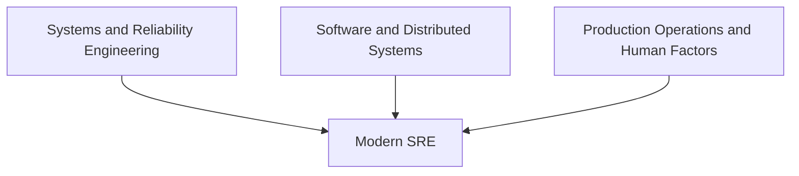
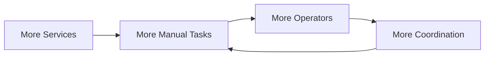
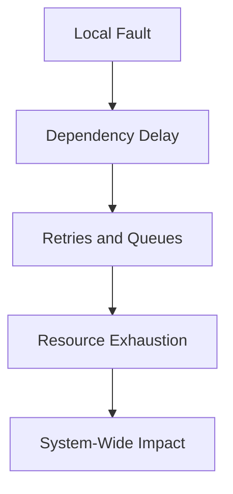
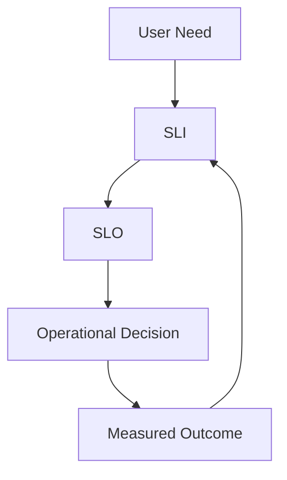
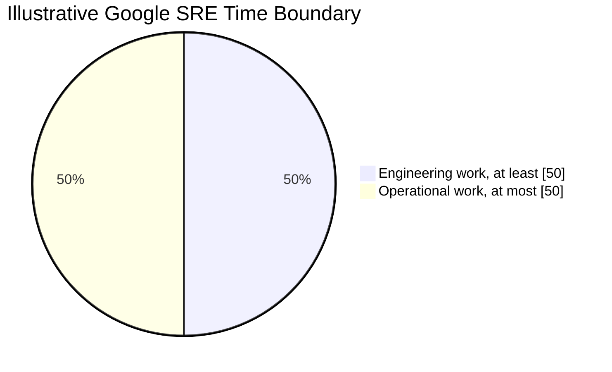
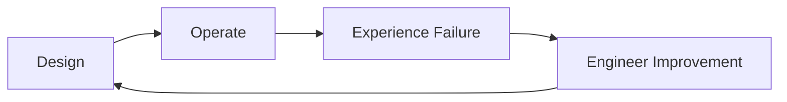
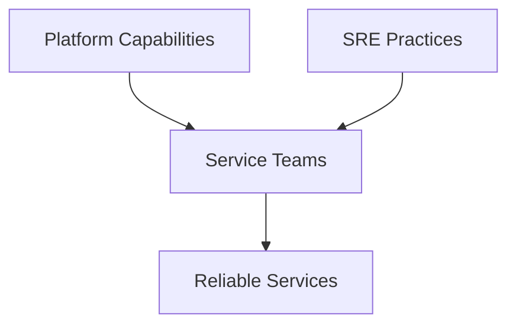

# History and Evolution of Site Reliability Engineering

> SRE did not begin when the title was created. It emerged from decades of work in systems administration, distributed computing, fault tolerance, operations, capacity planning, safety, and software engineering. Google gave a particular operating model a name, formal structure, and public vocabulary. The wider industry then adapted, challenged, and extended it.

## Chapter Purpose

Understanding the history of SRE prevents two common mistakes:

1. Treating SRE as a recent collection of cloud-native tools.
2. Treating Google’s implementation as the only legitimate form of reliability engineering.

This chapter explains:

- The operational traditions that existed before the SRE title
- Why internet-scale services created new reliability pressures
- How Google formalized SRE
- How measurement, SLOs, error budgets, toil control, and on-call became central
- How conferences and books made SRE a public discipline
- How organizations outside Google adapted the model
- How cloud computing, containers, platforms, and observability changed SRE work
- How resilience engineering, human factors, security, data, and AI are expanding the field
- Which ideas remained stable and which ideas continue to evolve

This is a history of concepts and operating models. It is not a history of every company that has used an SRE title.

---

## Learning Objectives

After completing this chapter, you should be able to:

1. Explain which engineering traditions preceded SRE.
2. Describe the production pressures that encouraged SRE’s formation.
3. Explain Google’s role without claiming that Google invented reliability engineering.
4. Identify the significance of the early Google SRE team.
5. Explain why large-scale distributed systems changed operations.
6. Describe the emergence of SLOs, error budgets, toil limits, and shared ownership.
7. Identify major public milestones in SRE’s development.
8. Explain how SRE spread beyond Google.
9. Describe how cloud-native systems expanded SRE’s scope.
10. Distinguish enduring SRE principles from time-specific implementations.
11. Evaluate whether a modern SRE practice represents continuity, adaptation, or misuse.
12. Identify likely directions in which the discipline is evolving.

---

## 1. SRE Has More Than One History

There are at least three useful ways to tell the history of SRE.

### The Named Discipline

This history begins at Google, where a specific engineering approach to production operations was named Site Reliability Engineering and developed into an organizational function.

### The Technical Lineage

This history begins much earlier, with work on:

- Reliable hardware
- Fault-tolerant computing
- Operating systems
- Computer networks
- Distributed systems
- Database recovery
- High-availability design
- Capacity planning
- Performance engineering
- Systems administration
- Operations research
- Safety-critical systems

### The Organizational Lineage

This history includes attempts to resolve recurring tension between people who build systems and people who operate them. It includes:

- Production ownership
- Cross-functional collaboration
- Automation
- Incident command
- Post-incident learning
- Change management
- Sustainable on-call
- Feedback from operations into design

These histories overlap. None should erase the others.



Google did not invent reliability, operations, automation, incident response, or fault tolerance. Its important contribution was to combine several ideas into a recognizable, opinionated engineering discipline and share much of that model publicly.

---

## 2. Before the SRE Title

Long before the term SRE, organizations operated systems where failure carried serious consequences.

Examples included:

- Telecommunications networks
- Banking systems
- Airline reservation systems
- Industrial control systems
- Military and aerospace systems
- Mainframes
- Scientific computing
- Utility networks
- Database systems
- Early internet services

Engineers already had to reason about:

- Redundancy
- Failure detection
- Recovery
- Capacity
- Performance
- Change control
- Backup and restoration
- Fault isolation
- Degraded operation
- Operator error
- Maintenance risk

Modern SRE inherited these concerns. What changed was the environment in which they had to be managed.

---

## 3. Traditional System Administration

Early production computing often relied heavily on system administrators.

Their work commonly included:

- Installing operating systems
- Managing user accounts
- Configuring servers
- Applying patches
- Managing storage
- Monitoring resource usage
- Performing backups
- Troubleshooting outages
- Maintaining networks
- Supporting applications
- Responding to operational requests

This work required significant technical knowledge. It should not be dismissed as primitive or unskilled.

The scaling problem appeared when operational demand grew in proportion to:

- Number of machines
- Number of applications
- Number of users
- Number of changes
- Number of incidents
- Number of environments

If every additional machine or service required similar manual effort, human operations became the limiting resource.

### The Linear Work Problem



Adding people could postpone the problem but could also create more handoffs, inconsistency, and coordination cost.

SRE’s later emphasis on engineering and toil reduction directly addressed this pattern.

---

## 4. Reliability Engineering Before Software Services

The phrase **reliability engineering** predates modern internet software.

Traditional reliability engineering studied questions such as:

- How likely is a component to fail?
- How does component failure affect the complete system?
- How long can a system operate before failure?
- How quickly can it be repaired?
- Which redundancy reduces risk?
- Which failures share a common cause?
- How should maintenance be scheduled?
- What level of risk is acceptable?

Concepts that remain relevant to SRE include:

- Failure rate
- Mean time between failures
- Mean time to repair
- Redundancy
- Fault trees
- Failure-mode analysis
- Reliability block diagrams
- Preventive maintenance
- Common-mode failure
- Risk-based design

Modern software services require different measurement and operating approaches, but the core concern is continuous: systems must perform intended functions under defined conditions.

---

## 5. Fault-Tolerant and Distributed Computing

Distributed computing made failure more complex.

In a single system, failure might appear as a stopped process or failed machine. In a distributed system:

- One component can fail while others remain healthy.
- Messages can be delayed, duplicated, reordered, or lost.
- A network partition can prevent components from agreeing.
- A dependency can be slow without being completely unavailable.
- Clients can amplify failure through retries.
- Replicas can disagree.
- Clocks can differ.
- A system can be partially available to some users.
- The initiating fault can disappear while the system remains degraded.

This created a need for operations that understood software behavior, not only machine state.



SRE developed in an environment where partial failure was normal and production behavior had to be engineered into software and system design.

---

## 6. The Growth of Internet Services

Internet services changed production operations in several ways.

### Continuous User Access

Users could access services across time zones. Maintenance windows became more difficult because there might be no universally quiet period.

### Rapid Growth

Traffic could increase faster than hardware procurement, staffing, or manual processes.

### Large Machine Fleets

At sufficient scale, individual component failure became routine rather than exceptional.

### Frequent Software Change

Online services could release software more often than traditional packaged software. Change improved products but also created operational risk.

### Complex Dependencies

User requests moved through networks of services, storage systems, caches, queues, and control planes.

### Immediate Visibility of Failure

Failures could affect millions of users and become publicly visible quickly.

### Data-Driven Operation

Large services produced enough telemetry to make measurement, automation, and statistical analysis central to operations.

The old model of preventing failure through careful manual control could not be the complete answer. Organizations needed systems designed for routine failure, rapid change, and large-scale recovery.

---

## 7. Google’s Early Production Challenge

Google’s services grew rapidly in scale, traffic, software complexity, and infrastructure demand.

The company needed an operations model that could:

- Support rapid product development
- Operate large distributed systems
- Use software to manage operational scale
- Preserve reliability during frequent change
- Hire engineers comfortable with both code and systems
- Turn production experience into system improvements

Google’s public history identifies 2004 as the beginning of SRE as a named practice. Its current SRE site describes more than twenty years of evolution since that point. See [Google SRE](https://sre.google/).

The widely cited origin story centers on Benjamin Treynor Sloss being asked to create a team that would run production using software engineering principles. Google’s introductory SRE material describes this as designing an operations function with software engineers. See [Introduction to Site Reliability Engineering](https://sre.google/sre-book/introduction/).

### Why the Origin Story Matters

The important historical point is not simply who received which title. It is the design constraint:

> Production operations had to scale through engineering rather than through unlimited growth in manual work.

---

## 8. SRE as an Organizational Design

The early Google model contained several connected choices.

### Hire for Software and Systems Capability

The team needed engineers who could understand production systems and change the software or automation around them.

### Place Engineers Close to Production

On-call and operational responsibility provided direct feedback about how systems actually failed.

### Protect Engineering Time

Without a boundary, reactive work would consume all available capacity.

### Define Reliability Quantitatively

Teams needed explicit measures and objectives rather than general demands for stability.

### Balance Reliability and Change

Reliability could not be used as an unlimited veto against product development.

### Share Responsibility

Product and application teams could not simply transfer production consequences to SRE.

These choices formed an operating model, not merely a job description.

---

## 9. Borg, Borgmon, and the Environment Around Early SRE

Google’s internal infrastructure shaped how its SRE practice developed.

Google has documented that Borg, its cluster-management system, was created in 2003. Borgmon, a monitoring system, followed to complement that infrastructure. The history of Borgmon shows how monitoring and alerting grew alongside automated large-scale scheduling. See [Borgmon: Time-Series Monitoring and Alerting](https://sre.google/sre-book/practical-alerting/).

The important lesson is not that SRE requires Borg or a Borg-like platform. It is that:

- Automated infrastructure changes the scale of operations.
- Monitoring must reflect service behavior in dynamic environments.
- Machine replacement can be routine.
- Human operators cannot inspect every component individually.
- Declarative systems require strong control-plane and telemetry reasoning.

Later container orchestrators made these problems familiar to a much wider industry, but the reliability questions existed before modern cloud-native tooling.

---

## 10. The Emergence of Service-Level Thinking

Traditional operations often emphasized machine uptime and component state.

SRE shifted attention toward measurable service behavior:

- Availability
- Latency
- Error rate
- Throughput
- Correctness
- Durability
- Freshness

The Service Level Indicator, Service Level Objective, and Service Level Agreement vocabulary allowed teams to distinguish:

- What is measured
- What target is desired
- What contractual or business commitment exists

Google’s SRE material argues that a service cannot be managed well without understanding which behaviors matter and how to evaluate them. See [Service Level Objectives](https://sre.google/sre-book/service-level-objectives/).

### Historical Importance

SLOs turned reliability from a vague aspiration into a control signal.



This did not eliminate judgment. It gave judgment a shared evidence base.

---

## 11. The Error Budget Innovation

Production teams have a recurring conflict:

- Product teams want to deliver changes.
- Reliability teams fear that change may cause failure.

If neither side has an agreed risk model, the argument can become political.

Error budgets convert the allowed unreliability implied by an SLO into a decision mechanism.

When error budget remains:

- Teams may continue controlled change.
- Experiments and releases remain possible.

When the budget is consumed too quickly:

- Teams may reduce change risk.
- Reliability work may take priority.
- The causes of poor performance require attention.

Google’s SRE history presents error budgets as a way to align incentives between product development and reliability rather than allowing one team to pursue velocity and another to pursue stability without a shared rule. See [Embracing Risk](https://sre.google/sre-book/embracing-risk/).

### Why This Was Significant

The error budget did more than create a calculation. It reframed reliability as:

- An agreed risk tolerance
- A shared outcome
- A business decision
- A limit on both excessive instability and excessive conservatism

---

## 12. The Toil Boundary

Operations contains repetitive work. Without a boundary, that work expands.

Google’s SRE literature defined **toil** as operational work with characteristics such as:

- Manual
- Repetitive
- Automatable
- Tactical
- Lacking enduring value
- Growing with service scale

Google established a goal that operational work should not exceed 50 percent of an SRE’s time, leaving at least half for engineering. See [Eliminating Toil](https://sre.google/sre-book/eliminating-toil/).

### Historical Importance

This boundary distinguished SRE from an operations model that depended mainly on additional human effort.



The 50 percent boundary is not a universal law. Its enduring idea is that engineering time must be protected and operational load must be measured.

Without protected engineering time:

- Recurring failures remain unfixed.
- Alert volume grows.
- Manual processes multiply.
- Engineers burn out.
- The team becomes traditional operations regardless of its title.

---

## 13. On-Call as an Engineering Feedback Loop

In SRE, on-call is not only a support duty. It connects system design to production consequences.

On-call exposes engineers to:

- Real failure modes
- Weak alerts
- Missing telemetry
- Unsafe releases
- Unclear ownership
- Poor recovery procedures
- Repetitive toil
- Capacity limits

The historical innovation was not that engineers responded to outages. Engineers had done that for decades. The important link was:



When those who design systems never experience operational results, failure knowledge can remain trapped in a separate team.

Google’s current workbook defines on-call as assigned availability to respond to production incidents with appropriate urgency. See [Being On-Call](https://sre.google/workbook/on-call/).

---

## 14. Production Readiness and Service Handover

As SRE teams supported more services, they needed criteria for accepting operational responsibility.

A service that entered production without:

- Ownership
- SLOs
- Capacity understanding
- Useful alerts
- Runbooks
- Recovery procedures
- Dependency knowledge
- Safe change processes

could transfer uncontrolled risk to the SRE team.

Production Readiness Reviews emerged as a structured way to evaluate whether a service was ready for operation. Google’s Site Reliability Workbook describes PRRs as part of its service onboarding and engagement practices. See [SRE Engagement Model](https://sre.google/workbook/engagement-model/) and [Data Processing Pipelines](https://sre.google/workbook/data-processing/).

### Historical Importance

The PRR changed the relationship from:

```text
Build service → throw it over the wall → operations absorbs the risk
```

to:

```text
Build service → assess operational readiness → address gaps → accept explicit responsibility
```

---

## 15. Monitoring Evolved Into Reliability Evidence

Monitoring existed before SRE, but SRE changed what monitoring was expected to accomplish.

Traditional monitoring often centered on:

- Host reachability
- Disk utilization
- CPU
- Process state
- Network availability

SRE expanded the focus toward:

- User-visible success
- Service latency
- Error budget consumption
- Dependency behavior
- Saturation
- Partial failure
- Actionable paging
- Recovery verification

The change was not a clean replacement. Infrastructure signals remained necessary. They became supporting evidence within a service-centered model.

---

## 16. From Root Cause to Systems Learning

Operations historically used incident reviews, problem management, and root-cause analysis in many forms.

SRE helped popularize blameless postmortems in software operations.

The approach asked teams to examine:

- Technical conditions
- Organizational conditions
- Detection gaps
- Response gaps
- Assumptions
- Decision context
- Contributing factors
- Corrective work

The objective was to learn why the system permitted failure, not to end the investigation when a person’s action was identified.

This practice later interacted with a wider resilience-engineering and human-factors community, which challenged simplistic linear explanations of failure.

---

## 17. Simplicity Became a Reliability Strategy

Automation and distributed systems can remove manual work, but they can also create more states, dependencies, and failure modes.

SRE developed a strong concern with simplicity because:

- Every dependency can fail.
- Every control loop can behave unexpectedly.
- Every configuration adds possible states.
- Every recovery mechanism requires testing.
- Every layer can hide evidence.

This helped distinguish mature automation from uncontrolled complexity.

The historical lesson was not “automate everything.” It was “use engineering to create safer and more scalable operation.”

---

## 18. 2014: SREcon Establishes a Wider Community

USENIX records the first SREcon in May 2014. See the [USENIX timeline](https://www.usenix.org/about/history/firsts).

SREcon created a dedicated venue for engineers concerned with:

- Site reliability
- Systems engineering
- Distributed systems
- Production operations
- Incident response
- Monitoring
- Capacity
- Organizational reliability

USENIX’s history of the LISA conference explains that the SRE community grew large enough to form its own conference in 2014. See [Thirty-Five Years of LISA](https://www.usenix.org/publications/loginonline/thirty-five-years-lisa).

### Why SREcon Mattered

It allowed SRE knowledge to develop beyond one company.

Conference speakers could compare:

- Different team models
- Different scales
- Different industries
- Successful and failed adoptions
- Technical and organizational incidents
- Local interpretations of SRE

The community became a place where Google’s model could be learned, adapted, and criticized.

---

## 19. 2016: The First Google SRE Book

The publication of *Site Reliability Engineering: How Google Runs Production Systems* in 2016 was a major public milestone.

The book organized SRE around topics including:

- Risk
- SLOs
- Toil
- Monitoring
- Automation
- Release engineering
- Simplicity
- On-call
- Incident response
- Postmortems
- Load
- Distributed systems
- Data integrity
- Reliability management

The book made Google’s internal vocabulary and practices accessible to a global engineering audience.

### What the Book Changed

Before the book, engineers might know individual Google talks or practices. After publication, organizations had a coherent reference for:

- Explaining SRE to leadership
- Designing SRE roles
- Establishing SLOs
- Discussing error budgets
- Measuring toil
- Improving incident response

### What the Book Did Not Do

It did not create a universal certification standard or guarantee that copying Google would work elsewhere.

The text described one organization’s experience with unusual scale, infrastructure, hiring, and culture.

See the complete online [Site Reliability Engineering book](https://sre.google/sre-book/table-of-contents/).

---

## 20. The Site Reliability Workbook

The next major Google publication, *The Site Reliability Workbook*, focused more heavily on implementation.

Its preface states two purposes:

1. Add implementation detail to the principles in the first book.
2. Dispel the idea that SRE works only at Google scale or in Google culture.

See the [Site Reliability Workbook preface](https://sre.google/workbook/preface/) and [table of contents](https://sre.google/workbook/table-of-contents/).

The workbook expanded practical treatment of:

- SLO implementation
- SLO case studies
- Monitoring
- SLO-based alerting
- Toil elimination
- On-call
- Incident response
- Postmortems
- Load management
- Configuration
- Canary releases
- SRE engagement
- Team lifecycles
- Organizational change

### Historical Importance

The workbook shifted public discussion from:

> What does Google SRE believe?

to:

> How can an organization apply, adapt, and operate these ideas?

---

## 21. SRE Spread Beyond Google

As the term became popular, companies adopted it in different ways.

### Faithful Adoption

Some organizations implemented:

- Explicit SLOs
- Error budget policies
- Protected engineering time
- Sustainable on-call
- Shared service ownership
- Production readiness criteria
- Incident learning

### Partial Adoption

Some adopted selected practices:

- SLOs without dedicated SRE teams
- Incident command without error budgets
- Reliability consulting without operational ownership
- SRE principles embedded in platform teams

### Title Adoption

Some renamed existing roles without changing:

- Authority
- Incentives
- Work allocation
- Production ownership
- Measurement
- Engineering capacity

This produced “SRE” teams that performed conventional support or infrastructure administration.

### Historical Lesson

The spread of a title is not the same as the spread of a discipline.

---

## 22. Enterprise Adaptation

Large enterprises often operate under conditions different from internet-native technology companies.

They may have:

- Legacy systems
- Outsourced operations
- Regulatory requirements
- Formal change approval
- Separate infrastructure and application groups
- Multiple vendors
- Fixed service contracts
- Limited software ownership
- Global and regional operating structures

SRE adoption in these environments required translation.

Common adaptations included:

- Starting with selected critical services
- Adding SLOs to existing service management
- Creating reliability consulting teams
- Establishing central incident command
- Introducing automation gradually
- Defining service tiers
- Building shared observability capabilities
- Negotiating ownership across organizational boundaries

### Microsoft Example

USENIX’s SREcon Europe 2016 program records a Microsoft speaker describing the first SRE pilot within Azure as beginning in 2014. This is one documented example of large-scale adaptation outside Google. See the [SREcon16 Europe program](https://www.usenix.org/conference/srecon16europe/program).

The point is not that every enterprise followed the same sequence. It shows that the SRE model was being tested and translated inside other large technology environments.

---

## 23. Cloud Computing Changed the Reliability Boundary

Cloud computing changed which layers teams owned directly.

In traditional environments, an organization might own:

- Datacenter facilities
- Physical servers
- Storage hardware
- Network equipment
- Virtualization
- Operating systems
- Applications

In cloud environments, providers operate some layers while customers remain responsible for workload architecture, configuration, access, dependency design, data, and recovery choices.

### New SRE Questions

- What does the provider guarantee?
- What must the customer design?
- How should provider SLAs influence application SLOs?
- Can a regional dependency fail independently?
- Which control planes are required during recovery?
- Are quotas and API limits part of capacity planning?
- How is provider failure distinguished from workload failure?

Cloud did not eliminate operations. It moved and divided responsibility.

Google Cloud’s reliability guidance describes application reliability as dependent on objectives for availability and resilience, while providing architectural guidance for zones, regions, traffic, load, and monitoring. See the [Google Cloud infrastructure reliability guide](https://docs.cloud.google.com/architecture/infra-reliability-guide).

---

## 24. Containers and Orchestration

Containers and orchestrators changed the unit of operation.

They made it easier to:

- Replace failed workloads
- Schedule services dynamically
- Standardize deployment
- Scale replicas
- Separate desired state from individual machines

They also introduced or exposed new failure modes:

- Control-plane failure
- Scheduling constraints
- Readiness misconfiguration
- Admission dependencies
- Autoscaling feedback loops
- Resource contention
- Network-policy errors
- Cluster DNS failure
- Disruption during upgrades
- Stateful recovery complexity

SRE increasingly operated systems where components were expected to be replaced automatically. The challenge moved from keeping individual machines alive to ensuring correct system behavior under continual change.

### Historical Misinterpretation

Because Kubernetes became common during the expansion of SRE titles, many people began treating Kubernetes administration as SRE.

Kubernetes can support SRE practices. It does not provide:

- User-centered SLOs
- Error budget policy
- Incident command
- Sustainable on-call
- Organizational ownership
- Recovery verification
- Learning culture

The tool changed the environment, not the definition of the discipline.

---

## 25. Observability Became a Distinct Field

As services became more dynamic and distributed, static dashboards and predefined host checks became less sufficient.

Industry attention expanded from monitoring known conditions toward using telemetry to investigate system behavior.

This brought greater focus to:

- Structured events
- Distributed tracing
- High-cardinality dimensions
- Correlation across services
- Dynamic queries
- Telemetry pipelines
- Instrumentation quality
- User-context analysis

Observability engineering developed as an adjacent specialty.

### Relationship to SRE

Observability provides evidence. SRE uses evidence to manage reliability.

An observability system can help answer:

- Which users are failing?
- Where is latency introduced?
- Which dependency changed?
- Is recovery sustained?

It cannot independently decide:

- What reliability target is justified
- Which risk the business accepts
- Whether a page is worth waking someone
- Which incident action has acceptable blast radius
- Whether reliability work should take priority

---

## 26. Platform Engineering and SRE

As organizations standardized internal infrastructure, platform engineering grew as a recognizable practice.

Platforms could encode:

- Deployment controls
- Telemetry defaults
- Service templates
- SLO configuration
- Policy enforcement
- Safe rollback
- Incident context
- Capacity controls
- Self-service operations

This changed some SRE work from direct service operation to shared reliability enablement.

### Productive Relationship



### Risk

Organizations sometimes treated the platform as the owner of application reliability.

A platform can provide safe defaults and controls. Service teams still need to understand their users, dependencies, failure modes, and objectives.

---

## 27. The Expansion of Incident Management

Modern SRE practice increasingly treats incident response as a specialized operational capability.

This includes:

- Incident command
- Clear roles
- Severity models
- Decision logs
- Stakeholder communication
- Customer communication
- Evidence collection
- Parallel investigation
- Recovery criteria
- Post-incident follow-up

The expansion reflects a recognition that complex incidents are coordination problems as well as technical problems.

An excellent debugger can still fail to lead a multi-team incident if authority, communication, and priorities are unclear.

---

## 28. From Blameless Postmortems to Deeper Learning

Blameless postmortems became one of SRE’s most visible cultural practices.

Over time, the field began questioning weak implementations that merely removed names while keeping simplistic analysis.

The evolution moved from:

```text
Who caused the outage?
```

to:

```text
What was the root cause?
```

and then toward:

```text
How did interacting technical and organizational conditions produce this outcome?
```

Modern learning reviews may examine:

- Local rationality
- Conflicting goals
- Hidden dependencies
- Weak signals
- Normalization of risk
- Adaptive work
- Successful recovery actions
- Organizational conditions

This reflects influence from human factors, safety science, and resilience engineering.

---

## 29. Resilience Engineering Influences SRE

Reliability and resilience overlap but are not identical.

Traditional reliability programs often emphasize preventing known failure and meeting defined performance objectives.

Resilience engineering also asks how systems and people:

- Adapt to surprise
- Sustain critical functions
- Respond to conditions not anticipated in procedures
- Recover when preventive controls fail
- Learn from normal work as well as incidents

This broadened attention from component failure to sociotechnical systems.

Modern SRE increasingly examines:

- Human adaptation
- Organizational pressure
- Coordination
- System boundaries
- Adaptive capacity
- Successful recoveries
- Near misses
- Complex causality

SREcon’s continuing inclusion of human factors, incident analysis, resilience, and systems safety demonstrates the expansion of the professional conversation. USENIX describes SREcon as a gathering for people concerned with site reliability, systems engineering, and complex distributed systems at scale. See [SREcon](https://www.usenix.org/conferences/byname/925).

---

## 30. Security and Reliability Converge

Security and reliability were once treated as more separate operational concerns.

Modern systems show how closely they interact:

- A denial-of-service attack is an availability incident.
- Credential compromise can force shutdown or recovery.
- Ransomware can destroy availability and data integrity.
- Emergency patching creates change risk.
- Access restrictions can delay incident mitigation.
- Backup security determines whether recovery remains possible.
- Supply-chain compromise can affect many dependent services.

Google’s later publication *Building Secure and Reliable Systems* reflects this convergence by connecting security and reliability design. See [Building Secure and Reliable Systems](https://sre.google/books/building-secure-reliable-systems/).

The evolution does not mean that SRE replaces security engineering. It means availability, integrity, confidentiality, and recovery must often be designed together.

---

## 31. Data Reliability Emerges as a Distinct Concern

Early SRE discussions often centered on online serving systems.

Modern organizations also depend on:

- Data pipelines
- Analytics platforms
- Event streams
- Machine learning features
- Reporting systems
- Data warehouses

For these systems, reliability can mean:

- Freshness
- Completeness
- Correctness
- Timeliness
- Schema compatibility
- Reproducibility
- Durability

A pipeline can be “up” while producing late, incomplete, or incorrect data.

This expanded SRE measurement beyond request success and server availability.

The Site Reliability Workbook includes dedicated guidance for data processing pipelines, including production readiness and maturity. See [Data Processing Pipelines](https://sre.google/workbook/data-processing/).

---

## 32. Customer Reliability Engineering

As organizations relied increasingly on cloud providers and external platforms, reliability crossed company boundaries.

Google introduced Customer Reliability Engineering to create shared operational work between Google Cloud and customers. Google described the model as creating a shared operational fate. See [Introducing Customer Reliability Engineering](https://cloud.google.com/blog/products/devops-sre/introducing-a-new-era-of-customer-support-google-customer-reliability-engineering).

The broader historical importance is the recognition that:

- A provider’s infrastructure SLO does not automatically produce an application SLO.
- Customers and providers own different failure domains.
- Joint incidents require shared evidence and communication.
- Architecture and operations must account for both sides of the boundary.

Reliability became an ecosystem concern, not only an internal team concern.

---

## 33. SRE Maturity and Organizational Change

As SRE spread, organizations learned that practices could not simply be installed.

Adoption required changes to:

- Incentives
- Ownership
- Team boundaries
- Career paths
- On-call expectations
- Release decisions
- Funding
- Measurement
- Leadership behavior

Google’s Site Reliability Workbook includes organizational change management and team lifecycle chapters, showing that SRE adoption is not only technical. See [Organizational Change Management in SRE](https://sre.google/workbook/organizational-change/) and [SRE Team Lifecycles](https://sre.google/workbook/team-lifecycles/).

### Historical Lesson

An organization can implement every technical tool associated with SRE and still fail to adopt SRE if incentives and ownership remain unchanged.

---

## 34. The Broadening of SRE Titles

As SRE became desirable, the title expanded.

Jobs labeled SRE began to include combinations of:

- Cloud administration
- Kubernetes administration
- Infrastructure automation
- Monitoring
- Support escalation
- Software engineering
- Incident management
- Performance engineering
- Platform engineering
- Database reliability
- Security engineering

This created opportunity and confusion.

### Positive Effect

More organizations invested in production engineering, reliability measurement, and incident learning.

### Negative Effect

The title sometimes concealed work dominated by:

- Tickets
- Manual changes
- Unbounded on-call
- Low authority
- No engineering time
- No SLOs
- No shared ownership

### Evaluation Principle

Judge an SRE role by its operating model, not its title.

Ask:

- What service outcomes does the team own?
- Can the team change the system?
- Is engineering time protected?
- How is toil measured?
- Are SLOs used for decisions?
- Is on-call sustainable?
- How does incident learning produce funded change?

---

## 35. SRE as a Practice Without an SRE Team

The discipline evolved beyond a single organizational structure.

Today, an organization may apply SRE through:

- Product teams owning SLOs and on-call
- A central reliability group
- Embedded SREs
- Reliability consulting
- Platform capabilities
- Incident management specialists
- Production engineering teams

This reflects a critical evolution:

> SRE principles can exist without a department named SRE, and a department named SRE can exist without practicing the principles.

The durable question is whether the organization uses engineering and evidence to manage production reliability.

---

## 36. AI and Automation in Modern SRE

Modern SRE teams increasingly use machine learning and generative AI for:

- Event correlation
- Anomaly detection
- Log summarization
- Incident timeline construction
- Runbook retrieval
- Hypothesis suggestion
- Change-risk analysis
- Capacity forecasting
- Automated remediation

AI also creates new reliability problems:

- Nondeterministic output
- Model drift
- Data drift
- Incorrect but plausible diagnosis
- Hidden dependency on model providers
- Prompt and context sensitivity
- High inference latency
- GPU and accelerator capacity constraints
- Evaluation difficulty
- Unsafe automated action

### Historical Continuity

The tool is new, but the SRE questions are familiar:

- What outcome is required?
- How is correctness measured?
- What failure is acceptable?
- What evidence supports the decision?
- What bounds the action?
- How can it be stopped?
- How is recovery verified?

AI does not remove the need for SRE judgment. It increases the importance of verification, control, and failure design.

---

## 37. SRE Timeline

The following timeline identifies major developments relevant to the named discipline. It is selective, not exhaustive.

| Period | Development | Significance |
|---|---|---|
| Before 2000 | Reliability engineering, fault tolerance, systems administration, database recovery, telecom operations, and safety engineering mature across industries | Establishes the technical and organizational foundations that SRE later combines |
| Late 1990s to early 2000s | Internet services grow rapidly in users, traffic, machine count, and deployment frequency | Manual operations face severe scaling limits |
| 2003 | Google creates Borg; Borgmon follows as monitoring for the scheduling environment | Demonstrates automated fleet management paired with large-scale telemetry |
| 2004 | Google identifies this period as the beginning of SRE as a named practice | Formalizes software-engineering approaches to production operations |
| 2000s | Google SRE develops practices around SLOs, error budgets, toil limits, on-call, automation, and production readiness | Establishes the core Google SRE operating model |
| May 2014 | USENIX holds the first SREcon | Creates a dedicated cross-company professional community |
| 2014 | A documented Microsoft Azure SRE pilot begins | Illustrates early large-enterprise adoption outside Google |
| 2016 | Google publishes *Site Reliability Engineering* | Makes a coherent SRE philosophy and practice publicly accessible |
| Late 2010s | SRE adoption expands across cloud providers, internet companies, and enterprises | Produces diverse implementations and title inflation |
| 2018 | *The Site Reliability Workbook* expands implementation guidance | Emphasizes practical adoption beyond Google scale and culture |
| Late 2010s to early 2020s | Cloud-native platforms, observability, progressive delivery, and platform engineering grow | Changes operating layers and expands reliability practices |
| 2020s | Human factors, resilience engineering, security, data reliability, sustainability, and AI enter more SRE discussions | Broadens SRE from service uptime toward sociotechnical resilience and new system types |
| 2024 | Google marks approximately twenty years of SRE | Signals the discipline’s transition from a company-specific practice to an established global field |
| Present | SRE continues to evolve across product, platform, data, cloud, AI, and safety contexts | No single implementation represents the entire discipline |

---

## 38. What Remained Constant

Despite major technical change, several principles remained central.

### Reliability Is a Service Outcome

The concern is whether the system performs its intended function for users.

### Reliability Must Be Measured

Teams need explicit indicators and objectives.

### Risk Must Be Managed

The goal is justified reliability, not perfection at unlimited cost.

### Operations Must Produce Engineering Feedback

Incidents, pages, and manual work should lead to system improvement.

### Human Effort Must Scale

Operational load cannot grow without limit in proportion to service size.

### Failure Must Be Expected

Systems require detection, containment, recovery, and learning.

### Ownership Must Be Explicit

Reliability fails when responsibility is transferred without authority or clarity.

### Change and Reliability Must Coexist

Reliable systems must evolve. Safe change is part of reliability.

---

## 39. What Changed

### Infrastructure Ownership

Physical systems gave way to virtualization, cloud services, and managed platforms.

### System Architecture

Monoliths coexist with microservices, event-driven systems, data platforms, edge systems, and AI services.

### Telemetry

Host monitoring expanded into high-volume metrics, logs, traces, events, and user-context analysis.

### Release Frequency

Infrequent scheduled releases coexist with continuous delivery and progressive rollout.

### Incident Coordination

Incident management became more specialized, structured, and communication-focused.

### Organizational Models

SRE now appears as centralized teams, embedded engineers, consultants, platform capabilities, and practices owned by service teams.

### Reliability Domains

Availability expanded toward correctness, freshness, security, data quality, model behavior, and sociotechnical resilience.

### Automation

Static scripts expanded into policy systems, automated remediation, orchestration, and AI-assisted operations.

---

## 40. Historical Anti-Patterns

### Tool-Based History

**Claim:** SRE began with Kubernetes, Prometheus, or cloud computing.

**Why it is wrong:** The named discipline predates these tools, and its technical lineage is much older.

### Great-Founder History

**Claim:** One person invented every idea in SRE.

**Why it is wrong:** Google formalized a particular model, but SRE draws from many older disciplines and contributors.

### Google-Copy History

**Claim:** An organization practices SRE only when it copies Google’s structure.

**Why it is wrong:** Google’s workbook explicitly addresses adaptation beyond Google scale and culture.

### Title-Equals-Practice History

**Claim:** The growth of SRE job titles proves adoption of SRE principles.

**Why it is wrong:** Titles can change without changes to ownership, SLOs, toil, or engineering authority.

### Replacement History

**Claim:** SRE made traditional operations knowledge obsolete.

**Why it is wrong:** SRE depends on deep systems and operational knowledge. It changes how that knowledge is used and scaled.

### Linear-Progress History

**Claim:** Modern SRE is always more mature than earlier operations.

**Why it is wrong:** Organizations can lose operational knowledge, create fragile automation, and repeat older failure patterns under new names.

---

## 41. Production Scenario: Copying Google Without Google’s Conditions

### Situation

A company creates a central SRE team after reading the Google SRE book.

It adopts:

- A 50 percent engineering target
- SLO terminology
- A production readiness checklist
- A separate on-call rotation

However:

- SREs cannot change application code.
- Product teams do not share on-call.
- SLO data is unreliable.
- Leadership continues measuring SRE by ticket closure.
- The new team receives every operational task.

### Analysis

The organization copied visible mechanisms without recreating the authority, incentives, shared ownership, and engineering capability that made them function.

### Historical Lesson

A practice cannot be separated from the conditions that give it meaning.

### Better Approach

1. Start with one service and explicit owners.
2. Build trustworthy measurement.
3. Define limited engagement responsibilities.
4. Protect engineering time through leadership agreement.
5. Give the team authority to change reliability mechanisms.
6. Measure service and human outcomes.
7. Adapt the model based on evidence.

---

## 42. Production Scenario: Cloud Migration Without Reliability Ownership

### Situation

An organization migrates from physical infrastructure to managed cloud services.

Leadership assumes:

- The provider now owns availability.
- Backups guarantee recovery.
- Auto scaling removes capacity planning.
- Multi-zone deployment guarantees resilience.

A regional control-plane disruption occurs. The service cannot create new resources, DNS failover is untested, and the backup has never been restored.

### Analysis

Cloud changed ownership boundaries but did not remove customer responsibility.

The organization failed to define:

- Application SLOs
- Dependency assumptions
- Recovery controls
- Capacity during failover
- RTO and RPO
- Restoration verification

### Historical Lesson

Every infrastructure transition redistributes reliability work. It does not eliminate it.

---

## 43. Production Scenario: SRE Title Inflation

### Situation

A company advertises an SRE role.

The actual work consists of:

- Resolving access tickets
- Maintaining build jobs
- Patching servers manually
- Responding to every monitoring alert
- Escalating application failures to another team

The role has no:

- SLO responsibility
- Software engineering work
- Service ownership
- Production design authority
- Toil-reduction objectives
- Incident learning process

### Assessment

The role may be legitimate infrastructure or operations work, but the SRE title does not match the operating model.

### Historical Lesson

The spread of vocabulary can outpace the spread of practice.

---

## 44. Production Scenario: AI-Assisted Incident Response

### Situation

An SRE team deploys an AI agent that summarizes alerts, searches runbooks, and recommends remediation.

During an incident, it recommends restarting a database replica based on a similar historical event. The current failure has a different replication state, and restarting may increase data loss.

### Historical Connection

The technology is new, but the control problem is old.

The team still needs:

- Trustworthy evidence
- Context-aware diagnosis
- Risk assessment
- Bounded authority
- Human approval for high-impact actions
- Stop conditions
- Verification
- Incident review

### Lesson

New operational technology should be evaluated through durable reliability principles.

---

## 45. Practical Exercise: Build a Concept Timeline

Create a timeline with these columns:

```text
Period:
Production problem:
Existing approach:
New SRE contribution:
What remained unchanged:
New risk introduced:
Modern equivalent:
```

Complete it for:

1. Manual system administration
2. Large distributed services
3. Early Google SRE
4. SREcon and public community development
5. Public SRE books
6. Cloud adoption
7. Container orchestration
8. Observability
9. Platform engineering
10. AI-assisted operations

The purpose is to identify continuity as well as change.

---

## 46. Practical Exercise: Separate Principle From Implementation

For each item, identify the durable principle and one organization-specific implementation.

| Item | Durable principle | Possible implementation |
|---|---|---|
| Toil control | Preserve capacity for lasting engineering improvement | A 50 percent operational-work limit |
| Reliability targets | Define acceptable service behavior | A 28-day request-success SLO |
| Risk management | Balance reliability with change | Error budget release policy |
| Production feedback | Connect failure experience to design | SRE on-call rotation |
| Readiness | Do not accept uncontrolled operational risk | Formal PRR |
| Learning | Use incidents to improve systems | Blameless postmortem meeting |
| Shared ownership | Builders and operators share outcomes | Joint service engagement agreement |

Add five examples from your own environment.

---

## 47. Practical Exercise: Evaluate an SRE Adoption Story

Choose a public SRE adoption case study and answer:

```text
Organization:
Date or period:
Original production problem:
Existing team structure:
SRE practices adopted:
Practices intentionally not adopted:
Ownership changes:
Measurement changes:
On-call changes:
Engineering authority:
Evidence of improvement:
Unresolved limitations:
What was specific to the organization:
What is transferable:
Primary sources:
```

Do not evaluate success only from the existence of an SRE team.

---

## 48. Practical Exercise: Interview an Operations System

Treat an organization’s operating model as a system. Ask:

- How are services defined?
- Who owns changes?
- Who responds to incidents?
- How is reliability measured?
- Which work is repeated manually?
- Who can modify production systems?
- What happens after an incident?
- How are release and reliability priorities negotiated?
- Which historical decisions created the present structure?
- Which older practices remain useful?
- Which practices survive only from habit?

Produce a one-page history of the operating model. Avoid judging it before understanding why it developed.

---

## 49. Reflection Questions

1. Which disciplines contributed to SRE before the name existed?
2. Why did internet-scale services expose limits in manual operations?
3. What was distinctive about Google’s SRE operating model?
4. Why are SLOs historically more important than a new monitoring metric?
5. How did error budgets address organizational conflict?
6. Why did the toil boundary matter?
7. What did SREcon contribute to the field?
8. Why was the first Google SRE book a major milestone?
9. How did the workbook change the adoption conversation?
10. How did cloud computing redistribute reliability responsibility?
11. Why does Kubernetes not define SRE?
12. How did observability change production investigation?
13. What did resilience engineering add to incident learning?
14. Why can SRE principles exist without a team named SRE?
15. How can a historical practice remain useful even when its technology is obsolete?
16. Which parts of Google’s implementation should not be copied without context?
17. How might AI change SRE without changing its core control problems?

---

## 50. Knowledge Check

### 1. Which statement best describes SRE’s origin?

A. Google invented every form of reliability engineering.  
B. SRE began when Kubernetes was released.  
C. Google formalized and named a software-engineering approach to production operations that drew on older disciplines.  
D. SRE replaced all systems administration.

**Answer:** C

### 2. What problem did SRE’s toil boundary address?

A. The cost of software licenses  
B. Reactive operational work expanding until no engineering capacity remained  
C. The number of programming languages  
D. The absence of cloud providers

**Answer:** B

### 3. What was the significance of error budgets?

A. They calculated only infrastructure cost.  
B. They removed the need for reliability targets.  
C. They created a shared, measurable basis for balancing change and reliability risk.  
D. They guaranteed that incidents would not occur.

**Answer:** C

### 4. Which event occurred in May 2014 according to USENIX?

A. The first SREcon  
B. The publication of the Site Reliability Workbook  
C. The creation of Borg  
D. The first public cloud

**Answer:** A

### 5. Why was the 2016 Google SRE book important?

A. It created the first monitoring system.  
B. It made a coherent set of Google SRE principles and practices publicly available.  
C. It defined a mandatory global standard.  
D. It proved every company needs a separate SRE department.

**Answer:** B

### 6. What did the Site Reliability Workbook emphasize?

A. Replacing the first book completely  
B. Certification preparation  
C. Implementation detail and application beyond Google scale and culture  
D. Kubernetes administration

**Answer:** C

### 7. How did cloud computing change reliability ownership?

A. It eliminated customer responsibility.  
B. It divided responsibilities across provider and customer layers.  
C. It guaranteed regional recovery.  
D. It removed the need for capacity planning.

**Answer:** B

### 8. Which statement best describes observability’s relationship to SRE?

A. Observability and SRE are identical.  
B. Observability provides evidence that supports SRE decisions.  
C. SRE makes telemetry unnecessary.  
D. Observability decides business risk tolerance.

**Answer:** B

### 9. What does title inflation mean in SRE history?

A. SRE salaries increased.  
B. Organizations used the SRE title without adopting the operating principles.  
C. Services became more reliable automatically.  
D. SRE stopped involving operations.

**Answer:** B

### 10. Which is a durable SRE principle?

A. Every organization must use Google’s exact team structure.  
B. Every system must run on Kubernetes.  
C. Reliability should be defined, measured, and managed as explicit service risk.  
D. Every manual task must be automated immediately.

**Answer:** C

---

## 51. Completion Checklist

- [ ] I can explain the technical and organizational lineages of SRE.
- [ ] I understand that reliability engineering predates the SRE title.
- [ ] I can explain why internet-scale services changed operational requirements.
- [ ] I can describe Google’s role without erasing earlier disciplines.
- [ ] I understand the importance of the 2004 origin period identified by Google.
- [ ] I can explain the relationship between Borg, Borgmon, and large-scale operation.
- [ ] I can explain the historical importance of SLOs.
- [ ] I can explain why error budgets changed reliability decision-making.
- [ ] I understand the purpose of protecting engineering time from toil.
- [ ] I can explain why on-call is an engineering feedback loop.
- [ ] I understand the significance of the first SREcon in 2014.
- [ ] I understand the roles of the first Google SRE book and the Site Reliability Workbook.
- [ ] I can explain how SRE spread and changed outside Google.
- [ ] I can describe how cloud, containers, observability, and platforms changed SRE work.
- [ ] I can explain how resilience engineering and human factors broadened incident learning.
- [ ] I can identify title adoption without practice adoption.
- [ ] I can separate an enduring principle from one organization’s implementation.
- [ ] I completed the timeline and adoption exercises.

---

## 52. Key Takeaways

- SRE has a named history, a technical history, and an organizational history.
- Reliability engineering, systems administration, fault tolerance, and operations existed before SRE.
- Rapidly growing internet services exposed the scaling limits of manual operations.
- Google formalized SRE as a software-engineering approach to production operations around 2004.
- SLOs made reliability explicit and measurable.
- Error budgets created a shared mechanism for balancing reliability and change.
- Toil limits protected time for lasting engineering improvement.
- On-call connected production experience to system design.
- SREcon and public books turned a company practice into a wider professional discipline.
- Cloud computing redistributed reliability responsibility rather than eliminating it.
- Containers, observability, and platforms changed implementation without replacing core principles.
- Human factors and resilience engineering expanded how the field understands failure.
- SRE can exist without a dedicated SRE team.
- An SRE title does not prove that SRE is practiced.
- Modern AI operations still require evidence, bounds, risk control, and verification.

---

## 53. Authoritative and Primary Resources

### Google SRE History and Foundations

1. [Google SRE](https://sre.google/)
2. [Introduction to Site Reliability Engineering](https://sre.google/sre-book/introduction/)
3. [Site Reliability Engineering: Table of Contents](https://sre.google/sre-book/table-of-contents/)
4. [The Site Reliability Workbook: Preface](https://sre.google/workbook/preface/)
5. [The Site Reliability Workbook: Table of Contents](https://sre.google/workbook/table-of-contents/)
6. [How SRE Relates to DevOps](https://sre.google/workbook/how-sre-relates/)
7. [Embracing Risk](https://sre.google/sre-book/embracing-risk/)
8. [Service Level Objectives](https://sre.google/sre-book/service-level-objectives/)
9. [Eliminating Toil](https://sre.google/sre-book/eliminating-toil/)
10. [Being On-Call](https://sre.google/workbook/on-call/)
11. [SRE Engagement Model](https://sre.google/workbook/engagement-model/)
12. [SRE Team Lifecycles](https://sre.google/workbook/team-lifecycles/)
13. [Organizational Change Management in SRE](https://sre.google/workbook/organizational-change/)
14. [Data Processing Pipelines](https://sre.google/workbook/data-processing/)
15. [Building Secure and Reliable Systems](https://sre.google/books/building-secure-reliable-systems/)

### USENIX and SREcon

16. [USENIX Historical Firsts](https://www.usenix.org/about/history/firsts)
17. [Thirty-Five Years of LISA](https://www.usenix.org/publications/loginonline/thirty-five-years-lisa)
18. [SREcon Conferences](https://www.usenix.org/conferences/byname/925)
19. [SREcon16 Europe Program](https://www.usenix.org/conference/srecon16europe/program)

### Cloud Reliability Evolution

20. [Google Cloud Well-Architected Framework: Reliability](https://docs.cloud.google.com/architecture/framework/reliability)
21. [Google Cloud Infrastructure Reliability Guide](https://docs.cloud.google.com/architecture/infra-reliability-guide)
22. [Introducing Customer Reliability Engineering](https://cloud.google.com/blog/products/devops-sre/introducing-a-new-era-of-customer-support-google-customer-reliability-engineering)

### Source Interpretation Notes

- Google sources describe an influential implementation and should not be treated as a universal organizational standard.
- USENIX sources provide important conference milestones and evidence of the wider professional community.
- Historical claims should distinguish publication dates, implementation dates, and later retrospective accounts.
- Vendor histories should be checked against independent or original records when they make broad claims about the whole field.

---

## 54. Related SRE World Sections

- [What Is SRE?](./01-What-Is-SRE.md)
- [SRE Foundations](./README.md)
- [Service Ownership](../02-Service-Ownership/)
- [SLIs, SLOs, and SLAs](../03-SLIs-SLOs-and-SLAs/)
- [Error Budgets](../04-Error-Budgets/)
- [Toil and Automation](../12-Toil-and-Automation/)
- [SRE Organizations and Culture](../26-SRE-Organizations-and-Culture/)
- [SRE Maturity and Governance](../27-SRE-Maturity-and-Governance/)
- [SRE Research Papers](../33-SRE-Research-Papers/)
- [Books, Talks, and Courses](../34-Books-Talks-and-Courses/)

---

## Next Chapter

[03: The SRE Mindset](./03-The-SRE-Mindset.md)

---

## Maintained by VERIQTA

SRE World is created and maintained by [VERIQTA](https://github.com/veriqta).

- Website: [veriqta.com](https://www.veriqta.com/)
- GitHub: [github.com/veriqta](https://github.com/veriqta)
- Instagram: [@veriqta](https://www.instagram.com/veriqta/)
- Medium: [veriqta.medium.com](https://veriqta.medium.com/)

> The technologies changed. The reliability problem remained: define what must work, understand how it can fail, and engineer the system and organization to recover.
