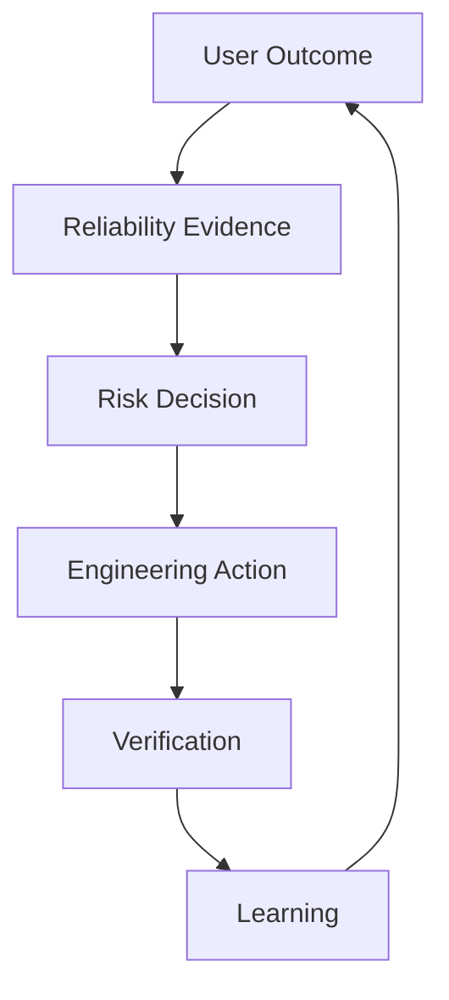
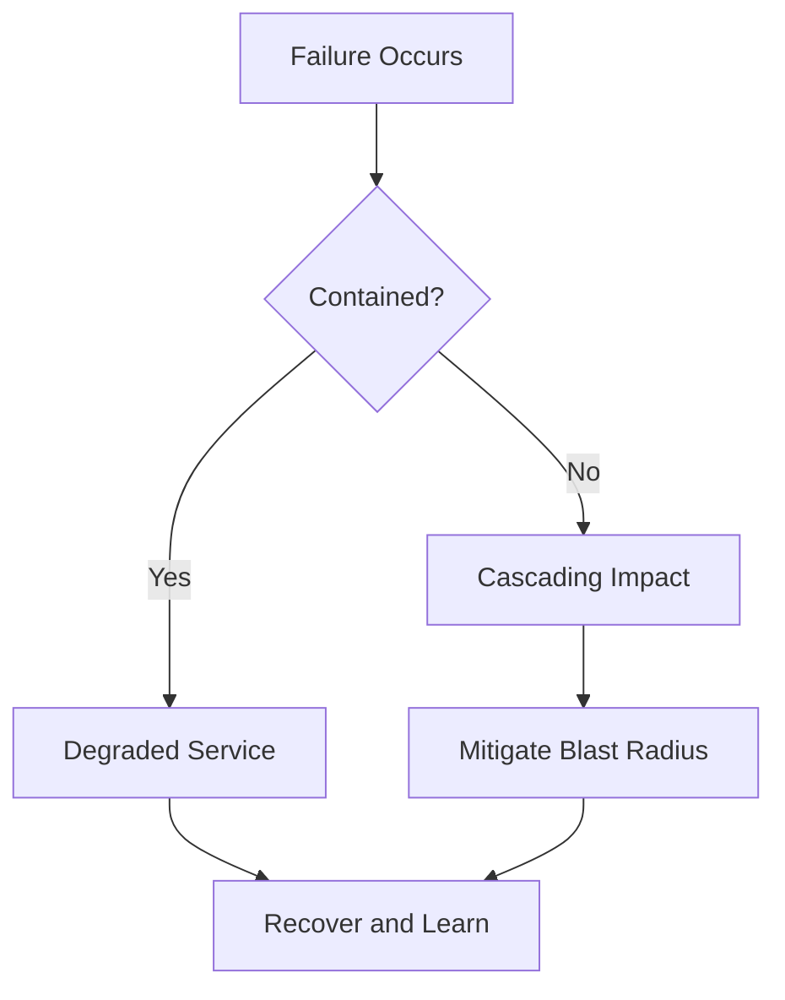
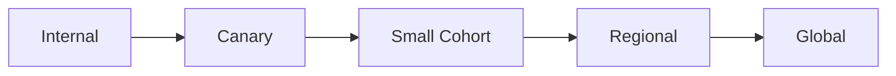
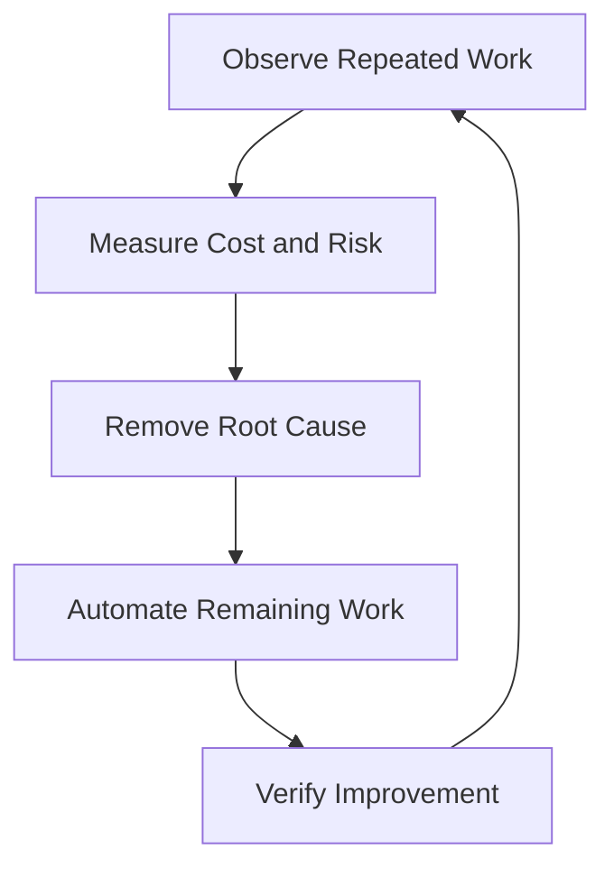
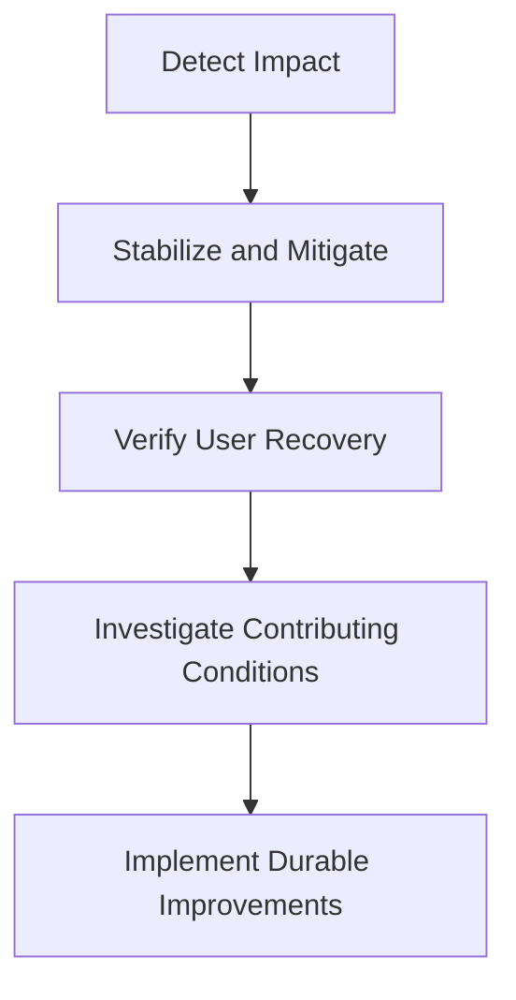
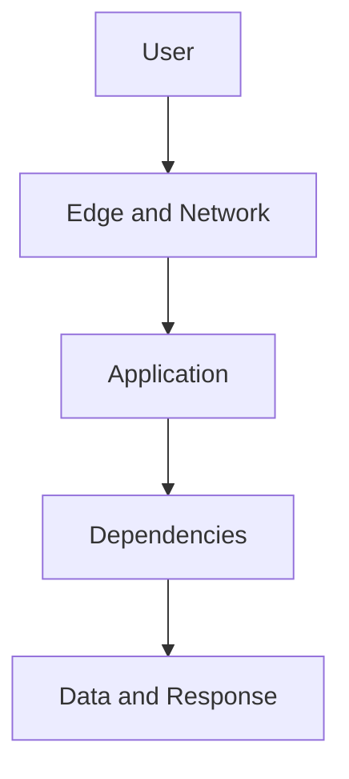
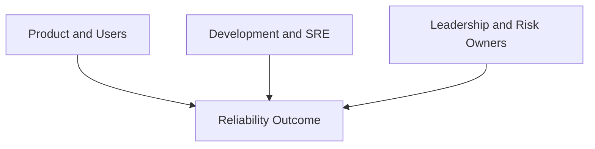

# The SRE Mindset

> The SRE mindset is a disciplined way of making production decisions under uncertainty. It begins with user impact, uses evidence to evaluate risk, treats failure as expected, protects sustainable engineering capacity, and converts operational experience into safer systems.

## Chapter Purpose

SRE is not defined by a job title, a monitoring platform, a cloud provider, or a collection of automation scripts. Two engineers can use the same tools and operate very differently. One may react to every alert, pursue perfect uptime, depend on heroics, and repeat the same manual recovery. The other may define reliability from the user’s perspective, measure the right signals, make risk explicit, automate recurring work, design recovery, and learn from incidents.

The difference is the operating mindset.

This chapter explains how an SRE thinks about:

- Users and service outcomes
- Reliability and acceptable risk
- Evidence and uncertainty
- Failure and recovery
- Change and error budgets
- Ownership and shared responsibility
- Toil and automation
- Incidents and learning
- Simplicity and complexity
- Capacity, cost, and performance
- Human limits and sustainable operations
- Security and reliability
- Short-term mitigation and long-term engineering

The mindset is practical. It should change how an engineer designs a service, reviews a release, responds to an incident, prioritizes work, and communicates risk.

---

## Learning Objectives

After completing this chapter, you should be able to:

1. Define the SRE mindset without reducing it to tools or personality traits.
2. Begin reliability analysis with users and critical service behaviors.
3. Distinguish facts, hypotheses, assumptions, and decisions during production work.
4. Explain why reliability is a risk-management problem rather than a pursuit of perfection.
5. Use SLOs and error budgets as decision mechanisms.
6. Treat failure as an expected system condition and design for recovery.
7. Distinguish toil reduction from indiscriminate automation.
8. Balance immediate restoration with permanent improvement.
9. Replace hero culture with sustainable systems and shared knowledge.
10. Apply systems thinking to incidents and recurring failure.
11. Explain why simplicity, observability, and reversibility reduce operational risk.
12. Evaluate real production decisions using an SRE reasoning framework.

---

## 1. What the SRE Mindset Means

The SRE mindset is a set of reasoning habits used to operate services reliably.

It asks:

- Who depends on this service?
- What do those users need to succeed?
- How do we know whether the service is meeting that need?
- What level of failure can users and the organization tolerate?
- What can fail, and how will the service behave when it does?
- How quickly can we detect, mitigate, and recover?
- What evidence supports the current diagnosis?
- Is the response reducing user harm or merely changing an internal metric?
- Will this work recur?
- What engineering change would remove or contain the problem?
- Is the operating model sustainable for the people involved?

This mindset is visible in decisions, not slogans.

An organization does not demonstrate an SRE mindset because it says:

- Reliability matters.
- We automate everything.
- We have an SRE team.
- We use Kubernetes.
- We are blameless.
- We have dashboards.

It demonstrates the mindset when reliability evidence changes priorities, releases, architecture, staffing, incident response, and investment.

---

## 2. The Core SRE Reasoning Loop

A useful SRE reasoning loop has six parts.



### User Outcome

Identify the behavior that matters to a user or dependent service.

### Reliability Evidence

Measure whether that behavior is occurring at the required level.

### Risk Decision

Decide whether the present risk is acceptable and what tradeoff should be made.

### Engineering Action

Mitigate harm, improve the system, or deliberately accept the risk.

### Verification

Confirm that the action produced the intended outcome and introduced no unacceptable side effects.

### Learning

Use the result to improve architecture, automation, documentation, objectives, and future decisions.

Skipping a stage weakens the loop. For example:

- Measurement without a decision creates dashboards with no operational value.
- Action without verification creates false confidence.
- Incident recovery without learning allows recurrence.
- Automation without a user outcome can accelerate the wrong behavior.

---

## 3. Start With the User, Not the Machine

An SRE does not begin with CPU, pods, nodes, or dashboards. The engineer begins with the service’s intended behavior.

Suppose a payment service reports:

- All hosts are reachable.
- CPU utilization is 35 percent.
- The database is accepting connections.
- The deployment is healthy.

These signals do not prove that customers can complete payments.

Customers may still experience:

- Rejected transactions
- Duplicate charges
- Excessive confirmation latency
- Incorrect currency conversion
- Missing receipts
- Failures limited to one payment method
- Timeouts between internal dependencies

Infrastructure health is evidence, but it is not the final reliability outcome.

### User-Centered Questions

For every service, ask:

1. Who is the user?
2. What action is the user trying to complete?
3. What constitutes a successful result?
4. What latency is acceptable?
5. Which failures are most harmful?
6. Are some user groups affected differently?
7. Which internal signals best represent that experience?

The user may be a person, an application, a data pipeline, an internal team, or another system.

---

## 4. Reliability Is Not Perfection

SRE rejects the unexamined goal of perfect reliability.

One hundred percent reliability is usually:

- Impossible to guarantee
- Disproportionately expensive
- Restrictive to necessary change
- Difficult to measure honestly
- Unnecessary when users cannot perceive the difference

Google’s SRE guidance describes reliability as a risk-management problem. An SLO below 100 percent creates an error budget and makes room for controlled change. See [Embracing Risk](https://sre.google/sre-book/embracing-risk/) and [Service Level Objectives](https://sre.google/sre-book/service-level-objectives/).

The SRE question is not:

> How do we prevent every failure?

It is:

> What reliability level serves users and the business, what risks threaten it, and how should limited engineering effort be allocated?

### The Cost Curve

Increasing reliability can require:

- More redundancy
- More capacity
- Stronger testing
- Slower or safer releases
- More operational coverage
- More complex recovery mechanisms
- Greater engineering investment

The last fraction of reliability may cost far more than earlier improvements. The correct target depends on user need, not prestige.

---

## 5. Make Reliability Explicit

Vague goals create conflicting decisions.

Statements such as these are not operational objectives:

- The service should be highly available.
- Latency should be low.
- Outages should be rare.
- Customers should not notice problems.

An SRE mindset converts expectations into measurable service behavior.

Example:

> During a rolling 28-day period, 99.9 percent of valid checkout attempts should complete successfully within 2 seconds, measured at the public service boundary.

This statement identifies:

- The event being measured
- The definition of success
- A latency threshold
- A target
- A time window
- A measurement location

Once reliability is explicit, teams can debate the target, validate the measurement, calculate the error budget, and make decisions.

---

## 6. Error Budgets Turn Values Into Decisions

An error budget represents the amount of unreliability allowed by an SLO.

For a request-based SLO:

```text
Error budget fraction = 1 - SLO target
Allowed bad events = Total eligible events × Error budget fraction
```

For example, if a service has 2,000,000 eligible requests and a 99.9 percent success SLO:

```text
Error budget fraction = 1 - 0.999 = 0.001
Allowed bad requests = 2,000,000 × 0.001 = 2,000
```

The important part is not the formula. The important part is the decision it enables.

### When the Budget Is Healthy

The team may accept more change risk, run experiments, or increase release velocity.

### When the Budget Is Burning Too Quickly

The team should investigate the main sources of unreliability and reduce risk.

### When the Budget Is Exhausted

The organization should follow an agreed policy. That may include restricting risky releases and prioritizing reliability work.

An error budget is not permission to create avoidable incidents. It is a mechanism for balancing progress and reliability with evidence.

Google Cloud’s monitoring guidance defines an error budget as the difference between the SLO and perfect service and explains how it can guide risky actions such as deployments. See [Concepts in service monitoring](https://cloud.google.com/monitoring/service-monitoring/concepts).

---

## 7. Treat Risk as a First-Class Engineering Object

Risk should not remain an unspoken feeling.

An SRE identifies:

- The failure scenario
- The affected users
- The probability or exposure
- The likely impact
- Existing controls
- Detection capability
- Recovery capability
- Residual risk
- The owner of the decision

A simple qualitative model is:

```text
Risk = Likelihood × Impact
```

This is useful for prioritization, but real production risk may also depend on:

- Duration
- Blast radius
- Detectability
- Recoverability
- Data integrity
- Regulatory consequences
- Timing
- Dependency concentration
- Human workload

### Risk Questions Before a Change

- How many users can this affect?
- Is the change reversible?
- How quickly will failure be detected?
- Can the rollout be limited?
- Is rollback tested?
- Does the team have sufficient capacity to respond?
- Is the current error budget healthy?
- Are dependencies stable?
- What evidence would stop the rollout?

The goal is not zero risk. The goal is understood, bounded, and deliberately accepted risk.

---

## 8. Separate Facts, Hypotheses, Assumptions, and Decisions

Production incidents create pressure to speak quickly. That pressure can cause guesses to become accepted facts.

Use four explicit categories.

| Category | Meaning | Example |
| --- | --- | --- |
| Fact | Directly supported by current evidence | Checkout errors rose from 0.1 percent to 14 percent at 10:42 UTC. |
| Hypothesis | Testable explanation | The new API version may be rejecting older mobile clients. |
| Assumption | Belief currently used without sufficient proof | The database is probably healthy because no database alert fired. |
| Decision | Chosen action based on current information | Pause the rollout and route traffic to the previous version. |

An SRE communicates uncertainty honestly.

Good incident language includes:

- We observe...
- The evidence currently supports...
- We have not yet confirmed...
- Our leading hypothesis is...
- We will test it by...
- We chose this mitigation because...
- We will reverse the action if...

This prevents premature certainty and makes reasoning reviewable.

---

## 9. Measure What Supports a Decision

More telemetry does not automatically create better reliability.

Every important signal should support at least one question or action.

Examples:

| Signal | Question | Possible action |
| --- | --- | --- |
| Checkout success SLI | Are customers completing purchases? | Stop rollout, fail over, or investigate dependency failures. |
| Error-budget burn rate | Is unreliability consuming the budget too quickly? | Page, open an incident, or prioritize reliability work. |
| Queue age | Are jobs waiting beyond user tolerance? | Add capacity, shed load, or correct a blocked consumer. |
| Replication lag | Could reads be stale or failover be unsafe? | Route reads, reduce write pressure, or delay maintenance. |
| On-call pages per shift | Is the operating model sustainable? | Remove noisy alerts or prioritize toil reduction. |

Avoid collecting metrics only because they are easy to collect.

### A Useful Test

For each alert or dashboard panel, ask:

1. What user or service risk does this represent?
2. Who is expected to act?
3. What action can they take?
4. How urgent is that action?
5. What happens if nobody responds?

If these questions have no answer, the signal may be noise.

---

## 10. Expect Failure

SRE assumes that components, dependencies, networks, processes, and people will fail.

Expected failure does not mean careless engineering. It means avoiding designs that require every component and action to be perfect.

Potential failures include:

- A machine stops responding.
- A zone becomes unavailable.
- A dependency slows down.
- A certificate expires.
- A configuration is incorrect.
- A deployment introduces regression.
- Traffic grows unexpectedly.
- An operator selects the wrong target.
- Monitoring becomes unavailable.
- Backups cannot be restored.
- A retry storm amplifies an outage.

The reliability question becomes:

> When this fails, what happens next?

### Failure-Oriented Design



Good systems make common failures:

- Detectable
- Contained
- Recoverable
- Observable
- Testable
- Understandable

---

## 11. Design for Recovery, Not Only Prevention

Prevention reduces the probability of failure. Recovery reduces its duration and impact. Both matter.

A team that invests only in prevention may create brittle confidence. When an unexpected failure occurs, recovery is slow because failover, rollback, restoration, and communication were never exercised.

Recovery design includes:

- Tested rollback
- Graceful degradation
- Traffic shifting
- Failover
- Load shedding
- Circuit breaking
- Data restoration
- Dependency isolation
- Emergency access
- Clear incident roles
- Practiced runbooks
- Known recovery objectives

### Recovery Questions

- Can the service operate in a reduced mode?
- Can unsafe functionality be disabled independently?
- Can traffic be moved away from the failure?
- Are recovery procedures tested under realistic conditions?
- Does restoration preserve data correctness?
- How will the team know recovery is complete?

Recovery is not complete when the graph looks normal. It is complete when user-facing behavior is restored, data is safe, backlogs are controlled, and the service is stable.

---

## 12. Control Blast Radius

Blast radius describes the extent of impact caused by a failure or change.

SREs reduce blast radius through:

- Small rollout stages
- Canary releases
- Regional isolation
- Cell-based architecture
- Tenant isolation
- Feature flags
- Rate limits
- Resource quotas
- Dependency timeouts
- Bulkheads
- Permission boundaries
- Separate administrative domains

A change that can affect every customer instantly requires stronger evidence than a change initially exposed to one percent of traffic.

### Progressive Exposure



At each stage, the team should define:

- Entry criteria
- Health signals
- Observation time
- Abort conditions
- Rollback method
- Decision owner

---

## 13. Prefer Reversible Change

Change is a major source of production risk. The SRE mindset does not stop change. It makes change safer.

A reversible change has:

- A known previous state
- A tested rollback path
- Compatible data behavior
- Limited blast radius
- Clear success and failure criteria
- Sufficient observability

Irreversible or difficult-to-reverse changes require additional controls.

Examples include:

- Destructive schema changes
- Data migrations
- Credential revocation
- Security policy changes
- Protocol removal
- Large dependency upgrades
- Global configuration changes

For these changes, use techniques such as:

- Expand-and-contract migrations
- Dual reading or writing where appropriate
- Backups and restoration tests
- Shadow traffic
- Compatibility periods
- Staged deprecation
- Explicit checkpoints

Rollback should not be treated as failure. A fast rollback is often evidence that the safety system worked.

---

## 14. Automate Judgment Carefully

SRE values automation, but automation is not automatically safe.

Automation can:

- Remove repetitive work
- Improve consistency
- Reduce response time
- Enforce guardrails
- Scale operations
- Preserve knowledge

Automation can also:

- Repeat a mistake at high speed
- Expand blast radius
- Hide assumptions
- Fail silently
- Remove useful human review
- Create complex dependencies
- Become unowned production software

Before automating, understand:

1. The purpose of the task.
2. Its inputs and preconditions.
3. Its failure modes.
4. Its safe boundaries.
5. Its observability.
6. Its rollback or recovery behavior.
7. Its owner.

The strongest automation is usually bounded, observable, testable, idempotent where appropriate, and safe to interrupt.

---

## 15. Eliminate Toil, Not All Operations

Google’s SRE book describes toil as operational work that is manual, repetitive, automatable, tactical, lacks enduring value, and scales with service growth. See [Eliminating Toil](https://sre.google/sre-book/eliminating-toil/).

Not every operational task is toil.

Examples that may be valuable engineering work include:

- Investigating a new failure mode
- Designing a recovery mechanism
- Conducting a production readiness review
- Improving an SLO
- Testing a restore procedure
- Building a safe deployment control
- Analyzing capacity behavior

Examples likely to be toil include:

- Restarting the same failed process every day
- Manually approving routine safe changes with no judgment
- Repeating account updates that could be safely automated
- Responding to non-actionable alerts
- Reconstructing the same status report by hand

### Toil Reduction Loop



Do not automate a broken process before asking whether the process should exist.

---

## 16. Protect Engineering Capacity

Operational demand expands easily. If every incident, ticket, alert, and request receives immediate attention, the team loses the time needed to improve the system.

SRE therefore treats engineering capacity as a reliability resource.

Protect it by:

- Measuring toil
- Rotating operational duties
- Defining support boundaries
- Removing non-actionable alerts
- Reserving engineering time
- Assigning owners to recurring problems
- Limiting service intake
- Requiring production readiness
- Escalating unsustainable demand

An overloaded team cannot reliably operate an increasingly complex system.

### Capacity Is More Than Headcount

Team capacity also depends on:

- Cognitive load
- Interrupt frequency
- Documentation quality
- Tool reliability
- Service complexity
- On-call intensity
- Knowledge distribution
- Meeting load
- Recovery time after incidents

Adding engineers without changing the operating system may only distribute dysfunction.

---

## 17. Reject Hero Culture

Hero culture depends on extraordinary individual effort to compensate for weak systems.

Common signs include:

- One person can resolve every serious incident.
- Recovery depends on undocumented commands.
- Engineers are praised for repeated overnight interventions.
- Unsafe emergency access becomes routine.
- Exhaustion is treated as commitment.
- The same experts are always paged.
- Preventive work is repeatedly delayed.

Heroic action may be necessary during an emergency. It must not become the operating model.

The SRE response is to convert personal knowledge and repeated rescue into:

- Safer architecture
- Runbooks
- Automation
- Training
- Shared ownership
- Better alerts
- Tested recovery
- Reduced complexity

Reliability should improve when experts are unavailable, not collapse.

---

## 18. On-Call Is a Design Feedback System

On-call is not merely after-hours support. It connects service design to production consequences.

Engineers who participate in on-call learn:

- Which failures occur in reality
- Whether alerts are actionable
- Whether diagnostics are sufficient
- Whether runbooks work
- Whether recovery is safe
- Which dependencies are fragile
- Where automation is missing

The value disappears if on-call pain never changes engineering priorities.

### Healthy On-Call

A healthy system has:

- Clear service ownership
- Actionable paging
- Sustainable shift design
- Escalation paths
- Documented response procedures
- Access to required tools
- Psychological safety
- Follow-up ownership
- Time to recover after serious incidents

Google’s guidance emphasizes that on-call load must be sustainable and leave time for engineering work. See [Being On-Call](https://sre.google/sre-book/being-on-call/) and [On-Call](https://sre.google/workbook/on-call/).

---

## 19. Page on Symptoms That Require Urgent Action

A page interrupts a human. It should indicate an urgent condition where prompt action can reduce harm.

Good pages are:

- Relevant to user or service impact
- Actionable
- Urgent
- Owned
- Supported by diagnostic context

Poor pages include:

- A CPU threshold with no demonstrated service impact
- A warning that resolves before anyone can act
- A condition owned by no team
- A duplicate of several other pages
- An informational event sent to the emergency channel

Use tickets, dashboards, reports, or logs for conditions that do not require immediate interruption.

### Alert Review Questions

1. What action did the responder take?
2. Did the page arrive before users experienced unacceptable harm?
3. Would delaying response have mattered?
4. Could automation safely perform the response?
5. Did several alerts represent one underlying incident?
6. Should the alert threshold or SLI change?

Alert quality is part of service quality.

---

## 20. Restore Service Before Pursuing Complete Explanation

During an active incident, the primary objective is to reduce user harm.

The team may not yet know the full cause. A safe mitigation can still be correct.

Examples:

- Roll back a recent deployment.
- Disable a failing feature.
- Shift traffic.
- Add temporary capacity.
- Reject noncritical work.
- Isolate a dependency.
- Restore from a known state.

Diagnosis and mitigation should occur in parallel where staffing permits.



Do not delay a low-risk rollback solely to prove the root cause. Also do not make a risky mitigation without considering whether it could increase impact.

---

## 21. Use Systems Thinking

Production outcomes usually emerge from interactions among software, infrastructure, processes, incentives, interfaces, and people.

A narrow explanation might say:

> The engineer entered the wrong value.

A systems analysis asks:

- Why could one value affect the entire service?
- Why was there no validation?
- Why was the change global?
- Why was review ineffective?
- Why did monitoring miss the early signal?
- Why was rollback slow?
- Why did the procedure depend on memory?
- What conditions made the action reasonable at the time?

The person’s action is part of the event. It is rarely the complete explanation.

### Layers of Analysis

| Layer | Example question |
| --- | --- |
| Technical | Which interaction produced the failure? |
| Control | Which guardrail failed or was absent? |
| Operational | How did detection and response affect duration? |
| Organizational | Which ownership or incentive shaped the decision? |
| Human | What information and constraints did responders have? |
| Historical | Why had known risk remained unresolved? |

Systems thinking produces stronger corrective actions than blame.

---

## 22. Blameless Does Not Mean Accountless

A blameless review avoids punishment-based explanations and seeks conditions that can be improved.

It does not mean:

- Ignoring reckless behavior
- Hiding decisions
- Avoiding standards
- Removing ownership
- Treating every action as acceptable
- Refusing to examine human contribution

Accountability means:

- Recording what happened accurately
- Explaining decisions and context
- Assigning improvement owners
- Completing corrective work
- Updating controls
- Checking whether changes worked

Blame asks who deserves punishment. Learning asks how the system produced the outcome and how recurrence or impact can be reduced.

Google’s postmortem guidance emphasizes learning from significant incidents and using actionable follow-up work. See [Postmortem Culture](https://sre.google/sre-book/postmortem-culture/).

---

## 23. Learn From Success as Well as Failure

Incident reviews study what went wrong. SREs should also examine what prevented greater harm.

Questions include:

- Which detection signal worked?
- Which boundary contained impact?
- Which fallback preserved service?
- Which responder action shortened the incident?
- Which documentation was useful?
- Which earlier investment made recovery possible?
- Where did the system adapt successfully?

This matters because removing an apparently unused safeguard can eliminate a control that quietly prevented failure.

Near misses are also valuable. A near miss exposes a dangerous condition before maximum harm occurs.

---

## 24. Prefer Simple Systems

Complexity increases the number of components, interactions, states, dependencies, and assumptions an operator must understand.

Complexity can be necessary. Accidental complexity is not.

Before adding a component, ask:

- Which user or reliability problem does it solve?
- Can an existing mechanism solve the problem?
- Who will operate it?
- How will it fail?
- How will it be observed?
- What new dependencies does it add?
- Can it be removed safely?

Simplicity improves:

- Diagnosability
- Testability
- Recovery
- Change safety
- Knowledge sharing
- Capacity planning
- Security review

Google’s SRE guidance identifies simplicity as important for reliable systems because every component carries operational cost. See [Simplicity](https://sre.google/sre-book/simplicity/).

---

## 25. Understand the Whole Service Path

Local component health can hide end-to-end failure.

An SRE maps the critical request path.



For each stage, understand:

- Ownership
- Timeouts
- Retries
- Capacity limits
- Failure behavior
- Telemetry
- Security controls
- Degradation options
- Recovery procedures

Reliability is a property of the path the user depends on, not the average health of isolated components.

---

## 26. Dependencies Are Part of Your Reliability

A service cannot outsource all responsibility for a dependency’s failure.

Even when another team or vendor owns a dependency, the consuming service owns decisions about:

- Timeout behavior
- Retry policy
- Caching
- Fallback
- Redundancy
- Request shaping
- Data validation
- Failure communication
- Dependency SLO alignment

Blind retries can amplify load. Long timeouts can exhaust resources. A fallback can return incorrect data. Redundancy can fail if both paths share a hidden dependency.

An SRE asks not only whether a dependency is reliable, but how the service behaves when that dependency is slow, incorrect, unavailable, or partially degraded.

---

## 27. Capacity Is a Reliability Concern

Capacity failure is often predictable, but only if demand and limits are understood.

Capacity planning considers:

- Current demand
- Growth rate
- Peak behavior
- Seasonal events
- Provisioning delay
- Resource limits
- Dependency limits
- Redundancy requirements
- Failover load
- Safety margin
- Cost

A system that survives normal traffic but fails when one zone is lost may not have adequate failover capacity.

### Capacity Questions

- What is the limiting resource?
- What happens as the limit approaches?
- Is degradation gradual or sudden?
- How long does new capacity take to become usable?
- Does autoscaling depend on a signal that arrives too late?
- Can noncritical work be shed?
- Has failover capacity been tested?

Capacity should be evaluated before users discover the limit.

---

## 28. Performance Is Part of Correctness

A service that returns the correct answer after the user has abandoned the request is not reliably serving that user.

SREs treat latency and throughput as service behaviors, not cosmetic improvements.

Performance analysis should consider:

- Tail latency, not only averages
- User segments
- Request types
- Cold starts
- Queue time
- Dependency latency
- Retry amplification
- Resource contention
- Geographic distance
- Degraded modes

An average can hide severe impact. If most requests complete in 100 milliseconds but a critical one percent take 30 seconds, that tail may define the user experience for important workflows.

---

## 29. Correctness and Data Integrity Matter

Availability alone is an incomplete reliability measure.

A service may be reachable while it:

- Returns stale results
- Corrupts records
- Duplicates transactions
- Drops events
- Reorders operations incorrectly
- Applies the wrong authorization
- Produces inconsistent views

Data failures can be more serious than visible downtime because they may persist after the service appears recovered.

An SRE mindset asks:

- What does a correct result mean?
- How is integrity checked?
- Can operations be replayed safely?
- Are requests idempotent where needed?
- How are partial writes handled?
- Can restoration be verified?
- How will affected records be identified?

Recovery must include correctness validation, not only process health.

---

## 30. Security and Reliability Reinforce Each Other

Security controls can affect availability, and reliability failures can weaken security.

Examples include:

- Expired credentials causing outage
- Emergency access bypassing audit controls
- Excessive permissions increasing blast radius
- A denial-of-service event exhausting capacity
- Secret rotation breaking dependencies
- Security patches introducing regression
- Logging sensitive data during incident diagnosis

The mindset should avoid treating security as an obstacle to uptime or reliability as an excuse to bypass security.

Strong joint practices include:

- Least privilege
- Controlled emergency access
- Safe credential rotation
- Auditable automation
- Dependency verification
- Abuse resistance
- Secure defaults
- Recovery from compromise
- Joint incident exercises

Google’s [Building Secure and Reliable Systems](https://sre.google/books/building-secure-reliable-systems/) examines the shared principles between security and reliability engineering.

---

## 31. Reliability Is a Shared Responsibility

An SRE team cannot create a reliable service alone.

Product and development teams influence:

- Architecture
- Code quality
- Dependency selection
- Release behavior
- Test coverage
- User expectations
- Feature complexity

SRE teams may contribute:

- Reliability objectives
- Production expertise
- Incident response
- Automation
- Capacity analysis
- Observability
- Reliability reviews
- Risk controls

Leadership controls priorities, staffing, incentives, and acceptable business risk.



Shared responsibility does not mean unclear responsibility. Every service, objective, incident role, and corrective action still needs an owner.

---

## 32. SRE Must Be Able to Say No With Evidence

An SRE may need to oppose a release, architecture decision, or service intake when risk is unacceptable.

The refusal should not rely on personal authority alone.

Strong reasoning includes:

- The affected SLO
- Current error-budget condition
- Known failure mode
- Missing recovery control
- Unbounded blast radius
- Insufficient capacity
- Unsustainable on-call load
- Unresolved high-severity risk
- Specific conditions required to proceed

Example:

> The checkout service has consumed 92 percent of its monthly error budget, and the proposed migration has no tested rollback. We should delay global rollout. We can proceed with a one-percent canary after restoration is tested and the burn rate returns within policy.

This is more useful than saying the change feels dangerous.

---

## 33. Reliability Work Must Compete Transparently

Feature work and reliability work consume the same limited engineering capacity.

Hidden negotiation produces recurring conflict. Transparent prioritization uses:

- SLO performance
- Error-budget policy
- Incident frequency
- User impact
- Toil cost
- Capacity forecasts
- Security exposure
- Recovery gaps
- Business criticality

Reliability work should not be justified only by fear. Connect it to reduced user harm, protected revenue, lower operating cost, faster recovery, safer delivery, or reduced regulatory risk.

The objective is not to win every priority dispute. It is to make the tradeoff explicit and assign the risk to someone authorized to accept it.

---

## 34. Build Guardrails, Not Gatekeeping

Manual approval can slow delivery without meaningfully reducing risk.

Guardrails make the safe path easier and enforce important boundaries automatically.

Examples include:

- Automated policy checks
- Progressive deployment defaults
- Standard SLO templates
- Safe infrastructure modules
- Tested rollback mechanisms
- Resource limits
- Permission boundaries
- Production readiness criteria
- Automated backup verification

A gatekeeper asks teams to wait for an expert. A guardrail helps teams act safely without waiting for routine approval.

Some high-risk changes still require human review. The mindset is to reserve scarce judgment for decisions where judgment adds value.

---

## 35. Standardize Repetition, Preserve Context

Standards improve reliability when they reduce unnecessary variation.

Useful standards include:

- Incident severity definitions
- Service metadata
- SLO format
- Alert fields
- Deployment controls
- Runbook structure
- Postmortem format
- Ownership records

However, forcing every service into one technical design can ignore important context.

An internal batch pipeline and a customer authentication API may require different:

- SLOs
- Paging policies
- Recovery objectives
- Capacity models
- Deployment strategies

Standardize the reasoning and minimum controls. Allow implementation to reflect service risk.

---

## 36. Document for Action

Operational documentation should help someone make a safe decision under pressure.

A useful runbook includes:

- Purpose and scope
- Trigger conditions
- Required access
- Safety warnings
- Diagnostic steps
- Expected output
- Decision branches
- Mitigation steps
- Verification
- Escalation
- Rollback
- Owner and review date

Avoid unexplained command lists. A responder must know:

- Why a command is being run
- Which target it affects
- What good and bad output look like
- Whether it changes state
- How to reverse its effects

Documentation that is never tested creates false confidence.

---

## 37. Verify Every Change and Recovery

Execution is not proof of success.

After an action, verify:

- User-facing behavior
- SLI recovery
- Error rate and latency
- Data correctness
- Dependency health
- Backlog behavior
- Resource saturation
- Geographic and tenant impact
- New alerts
- Whether the system remains stable over time

Example:

Restarting a failed worker is an action. Verification requires confirming that:

- The worker remains healthy.
- Queue age is declining.
- Jobs are completing correctly.
- Duplicate processing did not occur.
- The underlying failure is understood or contained.

The phrase “the command succeeded” is not the same as “the service recovered.”

---

## 38. Temporary Mitigation Must Create Follow-Up

Temporary actions are often necessary during incidents. They become dangerous when they silently become permanent.

Examples include:

- Disabling a safety check
- Increasing a timeout
- Adding emergency capacity
- Granting broader permissions
- Turning off a feature
- Muting an alert
- Running a manual repair

Every temporary mitigation should record:

- Why it was needed
- What risk it introduces
- Its owner
- Its expiration or review date
- The permanent corrective action
- How removal will be verified

Without this discipline, temporary work accumulates into hidden production risk.

---

## 39. Use Automation to Create Feedback, Not Blindness

Self-healing can shorten incidents, but it can also conceal recurring failure.

If a process restarts 40 times each day and users remain unaffected, the automation is containing impact. It is not proof that the system is healthy.

Good remediation automation should expose:

- Trigger reason
- Action taken
- Target affected
- Result
- Frequency
- Failure to remediate
- User impact
- Escalation threshold

Automation should generate evidence for engineering improvement.

---

## 40. Think in Feedback Loops

Reliability emerges from feedback loops.

### Fast Loops

- Health check detects failure and removes an instance.
- Canary analysis stops a rollout.
- Rate limiting contains overload.
- Paging initiates human response.

### Medium Loops

- Incident follow-up improves an alert.
- Weekly error-budget review changes release plans.
- Capacity forecasts trigger provisioning.

### Slow Loops

- Architecture changes reduce dependency concentration.
- Team structure changes clarify ownership.
- Reliability policy changes incentives.

Ask whether each loop is:

- Measuring the right condition
- Fast enough
- Stable
- Owned
- Capable of correction
- Producing unintended behavior

A delayed or noisy loop can make a stable system unstable.

---

## 41. Production Scenario: Healthy Infrastructure, Broken Checkout

### Situation

All hosts are green. CPU and memory are normal. The checkout success rate falls from 99.95 percent to 82 percent for users of one mobile application version.

### Weak Response

The operations team closes the alert because infrastructure appears healthy.

### SRE Response

1. Declare user impact based on the checkout SLI.
2. Segment failures by client version, region, and payment method.
3. Compare the start time with recent changes.
4. Pause or reverse the suspected API rollout.
5. Verify checkout recovery for the affected cohort.
6. Examine why infrastructure-only monitoring did not represent the critical journey.
7. Add or improve client-segmented reliability evidence.

### Mindset Lesson

The service boundary and user outcome define reliability. Component health provides supporting evidence.

---

## 42. Production Scenario: The Successful Rollback

### Situation

A canary deployment causes latency to rise and burns the error budget at 20 times the sustainable rate. Automation stops the rollout and returns the canary to the previous version. Only 0.5 percent of traffic was exposed.

### Incorrect Interpretation

The release team labels the deployment a failure because it was rolled back.

### SRE Interpretation

The software change contained a defect, but the delivery safety system succeeded.

The system:

- Limited exposure
- Detected the user-facing symptom
- Stopped expansion
- Reversed safely
- Preserved most of the error budget

### Follow-Up

The team should fix the defect and examine whether preproduction testing could detect it earlier. It should not weaken the canary control to improve deployment-success statistics.

---

## 43. Production Scenario: Automation Amplifies an Error

### Situation

An automated cleanup job is intended to remove expired test resources. A faulty environment selector includes production resources. The job begins deleting them across several regions.

### SRE Analysis

The failure is not merely a bad script. Examine:

- Why production was within the job’s permission scope
- Why selection had no preview
- Why deletion was not rate-limited
- Why there was no regional staging
- Why a destructive action lacked a confirmation boundary
- How quickly the action was detected
- Whether deleted resources can be reconstructed

### Better Controls

- Least-privilege credentials
- Explicit production exclusion
- Dry-run output
- Deletion quotas
- Staged execution
- Recoverable deletion where possible
- Audit events and rapid alerting
- Tested reconstruction

### Mindset Lesson

Automation multiplies both correct and incorrect intent. Bound its authority and blast radius.

---

## 44. Production Scenario: Repeated Overnight Heroics

### Situation

A senior engineer manually repairs a database replication problem several nights each month. Leadership praises the rapid recovery, but the corrective project is repeatedly postponed.

### SRE Analysis

The organization is consuming human reliability as if it were unlimited.

Risks include:

- Key-person dependency
- Burnout
- Inconsistent repair
- Delayed response when the expert is unavailable
- Hidden data risk
- No reduction in recurrence

### SRE Response

1. Measure frequency, duration, user impact, and labor cost.
2. Document and train the immediate recovery procedure.
3. Improve detection and safe mitigation.
4. Identify the recurring technical conditions.
5. Prioritize a permanent correction using reliability evidence.
6. Track whether recurrence falls.

### Mindset Lesson

Fast rescue is useful. Repeated rescue without system improvement is operational failure.

---

## 45. Production Scenario: Error Budget Conflict

### Situation

A product team wants to launch a high-risk feature before a marketing event. The service has already exhausted its 28-day error budget.

### SRE Reasoning

The discussion should include:

- Current SLO performance
- Sources of budget consumption
- Expected launch risk
- Reversibility
- Blast radius
- User and business consequences
- Policy exceptions
- The person authorized to accept residual risk

### Possible Decision

Proceed only with a small, reversible canary that has explicit abort criteria, or delay the launch until risk is reduced.

If leadership accepts an exception, record the decision. Do not disguise it as a technical approval from SRE.

### Mindset Lesson

Error budgets inform governance. They do not remove human responsibility for high-impact decisions.

---

## 46. Production Scenario: A Misleading Average

### Situation

Average API latency remains 180 milliseconds, within the stated target. Premium customers sending large requests experience 12-second latency at the 99th percentile.

### SRE Response

- Identify the critical user segment.
- Review the SLI aggregation.
- Measure the relevant latency distribution.
- Determine whether one traffic class is starved.
- Correct resource allocation or workload isolation.
- Revise the SLO if it does not represent the promised experience.

### Mindset Lesson

Aggregated success can hide concentrated harm. Segment evidence according to meaningful user journeys and risk.

---

## 47. Practical Exercise: Apply the Reasoning Loop

Choose one service and complete the table.

| Stage | Your answer |
| --- | --- |
| User outcome | |
| Reliability evidence | |
| Current risk | |
| Decision | |
| Engineering action | |
| Verification method | |
| Learning mechanism | |

### Evaluation Criteria

Your answer should:

- Name a real user or dependent system.
- Describe behavior rather than component health.
- Use measurable evidence.
- State the risk explicitly.
- Include a reversible or bounded action where possible.
- Verify the user outcome.
- Explain how the learning changes future work.

---

## 48. Practical Exercise: Rewrite Weak Reliability Statements

Rewrite each statement so it can support an engineering decision.

1. The API should be fast.
2. The platform must be highly available.
3. Alerts should fire when something looks wrong.
4. Deployments should be safe.
5. The on-call rotation should not be too busy.

### Example Rewrite

Weak:

> The API should be fast.

Stronger:

> At least 99 percent of valid search requests should return a complete response within 500 milliseconds during a rolling 28-day period, measured at the external API boundary.

The final statement may still require negotiation and validation. Its advantage is that the disagreement can now be specific.

---

## 49. Practical Exercise: Classify Incident Statements

Classify each as fact, hypothesis, assumption, or decision.

1. Error rate increased at 15:06 UTC.
2. The cache deployment caused the failure.
3. The database is probably unaffected.
4. Roll back version 8.4 in the affected region.
5. Requests with payloads above 2 MB fail consistently.
6. Network saturation may explain the timeouts.

### Suggested Answers

1. Fact, if supported by telemetry.
2. Hypothesis until causation is tested.
3. Assumption.
4. Decision.
5. Fact, if reproduced or supported by evidence.
6. Hypothesis.

---

## 50. Practical Exercise: Find the Toil

For one week, record recurring operational work.

Capture:

- Task
- Trigger
- Frequency
- Time spent
- User impact
- Manual steps
- Risk of error
- Whether demand grows with the service
- Root cause
- Candidate removal or automation

Prioritize work that is frequent, risky, interrupts engineers, and scales with growth.

Do not assume the answer is always a script. Possible responses include:

- Remove the requirement.
- Fix the underlying service behavior.
- Change the interface.
- Add a safe self-service path.
- Automate the remaining task.
- Stop providing an unsupported service.

---

## 51. Practical Exercise: Review a Runbook

Select one production runbook and test it in a safe environment.

Check whether it includes:

- A precise trigger
- Prerequisites and access
- Read-only diagnosis before mutation
- Exact target verification
- Warnings for destructive actions
- Expected output
- Branches for different results
- Mitigation
- Rollback
- User-facing verification
- Escalation
- Owner and review date

Record every place where the tester had to guess. Each guess is a documentation defect or an unexpressed dependency.

---

## 52. SRE Mindset Anti-Patterns

### Reliability by Hope

The service has no meaningful objective, failure analysis, or recovery test. Teams assume it will remain available.

### Dashboard Theater

The organization has many graphs but no defined response to the evidence.

### Automation Worship

Automation volume is treated as success even when it increases complexity or risk.

### Permanent Firefighting

Immediate incidents consume all capacity, leaving no time to remove recurring causes.

### Perfect-Uptime Theater

Teams claim 100 percent availability by excluding failures, using weak measurements, or ignoring user segments.

### Alert Everything

Every anomaly interrupts a human, causing fatigue and slower response to real emergencies.

### Root-Cause Reductionism

The review stops after identifying one failed component or human action.

### Blameless Without Follow-Through

The meeting feels safe, but corrective work is not owned or completed.

### Shared Ownership Without Named Owners

Everyone is responsible in theory, so nobody acts in practice.

### Tool-First SRE

The organization buys technology before defining users, service behavior, objectives, and decisions.

---

## 53. A Production Decision Checklist

Before making a significant production decision, ask:

### User and Service

- Which service behavior is affected?
- Which users or dependencies are exposed?
- What is the critical journey?

### Evidence

- What do we know?
- What remains uncertain?
- Which signal best represents impact?
- Is the data current and trustworthy?

### Risk

- What can fail?
- What is the blast radius?
- What is the current error-budget condition?
- Who can accept the residual risk?

### Action

- Is the action reversible?
- Can exposure be staged?
- Are guardrails present?
- What are the abort criteria?

### Recovery

- How will failure be detected?
- How will service be restored?
- Is recovery tested?

### Verification

- What proves success for users?
- How long must the service remain stable?
- What data or backlog checks are required?

### Learning

- What should be documented?
- Which follow-up needs an owner?
- How will recurrence or toil be measured?

---

## 54. Reflection Questions

1. Does your organization define reliability from the user’s perspective or from infrastructure health?
2. Which production decisions are currently based on opinion because evidence is missing?
3. Where does the system depend on one person’s knowledge?
4. Which recurring operational task should be removed rather than automated?
5. Which service has an unbounded failure blast radius?
6. What is the hardest production change to reverse?
7. Which alert most often interrupts responders without causing useful action?
8. Does incident follow-up receive protected engineering time?
9. Which apparently healthy average hides an affected user segment?
10. What temporary mitigation has silently become permanent?
11. Which dependency failure has not been tested?
12. Can leadership explain who accepts reliability risk when delivery proceeds against engineering advice?

---

## 55. Knowledge Check

### 1. What best defines the SRE mindset?

A. Using the newest infrastructure tools  
B. Making evidence-based production decisions around user outcomes and acceptable risk  
C. Preventing all service changes  
D. Moving operations work to a separate team

**Answer: B**

### 2. Why does SRE usually avoid a 100 percent SLO?

A. Monitoring cannot measure availability  
B. Users prefer outages  
C. Perfect reliability is generally unrealistic and removes the explicit budget for controlled risk  
D. SLOs apply only to internal services

**Answer: C**

### 3. Which statement is a hypothesis?

A. Errors rose at 09:14 UTC  
B. Roll back the release  
C. The new connection pool may be causing timeouts  
D. Version 4.2 is deployed in two regions

**Answer: C**

### 4. What is the best first reference point for service reliability?

A. Number of servers  
B. User-facing service behavior  
C. Number of dashboards  
D. Cloud-provider status

**Answer: B**

### 5. What should happen after a temporary incident mitigation?

A. Nothing if graphs return to normal  
B. Delete the incident record  
C. Record its risk, owner, review date, and permanent follow-up  
D. Make it permanent immediately

**Answer: C**

### 6. Which is the strongest paging condition?

A. Any metric changes  
B. A condition requires urgent human action to limit service harm  
C. CPU exceeds 50 percent  
D. A deployment completes

**Answer: B**

### 7. Why is a rollback not automatically a failed operational outcome?

A. Rollbacks require no investigation  
B. A safe rollback can prove that release guardrails detected and contained risk  
C. Rollbacks do not affect users  
D. Every deployment should be rolled back

**Answer: B**

### 8. What is wrong with hero culture?

A. Experienced engineers should not respond to incidents  
B. It makes repeated extraordinary effort a substitute for reliable systems and shared knowledge  
C. It prevents all manual work  
D. It increases documentation

**Answer: B**

### 9. What does blameless incident analysis require?

A. Ignoring human decisions  
B. Avoiding ownership  
C. Studying system conditions while assigning and completing improvements  
D. Keeping the event private

**Answer: C**

### 10. What is the best automation candidate?

A. A poorly understood destructive process  
B. A frequent, understood, bounded, testable task with clear safety controls  
C. Every human decision  
D. A task with no owner

**Answer: B**

### 11. Why should SREs examine tail latency?

A. Averages always overstate impact  
B. Tail behavior can expose severe harm hidden by an acceptable average  
C. Tail latency measures cost only  
D. It replaces availability measurement

**Answer: B**

### 12. What is the final verification after a recovery action?

A. The command exited with status zero  
B. The operator received no terminal error  
C. User-facing behavior, data, backlogs, dependencies, and stability meet expectations  
D. The incident channel becomes quiet

**Answer: C**

---

## 56. Completion Checklist

You have completed this chapter when you can:

- [ ] Define the SRE mindset as a decision system.
- [ ] Start reliability analysis with user outcomes.
- [ ] Explain why reliability is managed risk rather than perfection.
- [ ] Distinguish facts, hypotheses, assumptions, and decisions.
- [ ] Connect an SLO and error budget to an operational decision.
- [ ] Identify and bound blast radius.
- [ ] Explain why reversibility improves change safety.
- [ ] Evaluate whether automation is safe and useful.
- [ ] Distinguish toil from valuable operational engineering.
- [ ] Explain why on-call should drive system improvement.
- [ ] Separate mitigation, recovery, diagnosis, and prevention.
- [ ] Apply systems thinking without removing accountability.
- [ ] Identify hero culture and propose a sustainable alternative.
- [ ] Verify recovery through user-facing evidence.
- [ ] Use the production decision checklist on a real service.

---

## 57. Key Takeaways

1. SRE begins with the service behavior users depend on.
2. Reliability is an explicit risk decision, not a promise of perfection.
3. SLOs and error budgets connect measurement to action.
4. Facts, hypotheses, assumptions, and decisions must remain distinct.
5. Failure should be detectable, contained, recoverable, and instructive.
6. Reversible, staged change reduces production risk.
7. Automation needs boundaries, ownership, observability, and recovery.
8. Toil reduction protects the engineering capacity required for improvement.
9. On-call should create design feedback, not permanent human dependency.
10. Restore user service first, then pursue complete explanation and durable correction.
11. Blameless analysis still requires accuracy, ownership, and follow-through.
12. Reliability belongs to development, SRE, product, leadership, and service owners together.
13. Simple systems are easier to understand, operate, secure, and recover.
14. Every significant action needs user-centered verification.

---

## 58. Authoritative Resources

### SRE Principles

- [Google SRE](https://sre.google/)
- [Introduction to Site Reliability Engineering](https://sre.google/sre-book/introduction/)
- [Embracing Risk](https://sre.google/sre-book/embracing-risk/)
- [Service Level Objectives](https://sre.google/sre-book/service-level-objectives/)
- [Eliminating Toil](https://sre.google/sre-book/eliminating-toil/)
- [Simplicity](https://sre.google/sre-book/simplicity/)

### Operations and Learning

- [Being On-Call](https://sre.google/sre-book/being-on-call/)
- [On-Call](https://sre.google/workbook/on-call/)
- [Practical Alerting from Time-Series Data](https://sre.google/sre-book/practical-alerting/)
- [Postmortem Culture](https://sre.google/sre-book/postmortem-culture/)
- [Managing Incidents](https://sre.google/sre-book/managing-incidents/)

### Reliability and Security

- [Building Secure and Reliable Systems](https://sre.google/books/building-secure-reliable-systems/)
- [Google Cloud Architecture Framework, Reliability](https://cloud.google.com/architecture/framework/reliability)
- [Concepts in Service Monitoring](https://cloud.google.com/monitoring/service-monitoring/concepts)

### How to Use These Sources

- Use the original SRE book for foundational principles and Google’s operating model.
- Use the Site Reliability Workbook for practical implementation patterns.
- Use cloud architecture guidance for provider-specific examples, not as the definition of SRE.
- Adapt practices to service risk, organizational authority, and operating context.
- Prefer primary material when attributing a specific SRE principle.

---

## 59. Related SRE World Sections

- [What Is SRE?](./01-What-Is-SRE.md)
- [History and Evolution of SRE](./02-History-and-Evolution-of-SRE.md)
- [SRE Foundations](./README.md)
- [Service Ownership](../02-Service-Ownership/)
- [SLIs, SLOs, and SLAs](../03-SLIs-SLOs-and-SLAs/)
- [Error Budgets](../04-Error-Budgets/)
- [Risk and Reliability](../05-Risk-and-Reliability/)
- [Incident Management](../08-Incident-Management/)
- [Postmortems and Learning](../09-Postmortems-and-Learning/)
- [Toil and Automation](../12-Toil-and-Automation/)
- [Capacity Planning](../15-Capacity-Planning/)
- [SRE Organizations and Culture](../26-SRE-Organizations-and-Culture/)

---

## Next Chapter

[04: Core Principles of SRE](./04-Core-Principles-of-SRE.md)

---

## Maintained by VERIQTA

SRE World is created and maintained by [VERIQTA](https://github.com/veriqta).

- Website: [veriqta.com](https://www.veriqta.com/)
- GitHub: [github.com/veriqta](https://github.com/veriqta)
- Instagram: [@veriqta](https://www.instagram.com/veriqta/)
- Medium: [veriqta.medium.com](https://veriqta.medium.com/)

> Reliable systems are not created by avoiding uncertainty. They are created by making uncertainty visible, bounding its consequences, and learning faster than risk accumulates.
