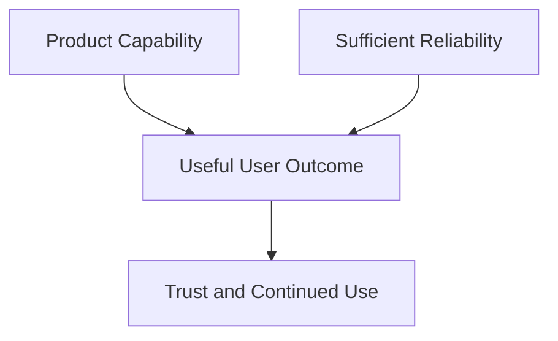
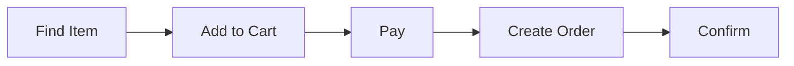
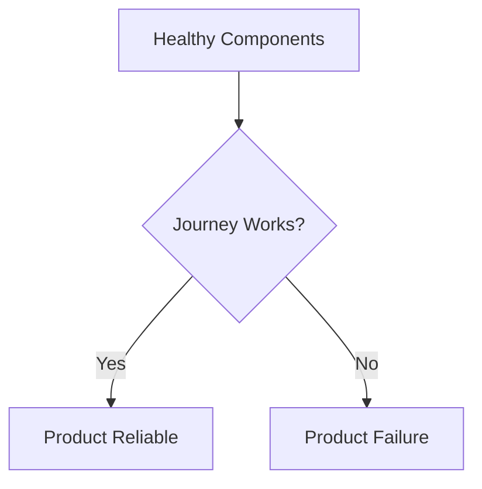
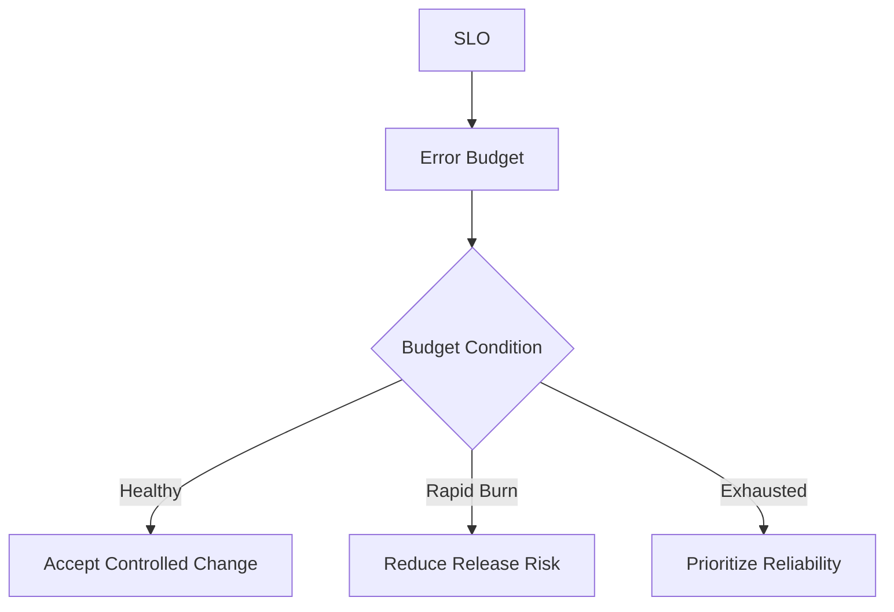
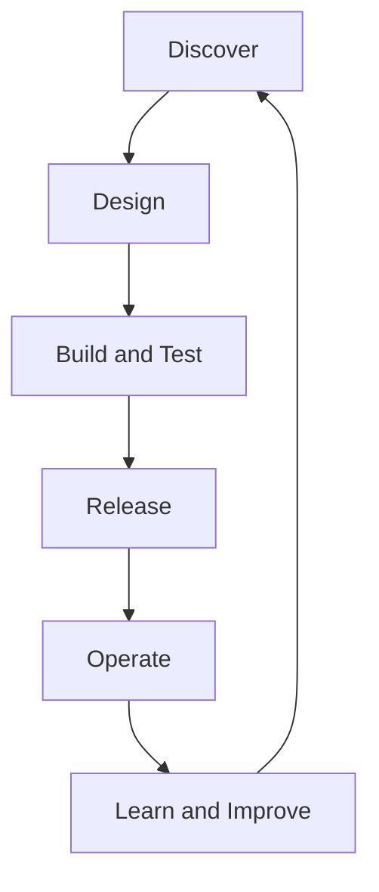
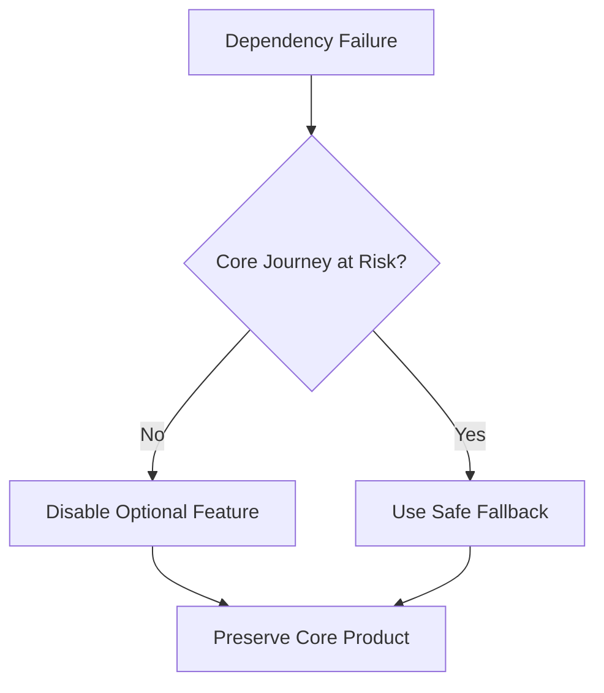
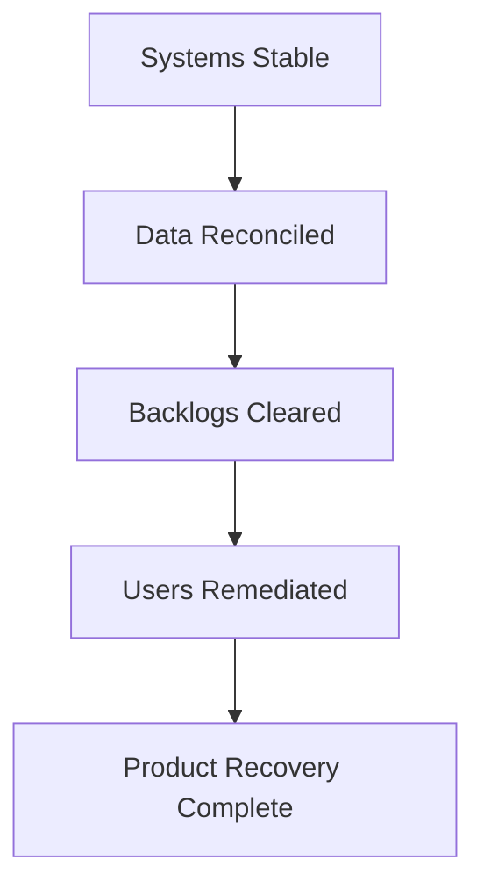

# Reliability as a Product Feature

> Reliability is part of what a product does. A feature has little value when users cannot access it, complete it, trust its result, or depend on it when it matters.

## Chapter Purpose

Organizations often treat reliability as invisible technical maintenance. Product teams plan visible capabilities, while reliability work competes for whatever time remains. This separation is misleading.

Users experience reliability directly when they:

- Sign in successfully
- Complete a payment once, without duplication
- Receive a correct search result quickly
- Save work without losing it
- Join a scheduled meeting on time
- Access medical, financial, or operational data when needed
- Trust that a completed action will remain completed
- Recover safely when part of the product is degraded

Users also experience unreliability directly. They may not know whether the cause is an overloaded database, a failed dependency, an unsafe deployment, or an expired certificate. They know that the product did not deliver the expected outcome.

This chapter explains how to treat reliability as:

- A user-facing product property
- A condition for feature usefulness
- A measurable product requirement
- A business and risk decision
- A shared responsibility across product, engineering, SRE, design, support, and leadership
- A source of product differentiation and trust
- A constraint that must be balanced with speed, cost, and new capability

The goal is not to label all engineering work as product work. The goal is to make reliability decisions using the same seriousness applied to other product decisions.

---

## Learning Objectives

After completing this chapter, you should be able to:

1. Explain why reliability is part of the product experience.
2. Distinguish product reliability from component availability.
3. Identify critical user journeys and their reliability needs.
4. Translate user expectations into measurable SLIs and SLOs.
5. Explain how error budgets connect reliability to product delivery.
6. Evaluate reliability tradeoffs using user impact and business context.
7. Identify reliability requirements during product discovery and design.
8. Explain how graceful degradation can preserve core product value.
9. Connect reliability failures to trust, retention, revenue, and operational cost.
10. Assign shared responsibilities without creating unclear ownership.
11. Use product segmentation without hiding harm to smaller user groups.
12. Build reliability requirements into a product lifecycle.

---

## 1. The Product Includes Its Operating Experience

A product is not only its interface and feature list. It also includes the conditions under which those features can be used.

A messaging feature is not complete merely because it can send a message in a test environment. The product experience also includes whether the message:

- Sends when expected
- Arrives within a useful time
- Arrives once
- Reaches the intended recipient
- Preserves ordering where required
- Remains available after a retry
- Handles attachment failure safely
- Communicates failure clearly

Reliability determines whether the feature remains useful under real demand, change, dependency failure, and partial degradation.

### Product Capability

What the user is supposed to accomplish.

### Product Reliability

How consistently, correctly, and promptly the user can accomplish it under defined conditions.

### Product Recovery

How the product behaves when normal delivery is disrupted and how safely it returns to service.

These are not separate products. They are parts of one user experience.

---

## 2. Features Need Reliability to Produce Value

A feature creates value only when a user can depend on it enough to achieve the intended outcome.



Consider a salary-payment feature. It may provide excellent scheduling, approval, reporting, and integration options. If payments sometimes execute twice, the feature is not merely unreliable. It is unsafe.

Consider an emergency communication product. If notifications arrive hours late during peak demand, eventual delivery may satisfy an internal system metric but fail the actual product purpose.

Reliability changes the value of a feature. In some products, it also changes whether the product can be used at all.

---

## 3. Reliability Is Experienced Through User Journeys

Users rarely interact with one service in isolation. They complete journeys.

An online purchase may require:

1. Product discovery
2. Inventory display
3. Cart update
4. Authentication
5. Address validation
6. Payment authorization
7. Order creation
8. Confirmation



The user experiences one purchase journey. Internally, many teams and services may participate.

Product reliability therefore asks:

- Did the user complete the journey?
- Was the result correct?
- Did it complete within the useful time?
- If it failed, was the state understandable and recoverable?

Google’s product-focused reliability guidance recommends understanding end-user goals and using critical user journeys to define reliability in product language. See [Product-Focused Reliability for SRE](https://sre.google/resources/practices-and-processes/product-focused-reliability-for-sre/).

---

## 4. What Is a Critical User Journey?

A critical user journey, or CUJ, is a sequence of interactions that allows a user to achieve an important goal.

A journey is critical when failure creates meaningful harm, such as:

- Preventing the product’s primary purpose
- Blocking revenue
- Losing or corrupting data
- Creating security or safety exposure
- Violating a contractual or regulatory requirement
- Affecting a large or strategically important user group
- Preventing recovery from another failure

Examples include:

| Product | Critical user journey |
| --- | --- |
| Bank | View an accurate balance and transfer funds safely |
| Retail platform | Find an item, pay once, and receive order confirmation |
| Collaboration tool | Join a scheduled meeting and maintain usable audio |
| Cloud platform | Create, access, and recover a workload |
| Hospital system | Retrieve the correct patient record when care is delivered |
| Data platform | Submit a job and receive a complete, correct result |
| Identity service | Authenticate an authorized user and reject an unauthorized request |

Not every click is a separate critical journey. Select journeys that represent meaningful outcomes.

---

## 5. Map the Journey Before Choosing Metrics

Teams often begin with available telemetry. This can produce technically convenient metrics that poorly represent the product.

Begin by mapping:

- User intent
- Entry point
- Required steps
- Dependencies
- Success state
- Failure states
- Time sensitivity
- Data correctness
- Recovery path

Only then choose service-level indicators.

### Journey Mapping Questions

1. Where does the journey begin and end?
2. What result does the user believe they received?
3. Which steps are mandatory?
4. Which steps can degrade without preventing the outcome?
5. Which failures are visible?
6. Which failures create silent corruption or inconsistency?
7. Can the user retry safely?
8. Which dependencies can prevent completion?
9. How will success be measured at the closest practical point to the user?

This prevents a healthy internal service from masking a broken product path.

---

## 6. Product Reliability Is Multidimensional

Reliability is not only uptime.

Important dimensions include:

| Dimension | Product question |
| --- | --- |
| Availability | Can the user access and use the capability? |
| Latency | Does the result arrive within a useful time? |
| Correctness | Is the result accurate and complete? |
| Durability | Does committed data remain preserved? |
| Freshness | Is the information recent enough for its purpose? |
| Consistency | Do users and systems observe an acceptable state? |
| Throughput | Can the product complete the required volume of work? |
| Coverage | Does the capability work for the intended users, regions, and clients? |
| Recoverability | Can the user and service recover safely from failure? |
| Security | Does the service preserve authorized and trustworthy operation? |

A product may be available but incorrect. It may be correct but too slow. It may be fast but lose committed data.

Choose reliability dimensions according to the user outcome and harm model.

---

## 7. Component Availability Is Not Product Reliability

A service can report healthy infrastructure while the product fails.

Examples:

- Web servers return HTTP 200 with an empty account balance.
- A payment API accepts a request but never creates the order.
- All database nodes are reachable, but replication lag serves stale inventory.
- A queue accepts messages, but consumers cannot complete them.
- The main page loads, but authentication fails for one identity provider.



Component metrics remain useful for diagnosis and capacity management. They should support, not replace, journey-level evidence.

---

## 8. Define Success Before Defining Failure

A strong reliability definition begins with a precise successful event.

For checkout, success might mean:

> A valid checkout attempt receives a confirmed order identifier within 2 seconds, the customer is charged no more than once, and the committed order can be retrieved.

This definition includes:

- Eligibility
- Completion
- Latency
- Correctness
- Idempotency
- Durability

Weak success definitions create misleading reliability measurements.

For example, counting every HTTP 200 as a successful checkout fails when the response body contains a rejected or incomplete transaction.

### Define Bad Events Explicitly

Bad events may include:

- Errors
- Timeouts
- Incorrect responses
- Duplicate actions
- Stale results
- Partial completion
- Missing confirmation
- Unsafe recovery

What counts as bad should reflect user harm, not implementation convenience.

---

## 9. Translate Product Intent Into SLIs

A service-level indicator measures a defined aspect of service behavior.

For a request-based success SLI:

```text
Success SLI = Good eligible events / Total eligible events
```

For a product journey, defining the terms is the difficult part.

### Eligible Event

A real attempt that should be served. Exclusions must be justified, documented, and reviewable.

### Good Event

An eligible event that produces the expected user outcome within the required conditions.

### Measurement Point

The location from which evidence is collected. Measurement close to the user boundary often represents the experience better than internal health checks.

### Example

For a document-save journey:

- Eligible event: a save request from an authenticated user with a valid document
- Good event: the new version is durably stored and acknowledged within 1 second
- Bad event: timeout, error, rejected valid request, or acknowledgment without durable storage
- Measurement: application boundary plus durability confirmation

The SLI should be simple enough to trust and specific enough to guide action.

---

## 10. Set SLOs Around User Need

A service-level objective sets a target for an SLI over a time window.

Example:

> At least 99.95 percent of eligible payment attempts will complete correctly within 3 seconds over a rolling 28-day period.

An SLO should reflect:

- User tolerance
- Product promise
- Business criticality
- Technical capability
- Failure history
- Cost
- Dependency constraints
- Regulatory or contractual requirements

The Site Reliability Workbook states that an SLO sets a target reliability level for customers. Above it, users should generally be satisfied with reliability; below it, dissatisfaction or abandonment becomes more likely. See [Implementing SLOs](https://sre.google/workbook/implementing-slos/).

### Avoid Arbitrary Nines

Do not choose 99.99 percent because it appears mature. Higher targets:

- Reduce the error budget
- Require stronger controls
- Increase cost
- Restrict change
- May exceed what users need

Choose the lowest reliability level that safely satisfies the intended experience and obligations. Revisit it as the product changes.

---

## 11. The SLO Is a Product Agreement

An SLO should not be created by SRE alone.

The discussion requires input from:

- Product management
- Service owners
- Software engineers
- SRE or reliability engineers
- User research or support
- Business leadership
- Security, legal, risk, or compliance where relevant

Each group contributes different evidence.

| Participant | Contribution |
| --- | --- |
| Product | User goals, product priority, expected experience |
| Engineering | Architecture, dependencies, technical constraints |
| SRE | Measurement, operability, risk, failure history |
| Support | Repeated customer pain and real failure reports |
| Business | Revenue, market, contractual, and cost context |
| Risk functions | Safety, security, regulatory, and legal constraints |

An SLO becomes useful when these groups agree that it represents acceptable product reliability and will influence decisions.

---

## 12. Error Budgets Connect Reliability and Product Velocity

The error budget is the amount of unreliability allowed by the SLO.

It allows product and reliability teams to replace a vague conflict with evidence.



An error budget policy can define:

- How budget is calculated
- Which SLOs govern releases
- Burn-rate thresholds
- Who reviews the evidence
- What happens after overspend
- Which emergency changes remain permitted
- How exceptions are approved
- When normal release activity resumes

The budget does not make decisions automatically. It creates a shared basis for making them.

---

## 13. Reliability Is Not the Enemy of Product Speed

Reliability and delivery speed can conflict, but they also support each other.

Reliability investments can enable faster delivery through:

- Safer deployment automation
- Smaller changes
- Tested rollback
- Better observability
- Fault isolation
- Stable interfaces
- Capacity headroom
- Clear ownership
- Reduced incident interruption

A fragile product may ship features quickly for a short period. Over time, recurring incidents, fear of release, manual recovery, and support demand reduce effective speed.

The useful question is not:

> Features or reliability?

It is:

> What combination of capability, reliability, cost, and delivery rate produces the best sustainable product outcome?

---

## 14. Reliability Has Product Value

Reliability can affect:

- Customer trust
- Retention
- Conversion
- Revenue
- Support volume
- Contract renewal
- Reputation
- Employee productivity
- Regulatory exposure
- Partner confidence
- Market access

The value differs by product.

For a consumer entertainment product, a short outage may cause frustration and lost engagement. For a payment network, identity provider, emergency system, or clinical application, failure can create financial, security, or safety harm.

Reliability value should be evaluated through the product’s actual use, not a universal formula.

---

## 15. Reliability Can Be a Differentiator

When competing products offer similar capability, predictable operation may become a reason users choose and retain one product.

Differentiation may come from:

- Consistent performance during peak demand
- Trustworthy data
- Safe recovery after interrupted work
- Transparent incident communication
- Regional resilience
- Predictable integration behavior
- Stable APIs
- Strong durability
- Reliable support workflows

However, teams should not claim differentiation without evidence. Reliability claims need measurable definitions and honest reporting.

---

## 16. User Trust Is Accumulated and Spent

Trust develops through repeated product experience.

Users learn whether:

- Actions complete as expected
- Data remains safe
- Failures are communicated honestly
- Recovery is predictable
- The product behaves consistently under pressure

A serious failure can consume trust faster than it was accumulated, especially when it involves money, identity, privacy, safety, or lost work.

Trust recovery may require more than technical restoration. It may require:

- Clear communication
- Customer support
- Data correction
- Compensation
- Public explanation
- Evidence of corrective work

Product reliability planning should consider both service recovery and trust recovery.

---

## 17. Reliability Requirements Belong in Product Discovery

Reliability should be discussed before implementation begins.

During discovery, ask:

- Who will use this capability?
- What user outcome matters?
- When is it needed?
- What harm follows failure?
- What data must remain correct?
- Can the user retry safely?
- What degraded experience is acceptable?
- Which dependencies are required?
- What scale and growth are expected?
- What support or compliance commitments apply?

These questions influence architecture, testing, interfaces, rollout, observability, and operating cost.

Adding them after launch can require expensive redesign.

---

## 18. Write Reliability Acceptance Criteria

Feature acceptance criteria often describe only functional behavior.

Functional example:

> A user can upload a report.

Reliability-aware acceptance criteria might include:

- A valid report up to the supported size uploads within the defined latency target.
- Interrupted uploads can resume or fail without corrupting stored data.
- Duplicate retries do not create unintended copies.
- The user receives a clear final state.
- Upload success and latency are measurable.
- The feature degrades safely if virus scanning or metadata extraction is delayed.
- Operational ownership and support procedures are defined.

Acceptance criteria do not replace an SLO. They ensure the feature is built with the conditions needed to operate it reliably.

---

## 19. Build Reliability Into the Product Lifecycle



### Discover

Identify critical journeys, user tolerance, harm, and business constraints.

### Design

Choose failure boundaries, degradation, recovery, measurement, and ownership.

### Build and Test

Implement instrumentation, controls, fault handling, and reliability tests.

### Release

Limit exposure, observe product signals, and retain a safe rollback path.

### Operate

Monitor SLOs, respond to incidents, manage capacity, and control toil.

### Learn and Improve

Use incidents, support data, user research, and error-budget trends to revise the product and its objectives.

Reliability is not a final checkpoint. It is present throughout the lifecycle.

---

## 20. Product Architecture Encodes Reliability Choices

Architecture determines how the product responds to change and failure.

Reliability-relevant choices include:

- Synchronous or asynchronous processing
- Single-region or multi-region service
- Shared or isolated tenancy
- Strong or eventual consistency
- Centralized or distributed dependency
- Stateless or stateful components
- Recovery point and recovery time objectives
- Retry and timeout behavior
- Data partitioning
- Failure containment

No choice is universally correct.

For example, multi-region architecture can reduce some regional risks but adds replication, consistency, routing, testing, and operating complexity. The product value and failure model must justify that complexity.

---

## 21. Graceful Degradation Preserves Core Value

Graceful degradation allows a product to provide reduced but useful behavior during failure.

Examples include:

- Show cached catalog data while live recommendations are unavailable.
- Allow document viewing while editing is temporarily disabled.
- Accept an order for later processing while a noncritical notification system is down.
- Serve a basic search result without personalization.
- Disable high-cost analytics to preserve transaction processing.



Degradation must be designed carefully. A fallback that returns incorrect or unsafe information may be worse than a visible failure.

### Degradation Questions

- Which capability is essential?
- Which capability is optional?
- Is stale data safe?
- Can work be queued?
- Will users understand the degraded state?
- How will normal behavior be restored?

---

## 22. Not Every Feature Needs the Same Reliability

Uniform reliability targets waste resources and can hide priority.

Compare:

- Funds transfer
- Profile picture update
- Recommendation refresh
- Monthly analytics export
- Password reset

These capabilities differ in urgency, correctness requirements, frequency, and harm.

A product can define tiers such as:

| Tier | Description | Example treatment |
| --- | --- | --- |
| Critical | Failure blocks core value or creates serious harm | Strong SLO, paging, redundancy, tested recovery |
| Important | Failure materially degrades the product | SLO, monitored recovery, controlled degradation |
| Supporting | Failure is inconvenient but core use continues | Lower target, ticket-based response, simpler recovery |
| Experimental | Limited commitment and exposure | Explicit expectations, bounded rollout, rapid removal |

Tiering should follow user and business importance, not internal team status.

---

## 23. Segment Reliability Carefully

An aggregate SLO can hide concentrated failure.

Segmentation may be needed by:

- Region
- Customer tier
- Device or client version
- Identity provider
- Transaction type
- Accessibility path
- Network condition
- Tenant
- Product plan

Example:

Overall login success is 99.95 percent, but users of one mobile version succeed only 91 percent of the time. The aggregate appears healthy because the affected group is small.

Segmentation should reveal important harm without creating an unmanageable number of SLOs.

Use separate objectives or diagnostic breakdowns when a segment:

- Has a distinct promise
- Has materially different risk
- Can fail independently
- Represents a protected or strategically important group
- Is large enough to require explicit accountability

Small population does not mean acceptable neglect.

---

## 24. Define the Product Boundary

Modern products cross many internal services and external providers. Teams need a clear reliability boundary.

Ask:

- What outcome does the product own?
- Where is that outcome measured?
- Which dependencies participate?
- Which failures remain the product’s responsibility to handle?
- Which promises are made to users?

An external payment provider may own authorization availability. The product still owns:

- Timeout behavior
- Retry safety
- Duplicate prevention
- Status communication
- Fallback payment methods
- Reconciliation
- Customer support

Dependency ownership does not remove product responsibility for the resulting experience.

---

## 25. Third-Party Dependencies Are Product Decisions

Selecting a dependency is also selecting part of the product’s reliability profile.

Evaluate:

- Published commitments
- Actual historical performance
- Geographic coverage
- Failure modes
- Rate and capacity limits
- Change policy
- Support and escalation
- Security controls
- Data portability
- Exit strategy
- Cost of redundancy

Do not rely only on a vendor SLA. A service credit does not restore user trust or recover lost transactions.

Design the product’s behavior for dependency failure before it occurs.

---

## 26. Product Reliability Needs Ownership

Shared responsibility needs explicit owners.

At minimum, identify owners for:

- The product journey
- Contributing services
- SLI implementation
- SLO approval
- Error-budget policy
- Paging and incident response
- Capacity
- Recovery testing
- Corrective actions
- Customer communication

An SRE may advise on measurement and operations without owning the product decision. A product manager may prioritize reliability without operating the service. A service owner may implement changes without authority to accept business risk.

Clarify both responsibility and decision authority.

---

## 27. Product Managers Have Reliability Responsibilities

Product managers should participate in:

- Defining critical journeys
- Understanding user tolerance
- Prioritizing reliability work
- Approving product-level SLO intent
- Deciding degraded behavior
- Evaluating launch risk
- Communicating tradeoffs
- Reviewing customer impact

They do not need to design alert rules or diagnose distributed systems. They do need to understand what reliability level the product promises and what the organization will trade to maintain it.

A product roadmap that excludes reliability work is incomplete.

---

## 28. SRE Has Product Responsibilities

SRE should understand more than infrastructure.

Product-aware SRE work includes:

- Learning user goals
- Mapping critical journeys to services
- Defining meaningful SLIs
- Challenging misleading measures
- Quantifying reliability risk
- Connecting incidents to product impact
- Designing operational controls
- Helping teams choose degradation and recovery behavior
- Translating error-budget evidence into decisions

Google’s product-focused reliability guidance describes moving beyond isolated service support toward an understanding of the product and its end users. This does not turn SRE into product management. It ensures that reliability engineering protects the product outcome.

---

## 29. Support and User Research Provide Reliability Evidence

Telemetry does not capture every failure.

Support reports and user research can reveal:

- Confusing partial failures
- Regional or client-specific issues
- Silent data errors
- Failed recovery paths
- User behavior after incidents
- Reliability expectations that have changed
- High-impact failures hidden by aggregates

Product reliability reviews should combine:

- SLI and SLO data
- Incident history
- Support tickets
- User complaints
- Retention or abandonment behavior
- Survey and research findings
- Business and contract impact

Quantitative and qualitative evidence serve different purposes. Neither should automatically dismiss the other.

---

## 30. Reliability Needs a Product Roadmap

A reliability roadmap should connect engineering work to product outcomes.

Weak roadmap item:

> Upgrade the database cluster.

Stronger roadmap item:

> Reduce checkout failure during zone loss by removing the single-zone write dependency and proving recovery through quarterly failover tests.

Useful reliability roadmap fields include:

- User journey
- Current reliability gap
- Evidence
- Risk or harm
- Proposed control
- Expected outcome
- Owner
- Dependency
- Verification
- Target period

This makes reliability work comparable with other product investments.

---

## 31. Prioritize Reliability Work by Expected Product Impact

Not every reliability problem deserves immediate redesign.

Prioritize using:

- User harm
- Error-budget consumption
- Frequency
- Duration
- Blast radius
- Data or security impact
- Recovery difficulty
- Growth trend
- Toil
- Business criticality
- Cost of delay

A useful qualitative model is:

```text
Priority evidence = Expected harm + Repeated operational cost + Future exposure
```

This is not a universal mathematical formula. It is a reminder to include present impact, recurring effort, and growing risk.

Small recurring failures may deserve attention when their combined user harm or toil exceeds one rare event.

---

## 32. Reliability Has a Cost

Reliability consumes resources.

Costs may include:

- Redundant infrastructure
- Additional engineering
- Testing environments
- Observability storage
- Incident coverage
- Backup systems
- Regional deployment
- Vendor contracts
- Reduced delivery speed
- Operational complexity

The SRE principle is not to minimize cost at the expense of users. It is to choose an appropriate reliability level and understand what it costs to provide.

### Underinvestment

Creates outages, slow recovery, support demand, lost trust, and delivery interruption.

### Overinvestment

Can create unnecessary infrastructure, complexity, and reduced product development without meaningful user benefit.

The correct level depends on the product promise and harm model.

---

## 33. Cost Reduction Must Preserve Product Reliability

Cost changes can alter failure risk.

Examples include:

- Reducing capacity headroom
- Removing regional redundancy
- Shortening log retention
- Selecting a lower-service vendor tier
- Reducing on-call coverage
- Consolidating tenants
- Increasing resource overcommitment

Before approving a saving, evaluate:

- Which journey is exposed?
- Which SLO or recovery objective changes?
- How much risk increases?
- Whether the change is reversible
- How effects will be measured
- Who accepts the residual risk

A lower cloud bill is not a product success if it produces greater customer loss or operational cost.

---

## 34. Launch Readiness Includes Reliability Readiness

A feature should not be considered launch-ready only because functional tests pass.

Review:

- Critical journey and expected demand
- SLI and SLO
- Capacity
- Dependency limits
- Failure modes
- Degraded behavior
- Alerting
- Runbooks
- Ownership
- Rollback
- Data recovery
- Security controls
- Support preparation
- Incident communication

Launch controls should match risk. A small experimental feature does not need the same process as a payment or identity capability.

The goal is informed readiness, not process volume.

---

## 35. Use Progressive Delivery as Product Risk Control

Progressive delivery limits how many users experience a change before evidence supports wider release.

Possible stages include:

1. Test environment
2. Internal users
3. Canary traffic
4. Selected customer cohort
5. Region
6. Wider production

At each stage, measure:

- Critical journey success
- Latency
- Correctness
- Error-budget burn
- Support signals
- Resource behavior
- Segment-specific impact

Define abort criteria before rollout. Otherwise teams may reinterpret warning signs under schedule pressure.

---

## 36. Feature Flags Need Reliability Design

Feature flags can limit exposure and support rapid disablement. They also introduce runtime states and dependencies.

Reliability considerations include:

- Safe default value
- Behavior when the flag service is unavailable
- Configuration propagation delay
- Flag ownership
- Expiration and removal
- Testing of important combinations
- Auditability
- Permission control

A kill switch is useful only when:

- Responders can access it.
- Its effect is understood.
- It works during the incident.
- Disabling the feature preserves a safe product state.

Untended flags become product complexity.

---

## 37. Reliability Testing Must Reflect Product Failure

Unit and integration tests are necessary, but they may not prove journey reliability.

Product-focused reliability testing can include:

- End-to-end journey tests
- Load tests
- Stress tests
- Dependency-failure tests
- Failover exercises
- Backup restoration
- Data-integrity checks
- Client compatibility tests
- Degradation tests
- Retry and idempotency tests
- Regional evacuation exercises

Tests should answer specific risk questions.

Example:

> Can customers still retrieve previously purchased tickets if the recommendation and analytics systems are unavailable?

This is stronger than a generic goal to perform chaos testing.

---

## 38. Reliability Communication Is a Product Capability

During an incident, users need accurate and useful information.

Good communication explains:

- What users may experience
- Which product area is affected
- When the incident began, if known
- What users should do
- Whether data is safe
- When another update will arrive
- When service is restored

Avoid:

- Declaring full recovery before verifying the user journey
- Exposing irrelevant internal detail
- Blaming a provider
- Promising a restoration time without evidence
- Saying only that some users are affected when the scope is known

Status pages, in-product notices, support scripts, and account communication are parts of reliability response.

---

## 39. Product Recovery May Continue After Technical Recovery

Technical metrics can recover while users remain affected.

Post-recovery work may include:

- Processing a backlog
- Replaying events
- Reconciling transactions
- Correcting records
- Reissuing notifications
- Restoring customer access
- Refunding duplicate charges
- Contacting affected users
- Rebuilding trust



Incident closure criteria should include product recovery, not only infrastructure stability.

---

## 40. Postmortems Should Produce Product Learning

A postmortem should ask more than which component failed.

Product questions include:

- Which journeys failed?
- Which users were affected?
- What could users see or not see?
- Was the degraded experience safe?
- Did product design increase impact?
- Did communication meet user needs?
- Did the SLO represent the event?
- Did prioritization reflect the actual harm?
- What product change could reduce future impact?

Corrective work may involve:

- Architecture
- User interface
- Retry behavior
- Error messaging
- Support process
- Product scope
- SLO revision
- Dependency choice

Reliability learning belongs in product planning.

---

## 41. Reliability Reviews Need a Product Scorecard

A useful review combines outcomes, not just raw infrastructure metrics.

Possible fields include:

| Area | Evidence |
| --- | --- |
| Journey health | SLI and SLO performance by critical journey |
| Risk | Error-budget status and main sources of consumption |
| User impact | Affected users, duration, severity, segment |
| Operations | Pages, incidents, recovery time, toil |
| Product signals | Support volume, abandonment, complaints |
| Readiness | Capacity, recovery tests, dependency risks |
| Improvement | Corrective actions completed and verified |

The review should end with decisions:

- Continue current delivery plan
- Reduce release risk
- Prioritize reliability work
- Revise an objective
- Change product behavior
- Accept documented risk

A scorecard without decisions becomes reporting theater.

---

## 42. Avoid Vanity Reliability Metrics

Vanity metrics look reassuring but do not support product decisions.

Examples include:

- Overall platform uptime that excludes major journeys
- Average latency across unrelated operations
- Incident count without severity or user impact
- Mean time to recovery measured before users recover
- Number of alerts closed
- Percentage of healthy servers
- Deployment-success rate that treats automatic rollback as failure

Ask:

1. What user outcome does the metric represent?
2. Can it hide concentrated harm?
3. Does it change a decision?
4. Is the measurement definition stable?
5. Can teams manipulate it without improving the product?

Metrics shape behavior. Choose them carefully.

---

## 43. Reliability Requirements Change as Products Evolve

Early product stages may prioritize learning with limited users and bounded risk. Mature products may carry stronger expectations, contractual commitments, and dependency ecosystems.

Revisit reliability when:

- User population grows
- Product purpose changes
- Paid commitments are introduced
- New regions launch
- Enterprise customers adopt the product
- A feature becomes business-critical
- Data sensitivity changes
- Architecture changes
- A dependency becomes concentrated
- User tolerance changes

Historical performance is not sufficient proof that an old objective still represents current needs.

---

## 44. Internal Products Also Need Reliability

Internal users are still users.

An unreliable deployment platform, identity system, data platform, or support tool can:

- Block revenue-producing teams
- Delay incident response
- Increase manual work
- Cause unsafe workarounds
- Reduce delivery speed
- Concentrate knowledge

Internal product SLOs should reflect the business processes they enable.

Examples:

- Time required to deploy safely
- Success rate of build execution
- Availability of emergency access
- Freshness of operational data
- Time to provision a supported environment

Do not assign a target only because the product is internal. Understand its consumers and downstream consequences.

---

## 45. Reliability for APIs and Platforms

API and platform users build their own products on top of yours.

Reliability includes:

- Stable contracts
- Predictable error behavior
- Backward compatibility
- Rate-limit clarity
- Idempotency
- Accurate documentation
- Change notice
- Dependency isolation
- Regional behavior
- Support and escalation

A platform can remain technically available while breaking consumers through an incompatible response, undocumented limit, or changed timing behavior.

Measure the outcomes consumers depend on, not only request success at the gateway.

---

## 46. Reliability for Data and AI Products

Data and AI products require reliability dimensions beyond ordinary request availability.

Possible measures include:

- Data freshness
- Completeness
- Schema stability
- Pipeline success
- Model-serving availability
- Prediction latency
- Quality or accuracy thresholds
- Drift detection
- Reproducibility
- Safe fallback

An AI endpoint may be available and fast while producing output below the product’s acceptable quality threshold.

Questions include:

- What constitutes a good result?
- How is quality measured?
- Which failure should block delivery?
- When is a fallback safer?
- How are model and system failures separated?
- Can affected output be identified and corrected?

The SLO must represent the useful product outcome wherever measurement is feasible and trustworthy.

---

## 47. Production Scenario: Checkout Is Up but Orders Are Missing

### Situation

The checkout API reports 99.99 percent availability. Customers receive successful responses, but 2 percent of completed payments do not create retrievable orders because an asynchronous event is lost.

### Weak Measurement

The existing SLI counts successful HTTP responses at the checkout service.

### Product Analysis

The actual journey requires:

- Payment authorization
- Durable order creation
- Retrieval
- Confirmation

The service is available at one boundary but the product outcome is unreliable.

### Response

1. Stop or contain the failing path.
2. Identify affected transactions.
3. Reconcile payments and orders.
4. Inform and remediate customers.
5. Redefine the good event around durable order completion.
6. Add loss detection and replay controls.
7. Test partial failure between authorization and order creation.

### Lesson

Measure completion of the valuable journey, not the success of one internal step.

---

## 48. Production Scenario: Search Degrades During Peak Traffic

### Situation

A retail event causes recommendation traffic to saturate a shared database. Search and checkout latency rise sharply.

### Product Decision

Recommendations improve discovery, but search and checkout preserve the core transaction journey.

### Degradation Plan

- Disable real-time personalization.
- Serve cached recommendations.
- Reserve database capacity for search and checkout.
- Shed optional analytics work.
- Communicate only if user-visible degradation warrants it.

### Verification

- Search latency returns within SLO.
- Checkout success recovers.
- Cached data remains safe and acceptable.
- Database saturation falls.
- No critical backlog grows unexpectedly.

### Lesson

Graceful degradation requires an explicit product hierarchy before failure occurs.

---

## 49. Production Scenario: Small Region Hidden by Global SLO

### Situation

Global login success is 99.96 percent, above the 99.9 percent SLO. One country experiences only 83 percent success because of a regional identity-provider integration.

### Analysis

The global average hides concentrated product failure.

Questions include:

- Is the country an explicitly supported market?
- Does it have a distinct contractual or regulatory requirement?
- Can the failure occur independently?
- How many real users are harmed?
- Would segmentation have detected the problem earlier?

### Response

- Establish segmented monitoring.
- Correct the integration.
- Consider a regional SLO or formal sub-indicator.
- Review escalation and ownership.
- Avoid excluding the region simply to protect the aggregate.

### Lesson

Reliability must be fair enough to reveal meaningful user harm.

---

## 50. Production Scenario: Reliability Work Loses Roadmap Priority

### Situation

A recurring storage failover problem causes four incidents per quarter. Each incident affects 15 percent of customers for 25 minutes. A permanent correction is repeatedly delayed because it does not add a visible feature.

### Product Case

Frame the work using:

- Journey affected
- Users and duration
- Error-budget consumption
- Support and incident cost
- On-call interruption
- Risk of larger future impact
- Expected improvement
- Verification method

### Strong Roadmap Item

> Reduce document-access failure during storage failover by implementing and testing automatic traffic transition, with a target of maintaining the read-availability SLO during a single-zone loss.

### Lesson

Reliability work needs a product outcome, evidence, and acceptance criterion.

---

## 51. Production Scenario: Cost Saving Removes Headroom

### Situation

A team reduces idle capacity by 40 percent. Cloud cost falls, but traffic spikes now exhaust the service before autoscaling can add healthy instances.

### Analysis

The saving changed the product’s ability to absorb demand.

Review:

- Peak traffic profile
- Scaling delay
- Required failover capacity
- SLO impact
- Cost of user failure
- Alternative scaling controls

### Better Decision

Retain enough warm capacity for the response delay, improve predictive or scheduled scaling, and test spike behavior. Compare the cost of headroom with the expected product harm.

### Lesson

Efficiency is constrained by the product reliability requirement.

---

## 52. Production Scenario: Maintenance Exclusion Hides Harm

### Situation

A product excludes all planned maintenance from its availability calculation. Maintenance occurs weekly and prevents some international users from completing time-sensitive work.

### Analysis

The exclusion makes the metric look better without reducing user harm.

Ask:

- Were users promised continuous access?
- Is the window truly outside product use?
- Can traffic move elsewhere?
- Is the downtime being reduced?
- Is it communicated clearly?
- Who accepted the recurring risk?

Google’s guidance on maintenance windows emphasizes evaluating whether downtime harms users and whether counting it in the error budget will drive relevant improvement. See [How Maintenance Windows Affect Your Error Budget](https://cloud.google.com/blog/products/management-tools/sre-error-budgets-and-maintenance-windows).

### Lesson

Measurement policy should represent the intended user experience, not protect an internal score.

---

## 53. Practical Exercise: Map a Critical User Journey

Choose one product capability and complete this template.

| Field | Your answer |
| --- | --- |
| User | |
| Goal | |
| Journey start | |
| Required steps | |
| Successful outcome | |
| Time requirement | |
| Correctness requirement | |
| Main dependencies | |
| Failure states | |
| Safe degraded state | |
| Recovery path | |
| Product owner | |

### Evaluation

The journey should describe a valuable outcome, not an internal service call.

---

## 54. Practical Exercise: Design a Product SLI

Using the journey from the previous exercise, define:

```text
SLI name:
Eligible event:
Good event:
Bad event:
Measurement point:
Data source:
Known exclusions:
Segmentation needed:
Validation method:
```

Then test the SLI against these failures:

- Dependency timeout
- Incorrect successful response
- Duplicate retry
- Slow completion
- Partial regional failure
- Measurement pipeline failure

If the SLI still reports success while the user journey fails, revise it.

---

## 55. Practical Exercise: Write Reliability Acceptance Criteria

Select a planned feature and write criteria for:

- Availability
- Latency
- Correctness
- Data durability
- Dependency failure
- Degraded behavior
- Observability
- Rollback
- Support readiness
- Ownership

Each criterion should be testable or verifiable.

Avoid vague language such as fast, robust, highly available, resilient, and scalable unless a measurable definition follows.

---

## 56. Practical Exercise: Build a Reliability Roadmap Item

Use this structure:

```text
Title:
Affected user journey:
Current reliability gap:
Evidence:
User or business harm:
Proposed change:
Expected reliability outcome:
Owner:
Dependencies:
Release approach:
Verification:
Review date:
```

The item should explain why the work matters without requiring the reader to understand the implementation first.

---

## 57. Practical Exercise: Run a Product Reliability Review

Bring together product, engineering, SRE, and support representatives.

Review:

1. Critical journey SLO performance
2. Error-budget trend
3. Main sources of user harm
4. Segment-specific failures
5. Serious incidents and near misses
6. Support evidence
7. Capacity and dependency risk
8. Recovery-test results
9. Open corrective actions
10. Upcoming high-risk changes

End with named decisions, owners, and dates.

Do not make the meeting a dashboard presentation. Focus on what should change.

---

## 58. Product Reliability Anti-Patterns

### Uptime Equals Product Health

Infrastructure availability replaces measurement of user journeys.

### SRE Owns All Reliability

Product and development teams transfer responsibility without transferring decision authority or capacity.

### Reliability After Launch

Measurement, recovery, ownership, and degraded behavior are considered only after production failure.

### Every Feature Is Critical

No product hierarchy exists, so degradation and incident priorities remain unclear.

### One Global Average

Aggregate success hides regional, client, tenant, or accessibility failure.

### SLO as Decoration

The objective appears on a dashboard but never changes release or roadmap decisions.

### Reliability by Vendor SLA

The product assumes a dependency’s contractual promise is sufficient recovery design.

### Reliability Work Without Product Outcome

Technical projects cannot explain which journey or risk they improve.

### Excluding Every Inconvenient Failure

Measurement policy removes incidents, maintenance, or traffic that make performance look worse.

### Launch Deadline Overrides Unknown Risk

The team proceeds without measurement, rollback, or explicit risk acceptance.

---

## 59. Product Reliability Decision Checklist

### Product Outcome

- Which user goal is protected?
- Is the journey critical?
- What does successful completion mean?

### Reliability Requirement

- Which dimensions matter?
- What SLI represents them?
- What SLO is appropriate?
- Which segments need separate visibility?

### Risk

- What harm follows failure?
- What is the blast radius?
- Which dependencies dominate risk?
- Who can accept residual risk?

### Design

- What is the degraded state?
- Is retry safe?
- Is data protected?
- Is recovery tested?

### Release

- Can exposure be progressive?
- What are the abort conditions?
- Is rollback safe?
- What product signals will be observed?

### Operations

- Who owns the service?
- Who responds?
- How will users be informed?
- What proves complete recovery?

### Learning

- How will incidents affect the roadmap?
- When will the SLO be reviewed?
- How will completed improvements be verified?

---

## 60. Reflection Questions

1. Which product journey matters most to your users?
2. Does its current SLI measure actual completion?
3. Which component metric is incorrectly treated as a product outcome?
4. Which smaller user group may be hidden by an aggregate?
5. What feature should degrade first during overload?
6. Which reliability investment lacks a clear product explanation?
7. Does product management participate in SLO decisions?
8. Which third-party dependency has no tested failure plan?
9. When was the last complete recovery exercise?
10. Does incident closure include backlog, data, and customer remediation?
11. Which feature’s reliability target is unnecessarily high or dangerously low?
12. What cost reduction would change the current reliability promise?

---

## 61. Knowledge Check

### 1. Why is reliability a product feature?

A. It is visible only on dashboards  
B. It determines whether users can depend on product capabilities to achieve outcomes  
C. It belongs only to infrastructure teams  
D. It eliminates the need for new features

**Answer: B**

### 2. What is the strongest starting point for a product SLI?

A. Available server metrics  
B. The most expensive component  
C. A defined critical user journey and successful outcome  
D. A vendor SLA

**Answer: C**

### 3. Why can component availability misrepresent product reliability?

A. Components never fail  
B. Healthy components do not prove that the end-to-end journey succeeds  
C. Component metrics cannot be collected  
D. Products have only one component

**Answer: B**

### 4. Who should participate in product SLO decisions?

A. SRE alone  
B. Marketing alone  
C. Relevant product, engineering, SRE, business, and risk stakeholders  
D. The monitoring vendor

**Answer: C**

### 5. What does an error budget provide?

A. A reason to create avoidable outages  
B. A shared measure for balancing reliability and controlled product change  
C. A replacement for user research  
D. A fixed infrastructure budget

**Answer: B**

### 6. What is graceful degradation?

A. Hiding every error  
B. Preserving safe core value while reducing noncritical behavior during failure  
C. Returning stale data in every situation  
D. Disabling the whole product

**Answer: B**

### 7. Why should reliability be considered during discovery?

A. It can affect product scope, architecture, measurement, cost, and recovery design  
B. It prevents experimentation  
C. It replaces functional requirements  
D. It guarantees zero incidents

**Answer: A**

### 8. What problem can a global aggregate create?

A. It always overstates failures  
B. It can hide serious impact concentrated in a smaller segment  
C. It eliminates telemetry  
D. It measures too many journeys

**Answer: B**

### 9. When is product recovery complete?

A. When servers restart  
B. When the incident chat becomes quiet  
C. When service, data, backlogs, affected users, and product commitments are restored as required  
D. When the first metric turns green

**Answer: C**

### 10. What makes a strong reliability roadmap item?

A. A list of technologies  
B. A user journey, evidence, risk, expected outcome, owner, and verification  
C. An unspecified infrastructure upgrade  
D. A promise of perfect uptime

**Answer: B**

### 11. What is the main limitation of a dependency SLA?

A. It replaces contracts  
B. It does not define how your product handles the dependency’s failure or restore your users  
C. It prevents measurement  
D. It applies only to internal systems

**Answer: B**

### 12. Which statement best describes reliability cost?

A. More reliability is always free  
B. The highest possible reliability is always correct  
C. The appropriate investment depends on user need, harm, obligations, and business context  
D. Cost must never affect architecture

**Answer: C**

---

## 62. Completion Checklist

You have completed this chapter when you can:

- [ ] Explain reliability as part of product behavior.
- [ ] Identify a critical user journey.
- [ ] Define success from the user’s perspective.
- [ ] Distinguish component health from journey reliability.
- [ ] Identify relevant reliability dimensions.
- [ ] Design a defensible product SLI.
- [ ] Explain how product stakeholders should agree on an SLO.
- [ ] Connect an error budget to a product decision.
- [ ] Define a safe degraded mode.
- [ ] Identify product segments hidden by an aggregate.
- [ ] Explain dependency failure as a product responsibility.
- [ ] Add reliability acceptance criteria to a feature.
- [ ] Create a product-centered reliability roadmap item.
- [ ] Define complete product recovery.
- [ ] Run a reliability review that ends with decisions.

---

## 63. Key Takeaways

1. Reliability is part of what users receive from a product.
2. A feature that cannot be used consistently does not deliver its intended value.
3. Critical user journeys connect product goals to reliability engineering.
4. Product reliability includes availability, latency, correctness, durability, freshness, and recovery where relevant.
5. Component health cannot prove end-to-end success.
6. Product, engineering, SRE, support, and leadership should jointly shape reliability objectives.
7. Error budgets provide evidence for balancing product change and reliability.
8. Reliability should influence discovery, design, implementation, release, operation, and learning.
9. Graceful degradation protects core value when optional capability fails.
10. Aggregate measures must not hide important user harm.
11. Dependency failures remain part of the product experience.
12. Reliability work needs product outcomes, owners, and verification.
13. Technical recovery may occur before full product and customer recovery.
14. Appropriate reliability balances user need, risk, cost, and delivery.

---

## 64. Authoritative Resources

### Product-Focused Reliability

- [Product-Focused Reliability for SRE](https://sre.google/resources/practices-and-processes/product-focused-reliability-for-sre/)
- [Google SRE](https://sre.google/)
- [Introduction to Site Reliability Engineering](https://sre.google/sre-book/introduction/)

### SLOs and Product Decisions

- [Implementing SLOs](https://sre.google/workbook/implementing-slos/)
- [Service Level Objectives](https://sre.google/sre-book/service-level-objectives/)
- [Embracing Risk](https://sre.google/sre-book/embracing-risk/)
- [SRE Fundamentals: SLIs, SLOs, and SLAs](https://cloud.google.com/blog/products/devops-sre/sre-fundamentals-sli-vs-slo-vs-sla)
- [Practical Guide to Setting SLOs](https://cloud.google.com/blog/products/management-tools/practical-guide-to-setting-slos)
- [Consequences of SLO Violations](https://cloud.google.com/blog/products/gcp/consequences-of-slo-violations-cre-life-lessons)

### Product Operation and Recovery

- [Managing Incidents](https://sre.google/sre-book/managing-incidents/)
- [Postmortem Culture](https://sre.google/sre-book/postmortem-culture/)
- [Addressing Cascading Failures](https://sre.google/sre-book/addressing-cascading-failures/)
- [Handling Overload](https://sre.google/sre-book/handling-overload/)
- [How Maintenance Windows Affect Your Error Budget](https://cloud.google.com/blog/products/management-tools/sre-error-budgets-and-maintenance-windows)

### Source Interpretation

- Google material documents Google’s practices and broader lessons drawn from them.
- Vendor-specific architecture guidance should be adapted to the product’s actual environment.
- SLO examples are starting points, not universal targets.
- User research, support evidence, contracts, regulation, and incident history may reveal requirements not captured by technical guidance.

---

## 65. Related SRE World Sections

- [What Is SRE?](./01-What-Is-SRE.md)
- [History and Evolution of SRE](./02-History-and-Evolution-of-SRE.md)
- [The SRE Mindset](./03-The-SRE-Mindset.md)
- [SRE Foundations](./README.md)
- [Service Ownership](../02-Service-Ownership/)
- [SLIs, SLOs, and SLAs](../03-SLIs-SLOs-and-SLAs/)
- [Error Budgets](../04-Error-Budgets/)
- [Risk and Reliability](../05-Risk-and-Reliability/)
- [Incident Management](../08-Incident-Management/)
- [Postmortems and Learning](../09-Postmortems-and-Learning/)
- [Capacity Planning](../15-Capacity-Planning/)
- [Dependency Management](../18-Dependency-Management/)

---

## Next Chapter

[05: Reliability, Availability, and Resilience](./05-Reliability-Availability-and-Resilience.md)

---

## Maintained by VERIQTA

SRE World is created and maintained by [VERIQTA](https://github.com/veriqta).

- Website: [veriqta.com](https://www.veriqta.com/)
- GitHub: [github.com/veriqta](https://github.com/veriqta)
- Instagram: [@veriqta](https://www.instagram.com/veriqta/)
- Medium: [veriqta.medium.com](https://veriqta.medium.com/)

> Users do not experience your architecture diagram. They experience whether the product lets them finish what they came to do.
