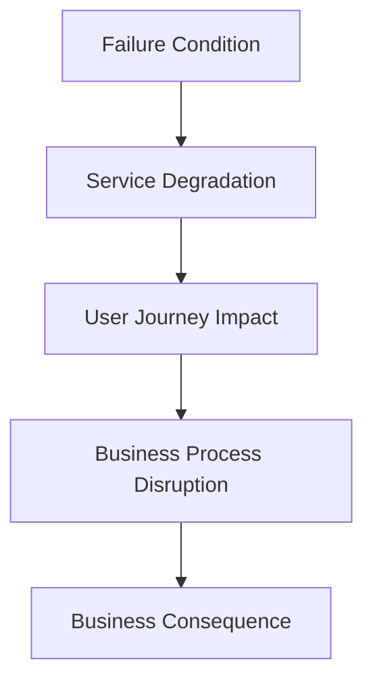
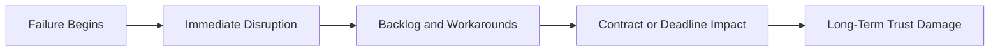
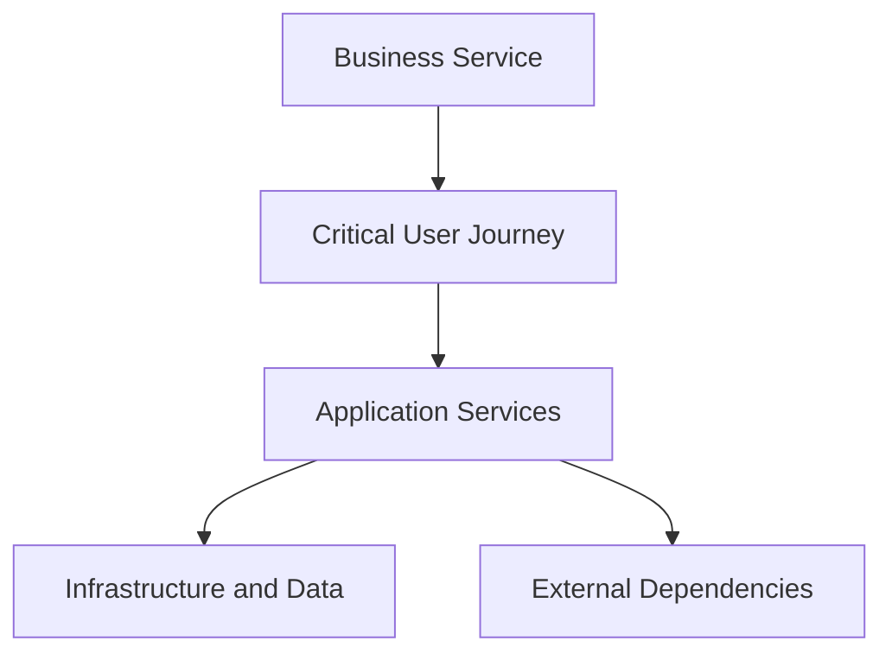
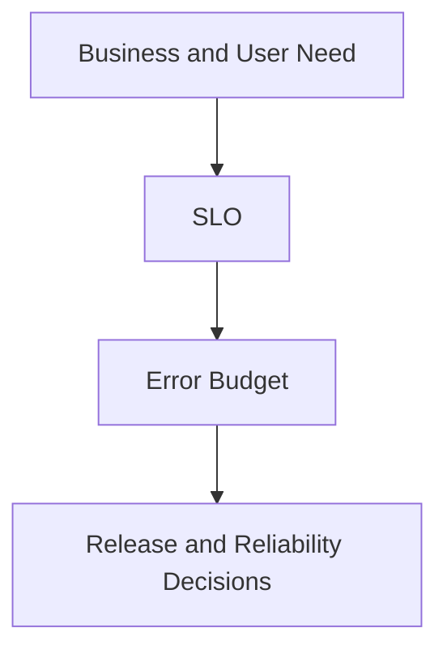
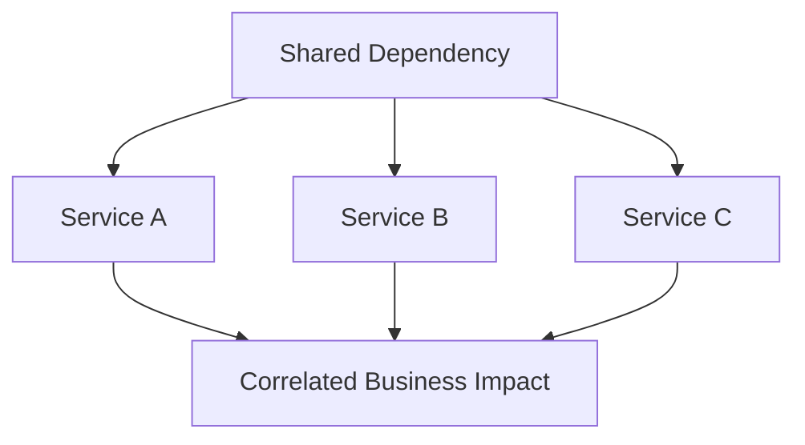

# Reliability and Business Risk

> Reliability risk is business risk expressed through the failure, degradation, corruption, or delayed recovery of a service that people and organizations depend on.

## Chapter Purpose

Reliability discussions often stop at technical measures such as availability, latency, incident count, and recovery time. These measures matter, but they do not explain why the organization should act.

A failed service can create:

- Lost revenue
- Failed customer transactions
- Contractual penalties
- Data loss or corruption
- Regulatory exposure
- Security compromise
- Safety consequences
- Operational interruption
- Reputational damage
- Customer churn
- Partner disruption
- Employee productivity loss
- Emergency labor and recovery cost

The same outage duration can create very different consequences for different services. Ten minutes of failure in a payroll preview tool is not equivalent to ten minutes of failure in a payment authorization service during peak demand. Business context determines the exposure.

This chapter explains how SRE connects service reliability to business risk without turning SRE into accounting, legal, compliance, or enterprise risk management. SRE contributes engineering evidence about service behavior, failure modes, dependencies, recovery capability, and uncertainty. Business and risk owners use that evidence to make decisions within their authority.

This chapter covers:

- Reliability risk and business impact
- Risk appetite, tolerance, capacity, and acceptance
- Direct and indirect consequences
- Critical services and business processes
- SLOs, SLAs, RTOs, and RPOs
- Risk identification, estimation, treatment, and monitoring
- Financial and nonfinancial impact
- Dependency and concentration risk
- Operational resilience and disaster recovery
- Reliability investment and risk reduction
- Governance, escalation, and executive reporting
- Production scenarios and practical exercises

---

## Learning Objectives

After completing this chapter, you should be able to:

1. Explain why service reliability is a form of business risk.
2. Trace a technical failure to user, operational, and business consequences.
3. Distinguish risk appetite, tolerance, capacity, and acceptance.
4. Identify critical business services and the systems that support them.
5. Distinguish SLOs, SLAs, recovery time objectives, and recovery point objectives.
6. Build a reliability risk statement using cause, event, and consequence.
7. Estimate reliability risk using evidence and explicit uncertainty.
8. Identify preventive, detective, responsive, and recovery controls.
9. Evaluate reliability investments using expected risk reduction and cost.
10. Recognize third-party, concentration, and correlated failure risk.
11. Create reliability risk indicators that support decisions.
12. Explain when an engineering decision requires formal business risk acceptance.
13. Communicate reliability risk to technical and executive audiences.
14. Maintain a reliability risk register tied to service ownership and verification.

---

## 1. What Reliability Risk Means

Reliability risk is the possibility that a service will fail to perform its intended function at the required level and create harm.

It includes uncertainty about:

- Whether the failure will occur
- When it will occur
- Which users will be affected
- How severe the impact will be
- How long recovery will take
- Whether data will remain correct
- Whether dependencies will also fail
- Whether controls will work as expected

A service does not need to become completely unavailable for reliability risk to materialize.

Risk events include:

- Excessive latency
- Partial regional failure
- Incorrect results
- Data corruption
- Duplicate processing
- Capacity exhaustion
- Delayed batch completion
- Failed recovery
- Stale information
- Unusable degraded operation
- Loss of administrative control

Reliability risk begins with service behavior and ends with consequences to users and the organization.

---

## 2. The Reliability Risk Chain

Technical failure does not automatically explain business harm. The connection must be traced.



### Example

| Layer | Event |
| --- | --- |
| Failure condition | Database connection pool is exhausted. |
| Service degradation | Payment requests time out. |
| User journey impact | Customers cannot complete checkout. |
| Business process disruption | Orders and payment authorizations stop. |
| Business consequence | Revenue is delayed or lost, support demand rises, and customer trust declines. |

This chain helps teams choose controls at several levels. They may remove the failure condition, contain service degradation, preserve the user journey, provide a business workaround, or reduce the consequence.

---

## 3. Reliability Is Not Only an Engineering Concern

Engineers understand architecture, failure modes, telemetry, recovery, and operational constraints. They do not independently own every business consequence.

Reliability decisions can require participation from:

- Service owners
- Product leaders
- SRE and software engineering
- Operations
- Security
- Business continuity
- Finance
- Legal
- Compliance
- Customer support
- Executive leadership

Examples of questions outside a single engineering team’s authority include:

- Is the revenue exposure acceptable?
- Can a contractual commitment be changed?
- Is a regulatory deadline affected?
- Should a market launch proceed despite known risk?
- Can the organization accept a longer recovery objective to reduce cost?
- Must affected customers be notified?

SRE should provide clear technical evidence and recommendations. Authorized owners decide whether residual business risk is acceptable.

---

## 4. Technical Severity and Business Severity Are Different

A technically dramatic event may create limited business harm. A small technical defect may create severe harm.

### Technically Large, Business Impact Limited

A large internal analytics cluster fails overnight. No critical report is due, data is preserved, and recovery finishes before users begin work.

### Technically Small, Business Impact Severe

One validation rule rejects a small number of high-value regulatory submissions minutes before a legal deadline.

Evaluate incident severity using:

- User impact
- Business process impact
- Data integrity
- Duration
- Timing
- Scope
- Safety
- Security
- Regulatory or contractual consequence
- Recovery complexity

Do not determine severity only from the number of failed servers or alerts.

---

## 5. Direct and Indirect Business Impact

Reliability failures create several layers of impact.

### Direct Impact

- Lost transactions
- Service credits
- Refunds
- Emergency vendor expense
- Overtime and incident labor
- Data restoration cost
- Contractual penalties

### Indirect Impact

- Customer churn
- Reduced conversion
- Delayed sales
- Brand damage
- Employee distraction
- Slower product delivery
- Partner distrust
- Increased insurance or compliance scrutiny

### Secondary Impact

- Backlog overload after recovery
- Duplicate processing
- Manual reconciliation
- Support queue growth
- Unsafe workarounds
- Failure in dependent products

Technical recovery can occur before these consequences end.

---

## 6. Time Changes Business Impact

Impact is rarely constant through an outage.



The first five minutes may create little harm. After thirty minutes, users may abandon transactions. After two hours, recovery backlogs may overwhelm the system. After a deadline, the consequence may become irreversible.

Time-sensitive contexts include:

- Financial trading windows
- Payroll processing
- Ticket sales
- Live events
- Tax or regulatory submission
- Medical care
- Logistics dispatch
- Authentication during an emergency

Risk analysis should consider how harm grows, not only total downtime.

---

## 7. Reliability Risk Is Contextual

The same technical service can have different risk in different contexts.

Examples:

- An identity service used for a public forum differs from one used for emergency clinical systems.
- Delayed analytics may be acceptable overnight but unacceptable during fraud detection.
- A stale catalog price may be inconvenient, while a stale medication dose may be unsafe.
- One hour of maintenance may be acceptable for an internal monthly report but not for continuous payment authorization.

Context includes:

- User purpose
- Time sensitivity
- Transaction value
- Data sensitivity
- Legal obligation
- Alternative channels
- Geographic reach
- Customer expectation
- Ability to reverse harm

There is no universal reliability target for every service.

---

## 8. Critical Business Services

A critical business service is an outcome the organization must continue delivering within defined limits.

Examples include:

- Accepting customer payments
- Authenticating users
- Providing patient information
- Executing financial trades
- Processing payroll
- Dispatching emergency work
- Maintaining access to purchased content
- Providing infrastructure used by revenue systems

The business service is not identical to one application or server. It may depend on:

- User interfaces
- APIs
- Databases
- Networks
- Identity
- Cloud services
- Third parties
- People
- Facilities
- Manual procedures

SRE maps the technical services to the business outcome.

---

## 9. Map Business Services to Technical Dependencies



For each critical business service, document:

- Business owner
- Users and customers
- Critical journey
- Supporting applications
- Data stores
- Internal dependencies
- External providers
- Required people and access
- SLOs and commitments
- Impact tolerance
- Recovery objectives
- Manual alternatives

This mapping exposes hidden dependencies and single points of business failure.

---

## 10. Business Impact Analysis for SRE

A business impact analysis, or BIA, identifies important business activities and examines the consequences of disruption over time.

SRE can contribute:

- Service dependency maps
- Historical availability
- Incident frequency
- Capacity limits
- Failure modes
- Recovery evidence
- Data restoration capability
- Operational staffing requirements

Business stakeholders contribute:

- Financial exposure
- Customer commitments
- Legal and regulatory deadlines
- Alternative processes
- Maximum tolerable disruption
- Priority among business services

A BIA should not become a static questionnaire. Its conclusions should influence architecture, recovery objectives, incident priority, testing, and investment.

---

## 11. Risk Appetite

Risk appetite is the broad amount and type of risk an organization is willing to pursue or retain in support of its objectives.

Examples of appetite statements include:

- The organization accepts moderate availability risk for experimental internal products.
- The organization has very low appetite for data loss in customer financial records.
- The organization accepts controlled deployment risk to improve customer capability quickly.

Risk appetite is generally set by leadership, not an individual SRE.

It provides direction but is usually too broad to operate a service directly.

---

## 12. Risk Tolerance

Risk tolerance expresses specific acceptable variation or limits around an objective.

Examples include:

- Maximum acceptable disruption for a business service
- Maximum permissible data loss
- Allowed error-budget consumption
- Maximum number of customers affected by a staged rollout
- Maximum incident response delay

An SLO may help express a reliability tolerance, but the concepts are not identical. A business may tolerate a defined service failure while still requiring separate limits for data loss, regulatory deadlines, or safety.

---

## 13. Risk Capacity

Risk capacity is the maximum risk the organization can absorb without threatening its viability or essential obligations.

Capacity may be limited by:

- Available cash
- Regulatory capital
- Contract obligations
- Safety requirements
- Operational staffing
- Reputation
- Customer concentration
- Recovery capability

Risk appetite should not exceed risk capacity.

A team may be willing to accept an outage, but willingness does not create the legal, financial, or operational ability to absorb its consequences.

---

## 14. Risk Acceptance

Risk acceptance is a documented decision to retain a known residual risk.

Valid acceptance should include:

- Clear risk statement
- Affected service and users
- Evidence
- Likelihood and impact assessment
- Existing controls
- Residual exposure
- Alternatives considered
- Acceptance owner with authority
- Expiration or review date
- Conditions that trigger reconsideration

Risk acceptance is not:

- Ignoring a problem
- Leaving an action overdue
- Saying that failure is unlikely
- Asking SRE to approve a business decision outside its authority
- Treating the absence of an incident as proof of safety

Temporary acceptance should not silently become permanent.

---

## 15. Appetite, Tolerance, Capacity, and Acceptance

| Concept | Main question | Example |
| --- | --- | --- |
| Appetite | What kinds and levels of risk are we generally willing to take? | Moderate deployment risk for beta features |
| Tolerance | What specific variation or loss is acceptable? | No more than 0.1 percent failed eligible checkouts in 28 days |
| Capacity | What maximum harm can the organization absorb? | A disruption must not prevent regulated settlement |
| Acceptance | Who agrees to retain a known residual risk? | Product executive accepts three months of limited regional redundancy |

These concepts should guide each other. They should not be used interchangeably.

---

## 16. Write a Clear Reliability Risk Statement

A useful risk statement connects cause, uncertain event, and consequence.

```text
Because of [condition or cause], there is a possibility that [service event], resulting in [user and business consequence].
```

### Weak Statement

> The database is a risk.

### Stronger Statement

> Because the order database has no tested regional recovery path, a regional outage could prevent customers from placing or retrieving orders for longer than the four-hour business tolerance, resulting in lost revenue, support escalation, and breach of enterprise commitments.

A strong statement is specific enough to evaluate and assign.

---

## 17. Identify Reliability Risk Sources

Reliability risk can originate from:

- Architecture
- Software defects
- Configuration
- Capacity
- Change
- Dependencies
- Data design
- Security events
- Human interaction
- Process weakness
- Organizational ownership
- Environmental events
- Vendor failure

Avoid limiting analysis to component breakdown.

Examples include:

- No owner for certificate rotation
- Conflicting SLOs between dependencies
- An unsafe emergency procedure
- A global deployment with no staged exposure
- A single provider used by all regional paths
- Backups that have never been restored
- An on-call rotation that cannot sustain response

Risk sources include technical and organizational conditions.

---

## 18. Use Scenario-Based Risk Analysis

Generic risks are difficult to test. Scenarios make risk concrete.

A reliability scenario should define:

- Initiating condition
- Affected service
- Time and demand context
- Propagation path
- Users affected
- Business consequence
- Detection
- Response
- Recovery
- Existing controls

Example:

> During the annual sales event, the primary identity provider becomes unavailable for 45 minutes. Customers cannot sign in, guest checkout is disabled, and support cannot verify accounts. The organization loses active purchases and exceeds its contractual response commitment.

This scenario can be tested, measured, and improved.

---

## 19. Likelihood Is More Than Historical Frequency

Past incidents provide evidence, but the future may differ.

Likelihood assessment should consider:

- Incident history
- Near misses
- Architecture
- Change rate
- Growth
- Dependency behavior
- Control effectiveness
- System age
- Known defects
- Environmental threats
- Novel failure modes

A service with no recorded regional outage may still have high exposure if it has a clear single-region dependency and no recovery capability.

Absence of prior failure is not proof of low risk.

---

## 20. Impact Is Multidimensional

Assess impact across relevant dimensions.

| Dimension | Examples |
| --- | --- |
| Customer | Failed journeys, lost access, incorrect outcomes |
| Financial | Lost revenue, penalties, refunds, recovery expense |
| Operational | Backlogs, manual processing, staff interruption |
| Data | Loss, corruption, duplication, stale state |
| Legal and regulatory | Missed obligations, reporting, sanctions |
| Security | Unauthorized access, weakened controls, evidence loss |
| Safety | Harm to people or physical operations |
| Reputation | Public criticism, partner concern, loss of trust |
| Strategic | Delayed launch, market loss, blocked expansion |

Do not collapse all impact into money when financial estimation is unreliable or inappropriate.

---

## 21. A Basic Risk Model

A common qualitative model is:

```text
Risk level = Likelihood × Impact
```

This model supports comparison but has limitations:

- Scales may be subjective.
- Multiplication can imply false precision.
- Rare catastrophic events may be understated.
- Dependencies can correlate.
- Impact changes over time.
- Controls may fail under the same conditions.

Use the score as a decision aid, not a fact about the future.

Always preserve the scenario, evidence, uncertainty, and impact dimensions behind the rating.

---

## 22. Expected Loss

When credible numerical inputs exist, expected loss can support investment decisions.

```text
Expected annual loss = Estimated annual event frequency × Estimated loss per event
```

Example:

```text
Estimated frequency = 4 incidents per year
Estimated loss per incident = $75,000
Expected annual loss = 4 × $75,000 = $300,000
```

This estimate may exclude tail events, trust damage, compliance effects, and correlated failure. State assumptions and ranges.

Do not manufacture a precise dollar value when evidence is weak. A range can be more honest:

```text
Estimated annual exposure: $180,000 to $520,000
Confidence: Low to medium
Main uncertainty: Customer abandonment after failed checkout
```

---

## 23. Estimate Outage Revenue Exposure Carefully

A simplified starting point is:

```text
Gross revenue exposure = Affected transaction rate × Average transaction value × Duration
```

This is not necessarily actual loss.

Adjust for:

- Transactions recovered later
- Users who retry
- Failed payments that would not have converted
- Regional and customer mix
- Peak demand
- Alternative channels
- Refunds and credits
- Backlog recovery
- Long-term churn

State whether the value represents:

- Gross exposure
- Delayed revenue
- Permanent loss
- Additional cost
- A scenario range

SRE should collaborate with finance and product analytics rather than presenting unsupported financial certainty.

---

## 24. Error Budgets as Operational Risk Tolerance

An error budget quantifies the unreliability allowed by an SLO.

```text
Error budget = 1 - SLO target
```

It can function as an operational expression of reliability tolerance for a defined service behavior.



However, an error budget does not capture every business risk.

An availability SLO may not represent:

- Data corruption
- Fraud
- Confidentiality loss
- Safety events
- Regulatory deadlines
- One catastrophic customer impact
- Long-term concentration risk

Use additional controls and limits where necessary.

Google’s [Embracing Risk](https://sre.google/sre-book/embracing-risk/) explains the balance between reliability and the cost or speed of change.

---

## 25. SLOs and SLAs Serve Different Purposes

### SLO

An internal target for a measured service behavior.

### SLA

A commitment to a customer or user, often with consequences when the commitment is missed.

An SLA may create:

- Service credits
- Refund obligations
- Termination rights
- Escalation
- Reporting duties
- Reputation impact

The internal SLO is often stricter than the external SLA so the organization can detect and act before breaching the commitment.

An SLA penalty is not the complete business impact. The loss of trust, interruption to customers, and renewal risk may exceed the contractual credit.

See [Service Level Objectives](https://sre.google/sre-book/service-level-objectives/) for Google’s distinction among indicators, objectives, and agreements.

---

## 26. Recovery Time Objective

Recovery time objective, or RTO, is the targeted maximum time allowed to restore a service or business function after disruption.

RTO answers:

> How quickly must this be recovered?

RTO should be based on how business harm grows over time.

A lower RTO generally requires:

- Faster detection
- Available recovery capacity
- Automation
- Tested procedures
- Replicated services
- Trained responders
- More investment

Do not select an RTO only because a technical platform can provide it. Start with business need, then validate feasibility and cost.

---

## 27. Recovery Point Objective

Recovery point objective, or RPO, defines the maximum acceptable amount of data loss measured in time.

RPO answers:

> To what point must data be restored?

Examples:

- RPO of zero: no committed data loss is acceptable.
- RPO of five minutes: recovery may lose up to five minutes of data.
- RPO of twenty-four hours: the previous daily backup may be acceptable.

RPO depends on:

- Data criticality
- Ability to reconstruct information
- Transaction value
- Legal requirements
- Replication
- Backup frequency
- Consistency needs

A backup schedule does not prove that the RPO can be met. Restoration and data integrity must be tested.

---

## 28. SLO, SLA, RTO, and RPO Compared

| Term | Core question | Primary use |
| --- | --- | --- |
| SLI | What service behavior are we measuring? | Reliability evidence |
| SLO | What measured reliability level should we achieve? | Internal operating target |
| SLA | What reliability commitment have we made, and what follows a breach? | Customer or user agreement |
| RTO | How quickly must service or business function recover? | Recovery planning |
| RPO | How much data loss can be tolerated? | Data recovery planning |

These measures should align but should not be substituted for one another.

A service can meet its monthly availability SLO and still fail its RTO during one serious incident. It can restore within RTO but exceed RPO through data loss.

---

## 29. Impact Tolerance

Impact tolerance defines the maximum level of disruption a business service can withstand before unacceptable harm occurs.

It may include:

- Duration
- Volume of failed transactions
- Number or type of users affected
- Data loss
- Geographic scope
- Financial loss
- Deadline impact

Impact tolerance is broader than an infrastructure recovery target.

Example:

> The organization must restore customer payment acceptance within thirty minutes, lose no confirmed transaction, and reconcile all queued payments within two hours.

This statement combines service recovery, data integrity, and backlog recovery.

---

## 30. Incident Severity Should Reflect Business Risk

A severity model can consider:

- Critical journey failure
- Users affected
- Duration
- Data integrity
- Security or safety
- Revenue
- Contract and regulation
- Public visibility
- Recovery complexity

Example structure:

| Severity | Example business condition |
| --- | --- |
| SEV-1 | Critical service unavailable, widespread serious harm, safety or major data risk |
| SEV-2 | Material degradation or significant segment unable to complete critical journey |
| SEV-3 | Limited impact with workaround, no serious data or safety consequence |
| SEV-4 | Minor defect or operational issue with low urgency |

Definitions should fit the organization. They should activate appropriate command, communication, and escalation.

---

## 31. Risk Treatment Options

There are four common treatment choices.

### Avoid

Stop the activity that creates the risk.

Example: do not launch a global destructive migration without a recoverable design.

### Reduce

Lower likelihood or impact through controls.

Example: add staged rollout, validation, and tested rollback.

### Transfer or Share

Use insurance, contracts, or another party to share financial or operational consequences.

Transfer rarely removes the service impact to users.

### Accept

Retain residual risk through an authorized, documented decision.

Treatment should specify the target risk, owner, due date, and verification method.

---

## 32. Reliability Controls

Controls can act at different stages.

| Control type | Purpose | Example |
| --- | --- | --- |
| Preventive | Reduce probability | Validation, safer defaults, capacity headroom |
| Detective | Identify failure or risk | SLO monitoring, integrity checks, dependency probes |
| Containment | Limit blast radius | Cells, quotas, canaries, isolation |
| Responsive | Reduce active harm | Load shedding, rollback, traffic shifting |
| Recovery | Restore service and data | Failover, backup restoration, replay |
| Corrective | Remove recurring conditions | Architecture change, defect repair, process redesign |

Strong risk treatment often uses several layers because any single control can fail.

---

## 33. Control Design and Control Effectiveness

A control can exist on paper and fail in practice.

### Design Effectiveness

Would the control reduce the identified risk if it operated as intended?

### Operating Effectiveness

Does the control work consistently in the real environment?

Examples:

- A backup policy is designed, but backups are incomplete.
- A rollback procedure exists, but schema changes make rollback unsafe.
- A regional failover path exists, but capacity is insufficient.
- An alert exists, but responders cannot act on it.
- A vendor escalation is documented, but contact details are outdated.

SRE verifies controls through tests, telemetry, exercises, incidents, and review.

---

## 34. Defense in Depth for Reliability

Defense in depth uses multiple controls so one failure does not produce maximum harm.

Example for an unsafe deployment:

1. Automated tests reduce defect probability.
2. Policy checks block known unsafe configuration.
3. Canary rollout limits exposure.
4. SLO-based analysis detects user impact.
5. Automatic halt prevents expansion.
6. Rollback restores the prior version.
7. Post-incident work prevents recurrence.


The layers should be sufficiently independent. Several controls that rely on the same failed identity service or region may not provide real depth.

---

## 35. Residual Risk

Residual risk remains after controls are applied.

No control set removes all uncertainty.

Residual risk assessment should state:

- Controls in place
- Evidence that they work
- Remaining failure paths
- Remaining likelihood and impact
- Uncertainty
- Risk owner
- Monitoring
- Review trigger

A risk is not closed merely because a project finished. Verify that exposure decreased.

---

## 36. Reliability Risk Register

A reliability risk register provides a controlled record of significant known risks.

Recommended fields:

| Field | Purpose |
| --- | --- |
| Risk ID | Stable reference |
| Service and journey | Scope |
| Risk statement | Cause, event, consequence |
| Business owner | Accountable business decision owner |
| Technical owner | Owner of engineering treatment |
| Evidence | Incidents, tests, metrics, architecture |
| Inherent risk | Exposure before treatment |
| Controls | Existing protections |
| Residual risk | Remaining exposure |
| Treatment | Avoid, reduce, transfer, or accept |
| Due date | Time commitment |
| Indicators | Ongoing warning signals |
| Review trigger | Condition requiring reassessment |
| Status | Current state |

The register should link to engineering work and operational evidence. It should not become a list that is reviewed without action.

---

## 37. Key Risk Indicators for Reliability

A key risk indicator, or KRI, signals changing exposure before or while harm materializes.

Examples include:

- Error-budget burn rate
- Capacity headroom
- Backup restoration success
- Failover test age
- Dependency concentration
- Change failure rate for critical services
- Unresolved high-severity corrective actions
- On-call page volume
- Certificate expiry exposure
- Single points of failure
- Recovery time trend
- Percentage of critical journeys without valid SLOs

A useful KRI has:

- Defined owner
- Reliable data
- Thresholds
- Decision or escalation
- Review frequency
- Clear relationship to risk

Counting risks is not itself a good KRI. One severe unmitigated risk may matter more than many minor ones.

---

## 38. Leading and Lagging Indicators

### Lagging Indicators

Show what has already happened.

- Outage duration
- Failed transactions
- SLO violation
- Data loss
- Service credits
- Customer complaints

### Leading Indicators

Show conditions that may precede harm.

- Declining capacity headroom
- Unpatched critical dependency
- Rising toil
- Untested failover
- Increased deployment size
- Expiring certificate
- Growing replication lag
- Overdue corrective actions

Use both. Lagging indicators validate actual outcomes. Leading indicators create opportunities to act earlier.

---

## 39. Third-Party Reliability Risk

External services can affect your business even when you do not control their implementation.

Assess:

- Service commitments
- Historical performance
- Capacity and rate limits
- Incident communication
- Support response
- Recovery capability
- Geographic dependency
- Change policy
- Data portability
- Exit options
- Subcontractors

The product still owns its response to dependency failure.

Controls may include:

- Timeouts
- Safe retries
- Caching
- Multiple providers
- Manual alternatives
- Contractual protections
- Data export
- Local fallback
- Dependency monitoring

A vendor service credit transfers a limited financial consequence. It does not restore your customer journey.

---

## 40. Concentration Risk

Concentration risk arises when many important services depend on the same resource, provider, region, identity system, network, or team.

Apparent redundancy may still share:

- Cloud account
- Control plane
- DNS
- Identity provider
- Network path
- Software defect
- Deployment pipeline
- Encryption key
- Operational team



Dependency maps should identify common-mode failure, not only direct connections.

---

## 41. Correlated and Cascading Risk

Risk estimates often assume failures are independent. Distributed systems violate that assumption.

A regional event may simultaneously affect:

- Primary service capacity
- Monitoring
- Deployment systems
- Incident communication
- Recovery credentials
- External dependencies in the same region

Cascading failure occurs when one degradation increases load or pressure elsewhere.

Examples include:

- Retries amplify overload.
- Failover exceeds secondary-region capacity.
- Queue growth exhausts storage.
- Timeout growth consumes worker pools.
- Manual recovery increases configuration errors.

Scenario analysis should include correlated conditions and control failure.

---

## 42. Change Risk

Change can create reliability risk through:

- Software releases
- Configuration
- Infrastructure modification
- Data migration
- Dependency upgrades
- Access changes
- Certificate rotation
- Capacity adjustment

Evaluate:

- Blast radius
- Reversibility
- Error-budget condition
- Test evidence
- Observation window
- Dependency compatibility
- Data implications
- Response readiness

Controls include progressive rollout, automated validation, separation of duties where appropriate, safe defaults, feature flags, and rollback.

Change policy should scale with risk rather than applying the same process to every modification.

---

## 43. Security Events Are Reliability Events

A security incident can make a service unavailable, incorrect, untrustworthy, or unsafe.

Examples include:

- Denial of service
- Ransomware
- Credential compromise
- Destructive access
- Integrity manipulation
- Secret rotation failure
- Emergency security isolation

Reliability engineering should coordinate with security on:

- Detection
- Containment
- Access
- Evidence preservation
- Recovery
- Communication
- Data validation
- Restoration from trustworthy state

Restoring an altered system without confirming integrity can reintroduce compromise.

NIST’s [IR 8286 series](https://csrc.nist.gov/projects/risk-management/enterprise-risk-management-quick-start-guides) describes integrating information and cybersecurity risk into enterprise risk decisions. SRE can contribute service-level operational evidence to this wider process.

---

## 44. Human and Organizational Risk

Reliability depends on people and organizational design.

Risks include:

- Unsustainable on-call
- Missing ownership
- Key-person dependency
- Insufficient training
- Conflicting incentives
- Weak incident command
- Unsafe access
- Communication gaps
- Overloaded teams
- Unfunded corrective work

These conditions can increase both the probability and duration of incidents.

Do not write human error as the final risk explanation. Examine why the system allowed one action, misunderstanding, or omission to create broad harm.

---

## 45. Operational Resilience

Operational resilience is the ability to continue delivering important outcomes through disruption and recover within acceptable limits.

It extends beyond high availability.

It includes:

- Critical business services
- Impact tolerance
- Technology
- People
- Facilities
- Suppliers
- Communication
- Manual alternatives
- Recovery testing

SRE contributes service design, failure analysis, SLOs, observability, incident response, and recovery engineering.

Operational resilience asks whether the whole organization can continue delivering the outcome, not only whether infrastructure remains online.

---

## 46. Business Continuity and SRE

Business continuity defines how critical activities continue during disruption.

SRE should understand:

- Which business process the service supports
- Manual or alternative processes
- Maximum tolerable disruption
- Communication paths
- Recovery priorities
- Required staff and access
- Dependencies outside technology

SRE does not replace a business continuity program. It makes technical continuity claims testable.

A manual workaround should be validated for realistic volume. A procedure that handles ten cases per hour may not preserve a service processing ten thousand transactions.

---

## 47. Disaster Recovery

Disaster recovery focuses on restoring technology and data after severe disruption.

A complete plan covers:

- Activation criteria
- Roles and authority
- Infrastructure recovery
- Data restoration
- Dependencies
- Access and credentials
- Network and DNS
- Security validation
- Application verification
- Backlog handling
- Return to normal operation

Google Cloud’s [Disaster Recovery Planning Guide](https://cloud.google.com/architecture/dr-scenarios-planning-guide) recommends designing to RTO and RPO and testing end-to-end recovery rather than treating backup alone as recovery.

---

## 48. Recovery Testing Is Risk Evidence

An untested recovery plan is a hypothesis.

Tests should verify:

- Activation time
- Role clarity
- Access availability
- Infrastructure reconstruction
- Backup usability
- Data integrity
- Dependency restoration
- RTO
- RPO
- Product behavior
- Backlog recovery
- Communication

Google Cloud’s reliability guidance recommends testing the complete application stack with restored data and evaluating integrity, RTO, and RPO. See [Perform Testing for Recovery From Data Loss](https://cloud.google.com/architecture/framework/reliability/perform-testing-for-recovery-from-data-loss).

Record actual performance, gaps, owners, and retest dates.

---

## 49. Reliability Investment

Reliability investment should reduce an identified exposure.

Examples include:

- Regional redundancy
- Capacity headroom
- Safer deployment
- Data replication
- Backup restoration automation
- Dependency isolation
- Better detection
- Toil reduction
- Training
- Incident exercises

A strong investment proposal states:

- Current risk
- Evidence
- Affected business service
- Proposed control
- Expected likelihood or impact reduction
- Cost
- New risks introduced
- Verification

Avoid proposing technology without a defined risk outcome.

---

## 50. Cost-Benefit Analysis

A simplified analysis compares control cost with expected risk reduction.

```text
Expected benefit = Current expected loss - Residual expected loss
Net expected value = Expected benefit - Control cost
```

Example:

```text
Current expected annual loss: $500,000
Residual expected annual loss: $140,000
Expected annual benefit: $360,000
Annualized control cost: $210,000
Net expected annual value: $150,000
```

This calculation should also consider:

- Tail risk
- Safety
- Regulation
- Reputation
- Strategic importance
- Confidence in estimates
- New complexity

A control may be required even when its simple financial return is negative because some obligations and harms are not optional.

---

## 51. Reliability Investment Can Introduce Risk

More redundancy and automation can add:

- Complexity
- New dependencies
- Replication inconsistency
- Expanded permissions
- Higher operating cost
- Harder testing
- New failure modes

Example:

A second cloud provider may reduce one provider concentration risk while creating operational inconsistency, skill gaps, data synchronization risk, and slower recovery.

Evaluate the residual risk after the complete design, not the intended benefit alone.

---

## 52. Risk-Based Prioritization

Reliability work competes for limited resources.

Prioritize using:

- Business service criticality
- Expected user harm
- Error-budget consumption
- Likelihood
- Impact
- Control weakness
- Recovery gap
- Regulatory or contractual deadline
- Growth trend
- Toil and incident cost
- Dependency concentration

High score should not be the only decision rule. Also consider:

- Whether the estimate is uncertain
- Whether a low-cost control can remove major exposure
- Whether several small risks share one cause
- Whether an upcoming change increases urgency
- Whether the risk can become irreversible

---

## 53. Escalate Risk Before the Incident

SRE should escalate when:

- Risk exceeds defined tolerance
- A critical control is ineffective
- A risk owner is missing
- Treatment is overdue
- Recovery objectives cannot be met
- A major change will increase exposure
- Residual risk requires higher authority
- Teams cannot operate within sustainable limits

A good escalation includes:

- Decision required
- Deadline
- Risk statement
- Evidence
- Affected users and business service
- Options
- Recommendation
- Consequences of delay
- Required owner

Escalation is not failure. Hidden risk is harder to govern than visible risk.

---

## 54. Executive Reliability Reporting

Executive reporting should explain business exposure and decisions, not overwhelm readers with technical telemetry.

Include:

- Reliability of critical business services
- Material incidents and user impact
- SLO and error-budget trends
- Top reliability risks
- Recovery readiness
- Concentration risk
- Overdue treatments
- Investment decisions
- Risk acceptances
- Trend and forecast

### Technical Statement

> Replication lag exceeded 1,800 seconds in the secondary region.

### Executive Translation

> If the primary region failed during this period, recovery could have lost up to thirty minutes of confirmed orders, exceeding the approved zero-loss tolerance.

Preserve accuracy while connecting the technical condition to the decision.

---

## 55. Avoid False Precision

Risk models are estimates.

Use:

- Ranges
- Confidence levels
- Assumptions
- Sensitivity analysis
- Scenario comparisons
- Evidence dates

Example:

```text
Estimated loss per major checkout outage: $200,000 to $650,000
Confidence: Medium
Sensitive to: Incident timing and customer retry rate
Evidence: Four incidents, transaction analytics, support records
```

Precision should reflect data quality. A number with six decimal places is not more reliable than its assumptions.

---

## 56. Risk Decisions Under Uncertainty

Not every production decision can wait for complete information.

During uncertainty:

1. State what is known.
2. State what is assumed.
3. Identify the worst credible consequence.
4. Prefer reversible and bounded action.
5. Set monitoring and stop conditions.
6. Assign decision authority.
7. Reassess as evidence changes.

The absence of certainty is not permission for random action. It requires clearer boundaries and faster feedback.

---

## 57. Production Scenario: Payment Outage During Peak Sales

### Situation

Checkout fails for 35 minutes during a major sales event. The service usually processes 4,000 attempts per minute, with an average order value of $60.

### Naive Estimate

```text
4,000 × $60 × 35 = $8,400,000 gross exposure
```

This is not automatically permanent loss.

### Required Adjustments

- Percentage of affected attempts
- Normal conversion rate
- Users who retry successfully
- Orders completed through another channel
- Delayed purchases
- Refunds or credits
- Customer abandonment
- Support cost
- Long-term retention effect

### SRE Contribution

- Exact failure window
- Failed journey count
- Affected segments
- Recovery time
- Error-budget consumption
- Technical conditions
- Backlog behavior

### Lesson

Use technical evidence to bound financial analysis. Do not equate gross transaction flow with confirmed loss.

---

## 58. Production Scenario: Backups Exist but Recovery Fails

### Situation

A destructive change corrupts customer records. Daily backups report successful completion. Restoration fails because encryption keys and schema migration files are unavailable in the recovery environment.

### Risk Chain

- Recovery dependencies were incomplete.
- The backup control appeared healthy.
- Data could not be restored within RTO or RPO.
- Customer operations stopped.
- Regulatory and contractual exposure increased.

### Corrective Actions

- Define end-to-end recovery dependencies.
- Protect and test access to keys and configuration.
- Restore the full application stack regularly.
- Validate data integrity.
- Measure achieved RTO and RPO.
- Assign owners to test findings.

### Lesson

Backup completion is not recovery evidence.

---

## 59. Production Scenario: Shared Identity Provider Failure

### Situation

Three products run in separate regions and appear independent. All use one external identity provider. The provider fails globally, preventing customers and responders from signing in.

### Hidden Concentration

The common dependency affects:

- Customer access
- Administrative access
- Incident tooling
- Support verification

### Treatment Options

- Safe session continuity
- Alternative responder access
- Provider-independent emergency authentication
- Product-specific degraded modes
- Strong vendor escalation
- Tested identity failure exercises

### Lesson

Infrastructure redundancy does not remove shared control-plane and identity risk.

---

## 60. Production Scenario: Accepted Risk Has No Expiry

### Situation

Leadership accepts single-region operation for six months while a new market is tested. Two years later, the product has enterprise customers, but the acceptance remains open and the architecture is unchanged.

### Failure

The context changed, but the risk was not reassessed.

### Better Acceptance

The original record should include:

- Six-month expiration
- Customer or revenue threshold
- Market expansion trigger
- Named owner
- Required reassessment
- Planned treatment if the product succeeds

### Lesson

Risk acceptance must expire or respond to material change.

---

## 61. Production Scenario: SLO Met, Critical Customer Harmed

### Situation

A service meets its global 99.9 percent availability SLO. One enterprise tenant experiences complete failure for four hours because of isolated data corruption.

### Analysis

The aggregate SLO does not capture:

- Tenant concentration
- Contractual commitment
- Data integrity
- Long continuous failure
- Customer-specific impact

### Response

- Restore and validate the tenant’s data.
- Review contractual consequences.
- Segment reliability evidence.
- Add integrity controls.
- Reassess whether a tenant-level objective or alert is required.

### Lesson

SLO compliance does not prove that every material reliability risk is controlled.

---

## 62. Production Scenario: Cheapest Recovery Plan

### Situation

A team chooses cold recovery because it costs less. The plan requires twelve hours to rebuild service, while business impact becomes unacceptable after two hours.

### Analysis

The architecture cannot meet the required RTO.

### Options

- Use a warm or hot recovery pattern.
- Reduce rebuild time through automation.
- Preserve critical functions separately.
- Establish a tested business workaround.
- Change the business tolerance only through authorized decision.

Google Cloud’s business-continuity guidance notes that lower RTO and RPO targets generally require more redundancy, complexity, and cost, and recommends selecting recovery strategy through business impact analysis. See [Business Continuity Patterns](https://cloud.google.com/architecture/hybrid-multicloud-patterns-and-practices/business-continuity-patterns).

### Lesson

Cost selection follows the required business outcome and explicit risk decision.

---

## 63. Practical Exercise: Build a Reliability Risk Chain

Choose one production service and complete:

| Layer | Your answer |
| --- | --- |
| Failure condition | |
| Service degradation | |
| Critical journey impact | |
| Business process disruption | |
| Direct consequence | |
| Indirect consequence | |
| Time-dependent consequence | |
| Existing controls | |
| Residual risk | |

Confirm each link with service owners and business stakeholders.

---

## 64. Practical Exercise: Write a Risk Statement

Use this template:

```text
Because of:
There is a possibility that:
Affected users and service:
Resulting business consequence:
Evidence:
Main uncertainty:
```

Test the statement:

- Is the cause specific?
- Is the event uncertain rather than already factual?
- Is the affected outcome clear?
- Are consequences meaningful?
- Can an owner evaluate it?
- Can controls be proposed?

---

## 65. Practical Exercise: Build a Reliability Risk Register Entry

```text
Risk ID:
Business service:
Technical service:
Critical journey:
Risk statement:
Business owner:
Technical owner:
Likelihood:
Impact dimensions:
Inherent risk:
Existing controls:
Control evidence:
Residual risk:
Treatment decision:
Treatment owner:
Due date:
Key risk indicators:
Review trigger:
Status:
```

The entry is incomplete without owners, evidence, treatment, and review conditions.

---

## 66. Practical Exercise: Estimate Outage Exposure

For one revenue-producing journey, calculate a range.

Use:

- Normal attempt volume
- Conversion rate
- Average value
- Failure percentage
- Duration
- Retry and delayed recovery rate
- Alternative channels
- Support and credit cost

Produce:

```text
Low estimate:
Central estimate:
High estimate:
Confidence:
Main assumptions:
Most sensitive variable:
Excluded impacts:
```

Review the estimate with finance or product analytics before presenting it as business evidence.

---

## 67. Practical Exercise: Test RTO and RPO

Select a critical service and record:

- Approved RTO
- Approved RPO
- Recovery scenario
- Activation time
- Infrastructure restoration time
- Data restoration point
- Integrity result
- Application verification
- Backlog recovery time
- Full product recovery time
- Gaps
- Corrective owners
- Retest date

Compare approved objectives with achieved results. Plans describe intent. Tests provide evidence.

---

## 68. Practical Exercise: Create an Executive Risk Brief

Write one page containing:

1. Decision required
2. Affected business service
3. Reliability risk statement
4. Current evidence
5. Potential business impact
6. Existing controls and gaps
7. Options and cost
8. SRE recommendation
9. Residual risk
10. Required decision owner and date

Avoid unexplained infrastructure metrics. Translate every important technical fact into service and business relevance.

---

## 69. Reliability Risk Anti-Patterns

### Technical Metrics Without Business Context

Teams report availability and latency but cannot explain which business service is exposed.

### Every Outage Has the Same Cost

Static cost-per-minute estimates ignore timing, journey, region, recovery, and customer behavior.

### SLA Credit Equals Total Impact

Contractual penalty is treated as the full cost while trust, churn, operations, and user harm are ignored.

### Risk Score Without Scenario

A red number replaces a clear cause, event, consequence, and evidence trail.

### Backup Equals Recovery

Successful backup jobs are treated as proof that service and data can be restored.

### Accepted Forever

Risk acceptance has no owner, expiration, or change trigger.

### SRE Accepts Business Risk

Engineering is asked to approve financial, legal, or strategic exposure beyond its authority.

### Redundancy Without Independence

Multiple instances, regions, or vendors depend on the same identity, control plane, network, or process.

### False Financial Precision

Weak assumptions produce a single exact loss number with no range or confidence.

### Risk Register as Archive

Risks are documented but not linked to engineering treatment, monitoring, or decisions.

---

## 70. Reliability Risk Review Checklist

### Scope

- Which business service is affected?
- Which critical journey depends on it?
- Who owns the business outcome?

### Risk

- Is the cause, event, and consequence clear?
- What evidence supports likelihood?
- Which impact dimensions matter?
- How does impact change over time?

### Objectives

- Are SLO, SLA, RTO, RPO, and impact tolerance defined?
- Do they align with business need?
- Have they been tested?

### Controls

- Which controls prevent, detect, contain, respond, and recover?
- Are they designed appropriately?
- Is operating effectiveness proven?
- Do controls share hidden dependencies?

### Decision

- Is residual risk within tolerance?
- Is treatment required?
- Who has authority to accept the remainder?
- What is the deadline?

### Monitoring

- Which leading and lagging indicators apply?
- What threshold triggers escalation?
- When will the risk be reviewed?

---

## 71. Reflection Questions

1. Which service creates the greatest business harm when unavailable?
2. Can you trace its technical failure to business consequence?
3. Which risk is accepted informally but not documented?
4. Which critical service has an untested RTO or RPO?
5. Which SLO ignores data integrity or concentrated customer harm?
6. Which third-party dependency creates the largest concentration risk?
7. Which recovery control exists only on paper?
8. Does your incident severity model reflect business impact?
9. Which reliability metric cannot support a decision?
10. Who has authority to accept residual reliability risk?
11. Which cost-saving proposal could increase exposure beyond tolerance?
12. Which risk estimate communicates more precision than its evidence supports?

---

## 72. Knowledge Check

### 1. What makes reliability risk a business risk?

A. It affects only monitoring tools  
B. Service failure can disrupt users, business processes, obligations, revenue, and trust  
C. It is owned only by finance  
D. Every failure has a fixed financial cost

**Answer: B**

### 2. What is the strongest reliability risk statement?

A. The database is risky  
B. The cloud may fail  
C. Because regional recovery is untested, a regional outage could exceed the payment service’s two-hour tolerance and interrupt customer transactions  
D. Improve reliability soon

**Answer: C**

### 3. What is risk appetite?

A. A specific accepted defect  
B. The broad type and amount of risk an organization is willing to pursue or retain  
C. The amount of data lost after an outage  
D. A monthly availability result

**Answer: B**

### 4. What does RTO define?

A. Maximum targeted recovery time  
B. Maximum number of alerts  
C. Availability target  
D. Contractual service credit

**Answer: A**

### 5. What does RPO define?

A. Incident response staffing  
B. Maximum acceptable data loss measured in time  
C. Recovery cost  
D. Deployment frequency

**Answer: B**

### 6. Why does a successful backup not prove recovery capability?

A. Backups cannot contain data  
B. Restoration, dependencies, integrity, application operation, RTO, and RPO must also be tested  
C. Only replication matters  
D. Recovery requires no data

**Answer: B**

### 7. What is residual risk?

A. Risk before controls  
B. Risk that remains after controls are applied  
C. An expired incident  
D. A closed engineering task

**Answer: B**

### 8. What is concentration risk?

A. Too many dashboards  
B. Several important services share a dependency that can create correlated failure  
C. One service has many users  
D. A team works in one office

**Answer: B**

### 9. Which is a leading reliability risk indicator?

A. Last month’s outage duration  
B. Service credits already paid  
C. Declining capacity headroom before peak demand  
D. Closed incidents

**Answer: C**

### 10. Who should accept material residual business risk?

A. Any on-call engineer  
B. The monitoring platform  
C. An identified owner with appropriate authority  
D. The external provider

**Answer: C**

### 11. What is the main weakness of a simple likelihood-times-impact score?

A. It cannot compare anything  
B. It may hide uncertainty, correlated failure, changing impact, and weak assumptions  
C. It always produces a low result  
D. It requires no evidence

**Answer: B**

### 12. What should an executive reliability report emphasize?

A. Every host metric  
B. Business services, material exposure, trends, decisions, and verified recovery readiness  
C. The number of log lines  
D. Tool configuration

**Answer: B**

---

## 73. Completion Checklist

You have completed this chapter when you can:

- [ ] Define reliability risk in business terms.
- [ ] Build a failure-to-consequence chain.
- [ ] Distinguish technical severity from business severity.
- [ ] Identify a critical business service and its dependencies.
- [ ] Explain appetite, tolerance, capacity, and acceptance.
- [ ] Write a cause-event-consequence risk statement.
- [ ] Assess likelihood without relying only on history.
- [ ] Evaluate multiple impact dimensions.
- [ ] Explain the limits of simple risk scores.
- [ ] Distinguish SLO, SLA, RTO, and RPO.
- [ ] Identify preventive, detective, containment, response, recovery, and corrective controls.
- [ ] Evaluate control design and operating effectiveness.
- [ ] Record a risk with owners, treatment, indicators, and review triggers.
- [ ] Identify dependency concentration and correlated failure.
- [ ] Translate technical evidence into an executive decision brief.

---

## 74. Key Takeaways

1. Reliability risk connects service failure to user and business harm.
2. Technical severity does not automatically equal business severity.
3. Impact changes according to service purpose, users, timing, data, and obligations.
4. SRE supplies engineering evidence, while authorized business owners accept residual business risk.
5. Risk appetite, tolerance, capacity, and acceptance serve different purposes.
6. Clear risk statements include cause, uncertain event, and consequence.
7. Historical incident frequency is only one source of likelihood evidence.
8. SLOs and error budgets express important operational tolerances but do not capture every risk.
9. SLOs, SLAs, RTOs, and RPOs must align without being confused.
10. Backup success is not recovery proof.
11. Controls need both sound design and evidence of effective operation.
12. Shared dependencies can create correlated failure despite apparent redundancy.
13. Risk estimates should expose ranges, assumptions, and uncertainty.
14. Reliability investment should reduce a defined exposure and be verified after delivery.
15. Reliability reporting should end with decisions, owners, and dates.

---

## 75. Authoritative Resources

### SRE Risk and Reliability

- [Embracing Risk](https://sre.google/sre-book/embracing-risk/)
- [Service Level Objectives](https://sre.google/sre-book/service-level-objectives/)
- [Handling Overload](https://sre.google/sre-book/handling-overload/)
- [Addressing Cascading Failures](https://sre.google/sre-book/addressing-cascading-failures/)
- [Managing Incidents](https://sre.google/sre-book/managing-incidents/)
- [Postmortem Culture](https://sre.google/sre-book/postmortem-culture/)

### Recovery and Continuity

- [Disaster Recovery Planning Guide](https://cloud.google.com/architecture/dr-scenarios-planning-guide)
- [Architecting Disaster Recovery for Cloud Infrastructure Outages](https://cloud.google.com/architecture/disaster-recovery)
- [Perform Testing for Recovery From Failures](https://cloud.google.com/architecture/framework/reliability/perform-testing-for-recovery-from-failures)
- [Perform Testing for Recovery From Data Loss](https://cloud.google.com/architecture/framework/reliability/perform-testing-for-recovery-from-data-loss)
- [Business Continuity Patterns](https://cloud.google.com/architecture/hybrid-multicloud-patterns-and-practices/business-continuity-patterns)

### Enterprise Risk Context

- [NIST IR 8286 Series](https://csrc.nist.gov/projects/risk-management/enterprise-risk-management-quick-start-guides)
- [NIST Risk Management Framework](https://csrc.nist.gov/projects/risk-management/about-rmf)

### Source Interpretation

- Google SRE material provides reliability engineering principles and Google’s operating practices.
- Cloud architecture examples should be adapted to the actual service, provider, and business context.
- NIST enterprise risk guidance provides a broader risk-management context and does not replace service-specific SRE analysis.
- Legal, regulatory, financial, and contractual judgments require the relevant qualified owners.
- Numerical examples in this chapter are illustrative and must not be treated as universal loss values or risk thresholds.

---

## 76. Related SRE World Sections

- [What Is SRE?](./01-What-Is-SRE.md)
- [History and Evolution of SRE](./02-History-and-Evolution-of-SRE.md)
- [The SRE Mindset](./03-The-SRE-Mindset.md)
- [Reliability as a Product Feature](./04-Reliability-as-a-Product-Feature.md)
- [SRE Foundations](./README.md)
- [Service Ownership](../02-Service-Ownership/)
- [SLIs, SLOs, and SLAs](../03-SLIs-SLOs-and-SLAs/)
- [Error Budgets](../04-Error-Budgets/)
- [Risk and Reliability](../05-Risk-and-Reliability/)
- [Incident Management](../08-Incident-Management/)
- [Disaster Recovery and Continuity](../17-Disaster-Recovery-and-Continuity/)
- [Dependency Management](../18-Dependency-Management/)
- [SRE Maturity and Governance](../27-SRE-Maturity-and-Governance/)

---

## Next Chapter

[06: Reliability, Availability, and Resilience](./06-Reliability-Availability-and-Resilience.md)

---

## Maintained by VERIQTA

SRE World is created and maintained by [VERIQTA](https://github.com/veriqta).

- Website: [veriqta.com](https://www.veriqta.com/)
- GitHub: [github.com/veriqta](https://github.com/veriqta)
- Instagram: [@veriqta](https://www.instagram.com/veriqta/)
- Medium: [veriqta.medium.com](https://veriqta.medium.com/)

> Reliability becomes governable when technical uncertainty is translated into business consequence, assigned to an owner, treated through engineering, and verified with evidence.
