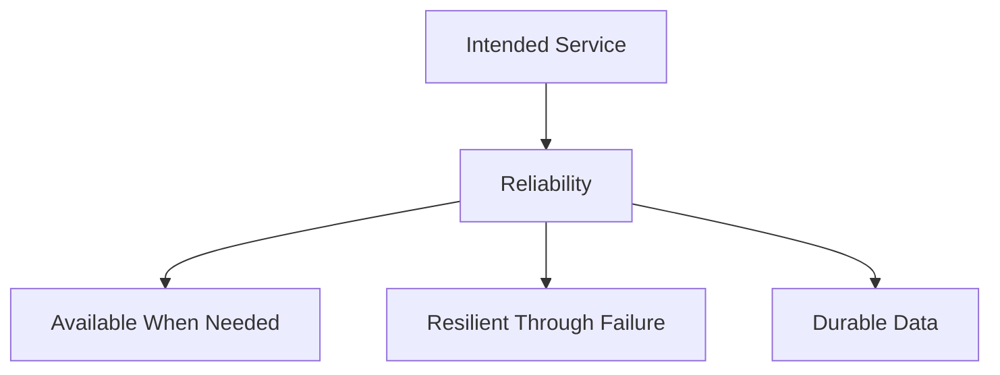
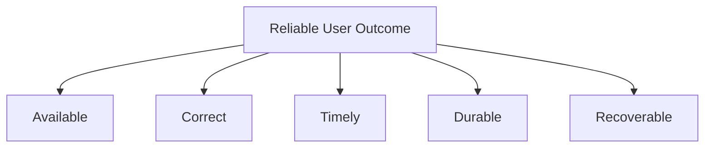
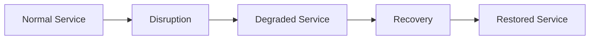
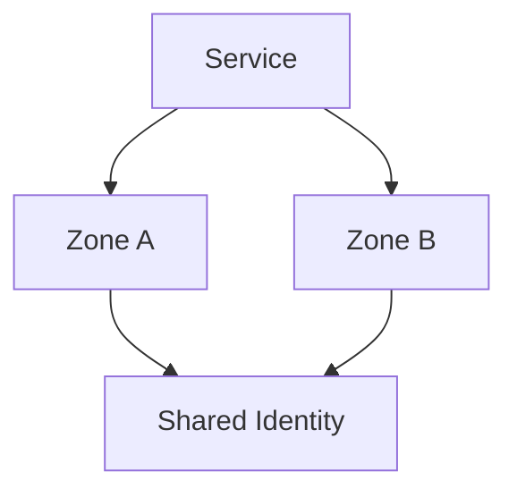

# Reliability, Availability, Resilience, and Durability

> Reliability describes whether a system performs its intended function consistently. Availability describes whether that function can be used when required. Resilience describes how the system withstands, adapts to, and recovers from disruption. Durability describes whether committed data remains preserved and retrievable over time.

## Chapter Purpose

Reliability, availability, resilience, and durability are closely related, but they are not synonyms.

Confusing them creates weak engineering decisions. Examples include:

- Calling a service reliable because its processes are running while it returns incorrect results
- Calling data durable because several replicas exist without testing corruption and restoration
- Calling a system resilient because it has redundant instances while all instances share one failure domain
- Calling monthly availability acceptable while one continuous outage exceeds the business recovery limit
- Calling a failover successful because traffic moved while users received stale or duplicated data

This chapter creates a precise working model for the four properties and explains how SREs measure, design, test, and operate them.

It covers:

- Definitions and boundaries
- Service behavior and user perspective
- Availability measurement and the number of nines
- Reliability as a broader system property
- Resilience, fault tolerance, and recovery
- Durability, integrity, consistency, and recoverability
- Dependencies and end-to-end behavior
- Failure domains and redundancy
- Degraded operation and graceful recovery
- RTO, RPO, SLOs, and error budgets
- Production scenarios, exercises, and knowledge checks

---

## Learning Objectives

After completing this chapter, you should be able to:

1. Define reliability, availability, resilience, and durability separately.
2. Explain how the four properties interact.
3. Identify systems that are strong in one property and weak in another.
4. Calculate basic time-based and request-based availability.
5. Explain the limits of availability percentages and averages.
6. Distinguish redundancy, high availability, fault tolerance, resilience, and disaster recovery.
7. Identify failure domains and common-mode failures.
8. Explain durability in terms of retained, correct, and retrievable data.
9. Distinguish durability, data integrity, consistency, backup, and replication.
10. Connect SLOs, error budgets, RTOs, and RPOs to the correct property.
11. Design graceful degradation and recovery verification.
12. Evaluate a service using all four properties.

---

## 1. The Four Questions

Each property answers a different question.

| Property | Core question |
| --- | --- |
| Reliability | Does the system perform its intended function consistently under defined conditions? |
| Availability | Can users access and use the required function when they need it? |
| Resilience | Can the system absorb disruption, limit harm, adapt, and recover? |
| Durability | Will committed data remain correct, preserved, and retrievable over time? |



Reliability is often used as the broadest term. Availability, resilience, and durability can be important contributors to reliability, depending on what the service is intended to do.

---

## 2. Reliability

Reliability is the ability of a system to perform its intended functions consistently within defined conditions.

The definition requires three things.

### Intended Function

What outcome must the system provide?

### Defined Conditions

Under what traffic, failure, geography, time, and operating assumptions must it work?

### Consistent Performance

How often and how predictably does it meet those expectations?

Google Cloud’s reliability guidance defines reliability as consistent performance of intended functions within defined conditions. See [Reliability Pillar](https://cloud.google.com/architecture/framework/reliability).

Reliability may include:

- Availability
- Latency
- Correctness
- Durability
- Capacity
- Consistency
- Recoverability
- Safe operation

The relevant dimensions depend on the service.

---

## 3. Availability

Availability is the proportion of time or eligible interactions for which a service is usable by its users.

Availability is not simply whether a process is running.

A service is unavailable from the user’s perspective when it:

- Cannot be reached
- Rejects valid requests
- Times out beyond the useful limit
- Returns unusable responses
- Fails for an important user segment
- Cannot complete the critical journey

Google’s SRE material describes uptime, also called availability, as the proportion of time a service is usable by its users. See [Data Integrity](https://sre.google/sre-book/data-integrity/).

Availability must be defined at a meaningful service boundary.

---

## 4. Resilience

Resilience is the ability of a system and its operating organization to withstand disruption, adapt, continue important behavior where possible, and recover.

Resilience includes what happens:

- Before disruption
- During disruption
- During recovery
- After recovery


A resilient system may temporarily provide reduced service rather than fail completely.

Resilience depends on:

- Architecture
- Failure containment
- Detection
- Response
- Recovery
- People
- Procedures
- Communication
- Learning

It is broader than the presence of redundant components.

---

## 5. Durability

Durability is the likelihood that committed data remains preserved and retrievable over time.

Durability asks:

- Is the data still present?
- Is it the correct data?
- Can an authorized user retrieve it?
- Can it survive component failure, corruption, and operational mistakes?
- Can it be restored when the primary system is lost?

Google’s SRE book describes durability as the likelihood that data will be retained over a long period. It also frames storage reliability through latency, availability, and durability. See [Service Level Objectives](https://sre.google/sre-book/service-level-objectives/).

Durability matters for:

- Databases
- Object storage
- Message systems
- Backups
- Event logs
- Configuration state
- Source repositories
- Audit records
- Machine learning datasets

---

## 6. A System Can Be Strong in One Property and Weak in Another

| Situation | Availability | Resilience | Durability | Overall reliability |
| --- | --- | --- | --- | --- |
| API responds quickly but returns wrong balances | High | Unknown | Data may exist | Low |
| Stored records survive, but the service is offline | Low | Depends on recovery | High | Low during outage |
| Service degrades safely and recovers quickly | Reduced briefly | High | Preserved | Potentially acceptable |
| Multi-region service serves stale replicated data | High | Appears high | Data retained | May be unreliable |
| Backup exists but cannot be restored | Current service may be high | Low | Unproven | High latent risk |

One metric cannot represent all four properties.

---

## 7. Reliability Begins With Intended Behavior

Before measuring any property, define what the service must do.

For a bank transfer service, intended behavior may include:

- Authenticate the authorized customer
- Validate available funds
- Transfer the correct amount once
- Record the transaction durably
- Return a clear result within a defined time
- Preserve audit evidence
- Recover without duplicating the transfer

If the endpoint returns HTTP 200 but records the wrong amount, it is available at the protocol level but unreliable as a transfer service.

The intended behavior determines which measurements matter.

---

## 8. Define the Conditions

Reliability claims require defined conditions.

Examples include:

- Expected traffic range
- Supported regions
- Valid request types
- Peak events
- Component failures
- Dependency behavior
- Data volume
- Client versions
- Maintenance conditions
- Security constraints

Weak claim:

> The service is reliable.

Stronger claim:

> The checkout journey meets its success and latency objectives at forecast peak load while any single application instance or availability zone is unavailable.

Claims outside tested conditions should be stated as assumptions, not evidence.

---

## 9. Time-Based Availability

A basic time-based calculation is:

```text
Availability = Uptime / Total measured time
```

Equivalent form:

```text
Availability = (Total time - Unavailable time) / Total time
```

Example:

```text
Measured period = 30 days = 43,200 minutes
Unavailable time = 60 minutes
Availability = (43,200 - 60) / 43,200
Availability = 99.8611 percent
```

Time-based measurement is useful when service usability is meaningfully represented by intervals.

---

## 10. Request-Based Availability

A request-based calculation is:

```text
Availability = Good eligible requests / Total eligible requests
```

Example:

```text
Eligible requests = 8,000,000
Good requests = 7,992,000
Availability = 7,992,000 / 8,000,000
Availability = 99.9 percent
```

This approach weights periods according to request volume. A five-minute outage during peak traffic consumes more budget than five minutes during very low demand.

The definitions of good and eligible determine whether the measure is trustworthy.

---

## 11. Window-Based Availability

A window-based SLI divides time into intervals and decides whether each interval is good.

```text
Window availability = Good windows / Total windows
```

Example:

- Measurement window: one minute
- Good minute: at least 99 percent of requests succeed
- Compliance period: 28 days

Window-based measures can represent periods of degraded experience, but the chosen window size matters.

A bad minute with one request may count the same as a bad minute with one million requests. Understand the behavior before selecting the method.

---

## 12. The Number of Nines

Availability targets are often described by their number of nines.

Approximate allowed unavailable time over a 30-day period:

| Availability target | Error budget | Approximate unavailable time |
| --- | --- | --- |
| 99 percent | 1 percent | 7 hours 12 minutes |
| 99.9 percent | 0.1 percent | 43 minutes 12 seconds |
| 99.95 percent | 0.05 percent | 21 minutes 36 seconds |
| 99.99 percent | 0.01 percent | 4 minutes 19 seconds |
| 99.999 percent | 0.001 percent | 26 seconds |

These values assume time-based availability across exactly 30 days. Request-based budgets depend on eligible event volume.

Higher targets require stronger engineering and provide less room for change and failure.

---

## 13. Availability Percentage Can Hide Outage Shape

The same monthly availability can represent very different experiences.

Example A:

- One continuous 43-minute outage

Example B:

- Forty-three separate one-minute outages

Example C:

- Thousands of failed requests spread across the month

All may produce similar aggregate availability, but they differ in:

- User disruption
- Recoverability
- Business deadlines
- Detection
- Repeated interruption
- Customer segments

Track outage duration, frequency, distribution, and affected journeys alongside the aggregate.

---

## 14. Availability Can Hide Partial Failure

Global success may hide:

- One failed region
- One tenant
- One identity provider
- One client version
- One transaction type
- High-percentile latency
- Accessibility failure

If 99 percent of users succeed and one percent cannot use the service at all, overall availability may still look strong.

Segment measurements when failure can occur independently or create material harm.

---

## 15. Scheduled Maintenance and Availability

Excluding maintenance does not remove user impact.

Decide whether maintenance counts based on:

- Product promise
- User need during the window
- Advance communication
- Alternative service
- Contract terms
- Whether downtime is being reduced

If users reasonably expect the service to work, excluding downtime may produce a misleading availability result.

Document all exclusions and review them regularly.

---

## 16. Reliability Is Broader Than Availability

A reliable service may need to satisfy several properties simultaneously.



Examples of available but unreliable systems:

- A weather API returns yesterday’s data.
- A payment API charges twice.
- A storage service acknowledges writes that later disappear.
- A search service takes two minutes to respond.
- An authorization service approves unauthorized access.

Availability is important, but it is not proof of correctness, safety, or durability.

---

## 17. Reliability Over Time

Reliability can be examined as the probability that a system performs correctly for a defined period under defined conditions.

Some engineering contexts use:

```text
Reliability over interval t = Probability of failure-free operation during t
```

For continuously repairable online services, SRE often focuses on observed good service, error budgets, detection, and recovery rather than assuming a simple component lifetime model.

Use the model that matches the service and decision.

---

## 18. Mean Time Between Failures

Mean time between failures, or MTBF, is often calculated as:

```text
MTBF = Total operating time / Number of failures
```

It can help describe repairable systems, but it has limits.

- Failure definitions may differ.
- A mean hides distribution.
- Failure rates may change.
- Software failures are not always independent.
- Rare severe events can dominate risk.
- User impact may vary greatly.

Do not use MTBF alone to claim product reliability.

---

## 19. Mean Time to Repair or Restore

Mean time to repair, restore, or recover is often summarized as MTTR.

Organizations use the acronym differently. Define it explicitly.

Possible meanings include:

- Time to repair the failed component
- Time to restore service
- Time to recover the user journey
- Time to complete all remediation

A service can restore quickly while data reconciliation continues for hours.

Use distributions and percentiles where possible. One long incident can disappear inside a mean.

---

## 20. A Simplified Availability Relationship

For some repairable systems under simplifying assumptions:

```text
Availability ≈ MTBF / (MTBF + MTTR)
```

Example:

```text
MTBF = 720 hours
MTTR = 1 hour
Availability ≈ 720 / 721
Availability ≈ 99.861 percent
```

This relationship is useful for intuition. Real distributed services may have partial failures, overlapping incidents, variable repair times, and user-weighted demand. Measure actual service behavior whenever possible.

---

## 21. Resilience Is Behavior Under Disruption

Resilience becomes visible when normal assumptions fail.

A resilient service may:

- Continue core functions
- Isolate the affected area
- Shed noncritical work
- Fail over
- Serve safe cached data
- Queue work for later
- Recover automatically
- Support controlled manual response

Resilience is not the absence of disturbance. It is the ability to manage disturbance without unacceptable outcomes.

---

## 22. The Resilience Curve



The curve highlights:

- Initial loss of service
- Lowest service level
- Ability to continue in degraded mode
- Recovery speed
- Final restored state

Two systems with the same monthly availability can have different resilience. One may collapse fully and recover slowly. Another may preserve critical work and recover predictably.

---

## 23. Resistance, Absorption, Adaptation, and Recovery

### Resistance

Avoid degradation when a disturbance occurs.

### Absorption

Limit how far service quality falls.

### Adaptation

Change behavior to continue important functions.

### Recovery

Return to an acceptable and stable state.

### Learning

Improve the system based on what occurred.

A mature resilience strategy does not rely only on resistance. Some failures will exceed preventive controls.

---

## 24. Resilience Is a System and Organizational Property

Technology may fail safely while the response organization fails.

Resilience also depends on:

- Clear ownership
- Incident command
- Sustainable on-call
- Communication
- Access
- Runbooks
- Decision authority
- Supplier response
- Business workarounds
- Training

A redundant architecture with inaccessible credentials or untrained responders may not recover within its objective.

---

## 25. Redundancy

Redundancy provides more than one component, path, or copy.

Examples include:

- Multiple instances
- Multiple zones
- Multiple network paths
- Replicated data
- Secondary providers
- Multiple trained responders

Redundancy creates potential tolerance to failure. It does not prove it.

Redundant components must be:

- In appropriate failure domains
- Capable of carrying required load
- Kept in usable state
- Reachable during failure
- Tested
- Observable

---

## 26. Failure Domains

A failure domain is a boundary within which one event can affect multiple components.

Examples include:

- Process
- Host
- Rack
- Availability zone
- Region
- Cloud account
- Provider
- Network
- Identity system
- Deployment pipeline
- Software version
- Operational team



The diagram has zonal redundancy but a shared identity failure domain.

Map both physical and logical domains.

---

## 27. Common-Mode Failure

Common-mode failure occurs when one cause defeats supposedly independent components.

Examples include:

- Same faulty release in every region
- Shared DNS failure
- Global credential revocation
- One corrupted configuration source
- Replicated data corruption
- Shared capacity limit
- One operator action applied globally

Independence is as important as duplication.

---

## 28. High Availability

High availability is an architectural and operational approach intended to keep service usable despite expected component failures.

Common techniques include:

- Redundant instances
- Health checks
- Automatic replacement
- Load balancing
- Zonal distribution
- Failover
- Capacity headroom
- Rolling maintenance

High availability usually addresses frequent or expected failure within a defined scope. It does not automatically provide disaster recovery or data durability.

---

## 29. Fault Tolerance

Fault tolerance is the ability to continue required operation when faults occur, often with little or no interruption.

It may use:

- Replication
- Voting
- Error correction
- Redundant paths
- Failover
- Isolation

Fault tolerance has a defined fault model. A system tolerant of one node failure may not tolerate:

- Regional loss
- Byzantine behavior
- Correlated software defect
- Data corruption
- Operator error
- Dependency failure

Always state which faults are tolerated.

---

## 30. High Availability, Fault Tolerance, Resilience, and DR

| Concept | Main focus |
| --- | --- |
| High availability | Keep the service usable through expected failures |
| Fault tolerance | Continue operation despite faults in the stated fault model |
| Resilience | Absorb, adapt to, recover from, and learn from disruption |
| Disaster recovery | Restore technology and data after a severe disruptive event |

They overlap but have different scope.

A multi-zone service may be highly available for a zone failure and still require disaster recovery for regional loss or data corruption.

---

## 31. Graceful Degradation

Graceful degradation preserves essential service while reducing noncritical behavior.

Examples include:

- Disable recommendations but preserve checkout.
- Serve cached data when live computation fails.
- Allow reads while writes are paused.
- Queue nonurgent work.
- Reduce image quality to preserve streaming.

Google Cloud describes graceful degradation as continued function, possibly with reduced performance or accuracy, rather than complete failure. See [Design for Graceful Degradation](https://cloud.google.com/architecture/framework/reliability/graceful-degradation).

The degraded state must be safe, visible, and reversible.

---

## 32. Load Shedding

Load shedding rejects or delays selected work to preserve essential service.

Good load shedding is:

- Intentional
- Prioritized
- Measurable
- Applied before total collapse
- Fair where appropriate
- Communicated through correct responses

Examples include:

- Reject background analytics before payment requests.
- Limit expensive queries.
- Preserve existing sessions before new sessions.
- Return a retryable response with backoff guidance.

Random failure under overload is not graceful degradation.

---

## 33. Timeouts, Retries, and Resilience

Timeouts prevent indefinite waiting. Retries may recover from transient failure. Both can also amplify outages.

Unsafe retry behavior can:

- Multiply load
- Duplicate non-idempotent actions
- Exhaust connection pools
- Extend latency
- Spread failure upstream

Design with:

- Time budgets
- Bounded retries
- Exponential backoff
- Jitter
- Idempotency
- Retry budgets
- Circuit breaking

Google’s [Addressing Cascading Failures](https://sre.google/sre-book/addressing-cascading-failures/) explains how positive feedback and load transfer can expand failure.

---

## 34. Failover Is Not Automatically Resilience

Failover can fail because:

- The standby is unhealthy.
- Capacity is insufficient.
- Data is stale.
- Routing does not update.
- Credentials are missing.
- Dependencies remain in the failed region.
- Operators cannot activate the plan.

Verify failover end to end.

Successful traffic movement is only one stage. Confirm user behavior, data integrity, capacity, and sustained stability.

---

## 35. Recovery Time Objective

Recovery time objective, or RTO, defines the targeted maximum time to restore a service or business function after disruption.

RTO influences:

- Detection speed
- Standby design
- Automation
- Staffing
- Recovery capacity
- Testing frequency

RTO is a target. Actual recovery time provides evidence.

---

## 36. Recovery Point Objective

Recovery point objective, or RPO, defines the maximum acceptable data loss measured in time.

Examples:

- RPO zero requires preservation of committed data.
- RPO five minutes permits restoration to a point no older than five minutes.
- RPO twenty-four hours may use a daily recovery point.

RPO is not the same as backup frequency. It must include successful capture, preservation, restoration, and verification.

---

## 37. Durability Is Not Availability

A storage service can retain data while temporarily preventing access.

- Durability asks whether the data remains.
- Availability asks whether it can be accessed now.

Temporarily taking corrupted data offline may reduce availability while protecting integrity and durability.

Conversely, a service may remain available while acknowledging writes that are not safely retained.

These tradeoffs must be explicit.

---

## 38. Durability Is Not Backup

Backups are one durability and recovery control.

Durability also depends on:

- Replication
- Checksums
- Versioning
- Immutability
- Error detection
- Repair
- Access protection
- Media lifecycle
- Restore testing
- Deletion controls

A backup that is corrupted, inaccessible, incomplete, or untested does not provide proven recoverability.

---

## 39. Durability Is Not Replication

Replication protects against some failures but can reproduce:

- Accidental deletion
- Application corruption
- Malicious changes
- Faulty schema migration
- Incorrect writes

Replication improves redundancy and access. Independent recovery points may still be required.

Use controls with different failure characteristics.

---

## 40. Durability, Integrity, and Consistency

| Property | Question |
| --- | --- |
| Durability | Does committed data remain preserved and retrievable? |
| Integrity | Is data complete, correct, and protected from unauthorized or accidental alteration? |
| Consistency | What values may readers observe after writes and across replicas? |

Data can be durable but wrong. It can be correct on one replica but inconsistent across readers. It can be retained but inaccessible.

Reliable data services need appropriate definitions for all three.

---

## 41. Acknowledgment Defines a Durability Promise

When a service acknowledges a write, users infer a promise.

The promise may mean:

- Accepted into memory
- Written to one local disk
- Replicated to several nodes
- Committed by consensus
- Preserved across regions

Document what acknowledgment means.

If the service returns success before the intended durability condition is met, users can lose data they believed was safe.

---

## 42. Measuring Durability

A simple event-based durability SLI can be:

```text
Durability = Successfully retrievable committed records / Total committed records
```

Durability may also be expressed as probability of retaining an object over a period.

Challenges include:

- Loss is rare.
- Complete verification can be expensive.
- Silent corruption may remain undetected.
- Deleted and intentionally expired data must be excluded correctly.
- Retrievability depends on indexes, metadata, and keys.

Use active integrity checks, audits, restore tests, and controlled sampling.

---

## 43. Durability Nines Are Not Availability Nines

A provider may advertise high annual durability for stored objects and a different availability target for access.

Do not compare them as if they describe the same event.

- Availability nines concern successful access or usable time.
- Durability nines concern retained data.

The measurement population and period must be understood.

An extremely durable object may still be unavailable during a service outage.

---

## 44. Silent Data Corruption

Silent corruption occurs when data changes or becomes unreadable without immediate detection.

Controls include:

- Checksums
- End-to-end validation
- Scrubbing
- Replication comparison
- Immutable logs
- Reconciliation
- Application invariants
- Restore testing

Detection latency affects impact. Corruption that remains hidden may propagate into replicas and backups.

Google’s [Data Integrity](https://sre.google/sre-book/data-integrity/) emphasizes proactive detection, rapid repair, and recovery.

---

## 45. Deletion Is a Durability Risk

Data loss often results from valid commands executed against the wrong target.

Controls include:

- Least privilege
- Soft deletion
- Versioning
- Retention locks
- Delayed deletion
- Quotas
- Approval for broad destructive actions
- Target validation
- Audit logging
- Independent backups

Automation should reduce, not expand, destructive blast radius.

---

## 46. Data Lifecycle and Durability

Durability requirements change across the data lifecycle.

Stages include:

- Creation
- Active use
- Replication
- Backup
- Archival
- Retention
- Deletion

Questions include:

- How long must data remain?
- Where may it be stored?
- When should it be deleted?
- Can deletion be proven?
- Are old formats readable?
- Are encryption keys retained appropriately?

Keeping data forever is not automatically safer. Excess retention creates privacy, legal, cost, and security risk.

---

## 47. Data Recovery Requires More Than Bytes

Restoration may require:

- Schema
- Metadata
- Encryption keys
- Configuration
- Indexes
- Access control
- Application version
- Dependency state
- Replay position

A backup of data files alone may not restore a usable service.

Test the complete recovery path.

---

## 48. End-to-End Reliability

Users depend on service chains.

For a journey with serial dependencies, total availability is generally no greater than its weakest path and may be lower than each individual component.

Under simplifying independence assumptions:

```text
End-to-end availability = A1 × A2 × A3 × ... × An
```

Example:

```text
Three required services, each at 99.9 percent
End-to-end availability = 0.999 × 0.999 × 0.999
End-to-end availability ≈ 99.7003 percent
```

Real dependencies may not be independent. Shared failures can make the result worse.

---

## 49. Parallel Redundancy

For two independent components where either can provide service:

```text
Combined availability = 1 - (1 - A1)(1 - A2)
```

If both are independently 99 percent available:

```text
Combined availability = 1 - (0.01 × 0.01)
Combined availability = 99.99 percent
```

This improvement assumes:

- Failures are independent.
- Failover works.
- Capacity is sufficient.
- State is usable.
- Routing is correct.

Those assumptions require evidence.

---

## 50. Dependency Reliability Budgets

An end-to-end SLO constrains dependencies.

If a critical journey requires many synchronous services, each dependency consumes part of the reliability budget.

Strategies include:

- Remove unnecessary synchronous dependencies.
- Use caching or asynchronous work.
- Set stronger dependency objectives.
- Create safe fallback.
- Isolate optional features.
- Reduce correlated failure.

Do not assign the entire user-journey SLO independently to every service without analyzing composition.

---

## 51. Availability Zones and Regions

Deployment scope should match the fault model.

### Multi-Instance

Can tolerate some process or host failures.

### Multi-Zone

Can tolerate some zonal failures if dependencies, capacity, and routing are also distributed.

### Multi-Region

Can address regional failure but adds data, consistency, cost, and operational complexity.

### Multicloud

Can reduce selected provider risks but introduces portability, skill, networking, data, and control-plane challenges.

Choose architecture from required reliability outcomes, not from labels.

---

## 52. Capacity and Resilience

Redundant capacity must carry failover load.

If three zones each run at 80 percent utilization, losing one zone sends too much demand to the remaining two.

Capacity planning should include:

- Normal peak
- Failure peak
- Scaling delay
- Recovery traffic
- Retry load
- Backlog processing
- Dependency limits

Headroom is a resilience control.

---

## 53. Observability and the Four Properties

Observability should provide evidence for:

### Reliability

Is the intended function correct and timely?

### Availability

Can users complete eligible interactions?

### Resilience

How did service level change, contain, and recover during disruption?

### Durability

Are committed records present, correct, and retrievable?

Infrastructure telemetry supports diagnosis. User and data outcomes establish whether the service is meeting its obligations.

---

## 54. Testing Availability

Availability tests include:

- External probes
- Journey tests
- Load tests
- Zonal failure tests
- Deployment interruption
- Dependency timeouts
- Capacity exhaustion

Measure from meaningful boundaries and include critical segments.

---

## 55. Testing Resilience

Resilience tests should state a hypothesis.

Example:

> If one availability zone is removed at peak load, checkout will remain within its success and latency SLO, no confirmed order will be lost, and capacity will stabilize within five minutes.

Test:

- Detection
- Containment
- Degraded behavior
- Failover
- Human response
- Recovery
- Return to normal

Do not introduce uncontrolled failure into production without authority, safeguards, and rollback.

---

## 56. Testing Durability

Durability tests include:

- Checksum validation
- Record reconciliation
- Replica comparison
- Backup restoration
- Point-in-time recovery
- Accidental deletion recovery
- Key recovery
- Schema compatibility
- Large-scale restore

Verify the application can use restored data correctly.

---

## 57. Recovery Verification

Recovery is complete when:

- Critical journeys work.
- SLO indicators are healthy.
- Data is correct.
- Backlogs are controlled.
- Dependencies are stable.
- Temporary mitigations are recorded.
- The service remains stable through an observation period.

Process health alone is insufficient.

---

## 58. SLOs for the Four Properties

Possible objectives include:

### Availability

> 99.95 percent of eligible checkout attempts complete successfully over 28 days.

### Latency and Reliability

> 99 percent of good search responses complete within 500 milliseconds.

### Resilience

> During loss of any one zone, 99.9 percent of valid payment requests continue successfully, and full capacity is restored within ten minutes.

### Durability

> 99.999999999 percent of committed objects remain retrievable over one year, subject to the defined event population and exclusions.

Verify that the data source can support the claim.

---

## 59. Error Budgets

An error budget is the permitted unreliability under an SLO.

Use it to:

- Track user-impacting failure
- Guide release risk
- Prioritize reliability work
- Discuss acceptable tradeoffs

Separate budgets may be needed for distinct properties or journeys.

An availability budget does not authorize data loss unless the durability and integrity policy explicitly permits it.

---

## 60. Tradeoffs Among the Properties

Examples include:

- Taking data offline may reduce availability to protect integrity.
- Synchronous replication may improve durability but add write latency.
- Multi-region operation may improve resilience but add consistency complexity.
- Aggressive caching may improve availability and latency but reduce freshness.
- Rapid failover may restore access while serving stale state.

There is no universal order of importance.

Use product need, safety, data, contracts, and business risk.

---

## 61. Production Scenario: Available but Incorrect

### Situation

A pricing API responds successfully to 99.99 percent of requests. A stale cache serves yesterday’s prices to one region.

### Analysis

- Protocol availability is high.
- Product correctness is low for the affected region.
- Cached data remains durable.
- The fallback behavior is unsafe for current pricing.

### Response

- Stop the unsafe cache path.
- Restore correct data.
- Identify affected transactions.
- Add freshness and correctness indicators.
- Define when stale service is allowed.

### Lesson

Availability cannot substitute for reliability.

---

## 62. Production Scenario: Durable but Unavailable

### Situation

Customer documents are safely replicated, but an identity outage prevents access for two hours.

### Analysis

- Data durability remains high.
- Product availability is low.
- Resilience depends on identity failure handling and recovery.

### Treatment

- Evaluate safe session continuity.
- Provide independent responder access.
- Test identity-provider failure.
- Measure the document-access journey.

### Lesson

Data can remain safe while the product is unavailable.

---

## 63. Production Scenario: Replicated Corruption

### Situation

A faulty migration overwrites valid customer status values. Replication copies the change to every region.

### Analysis

- Replication worked as designed.
- Redundancy did not protect logical integrity.
- The service may remain available while returning wrong state.

### Recovery

- Stop further writes.
- Identify the corruption window.
- Restore or reconstruct correct values.
- Reconcile affected actions.
- Add migration validation and immutable recovery points.

### Lesson

Replication is not backup and durability is not correctness.

---

## 64. Production Scenario: Failed Zonal Failover

### Situation

A service runs in three zones. One zone fails. The other zones reach saturation, retries increase load, and the entire region becomes unavailable.

### Analysis

- Instance redundancy existed.
- Failure capacity was insufficient.
- Retries created positive feedback.
- The system was not resilient to the stated fault.

### Treatment

- Reserve failure headroom.
- Apply retry budgets and backoff.
- Shed optional load.
- Test zone loss at realistic peak traffic.

### Lesson

Redundancy without capacity and feedback control does not provide high availability.

---

## 65. Production Scenario: Backup Without Keys

### Situation

Backups are complete, but the recovery environment cannot access the encryption keys needed to restore them.

### Analysis

- Stored bytes may be durable.
- Recoverability is unproven.
- RTO and RPO cannot be met.

### Treatment

- Design secure key recovery.
- Test complete restoration.
- Protect access from shared failure.
- Verify application and data integrity.

### Lesson

Durability depends on every artifact required for authorized retrieval.

---

## 66. Production Scenario: Fast Failover, Stale Data

### Situation

Traffic fails over to a secondary region in ninety seconds. Asynchronous replication is fifteen minutes behind. Users can access the product but cannot see recent orders.

### Analysis

- Access recovers quickly.
- RTO may be met.
- RPO may be exceeded.
- Availability returns before complete reliability.

### Decision

Depending on product requirements, the team may:

- Pause affected writes.
- Expose a clear degraded state.
- Reconcile later.
- Delay failover until safe.

### Lesson

Recovery speed and data recovery point must be evaluated together.

---

## 67. Practical Exercise: Classify the Property

Identify the primary property in each requirement.

1. Valid login attempts succeed 99.95 percent of the time.
2. Confirmed orders remain retrievable for seven years.
3. Checkout continues during loss of one zone.
4. Balance calculations return correct values.
5. Regional failover completes within ten minutes.

### Suggested Answers

1. Availability
2. Durability
3. Resilience and availability
4. Reliability and correctness
5. Resilience and recovery

---

## 68. Practical Exercise: Calculate Availability

### Time-Based

A service is unavailable for 75 minutes in a 30-day period.

```text
Availability = (43,200 - 75) / 43,200
```

Calculate the result and compare it with a 99.9 percent SLO.

### Request-Based

A service receives 5,000,000 eligible requests. 12,500 are bad.

```text
Availability = (5,000,000 - 12,500) / 5,000,000
```

Explain why the two methods may produce different conclusions.

---

## 69. Practical Exercise: Map Failure Domains

For one service, list dependencies by:

- Process
- Host
- Zone
- Region
- Account
- Network
- Identity
- Data store
- Deployment system
- Provider
- Human team

Then identify which supposedly redundant components share a domain.

---

## 70. Practical Exercise: Define a Resilience Hypothesis

Use:

```text
If [failure occurs], then [critical service] will [expected behavior],
while [user and data limits] remain within [objective],
and recovery will complete within [time].
```

Define:

- Safety conditions
- Test scope
- Observation signals
- Stop conditions
- Rollback
- Success criteria

---

## 71. Practical Exercise: Audit Durability

Choose one important dataset and document:

- Commitment point
- Replication
- Integrity checks
- Backup
- Retention
- Encryption-key dependency
- Deletion protection
- RPO
- RTO
- Last restore test
- Achieved restore result
- Known gaps
- Owner

Do not mark durability proven without retrievability and integrity evidence.

---

## 72. Practical Exercise: Build a Four-Property Scorecard

| Property | Objective | Evidence | Gap | Owner | Next test |
| --- | --- | --- | --- | --- | --- |
| Reliability | | | | | |
| Availability | | | | | |
| Resilience | | | | | |
| Durability | | | | | |

Use evidence, not subjective maturity labels.

---

## 73. Common Anti-Patterns

### Uptime Equals Reliability

Correctness, latency, durability, and recovery are ignored.

### Redundancy Equals Resilience

Duplicate components share a failure domain or cannot carry failover load.

### Replication Equals Backup

Logical corruption and deletion propagate to every copy.

### Backup Equals Durability

Restoration, keys, schema, and integrity are untested.

### Monthly Percentage Hides Long Outage

Aggregate availability masks an unacceptable continuous disruption.

### All Nines Mean the Same Thing

Availability and durability claims are compared without understanding event populations.

### Failover Equals Recovery

Traffic moves while data is stale, backlogs grow, or users remain affected.

### More Regions Always Improve Reliability

New consistency, routing, and operational complexity are ignored.

---

## 74. Design Review Checklist

### Reliability

- What is the intended function?
- Under which conditions must it work?
- Which correctness and latency requirements apply?

### Availability

- What defines a good eligible event?
- Where is availability measured?
- Which segments can fail independently?

### Resilience

- Which disruptions are in scope?
- What is the degraded state?
- Are failure domains independent?
- Is failover capacity sufficient?
- Is recovery tested?

### Durability

- What does write acknowledgment promise?
- How are corruption and deletion detected?
- Are recovery points independent?
- Can data be restored and verified?

### Tradeoffs

- Which property takes priority during conflict?
- Who accepts residual risk?
- What evidence triggers redesign?

---

## 75. Reflection Questions

1. Which service is called reliable based only on uptime?
2. Which user segment is hidden by an aggregate availability measure?
3. Which redundant components share a failure domain?
4. Can remaining capacity handle a zonal failure at peak demand?
5. What does a successful write acknowledgment guarantee?
6. When was the last complete restore test?
7. Could corruption propagate into every replica and backup?
8. Which service has an undefined degraded state?
9. Does the RTO include complete user recovery?
10. Can the service meet RPO during actual failover?
11. Which higher reliability target adds cost without user benefit?
12. Which resilience claim has never been tested?

---

## 76. Knowledge Check

### 1. What is availability?

A. The likelihood that data remains forever  
B. The proportion of time or interactions for which users can use the service  
C. The ability to add features  
D. The number of replicas

**Answer: B**

### 2. What is resilience?

A. Never experiencing failure  
B. Absorbing, adapting to, and recovering from disruption  
C. Keeping one backup  
D. Achieving low latency only

**Answer: B**

### 3. What is durability?

A. The likelihood that committed data remains preserved and retrievable  
B. The speed of a request  
C. The number of alerts  
D. The length of an incident

**Answer: A**

### 4. Why is reliability broader than availability?

A. A service can be reachable while returning incorrect, slow, or unsafe results  
B. Availability cannot be measured  
C. Reliability applies only to storage  
D. They are unrelated

**Answer: A**

### 5. Why does redundancy not prove resilience?

A. Redundancy always reduces availability  
B. Components may share failure domains, lack capacity, or fail over incorrectly  
C. Only one component can operate  
D. Resilience requires no components

**Answer: B**

### 6. What is a common-mode failure?

A. Independent failures at unrelated times  
B. One cause defeats several supposedly independent components  
C. A successful failover  
D. A planned test

**Answer: B**

### 7. Why is replication not backup?

A. Replicas cannot store data  
B. Deletion and corruption can propagate to replicas  
C. Backups require no data  
D. Replication prevents reads

**Answer: B**

### 8. What does RPO describe?

A. Maximum targeted recovery time  
B. Maximum acceptable data loss measured in time  
C. Monthly uptime  
D. Incident severity

**Answer: B**

### 9. What does graceful degradation do?

A. Hides every failure  
B. Preserves essential service while reducing noncritical behavior  
C. Deletes old data  
D. Disables monitoring

**Answer: B**

### 10. What must be true for the parallel-availability formula to be useful?

A. Failures and failover assumptions are understood, including independence  
B. Both components always fail together  
C. No traffic exists  
D. Data is never written

**Answer: A**

### 11. When is recovery complete?

A. When traffic moves  
B. When processes restart  
C. When user journeys, data, backlogs, dependencies, and stability meet requirements  
D. When alerts are muted

**Answer: C**

### 12. Can an availability SLO authorize data loss?

A. Yes, always  
B. No, availability budget alone does not define acceptable durability or integrity loss  
C. Only during maintenance  
D. Only when latency is low

**Answer: B**

---

## 77. Completion Checklist

You have completed this chapter when you can:

- [ ] Define all four properties separately.
- [ ] Explain why availability does not prove reliability.
- [ ] Calculate basic time-based and request-based availability.
- [ ] Explain the limits of nines and averages.
- [ ] Distinguish high availability, fault tolerance, resilience, and disaster recovery.
- [ ] Map physical and logical failure domains.
- [ ] Identify common-mode and cascading failure.
- [ ] Define a safe degraded state.
- [ ] Explain durability beyond replication and backup.
- [ ] Distinguish durability, integrity, and consistency.
- [ ] Explain write acknowledgment as a durability promise.
- [ ] Connect RTO and RPO to recovery design.
- [ ] Test availability, resilience, and durability with explicit hypotheses.
- [ ] Verify recovery at the user and data level.
- [ ] Evaluate a real service with the four-property scorecard.

---

## 78. Key Takeaways

1. Reliability is the broad ability to perform intended functions consistently under defined conditions.
2. Availability measures whether users can use the service when required.
3. Resilience describes behavior through disruption and recovery.
4. Durability describes whether committed data remains preserved and retrievable.
5. A system can be strong in one property and weak in another.
6. Availability percentages can hide outage shape, segments, correctness, and data loss.
7. Redundancy creates potential protection but requires independence, capacity, failover, and testing.
8. Fault tolerance always depends on a defined fault model.
9. Replication is not backup, and backup completion is not recovery evidence.
10. Durability, integrity, and consistency answer different data questions.
11. RTO concerns recovery time, while RPO concerns acceptable data loss.
12. End-to-end reliability depends on the entire user path and correlated dependencies.
13. Graceful degradation preserves prioritized service rather than allowing random collapse.
14. Recovery must be verified through user behavior, data correctness, backlog, and stability.

---

## 79. Authoritative Resources

### Reliability and Availability

- [Google Cloud Reliability Pillar](https://cloud.google.com/architecture/framework/reliability)
- [Google SRE: Service Level Objectives](https://sre.google/sre-book/service-level-objectives/)
- [Google SRE: Embracing Risk](https://sre.google/sre-book/embracing-risk/)
- [Implementing SLOs](https://sre.google/workbook/implementing-slos/)

### Resilience and Failure

- [Addressing Cascading Failures](https://sre.google/sre-book/addressing-cascading-failures/)
- [Handling Overload](https://sre.google/sre-book/handling-overload/)
- [Production Services Best Practices](https://sre.google/sre-book/service-best-practices/)
- [Design for Graceful Degradation](https://cloud.google.com/architecture/framework/reliability/graceful-degradation)
- [Architecting Disaster Recovery](https://cloud.google.com/architecture/disaster-recovery)

### Durability and Data

- [Data Integrity: What You Read Is What You Wrote](https://sre.google/sre-book/data-integrity/)
- [Managing Critical State](https://sre.google/sre-book/managing-critical-state/)
- [Perform Testing for Recovery From Data Loss](https://cloud.google.com/architecture/framework/reliability/perform-testing-for-recovery-from-data-loss)
- [BigQuery Reliability Introduction](https://cloud.google.com/bigquery/docs/reliability-intro)

### Source Interpretation

- Google SRE material provides conceptual definitions and practices drawn from Google systems.
- Cloud-provider durability claims must be read with their exact scope, event definition, exclusions, and customer responsibilities.
- Architecture patterns should be selected from service requirements and failure models, not copied without context.
- Numerical examples in this chapter are illustrative and should be recalculated for the actual period, traffic, and measurement method.

---

## 80. Related SRE World Sections

- [What Is SRE?](./01-What-Is-SRE.md)
- [History and Evolution of SRE](./02-History-and-Evolution-of-SRE.md)
- [The SRE Mindset](./03-The-SRE-Mindset.md)
- [Reliability as a Product Feature](./04-Reliability-as-a-Product-Feature.md)
- [Reliability and Business Risk](./05-Reliability-and-Business-Risk.md)
- [SRE Foundations](./README.md)
- [SLIs, SLOs, and SLAs](../03-SLIs-SLOs-and-SLAs/)
- [Error Budgets](../04-Error-Budgets/)
- [Risk and Reliability](../05-Risk-and-Reliability/)
- [Incident Management](../08-Incident-Management/)
- [Capacity Planning](../15-Capacity-Planning/)
- [Disaster Recovery and Continuity](../17-Disaster-Recovery-and-Continuity/)
- [Dependency Management](../18-Dependency-Management/)

---

## Next Chapter

[07: Service Reliability Fundamentals](./07-Service-Reliability-Fundamentals.md)

---

## Maintained by VERIQTA

SRE World is created and maintained by [VERIQTA](https://github.com/veriqta).

- Website: [veriqta.com](https://www.veriqta.com/)
- GitHub: [github.com/veriqta](https://github.com/veriqta)
- Instagram: [@veriqta](https://www.instagram.com/veriqta/)
- Medium: [veriqta.medium.com](https://veriqta.medium.com/)

> A system is not reliable merely because it is online. It must deliver the right outcome, survive disruption, and preserve what users trusted it to keep.
