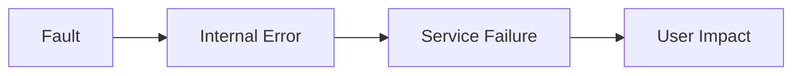
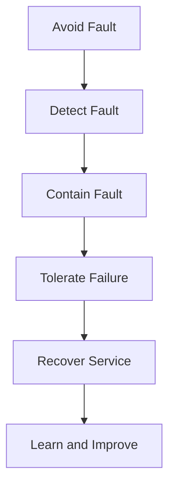
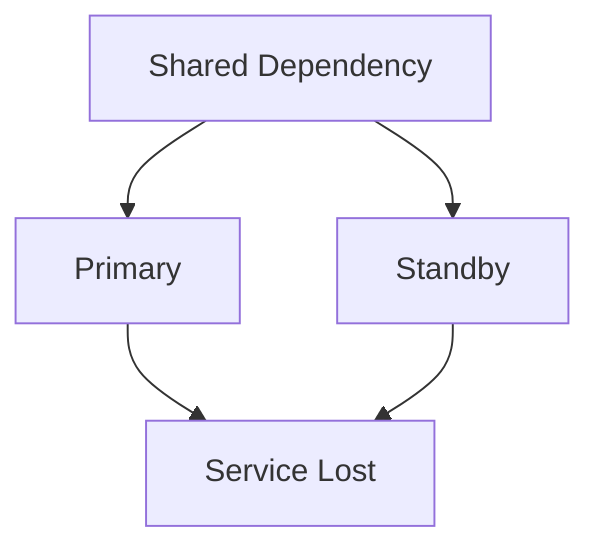
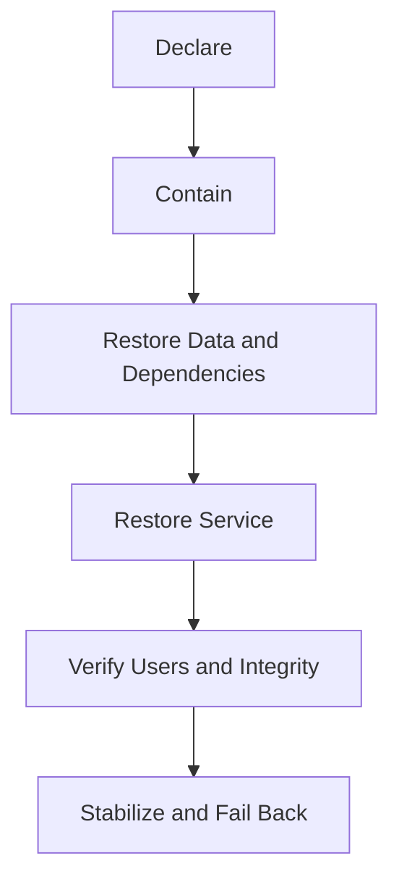

# Fault Tolerance and Disaster Recovery

> Fault tolerance keeps required service operating through defined faults. Disaster recovery restores service and data after disruption exceeds normal high-availability protections. Both depend on explicit failure models, recovery objectives, independent failure domains, and tested procedures.

## Chapter Purpose

Fault tolerance and disaster recovery are often reduced to replicas, multiple regions, backups, and failover buttons. These components may help, but their presence does not prove that a service can survive or recover from failure.

A credible design must answer:

- Which faults are expected?
- Which faults must the service tolerate without interruption?
- Which events activate disaster recovery?
- What service must continue during disruption?
- How much data loss is acceptable?
- How quickly must recovery complete?
- Which dependencies and control planes are required?
- How is split brain prevented?
- How is recovered data validated?
- How does the organization return to normal operation?
- What evidence proves that the plan works?

This chapter explains fault tolerance and disaster recovery as related but distinct SRE capabilities. It covers architecture, data, automation, incident command, business context, testing, and operational evidence.

---

## Learning Objectives

After completing this chapter, you should be able to:

1. Distinguish fault avoidance, fault tolerance, high availability, resilience, disaster recovery, and business continuity.
2. Define a fault model for a production service.
3. Identify physical, logical, organizational, and control-plane failure domains.
4. Select appropriate redundancy, replication, and failover patterns.
5. Explain active-active, active-passive, pilot-light, warm-standby, and backup-and-restore strategies.
6. Connect RTO, RPO, SLOs, and business impact.
7. Explain why backup, replication, and disaster recovery are different.
8. Prevent split brain, stale recovery, and unsafe failback.
9. Design a complete disaster recovery plan.
10. Test recovery safely and measure achieved objectives.
11. Evaluate people, access, communication, and third-party dependencies.
12. Diagnose common fault-tolerance and disaster-recovery failures.

---

## 1. Start With the Failure Model

A failure model defines the failures a system is expected to handle.

It may include:

- Process crash
- Host failure
- Disk failure
- Network partition
- Availability-zone loss
- Regional outage
- Dependency slowdown
- Corrupted data
- Accidental deletion
- Faulty deployment
- Credential loss
- Control-plane outage
- Malicious destruction
- Human unavailability

Fault tolerance is meaningless without this scope.

Weak claim:

> The service is fault tolerant.

Stronger claim:

> The service maintains its checkout SLO during loss of any one application instance or one availability zone, assuming the regional data service and global identity provider remain available.

The stronger claim exposes both protection and assumptions.

---

## 2. Fault, Error, and Failure

These terms can be separated conceptually.

### Fault

An underlying defect or abnormal condition.

Example: a disk sector becomes unreadable.

### Error

An incorrect internal state caused by a fault.

Example: stored data cannot be read correctly.

### Failure

The system no longer delivers required behavior at its boundary.

Example: the user cannot retrieve a committed document.



Detection, masking, correction, and containment can prevent a fault from becoming a user-visible failure.

---

## 3. Fault Avoidance

Fault avoidance reduces the probability that faults are introduced.

Examples include:

- Design review
- Testing
- Safe defaults
- Validated configuration
- Change control proportional to risk
- Capacity planning
- Preventive maintenance
- Least privilege

Avoidance is important, but it cannot remove all faults. Hardware breaks, software contains defects, dependencies fail, and unexpected interactions occur.

SRE combines avoidance with tolerance, containment, and recovery.

---

## 4. Fault Tolerance

Fault tolerance is the ability to continue required operation despite faults included in the system’s fault model.

Fault-tolerant behavior may:

- Mask the fault completely
- Continue in a degraded mode
- Isolate the failed component
- Retry safely
- Reconstruct state
- Fail over to another component

The phrase does not mean that every possible fault is tolerated.

---

## 5. High Availability

High availability uses architecture and operations to keep a service usable through expected failures and maintenance.

Common mechanisms include:

- Multiple healthy instances
- Health checks
- Automatic replacement
- Load balancing
- Zonal distribution
- Capacity headroom
- Rolling change
- Automatic failover

High availability usually handles frequent, limited-scope failures. Disaster recovery addresses larger disruption that exceeds normal protection.

---

## 6. Resilience

Resilience is broader than fault tolerance.

It includes the ability to:

- Prepare
- Absorb
- Adapt
- Continue critical service
- Recover
- Learn

A system may not fully tolerate a disaster, but it may still be resilient if it limits harm, provides a safe degraded mode, and recovers predictably.

---

## 7. Disaster Recovery

Disaster recovery, or DR, is the planned restoration of technology, applications, data, and operational capability after a severe disruption.

Potential disasters include:

- Regional infrastructure loss
- Data corruption
- Destructive deployment
- Ransomware
- Account compromise
- Extended provider failure
- Facility loss
- Control-plane failure
- Loss of critical operational access

DR is not restricted to natural disasters.

Google Cloud’s [Architecting Disaster Recovery](https://cloud.google.com/architecture/disaster-recovery) notes that disaster recovery must consider more than infrastructure outages, including software defects and data corruption.

---

## 8. Business Continuity

Business continuity is the broader capability to continue critical business activities during disruption.

It may include:

- Technology recovery
- Manual workarounds
- Alternate facilities
- Staff availability
- Supplier arrangements
- Customer communication
- Legal and regulatory response

DR supports business continuity. It does not replace it.

---

## 9. The Protection Continuum



A mature design uses several layers. Any single layer can fail.

---

## 10. Failure Domains

A failure domain is a boundary within which one event can affect several components.

Physical domains include:

- Process
- Host
- Rack
- Power circuit
- Datacenter
- Zone
- Region

Logical domains include:

- Software version
- Configuration source
- Cloud account
- Identity provider
- DNS
- Encryption key
- Deployment pipeline
- Network control plane

Organizational domains include:

- One on-call team
- One vendor
- One approval path
- One expert

Redundancy must cross the failure domains in the fault model.

---

## 11. Common-Mode Failure

Common-mode failure occurs when one condition defeats multiple redundant components.

Examples include:

- One faulty release deployed everywhere
- One deleted global configuration
- Shared authentication outage
- Replicated data corruption
- Global resource quota
- Shared network route
- One compromised administrative account



Count failure independence, not only resource copies.

---

## 12. Fail-Stop, Crash-Recovery, and Byzantine Behavior

### Fail-Stop

A component stops and its failure can be detected.

### Crash-Recovery

A component stops and may later return, possibly with state that requires reconciliation.

### Byzantine Behavior

A component behaves arbitrarily or provides conflicting or incorrect information.

Many systems are designed mainly for crash faults. Incorrect responses, corruption, or compromised nodes require different controls.

State the assumed behavior explicitly.

---

## 13. Network Partitions

A network partition prevents components from communicating even though each may remain operational.

The system must decide:

- Which side may accept writes
- Whether reads may continue
- How stale data may become
- How leadership is established
- How state is reconciled

Treating an unreachable peer as dead can create multiple active writers and split brain.

---

## 14. Split Brain

Split brain occurs when multiple partitions believe they are authoritative and accept conflicting work.

Controls include:

- Quorum
- Consensus
- Leases
- Fencing tokens
- Witness nodes
- Single-writer rules
- Storage-level fencing

Failover must remove the old writer’s authority before promoting a new writer.

Availability should not be restored by sacrificing data integrity without an explicit design decision.

---

## 15. Quorum and Consensus

Quorum requires enough participants to authorize progress. Consensus coordinates agreement on ordered state.

These mechanisms can prevent conflicting writers, but they introduce tradeoffs:

- Latency
- Coordination overhead
- Loss of availability without quorum
- Operational complexity
- Membership management

Google’s [Managing Critical State](https://sre.google/sre-book/managing-critical-state/) discusses distributed consensus and reliability considerations for critical state.

---

## 16. Redundancy

Redundancy creates alternate components, copies, or paths.

Useful redundancy requires:

- Independent failure domains
- Sufficient capacity
- Current state
- Working detection
- Correct routing
- Tested failover
- Operational access

Duplicate resources without these conditions create false confidence.

---

## 17. Replication

Replication maintains copies of data or service state.

It can improve:

- Read availability
- Failover capability
- Geographic access
- Durability against component loss

It can also propagate:

- Corruption
- Deletion
- Malicious changes
- Incorrect application state

Replication is not backup.

---

## 18. Synchronous Replication

Synchronous replication confirms a write only after required replicas acknowledge it.

Potential benefits:

- Lower data loss during failover
- Stronger consistency at the commitment point

Tradeoffs include:

- Higher write latency
- Lower write availability during partition
- Dependency on quorum or remote replica health

The commitment rule must match the RPO.

---

## 19. Asynchronous Replication

Asynchronous replication acknowledges before all remote copies receive the write.

Potential benefits:

- Lower write latency
- Continued local writes during remote delay

Risks include:

- Replication lag
- Data loss during failover
- Stale reads
- Complex reconciliation

Monitor lag in terms of both time and business transactions.

---

## 20. Recovery Time Objective

Recovery time objective, or RTO, defines the targeted maximum time to restore a service or business function.

RTO must specify:

- When the clock starts
- Which recovery state counts
- Whether degraded service is sufficient
- Whether backlog recovery is included

An undefined finish condition can make an RTO appear met while users remain affected.

---

## 21. Recovery Point Objective

Recovery point objective, or RPO, defines the maximum acceptable data loss measured in time or a defined processing point.

RPO examples:

- Zero confirmed transactions lost
- No more than five minutes of committed events lost
- Restore to the last completed daily batch

RPO is not simply backup frequency. Recovery points must be complete, available, and usable.

---

## 22. Recovery Time Actual and Recovery Point Actual

Plans define objectives. Tests and incidents produce actual results.

### Recovery Time Actual

How long recovery actually took.

### Recovery Point Actual

The actual point to which data was recovered.

Track the gap:

```text
Recovery gap = Actual result - Approved objective
```

Any gap needs corrective action or authorized acceptance.

---

## 23. Maximum Tolerable Disruption

The maximum tolerable period of disruption is the point after which business harm becomes unacceptable.

RTO should normally be shorter because it needs safety margin for:

- Detection
- Decision
- Recovery variance
- Backlog processing
- User remediation

The business tolerance drives the engineering objective.

---

## 24. SLOs and Disaster Recovery

An SLO measures service reliability over a period. RTO and RPO govern recovery from a defined disruption.

A service can:

- Meet its monthly SLO but miss RTO during one long outage
- Recover within RTO but exceed RPO through data loss
- Meet RTO and RPO but still exhaust its error budget

Use the measures together without confusing them.

---

## 25. Recovery Strategy Selection

Select a strategy from:

- Business impact
- RTO
- RPO
- Failure model
- Data behavior
- Dependency scope
- Cost
- Operational capability
- Regulatory constraints

Lower RTO and RPO usually require more continuously available resources, replication, automation, and testing.

---

## 26. Backup and Restore

The recovery environment is rebuilt and data is restored from backup.

Benefits:

- Lower steady-state cost
- Simpler for less critical services

Limitations:

- Longer RTO
- Recovery capacity must be acquired
- Configuration and dependencies must be reconstructed
- Backup integrity must be verified

Use when business tolerance permits the recovery time.

---

## 27. Pilot Light

A minimal core remains ready in the recovery location.

The core may include:

- Replicated data
- Network foundation
- Identity and security configuration
- Deployment definitions
- Minimal control services

During disaster, application capacity is started and traffic is moved.

Pilot light provides faster recovery than complete rebuild but still requires tested scale-up.

---

## 28. Warm Standby

A reduced-capacity copy operates in the recovery location.

During failover:

- Capacity increases
- Traffic shifts
- Dependencies are verified
- Data role changes

Warm standby can reduce RTO but costs more than pilot light and needs continuous maintenance.

---

## 29. Active-Passive

The primary serves production while a passive environment waits.

Variants include cold, warm, and hot standby.

Risks include:

- Standby drift
- Untested capacity
- Missing credentials
- Stale data
- Promotion failure

The passive environment must be treated as production capability, not an unused copy.

---

## 30. Active-Active

Multiple locations serve production simultaneously.

Potential benefits:

- Lower traffic-shift time
- Continuous use of recovery capacity
- Geographic performance

Challenges include:

- Data consistency
- Conflict resolution
- Global routing
- Correlated releases
- Capacity during loss
- Failback complexity

Active-active does not mean disaster-free.

---

## 31. Strategy Comparison

| Strategy | Typical readiness | Relative cost | Recovery complexity |
| --- | --- | --- | --- |
| Backup and restore | Resources created after event | Lower | High during event |
| Pilot light | Critical core remains ready | Low to medium | Significant scale-up |
| Warm standby | Reduced environment running | Medium to high | Scale and shift |
| Hot active-passive | Full standby ready | High | Promote and shift |
| Active-active | Multiple sites serving | High | Continuous coordination |

These are patterns, not guaranteed RTO and RPO values. Test the actual implementation.

---

## 32. Control Plane and Data Plane

### Data Plane

Processes active user or workload operations.

### Control Plane

Configures, schedules, or manages the system.

A service may continue processing existing work during a control-plane outage but be unable to:

- Create resources
- Change routing
- Scale
- Rotate credentials
- Deploy recovery configuration

DR must identify which control-plane actions are required during the event.

Google Cloud’s DR guidance recommends avoiding recovery designs where critical operations depend unnecessarily on unavailable management-plane actions.

---

## 33. DNS and Traffic Management

Traffic recovery may depend on:

- Health checks
- DNS records
- Global load balancers
- Routing policy
- Client caching
- TTL
- Certificate coverage

Plan for:

- Detection delay
- Propagation delay
- Stale client resolution
- Partial routing
- Rollback

Moving traffic too early can send users to an unhealthy or under-capacity recovery environment.

---

## 34. Capacity in the Recovery Environment

Recovery capacity must support:

- Current production demand
- Peak demand
- Retry traffic
- Backlog replay
- Health-check load
- Operational tools

Autoscaling may not be fast enough. Quotas and provider capacity can block expansion during a broad event.

Reserve, pre-provision, or validate capacity according to RTO.

---

## 35. Data Recovery

A data recovery plan includes:

- Authoritative source
- Replication position
- Backup selection
- Integrity validation
- Schema compatibility
- Encryption keys
- Replay order
- Duplicate prevention
- Reconciliation
- Audit evidence

Restoring bytes is not the same as restoring trustworthy application state.

---

## 36. Backups

Backups should be:

- Complete
- Encrypted
- Access controlled
- Monitored
- Retained appropriately
- Independent from the primary failure domain
- Protected from deletion
- Restorable
- Tested

Backup-job success proves only that the job reported success. It does not prove end-to-end recovery.

---

## 37. Point-in-Time Recovery

Point-in-time recovery restores data to a selected moment before corruption or deletion.

It requires:

- Base backup
- Continuous change log
- Retention
- Correct sequence
- Compatible restore tooling

The chosen point must be before the damaging event while preserving as much valid work as possible.

---

## 38. Immutable and Isolated Recovery Copies

Recovery data should resist the same destructive event as production.

Controls include:

- Immutability
- Retention locks
- Separate accounts
- Separate credentials
- Offline or logically isolated copies
- Delayed replication

Isolation must remain operable. If nobody can obtain authorized recovery access, the copy is not useful within RTO.

---

## 39. Encryption Keys and Secrets

Recovery can fail when data exists but required keys and secrets do not.

Plan for:

- Key replication or restoration
- Authorized emergency access
- Rotation state
- Certificate issuance
- Secret distribution
- Audit logging

Protect keys from the disaster without creating uncontrolled access.

---

## 40. Infrastructure Reconstruction

Recovery requires more than application data.

Reconstruct:

- Accounts and projects
- Network
- Identity
- Compute
- Storage
- Policies
- DNS
- Certificates
- Monitoring
- Deployment system

Infrastructure as code can improve repeatability, but its source, state, dependencies, credentials, and artifact registry must also survive.

---

## 41. Software and Artifact Recovery

Confirm access to:

- Source code
- Build definitions
- Tested binaries
- Container images
- Packages
- Licenses
- Configuration
- Database migrations

A plan that rebuilds from the internet may fail when a dependency disappears or network access is restricted.

Preserve known-good release artifacts.

---

## 42. Observability During Disaster

Recovery needs independent evidence.

Ensure access to:

- Logs
- Metrics
- Traces
- Audit events
- Synthetic checks
- Status communication
- Incident timeline

Monitoring deployed only in the failed region cannot verify recovery.

Define minimum observability for the recovery environment.

---

## 43. Identity and Emergency Access

A disaster may affect normal authentication.

Emergency access should be:

- Restricted
- Strongly authenticated
- Stored independently
- Tested
- Audited
- Time limited
- Revoked after use

Do not make the same identity provider an unexamined dependency for users, responders, and recovery automation.

---

## 44. Third-Party Dependencies

Recovery plans must include:

- External APIs
- Payment providers
- Identity providers
- Network carriers
- SaaS control systems
- Support contacts
- Subcontractors

Ask whether the recovery location still depends on the same provider, region, DNS, or network.

A contract does not perform failover.

---

## 45. Second- and Third-Order Dependencies

Your provider depends on other providers.

Hidden dependencies may include:

- Certificate authority
- DNS provider
- Cloud region
- Identity federation
- Package repository
- Telecommunications carrier

Map dependencies far enough to identify material shared failure.

---

## 46. Disaster Declaration

Define who can declare disaster recovery and under what conditions.

Triggers may include:

- Predicted recovery exceeds normal incident tolerance
- Region unavailable
- Primary data untrustworthy
- Security containment requires isolation
- Control plane prevents restoration

Declaration criteria reduce dangerous delay and premature failover.

---

## 47. Incident Command for DR

Key roles may include:

- Incident commander
- Operations lead
- Data recovery lead
- Communications lead
- Security lead
- Business liaison
- Scribe

Separate decision authority from execution where scale requires it.

One person should not coordinate, diagnose, restore, communicate, and record a major disaster alone.

---

## 48. Recovery Runbook

A runbook should include:

- Scope
- Assumptions
- Activation criteria
- Roles
- Access
- Safety warnings
- Ordered steps
- Expected outputs
- Decision branches
- Abort conditions
- Verification
- Communication
- Failback
- Owner and review date

Commands must identify target, effect, risk, and reversal.

---

## 49. Recovery Sequence



The exact order depends on architecture, but dependencies must be restored before dependent service is declared healthy.

---

## 50. Failback

Failback returns service to the normal environment.

It can be as risky as failover.

Plan for:

- Data synchronization
- Conflict resolution
- Traffic stages
- Capacity
- User sessions
- Observation
- Rollback

Do not rush failback while the recovery environment is stable.

---

## 51. Recovery Cleanup

After stability:

- Revoke emergency access.
- Remove temporary routes.
- Reconcile data.
- Clear backlogs.
- Restore redundancy.
- Re-enable controls.
- Update documentation.
- Replenish backups.
- Record costs and decisions.

Temporary disaster state should not become undocumented normal state.

---

## 52. Testing Strategy

Testing can progress through:

1. Document review
2. Tabletop exercise
3. Component restore
4. Application recovery in isolation
5. Controlled failover
6. Full recovery exercise
7. Production game day with safeguards

Each level provides different evidence.

---

## 53. Tabletop Exercises

A tabletop walks participants through a scenario without executing all technical actions.

It tests:

- Roles
- Decisions
- Escalation
- Communication
- Dependency knowledge
- Documentation

It does not prove that systems can recover.

Follow tabletop findings with technical tests.

---

## 54. Recovery Tests

Measure:

- Detection time
- Declaration time
- Access time
- Data restore time
- Service restore time
- Achieved RTO
- Achieved RPO
- Integrity result
- Backlog clearance
- User verification

Google Cloud recommends defining scope, external dependencies, objectives, safety measures, and validation of RTO and RPO. See [Testing Recovery From Failures](https://cloud.google.com/architecture/framework/reliability/perform-testing-for-recovery-from-failures).

---

## 55. Test Safety

Before testing:

- Obtain authority.
- Define blast radius.
- Protect users and data.
- Establish stop conditions.
- Prepare rollback.
- Confirm monitoring.
- Staff responders.
- Notify stakeholders.

Chaos without a hypothesis and controls is not reliability engineering.

---

## 56. Recovery Evidence

A passing test should produce:

- Scenario
- Scope
- Date
- Participants
- Objectives
- Actual timeline
- Data recovery point
- Integrity checks
- User-journey results
- Gaps
- Owners
- Retest date

Evidence expires as architecture, dependencies, people, and data change.

---

## 57. Production Scenario: Zonal Redundancy Without Capacity

### Situation

A service runs across three zones at 80 percent capacity. One zone fails. Remaining zones saturate and retries cause regional failure.

### Cause

Redundant placement existed, but the design lacked failover headroom and retry control.

### Treatment

- Reserve failure capacity.
- Shed optional load.
- Limit retries.
- Test zone loss at peak traffic.

### Lesson

Fault tolerance requires sufficient capacity and stable feedback behavior.

---

## 58. Production Scenario: Split Brain After Network Partition

### Situation

Two regions lose communication and both accept account updates. Conflicting balances appear when connectivity returns.

### Treatment

- Stop conflicting writes.
- Establish an authoritative history.
- Reconcile affected accounts.
- Implement quorum or fencing.
- Test partition behavior.

### Lesson

Fast failover without authority control can trade availability for corruption.

---

## 59. Production Scenario: Backup Cannot Restore

### Situation

Backup jobs report success, but restoration fails because keys, schema files, and a proprietary package are unavailable.

### Treatment

- Inventory every recovery dependency.
- Preserve known-good artifacts.
- Design secure key recovery.
- Run complete application restores.
- Measure actual RTO and RPO.

### Lesson

Backup creation is not disaster recovery.

---

## 60. Production Scenario: Control Plane Outage

### Situation

Existing workloads run, but the team cannot scale or update routing because the regional control plane is unavailable.

### Treatment

- Preserve data-plane operation.
- Avoid unnecessary changes.
- Use preconfigured recovery routing.
- Validate capacity and alternate controls.
- Define when full DR becomes necessary.

### Lesson

Recovery design must distinguish control-plane and data-plane dependencies.

---

## 61. Production Scenario: Failover Meets RTO but Misses RPO

### Situation

The secondary region serves traffic within five minutes, but replication lag causes twelve minutes of confirmed orders to disappear.

### Treatment

- Stop unsafe writes.
- Reconstruct missing orders.
- Communicate affected status.
- Adjust commitment or replication design.
- Test the approved RPO.

### Lesson

Fast service restoration does not prove acceptable data recovery.

---

## 62. Production Scenario: Recovery Site Shares Identity

### Situation

Primary and recovery sites use one compromised identity tenant. Security containment disables both.

### Treatment

- Create controlled independent recovery access.
- Separate critical administrative domains.
- Test identity-loss scenarios.
- Audit all emergency use.

### Lesson

Geographic separation does not remove logical failure concentration.

---

## 63. Practical Exercise: Define a Fault Model

For one service, complete:

```text
Service and user journey:
Faults in scope:
Faults out of scope:
Required behavior for each fault:
Permitted degraded state:
Data requirement:
Detection method:
Recovery objective:
Assumptions:
Test evidence:
```

Make every assumption visible.

---

## 64. Practical Exercise: Map Failure Domains

List primary and recovery dependencies across:

- Host
- Zone
- Region
- Account
- Identity
- DNS
- Network
- Software version
- Configuration
- Data
- Deployment
- Human team

Mark every shared dependency.

---

## 65. Practical Exercise: Select a DR Strategy

For three services with different criticality, document:

| Field | Service A | Service B | Service C |
| --- | --- | --- | --- |
| Business impact | | | |
| RTO | | | |
| RPO | | | |
| Fault model | | | |
| Strategy | | | |
| Estimated cost | | | |
| Test frequency | | | |

Explain why the strategies differ.

---

## 66. Practical Exercise: Restore a Service

In a safe environment:

1. Select a recovery point.
2. Recreate infrastructure.
3. Restore keys and configuration.
4. Restore data.
5. Deploy a compatible application.
6. Validate integrity.
7. Run critical user journeys.
8. Measure actual recovery time and point.
9. Record every undocumented step.

Do not use production data without appropriate authorization and protection.

---

## 67. Practical Exercise: Run a Tabletop

Scenario:

> The primary region is unavailable, monitoring is partially degraded, replication is seven minutes behind, and the normal identity provider is failing.

Ask:

- Who declares disaster?
- What service is preserved first?
- Is failover safe?
- How is responder access obtained?
- What is communicated?
- How is data reconciled?
- What triggers failback?

Record decision gaps and technical assumptions.

---

## 68. Practical Exercise: Audit a DR Runbook

Check for:

- Activation criteria
- Named roles
- Exact targets
- Safe commands
- Expected output
- Data source of truth
- RTO and RPO
- Integrity verification
- User verification
- Communication
- Failback
- Cleanup
- Owner
- Review date

Every required guess is a defect.

---

## 69. Common Anti-Patterns

### Replicas Equal Fault Tolerance

Replicas share failure domains or cannot serve production load.

### Backup Equals DR

Infrastructure, keys, software, dependencies, and restoration remain untested.

### Active-Active Means No DR

Corruption, global configuration, identity, and common releases can still affect all sites.

### Failover Without Fencing

Multiple writers create conflicting state.

### RTO Starts After Decision

Detection and declaration delay are hidden from recovery measurement.

### RPO Equals Replication Lag Dashboard

Actual recoverable data is never verified.

### Recovery Ends When Servers Start

User journeys, integrity, and backlogs remain broken.

### Untested Passive Site

Drift, expired credentials, and insufficient capacity remain hidden.

### Immediate Failback

The team adds risk before the recovery state is stable.

### One Global Administrator

One identity or person becomes the recovery single point of failure.

---

## 70. Architecture Review Checklist

### Fault Model

- Which faults are in scope?
- What service behavior is required?
- Which assumptions remain?

### Independence

- Which physical and logical domains are shared?
- Can one change affect all copies?
- Is administrative access independent?

### Data

- What does commitment mean?
- How much loss is acceptable?
- Can corruption be detected and reversed?

### Recovery

- Are RTO and RPO approved?
- Is capacity available?
- Are control-plane operations required?
- Is failback designed?

### Evidence

- When was the last test?
- What actual objectives were achieved?
- Which gaps remain open?

---

## 71. Reflection Questions

1. Which fault is the service claimed to tolerate but has never been tested?
2. Which redundant systems share a control plane?
3. Can the recovery environment carry peak demand?
4. What prevents two writers during partition?
5. Which recovery dependency is missing from the runbook?
6. Can responders authenticate if normal identity fails?
7. Does RTO include detection and declaration?
8. Does RPO reflect actually recoverable data?
9. Who can declare disaster?
10. What determines safe failback?
11. Which backup is protected from production credentials?
12. Which business process needs a manual continuity option?

---

## 72. Knowledge Check

### 1. What defines fault tolerance?

A. Never having faults  
B. Continuing required operation despite faults in a defined model  
C. Keeping one backup  
D. Using multiple dashboards

**Answer: B**

### 2. How does DR differ from ordinary high availability?

A. DR restores after broader disruption that exceeds normal protections  
B. DR requires no data  
C. High availability always spans countries  
D. They are identical

**Answer: A**

### 3. What is common-mode failure?

A. Independent component failure  
B. One cause defeats several redundant elements  
C. Planned maintenance  
D. A successful restore

**Answer: B**

### 4. What prevents split brain?

A. More retries  
B. Quorum, consensus, leases, or fencing appropriate to the design  
C. Longer DNS TTL  
D. More dashboards

**Answer: B**

### 5. What does RTO measure?

A. Maximum targeted recovery time  
B. Maximum data age  
C. Monthly availability  
D. Replication count

**Answer: A**

### 6. What does RPO measure?

A. Response latency  
B. Maximum acceptable data loss in time or processing position  
C. Number of responders  
D. Recovery cost

**Answer: B**

### 7. Why is replication not backup?

A. Replication cannot store data  
B. Corruption and deletion can propagate to replicas  
C. Backup requires no storage  
D. Replication always has zero lag

**Answer: B**

### 8. What is a warm standby?

A. No recovery resources exist  
B. A reduced-capacity recovery environment remains running  
C. Every location serves equal traffic  
D. A paper runbook

**Answer: B**

### 9. Why can active-active still fail globally?

A. It has no components  
B. Sites can share software, configuration, identity, data, or control-plane failures  
C. It cannot route traffic  
D. It has no data

**Answer: B**

### 10. When is disaster recovery complete?

A. When instances start  
B. When traffic first moves  
C. When service, data, users, backlogs, dependencies, and stability meet recovery criteria  
D. When the incident is declared

**Answer: C**

### 11. What does a tabletop prove?

A. Full technical recovery  
B. Roles and decision paths can be examined, but technical recovery still needs testing  
C. Backups are valid  
D. RPO is zero

**Answer: B**

### 12. Why is failback risky?

A. It moves traffic and state again and may introduce conflict or instability  
B. It requires no planning  
C. It cannot affect users  
D. It always happens automatically

**Answer: A**

---

## 73. Completion Checklist

You have completed this chapter when you can:

- [ ] Define a fault model.
- [ ] Distinguish fault avoidance, tolerance, HA, resilience, DR, and continuity.
- [ ] Identify common-mode and correlated failure.
- [ ] Explain partition, quorum, and split-brain risk.
- [ ] Compare synchronous and asynchronous replication.
- [ ] Explain RTO, RPO, and actual recovery results.
- [ ] Select a DR strategy from business requirements.
- [ ] Compare backup, pilot-light, warm-standby, active-passive, and active-active patterns.
- [ ] Map control-plane, data-plane, identity, DNS, and third-party dependencies.
- [ ] Design failover, validation, failback, and cleanup.
- [ ] Test complete recovery safely.
- [ ] Produce evidence that recovery objectives were achieved.

---

## 74. Key Takeaways

1. Fault tolerance applies only to faults included in an explicit model.
2. High availability handles expected limited failures, while DR addresses broader disruption.
3. Business continuity is broader than technology recovery.
4. Redundancy requires independent failure domains, capacity, and tested failover.
5. Replication can propagate corruption and does not replace backup.
6. RTO defines recovery time, while RPO defines acceptable data loss.
7. Objectives are claims until tests produce actual evidence.
8. Active-active architecture still has common-mode failure.
9. Split brain must be prevented through authority and fencing controls.
10. Recovery requires data, keys, artifacts, infrastructure, identity, dependencies, and observability.
11. Failback needs the same discipline as failover.
12. Recovery is complete only when user journeys and data are verified.

---

## 75. Authoritative Resources

### Google SRE

- [Managing Critical State](https://sre.google/sre-book/managing-critical-state/)
- [Addressing Cascading Failures](https://sre.google/sre-book/addressing-cascading-failures/)
- [Data Integrity](https://sre.google/sre-book/data-integrity/)
- [Handling Overload](https://sre.google/sre-book/handling-overload/)

### Disaster Recovery

- [Google Cloud Disaster Recovery Planning Guide](https://cloud.google.com/architecture/dr-scenarios-planning-guide)
- [Architecting Disaster Recovery](https://cloud.google.com/architecture/disaster-recovery)
- [Testing Recovery From Failures](https://cloud.google.com/architecture/framework/reliability/perform-testing-for-recovery-from-failures)
- [Testing Recovery From Data Loss](https://cloud.google.com/architecture/framework/reliability/perform-testing-for-recovery-from-data-loss)
- [AWS Well-Architected Reliability Pillar](https://docs.aws.amazon.com/wellarchitected/latest/reliability-pillar/welcome.html)
- [Azure Reliability Documentation](https://learn.microsoft.com/azure/reliability/)

### Source Interpretation

- Provider patterns are implementation guidance, not proof that a workload meets its objectives.
- Service-specific documentation must be checked for replication, consistency, failover, quota, and customer-responsibility details.
- RTO and RPO examples must be replaced with approved requirements and verified results.
- Regulatory and contractual recovery requirements require qualified organizational review.

---

## 76. Related SRE World Sections

- [Reliability and Business Risk](./05-Reliability-and-Business-Risk.md)
- [Reliability, Availability, Resilience, and Durability](./06-Reliability-Availability-Resilience-and-Durability.md)
- [SRE Foundations](./README.md)
- [Incident Management](../08-Incident-Management/)
- [Capacity Planning](../15-Capacity-Planning/)
- [Disaster Recovery and Continuity](../17-Disaster-Recovery-and-Continuity/)
- [Dependency Management](../18-Dependency-Management/)
- [Distributed Systems Reliability](../19-Distributed-Systems-Reliability/)

---

## Next Chapter

[08: Service Reliability Fundamentals](./08-Service-Reliability-Fundamentals.md)

---

## Maintained by VERIQTA

SRE World is created and maintained by [VERIQTA](https://github.com/veriqta).

- Website: [veriqta.com](https://www.veriqta.com/)
- GitHub: [github.com/veriqta](https://github.com/veriqta)
- Instagram: [@veriqta](https://www.instagram.com/veriqta/)
- Medium: [veriqta.medium.com](https://veriqta.medium.com/)

> Recovery plans become reliability controls only when people can execute them, systems can support them, data remains trustworthy, and tests prove the result.
