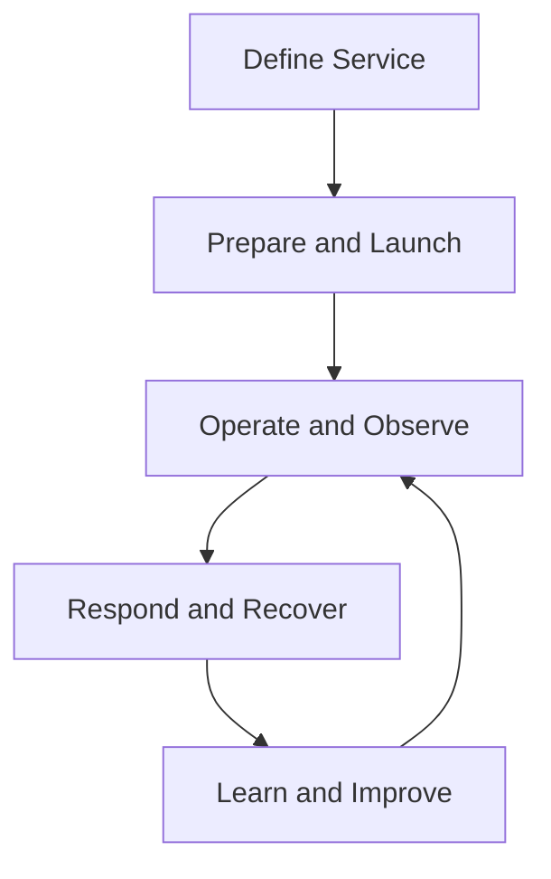
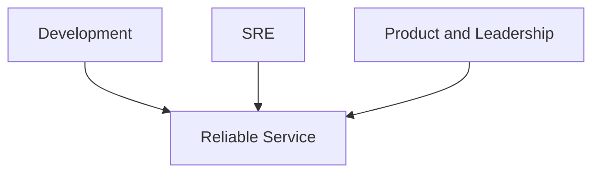
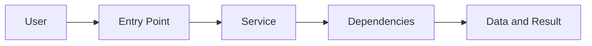
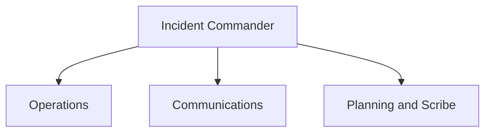

# Production Responsibility

> Production responsibility means owning the real service outcome after software meets users, traffic, dependencies, failures, and change. It includes readiness, operation, response, recovery, learning, and safe retirement.

## Chapter Purpose

Software does not become someone else’s problem when it reaches production.

Production responsibility requires teams to answer:

- Who owns the service?
- Who understands the user journey?
- Who can deploy, stop, restore, and retire it?
- Who responds when it fails?
- Which reliability level must it meet?
- Which operational work is acceptable?
- What evidence proves readiness?
- How are security, capacity, data, and dependencies managed?
- Who accepts residual risk?
- What happens when SRE engagement changes or ends?

This chapter defines production responsibility as a complete operating model. It is not a guide to a particular cloud platform or tool. It explains the responsibilities, boundaries, evidence, and decisions required to run a service safely.

---

## Learning Objectives

After completing this chapter, you should be able to:

1. Define production responsibility in service and user terms.
2. Distinguish ownership, responsibility, accountability, authority, and participation.
3. Explain why software teams retain production responsibility.
4. Define a workable ownership model between development and SRE.
5. Evaluate production readiness before launch or SRE onboarding.
6. Identify minimum operational artifacts and controls.
7. Explain production responsibilities across the service lifecycle.
8. Design sustainable on-call and escalation.
9. Connect SLOs, error budgets, incidents, change, capacity, security, and recovery to ownership.
10. Identify unsafe handoffs, orphaned services, and ownership gaps.
11. Plan service transfer and retirement safely.
12. Assess a real service using a production responsibility checklist.

---

## 1. What Production Responsibility Means

Production responsibility is the obligation and authority to maintain a service’s intended user outcome within agreed reliability, security, cost, and risk boundaries.

It includes:

- Understanding the service
- Defining expected behavior
- Preparing it for production
- Observing it
- Responding to failure
- Managing change
- Controlling operational work
- Maintaining capacity
- Protecting data and access
- Recovering from disruption
- Learning from incidents
- Retiring it safely

Production responsibility is demonstrated by decisions and action. A team name or ownership field alone is not sufficient.

---

## 2. Production Is a Different Environment

Production contains conditions that tests cannot fully reproduce:

- Real users
- Real data
- Peak traffic
- Long-running state
- Dependency failures
- Concurrent changes
- Partial network failure
- Security threats
- Human pressure
- Contractual obligations

A feature that passes functional tests may still fail because it cannot be diagnosed, rolled back, scaled, restored, or operated sustainably.

Production responsibility closes the gap between building functionality and operating a dependable service.

---

## 3. The Unit of Ownership Is the Service

Ownership should center on a service and its user outcome, not only on:

- A repository
- A server
- A Kubernetes namespace
- A dashboard
- A cloud account
- A ticket queue

A service has:

- Users or dependents
- Intended behavior
- Owners
- SLOs
- Dependencies
- Data
- Failure modes
- Change mechanisms
- Recovery requirements

One repository may support several services. One service may span many repositories and infrastructure components.

---

## 4. The Production Responsibility Loop



Ownership is continuous. It is not completed at deployment.

---

## 5. Responsibility, Accountability, Authority, and Participation

| Concept | Meaning |
| --- | --- |
| Responsibility | Obligation to perform defined work |
| Accountability | Answerability for the result |
| Authority | Power to make or approve a decision |
| Participation | Contribution to work without owning the result |

Example:

- An SRE may be responsible for incident command.
- A service owner may be accountable for reliability.
- A product executive may have authority to accept business risk.
- Security may participate in recovery after compromise.

Confusing these concepts creates delays and hidden risk.

---

## 6. Ownership Requires Authority

A team cannot own an outcome if it cannot influence:

- Architecture
- Release decisions
- Reliability priorities
- Capacity
- Dependencies
- Incident actions
- Access
- Retirement

Responsibility without authority creates accountability theater.

If SRE is held responsible for availability but cannot stop an unsafe release or obtain reliability work, the operating model is broken.

---

## 7. Authority Requires Evidence and Boundaries

Production authority must be constrained.

Examples include:

- Change approval within policy
- Emergency mitigation during incidents
- Rollback authority
- Traffic shifting
- Temporary feature disablement
- Disaster declaration

Controls should define:

- Who may act
- Under which conditions
- Which scope is allowed
- What must be recorded
- How the action is verified
- When elevated access expires

Authority without guardrails increases blast radius.

---

## 8. Development Teams Retain Responsibility

The team that designs and changes a service influences its production behavior.

Development responsibilities commonly include:

- Code correctness
- Testability
- Instrumentation
- Safe configuration
- Dependency behavior
- Deployment and rollback
- Runbook input
- Incident participation
- Corrective changes

SRE does not absorb these responsibilities merely by joining the service.

---

## 9. SRE Responsibilities

Depending on the engagement, SRE may contribute:

- SLO design
- Production readiness review
- On-call
- Incident command
- Observability
- Capacity analysis
- Reliability automation
- Failure testing
- Toil reduction
- Risk analysis
- Recovery engineering

The scope should be explicit. There is no universal SRE ownership model.

---

## 10. Shared Responsibility Is Not Ambiguous Responsibility



Shared responsibility works only when each area has named duties and decision rights.

Avoid statements such as:

> Engineering and SRE jointly own everything.

Replace them with an operating agreement.

---

## 11. The Service Ownership Record

Every production service should have a discoverable record containing:

- Service name and purpose
- Critical user journeys
- Business owner
- Technical owner
- Repository and deployment location
- On-call rotation
- Escalation path
- SLOs
- Dependencies
- Data classification
- Runbooks
- Dashboards
- Recovery objectives
- Lifecycle state

Ownership information should be machine-queryable where practical and reviewed regularly.

---

## 12. Ownership Must Be Reachable

An owner field is useless when:

- The team no longer exists.
- The contact channel is abandoned.
- The service changed hands informally.
- The listed person is unavailable.
- Nobody has production access.

Test ownership by asking whether a responder can reach the correct team within the required time.

---

## 13. Production Readiness

Production readiness is evidence that a service can be launched and operated within agreed conditions.

It includes:

- Defined user outcome
- Ownership
- SLOs
- Capacity
- Observability
- Safe change
- Incident response
- Security
- Data protection
- Dependency management
- Recovery
- Sustainable workload

Production readiness is not a promise that incidents will never occur.

---

## 14. Production Readiness Review

A production readiness review, or PRR, evaluates whether a service is ready for launch, scale, transfer, or SRE support.

Google’s SRE guidance uses production readiness reviews to identify operational gaps before responsibility is accepted. See [Evolving SRE Engagement Model](https://sre.google/sre-book/evolving-sre-engagement-model/) and [Reliable Product Launches at Scale](https://sre.google/sre-book/reliable-product-launches/).

A PRR should create decisions and owners, not only a checklist score.

---

## 15. When to Perform a PRR

Useful triggers include:

- New production launch
- Major user growth
- New region
- Material architecture change
- New critical dependency
- SRE onboarding
- Transfer between teams
- New compliance obligation
- Significant incident pattern
- Changed recovery requirement

Readiness decays as the service changes.

---

## 16. PRR Scope

Review the full user path:



Do not review only the component requesting SRE support.

---

## 17. Service Definition and Criticality

Before launch, define:

- Users
- Critical journeys
- Expected scale
- Reliability dimensions
- Business impact
- Operating hours
- Supported regions
- Product tier

Criticality determines the depth of readiness controls.

---

## 18. SLO Readiness

Confirm:

- Meaningful SLI
- Good and eligible events
- Target and window
- Data source
- Error-budget calculation
- Alerting policy
- Decision policy
- Owner

An SLO that cannot change a decision is incomplete.

---

## 19. Capacity Readiness

Confirm:

- Forecast demand
- Tested limits
- Peak behavior
- Scaling delay
- Failure headroom
- Quotas
- Dependency limits
- Growth monitoring

Capacity should be tested under failure, not only normal operation.

---

## 20. Observability Readiness

The team should be able to answer:

- Is the user journey working?
- Which segment is affected?
- What changed?
- Which dependency is failing?
- Is capacity exhausted?
- Is data correct?
- Is recovery succeeding?

Required evidence may include metrics, logs, traces, events, profiles, and synthetic journeys.

---

## 21. Alerting Readiness

A page should represent an urgent condition where human action can reduce harm.

Validate:

- User relevance
- Actionability
- Urgency
- Owner
- Routing
- Escalation
- Diagnostic context
- Noise level

Test paging before launch.

---

## 22. Change Readiness

Confirm:

- Version control
- Review
- Automated testing
- Progressive rollout
- Success signals
- Abort conditions
- Rollback
- Configuration control
- Audit history

The release process must work during pressure, not only during ideal conditions.

---

## 23. Dependency Readiness

Document:

- Internal dependencies
- External providers
- SLO alignment
- Timeouts
- Retry policy
- Failure behavior
- Capacity limits
- Owners
- Escalation

The service owns its behavior when a dependency fails.

---

## 24. Data Readiness

Define:

- Source of truth
- Consistency model
- Commitment point
- Integrity controls
- Replication
- Backup
- RPO
- Restore test
- Retention
- Deletion

Data loss and corruption require separate treatment from ordinary availability.

---

## 25. Security Readiness

Confirm:

- Least privilege
- Secret management
- Patching
- Vulnerability response
- Audit logging
- Emergency access
- Abuse controls
- Incident coordination
- Recovery from compromise

Emergency reliability actions must not silently remove security controls.

---

## 26. Recovery Readiness

Confirm:

- Fault model
- RTO
- RPO
- Failover
- Restore
- Runbook
- Required access
- Recovery capacity
- Data validation
- Last test

A written plan is not evidence of successful recovery.

---

## 27. Operational Workload Readiness

Estimate:

- Expected pages
- Tickets
- Manual changes
- Support requests
- Capacity work
- Release support
- Maintenance

The team needs enough engineering time to improve the service.

An engagement that consumes all capacity with reactive work is not sustainable.

---

## 28. Readiness Findings

Classify findings by risk and decision.

| Finding | Decision |
| --- | --- |
| Launch blocker | Must resolve before exposure |
| Conditional | Launch within explicit guardrails |
| Accepted risk | Authorized owner retains residual risk |
| Improvement | Complete after launch by due date |
| Observation | Monitor and reassess |

Every material finding needs an owner and verification.

---

## 29. Conditional Launch

A service may launch with limited risk controls such as:

- Small user cohort
- Regional limitation
- Feature flag
- Lower traffic cap
- Manual monitoring
- Restricted functionality
- Defined expiration

Conditions must be visible, measurable, and enforced.

---

## 30. Risk Acceptance

When a readiness gap remains, acceptance should record:

- Risk statement
- Affected service
- Evidence
- Impact
- Existing controls
- Residual risk
- Decision owner
- Expiration
- Review trigger

SRE should not accept business risk outside its authority.

---

## 31. Service-Level Agreement Between Teams

An internal operating agreement can define:

- Ownership scope
- On-call duties
- Release rights
- Incident roles
- Toil limits
- SLO policy
- Escalation
- Exit conditions

This is not necessarily a contractual SLA. It is a service-management agreement.

---

## 32. On-Call Responsibility

On-call responders need:

- Clear scope
- Training
- Access
- Actionable alerts
- Runbooks
- Escalation
- Authority
- Recovery time after incidents

Google’s guidance emphasizes sustainable on-call and sufficient time for engineering. See [Being On-Call](https://sre.google/sre-book/being-on-call/) and [On-Call](https://sre.google/workbook/on-call/).

---

## 33. Primary and Secondary On-Call

The primary usually acknowledges and leads initial response.

The secondary may:

- Assist diagnosis
- Take coordination
- Escalate
- Cover parallel work

Roles must be defined before the incident.

---

## 34. Escalation

Escalate when:

- Impact exceeds responder authority
- Diagnosis stalls
- Another service is involved
- Security or legal consequences appear
- Recovery objectives are at risk
- Business decisions are required

Escalation is a reliability mechanism, not personal failure.

---

## 35. Incident Responsibility

During an incident, ownership includes:

- Detecting impact
- Declaring severity
- Establishing command
- Mitigating harm
- Communicating
- Preserving evidence
- Verifying recovery
- Assigning follow-up

One person should not handle every role in a major incident.

---

## 36. Incident Command



The commander coordinates decisions and maintains focus on user impact.

---

## 37. Mitigation and Diagnosis

Mitigation reduces current harm. Diagnosis explains contributing conditions.

Safe rollback may be correct before the full cause is known.

Assign parallel work when staffing allows:

- One group stabilizes service.
- Another gathers evidence.
- Communication remains coordinated.

---

## 38. Recovery Verification

Confirm:

- Critical journey success
- SLO recovery
- Data integrity
- Dependency health
- Backlog clearance
- Segment recovery
- Stable observation period

The service is not recovered because one process restarted.

---

## 39. Communication Responsibility

Internal and external communication should state:

- Known impact
- Affected users
- Current action
- Workaround
- Data or security status
- Next update time
- Recovery status

Do not speculate or declare complete recovery prematurely.

---

## 40. Postmortem Responsibility

A postmortem should produce:

- Accurate timeline
- Impact
- Contributing conditions
- Detection analysis
- Response analysis
- Recovery analysis
- What worked
- Corrective actions
- Owners and dates

Google’s [Postmortem Culture](https://sre.google/sre-book/postmortem-culture/) emphasizes learning and actionable follow-up.

---

## 41. Corrective Action Ownership

Actions should be:

- Specific
- Risk-linked
- Owned
- Prioritized
- Time-bound
- Verifiable

Weak action:

> Improve monitoring.

Stronger action:

> Add a checkout-success burn-rate alert for the affected payment path, test routing to the primary on-call, and verify in the next game day.

---

## 42. Change Responsibility

Every production change needs:

- Purpose
- Owner
- Scope
- Evidence
- Risk
- Rollout plan
- Abort condition
- Rollback
- Verification

Automation does not remove ownership. It moves responsibility into the automation’s design and operation.

---

## 43. Emergency Change

Emergency change may reduce active harm but increases risk.

Require:

- Clear incident linkage
- Authorized executor
- Target confirmation
- Peer awareness where possible
- Audit trail
- Verification
- Reversal or follow-up

Temporary bypasses need expiration.

---

## 44. Configuration Responsibility

Configuration is production code.

Manage:

- Versioning
- Review
- Validation
- Scope
- Secrets
- Rollback
- Drift
- Audit history

One global configuration change can defeat all redundant infrastructure.

---

## 45. Capacity Responsibility

Service owners should know:

- Limiting resources
- Current demand
- Peak demand
- Growth
- Failure headroom
- Provisioning delay
- Quotas
- Cost

Capacity failure is often visible before impact if someone owns the forecast.

---

## 46. Dependency Responsibility

The consuming service owns:

- Timeouts
- Retry safety
- Fallback
- Circuit breaking
- Caching
- Dependency monitoring
- Escalation

A dependency owner cannot design every consumer’s failure behavior.

---

## 47. Data Responsibility

Define owners for:

- Schema
- Integrity
- Backup
- Restoration
- Retention
- Privacy
- Reconciliation
- Deletion

Availability ownership without data ownership is incomplete.

---

## 48. Security Responsibility

Production ownership includes secure operation.

Service owners should know:

- Data sensitivity
- Access paths
- Threat controls
- Patch process
- Secret lifecycle
- Abuse limits
- Recovery from compromise

Security and reliability incidents often overlap.

---

## 49. Cost Responsibility

Cost is an operating constraint.

Owners should understand:

- Cost drivers
- Scaling behavior
- Idle capacity
- Reliability headroom
- Observability cost
- Recovery cost

Cost reduction must not silently violate reliability objectives.

---

## 50. Documentation Responsibility

Operational documentation needs:

- Owner
- Review date
- Tested steps
- Exact targets
- Safety warnings
- Expected output
- Verification

Documentation without ownership decays.

---

## 51. Toil Responsibility

Measure recurring manual operational work.

For each source of toil, identify:

- Trigger
- Frequency
- Time
- Risk
- Scaling behavior
- Root cause
- Removal or automation owner

Google’s [Eliminating Toil](https://sre.google/sre-book/eliminating-toil/) distinguishes repetitive operational work from enduring engineering.

---

## 52. Sustainable Production Ownership

Healthy ownership requires:

- Reasonable service count
- Balanced on-call
- Engineering time
- Shared knowledge
- Training
- Reliable tooling
- Leadership support

An exhausted team is a production risk.

---

## 53. Production Access

Access should follow:

- Least privilege
- Strong authentication
- Time limits
- Auditability
- Separation by environment
- Emergency procedure

Regular access reviews should remove obsolete permissions.

---

## 54. Automation Ownership

Automation that changes production is a production system.

It needs:

- Owner
- Testing
- Permissions
- Observability
- Failure handling
- Rate limits
- Rollback
- Maintenance

Unowned automation can repeat mistakes at scale.

---

## 55. Cloud Shared Responsibility

Cloud providers operate parts of the stack. Customers retain responsibility for workload design, configuration, data, identities, and recovery according to the service model.

For every managed service, identify:

- Provider responsibility
- Customer responsibility
- Shared dependency
- Available controls
- Service commitment
- Recovery behavior

Managed does not mean fully owned by the provider.

---

## 56. SRE Engagement Models

SRE engagement may include:

- Full operational support
- Consulting
- Embedded project work
- Temporary reliability improvement
- Review and advisory work
- Shared on-call

The model should reflect service need and SRE capacity.

Google’s [SRE Engagement Model](https://sre.google/workbook/engagement-model/) describes different ways SRE can work with service teams.

---

## 57. Service Onboarding to SRE

Onboarding should require:

- Readiness evidence
- Ownership agreement
- Knowledge transfer
- On-call training
- SLO policy
- Toil estimate
- Risk register
- Exit conditions

SRE should not inherit an unknown service through an informal handoff.

---

## 58. Knowledge Transfer

Transfer should include:

- Architecture
- User journeys
- Failure modes
- Dependencies
- Data
- Deployment
- Recovery
- Known risks
- Incident history
- Access

Use shadow on-call, reverse shadowing, exercises, and practical demonstration.

---

## 59. SRE Engagement Exit

SRE support may end when:

- Reliability goals are achieved.
- Service priority changes.
- Toil exceeds agreement.
- Development ownership is insufficient.
- SRE capacity is needed elsewhere.
- The service is retired.

Exit should be planned, not abandoned.

---

## 60. Transfer Between Teams

A transfer requires:

- Receiving owner acceptance
- Access transfer
- On-call update
- Documentation review
- Risk handoff
- SLO ownership
- Dependency notification
- Verification

The sending team remains responsible until acceptance criteria are met.

---

## 61. Orphaned Services

An orphaned service has no effective owner.

Warning signs include:

- No active repository maintainers
- Unrouted alerts
- Expired certificates
- Unknown users
- Unpatched dependencies
- No recovery test
- Nobody authorized to retire it

Orphaned services should be assigned, contained, or retired.

---

## 62. Service Retirement

Retirement includes:

- Confirm users and dependencies
- Communicate deprecation
- Migrate traffic and data
- Revoke access
- Disable changes
- Preserve required records
- Remove alerts
- Delete resources safely
- Verify no remaining use
- Update ownership catalog

Turning off compute is not complete retirement.

---

## 63. Production Scenario: SRE Inherits an Unready Service

### Situation

A product team asks SRE to take on-call one week before launch. The service has no SLO, rollback, load test, or restore procedure.

### Response

- Perform a focused PRR.
- Identify launch blockers.
- Limit launch scope if appropriate.
- Assign readiness work.
- Define ownership and on-call terms.
- Require authorized acceptance for residual risk.

### Lesson

On-call transfer does not create production readiness.

---

## 64. Production Scenario: Alert Has No Owner

### Situation

A critical queue-age page routes to three teams. Each assumes another owns the consumer.

### Response

- Assign an incident owner immediately.
- Restore processing.
- Update service metadata and routing.
- Define queue, producer, and consumer ownership.
- Test escalation.

### Lesson

Shared dependency does not remove the need for a named responder.

---

## 65. Production Scenario: Development Cannot Be Reached

### Situation

SRE responds to a new application defect overnight. No developer escalation exists, and rollback cannot reverse a database change.

### Response

- Mitigate safely.
- Escalate leadership.
- Preserve data.
- Require developer on-call for the service.
- Redesign migration and rollback.

### Lesson

SRE cannot replace application expertise and development responsibility.

---

## 66. Production Scenario: Cost Reduction Removes Headroom

### Situation

A finance-driven change reduces spare capacity without service-owner review. A zone failure overloads the remaining zones.

### Response

- Restore sufficient capacity.
- Measure user impact.
- Revalidate failure headroom.
- Add reliability approval to material capacity changes.

### Lesson

Cost authority must be connected to service reliability responsibility.

---

## 67. Production Scenario: Temporary Access Becomes Permanent

### Situation

Engineers receive broad emergency access during an outage. Permissions remain six months later.

### Response

- Review audit history.
- Remove unnecessary access.
- Investigate use.
- Add automatic expiration.
- Test break-glass procedure.

### Lesson

Emergency responsibility requires controlled and temporary authority.

---

## 68. Production Scenario: Retired Service Still Receives Traffic

### Situation

A team deletes the main deployment. An undocumented partner continues calling the endpoint, and retained data has no owner.

### Response

- Restore a controlled compatibility path if necessary.
- Identify consumers.
- Reassign data ownership.
- Run staged deprecation.
- Verify zero traffic before final deletion.

### Lesson

Retirement is a production change with user, dependency, and data responsibilities.

---

## 69. Practical Exercise: Build a Service Ownership Record

```text
Service:
Purpose:
Critical journeys:
Business owner:
Technical owner:
On-call:
Escalation:
SLOs:
Dependencies:
Data classification:
Runbooks:
Dashboards:
RTO and RPO:
Lifecycle state:
Last review:
```

Verify every contact and link.

---

## 70. Practical Exercise: Run a PRR

Review one service across:

- Service definition
- Ownership
- SLOs
- Capacity
- Observability
- Alerting
- Change
- Dependencies
- Data
- Security
- Recovery
- Toil

Record finding, risk, owner, deadline, and verification.

---

## 71. Practical Exercise: Create an Ownership Matrix

| Activity | Responsible | Accountable | Consulted | Informed |
| --- | --- | --- | --- | --- |
| SLO approval | | | | |
| Deployment | | | | |
| Rollback | | | | |
| Incident command | | | | |
| Customer communication | | | | |
| Risk acceptance | | | | |
| Recovery test | | | | |
| Retirement | | | | |

Check that every activity has one clear accountable owner.

---

## 72. Practical Exercise: Test On-Call Readiness

Ask a responder to:

1. Receive a test page.
2. Find the service owner.
3. Open the dashboard.
4. Access relevant logs.
5. Locate the runbook.
6. Perform a safe mitigation in a test environment.
7. Escalate.
8. Verify recovery.

Record every delay and missing permission.

---

## 73. Practical Exercise: Plan a Service Transfer

Define:

- Transfer scope
- Receiving owner
- Acceptance criteria
- Knowledge-transfer sessions
- Access changes
- On-call transition
- Open risks
- Verification date
- Rollback of transfer

Ownership changes only after the receiving team accepts it.

---

## 74. Practical Exercise: Plan Safe Retirement

Inventory:

- Users
- API consumers
- Scheduled jobs
- Data
- Credentials
- DNS
- Alerts
- Dashboards
- Contracts
- Retention duties

Create a staged shutdown and verification plan.

---

## 75. Production Responsibility Anti-Patterns

### Throw It Over the Wall

Development deploys, and operations inherits all consequences.

### SRE Owns Everything

The product team stops participating in production.

### Checklist Readiness

Boxes are checked without evidence or decisions.

### Owner by Documentation Only

The listed owner cannot be reached or act.

### Responsibility Without Authority

The team is accountable but cannot control releases or priorities.

### On-Call Without Engineering Time

Reactive work consumes all capacity.

### Automation Without Owner

Production-changing code has no maintainer.

### Permanent Emergency State

Temporary access, routes, or disabled controls remain indefinitely.

### Silent Handoff

A service changes teams without acceptance or knowledge transfer.

### Incomplete Retirement

Compute stops while consumers, data, credentials, and obligations remain.

---

## 76. Production Responsibility Checklist

### Identity

- Service and purpose defined
- Critical journeys identified
- Business and technical owners named
- Lifecycle state current

### Reliability

- SLOs and error-budget policy operational
- Capacity and failure headroom tested
- Dependencies mapped

### Operations

- On-call trained
- Alerts actionable
- Runbooks tested
- Escalation verified

### Change

- Progressive rollout available
- Rollback safe
- Configuration controlled
- Emergency changes audited

### Data and Security

- Integrity, backup, and restore owned
- Access least privileged
- Emergency access tested and expiring

### Recovery

- RTO and RPO defined
- Complete recovery tested
- Failover and failback verified

### Lifecycle

- Transfer process defined
- Risks reviewed
- Retirement plan exists

---

## 77. Reflection Questions

1. Who is accountable for the most critical user journey?
2. Can that owner stop an unsafe release?
3. Which service has an outdated ownership record?
4. Which alert routes to no effective responder?
5. Which development team does not participate in incidents?
6. Which service entered production without a PRR?
7. Which runbook has not been tested?
8. Which temporary permission should have expired?
9. Which capacity change can bypass service-owner review?
10. Which SRE engagement has no exit criteria?
11. Which service transfer remains incomplete?
12. Which supposedly retired service still has traffic, data, or credentials?

---

## 78. Knowledge Check

### 1. What is production responsibility?

A. Owning servers only  
B. Owning the real service outcome through readiness, operation, recovery, learning, and retirement  
C. Closing deployment tickets  
D. Assigning all work to SRE

**Answer: B**

### 2. Why must ownership include authority?

A. Owners need unlimited access  
B. A team cannot control an outcome if it cannot influence the decisions that create it  
C. Authority removes accountability  
D. Only executives operate services

**Answer: B**

### 3. What does a PRR provide?

A. Proof that no incident will occur  
B. Evidence and decisions about operational readiness  
C. A list of tools  
D. Automatic risk acceptance

**Answer: B**

### 4. Does SRE ownership remove development responsibility?

A. Yes  
B. No, development retains responsibility for code, design, instrumentation, and corrective change  
C. Only after launch  
D. Only for internal services

**Answer: B**

### 5. What makes an alert production-ready?

A. It fires frequently  
B. It is urgent, actionable, owned, routed, and tied to service impact  
C. It monitors CPU  
D. It sends email

**Answer: B**

### 6. Who should accept material business risk?

A. Any on-call engineer  
B. An authorized business risk owner  
C. The alerting system  
D. An external dependency

**Answer: B**

### 7. When is service recovery complete?

A. When a process starts  
B. When users, data, dependencies, backlogs, and stability meet criteria  
C. When the page stops  
D. When the incident channel closes

**Answer: B**

### 8. Why does automation need an owner?

A. It cannot affect production  
B. It is a production system with permissions, failures, and maintenance needs  
C. It eliminates all risk  
D. It never changes

**Answer: B**

### 9. What is required for a service transfer?

A. A message announcing the new team  
B. Acceptance, access, knowledge, risk, on-call, and verification  
C. Repository rename only  
D. Removing the old owner immediately

**Answer: B**

### 10. What identifies an orphaned service?

A. Low traffic alone  
B. No effective owner who can respond, change, recover, or retire it  
C. Old programming language  
D. Few dashboards

**Answer: B**

### 11. When does production responsibility end?

A. At deployment  
B. At technical shutdown  
C. After safe retirement of traffic, dependencies, data, access, alerts, and obligations  
D. When SRE leaves

**Answer: C**

### 12. What is shared responsibility?

A. Nobody has named duties  
B. Multiple parties contribute through explicit responsibilities and decision rights  
C. Every team owns every action  
D. The cloud provider owns the workload

**Answer: B**

---

## 79. Completion Checklist

You have completed this chapter when you can:

- [ ] Define production responsibility as service-outcome ownership.
- [ ] Separate responsibility, accountability, authority, and participation.
- [ ] Explain development and SRE responsibilities.
- [ ] Build a complete service ownership record.
- [ ] Perform a risk-based production readiness review.
- [ ] Identify readiness requirements for SLOs, capacity, observability, change, data, security, and recovery.
- [ ] Design sustainable on-call and escalation.
- [ ] Define incident, change, and corrective-action ownership.
- [ ] Explain cloud and dependency responsibility.
- [ ] Plan SRE onboarding and exit.
- [ ] Transfer a service with explicit acceptance.
- [ ] Retire a service safely.

---

## 80. Key Takeaways

1. Production responsibility begins before launch and ends after safe retirement.
2. The service and user outcome are the units of ownership.
3. Responsibility without authority creates an unsafe operating model.
4. SRE support does not remove development ownership.
5. Shared responsibility requires explicit duties and decision rights.
6. Production readiness depends on evidence, not checklist completion.
7. On-call must be actionable, trained, and sustainable.
8. Incident recovery requires user and data verification.
9. Automation, configuration, capacity, data, security, and cost all need owners.
10. Service transfer requires acceptance and practical knowledge.
11. Orphaned services should be assigned, contained, or retired.
12. Retirement must address traffic, dependencies, data, access, monitoring, and obligations.

---

## 81. Authoritative Resources

### Production Readiness and Launch

- [Reliable Product Launches at Scale](https://sre.google/sre-book/reliable-product-launches/)
- [Evolving SRE Engagement Model](https://sre.google/sre-book/evolving-sre-engagement-model/)
- [SRE Engagement Model](https://sre.google/workbook/engagement-model/)
- [SRE Team Lifecycles](https://sre.google/workbook/team-lifecycles/)

### Operation and Ownership

- [Being On-Call](https://sre.google/sre-book/being-on-call/)
- [On-Call](https://sre.google/workbook/on-call/)
- [Managing Incidents](https://sre.google/sre-book/managing-incidents/)
- [Postmortem Culture](https://sre.google/sre-book/postmortem-culture/)
- [Eliminating Toil](https://sre.google/sre-book/eliminating-toil/)

### Operational Readiness

- [Google Cloud Well-Architected Framework](https://cloud.google.com/architecture/framework)
- [Manage Incidents and Problems](https://cloud.google.com/architecture/framework/operational-excellence/manage-incidents-and-problems)
- [Automate and Manage Change](https://cloud.google.com/architecture/framework/operational-excellence/automate-and-manage-change)

### Source Interpretation

- Google SRE resources describe Google practices and adaptable reliability principles.
- Engagement and ownership models must reflect organizational authority, service risk, and team capacity.
- Cloud-provider responsibility varies by service and configuration.
- Checklists support judgment but do not replace evidence, tests, or accountable decisions.

---

## 82. Related SRE World Sections

- [The SRE Mindset](./03-The-SRE-Mindset.md)
- [Reliability as a Product Feature](./04-Reliability-as-a-Product-Feature.md)
- [Reliability and Business Risk](./05-Reliability-and-Business-Risk.md)
- [Fault Tolerance and Disaster Recovery](./07-Fault-Tolerance-and-Disaster-Recovery.md)
- [SRE Foundations](./README.md)
- [Service Ownership](../02-Service-Ownership/)
- [Incident Management](../08-Incident-Management/)
- [On-Call Engineering](../10-On-Call-Engineering/)
- [Toil and Automation](../12-Toil-and-Automation/)
- [Capacity Planning](../15-Capacity-Planning/)
- [SRE Organizations and Culture](../26-SRE-Organizations-and-Culture/)

---

## Next Chapter

[09: Service Ownership Models](./09-Service-Ownership-Models.md)

---

## Maintained by VERIQTA

SRE World is created and maintained by [VERIQTA](https://github.com/veriqta).

- Website: [veriqta.com](https://www.veriqta.com/)
- GitHub: [github.com/veriqta](https://github.com/veriqta)
- Instagram: [@veriqta](https://www.instagram.com/veriqta/)
- Medium: [veriqta.medium.com](https://veriqta.medium.com/)

> Production ownership is real only when a team can understand the service, act on it safely, recover it, improve it, and retire it without abandoning users or risk.
