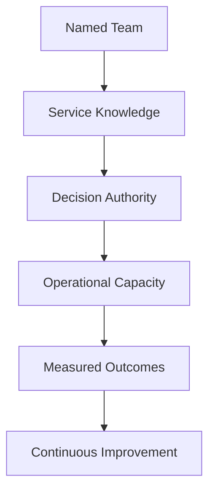
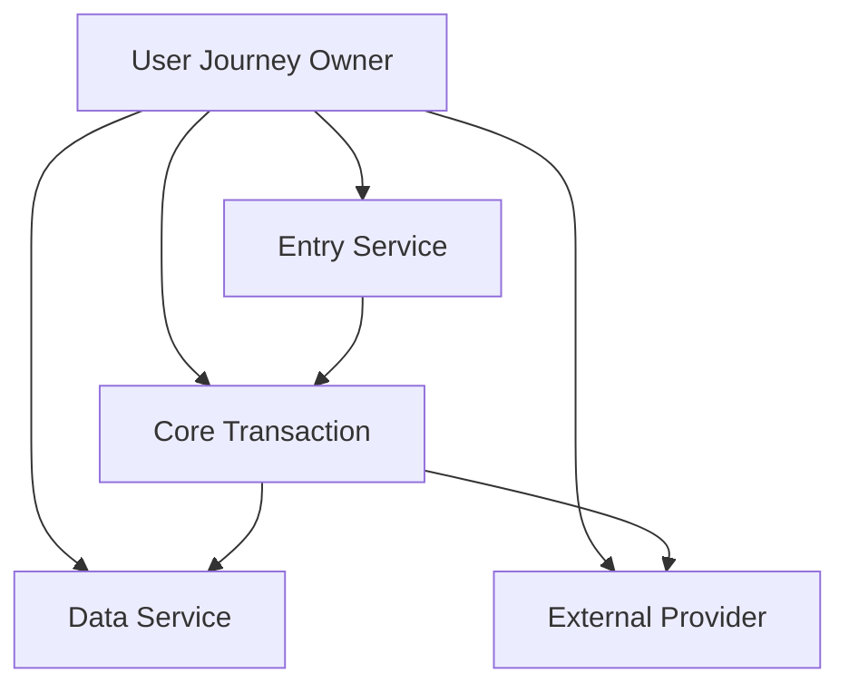
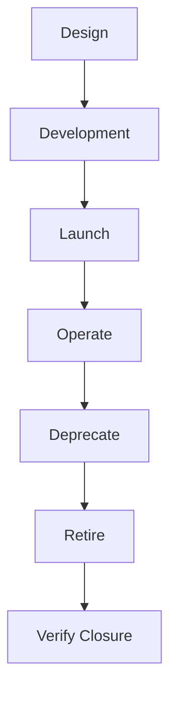
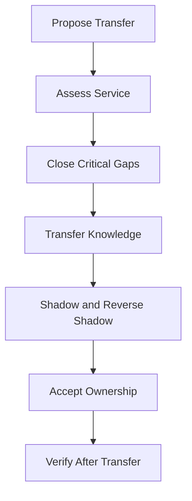

# Service Ownership

> Service ownership is the continuing accountability for a service's user outcomes, reliability, security, operability, cost, and lifecycle. It connects every production system to a team that has the knowledge and authority to act.

## Chapter Purpose

A service can have source code, infrastructure, dashboards, alerts, and documentation while still lacking real ownership.

Real ownership answers:

- Which team is accountable for the service outcome?
- What exactly does that team own?
- Who makes reliability and risk decisions?
- Who responds when the service fails?
- Who owns shared dependencies and end-to-end user journeys?
- What happens outside business hours?
- How is ownership recorded and verified?
- How does ownership change during reorganization, transfer, deprecation, or retirement?

This chapter presents service ownership as an SRE operating system. It focuses on accountable teams, explicit boundaries, production authority, measurable obligations, sustainable operations, and lifecycle continuity.

It does not prescribe a particular cloud provider, ticketing product, service catalog, or organizational chart.

---

## Learning Objectives

After completing this chapter, you should be able to:

1. Define service ownership in user and production terms.
2. Distinguish ownership from support, contribution, stewardship, and approval.
3. Select an ownership model appropriate to service risk and organizational structure.
4. Define clear boundaries for services, platforms, dependencies, and user journeys.
5. Create a minimum viable service ownership record.
6. Assign decision rights for reliability, security, change, cost, and incidents.
7. Evaluate whether a team can sustainably own a service.
8. Identify ownership gaps, split accountability, and orphaned services.
9. Design safe ownership transfer, deprecation, and retirement processes.
10. Assess service ownership using evidence rather than labels.

---

## 1. What Service Ownership Means

Service ownership is the ongoing accountability for a defined service throughout its lifecycle.

An owning team is expected to:

- Understand the users and critical journeys
- Define and maintain service objectives
- Design for known risks and failure modes
- Keep the service observable and operable
- Control changes safely
- Maintain capacity and performance
- Protect data and access
- Participate in incidents and recovery
- Prioritize corrective work
- Manage dependencies
- Maintain operational knowledge
- Deprecate and retire the service safely

Ownership is not a name in a spreadsheet. It is a working capability supported by authority, knowledge, staffing, and evidence.

---

## 2. The Object of Ownership Is a Service Outcome

Teams often say they own a repository, cluster, database, or cloud account. Those assets matter, but users consume service outcomes.

Examples of service outcomes include:

- A customer can complete a payment
- An employee can authenticate
- A publisher can release an article
- A downstream system receives an accepted event
- A customer can recover stored data

A useful ownership definition starts at the service boundary and works inward to the supporting components.

---

## 3. Ownership Is Broader Than Code Ownership

Code ownership answers who reviews or maintains source code.

Service ownership also includes:

- Runtime behavior
- Production configuration
- Infrastructure
- Data stores
- Dependencies
- Alerts
- On-call response
- Capacity
- Security obligations
- Continuity and recovery
- Cost
- Compliance evidence
- End-of-life decisions

A team can own code without being able to operate the resulting service. A team can also operate a service without owning all the code it depends on.

---

## 4. Ownership Is Broader Than On-Call

On-call is one mechanism for urgent response. It is not the complete ownership model.

A team that receives pages but cannot change the software, influence priorities, or approve mitigation is acting as a response queue, not a true owner.

Conversely, a team may own a low-criticality internal service without operating a 24-hour pager. The support model should match the service commitment and business risk.

---

## 5. Ownership, Accountability, Responsibility, and Authority

| Concept | Core question | Example |
| --- | --- | --- |
| Ownership | Who remains answerable for the service over time? | Payments team owns payment authorization |
| Accountability | Who answers for a specific result? | Service lead answers for an SLO miss |
| Responsibility | Who performs the work? | Engineer updates a runbook |
| Authority | Who may decide or act? | Incident commander disables a feature |
| Contribution | Who supplies part of the solution? | Platform team provides deployment capability |
| Consultation | Who gives specialist input? | Security reviews a threat model |

One team should be clearly accountable for each service outcome. Many teams may contribute.

---

## 6. The Ownership Capability Model



If any link is missing, ownership is weakened.

- A named team without knowledge cannot diagnose the service.
- Knowledge without authority cannot change unsafe conditions.
- Authority without capacity cannot sustain the work.
- Activity without measured outcomes cannot prove reliability.
- Operations without improvement turn recurring failure into normal work.

---

## 7. Core Principles of Service Ownership

Strong ownership follows several principles:

1. Every production service has an accountable team.
2. Ownership boundaries are written and discoverable.
3. Authority matches accountability.
4. The owning team understands users, architecture, and failure modes.
5. Reliability obligations are measurable.
6. Operational work is sustainable.
7. Dependencies have named owners and escalation paths.
8. Ownership persists through organizational and technical change.
9. Transfers require evidence and acceptance.
10. Retirement is an owned production activity.

---

## 8. One Accountable Team, Many Participants

Complex services need contributions from product, software, SRE, platform, security, data, network, support, legal, and vendor teams.

That complexity does not justify ambiguous accountability.

A practical rule is:

> One team is accountable for the service outcome. Other teams own defined components, controls, or supporting capabilities.

This avoids both extremes:

- Pretending one team controls everything
- Claiming everyone owns the service, which often means no one does

---

## 9. The Service Owner Is Usually a Team

Production ownership should normally belong to a durable team, not one person.

Individuals can hold roles such as:

- Service lead
- Technical lead
- Product owner
- On-call primary
- Incident commander
- Security contact

But personal ownership creates concentration risk when that person changes role, takes leave, or leaves the organization.

The ownership record should identify both the accountable team and current contacts.

---

## 10. Product Ownership and Service Ownership

Product ownership and service ownership overlap, but they are not identical.

| Product ownership | Service ownership |
| --- | --- |
| Defines user and business priorities | Maintains dependable production outcomes |
| Prioritizes features and market needs | Prioritizes reliability and operational work |
| Decides product direction | Controls production risk within authority |
| Measures adoption and value | Measures service level and operational health |

Healthy organizations connect these roles. Product decisions affect reliability, and reliability affects product value.

---

## 11. SRE Does Not Automatically Own Every Service

SRE is a scarce engineering capability, not a universal operations queue.

An SRE team may:

- Consult on design
- Define reliability practices
- Conduct readiness reviews
- Build shared reliability capabilities
- Share on-call
- Operate selected services
- Lead reliability improvement engagements

The development or product engineering team still owns the software decisions and changes it controls.

Google's SRE guidance emphasizes that engagement scope, operational limits, shared goals, and development-team participation should be explicit.

---

## 12. Service Ownership Models

There is no single model for every organization. The chosen model should reflect service criticality, team skills, scale, regulatory obligations, and dependency structure.

Common models include:

- Full-stack product-team ownership
- Development ownership with SRE consultation
- Shared development and SRE ownership
- Dedicated SRE operational ownership
- Platform ownership
- Central operations ownership
- Federated ownership
- Temporary reliability engagement

---

## 13. Full-Stack Product-Team Ownership

In this model, one product engineering team builds and operates the service.

The team owns:

- Architecture
- Application code
- Deployment
- SLOs
- Alerts
- On-call
- Incident response
- Corrective work
- Cost and capacity

### Strengths

- Short feedback loops
- Strong connection between design and production behavior
- Fewer handoffs
- Clear accountability

### Risks

- Uneven reliability expertise
- Excessive cognitive load
- Fragile on-call for small teams
- Reinvention of common operational capabilities

This model works best when a platform supplies safe common capabilities and the team has enough people and production knowledge.

---

## 14. Development Ownership With SRE Consultation

The development team retains operational ownership while SRE provides targeted expertise.

Typical SRE work includes:

- SLO workshops
- Architecture review
- Production readiness review
- Capacity analysis
- Incident review
- Reliability risk assessment
- Automation or observability guidance

The engagement should define deliverables, duration, decision rights, and exit criteria.

This model can scale SRE knowledge across more services than direct operational ownership.

---

## 15. Shared Development and SRE Ownership

Development and SRE share defined production work.

Examples include:

- Shared on-call
- SRE handles incident command while developers diagnose application behavior
- Developers own code and corrective changes
- SRE owns common production automation
- Both teams agree on SLOs and error-budget actions

Shared ownership works only when boundaries are explicit. The word shared must not replace assignment.

---

## 16. Dedicated SRE Operational Ownership

An SRE team may assume substantial operational responsibility for a high-value or high-scale service.

Conditions should include:

- Clear business value
- A service that meets readiness expectations
- Sustainable operational load
- Defined SLOs
- Development commitment to reliability work
- Authority to manage production risk
- A documented engagement agreement

SRE ownership does not remove developer accountability for design defects, unsafe releases, and necessary code changes.

---

## 17. Platform Ownership

A platform team owns a capability used by other engineering teams.

Examples include:

- Runtime platform
- Deployment platform
- Identity platform
- Observability platform
- Data platform
- Messaging platform

The platform team owns platform reliability and its published interface. Consuming teams own how their services use the platform.

The boundary must define:

- Supported use cases
- Service levels
- Tenant responsibilities
- Upgrade responsibilities
- Limits and quotas
- Incident escalation
- Unsupported configurations

---

## 18. Central Operations Ownership

A central team performs operational tasks for many services.

This can provide consistency, but it often creates:

- Long handoffs
- Shallow service knowledge
- Ticket queues
- Weak feedback to developers
- Operational toil
- Accountability without authority

If this model is necessary, service engineering teams must remain reachable, maintain diagnostics, and own corrective changes.

---

## 19. Federated Ownership

Federated ownership combines local service accountability with central standards and shared capabilities.

Service teams own their outcomes. A central reliability group may provide:

- Policies
- Reliability frameworks
- Common tooling
- Training
- Consulting
- Maturity assessments
- Cross-service incident coordination

This model can scale across large organizations, but standards must be practical and supported by usable capabilities.

---

## 20. Temporary Reliability Engagement

SRE may join a service for a defined problem or period.

Examples include:

- Preparing for a major launch
- Reducing repeated incidents
- Establishing SLOs
- Improving recovery
- Scaling for rapid growth
- Transferring operational knowledge

A temporary engagement needs:

- Scope
- Shared goals
- Named participants
- Measures of success
- Operational boundaries
- Knowledge-transfer plan
- Exit date or exit conditions

Temporary help must not silently become permanent unplanned support.

---

## 21. Choosing an Ownership Model

Evaluate the following factors:

| Factor | Questions |
| --- | --- |
| Criticality | What is the impact of failure? |
| Complexity | How much specialized knowledge is required? |
| Change rate | How often does the service change? |
| Scale | What traffic, data, and geographic scope exist? |
| Team capacity | Can the team support the operational load? |
| Regulation | Which duties, evidence, or separations are required? |
| Dependencies | How many teams and external providers affect outcomes? |
| Maturity | Can the team observe, operate, and recover the service? |
| Lifecycle stage | Is the service emerging, mature, deprecated, or retiring? |

The correct model may change during the service lifecycle.

---

## 22. Define the Service Boundary

A service boundary identifies what is inside and outside the owner's direct control.

Document:

- User-facing capability
- Entry points
- APIs and events
- Application components
- Data stores
- Production configurations
- Infrastructure responsibilities
- Upstream and downstream dependencies
- Third-party services
- Operational interfaces
- Excluded systems

Boundary diagrams should reflect production reality, not only source-code structure.

---

## 23. End-to-End Ownership

Users experience a journey across several services.



Component ownership does not automatically produce end-to-end reliability.

For every critical journey, define who:

- Sets the journey-level objective
- Observes the full path
- Coordinates cross-service incidents
- Leads dependency risk reviews
- Resolves conflicting priorities
- Communicates user impact

The journey owner coordinates outcomes without taking away component accountability.

---

## 24. Component Ownership

Each component should have a named owning team.

Component ownership includes:

- Supported behavior
- Interface compatibility
- Reliability objectives
- Change communication
- Capacity
- Vulnerability remediation
- Incident response
- Deprecation

A component owner should not promise outcomes that depend on undocumented consumer behavior.

---

## 25. Dependency Ownership

Every material dependency needs:

- Provider owner
- Consumer owner
- Interface contract
- Reliability expectation
- Capacity or quota agreement
- Change-notification process
- Escalation path
- Failure behavior
- Recovery expectation
- Exit or replacement strategy

The provider owns the dependency service. The consumer owns safe use of that dependency.

---

## 26. Shared Infrastructure Boundaries

Shared infrastructure creates two layers of ownership.

The infrastructure owner generally owns:

- Availability of the shared capability
- Safe maintenance
- Published limits
- Security of the shared layer
- Capacity of the common service
- Platform incident response

The workload owner generally owns:

- Correct configuration
- Workload behavior
- Application capacity
- Tenant-level security
- Data and secrets
- Response to workload-specific failure

The exact boundary must be documented. Assumptions are not contracts.

---

## 27. Managed-Service Ownership

Buying a managed service transfers some tasks, not the service outcome.

The provider may operate physical infrastructure and control planes. The consuming organization still commonly owns:

- Architecture choice
- Configuration
- Identity and access
- Data classification
- Backup policy
- Quotas
- Observability
- Dependency failure handling
- Vendor escalation
- Business continuity

Managed does not mean unowned.

---

## 28. Third-Party Dependency Ownership

External providers cannot be assigned internal accountability.

Name an internal owner for:

- Vendor relationship
- Technical integration
- SLA review
- Security review
- Renewal and commercial risk
- Status monitoring
- Escalation
- Workaround planning
- Data export
- Exit strategy

The internal service owner remains accountable for user impact caused by the dependency.

---

## 29. Data Ownership

Service ownership and data ownership may belong to different teams.

Define who owns:

- Data classification
- Schema and meaning
- Collection purpose
- Retention
- Access approval
- Encryption requirements
- Data quality
- Backup and restore
- Deletion
- Legal and regulatory obligations

The service owner must understand and implement the data owner's requirements within the service.

---

## 30. Security Ownership

Security is shared, but individual controls still need owners.

The service team commonly owns:

- Secure design
- Threat-model maintenance
- Dependency updates
- Secrets handling
- Workload permissions
- Vulnerability remediation
- Security logging
- Incident participation

Security specialists may define policy, advise, monitor, test, or coordinate response. They do not replace the service team's responsibility for the system it builds and changes.

---

## 31. Reliability Ownership

Reliability ownership includes:

- Selecting meaningful service level indicators
- Agreeing on service level objectives
- Monitoring error-budget consumption
- Defining error-budget actions
- Managing known risks
- Funding reliability work
- Reviewing recurring incidents
- Verifying recovery capability

SRE can guide the method. Business and product leaders must participate where reliability choices affect cost, revenue, legal exposure, or user commitments.

---

## 32. Change Ownership

Every production change needs an owner before, during, and after deployment.

The change owner should know:

- Intended outcome
- Affected services and users
- Risk and blast radius
- Validation signals
- Stop conditions
- Rollback or roll-forward plan
- Communication requirements
- Decision authority

The service owner defines the system in which safe changes occur. The individual change owner is accountable for a specific execution.

---

## 33. Incident Ownership

During an incident, distinguish service ownership from incident roles.

| Role | Primary purpose |
| --- | --- |
| Incident commander | Coordinates the response |
| Operations lead | Executes technical mitigation |
| Communications lead | Maintains stakeholder updates |
| Subject-matter expert | Provides system knowledge |
| Service owner | Remains accountable for service recovery and follow-through |

An incident commander may temporarily control decisions without becoming the permanent service owner.

---

## 34. Corrective-Action Ownership

Every accepted corrective action requires:

- One accountable owner
- Clear outcome
- Priority
- Due date or review date
- Verification method
- Risk if delayed
- Closure evidence

Assigning an action to a broad team, meeting, or backlog is often insufficient.

Closing an action means the risk reduction is verified, not merely that code was merged.

---

## 35. Cost Ownership

The service owner should understand the cost required to deliver the service.

This includes:

- Baseline cost
- Cost by environment
- Cost by tenant or transaction where practical
- Growth drivers
- Idle and stranded resources
- Reliability-related redundancy
- Incident cost
- Vendor commitments
- Cost anomalies

Cost responsibility must not encourage unsafe removal of resilience. Tradeoffs should consider service objectives and business impact.

---

## 36. Documentation Ownership

Operational documentation is part of the service.

Owners should maintain:

- Service overview
- Architecture
- Dependency map
- SLO definitions
- Dashboards
- Alerts
- Runbooks
- Deployment and rollback procedures
- Recovery procedures
- Access paths
- Escalation contacts
- Known risks
- Deprecation status

Documentation should have review triggers, such as material changes, incidents, ownership transfers, and scheduled reviews.

---

## 37. Automation Ownership

Automation needs the same ownership discipline as production software.

Record:

- Purpose
- Owner
- Scope
- Permissions
- Failure behavior
- Observability
- Change process
- Rollback or disablement
- Dependencies
- Recovery method

An unowned automation can silently damage many services at machine speed.

---

## 38. The Minimum Service Ownership Record

Every production service should have a discoverable record containing at least:

| Field | Required information |
| --- | --- |
| Service name | Unique, stable name |
| Purpose | User or business outcome |
| Lifecycle state | Planned, active, deprecated, or retired |
| Accountable team | Durable team name |
| Technical contacts | Current escalation contacts |
| Product contact | Business or product decision owner |
| Repository | Authoritative source locations |
| Runtime | Production locations or environments |
| Interfaces | User, API, event, and operational entry points |
| Dependencies | Critical upstream, downstream, and external services |
| Data | Classification and data owner |
| Service level | SLOs or documented support commitment |
| On-call | Coverage and escalation path |
| Operations | Dashboards, alerts, and runbooks |
| Recovery | Backup, restore, failover, RTO, and RPO information |
| Security | Threat model and control references |
| Cost | Cost owner and budget context |
| Risks | Accepted risks and review dates |
| Last verified | Date and verifier |

---

## 39. Example Service Ownership Record

```yaml
service:
  name: payment-authorization
  purpose: authorize customer card payments
  lifecycle: active

ownership:
  accountable_team: payments-runtime
  technical_contact: payments-runtime-oncall
  product_contact: payments-product
  security_contact: payments-security-partner

reliability:
  slo: payment-authorization-slo
  dashboard: payment-authorization-overview
  runbook: payment-authorization-response
  incident_channel: payments-incidents

dependencies:
  - identity-service
  - payment-gateway-provider
  - transaction-database

recovery:
  plan: payment-authorization-recovery
  rto: 30m
  rpo: 5m

governance:
  risk_register: payment-authorization-risks
  last_verified: 2026-09-13
  next_review: 2026-12-13
```

Use references appropriate to your environment. Do not place secrets, personal phone numbers, or sensitive credentials in the record.

---

## 40. Service Catalogs

A service catalog can make ownership discoverable, but the catalog is not the operating model.

A useful catalog should help engineers answer:

- What is this service?
- Who owns it now?
- How critical is it?
- How do I contact the owner?
- Where are its operational resources?
- What depends on it?
- Is the information current?

Catalog quality depends on update automation, verification, and clear accountability for metadata.

---

## 41. Ownership Metadata as Production Data

Incorrect ownership metadata can delay incident response and risk decisions.

Treat ownership data with controls such as:

- Schema validation
- Required fields
- Team-directory integration
- Repository or deployment linkage
- Review dates
- Change history
- Stale-record detection
- Duplicate detection
- Automated reminders
- Retirement validation

A catalog containing thousands of unverified records creates false confidence.

---

## 42. Evidence of Real Ownership

Evidence may include:

- Recent service reviews
- Current SLO reports
- Working escalation tests
- On-call participation
- Completed recovery exercises
- Updated runbooks
- Ownership of recent changes
- Incident follow-through
- Corrective-action completion
- Capacity forecasts
- Current dependency reviews
- Verified contact information

The strongest evidence is repeated successful operation, not a signed declaration.

---

## 43. Ownership Review Cadence

Review frequency should reflect risk and change rate.

Review when:

- A service approaches launch
- Criticality changes
- A team reorganizes
- A service changes architecture
- A major dependency changes
- An incident reveals a gap
- On-call becomes unhealthy
- A service enters deprecation
- Ownership transfers
- A scheduled review becomes due

High-risk services may need quarterly or more frequent review. Stable low-risk services may need less frequent review, but they still need event-triggered checks.

---

## 44. Team Capacity for Ownership

A team cannot sustainably own unlimited services.

Assess:

- Number of services
- Service criticality
- Change volume
- Page volume
- Incident load
- Required coverage hours
- Cognitive load
- Technology diversity
- Dependency count
- Toil
- Staffing and skills
- Planned launches and migrations

Adding a service to a team is a capacity decision, not merely a metadata update.

---

## 45. Cognitive Load

Cognitive load is the amount of knowledge and decision complexity a team must carry.

It increases with:

- Many unrelated technologies
- Inconsistent deployment patterns
- Unique operational procedures
- Poor documentation
- Excessive dependencies
- Frequent interruptions
- Weak automation
- Unclear boundaries

Standardization can reduce cognitive load, but standardization should remove unnecessary variation without hiding important system behavior.

---

## 46. Sustainable On-Call Ownership

An ownership model must match its support promise.

Check:

- Enough trained responders
- Fair rotation
- Manageable page frequency
- Actionable alerts
- Safe access
- Clear escalation
- Compensation or time-off policy where applicable
- Backup coverage
- Handoff process
- Psychological safety
- Time for corrective engineering

A team that cannot sustain its support commitment does not yet have a complete ownership capability.

---

## 47. Follow-the-Sun Ownership

Global teams may transfer active operational coverage between locations.

The handoff should include:

- Current service state
- Active incidents
- Risky changes
- Degraded dependencies
- Pending decisions
- Temporary mitigations
- Named responsible person

Geographic coverage does not split permanent service accountability. The accountable team and escalation authority must remain clear.

---

## 48. Ownership Across the Service Lifecycle



Ownership begins before production and ends only after verified closure.

---

## 49. Ownership During Design

Before implementation, identify:

- Intended owner
- User journey
- Criticality
- Service boundary
- Data obligations
- Dependency assumptions
- Expected support model
- Reliability targets
- Recovery needs
- Operational cost

Architecture decisions made without an intended operator often create services that are difficult to support.

---

## 50. Ownership During Development

The intended owner should help shape:

- Instrumentation
- Deployment safety
- Capacity model
- Failure handling
- Test strategy
- Configuration controls
- Runbooks
- Access model
- Recovery automation
- Dependency contracts

Operational ownership should not begin only after development is complete.

---

## 51. Ownership at Launch

Before launch, verify:

- Owner acceptance
- Production readiness
- SLO and indicators
- Monitoring and alerting
- On-call readiness
- Escalation paths
- Capacity
- Safe change and rollback
- Security controls
- Recovery capability
- Dependency readiness
- Launch decision authority

A launch date does not override unresolved ownership risk.

---

## 52. Ownership During Stable Operation

Stable operation includes continuous work:

- Review service performance
- Manage error budgets
- Respond to incidents
- Reduce toil
- Maintain capacity
- Update dependencies
- Test recovery
- Review cost
- Refresh documentation
- Reassess risk

Low incident volume does not prove that ownership can be neglected.

---

## 53. Ownership During Rapid Growth

Growth changes ownership demands.

The owner should reassess:

- Capacity assumptions
- Failure domains
- Operational workload
- Dependency limits
- Cost behavior
- Security exposure
- Data lifecycle
- On-call staffing
- Recovery objectives

A model suitable for a small internal service may become unsafe after global adoption.

---

## 54. Ownership During Deprecation

Deprecation often increases risk because investment falls while users remain.

The owner must define:

- Deprecation date
- Remaining users
- Migration path
- Support level
- Change restrictions
- Security maintenance
- Data migration
- Communication plan
- Retirement criteria
- Exception process

Deprecated does not mean unowned.

---

## 55. Ownership During Retirement

Retirement includes more than stopping compute resources.

Verify:

- User traffic has ended
- Dependencies have migrated
- Data has been retained, exported, or deleted correctly
- DNS, certificates, identities, secrets, and routes are removed
- Alerts and dashboards are retired
- Scheduled jobs are stopped
- Vendor contracts are addressed
- Documentation is archived appropriately
- Costs have stopped
- Residual access is removed
- Closure evidence is recorded

Ownership ends after these obligations are complete.

---

## 56. Ownership Transfers

Ownership transfer is a controlled change to production accountability.

Common triggers include:

- Team reorganization
- Platform migration
- Acquisition
- Service consolidation
- SRE disengagement
- Outsourcing or insourcing
- Product closure

A transfer should never be assumed from an org chart alone.

---

## 57. Transfer Process



Each stage should have evidence and named decision makers.

---

## 58. Transfer Readiness

Before transfer, assess:

- Service architecture
- Production access
- SLO status
- Incident history
- Alert quality
- Operational workload
- Known risks
- Dependencies
- Capacity
- Security obligations
- Recovery capability
- Cost
- Upcoming changes
- Team capacity

Do not hide known defects to secure acceptance.

---

## 59. Knowledge Transfer

Knowledge transfer should include practice, not only documents.

Useful methods include:

- Architecture walkthroughs
- Incident-history review
- Runbook execution
- Deployment and rollback practice
- Alert-response simulations
- Recovery exercises
- Access verification
- Shadow on-call
- Reverse shadowing
- Joint service reviews

The receiving team should demonstrate capability before accepting full ownership.

---

## 60. Acceptance Criteria

The receiving team should explicitly confirm:

- It understands the service and its users
- Boundaries and dependencies are known
- Access works
- On-call coverage is ready
- Operational documents are usable
- Current risks are accepted or assigned
- Workload fits team capacity
- Decision authority is available
- Escalation paths are tested
- Effective date is recorded

Silence is not acceptance.

---

## 61. Post-Transfer Verification

After transfer, review:

- Pages and escalations
- Incident handling
- Change success
- Missing access
- Documentation gaps
- Operational load
- Dependency communication
- SLO performance
- Receiving-team feedback

Keep a time-bounded escalation path to the former owner, but do not allow temporary support to preserve permanent ambiguity.

---

## 62. Orphaned Services

An orphaned service has no capable and accountable owner.

Warning signs include:

- Owner field points to a dissolved team
- Alerts go to an inactive channel
- No one can deploy or roll back
- Access depends on a former employee
- Dependencies cannot find a contact
- Vulnerabilities remain unassigned
- Incidents bounce between teams
- Cost continues without a sponsor
- Documentation has no reviewer
- Retirement is repeatedly postponed

Orphaned services are production risks even when they appear stable.

---

## 63. Orphan-Service Response

When an orphan is discovered:

1. Identify current users and criticality.
2. Establish temporary accountable leadership.
3. Restrict risky changes if necessary.
4. Restore monitoring and escalation.
5. Recover access and documentation.
6. Assess security, data, reliability, and cost risk.
7. Assign a capable permanent owner or plan retirement.
8. Record the decision and deadline.
9. Verify the final state.

Do not solve the problem by assigning an uninformed team name.

---

## 64. Ownership During Reorganization

Reorganizations can change reporting lines faster than production reality.

Before the organizational change takes effect:

- Inventory affected services
- Map old and new teams
- Resolve ambiguous ownership
- Transfer contacts and escalation
- Preserve on-call coverage
- Verify access
- Review capacity
- Protect planned reliability work
- Assign orphan remediation

Production ownership must be an explicit workstream in every engineering reorganization.

---

## 65. Ownership Conflicts

Conflicts commonly arise when:

- Two teams claim authority
- Neither team accepts operational work
- A platform and consumer disagree about the boundary
- Product priorities conflict with reliability action
- A dependency violates expectations
- SRE and development disagree about readiness

Resolve conflicts using:

- Written service boundaries
- Measured user impact
- Existing decision rights
- Risk evidence
- Escalation to accountable leadership
- A recorded final decision

Personal influence should not substitute for a durable ownership rule.

---

## 66. Decision Rights

Define who may decide:

- SLO targets
- Error-budget policy
- Launch readiness
- Change freeze
- Emergency rollback
- Traffic shedding
- Capacity expenditure
- Security exception
- Risk acceptance
- Deprecation
- Retirement

Decision rights may vary by severity and cost. Escalation thresholds should be known before an emergency.

---

## 67. RACI and Similar Matrices

Responsibility matrices can clarify participation, but they have limits.

Use them to identify:

- Responsible performers
- Accountable decision maker
- Consulted specialists
- Informed stakeholders

Do not use a large matrix as a substitute for:

- A named owning team
- Real authority
- Operational skill
- On-call capacity
- Tested procedures
- Measured outcomes

If every cell has several accountable parties, the matrix has not resolved ownership.

---

## 68. Service Ownership Agreements

For complex or shared services, document an ownership agreement containing:

- Service scope
- Accountable team
- Partner teams
- Supported interfaces
- Service objectives
- Support hours
- Incident roles
- Change responsibilities
- Security and data boundaries
- Capacity and cost responsibilities
- Dependency obligations
- Escalation
- Review cadence
- Transfer and termination conditions

Keep the agreement short enough to use and specific enough to resolve disputes.

---

## 69. Ownership Health Indicators

Possible indicators include:

- Percentage of production services with verified owners
- Percentage with current operational records
- Percentage with defined SLOs
- Stale ownership records
- Orphaned services
- Escalations reaching the correct team
- Time to acknowledge incidents
- Page volume per responder
- Corrective actions overdue
- Recovery tests completed
- Transfers completed with acceptance
- Retired services with verified closure

Metrics should expose risk, not reward superficial catalog completion.

---

## 70. Ownership Maturity Model

| Level | Description |
| --- | --- |
| 0. Unknown | No reliable owner can be identified |
| 1. Named | A team is listed, but capability is unverified |
| 2. Defined | Boundaries, contacts, and responsibilities are documented |
| 3. Operational | The team can observe, change, respond, and recover |
| 4. Measured | SLOs, workload, risk, and ownership health are reviewed |
| 5. Adaptive | Ownership evolves safely with scale, incidents, and lifecycle changes |

Maturity should be assessed using evidence. Not every service needs identical process depth, but every production service needs accountable ownership.

---

## 71. Common Ownership Anti-Patterns

### Everyone Owns It

Shared interest is mistaken for accountability. Decisions stall because no final owner exists.

### The Person, Not the Team

Knowledge and access depend on one engineer.

### SRE Owns Reliability Alone

Developers continue creating risk while SRE receives the pages.

### Throw It Over the Wall

A service is handed to operations after development without readiness or acceptance.

### The Catalog Is the Truth

Metadata is trusted even though contacts, runtime, and dependencies are stale.

### The Platform Owns Everything

Workload failures are assigned to the platform team despite application-level causes.

### The Vendor Owns It

Internal teams assume an external SLA transfers responsibility for user impact.

### Deprecated Means Ignored

The service loses staffing while users, data, vulnerabilities, and costs remain.

### Temporary Becomes Permanent

Short SRE help becomes indefinite unplanned operations.

### Accountability Without Authority

The owner cannot stop unsafe changes, obtain work, or access production.

---

## 72. Scenario 1: The Shared Checkout Journey

Checkout depends on cart, identity, pricing, payment, inventory, and notification services. Each component meets its local SLO, but customers still fail to complete purchases.

### Ownership problem

No team owns the end-to-end checkout outcome.

### Required response

- Name a journey-level accountable team or leadership group
- Define a checkout success indicator
- Establish journey-level observability
- Map dependency budgets and failure modes
- Assign cross-service incident coordination
- Resolve local incentives that hide end-to-end failure

Component health is necessary but insufficient.

---

## 73. Scenario 2: The Unowned Scheduled Job

A monthly billing job runs from an old repository. The engineer who created it has left. It fails silently, delaying invoices.

### Ownership problem

The automation has production impact but no service record, monitoring, or owner.

### Required response

- Establish temporary ownership
- Determine business impact and missed work
- Recover access and execution history
- Add monitoring and failure notification
- Assign a durable owner
- Document dependencies, recovery, and change process
- Retire or rebuild the job if it cannot be supported safely

---

## 74. Scenario 3: SRE Receives Pages but Cannot Fix Code

SRE is on-call for a service with repeated memory failures. The development team prioritizes features and rejects corrective work.

### Ownership problem

SRE has operational responsibility without sufficient authority or developer commitment.

### Required response

- Quantify user impact and operational load
- Apply the agreed SLO and error-budget policy
- Assign code remediation to development
- Escalate the broken engagement agreement
- Reduce or return operational responsibility if conditions remain unsafe

On-call transfer does not transfer control over software quality.

---

## 75. Scenario 4: Platform Upgrade Breaks a Workload

A platform team announces a supported runtime upgrade. One workload fails because it relies on an undocumented behavior.

### Ownership analysis

- Platform owns upgrade safety within its published contract.
- Workload team owns unsupported assumptions and compatibility testing.
- Both teams own timely communication within their boundary.

### Required response

- Mitigate user impact
- Compare behavior with the documented interface
- Identify the failed responsibility
- Improve compatibility testing and change communication
- Update the contract if the behavior should be supported

---

## 76. Scenario 5: Ownership Transfer During Reorganization

A team is split into two groups. Repositories move immediately, but the pager, dashboards, and production access remain with the former team.

### Ownership problem

Administrative structure changed without transferring operating capability.

### Required response

- Pause ambiguous high-risk changes
- Inventory affected services
- Define accountable teams by service outcome
- Transfer access, on-call, knowledge, and risks
- Record acceptance dates
- Verify incidents and changes after transfer

Repository movement alone is not service transfer.

---

## 77. Scenario 6: Deprecated Service Still Has Users

A replacement launched six months ago. The old service still receives traffic, contains customer data, and has an expired certificate approaching renewal.

### Ownership problem

Deprecation was treated as the end of responsibility.

### Required response

- Identify remaining users
- Restore accountable ownership
- Renew or replace critical controls while the service remains active
- Complete migration
- Validate data disposition
- Execute a retirement checklist
- Verify that traffic, cost, access, and dependencies are removed

---

## 78. Practical Exercise 1: Build an Ownership Map

Choose a real or hypothetical service.

Document:

1. User outcome
2. Accountable team
3. Product decision owner
4. Components
5. Dependencies
6. Data owner
7. Security responsibilities
8. On-call path
9. Recovery owner
10. Unclear boundaries

For every unclear boundary, write the decision required and who has authority to make it.

---

## 79. Practical Exercise 2: Create a Service Record

Use the minimum ownership record from Section 38.

Then test it with these questions:

- Can a new engineer find the owner in two minutes?
- Can an incident responder reach the correct team?
- Can the team locate SLOs, dashboards, and runbooks?
- Are dependencies and data obligations visible?
- Is the last verification date credible?

Record every failed question as an ownership gap.

---

## 80. Practical Exercise 3: Assess Ownership Capacity

For one team, collect:

- Services owned
- Criticality of each service
- Pages per week
- Incidents per quarter
- Toil hours
- Required support coverage
- Major planned changes
- Technology diversity
- Team size and on-call size

Decide whether the team can accept another service. State the evidence and assumptions behind your conclusion.

---

## 81. Practical Exercise 4: Design a Transfer

Create a transfer plan for a critical service.

Include:

- Scope
- Current and receiving owners
- Risk assessment
- Required remediation
- Knowledge-transfer sessions
- Shadow and reverse-shadow periods
- Access changes
- Acceptance criteria
- Effective date
- Post-transfer review
- Rollback or escalation plan

---

## 82. Practical Exercise 5: Investigate an Orphan

Start with this signal:

> A production certificate expires in 14 days, and the catalog owner no longer exists.

Write:

1. Immediate containment actions
2. How you will identify users and dependencies
3. Who holds temporary accountability
4. Which access must be recovered
5. What evidence is needed before assigning a permanent owner
6. Conditions for keeping or retiring the service

---

## 83. Practical Exercise 6: Resolve a Boundary Dispute

A database platform is healthy, but a service is unavailable after exhausting its connection pool. The application team blames the platform. The platform team blames the application.

Determine:

- The user impact owner
- Platform responsibilities
- Application responsibilities
- Evidence needed
- Immediate incident roles
- Corrective actions for both teams
- Contract changes that would prevent future confusion

---

## 84. Service Ownership Checklist

### Identity and Purpose

- [ ] The service has a unique, stable name.
- [ ] Its user or business outcome is clear.
- [ ] Its lifecycle state is current.
- [ ] Its criticality is defined.

### Accountability and Authority

- [ ] One durable team is accountable.
- [ ] Current contacts are discoverable.
- [ ] Product and risk decision owners are known.
- [ ] The team has authority to control production risk.
- [ ] Escalation thresholds are defined.

### Boundaries and Dependencies

- [ ] The service boundary is documented.
- [ ] Components have owners.
- [ ] Critical journeys have coordination ownership.
- [ ] Dependencies have owners and escalation paths.
- [ ] Platform and workload responsibilities are explicit.
- [ ] Third-party dependencies have internal owners.

### Operations

- [ ] SLOs or support commitments are defined.
- [ ] Dashboards and alerts are current.
- [ ] Runbooks are usable.
- [ ] On-call coverage matches the commitment.
- [ ] Production access is tested.
- [ ] Operational load is sustainable.

### Risk and Continuity

- [ ] Security and data responsibilities are assigned.
- [ ] Capacity and cost have owners.
- [ ] Recovery objectives and procedures exist.
- [ ] Recovery has been tested.
- [ ] Known risks have owners and review dates.

### Lifecycle

- [ ] Ownership is reviewed after material change.
- [ ] Transfers require explicit acceptance.
- [ ] Deprecated services retain ownership.
- [ ] Retirement includes verified closure.
- [ ] Stale and orphaned services are detected.

---

## 85. Reflection Questions

1. Can a service have several contributing teams but only one accountable owner?
2. Which decisions must an owner be authorized to make?
3. When should a user journey have coordination ownership beyond component ownership?
4. What responsibilities remain with a team using a managed service?
5. How would you detect ownership metadata that is technically complete but operationally false?
6. At what point does a team's service count become unsafe?
7. What proof should a receiving team provide before accepting a transfer?
8. Who owns a deprecated service?
9. Which ownership conflicts in your environment depend on unwritten assumptions?
10. What would happen if the most knowledgeable engineer left today?

---

## 86. Knowledge Check

### 1. What is service ownership?

Service ownership is continuing accountability for a defined service's user outcomes, reliability, security, operability, cost, and lifecycle.

### 2. Why is code ownership insufficient?

Because production outcomes also depend on runtime configuration, infrastructure, data, dependencies, monitoring, response, recovery, security, and operational decisions.

### 3. Must SRE own every service it advises?

No. SRE may consult, review, build shared capabilities, or join a defined engagement while the development team retains service ownership.

### 4. What is the main risk of shared ownership?

Responsibilities may remain ambiguous unless each outcome, task, and decision right is explicitly assigned.

### 5. Who owns failure caused by a managed service?

The provider owns obligations in its service boundary. The internal service owner remains accountable for its architecture, configuration, contingency planning, escalation, and user outcome.

### 6. What makes an ownership record credible?

Current, verified information linked to working contacts, production access, operational artifacts, and demonstrated team capability.

### 7. When does service ownership begin?

It should begin during design, before production, so operability and risk shape the service from the start.

### 8. What is required for ownership transfer?

Assessment, gap remediation, knowledge transfer, access, operational practice, explicit acceptance, an effective date, and post-transfer verification.

### 9. What is an orphaned service?

A service without a capable and accountable owner, even if an obsolete team name remains recorded.

### 10. Does deprecation end ownership?

No. Ownership continues while users, data, infrastructure, dependencies, risks, or contractual obligations remain.

### 11. Why should the owner be a team rather than a person?

A durable team reduces key-person risk and preserves accountability across leave, role changes, and staff departure.

### 12. When does ownership end?

After retirement is complete and the organization verifies that users, data, dependencies, access, cost, security, and operational obligations are closed.

---

## 87. Completion Checklist

You have completed this chapter when you can:

- [ ] Define service ownership without reducing it to on-call or code.
- [ ] Distinguish accountability, responsibility, authority, and contribution.
- [ ] Compare common ownership models.
- [ ] Map service and dependency boundaries.
- [ ] Create a service ownership record.
- [ ] Define ownership across incidents, changes, security, data, cost, and recovery.
- [ ] Assess team capacity and ownership health.
- [ ] Plan a controlled ownership transfer.
- [ ] Detect and respond to orphaned services.
- [ ] Explain ownership through deprecation and retirement.

---

## 88. Key Takeaways

- Every production service needs one clearly accountable team.
- Ownership concerns user outcomes, not only technical assets.
- Accountability must be supported by authority, knowledge, access, and capacity.
- SRE participation does not erase development responsibility.
- Shared ownership requires explicit assignment at each boundary.
- Platforms, managed services, and vendors transfer tasks, not internal accountability for users.
- Ownership records must be discoverable, current, and operationally verified.
- Service count, cognitive load, on-call health, and toil determine whether ownership is sustainable.
- Ownership transfer requires demonstrated capability and explicit acceptance.
- Deprecated and retiring services remain owned until closure is verified.

---

## 89. Authoritative Resources

### SRE Engagement and Lifecycle

- [Google SRE Workbook: SRE Engagement Model](https://sre.google/workbook/engagement-model/)
- [Google SRE Book: Evolving the SRE Engagement Model](https://sre.google/sre-book/evolving-sre-engagement-model/)
- [Google SRE Book: Reliable Product Launches at Scale](https://sre.google/sre-book/reliable-product-launches/)
- [Google SRE Workbook: On-Call](https://sre.google/workbook/on-call/)

### Operational Ownership

- [AWS Well-Architected Framework: Relationships and Ownership](https://docs.aws.amazon.com/wellarchitected/latest/operational-excellence-pillar/relationships-and-ownership.html)
- [AWS Well-Architected Framework: Processes and Procedures Have Identified Owners](https://docs.aws.amazon.com/wellarchitected/latest/framework/ops_ops_model_def_process_owner.html)
- [Google Cloud Well-Architected Framework: Operational Excellence](https://cloud.google.com/architecture/framework/operational-excellence)

### Source Interpretation

These sources describe practices used in particular organizational and cloud contexts. SRE World extracts general principles from them. Your ownership model should reflect your service risk, business structure, regulatory duties, staffing, and production environment.

---

## 90. Related SRE World Sections

- [The SRE Mindset](./03-The-SRE-Mindset.md)
- [Reliability as a Product Feature](./04-Reliability-as-a-Product-Feature.md)
- [Reliability and Business Risk](./05-Reliability-and-Business-Risk.md)
- [Fault Tolerance and Disaster Recovery](./07-Fault-Tolerance-and-Disaster-Recovery.md)
- [Production Responsibility](./08-Production-Responsibility.md)
- [SRE Foundations](./README.md)
- [Service Ownership](../02-Service-Ownership/)
- [Service Level Engineering](../03-Service-Level-Engineering/)
- [Incident Management](../08-Incident-Management/)
- [On-Call Engineering](../10-On-Call-Engineering/)
- [SRE Organizations and Culture](../26-SRE-Organizations-and-Culture/)

---

## Next Chapter

[10: Systems Thinking for Reliability](./10-Systems-Thinking-for-Reliability.md)

---

## Maintained by VERIQTA

SRE World is created and maintained by [VERIQTA](https://github.com/veriqta).

- Website: [veriqta.com](https://www.veriqta.com/)
- GitHub: [github.com/veriqta](https://github.com/veriqta)
- Instagram: [@veriqta](https://www.instagram.com/veriqta/)
- Medium: [veriqta.medium.com](https://veriqta.medium.com/)

> A service is owned only when a capable team can find it, understand it, operate it, make decisions about it, improve it, and close it safely.
