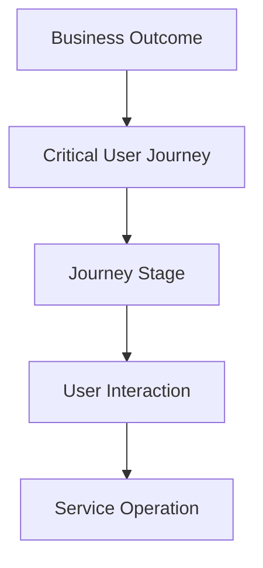
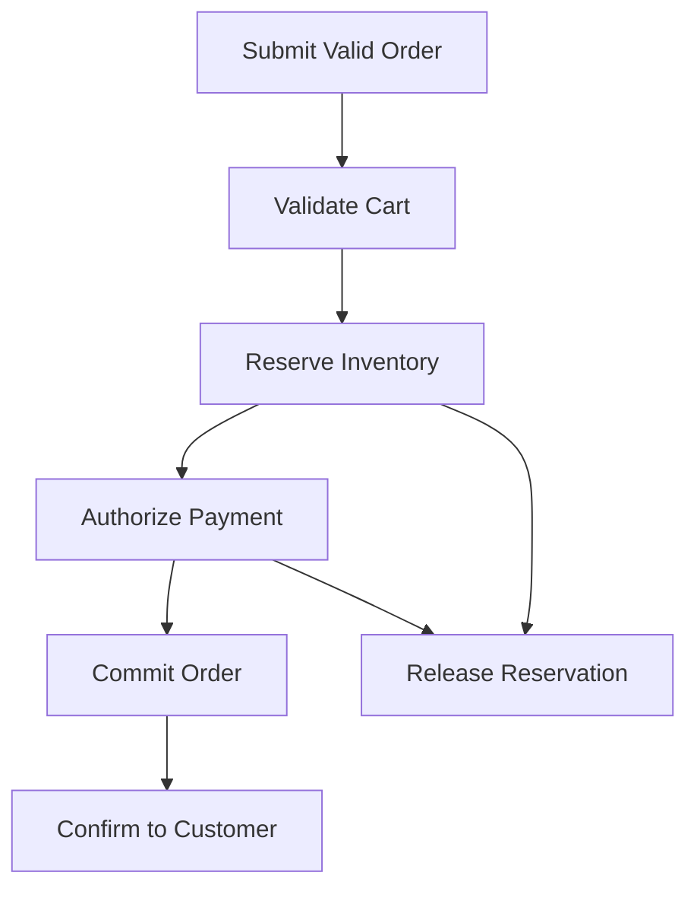

# Critical User Journeys

> A Critical User Journey is a sequence of interactions that a user must complete to achieve an important outcome. SRE uses Critical User Journeys to connect reliability engineering with what users and the business actually depend on.

## Chapter Purpose

Infrastructure can appear healthy while users cannot complete their most important work.

CPU may be normal. Containers may be running. Databases may accept connections. Individual APIs may meet local targets. Yet customers may still be unable to sign in, pay, publish, withdraw funds, recover an account, or receive an urgent result.

Critical User Journeys, commonly shortened to CUJs, prevent reliability work from stopping at component health.

They help teams answer:

- Who is the user?
- What outcome is the user trying to achieve?
- Where does the journey begin and end?
- Which steps and dependencies make the outcome possible?
- Which failures are visible to the user?
- How should success, quality, and timeliness be measured?
- Which journeys deserve the strongest reliability investment?
- Who owns the end-to-end outcome?
- How should incidents be detected and prioritized?

This chapter explains how to discover, define, map, measure, operate, test, and improve Critical User Journeys. It focuses on service reliability, not interface design or marketing funnels.

---

## Learning Objectives

After completing this chapter, you should be able to:

1. Define a user journey and a Critical User Journey.
2. Distinguish CUJs from features, endpoints, components, business processes, and user-interface screens.
3. Identify real users, including humans, systems, operators, and internal teams.
4. Discover and prioritize journeys using user and business impact.
5. Define clear journey boundaries, preconditions, success, failure, and quality criteria.
6. Map journey steps, branches, dependencies, ownership, and failure modes.
7. Derive user-centered SLIs and SLOs from a CUJ.
8. Design observability that detects partial and end-to-end failure.
9. Test journeys with synthetic, real-user, integration, load, resilience, and recovery methods.
10. Use CUJs during incident response, risk analysis, change review, and capacity planning.
11. Prevent misleading aggregation, double counting, and dependency blind spots.
12. Maintain a dependable CUJ inventory throughout the service lifecycle.

---

## 1. What Is a User Journey?

A user journey is a sequence of interactions through which a user attempts to achieve a meaningful outcome.

Examples include:

- Customer signs in to an account
- Shopper completes a purchase
- Patient receives a laboratory result
- Employee submits payroll information
- Service sends and receives an event
- Operator restores a failed database

A journey may contain one request or many steps across several systems.

---

## 2. What Makes a Journey Critical?

A journey is critical when failure creates material harm to users, the business, safety, compliance, security, or dependent services.

Criticality may come from:

- High user value
- Revenue dependence
- Safety consequences
- Legal or regulatory obligation
- Data integrity requirements
- Security importance
- Time sensitivity
- High usage volume
- Lack of an alternative
- Large downstream impact

Popularity alone does not determine criticality. A rarely used emergency-recovery journey may be more critical than a frequently used cosmetic preference.

---

## 3. A Working Definition of a CUJ

A Critical User Journey is a bounded, measurable path through which a defined user achieves an outcome that the organization considers important enough to protect explicitly.

A complete CUJ identifies:

- User
- Intent
- Trigger
- Preconditions
- Start point
- Required steps
- Allowed branches
- End point
- Success criteria
- Failure criteria
- Quality and time expectations
- Dependencies
- Owner
- Reliability measurement

---

## 4. Why CUJs Matter to SRE

CUJs connect technical operation to user experience.

They guide:

- SLI selection
- SLO design
- Error-budget policy
- Alerting
- Incident severity
- Architecture review
- Capacity planning
- Dependency analysis
- Resilience testing
- Recovery priorities
- Change safety
- Reliability investment

Without CUJs, teams often measure what is easy to collect instead of what users need.

---

## 5. Infrastructure Health Is Not User Success

Consider an online checkout service:

- All application instances are running.
- Average CPU is 35 percent.
- Database availability is 100 percent.
- The payment API returns HTTP 200.
- Orders are not created because successful payment events are rejected by a schema mismatch.

Component health is green, but the checkout journey is failing.

CUJ measurement asks whether users completed a valid purchase, not whether individual components appeared alive.

---

## 6. CUJ, Feature, and Component

| Concept | Focus | Example |
| --- | --- | --- |
| Feature | Capability offered | Saved payment methods |
| Screen | User-interface view | Checkout page |
| Endpoint | Technical interface | `POST /payments` |
| Component | Deployable or technical unit | Payment authorization service |
| Business process | Organizational workflow | Order fulfillment |
| User journey | User's path to an outcome | Complete a purchase |
| Critical User Journey | Protected high-impact journey | Complete a paid order correctly and on time |

A CUJ may cross many features, screens, endpoints, components, and teams.

---

## 7. CUJs Are Not Click Paths

A click path records interface actions. A CUJ records an outcome.

Interface layouts change. Mobile and web clients may use different screens. APIs may serve automated users. The underlying user intent can remain stable.

Weak definition:

> User clicks button A, opens page B, and clicks button C.

Stronger definition:

> An authenticated customer submits an eligible order and receives durable confirmation that the order was accepted exactly once.

The stronger definition survives interface changes and exposes reliability requirements.

---

## 8. Users Are Not Always Humans

Possible users include:

- Customer
- Employee
- Administrator
- Support engineer
- Partner organization
- Mobile application
- API client
- Scheduled workload
- Downstream service
- Incident responder
- Auditor
- Recovery operator

For system users, define identity, protocol, expected behavior, and success from the consumer's perspective.

---

## 9. Internal Journeys Can Be Critical

Internal does not mean unimportant.

Examples include:

- Engineer deploys an emergency fix
- Operator rotates a compromised credential
- Support agent restores customer access
- Finance team completes payroll
- Security team revokes an account
- Database operator restores data

An internal journey becomes critical when its failure blocks production recovery, creates material business harm, or affects external users.

---

## 10. Journey Hierarchy

Journeys can exist at several levels.



Example:

- Business outcome: collect customer revenue
- CUJ: complete a purchase
- Stage: authorize payment
- Interaction: submit payment details
- Service operation: create authorization request

Keep the CUJ meaningful to users while retaining enough technical detail to operate it.

---

## 11. CUJ Scope

A CUJ should be broad enough to represent a meaningful outcome and narrow enough to measure and own.

Too narrow:

> Load one JavaScript file.

Too broad:

> Use the entire commerce platform.

Useful scope:

> A customer with an available product completes checkout and receives a correct order confirmation.

---

## 12. Start and End Boundaries

Define exactly when the journey starts and ends.

Possible start points:

- User expresses an intent
- Client submits a valid request
- Event is accepted at a public boundary
- Operator begins a documented recovery action

Possible end points:

- User receives a valid response
- Durable state is committed
- Downstream acknowledgement is received
- Required side effect is completed
- Outcome becomes visible to the user

The measurement boundary should reflect the promised experience and what can be observed responsibly.

---

## 13. Preconditions

Preconditions describe what must already be true for a journey attempt to be valid.

Examples include:

- User has a valid account
- Product is in stock
- Request follows the supported contract
- Payment method is eligible
- Source data meets quality rules
- Operator has approved access

Preconditions prevent invalid or unsupported attempts from distorting reliability measurements.

They must not be abused to exclude legitimate failures.

---

## 14. Success Criteria

Success must be defined from the user outcome.

It may require:

- Correct result
- Complete result
- Durable result
- Timely result
- Authorized result
- Exactly-once effect
- Visible confirmation
- Consistent state across systems

An HTTP success code does not prove that the user outcome succeeded.

---

## 15. Failure Criteria

A journey fails when a valid attempt does not meet its required outcome.

Failure may include:

- Explicit error
- Timeout
- Incorrect result
- Missing data
- Duplicate action
- Partial completion
- Stale state
- Unauthorized exposure
- Completion after the allowed time
- Success message without durable completion

Define failures before selecting telemetry.

---

## 16. Abandonment and User Choice

Not every incomplete journey is a service failure.

A user may:

- Change their mind
- Reject a price
- Leave the device
- Choose another option
- Fail an eligibility rule correctly

Separate:

- Voluntary abandonment
- Expected business rejection
- Invalid attempt
- Technical failure
- Unknown outcome

Misclassifying user choice as failure makes the SLI noisy. Misclassifying technical friction as choice hides unreliability.

---

## 17. Business Rejection Versus System Failure

A correct rejection can be a successful service event.

Examples include:

- Valid fraud rule blocks a transaction
- User lacks permission
- Requested item is unavailable
- Input violates a documented constraint

Reliability asks whether the system made and communicated the correct decision within the expected time.

The business may still track rejection rates separately for product analysis.

---

## 18. Partial Success

Some journeys can produce partial outcomes.

Examples include:

- Order accepted but confirmation delayed
- File uploaded but processing incomplete
- Search returns results without personalization
- Report generated without one optional section

Decide whether partial success is:

- Good
- Degraded but acceptable
- Bad
- A separate quality class

This decision should follow user expectations, not implementation convenience.

---

## 19. Quality Dimensions

A CUJ may require more than availability.

| Dimension | Reliability question |
| --- | --- |
| Availability | Can valid users attempt the journey? |
| Correctness | Is the result right? |
| Latency | Is the result delivered in time? |
| Durability | Does acknowledged state persist? |
| Freshness | Is the information current enough? |
| Completeness | Are required data and effects present? |
| Consistency | Do related systems agree where required? |
| Security | Is the outcome authorized and protected? |
| Continuity | Can the journey continue or recover during disruption? |

Each CUJ needs only the dimensions that materially affect its outcome.

---

## 20. Discovering Candidate Journeys

Use several sources:

- Product requirements
- User research
- Support cases
- Incident history
- Business-process maps
- API contracts
- Analytics
- Architecture diagrams
- Compliance obligations
- Revenue flows
- Operational procedures
- Recovery plans
- Interviews with users and operators

Do not let existing dashboards determine the candidate list.

---

## 21. CUJ Discovery Workshop

Include representatives from:

- Product
- Development
- SRE
- Operations
- Support
- Security
- Data
- Business stakeholders
- Real users where practical

Ask:

1. Who uses the service?
2. What outcomes matter most?
3. What happens if each outcome fails?
4. Which alternatives exist?
5. Which journeys are time-sensitive?
6. Which journeys have caused serious incidents?
7. Which journeys are poorly measured?

The workshop produces candidates, not final SLOs.

---

## 22. User Segments

One journey can have different importance or expectations for different users.

Segments may include:

- Free and paid customers
- Internal and external users
- Regions
- Devices
- Accessibility needs
- Enterprise and individual accounts
- Emergency and routine use
- New and returning users

Segment only when expectations or risk differ materially. Excessive segmentation creates SLO complexity and small, unstable datasets.

---

## 23. Journey Variants

A single intent may have variants.

Checkout may vary by:

- Guest or authenticated user
- Card or bank transfer
- Domestic or international order
- Web or mobile client
- Physical or digital product

Decide whether variants should be:

- One combined CUJ
- Separate CUJs
- One CUJ with segmented indicators
- One primary journey with supporting diagnostics

Base the choice on user expectations, architecture, and decision usefulness.

---

## 24. Prioritizing Candidate Journeys

Prioritization should consider:

- User harm
- Business impact
- Safety impact
- Legal or regulatory impact
- Security impact
- Volume
- Time sensitivity
- Dependency impact
- Lack of workaround
- Reputation impact
- Recovery difficulty

Avoid declaring every journey critical. If everything is critical, the term no longer guides investment.

---

## 25. A CUJ Prioritization Matrix

| Impact | Workaround available | Suggested treatment |
| --- | --- | --- |
| High | No | Strong CUJ candidate |
| High | Yes, but costly | CUJ candidate with degraded-mode analysis |
| Medium | No | Evaluate duration, volume, and cumulative harm |
| Medium | Yes | Monitor, but may not require top-tier SLO |
| Low | Yes | Usually not a primary CUJ |

This matrix supports discussion. It does not replace judgment.

---

## 26. Quantitative Prioritization

A team may score candidates using weighted factors.

Example:

\[
P = 0.30U + 0.25B + 0.15S + 0.10R + 0.10T + 0.10D
\]

Where:

- \(U\) = user impact
- \(B\) = business impact
- \(S\) = safety, security, or compliance impact
- \(R\) = reach or affected population
- \(T\) = time sensitivity
- \(D\) = dependency impact

Scores make assumptions visible. They do not create objective truth.

---

## 27. Low-Volume Critical Journeys

Some critical journeys occur rarely:

- Disaster recovery
- Emergency account lockout
- Data export for legal obligation
- Failover to a backup region
- Restore from backup
- Credential revocation

Request-based ratios may be statistically weak.

Use additional evidence such as:

- Scheduled synthetic tests
- Exercise success
- Maximum completion time
- Readiness controls
- Change validation
- Manual audit evidence

---

## 28. Journey Mapping

A journey map should show:

- User
- Entry point
- Ordered stages
- Branches
- System boundaries
- Dependencies
- State changes
- Success point
- Failure points
- Owners
- Observability points

Start with the user flow. Add technical detail only where it supports reliability decisions.

---

## 29. Example Checkout Journey



Questions raised by this map include:

- What happens if payment succeeds but order commit fails?
- Is inventory released after every failed path?
- When is success counted?
- Can retry create a duplicate charge?
- Which step controls total latency?
- Which team coordinates the complete outcome?

---

## 30. Journey State Model

For stateful journeys, define valid states and transitions.

Example order states:

- Initiated
- Validated
- Reserved
- Authorized
- Committed
- Confirmed
- Failed
- Compensating
- Cancelled

State models help identify:

- Stuck journeys
- Invalid transitions
- Duplicate effects
- Missing compensation
- Ambiguous outcomes
- Recovery requirements

---

## 31. Synchronous and Asynchronous Journeys

Synchronous journeys return an immediate result. Asynchronous journeys continue after initial acceptance.

For asynchronous journeys, separate:

- Acceptance success
- Processing success
- Completion latency
- Final outcome delivery

Example:

> A report request is accepted within 2 seconds, and 99 percent of valid reports are completed correctly within 10 minutes.

Measuring only request acceptance hides processing failure.

---

## 32. Multi-Session Journeys

Some journeys span minutes, days, devices, or sessions.

Examples include:

- Account registration with email verification
- Loan application
- Data migration
- Password recovery
- Medical-result processing

Use a durable journey identifier when lawful and appropriate. Define timeout, abandonment, privacy, and correlation rules.

Do not collect unnecessary personal data merely to improve measurement.

---

## 33. Dependency Mapping

For each stage, record:

- Owning service
- Upstream input
- Downstream service
- External provider
- Data store
- Network path
- Identity service
- Control plane
- Queue or stream
- Manual action

Classify dependencies as:

- Required
- Optional
- Replaceable
- Degradable
- Control-plane only
- Recovery-only

---

## 34. Dependency Contracts

A useful dependency contract defines:

- Supported interface
- Expected reliability
- Latency expectation
- Capacity and quota
- Error behavior
- Retry guidance
- Idempotency
- Change notification
- Escalation
- Recovery expectation
- Deprecation policy

An undocumented dependency is still a dependency, but it is harder to operate safely.

---

## 35. Common Dependencies Across CUJs

Authentication, identity, networking, configuration, and data platforms may support many journeys.

A common dependency deserves focused analysis when its failure can affect several CUJs simultaneously.

Possible actions include:

- Define it as a CUJ of its own
- Create a platform SLO
- Track aggregate dependency risk
- Design shared degraded modes
- Coordinate capacity planning
- Test correlated failure

---

## 36. Hidden Dependencies

Hidden dependencies often appear only during disruption.

Examples include:

- DNS
- Certificate validation
- Time synchronization
- Feature-flag service
- Secrets service
- Identity provider
- Build artifact registry
- Control plane
- Human approval
- Vendor support portal

Use incident reviews, architecture tracing, controlled failure tests, and recovery exercises to discover them.

---

## 37. Mapping Ownership

Each journey needs:

- Journey-level accountable owner
- Component owners
- Dependency owners
- Product decision owner
- Incident coordination path
- Risk acceptance authority

The journey owner coordinates the end-to-end result. Component teams remain accountable for their boundaries.

---

## 38. From CUJ to SLI

An SLI is a quantitative measure of service behavior.

Start with the user question:

> Did valid users complete the journey correctly and within the expected time?

Then identify:

- Eligible events
- Good events
- Bad events
- Unknown events
- Measurement point
- Observation window
- Exclusions
- Segments
- Data-quality controls

Telemetry should implement the definition, not create it.

---

## 39. Event-Based Journey SLI

For discrete attempts:

\[
\text{Journey success ratio} =
\frac{\text{Good eligible journey attempts}}
{\text{Total eligible journey attempts}}
\]

Example:

> Good events are valid checkout attempts that produce one durable order and correct confirmation within 10 seconds.

> Total events are all valid checkout attempts accepted at the public boundary.

This definition is stronger than counting HTTP status codes from one service.

---

## 40. Time-Based Journey SLI

For continuously available capabilities:

\[
\text{Availability ratio} =
\frac{\text{Good time intervals}}
{\text{Eligible time intervals}}
\]

Time-based measurement can suit low-request services, but interval length matters. A long interval can hide short harmful outages. A short interval can magnify noise.

Choose the method that supports real decisions.

---

## 41. Latency SLI

Latency can be measured as the proportion of eligible journeys completed within a threshold.

\[
\text{Timely ratio} =
\frac{\text{Eligible journeys completed within threshold}}
{\text{Eligible completed or attempted journeys}}
\]

Define:

- Start clock
- Stop clock
- Threshold
- Timeout
- Treatment of failed journeys
- Treatment of retries
- Segmentation

Latency percentiles alone may omit outright failures unless the denominator is designed carefully.

---

## 42. Correctness SLI

Correctness asks whether the outcome is valid.

Possible checks include:

- Expected result matches actual result
- Required fields are complete
- Business invariant holds
- Exactly one state transition occurred
- Data reconciliation succeeds
- User-visible confirmation matches durable state

Correctness often requires application-level evidence, not infrastructure metrics.

---

## 43. Freshness SLI

Freshness matters when users depend on current information.

Example:

> 99.9 percent of eligible inventory views show data no more than 60 seconds behind the authoritative source.

Define:

- Authoritative event time
- Observation time
- Allowed delay
- Clock behavior
- Late-arriving data
- Backfill treatment

---

## 44. Durability SLI

Durability concerns acknowledged state that must not be lost.

Possible measures include:

- Lost acknowledged records
- Successful restore validation
- Reconciliation difference
- Percentage of durable writes retained

Durability failures may be discovered long after the original request. Measurement windows and reporting must reflect this delay.

---

## 45. Composite Journey Indicators

A CUJ may require several conditions.

Example good event:

> Valid payment is authorized, one order is durably committed, inventory is adjusted, and confirmation is returned within 10 seconds.

Composite indicators align strongly with user outcomes, but they can be hard to instrument and diagnose.

Use:

- One journey-level indicator for the outcome
- Supporting component indicators for diagnosis

Do not replace end-to-end measurement with a dashboard of unrelated local metrics.

---

## 46. The Product of Component Availabilities

For a strictly serial journey with independent required components, a rough model is:

\[
A_{journey} = A_1 \times A_2 \times \dots \times A_n
\]

If five required components each achieve 99.9 percent availability:

\[
0.999^5 \approx 99.50\%
\]

This model is only an approximation. Failures may be correlated, retries may mask faults, and traffic may not reach every component equally.

The lesson is that excellent local targets do not automatically create an excellent journey.

---

## 47. Journey SLO

An SLO sets a target for an SLI over a window.

Example:

> During a rolling 28-day window, at least 99.95 percent of eligible checkout attempts will create exactly one durable order and return correct confirmation within 10 seconds.

A complete SLO includes:

- User and journey
- SLI definition
- Target
- Window
- Data source
- Exclusions
- Owner
- Error-budget action
- Review cadence

---

## 48. Selecting an SLO Target

Consider:

- User expectations
- Business impact
- Safety and regulation
- Historical performance
- Architecture limits
- Dependency reliability
- Cost
- Workarounds
- Competitor or contractual context
- Ability to measure

Do not select 99.9 percent because it is familiar. The target should support a deliberate reliability decision.

---

## 49. Journey Error Budget

For a percentage target:

\[
\text{Error budget} = 1 - \text{SLO target}
\]

For a 99.95 percent success target, the allowed bad-event fraction is 0.05 percent.

The error budget provides a common unit for:

- Release decisions
- Incident impact
- Reliability prioritization
- Risk discussion
- Dependency review

The policy should define actions before the budget is exhausted.

---

## 50. Multiple SLOs for One Journey

A journey may need separate SLOs for:

- Successful completion
- Completion latency
- Correctness
- Freshness
- Durability

Keep each objective decision-relevant.

Avoid combining unrelated dimensions into one number if the result cannot explain what action to take.

---

## 51. SLO Coverage Across Journeys

Do not begin by defining dozens of SLOs.

Start with a small set of high-impact journeys that:

- Represent major user value
- Cover important architecture paths
- Support real decisions
- Can be measured credibly
- Have accountable owners

Expand coverage after the organization demonstrates that it can use and maintain the first set.

---

## 52. Measurement Points

Possible measurement locations include:

- Client
- Edge
- Load balancer
- Application
- Workflow engine
- Event stream
- Authoritative data store
- Downstream acknowledgement
- Synthetic probe

The closer measurement is to the user outcome, the stronger its validity may be. The farther inside the system it is, the easier diagnosis may become.

Use multiple points when necessary, but identify the authoritative SLI source.

---

## 53. Server-Side Measurement

Advantages:

- Broad coverage
- Consistent collection
- Lower client instrumentation dependence
- Strong connection to authoritative state

Limitations:

- May miss client rendering and network failure
- May count requests the user abandoned
- May not observe final user confirmation
- Can confuse accepted work with completed work

---

## 54. Client-Side Measurement

Advantages:

- Closer to actual user experience
- Captures browser, device, and last-mile behavior
- Can observe rendering and interaction

Limitations:

- Sampling
- Ad blockers or disabled telemetry
- Version fragmentation
- Privacy constraints
- Offline delivery
- Duplicate events

Client telemetry needs data-quality controls and a clear fallback when collection fails.

---

## 55. Synthetic Journeys

Synthetic monitoring performs controlled journey attempts.

It is useful for:

- Early detection
- Low-traffic journeys
- Regional testing
- Known test accounts
- Dependency verification
- Pre-release validation

Limitations include:

- Simplified behavior
- Test-data drift
- Different identity or network path
- Limited coverage of real variation
- Risk of creating real side effects

Synthetic results should complement production event measurement.

---

## 56. Real User Monitoring

Real user monitoring captures actual experience.

It can reveal:

- Device differences
- Regional differences
- Client-version failures
- Last-mile latency
- Browser errors
- Real abandonment patterns

Protect privacy, minimize collected data, define sampling, and account for telemetry loss.

---

## 57. Correlation and Journey Identity

Multi-step journeys need correlation.

Useful identifiers include:

- Request ID
- Trace ID
- Workflow ID
- Transaction ID
- Order ID
- Privacy-safe session identifier

A correlation design should define:

- Creation point
- Propagation
- Uniqueness
- Retention
- Redaction
- Retry behavior
- Cross-system compatibility

Never expose secrets or unnecessary personal data through correlation fields.

---

## 58. Retries and Duplicate Counting

Retries can improve user success while corrupting measurement.

Decide whether the unit is:

- User intent
- Client attempt
- Network request
- Backend operation

If one user action creates three requests and the third succeeds, request-level success is 33 percent while journey-level success may be 100 percent with increased latency.

Both facts can matter, but they answer different questions.

---

## 59. Unknown Outcomes

Some attempts cannot be confidently classified.

Causes include:

- Missing telemetry
- Broken correlation
- Delayed completion
- Partial ingestion
- Data-processing failure
- Conflicting system state

Do not silently remove unknowns.

Track:

- Unknown rate
- Cause
- Potential bias
- Maximum acceptable level
- Remediation owner

High unknown rates can invalidate an SLO.

---

## 60. Exclusions

Valid exclusions may include:

- Clearly invalid requests
- Authorized load tests using identified traffic
- Documented unsupported behavior
- Duplicated telemetry records

Unsafe exclusions include:

- All dependency failures
- All planned maintenance regardless of user impact
- Errors that are hard to classify
- Affected regions during incidents
- Failures caused by recent releases

An exclusion must be specific, reviewable, and consistent with user expectations.

---

## 61. Aggregation Risk

Global success can hide severe local harm.

Example:

- Global checkout success: 99.95 percent
- One small region: 80 percent
- Other regions: nearly 100 percent

Inspect relevant dimensions:

- Region
- Tenant
- Client version
- Device
- Dependency
- Journey variant
- Time

Avoid unbounded slicing that creates noisy metrics. Choose segments linked to known user or architectural risk.

---

## 62. Average Latency Is Not Enough

Average latency can hide a slow minority.

Use:

- Threshold success ratios
- Percentiles
- Distribution views
- Maximum bounded delay for critical cases
- Segmentation

For SLOs, a threshold ratio often maps clearly to good and bad events.

---

## 63. Observability for CUJs

A CUJ observability design should answer:

- Are users starting the journey?
- Are they completing it?
- How long does it take?
- Where do failures occur?
- Which users or segments are affected?
- Which dependency is degraded?
- Is data correct and durable?
- Can responders trace one failed attempt?

Use metrics for trends, logs for event detail, traces for path relationships, and state checks for outcome validation.

---

## 64. CUJ Dashboard

A useful dashboard may include:

- Journey success against SLO
- Error-budget consumption
- Burn rates
- Latency threshold compliance
- Attempt volume
- Unknown outcome rate
- Top failure categories
- Segment breakdown
- Stage conversion and failure
- Dependency health
- Recent changes
- Current incidents

Place user outcome first. Component diagnostics should support, not replace, that view.

---

## 65. CUJ Alerting

Alert when user-impacting failure requires timely human action.

Good alert design includes:

- Journey and affected outcome
- SLO or user-impact signal
- Severity
- Scope
- Burn rate
- Starting time
- Likely failure stage
- Dashboard
- Runbook
- Owning team

Use multi-window, multi-burn-rate alerting where appropriate to detect fast and slow budget consumption.

---

## 66. Component Alerts Versus Journey Alerts

Component alerts answer:

> Is a technical condition abnormal?

Journey alerts answer:

> Are users failing to achieve an important outcome?

Both are useful.

- Journey alerts determine impact and urgency.
- Component signals help locate cause.
- Predictive component alerts may prevent journey failure.

Do not page for every abnormal component metric if no action or user risk exists.

---

## 67. Failure-Mode Analysis

For every journey stage, ask:

- How can this step fail?
- What causes that failure?
- What does the user experience?
- How many users are affected?
- How is it detected?
- Can the journey degrade?
- Can it retry safely?
- How is state reconciled?
- Who responds?
- How is recovery verified?

Include technical, dependency, data, security, capacity, and human failure.

---

## 68. CUJ Risk Register

Record:

- Journey
- Stage
- Failure mode
- Cause
- User impact
- Likelihood
- Detectability
- Existing controls
- Residual risk
- Owner
- Planned treatment
- Review date

Historical incidents provide evidence, but absence of past failure does not prove low risk.

---

## 69. Correlated Failure

CUJ components often share dependencies or failure domains.

Examples include:

- One identity provider
- One region
- One network path
- One configuration service
- One deployment pipeline
- One human approval group

Do not assume component failures are independent. Model shared dependencies and test common-mode failure.

---

## 70. Graceful Degradation

Degradation preserves the essential user outcome while reducing optional behavior.

Examples include:

- Disable recommendations but keep checkout
- Serve slightly stale catalog data
- Queue non-urgent notifications
- Offer read-only access
- Use a secondary payment route

Define:

- Essential stages
- Optional stages
- Activation conditions
- User communication
- Data consistency behavior
- Recovery and reconciliation

Degraded mode must be tested before an incident.

---

## 71. Capacity Planning by Journey

Translate user demand into component load.

For each journey, estimate:

- Attempts per second
- Peak multiplier
- Requests per stage
- Fan-out
- Data read and write volume
- Queue growth
- Dependency calls
- Retry amplification
- Regional distribution
- Seasonal or event-driven spikes

A critical journey may fail from one constrained stage even when total infrastructure appears underused.

---

## 72. Change Risk and CUJs

Before a change, identify:

- Affected CUJs
- Affected stages
- Expected signal movement
- Blast radius
- Validation tests
- Canary population
- Stop conditions
- Rollback or roll-forward plan

After deployment, verify the journey outcome, not only deployment completion.

---

## 73. Release Guardrails

Useful guardrails include:

- Pre-release journey tests
- Canary analysis using CUJ SLIs
- Error-budget policy
- Automated stop conditions
- Segment comparison
- Synthetic checks
- Post-release observation period

Guardrails should detect correctness and state failures where possible, not only latency and error codes.

---

## 74. Testing Critical User Journeys

Use multiple test types:

- Unit tests for component logic
- Contract tests for interfaces
- Integration tests across dependencies
- End-to-end tests for the journey
- Synthetic production tests
- Load tests
- Resilience tests
- Recovery exercises
- Security tests
- Manual operational drills

No single test provides complete evidence.

---

## 75. Test Data and Side Effects

Journey tests may create orders, payments, messages, accounts, or data changes.

Control:

- Test identities
- Payment simulation
- Data isolation
- Cleanup
- Rate limits
- Notification suppression
- Audit marking
- Privacy
- Production side effects

Synthetic tests must not create harm while trying to detect it.

---

## 76. Resilience Testing

Test failure at meaningful journey stages.

Examples include:

- Dependency timeout
- Delayed event
- Duplicate delivery
- Regional loss
- Stale cache
- Expired credential
- Queue backlog
- Partial database failure
- Broken rollback

Verify:

- User outcome
- Detection
- Degraded behavior
- Safe retry
- Incident response
- Recovery
- Reconciliation

---

## 77. Recovery by Criticality

During widespread disruption, restore the journeys with the greatest impact first.

Recovery plans should map:

- CUJ priority
- Required components
- Required data
- Required access
- Required people
- Recovery sequence
- RTO and RPO
- Validation transaction
- Degraded alternative

Restoring infrastructure without validating the CUJ does not prove recovery.

---

## 78. CUJs During Incident Response

Use CUJs to answer:

- Which outcomes are failing?
- Which users are affected?
- Which stage fails?
- What is the error-budget impact?
- Which workaround preserves the most important outcome?
- Which teams must join?
- What should communication say?
- How will recovery be verified?

Incident severity should reflect user harm, not only the size of the failed component.

---

## 79. Incident Communication

User-centered communication states:

- Affected journey
- Affected users or regions
- Observed impact
- Available workaround
- Current response
- Next update time

Weak message:

> Database shard 12 has elevated lock wait.

Stronger message:

> Some customers in Region A cannot complete checkout. Existing orders remain available. The team is mitigating the payment-to-order commit delay.

Technical detail can be added for engineering audiences.

---

## 80. Recovery Verification

Verify recovery at three levels:

1. Components are technically healthy.
2. New journey attempts complete successfully.
3. Earlier partial or stuck journeys are reconciled.

The third level is often missed.

Examples include:

- Release inventory reservations
- Complete queued reports
- Reconcile payments and orders
- Redeliver accepted events
- Notify affected users

---

## 81. CUJs in Postmortems

A postmortem should record:

- Affected CUJs
- Failed stages
- Impact by segment
- Good, bad, and unknown attempts
- Error-budget consumption
- Detection gaps
- Dependency behavior
- Degraded-mode performance
- Recovery verification
- Corrective actions

Update the CUJ map when the incident reveals a hidden dependency or incorrect boundary.

---

## 82. CUJ Ownership

A CUJ owner is accountable for end-to-end reliability coordination.

Responsibilities include:

- Maintaining the journey definition
- Coordinating SLOs
- Reviewing dependencies
- Resolving gaps between component teams
- Leading journey-level risk review
- Ensuring observability
- Coordinating incident and recovery priorities
- Reviewing material changes

The owner does not replace component ownership.

---

## 83. CUJ Inventory

Maintain a discoverable inventory with:

| Field | Description |
| --- | --- |
| CUJ name | Stable, outcome-based name |
| User | Defined user or consumer |
| Intent | Outcome the user needs |
| Criticality | Impact classification |
| Owner | Accountable team |
| Start and end | Journey boundaries |
| Preconditions | Eligible-attempt conditions |
| Success | Required good outcome |
| Failure | Bad and unknown outcomes |
| Stages | Major journey steps |
| Dependencies | Required and optional services |
| SLI and SLO | Measurement and target |
| Dashboard | User-outcome view |
| Runbook | Response instructions |
| Recovery | Recovery order and validation |
| Last verified | Review date and verifier |

---

## 84. CUJ Definition Template

```yaml
cuj:
  name: complete-checkout
  user: eligible-customer
  intent: purchase available products
  owner: commerce-experience
  criticality: critical

boundary:
  start: valid-order-submitted
  success: one-order-durably-committed-and-confirmed
  timeout: 10s

eligibility:
  - supported-client
  - available-product
  - valid-shipping-destination

stages:
  - validate-cart
  - reserve-inventory
  - authorize-payment
  - commit-order
  - confirm-order

reliability:
  sli: good-eligible-checkouts / total-eligible-checkouts
  slo: 99.95-percent-over-28-days
  dashboard: checkout-cuj
  runbook: checkout-failure-response

governance:
  last_verified: 2026-09-13
  next_review: 2026-12-13
```

Adapt the schema to your environment. Do not store secrets or unnecessary personal data.

---

## 85. CUJ Review Cadence

Review a CUJ when:

- User behavior changes
- Product scope changes
- Architecture changes
- A dependency changes
- A material incident occurs
- An SLO becomes unhelpful
- Measurement quality degrades
- Ownership changes
- A major launch approaches
- The journey enters deprecation

Also use a risk-based scheduled review.

---

## 86. CUJ Maturity Model

| Level | Description |
| --- | --- |
| 0. Unknown | Important user outcomes are not identified |
| 1. Listed | Candidate journeys exist without reliable definitions |
| 2. Defined | Users, boundaries, outcomes, owners, and dependencies are documented |
| 3. Measured | User-centered SLIs and SLOs operate with credible data |
| 4. Operational | Alerts, incidents, tests, capacity, and recovery use CUJs |
| 5. Adaptive | CUJs evolve through evidence, risk, and lifecycle change |

Maturity depends on use, not document volume.

---

## 87. Common CUJ Anti-Patterns

### Everything Is Critical

The inventory becomes too large to prioritize reliability work.

### Endpoint Equals Journey

One API success rate is used as a substitute for an end-to-end outcome.

### Existing Metrics Define the Journey

Teams describe only what current telemetry can measure.

### Happy Path Only

Branches, retries, partial success, and compensation are ignored.

### Infrastructure-Only Success

Running components are counted as user success.

### Dependency Failures Are Excluded

Users experience failure, but the SLI removes it because another team or vendor caused it.

### Average Hides Harm

Global or average performance conceals a failing region, tenant, or client.

### Acceptance Equals Completion

Asynchronous work is counted good when queued, even if it never completes.

### Unowned Journey

Components have owners, but no one coordinates the outcome.

### Static Journey Map

The map is never updated after product, architecture, or dependency changes.

---

## 88. Scenario 1: Checkout Is Green but Orders Are Missing

Payment authorization succeeds and every dashboard is green. A delayed event causes some paid transactions to produce no order.

### CUJ failure

The journey was measured at payment acceptance instead of durable order completion.

### Required response

- Redefine success at the user outcome
- Correlate payment and order state
- Add reconciliation
- Measure unknown and partial outcomes
- Alert on journey failure
- Build compensation for unmatched payments

---

## 89. Scenario 2: One Region Is Hidden by Global Success

Global login success remains above target, but a small region experiences 30 percent failure.

### CUJ failure

Aggregation hides concentrated user harm.

### Required response

- Segment by meaningful region
- Define minimum traffic requirements for alerts
- Investigate shared regional dependencies
- Review whether separate objectives are needed
- Preserve global and regional views

---

## 90. Scenario 3: Retry Makes the Dashboard Look Worse

A client retries twice before success. Request success appears low, but most users complete the journey after a delay.

### CUJ issue

Request attempts and user intents are mixed.

### Required response

- Define the journey unit
- Correlate retries to one user intent
- Track eventual journey success
- Track retry amplification separately
- Include latency impact
- Verify idempotency

---

## 91. Scenario 4: Password Recovery Has Almost No Traffic

Password recovery is critical during account compromise, but production volume is too low for stable ratios.

### Required response

- Run regular synthetic recovery journeys
- Test email or notification delivery
- Verify identity and security controls
- Measure maximum completion time
- Exercise operator escalation
- Track real attempts without relying only on percentages

---

## 92. Scenario 5: Vendor Failure Breaks a Critical Journey

A third-party identity provider fails. The service team excludes the event because the vendor caused it.

### CUJ failure

The SLI no longer reflects what users experienced.

### Required response

- Count eligible affected journeys as failed
- Escalate through the vendor path
- Activate an approved degraded or fallback mode
- Measure dependency contribution diagnostically
- Review architecture and contractual risk

---

## 93. Scenario 6: Recovery Restores Servers but Not Users

After a regional outage, servers are healthy. Thousands of accepted jobs remain stuck in a queue with expired leases.

### CUJ failure

Recovery was verified at component health, not journey completion.

### Required response

- Validate new end-to-end attempts
- Identify incomplete earlier journeys
- Repair lease and queue state
- Reprocess safely
- Reconcile final outcomes
- Update the recovery plan

---

## 94. Practical Exercise 1: Discover CUJs

Choose one service and list:

1. All user types
2. Each user's main outcomes
3. Consequence of each outcome failing
4. Available workaround
5. Time sensitivity
6. Safety, security, legal, and financial impact

Select no more than five initial CUJ candidates and justify each choice.

---

## 95. Practical Exercise 2: Map a Journey

For one CUJ, document:

- User
- Preconditions
- Start
- Stages
- Branches
- Dependencies
- State transitions
- Success
- Failure
- Unknown outcome
- Owner at every boundary

Draw the flow and mark every point where the journey can become stuck or partially complete.

---

## 96. Practical Exercise 3: Write a Journey SLI

Write precise definitions for:

- Eligible event
- Good event
- Bad event
- Unknown event
- Measurement location
- Correlation method
- Exclusions
- Segments
- Data-quality threshold

Then explain one way the proposed metric could misrepresent the user experience.

---

## 97. Practical Exercise 4: Build the SLO

Using the SLI from Exercise 3, define:

- Target
- Window
- Error budget
- Alert thresholds
- Policy actions
- Owner
- Review cadence

Explain why the target is appropriate using user impact, historical evidence, architecture, dependency limits, and cost.

---

## 98. Practical Exercise 5: Perform CUJ Risk Analysis

For each stage, identify:

- Failure mode
- Cause
- User impact
- Detection
- Existing protection
- Degraded mode
- Recovery
- Residual risk
- Owner

Prioritize the three risks that deserve engineering work first.

---

## 99. Practical Exercise 6: Design a CUJ Incident Drill

Create a drill in which:

- A required dependency slows down
- Retries increase load
- Some attempts become ambiguous
- One region is affected more than others

Define:

- Expected alerts
- Incident roles
- Mitigation
- User communication
- Recovery validation
- Reconciliation
- Evidence to collect

---

## 100. Critical User Journey Checklist

### User and Outcome

- [ ] The user is explicitly identified.
- [ ] The user intent is meaningful.
- [ ] Criticality is justified.
- [ ] Alternatives and workarounds are known.

### Boundary

- [ ] Preconditions are defined.
- [ ] Start and end points are explicit.
- [ ] Success is user-centered.
- [ ] Failure, rejection, abandonment, partial success, and unknown outcomes are distinguished.

### Architecture and Ownership

- [ ] Stages and branches are mapped.
- [ ] Required and optional dependencies are known.
- [ ] Hidden and common dependencies are reviewed.
- [ ] Component owners are recorded.
- [ ] One owner coordinates the end-to-end outcome.

### Measurement

- [ ] Eligible, good, bad, and unknown events are defined.
- [ ] Measurement points match the outcome.
- [ ] Retries and duplicates are handled.
- [ ] Exclusions are narrow and reviewable.
- [ ] Important segments are visible.
- [ ] Data quality is monitored.

### SLO and Operations

- [ ] The SLO target and window are justified.
- [ ] Error-budget actions are defined.
- [ ] Journey-level alerting exists.
- [ ] Component signals support diagnosis.
- [ ] Runbooks identify failure stages and owners.
- [ ] Incident communication describes user impact.

### Testing and Lifecycle

- [ ] End-to-end testing exists.
- [ ] Resilience and degraded modes are tested.
- [ ] Recovery validates the complete journey.
- [ ] Earlier incomplete journeys are reconciled.
- [ ] Material changes trigger review.
- [ ] Ownership and documentation are current.

---

## 101. Reflection Questions

1. Which system metrics in your environment can be green while users fail?
2. What is the difference between a feature and a CUJ?
3. Which low-volume journey would create the greatest harm if it failed?
4. Where should success be measured for an asynchronous journey?
5. Which dependency failures are currently excluded from user-facing measures?
6. Which aggregate metric may be hiding a harmed segment?
7. How do retries change request-level and journey-level results?
8. Who coordinates reliability across a journey that spans several teams?
9. How would you validate recovery for journeys that began before an incident?
10. Which CUJ definition should be reviewed after your most recent incident?

---

## 102. Knowledge Check

### 1. What is a Critical User Journey?

A bounded, measurable path through which a defined user achieves an outcome important enough to protect explicitly.

### 2. Is every frequently used journey critical?

No. Criticality also depends on harm, business value, safety, regulation, time sensitivity, alternatives, and downstream impact.

### 3. Why is an endpoint not automatically a CUJ?

An endpoint is a technical interface. A user journey may cross multiple endpoints and is defined by an outcome rather than one implementation boundary.

### 4. Can a correct business rejection be a good event?

Yes. If the service makes and communicates the correct decision within expectations, the service interaction may be reliable even though the user's requested action is rejected.

### 5. Why should dependency failures usually count against the CUJ?

Users experience the failed outcome regardless of which internal team or external provider caused it.

### 6. What is the difference between acceptance and completion?

Acceptance confirms that work entered the system. Completion confirms that the required final outcome occurred.

### 7. Why track unknown outcomes?

Unknowns reveal measurement gaps and possible bias. Silently dropping them can make reliability appear better than it is.

### 8. How should retries be counted?

Define whether the unit is user intent, attempt, request, or backend operation. Journey reliability usually needs correlation of retries to the original intent.

### 9. What is the purpose of a journey-level SLI?

To quantify whether users achieve the important outcome, rather than merely reporting component health.

### 10. Why segment CUJ data?

Meaningful segmentation can reveal concentrated harm hidden by global aggregation.

### 11. How should recovery be verified?

Verify component health, successful new journeys, and reconciliation of journeys that were partial or stuck during the incident.

### 12. Who owns a CUJ that crosses several services?

One accountable owner should coordinate the end-to-end outcome while component teams retain responsibility for their service boundaries.

---

## 103. Completion Checklist

You have completed this chapter when you can:

- [ ] Define CUJs in outcome-based language.
- [ ] Identify human, system, internal, and operator users.
- [ ] Prioritize journeys using impact and risk.
- [ ] Map boundaries, stages, branches, dependencies, and owners.
- [ ] Define success, failure, rejection, abandonment, partial, and unknown outcomes.
- [ ] Create user-centered SLIs and SLOs.
- [ ] Explain measurement-point, retry, exclusion, and aggregation risks.
- [ ] Design CUJ dashboards and alerts.
- [ ] Perform journey-level failure-mode analysis.
- [ ] Test degradation, resilience, and recovery.
- [ ] Use CUJs during incidents and postmortems.
- [ ] Maintain a current CUJ inventory.

---

## 104. Key Takeaways

- Reliability begins with what users need to accomplish.
- A CUJ is an outcome, not a screen, endpoint, component, or dashboard.
- Criticality depends on harm and importance, not only traffic volume.
- Boundaries, preconditions, success, failure, and unknown outcomes must be explicit.
- Journey-level measures should reflect valid user intent and final outcome.
- Component metrics remain important for diagnosis, but they do not replace user-centered SLIs.
- Dependencies remain part of the user experience even when another team or vendor operates them.
- Retries, asynchronous work, exclusions, and aggregation can distort measurement.
- CUJs should guide SLOs, alerting, incident severity, change safety, capacity, resilience, and recovery.
- End-to-end ownership is necessary when journeys cross team boundaries.
- Recovery is incomplete until affected journeys and state are reconciled.
- A small, maintained CUJ inventory is more useful than a large unused catalog.

---

## 105. Authoritative Resources

### Critical User Journeys and SLO Design

- [Google Cloud: Practical Guide to Setting SLOs](https://cloud.google.com/blog/products/management-tools/practical-guide-to-setting-slos)
- [Google Cloud: How to Design Good SLOs According to Google SREs](https://cloud.google.com/blog/products/devops-sre/how-to-design-good-slos-according-to-google-sres)
- [Google Cloud: Four Steps to Jumpstarting Your SRE Practice](https://cloud.google.com/blog/products/devops-sre/four-steps-to-jumpstarting-your-sre-practice)
- [Google SRE Workbook: Implementing SLOs](https://sre.google/workbook/implementing-slos/)

### Risk, Measurement, and Observability

- [Google Cloud: How SREs Analyze Risks to Evaluate SLOs](https://cloud.google.com/blog/products/devops-sre/how-sres-analyze-risks-to-evaluate-slos)
- [Google SRE Workbook: Alerting on SLOs](https://sre.google/workbook/alerting-on-slos/)
- [Google Cloud Well-Architected Framework: Observability](https://cloud.google.com/architecture/framework/reliability/observability)
- [AWS Well-Architected Framework: Define Performance Requirements](https://docs.aws.amazon.com/wellarchitected/latest/framework/perf_architecture_selection_requirements.html)

### Source Interpretation

These sources provide general and provider-context guidance. SRE World applies their principles to CUJ design without requiring a particular cloud provider, monitoring system, or organizational structure.

---

## 106. Related SRE World Sections

- [The SRE Mindset](./03-The-SRE-Mindset.md)
- [Reliability as a Product Feature](./04-Reliability-as-a-Product-Feature.md)
- [Reliability and Business Risk](./05-Reliability-and-Business-Risk.md)
- [Production Responsibility](./08-Production-Responsibility.md)
- [Service Ownership](./09-Service-Ownership.md)
- [SRE Foundations](./README.md)
- [Service Level Engineering](../03-Service-Level-Engineering/)
- [Observability Engineering](../05-Observability-Engineering/)
- [Incident Management](../08-Incident-Management/)
- [Capacity Planning](../15-Capacity-Planning/)
- [Reliability Testing](../19-Reliability-Testing/)

---

## Next Chapter

[11: Risk, Failure, and Uncertainty](./11-Risk-Failure-and-Uncertainty.md)

---

## Maintained by VERIQTA

SRE World is created and maintained by [VERIQTA](https://github.com/veriqta).

- Website: [veriqta.com](https://www.veriqta.com/)
- GitHub: [github.com/veriqta](https://github.com/veriqta)
- Instagram: [@veriqta](https://www.instagram.com/veriqta/)
- Medium: [veriqta.medium.com](https://veriqta.medium.com/)

> A system is reliable only when users can complete the journeys that matter, with the correctness, timeliness, and continuity they were promised.
