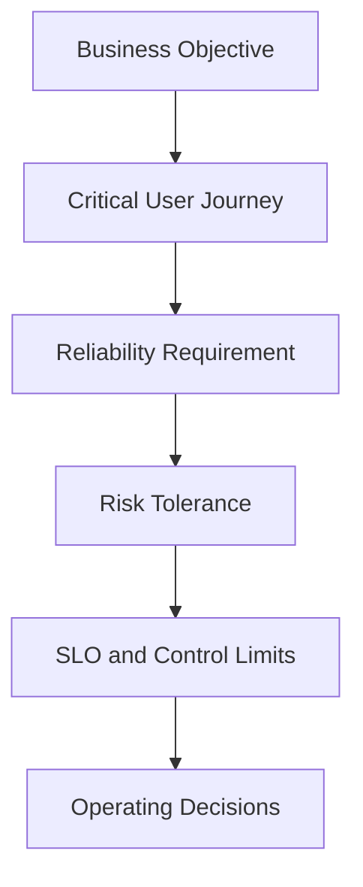

# Risk Tolerance

> Risk tolerance defines the specific amount and type of reliability risk an organization is willing to accept for a service, user journey, decision, or period. In SRE, it turns broad statements about acceptable risk into measurable operating boundaries.

## Chapter Purpose

Every production service operates with risk.

Software contains defects. Dependencies fail. Capacity estimates are uncertain. Changes can cause incidents. Recovery plans can perform differently from expectations. Removing every possible risk is neither technically possible nor economically sensible.

The important question is not whether risk exists. It is:

> Which reliability risks can be tolerated, to what extent, for how long, under which conditions, and by whose authority?

This chapter concentrates on that question.

It builds on the broader treatment of reliability and business risk in [05: Reliability and Business Risk](./05-Reliability-and-Business-Risk.md). It does not repeat the complete business-risk lifecycle. Instead, it explains how an organization converts business intent into concrete reliability boundaries that guide SLOs, error budgets, changes, incidents, capacity, dependencies, recovery, exceptions, and escalation.

---

## Learning Objectives

After completing this chapter, you should be able to:

1. Define risk tolerance in an SRE context.
2. Distinguish risk appetite, risk tolerance, risk capacity, impact tolerance, risk threshold, and risk acceptance.
3. Explain why risk tolerance must be specific, measurable, contextual, time-bounded, and owned.
4. Translate broad business intent into service-level reliability limits.
5. Use SLOs and error budgets as operational expressions of reliability tolerance.
6. Define tolerances for availability, latency, correctness, durability, capacity, dependencies, change, and recovery.
7. Recognize when averages and global targets hide intolerable harm.
8. Define escalation and response when a tolerance is approached or breached.
9. Evaluate temporary exceptions and formal risk acceptance.
10. Document and review a complete reliability risk-tolerance statement.
11. Apply risk tolerance during launches, incidents, migrations, and cost decisions.
12. Assess whether a service's stated tolerance is supported by evidence and capability.

---

## 1. What Risk Tolerance Means

Risk tolerance is the specific amount of variation, exposure, loss, or uncertainty an organization is prepared to accept while pursuing an objective.

For SRE, the objective is usually a dependable service outcome.

Risk tolerance may define acceptable limits for:

- Failed user interactions
- Unavailable minutes
- Excessive latency
- Incorrect results
- Data loss
- Recovery time
- Dependency failure
- Capacity exhaustion
- Change failure
- Operational toil
- Unresolved reliability debt
- Concentrated impact to a user segment

Risk tolerance creates a boundary between acceptable operating variation and conditions that require action or escalation.

---

## 2. Reliability Always Contains Residual Risk

Controls reduce risk but rarely eliminate it.

A service may have:

- Redundant instances
- Tested failover
- Progressive delivery
- Automated rollback
- Multiple dependencies
- Backups
- On-call coverage
- Detailed runbooks

The service can still fail through unknown interactions, common-mode failure, human decisions, extreme demand, malicious action, or control failure.

Residual risk is the risk that remains after controls are applied.

Risk tolerance determines whether that remaining exposure is acceptable.

---

## 3. SRE Manages Risk, Not Perfection

SRE does not treat 100 percent reliability as the automatic objective.

Perfect reliability is usually:

- Impossible to guarantee
- Expensive to approach
- Difficult to measure honestly
- Restrictive to necessary change
- Unnecessary when users cannot perceive the difference

Google's SRE model uses service level objectives and error budgets to make reliability risk explicit. The goal is sufficient reliability for users and the business, with room for controlled change.

---

## 4. The Risk-Tolerance Chain



Each layer should trace to the one before it.

If a target cannot be connected to a user or business objective, it may be an arbitrary technical preference.

---

## 5. Risk Appetite

Risk appetite is the broad amount and type of risk an organization is willing to pursue or retain while achieving its objectives.

Example:

> The organization has low appetite for failures that can cause incorrect financial transactions, but moderate appetite for short delays in noncritical analytics.

Risk appetite is directional. It helps leaders express priorities, but it is usually too broad for an on-call or release decision.

---

## 6. Risk Tolerance

Risk tolerance converts appetite into a specific boundary.

Example:

> No more than 0.05 percent of eligible payment attempts may fail or produce an incorrect result during a rolling 28-day period. No single continuous outage may exceed 15 minutes without executive escalation.

This statement provides measurable limits and escalation conditions.

---

## 7. Risk Capacity

Risk capacity is the maximum amount of harm or exposure the organization can absorb without threatening its essential objectives, legal obligations, solvency, safety, or continued operation.

Capacity is an outer boundary.

An organization may have the capacity to survive a six-hour outage but choose a tolerance of fifteen minutes because customer, contractual, or strategic expectations are stricter.

Risk tolerance should remain within risk capacity.

---

## 8. Impact Tolerance

Impact tolerance defines the maximum acceptable level of disruption to an important service or business outcome.

It may include:

- Maximum duration
- Maximum affected users
- Maximum transaction value
- Maximum data loss
- Maximum backlog
- Maximum geographic scope
- Minimum service that must continue

Impact tolerance is especially useful for operational resilience and severe disruption.

---

## 9. Risk Threshold

A risk threshold is a trigger point for action.

Examples include:

- Error budget has 25 percent remaining
- Capacity utilization exceeds 75 percent of safe limit
- Recovery test exceeds 80 percent of the RTO
- Page volume reaches two pages per engineer per shift
- One dependency causes 20 percent of journey failures

A threshold may be set before the final tolerance boundary so teams have time to act.

---

## 10. Risk Acceptance

Risk acceptance is a decision by an authorized person or group to retain a known risk.

It is not the same as risk tolerance.

- Tolerance establishes a standing boundary.
- Acceptance addresses a particular identified exposure.

Example:

> The launch exceeds the normal dependency-risk tolerance, but the authorized product and risk owners accept the exposure for fourteen days while a tested fallback is completed.

Acceptance should be explicit, documented, time-bounded, and reviewable.

---

## 11. The Six Related Concepts

| Concept | Main question |
| --- | --- |
| Risk appetite | What kinds and general levels of risk are we willing to pursue or retain? |
| Risk tolerance | What specific variation or exposure is acceptable? |
| Risk capacity | What maximum harm can we absorb? |
| Impact tolerance | How much disruption can an important outcome withstand? |
| Risk threshold | At what point must action or escalation begin? |
| Risk acceptance | Who has approved retaining this particular residual risk? |

These concepts should reinforce each other, not compete as terminology.

---

## 12. Tolerance Must Be Contextual

The same failure can have different significance depending on:

- Service
- User journey
- User group
- Time
- Region
- Transaction value
- Data sensitivity
- Available workaround
- Contractual obligation
- Current business event

Ten minutes of delay in a weekly internal report may be acceptable. Ten minutes of delay in emergency dispatch may not be.

One enterprise-wide availability percentage cannot represent every service.

---

## 13. Tolerance Must Be Specific

Weak statement:

> The organization has low tolerance for outages.

Stronger statement:

> The account-authentication journey may consume no more than 0.1 percent bad events in a rolling 28-day window, and no region may experience more than five continuous minutes of complete authentication failure.

A useful statement identifies:

- Scope
- Metric
- Limit
- Window
- Conditions
- Owner
- Response

---

## 14. Tolerance Must Be Measurable

A tolerance that cannot be observed cannot guide operations.

Measurement requires:

- Defined event or time unit
- Good and bad criteria
- Data source
- Measurement point
- Window
- Segmentation
- Data-quality control
- Treatment of unknown outcomes

Measurement limitations should be documented rather than hidden.

---

## 15. Tolerance Must Be Time-Bounded

Risk exposure changes over time.

A tolerance may apply to:

- Rolling 7-day window
- Rolling 28-day window
- Calendar quarter
- Peak sales event
- Launch period
- Migration period
- Declared incident
- Temporary exception period

A monthly target does not automatically control one long outage. Include duration or concentration limits where necessary.

---

## 16. Tolerance Must Have an Owner

Every tolerance needs accountable participants.

| Role | Typical responsibility |
| --- | --- |
| Service owner | Maintains service implementation and response |
| Product owner | Represents user and product priorities |
| SRE | Supplies reliability evidence and engineering analysis |
| Business owner | Evaluates business consequences |
| Risk or compliance owner | Advises on governed obligations |
| Authorized approver | Approves the tolerance or exception |

SRE should not independently accept material business, legal, financial, or safety risk outside its authority.

---

## 17. Tolerance Must Produce Action

A metric without a response rule is only observation.

Define actions when the service is:

- Well within tolerance
- Approaching a threshold
- At the boundary
- Beyond tolerance
- Beyond risk capacity

Possible actions include:

- Continue normal delivery
- Increase monitoring
- Reduce rollout rate
- Pause risky changes
- Prioritize reliability work
- Activate incident response
- Escalate to leadership
- Invoke continuity plans

---

## 18. Tolerance Is Not a Promise of Failure

An error budget or tolerated loss is not a goal to consume.

A 99.9 percent SLO does not instruct a team to create 0.1 percent failure.

It provides:

- A decision boundary
- A way to balance change and reliability
- A basis for risk discussion
- A signal for corrective action

Teams should not manufacture incidents to use unused budget.

---

## 19. Tolerance Is Not Permission to Ignore Harm

A service can be within its global objective while causing unacceptable harm to:

- One region
- One tenant
- One accessibility group
- One payment method
- One high-value transaction class
- One regulated workflow

Risk tolerance must include relevant concentration, segment, duration, correctness, and safety limits.

---

## 20. Start With Critical User Journeys

Risk tolerance should protect the outcomes defined in [10: Critical User Journeys](./10-Critical-User-Journeys.md).

For each CUJ, ask:

- What failure can the user tolerate?
- For how long?
- At what frequency?
- With what degraded alternative?
- How many users may be affected?
- What incorrect or irreversible outcomes are prohibited?
- When must leadership be informed?

The answers become candidate tolerance statements.

---

## 21. Tolerance by Reliability Dimension

Different dimensions need different boundaries.

| Dimension | Example tolerance |
| --- | --- |
| Availability | No more than 0.1 percent bad eligible interactions over 28 days |
| Latency | No more than 1 percent of valid journeys exceed 2 seconds |
| Correctness | No more than 1 incorrect result per 10 million completed transactions |
| Durability | Zero known loss of acknowledged financial records |
| Freshness | No more than 0.5 percent of inventory views exceed 60 seconds of staleness |
| Recovery | Critical journey restored within 30 minutes |
| Capacity | Maintain headroom for forecast peak plus defined failure condition |

One availability target cannot represent every dimension.

---

## 22. Zero Tolerance Statements

Organizations often say they have zero tolerance for:

- Data loss
- Security compromise
- Incorrect payment
- Regulatory breach
- Safety event

This can express a valid policy position, but it does not prove zero technical probability.

A responsible zero-tolerance statement should lead to:

- Strong preventive controls
- Immediate detection
- Emergency response
- Mandatory escalation
- Reconciliation
- Independent verification
- Continuous risk reduction

Do not confuse zero willingness to accept an event with a guarantee that the event cannot occur.

---

## 23. Availability Tolerance

Availability tolerance specifies acceptable failed use.

It can be request-based:

\[
\text{Bad-event fraction} =
\frac{\text{Bad eligible interactions}}
{\text{Total eligible interactions}}
\]

Or time-based:

\[
\text{Unavailable-time fraction} =
\frac{\text{Unavailable eligible time}}
{\text{Total eligible time}}
\]

Choose the method that represents user experience and supports decisions.

---

## 24. Outage-Duration Tolerance

A monthly availability target can allow one concentrated outage.

Example:

> A 99.9 percent 30-day target permits approximately 43 minutes of unavailable time.

Users may not tolerate one 43-minute outage even if the monthly percentage passes.

Add boundaries such as:

- Maximum continuous outage
- Maximum outages per period
- Maximum time to detect
- Maximum time to mitigate
- Escalation after a defined duration

---

## 25. Latency Tolerance

Latency becomes a failure when delay makes the service unusable or harmful.

Define:

- User journey
- Start and stop points
- Threshold
- Allowed bad fraction
- Window
- Relevant percentiles or distribution
- Timeout treatment
- Segment limits

An average can remain acceptable while a meaningful group experiences severe delay.

---

## 26. Correctness Tolerance

Correctness failures can be more serious than unavailability.

Examples include:

- Duplicate charge
- Incorrect balance
- Wrong medical result
- Unauthorized action
- Corrupted configuration
- Misrouted message

Tolerance may be much lower than for ordinary availability failure.

Correctness controls should include reconciliation, invariant checks, audit trails, and immediate escalation for prohibited outcomes.

---

## 27. Durability Tolerance

Durability tolerance defines acceptable loss or unrecoverability of acknowledged data.

Specify:

- Data class
- Meaning of acknowledged
- Maximum record loss
- Maximum time range of loss
- Recovery point objective
- Retention requirement
- Integrity validation
- Escalation conditions

A backup schedule alone does not express durability tolerance.

---

## 28. Freshness Tolerance

For data-driven services, define how stale information may become before it is unreliable.

Example:

> At least 99.5 percent of eligible inventory reads must reflect authoritative updates within 60 seconds. No safety-critical status may be more than 5 seconds stale.

Different fields within one product may require different freshness limits.

---

## 29. Capacity-Risk Tolerance

Capacity tolerance defines how close a service may operate to a condition where expected demand or failure will cause user impact.

It may specify:

- Minimum headroom
- Peak-demand coverage
- Forecast horizon
- Scale-up time
- Quota buffer
- Failure-condition capacity
- Backlog limit
- Saturation threshold

High utilization can be cost-efficient but intolerable when scaling is slow or demand is unpredictable.

---

## 30. Dependency-Risk Tolerance

For every critical dependency, define acceptable exposure to:

- Availability failure
- Excessive latency
- Quota exhaustion
- Breaking change
- Data inconsistency
- Regional concentration
- Vendor lock-in
- Support delay

Possible boundaries include:

- Maximum contribution to journey failures
- Required fallback
- Minimum provider commitment
- Maximum concentration in one provider or region
- Escalation and replacement triggers

Dependency failure remains part of the user outcome.

---

## 31. Third-Party Risk Tolerance

A vendor SLA does not define the organization's complete tolerance.

Compare:

- User requirement
- Internal SLO
- Vendor commitment
- Observed vendor performance
- Integration behavior
- Fallback capability
- Exit time

If the provider's commitment is weaker than the user requirement, the architecture must compensate or the risk must be accepted by the correct authority.

---

## 32. Concentration-Risk Tolerance

Concentration risk occurs when too much critical capability depends on one failure source.

Examples include:

- One region
- One identity provider
- One network path
- One database
- One administrator
- One vendor
- One deployment system
- One encryption-key hierarchy

Define which single failures the organization can tolerate and which require diversification, isolation, fallback, or formal acceptance.

---

## 33. Change-Risk Tolerance

Change tolerance defines how much deployment and configuration risk is acceptable.

Possible measures include:

- Change failure rate
- Failed-user exposure during canary
- Maximum rollout percentage before verification
- Rollback time
- Allowed simultaneous changes
- Maximum error-budget consumption per release
- Prohibited change windows

Change speed should increase or decrease according to evidence and remaining tolerance.

---

## 34. Launch-Risk Tolerance

Before launch, define:

- Acceptable unresolved defects
- Required readiness controls
- Expected initial load
- Allowed support volume
- Rollback conditions
- Maximum user exposure
- Required error-budget reserve
- Temporary limitations
- Decision authority

A fixed launch date does not change the underlying risk.

---

## 35. Experiment-Risk Tolerance

Experiments create controlled uncertainty.

Set limits for:

- Eligible users
- Traffic percentage
- Duration
- Data exposure
- Performance regression
- Error-budget consumption
- Automatic stop conditions
- Recovery

Higher-risk experiments should use smaller blast radius and stronger observation.

---

## 36. Migration-Risk Tolerance

Migrations can create dual-system complexity, data divergence, extended change windows, and rollback difficulty.

Define tolerances for:

- Data mismatch
- Replication lag
- Failed migration units
- Dual-write inconsistency
- User interruption
- Cutover duration
- Rollback time
- Reconciliation backlog

Migration success should be measured at the user and data outcome, not only resource completion.

---

## 37. Recovery-Time Tolerance

Recovery time objective, or RTO, can express part of disruption tolerance.

It should identify:

- Service or journey
- Disruption start point
- Recovery end point
- Maximum target time
- Minimum acceptable degraded service
- Escalation thresholds
- Verification method

Recovery is not complete merely because infrastructure is running.

---

## 38. Data-Loss Tolerance

Recovery point objective, or RPO, expresses the maximum targeted period of data loss after disruption.

An RPO must be interpreted with:

- Data criticality
- Transaction semantics
- Replication behavior
- Backup frequency
- Restore capability
- Reconciliation
- Legal obligations

An RPO of five minutes does not mean every five-minute loss is automatically acceptable. The specific data and consequence still matter.

---

## 39. Backlog Tolerance

Asynchronous services may remain available while work accumulates.

Define limits for:

- Oldest item age
- Queue depth
- Completion delay
- Drain time
- Retry volume
- Expired work
- Lost or duplicate work

Backlog thresholds should account for whether the system can recover before the user's useful deadline.

---

## 40. Security-Related Reliability Tolerance

Security and reliability risks interact.

Examples include:

- Credential compromise removes administrative control
- Defensive rate limiting blocks legitimate users
- Certificate expiry causes an outage
- Ransomware destroys recovery capability
- Emergency access bypasses normal controls

Define both:

- Maximum tolerated service impact from security controls
- Maximum tolerated security exposure during reliability response

Neither concern automatically overrides the other without context and authority.

---

## 41. Human and Operational Tolerance

Risk tolerance should include conditions imposed on operators.

Possible limits include:

- Pages per shift
- Consecutive on-call hours
- Manual interventions per week
- Maximum emergency-access duration
- Maximum unsupported services per responder
- Maximum unresolved high-severity actions
- Toil percentage

An operating model that depends on exhaustion or heroics is not reliable.

---

## 42. SLOs as Reliability Boundaries

A service level objective defines a target for a measured service behavior over a period.

Example:

> At least 99.95 percent of eligible checkout attempts will create exactly one durable order and return confirmation within 10 seconds over a rolling 28-day window.

This SLO operationalizes a reliability tolerance for a Critical User Journey.

The SLO should reflect user and business needs, not merely historical performance.

---

## 43. Error Budgets as Operational Tolerance

If the SLO target is below 100 percent:

\[
\text{Error budget} = 1 - \text{SLO target}
\]

For a 99.95 percent target:

\[
1 - 0.9995 = 0.0005 = 0.05\%
\]

The error budget is the permitted bad-event fraction within the SLO definition and window.

It provides a measurable boundary for operating decisions.

---

## 44. Error Budget Is Not the Entire Risk Tolerance

An error budget may not capture:

- One catastrophic event
- Incorrect high-value transaction
- Harm to a small user segment
- Security breach
- Regulatory failure
- Data loss
- One continuous outage
- Recovery failure
- Rare emergency journey

Use additional limits for severity, concentration, duration, correctness, durability, and impact.

---

## 45. Burn Rate

Burn rate describes how quickly the service is consuming its error budget.

\[
\text{Burn rate} =
\frac{\text{Observed bad-event rate}}
{\text{Allowed bad-event rate}}
\]

Interpretation:

- Burn rate below 1 means consumption is slower than the average allowed rate.
- Burn rate of 1 consumes the budget exactly across the window.
- Burn rate above 1 consumes the budget faster than sustainable.

High burn rate can require action before the budget is exhausted.

---

## 46. Error-Budget Policy

An error-budget policy defines what happens as tolerance is consumed.

It should include:

- Scope
- SLO source
- Calculation
- Owners
- Reviewers and approvers
- Thresholds
- Required actions
- Exceptions
- Escalation
- Review date

Possible actions include slowing releases, pausing risky changes, prioritizing reliability work, or escalating disagreement.

---

## 47. Example Tiered Policy

| Budget state | Example response |
| --- | --- |
| More than 50 percent remaining | Normal delivery with standard controls |
| 25 to 50 percent remaining | Review trends and high-risk changes |
| 10 to 25 percent remaining | Reduce rollout exposure and prioritize known reliability risks |
| Less than 10 percent remaining | Require explicit approval for risky changes |
| Exhausted | Apply agreed change restrictions and reliability plan |
| Severe impact limit breached | Activate incident and executive escalation regardless of remaining budget |

The exact thresholds should reflect the service and organization.

---

## 48. Fast and Slow Consumption

Two services can consume the same error budget differently.

### Fast burn

A release causes immediate widespread failure.

### Slow burn

A small defect harms a subset of requests for several weeks.

Both matter.

Use multiple windows and burn-rate thresholds to detect rapid incidents and persistent degradation.

---

## 49. Segment Tolerance

Global SLOs can hide concentrated harm.

Consider separate limits for:

- Region
- Tenant
- Customer tier
- Client version
- Device type
- Accessibility path
- Payment method
- Regulated transaction

Segment only when there is meaningful user, contractual, or architectural difference. Too many segments create noise and maintenance burden.

---

## 50. Peak-Period Tolerance

Business impact may change during:

- Major sales
- Payroll processing
- Tax deadlines
- Market hours
- Elections
- Emergency events
- Product launches

Possible temporary controls include:

- Stricter change limits
- Higher capacity reserve
- More on-call coverage
- Faster escalation
- Additional synthetic tests
- Reduced experiment exposure

Do not change tolerance informally. Record the period, rationale, authority, and exit condition.

---

## 51. Degraded-Service Tolerance

A degraded mode preserves essential outcomes while reducing optional behavior.

Define:

- Minimum service
- Maximum degradation duration
- Affected users
- Data behavior
- Communication
- Activation authority
- Exit criteria
- Reconciliation

Example:

> During recommendation-service failure, product discovery may operate without personalization for up to four hours, but checkout and account security must remain unaffected.

---

## 52. Risk-Tolerance Statement Template

A complete statement can use this structure:

> For [service or CUJ], [eligible population] may experience no more than [type and amount of failure] during [window or condition]. No [concentration, duration, correctness, data, safety, or security limit] may be exceeded. At [warning threshold], [owner] must [action]. At breach, [authority] must [escalation or decision]. The statement will be reviewed on [date or trigger].

This structure connects measurement, ownership, action, and governance.

---

## 53. Example Availability Statement

> During a rolling 28-day window, no more than 0.1 percent of eligible authentication attempts may fail because of the service. No region may experience more than five continuous minutes of complete authentication failure. At 25 percent remaining error budget, the identity owner reviews planned high-risk changes. A duration breach triggers incident escalation regardless of the global SLO.

---

## 54. Example Correctness Statement

> No known completed transfer may debit one account without applying the corresponding authorized credit or safe reversal. Any detected mismatch triggers immediate transaction containment, reconciliation, incident response, and notification to the authorized business-risk owner.

This uses a zero-acceptance policy for a known correctness outcome while acknowledging the need for detection and response.

---

## 55. Example Recovery Statement

> Following loss of the primary region, the payment-authorization journey must resume at the approved degraded capacity within 30 minutes. No more than five minutes of acknowledged transaction data may require reconstruction. Failure to reach the 20-minute recovery checkpoint requires executive escalation.

This separates final tolerance from an earlier action threshold.

---

## 56. Evidence for Setting Tolerance

Use:

- User research
- Support cases
- Contractual obligations
- Business impact analysis
- Incident history
- SLO history
- Dependency performance
- Recovery tests
- Load tests
- Capacity forecasts
- Security and compliance requirements
- Cost analysis
- Executive priorities

Where evidence is weak, document assumptions and use a temporary starter tolerance with an early review.

---

## 57. Historical Performance Is Not Automatically Tolerance

A service that delivered 98 percent availability last year does not prove that 98 percent is acceptable.

Historical performance shows what happened.

Risk tolerance states what may be accepted.

The gap between them identifies required improvement, changed expectations, reduced scope, or formal risk acceptance.

---

## 58. Contractual Commitments Are Not the Entire Tolerance

An SLA may define compensation or formal obligation after failure.

Internal tolerance may need to be stricter because:

- Credits do not restore user trust
- Business loss begins before the SLA threshold
- Safety or compliance consequences differ
- The SLA uses broad aggregation
- Dependency targets require internal margin

SLOs and internal risk thresholds should provide room before contractual breach.

---

## 59. Dependency Budgeting

An end-to-end journey depends on several components.

For a simple serial path with independent required components:

\[
A_{journey} \approx A_1 \times A_2 \times \dots \times A_n
\]

Component targets should support the journey target with margin for:

- Shared failure
- Measurement error
- Client failure
- Network failure
- Changes
- Recovery delay

Do not allocate the entire journey tolerance independently to every component.

---

## 60. Tolerance and Architecture

Architecture must be capable of meeting the chosen boundary.

Strict tolerance may require:

- Failure-domain isolation
- Redundancy
- Capacity headroom
- Safe retry and idempotency
- Graceful degradation
- Data reconciliation
- Fast rollback
- Independent recovery copies
- Tested fallback

If the architecture cannot support the tolerance, change the design, change the service commitment, or obtain authorized acceptance of the gap.

---

## 61. Tolerance and Cost

Lower risk often costs more through:

- Redundancy
- Excess capacity
- Engineering effort
- Testing
- Operational coverage
- Vendor commitments
- Recovery environments

Cost reduction can increase risk.

Decision makers should compare:

- Cost saved
- Risk introduced
- Users affected
- Expected frequency
- Worst credible consequence
- Reversibility

The cheapest design is not automatically within tolerance.

---

## 62. Tolerance and Innovation

Risk tolerance creates space for controlled change.

When a service is comfortably within its objectives, the organization may take measured delivery risk.

When tolerance is nearly consumed, the same change may be inappropriate.

This is why error budgets help product and reliability teams make decisions using shared evidence instead of arguing from fixed positions.

---

## 63. Tolerance During Incidents

During an incident, tolerance helps determine:

- Severity
- Escalation
- Response urgency
- Acceptable degraded mode
- Communication frequency
- Recovery order
- Authority required
- Whether risky mitigation is justified

The remaining monthly error budget should not delay response to a severe duration, correctness, security, data, or safety breach.

---

## 64. Breach Does Not Always Mean Failure of Governance

A breach may occur despite reasonable controls because production contains uncertainty.

Governance quality depends on whether the organization:

- Detected the breach
- Responded as agreed
- Escalated correctly
- Limited harm
- Recovered safely
- Learned from the event
- Reassessed controls and tolerance

Hiding or redefining the metric after breach is a governance failure.

---

## 65. Breach Response

When tolerance is breached:

1. Confirm data quality and scope.
2. Protect users and restore critical service.
3. Notify accountable owners.
4. Apply the predefined policy.
5. Record exceptions and decisions.
6. Identify immediate risk reduction.
7. Analyze causes and control performance.
8. Create owned corrective actions.
9. Reassess the tolerance if evidence shows it is wrong.
10. Verify return within the boundary.

---

## 66. Formal Risk Acceptance

Formal acceptance should record:

- Risk statement
- Affected service and users
- Current exposure
- Evidence
- Existing controls
- Residual risk
- Reason for acceptance
- Alternatives considered
- Accepting authority
- Start date
- Expiry date
- Monitoring
- Escalation conditions
- Remediation owner

Acceptance without an owner or expiry becomes unmanaged risk.

---

## 67. Temporary Exceptions

A temporary exception may be appropriate when:

- Remediation is underway
- A time-limited launch creates justified exposure
- A dependency is being replaced
- Immediate mitigation creates more risk
- A migration temporarily reduces redundancy

Require:

- Narrow scope
- Short duration
- Compensating controls
- Increased monitoring
- Clear rollback or containment
- Named approver
- Automatic expiry

---

## 68. Exception Expiry

At expiry, the organization must:

- Close the exception because remediation is verified
- Renew it through a new authorized decision
- Reduce service scope
- Add compensating controls
- Stop the risky activity
- Escalate the unresolved exposure

Do not allow a ticket to remain open indefinitely as a substitute for a decision.

---

## 69. Risk Acceptance Cannot Transfer Accountability

An executive may accept a known risk, but the service team still owns:

- Monitoring
- Incident response
- Compensating controls
- Corrective work assigned to it
- Evidence updates
- Escalation when conditions change

Acceptance does not make the risk disappear or absolve teams from agreed responsibilities.

---

## 70. Review and Recalibration

Review tolerance when:

- User expectations change
- Business criticality changes
- Usage grows
- A major incident occurs
- Architecture changes
- A dependency changes
- Regulation or contracts change
- Measurement improves
- Recovery testing contradicts assumptions
- Cost or capacity changes materially
- An exception expires

Risk tolerance is controlled and revisable, not permanent.

---

## 71. Risk-Tolerance Record

```yaml
risk_tolerance:
  service: payment-authorization
  critical_user_journey: complete-payment
  owner: payments-runtime
  approver: payments-business-owner

  availability:
    sli: successful-eligible-payments / eligible-payments
    target: 99.95-percent
    window: rolling-28-days

  concentration_limits:
    maximum_continuous_outage: 15m
    maximum_regional_failure: 5m

  correctness:
    prohibited_outcome: acknowledged-payment-without-record

  thresholds:
    warning: 25-percent-error-budget-remaining
    critical: 10-percent-error-budget-remaining

  breach_action:
    - activate-incident-response
    - apply-error-budget-policy
    - notify-business-owner

  governance:
    approved: 2026-09-13
    next_review: 2026-12-13
```

Use references rather than sensitive details. Never place secrets or unnecessary personal information in the record.

---

## 72. Risk-Tolerance Dashboard

A useful dashboard may show:

- Current SLO performance
- Error budget remaining
- Burn rates
- Continuous outage duration
- Segment performance
- Correctness events
- Data-loss indicators
- Recovery-test results
- Capacity threshold
- Dependency contribution
- Active exceptions
- Upcoming review dates

The dashboard should make decisions easier, not merely display more metrics.

---

## 73. Risk-Tolerance Indicators

Use both leading and lagging indicators.

### Leading indicators

- Declining capacity headroom
- Increasing rollback time
- Growing dependency latency
- Rising page volume
- Overdue recovery tests
- Unpatched critical dependency
- Expiring exception

### Lagging indicators

- SLO breach
- Incident impact
- Data loss
- Failed recovery
- Contractual breach
- User complaints

Leading indicators provide time to act before tolerance is exceeded.

---

## 74. Reporting to Leadership

Report:

- Service and user outcome
- Current position relative to tolerance
- Trend
- Material breaches
- Concentrated harm
- Active exceptions
- Main risk drivers
- Controls and their evidence
- Decision required
- Consequence of delay

Avoid reporting only uptime percentages without business or user context.

---

## 75. Risk-Tolerance Anti-Patterns

### One Target for Every Service

Different services and journeys have different consequences.

### Historical Performance Becomes the Target

The organization labels current weakness acceptable without a decision.

### Error Budget Covers Every Harm

Severe correctness, security, data, or segment failures are hidden inside an aggregate ratio.

### Zero Tolerance Without Controls

Leadership declares zero tolerance but funds no prevention, detection, response, or recovery.

### Acceptance by the Wrong Person

An engineer accepts financial, legal, or business risk without authority.

### Permanent Temporary Exception

The exception has no effective expiry or remediation.

### Breach Changes the Definition

The denominator, exclusion, or target is altered to avoid acknowledging failure.

### Vendor SLA Equals Internal Tolerance

Provider compensation terms replace user and business requirements.

### Global Average Hides a Segment

The total passes while one group suffers intolerable harm.

### Tolerance Without Action

The boundary is measured, but no response occurs when it is approached or crossed.

---

## 76. Scenario 1: SLO Passes, One Region Fails

Global checkout success is 99.96 percent against a 99.95 percent objective. One small region experiences 25 percent failure for three hours.

### Problem

The global SLO passes, but concentrated regional harm exceeds a reasonable segment or duration tolerance.

### Required response

- Treat the regional impact as an incident
- Add segment and duration limits
- Review regional dependency risk
- Determine whether the global SLO needs supporting thresholds
- Reconcile affected transactions

---

## 77. Scenario 2: Error Budget Is Exhausted Before Launch

A service has no remaining error budget, but a major feature launch is scheduled.

### Decision

Use the approved error-budget policy.

Evaluate:

- Launch necessity
- User and business value
- Additional risk
- Rollback capability
- Exposure size
- Existing incident causes
- Authorized exception path

The schedule alone does not justify ignoring the agreed boundary.

---

## 78. Scenario 3: Vendor SLA Is Too Weak

A critical service needs 99.95 percent journey success. Its required vendor promises only 99.9 percent availability and has caused repeated failures.

### Required response

- Measure actual vendor contribution
- Evaluate fallback or multi-provider design
- Renegotiate the service commitment
- Reduce dependency criticality
- Seek formal acceptance if the gap remains
- Define exit triggers

---

## 79. Scenario 4: Cost Reduction Removes Recovery Capacity

Leadership proposes removing the warm recovery environment to reduce cost.

### Risk-tolerance analysis

Determine:

- New achievable RTO and RPO
- Critical journeys affected
- Expected recovery capacity
- Reconstruction uncertainty
- Cost saved
- Potential business harm
- Authority required

Do not approve the change solely from infrastructure savings.

---

## 80. Scenario 5: Temporary Migration Exception

A database migration requires twelve hours of reduced redundancy.

### Required controls

- Time-bounded acceptance
- Approved maintenance window
- Current tested backup
- Rollback criteria
- Increased monitoring
- Reduced unrelated change
- Named decision authority
- Immediate expiry after verification

The exception applies only to the defined migration conditions.

---

## 81. Scenario 6: Zero Data-Loss Claim

A team states that the service has zero tolerance for data loss, but backups have not been restored in a year.

### Problem

The policy statement lacks evidence.

### Required response

- Define acknowledged data
- Identify loss scenarios
- Test restoration
- Validate encryption keys and access
- Measure achieved RPO
- Add reconciliation
- Escalate the gap between stated tolerance and demonstrated capability

---

## 82. Practical Exercise 1: Translate Appetite Into Tolerance

Start with this appetite statement:

> The organization has low appetite for failures that prevent customers from accessing funds.

Create measurable tolerances for:

- Availability
- Maximum outage duration
- Correctness
- Data loss
- Recovery time
- Regional concentration
- Escalation

Identify the required approvers.

---

## 83. Practical Exercise 2: Evaluate an SLO

Review this objective:

> The service will be available 99.9 percent of every month.

Identify what is missing about:

- User journey
- Eligible events
- Correctness
- Latency
- Duration
- Segments
- Dependencies
- Data source
- Owner
- Response policy

Rewrite it as a stronger tolerance statement.

---

## 84. Practical Exercise 3: Build an Error-Budget Policy

Define:

- SLO
- Budget calculation
- Warning threshold
- Critical threshold
- Fast-burn response
- Slow-burn response
- Change restrictions
- Exception authority
- Disagreement escalation
- Review cadence

Explain how the policy protects users without preventing all change.

---

## 85. Practical Exercise 4: Assess a Dependency

For one critical dependency, compare:

- Journey requirement
- Internal tolerance
- Dependency objective or SLA
- Observed performance
- Failure correlation
- Fallback
- Recovery
- Exit time

State whether the residual dependency risk is within tolerance.

---

## 86. Practical Exercise 5: Review a Risk Acceptance

Use a real or hypothetical accepted risk.

Check:

- Clear risk statement
- Evidence
- Correct accepting authority
- Affected users
- Duration
- Compensating controls
- Monitoring
- Breach triggers
- Remediation owner
- Expiry

Reject or rewrite any acceptance that cannot be governed.

---

## 87. Practical Exercise 6: Run a Tolerance-Breach Tabletop

Scenario:

> A slow dependency consumes 70 percent of the monthly error budget in four hours. Global success remains above the SLO, but one customer segment has crossed its duration limit.

Determine:

- Incident severity
- Immediate mitigation
- Policy action
- Change restrictions
- Required escalation
- User communication
- Dependency response
- Recovery verification
- Post-incident review

---

## 88. Risk-Tolerance Checklist

### Scope and Context

- [ ] The service or CUJ is named.
- [ ] Users and criticality are defined.
- [ ] Business, safety, security, legal, and contractual context is understood.
- [ ] The tolerance remains within organizational risk capacity.

### Definition

- [ ] The risk type is explicit.
- [ ] The limit is measurable.
- [ ] The time window is defined.
- [ ] Preconditions and exclusions are documented.
- [ ] Unknown outcomes are visible.
- [ ] Duration and concentration limits are included where needed.

### Reliability Dimensions

- [ ] Availability is addressed.
- [ ] Latency is addressed where time matters.
- [ ] Correctness is addressed.
- [ ] Durability and data loss are addressed.
- [ ] Capacity and backlog are addressed.
- [ ] Dependencies are addressed.
- [ ] Recovery time and recovery point are addressed.

### Ownership and Action

- [ ] The service owner is named.
- [ ] The approver has appropriate authority.
- [ ] Warning thresholds exist.
- [ ] Breach actions are predefined.
- [ ] Escalation is clear.
- [ ] The error-budget policy is approved.

### Exceptions and Review

- [ ] Accepted risks have evidence.
- [ ] Exceptions are narrow and time-bounded.
- [ ] Compensating controls exist.
- [ ] Expiry produces a required decision.
- [ ] Review dates and triggers are defined.
- [ ] Changes in context cause recalibration.

---

## 89. Reflection Questions

1. Which reliability risks does your organization claim to have low tolerance for?
2. Are those claims supported by engineering controls and evidence?
3. Which current SLOs reflect user needs, and which reflect historical performance?
4. Could a service pass its global SLO while causing unacceptable concentrated harm?
5. Which severe event is not represented by the error budget?
6. Who has authority to accept residual risk for each critical service?
7. Which temporary exceptions have become permanent?
8. Which dependency has a weaker commitment than the journey it supports?
9. What happens before a tolerance is breached?
10. Which recovery objective has not been demonstrated by testing?

---

## 90. Knowledge Check

### 1. What is risk tolerance?

The specific amount and type of risk an organization is prepared to accept for a defined objective, scope, and period.

### 2. How is risk appetite different?

Risk appetite provides broad direction. Risk tolerance converts that direction into specific operating boundaries.

### 3. What is risk capacity?

The maximum harm or exposure the organization can absorb without threatening essential objectives or continued operation.

### 4. What is a risk threshold?

A trigger point at which a predefined action or escalation begins, often before the final tolerance is exceeded.

### 5. Is an error budget the complete reliability tolerance?

No. It may not represent severe correctness, data, security, duration, concentration, safety, or rare-event risks.

### 6. Why is historical performance not automatically a tolerance?

History describes what happened. Tolerance is an authorized statement of what is acceptable.

### 7. Can a service pass its global SLO and still breach tolerance?

Yes. One region, user group, transaction class, or continuous outage may exceed a supporting limit.

### 8. Who should accept material business risk?

The person or group with formal authority for the affected business consequence, supported by technical evidence from SRE and service owners.

### 9. What makes a temporary exception safe enough to consider?

Narrow scope, short duration, compensating controls, monitoring, clear ownership, authorized approval, and automatic expiry.

### 10. What should happen when tolerance is breached?

Protect users, confirm evidence, activate the agreed policy, escalate, reduce risk, create corrective actions, and verify return within the boundary.

### 11. Why can zero tolerance be misleading?

It may express zero willingness to accept an event but cannot prove zero probability. It must be backed by strong prevention, detection, response, recovery, and escalation.

### 12. When should tolerance be reviewed?

At scheduled intervals and after meaningful changes in users, criticality, architecture, dependencies, incidents, regulation, measurement, capacity, cost, or recovery evidence.

---

## 91. Completion Checklist

You have completed this chapter when you can:

- [ ] Distinguish appetite, tolerance, capacity, impact tolerance, threshold, and acceptance.
- [ ] Translate a Critical User Journey into reliability limits.
- [ ] Explain how SLOs and error budgets operationalize tolerance.
- [ ] Identify severe risks not captured by an aggregate SLO.
- [ ] Define duration, segment, correctness, data, dependency, and recovery limits.
- [ ] Write an actionable risk-tolerance statement.
- [ ] Design warning and breach responses.
- [ ] Evaluate formal risk acceptance and temporary exceptions.
- [ ] Assess whether architecture can meet a stated tolerance.
- [ ] Review tolerance using production evidence.

---

## 92. Key Takeaways

- Production risk cannot be removed completely.
- Risk tolerance makes acceptable reliability risk specific and actionable.
- Risk appetite is broad, tolerance is specific, capacity is the outer limit, and acceptance addresses one known exposure.
- Tolerance must identify scope, metric, limit, window, owner, threshold, and response.
- Critical User Journeys provide the correct starting point.
- SLOs and error budgets are important operational expressions of tolerance.
- An error budget cannot represent every severe, concentrated, or irreversible harm.
- Availability, latency, correctness, durability, capacity, dependencies, changes, and recovery may need separate limits.
- Global success must not hide intolerable harm to smaller groups.
- Formal acceptance requires correct authority, evidence, controls, ownership, and expiry.
- Tolerance breaches should activate agreed action, not metric redefinition.
- Tolerance must change when user, business, architecture, dependency, and recovery evidence changes.

---

## 93. Authoritative Resources

### SRE Risk and Reliability Decisions

- [Google SRE Book: Embracing Risk](https://sre.google/sre-book/embracing-risk/)
- [Google SRE Book: Service Level Objectives](https://sre.google/sre-book/service-level-objectives/)
- [Google SRE Workbook: Implementing SLOs](https://sre.google/workbook/implementing-slos/)
- [Google SRE Workbook: Example Error Budget Policy](https://sre.google/workbook/error-budget-policy/)
- [Google SRE Workbook: Alerting on SLOs](https://sre.google/workbook/alerting-on-slos/)

### Risk Concepts and Reliability Guidance

- [NIST IR 8286: Integrating Cybersecurity and Enterprise Risk Management](https://csrc.nist.gov/pubs/ir/8286/final)
- [NIST Enterprise Risk Management Quick-Start Guides](https://www.nist.gov/cyberframework/resources/quick-start-guides)
- [Google Cloud Well-Architected Framework: Reliability](https://cloud.google.com/architecture/framework/reliability)

### Source Interpretation

The NIST materials provide enterprise and cybersecurity risk-management context. Google SRE materials provide reliability-engineering practices. SRE World uses these sources to build a practical service-level risk-tolerance model. Organizations should also apply their legal, regulatory, contractual, safety, and governance requirements.

---

## 94. Related SRE World Sections

- [The SRE Mindset](./03-The-SRE-Mindset.md)
- [Reliability as a Product Feature](./04-Reliability-as-a-Product-Feature.md)
- [Reliability and Business Risk](./05-Reliability-and-Business-Risk.md)
- [Reliability, Availability, Resilience, and Durability](./06-Reliability-Availability-Resilience-and-Durability.md)
- [Fault Tolerance and Disaster Recovery](./07-Fault-Tolerance-and-Disaster-Recovery.md)
- [Production Responsibility](./08-Production-Responsibility.md)
- [Service Ownership](./09-Service-Ownership.md)
- [Critical User Journeys](./10-Critical-User-Journeys.md)
- [SRE Foundations](./README.md)
- [Service Level Engineering](../03-Service-Level-Engineering/)
- [Error Budgets](../04-Error-Budgets/)
- [Reliability Risk Engineering](../18-Reliability-Risk-Engineering/)

---

## Next Chapter

[12: Engineering Work and Operational Work](./12-Engineering-Work-and-Operational-Work.md)

---

## Maintained by VERIQTA

SRE World is created and maintained by [VERIQTA](https://github.com/veriqta).

- Website: [veriqta.com](https://www.veriqta.com/)
- GitHub: [github.com/veriqta](https://github.com/veriqta)
- Instagram: [@veriqta](https://www.instagram.com/veriqta/)
- Medium: [veriqta.medium.com](https://veriqta.medium.com/)

> Risk tolerance is useful only when it changes a real decision before user harm becomes unacceptable.
