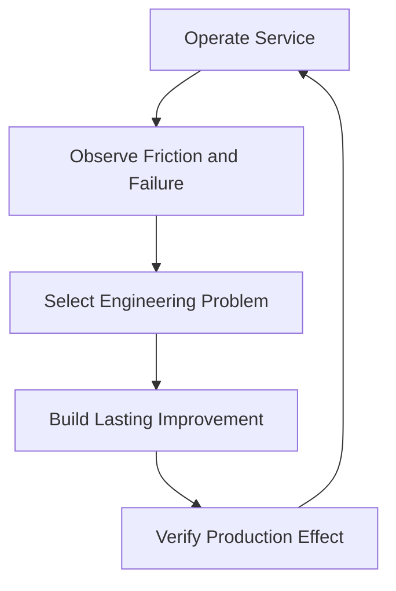
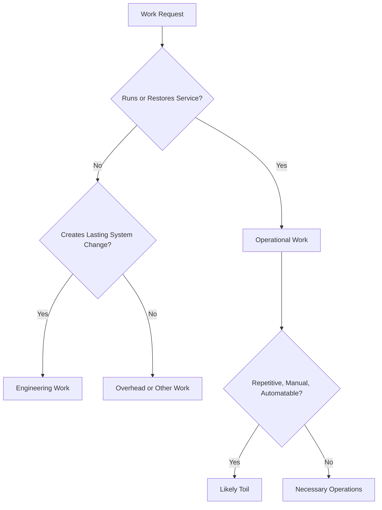
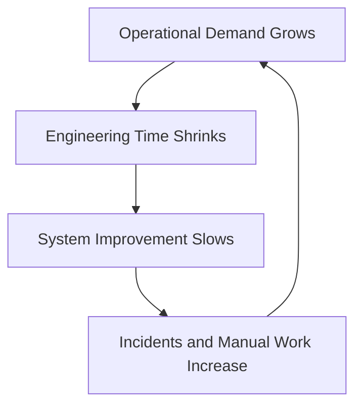

# Engineering Work and Operational Work

> SRE depends on a deliberate balance between operating today's service and engineering a better service for tomorrow. Operational work keeps production functioning. Engineering work changes the system so that reliability, scale, safety, and human sustainability improve over time.

## Chapter Purpose

SRE teams must respond to incidents, review changes, support launches, maintain systems, and help users. They must also design software, remove recurring work, improve architecture, build automation, strengthen recovery, and reduce future risk.

Both categories matter.

The danger appears when immediate operational demand consumes the time needed for lasting engineering improvement. The team remains busy, but the service does not become easier or safer to operate. More services and traffic then create more manual work, which requires more people, creates more coordination, and further reduces engineering capacity.

This chapter explains:

- What engineering work means in SRE
- What operational work means
- How operational work differs from toil
- Why necessary operations should not be dismissed
- How reactive and proactive work interact
- How to classify ambiguous work
- How to measure work without rewarding inaccurate reporting
- How to protect engineering capacity
- How to convert recurring operational demand into durable improvement
- How workload should influence service ownership and SRE engagement

The next chapter, [13: Toil](./13-Toil.md), examines toil in depth. This chapter establishes the broader work model in which toil exists.

---

## Learning Objectives

After completing this chapter, you should be able to:

1. Define engineering work and operational work in an SRE context.
2. Distinguish operational work, toil, overhead, maintenance, project work, and interrupts.
3. Explain why operational work is necessary but must not consume all team capacity.
4. Classify work by outcome and characteristics rather than ticket label.
5. Identify engineering work that reduces future operational demand.
6. Explain the feedback value of on-call and incident participation.
7. Measure work allocation without creating a reporting exercise.
8. Identify operational overload and its consequences.
9. Protect planned engineering time through explicit workload policies.
10. Design a process for converting recurring operations into engineering improvements.
11. Evaluate whether an SRE engagement still contains sufficient engineering value.
12. Build a sustainable work portfolio for a service or SRE team.

---

## 1. The Two Essential Responsibilities

SRE has two connected responsibilities:

1. Operate the service effectively now.
2. Engineer the service and operating model to improve future outcomes.

Operational work supplies direct production knowledge. Engineering work uses that knowledge to create lasting change.

Neither responsibility is complete alone.

- Operations without engineering produces repeated reaction.
- Engineering without operational feedback can solve imagined problems while real failure continues.

---

## 2. The SRE Work Loop



The loop makes operations an input to engineering rather than a permanent destination.

---

## 3. What Engineering Work Means

Engineering work applies analysis, design, experimentation, software, systems knowledge, and verification to create a lasting improvement.

It changes one or more of the following:

- Service behavior
- Architecture
- Automation
- Failure containment
- Observability
- Capacity
- Recovery
- Change safety
- Security
- Operational effort
- Decision quality

Engineering work should produce an outcome that remains after the immediate task ends.

---

## 4. Examples of SRE Engineering Work

Examples include:

- Designing graceful degradation
- Removing a single point of failure
- Building automatic remediation with safe limits
- Improving deployment rollback
- Creating capacity models
- Redesigning an unreliable dependency path
- Building an SLO measurement pipeline
- Eliminating false-positive alerts
- Automating service provisioning
- Improving backup verification
- Creating load-shedding mechanisms
- Reducing configuration risk
- Adding reconciliation for partial transactions
- Improving incident-detection coverage
- Simplifying a fragile system

The use of code is common, but code alone does not determine whether work is engineering.

---

## 5. What Operational Work Means

Operational work is activity required to run, support, control, and restore a production service.

It includes:

- Monitoring service behavior
- Responding to incidents
- Executing controlled changes
- Supporting launches
- Managing capacity
- Handling production access
- Performing recovery
- Coordinating with dependencies
- Reviewing operational risk
- Communicating service impact
- Completing required maintenance

Operational work can be manual or automated, planned or reactive, high-value or low-value.

---

## 6. Examples of Necessary Operational Work

Examples include:

- Incident command during a major outage
- Investigating a new failure mode
- Executing a rare disaster-recovery procedure
- Coordinating emergency capacity
- Reviewing a high-risk launch
- Rotating a sensitive credential under controlled procedure
- Validating a restored database
- Communicating current user impact
- Handling an exceptional dependency escalation
- Performing legally required operational verification

These activities may require judgment and provide important learning. They should not automatically be classified as toil.

---

## 7. Operational Work Is Not Automatically Toil

Operational work is the broad category. Toil is a harmful subset with particular characteristics.

Toil is commonly:

- Manual
- Repetitive
- Automatable
- Tactical
- Without enduring value
- Proportional to service growth

An unfamiliar incident investigation may be operational work without being toil. Repeating the same manual restart every day is likely toil.

---

## 8. Work Categories Compared

| Category | Primary purpose | Enduring effect | Example |
| --- | --- | --- | --- |
| Engineering work | Improve the system or operating model | Expected | Build safe automatic failover |
| Operational work | Run or restore the service | May or may not persist | Coordinate an incident |
| Toil | Perform repetitive tactical operations | Little or none | Manually restart the same failed job |
| Maintenance | Preserve supported condition | Usually preserves rather than expands | Apply a required database upgrade |
| Overhead | Enable organizational coordination | Indirect | Required planning or administration |
| Project work | Deliver a bounded outcome | Usually persists | Migrate a service to a safer architecture |
| Interrupt | Unplanned demand that breaks planned work | Varies | Urgent production escalation |

These categories can overlap. Classification should support decisions, not create artificial precision.

---

## 9. Maintenance Work

Maintenance preserves a service's supported, secure, and operable state.

Examples include:

- Applying security patches
- Upgrading dependencies
- Renewing certificates
- Replacing unsupported runtime versions
- Testing backups
- Reviewing access
- Refreshing documentation

Maintenance may be engineering work, operational work, or toil depending on how it is performed and what it changes.

---

## 10. Project Work

Project work has a defined outcome and temporary delivery structure.

Examples include:

- Regional expansion
- Service migration
- New SLO implementation
- Incident-management redesign
- Recovery architecture improvement
- Retirement of a legacy system

A project can contain both engineering and operational tasks. The word project does not prove engineering value.

---

## 11. Overhead

Overhead supports the organization rather than directly operating or improving one service.

Examples include:

- Team planning
- Hiring
- Training administration
- Budget preparation
- Required reporting
- General meetings

Some overhead is necessary. Excessive overhead reduces both operational and engineering capacity.

Measure it when it materially limits the team's mission.

---

## 12. Interrupt Work

Interrupts are unplanned demands that require attention outside the planned work sequence.

Examples include:

- Pages
- Production escalations
- Urgent support requests
- Dependency incidents
- Security events
- Emergency launch reviews

Interrupts impose more cost than their visible duration because engineers must stop, switch context, investigate, recover concentration, and restart planned work.

---

## 13. Reactive and Proactive Work

Reactive work responds to a present condition.

Proactive work reduces future likelihood or impact.

| Reactive | Proactive |
| --- | --- |
| Mitigate current outage | Remove recurring failure mode |
| Add emergency capacity | Build capacity forecasting and scaling |
| Revoke compromised access | Redesign credential controls |
| Roll back failed release | Improve canary and rollback automation |
| Drain current backlog | Remove throughput bottleneck |

Both are required. A team trapped in reactive work loses the ability to reduce future demand.

---

## 14. Tactical and Strategic Work

Tactical work addresses an immediate need.

Strategic work changes longer-term capability, risk, or direction.

An SRE team may tactically increase capacity during an event and strategically redesign scaling afterward.

Tactical action becomes unhealthy when temporary measures remain indefinitely without owned follow-up.

---

## 15. Manual Work and Engineering Work

Manual does not automatically mean non-engineering.

An engineer may manually:

- Explore a new failure
- Validate an automation hypothesis
- Perform a controlled experiment
- Recover from an unprecedented event
- Compare diagnostic evidence

The key question is whether the work creates knowledge or a durable improvement.

Conversely, automated activity can still be toil if engineers repeatedly supervise, correct, or rerun it without lasting improvement.

---

## 16. Coding Is Not Automatically Engineering Work

Writing code may still produce little enduring value.

Examples include:

- One-off script for a recurring symptom
- Unmaintained automation
- Dashboard no one uses
- Alert generator that creates noise
- Wrapper that hides an unsafe process

Engineering requires a defined problem, sound design, ownership, testing, observability, and verification of production effect.

---

## 17. Meetings Can Support Engineering

A design review, incident analysis, capacity review, or risk decision may be essential to engineering work.

The meeting itself is not the final outcome. Its value depends on whether it produces:

- A decision
- Shared understanding
- A verified design
- Assigned work
- Reduced uncertainty
- Removed risk

Recurring meetings without decisions or changed behavior become overhead.

---

## 18. Classification by Characteristics

Ask the following questions:

1. Is the work manual?
2. Is it repetitive?
3. Can it be automated or removed?
4. Is it tactical or strategic?
5. Does it create enduring value?
6. Does it scale with service growth?
7. Does it require new judgment?
8. Does it produce reusable knowledge?
9. Does it change future risk?
10. Would the same work recur unchanged?

Use the answers together. No single question classifies every task.

---

## 19. A Work Classification Flow



Real work can contain several categories. Split large activities into meaningful units when necessary.

---

## 20. Classify the Outcome, Not the Ticket

Ticket systems often use labels such as:

- Operations
- Improvement
- Automation
- Support
- Project

These labels may be inaccurate.

A ticket called automation may create an unowned script and more support work. A ticket called incident follow-up may redesign the system and remove an entire failure class.

Classify the result and work characteristics.

---

## 21. Ambiguous Work Example: Runbook Update

A runbook update may be:

- Necessary operational maintenance when it corrects a procedure
- Engineering support when it captures a new safe recovery design
- Toil when the same text must be copied manually across hundreds of files
- Overhead when it reformats content without improving use

Context determines classification.

---

## 22. Ambiguous Work Example: Alert Response

Responding to a page may be:

- High-value operational work for a new critical failure
- Toil when a known harmless condition pages repeatedly
- Engineering work when the response includes a durable alert or system redesign

The initial response and the follow-up should often be classified separately.

---

## 23. Ambiguous Work Example: Capacity Increase

Adding capacity may be:

- Emergency operational mitigation
- Planned maintenance before a forecast event
- Toil if performed repeatedly by hand
- Engineering work if it creates tested automatic scaling and forecasting

The same technical action can represent different work depending on cause and outcome.

---

## 24. Why SRE Protects Engineering Time

Engineering time allows the team to:

- Remove recurring failure
- Improve scalability
- Reduce toil
- Strengthen recovery
- Simplify systems
- Improve change safety
- Build reliable shared capabilities
- Prevent future incidents

Without protected engineering capacity, operational demand tends to grow until it consumes the team.

---

## 25. Google's 50 Percent Principle

Google's published SRE model aims to limit operational work for SRE teams and preserve at least half of an SRE's time for engineering work.

This is an operating principle from a particular SRE implementation, not a universal law.

Organizations should define their own boundaries based on:

- Service criticality
- Team mission
- Staffing
- Maturity
- Operational load
- Engineering goals

The essential principle is that SRE must retain meaningful engineering capacity.

---

## 26. Why a Percentage Alone Is Insufficient

A team may report 50 percent engineering time while:

- Projects have no reliability outcome
- Interrupts destroy focus
- Operations are underreported
- Engineering work never reaches production
- Toil is hidden inside project labels
- The team works overtime to satisfy both categories

Measure outcomes, interruption, sustainability, and completed improvements alongside allocation.

---

## 27. Planned Capacity Versus Actual Capacity

Compare:

- Planned engineering time
- Actual focused engineering time
- Planned operational time
- Actual operational time
- Unplanned interrupts
- Overhead
- Leave and training

A plan that assigns 100 percent of nominal time ignores normal organizational and human needs.

---

## 28. Work Allocation Formula

A simple time-based view is:

\[
\text{Work share} =
\frac{\text{Hours in category}}
{\text{Total measured work hours}} \times 100
\]

This can reveal broad trends, but time reporting has limitations:

- Inconsistent interpretation
- Recall error
- Incentive to relabel work
- Hidden context-switch cost
- Unrecorded overtime

Use lightweight sampling and periodic review rather than burdensome minute-by-minute tracking.

---

## 29. Measure Demand, Not Only Time

Useful demand measures include:

- Pages
- Incidents
- Tickets
- Manual changes
- Access requests
- Launch reviews
- Capacity interventions
- Recovery actions
- Dependency escalations
- Repeated failure types

Demand count should be paired with duration, severity, complexity, and interruption cost.

---

## 30. Measure Engineering Outcomes

Possible evidence includes:

- Failure mode removed
- Page volume reduced
- Recovery time improved
- Change failure reduced
- Capacity intervention eliminated
- SLO performance improved
- Manual steps removed
- Risk control verified
- Service safely retired
- Cognitive load reduced

Lines of code, ticket count, and deployment count do not prove engineering value.

---

## 31. Operational Load

Operational load is the total demand created by running and supporting services.

It includes:

- On-call
- Incident response
- Routine interventions
- Support requests
- Change coordination
- Maintenance
- Escalations
- Operational communication
- Recovery testing

Load depends on volume, unpredictability, severity, required coverage, and cognitive complexity.

---

## 32. Operational Overload

Operational overload exists when demand persistently exceeds the team's safe capacity.

Warning signs include:

- Engineering projects repeatedly slip
- Pages are ignored or handled late
- Known incidents recur
- Runbooks become stale
- Maintenance is postponed
- Alerts remain noisy
- On-call fatigue rises
- More work depends on a few people
- Temporary fixes become permanent
- Overtime becomes normal

Overload is a service risk and an organizational design problem.

---

## 33. The Operational Overload Loop



Breaking this loop requires deliberate intervention. Asking the same team to work harder usually deepens the problem.

---

## 34. Sources of Operational Overload

Common causes include:

- Unready services transferred to SRE
- Poor observability
- Noisy alerts
- Unsafe releases
- Fragile dependencies
- Manual scaling
- Missing automation
- Too many services per team
- Technology diversity
- Weak documentation
- Excessive support demand
- Understaffed on-call
- Unclear ownership
- Deferred maintenance

Identify the demand source before selecting treatment.

---

## 35. Service Growth and Linear Work

If operational work grows in direct proportion to traffic, customers, machines, or services, the model will eventually fail.

Examples include:

- One manual approval per deployment
- One manual account action per customer
- One operator per recovery job
- One capacity change per traffic increase

SRE seeks sublinear operational growth through software, standardization, safe delegation, self-service, and removal of unnecessary work.

---

## 36. Cognitive Load

Cognitive load is the knowledge and decision complexity required to operate the service.

It increases with:

- Many unrelated services
- Unique technology stacks
- Inconsistent controls
- Hidden dependencies
- Poor naming
- Complex failure modes
- Frequent context switching
- Weak documentation

Cognitive load may remain high even when ticket volume is low.

---

## 37. Context Switching

Context switching reduces effective engineering time.

An engineer interrupted for fifteen minutes may lose much more than fifteen minutes because they must:

- Stop current reasoning
- Load production context
- Investigate
- Communicate
- Record outcomes
- Reconstruct previous context

Track interruption patterns, not only direct response minutes.

---

## 38. On-Call as Operational Work

On-call includes more than time spent actively responding.

It can affect:

- Focus
- Sleep
- Stress
- Ability to plan deep work
- Next-day productivity
- Decision quality

Evaluate on-call load using pages, severity, timing, duration, recovery, and human impact.

---

## 39. On-Call as an Engineering Feedback Loop

On-call exposes engineers to:

- Real user impact
- Failure modes
- Diagnostic gaps
- Unsafe change
- Dependency behavior
- Missing automation
- Poor runbooks

This feedback has value only when the team has time and authority to improve the system afterward.

---

## 40. Incident Work

Incident response is necessary operational work.

It may include:

- Detection
- Triage
- Command
- Mitigation
- Communication
- Recovery
- Reconciliation

Post-incident work can become engineering when it removes causes, reduces impact, strengthens detection, or improves recovery.

---

## 41. The Mitigation and Improvement Split

Separate:

### Immediate mitigation

Reduce current user harm and restore service.

### Lasting improvement

Change the system or process so recurrence becomes less likely, less severe, easier to detect, or easier to recover.

Do not delay restoration to pursue an elegant permanent fix during an active incident. Do not allow successful mitigation to cancel necessary improvement.

---

## 42. Postmortem Work

A postmortem supports engineering when it produces:

- Better system understanding
- Corrected assumptions
- Updated failure models
- Prioritized actions
- Improved detection
- Reduced recurrence or impact

Writing a document that no one uses is not a sufficient outcome.

---

## 43. Support Work

Support work may reveal important reliability problems, but SRE should not become an unlimited general support queue.

Classify requests by:

- User impact
- Service ownership
- Urgency
- Frequency
- Required expertise
- Automation potential
- Documentation gap
- Product defect

Route requests to the correct owner and convert repeated patterns into product or engineering changes.

---

## 44. Launch Support

Launch work can be high-value when SRE contributes:

- Architecture analysis
- Capacity planning
- SLO design
- Failure testing
- Rollback design
- Production readiness
- Risk evaluation

Repeated manual deployment execution without engineering improvement may become toil.

---

## 45. Change Review

Change review is useful when it applies judgment to material risk.

It becomes low-value when:

- Every change requires the same manual approval
- Reviewers lack context
- Approval is automatic
- Evidence is missing
- No rejection criteria exist
- The process creates delay without reducing failure

Build automated evidence and risk-based controls where possible.

---

## 46. Operational Readiness Work

Production readiness review can be engineering work when it:

- Identifies architectural risk
- Improves observability
- Creates recovery capability
- Reduces operational load
- Clarifies ownership
- Establishes measurable objectives

It becomes administrative overhead if reduced to unchecked forms without evidence.

---

## 47. Automation Work

Good operational automation should:

- Solve a defined recurring problem
- Have an owner
- Be tested
- Be observable
- Fail safely
- Respect permissions
- Support rollback or disablement
- Reduce measured effort or risk

Automating a broken process can increase speed, volume, and blast radius without creating engineering value.

---

## 48. Standardization and Self-Service

Standardization can reduce repeated design and operational variation.

Self-service can move safe routine actions to the teams that need them.

Both require:

- Supported paths
- Guardrails
- Documentation
- Observability
- Ownership
- Escape and escalation paths

Self-service without safe boundaries transfers toil and risk rather than removing them.

---

## 49. Work Elimination Before Automation

Before automating, ask:

1. Why does this work exist?
2. Can the requirement be removed?
3. Can the system make the action unnecessary?
4. Can the frequency be reduced?
5. Can ownership move to the correct boundary?
6. Should the service be retired?

The best automation for unnecessary work is elimination.

---

## 50. Converting Operations Into Engineering

A practical conversion process is:

1. Capture recurring operational demand.
2. Group similar work.
3. Quantify frequency, time, risk, and user impact.
4. Identify the system condition that creates it.
5. Select elimination, redesign, automation, delegation, or acceptance.
6. Implement the change safely.
7. Measure the production effect.
8. Remove the old procedure where appropriate.

---

## 51. Prioritizing Conversion Work

Prioritize using:

- Time consumed
- Frequency
- Growth rate
- Human risk
- User impact
- Incident contribution
- Error probability
- Cognitive load
- Ease of removal
- Reuse across services

A high-frequency five-minute action may deserve attention before a rare four-hour action.

---

## 52. Simple Toil-Cost Estimate

A basic annual estimate is:

\[
\text{Annual effort} =
\text{Frequency per year} \times \text{Average duration}
\]

Improve the estimate with:

- Number of people involved
- Interruption cost
- Error and incident cost
- Expected growth
- Training burden
- On-call impact

The estimate supports prioritization. It should not pretend uncertainty is absent.

---

## 53. Engineering Investment Payback

A simple payback estimate is:

\[
\text{Payback period} =
\frac{\text{Engineering effort}}
{\text{Operational effort removed per period}}
\]

Also consider:

- Risk reduction
- Faster recovery
- Improved user experience
- Reduced cognitive load
- Reuse
- Maintenance cost of the solution

Automation with poor reliability may create negative payback.

---

## 54. Protecting Engineering Capacity

Practical controls include:

- Explicit operational-work limits
- Rotating interrupt duty
- Protected project blocks
- Clear support boundaries
- Service admission criteria
- Error-budget policies
- Toil backlogs
- Reliability objectives for projects
- Leadership escalation for overload
- Temporary service handback

Protection must be organizational, not dependent on individual discipline alone.

---

## 55. Interrupt Rotation

An interrupt rotation assigns one engineer or small group to handle defined unplanned demand for a period.

Benefits include:

- Protecting focus for others
- Clarifying routing
- Making demand visible
- Spreading operational knowledge

Risks include:

- Overloading the assigned responder
- Creating a permanent support role
- Hiding systemic demand

Rotate fairly and convert recurring requests into improvement work.

---

## 56. Engineering Project Selection

SRE engineering projects should connect to:

- SLO performance
- Critical User Journeys
- Incident evidence
- Operational load
- Capacity risk
- Recovery weakness
- Dependency risk
- Security and reliability
- Service lifecycle

Every project should define expected production effect and verification.

---

## 57. A Good SRE Project Definition

Include:

- Problem
- Affected users or operators
- Current evidence
- Reliability or workload objective
- Proposed change
- Risks
- Owner
- Milestones
- Verification
- Maintenance plan

Example:

> Reduce checkout database saturation pages from twelve per month to fewer than two by implementing tested admission control and capacity forecasting, without increasing failed eligible checkouts.

---

## 58. Operational Work Budget

An operational work budget defines the amount of team capacity that can be used for operating demand before corrective action is required.

It may include:

- Time share
- Page limit
- Ticket volume
- Manual intervention count
- Interrupt hours
- On-call load

The budget should trigger decisions about engineering priority, service scope, staffing, or ownership.

---

## 59. When the Budget Is Exceeded

Possible actions include:

- Pause lower-value feature work
- Prioritize demand reduction
- Return unready service work to development
- Tighten support boundaries
- Reduce alert noise
- Add temporary operational help
- Stop accepting new services
- Simplify or retire systems
- Reassess staffing

Adding people may provide relief, but it does not correct linear operational growth by itself.

---

## 60. Service Admission and Operational Load

Before SRE accepts a service, assess:

- Page volume
- Incident history
- Manual procedures
- Support requests
- Change rate
- Documentation
- On-call readiness
- Known reliability debt
- Required engineering work
- Team capacity

An ownership transfer without workload evidence can overwhelm the receiving team.

---

## 61. Development-Team Participation

Development teams should remain involved in production because they control application design and code.

Participation helps them understand:

- Operational consequences
- User-impacting failure
- Support demand
- Unsafe releases
- Reliability debt
- Diagnostic gaps

SRE must not absorb unlimited operations while development has no incentive to remove the causes.

---

## 62. Work Handback

SRE may return operational work when:

- Load exceeds the engagement agreement
- The service repeatedly violates readiness conditions
- Development does not prioritize corrective work
- SRE has no authority to reduce risk
- Work has become predominantly manual operations

Handback should be controlled, documented, and safe for users.

---

## 63. Team Health and Sustainability

Work allocation must account for:

- Sleep disruption
- Stress
- Burnout risk
- Fairness
- Learning time
- Leave
- Accessibility
- Time-zone burden
- Psychological safety

A service that meets its SLO through unhealthy labor is not operating sustainably.

---

## 64. Learning and Skill Development

Engineering capacity supports:

- Deep systems knowledge
- Experimentation
- Design skill
- Software development
- Incident analysis
- Mentoring
- Cross-training

When all time is reactive, knowledge narrows to immediate procedures and key-person risk grows.

---

## 65. Work Visibility

Make visible:

- Planned engineering work
- Operational demand
- Toil
- Interrupts
- Maintenance
- Overhead
- Unplanned escalation
- Deferred work

Visibility allows product, development, SRE, and leadership to make informed tradeoffs.

Hidden operational work leads to unrealistic plans.

---

## 66. Work Review Cadence

Review workload:

- Weekly for immediate overload
- Monthly for category trends
- Quarterly for service and staffing decisions
- After major incidents
- Before accepting services
- During engagement review
- After organizational change

Use a cadence appropriate to the team's risk and size.

---

## 67. Work Portfolio Review

Ask:

- Which operational demands are growing?
- Which work repeats?
- Which projects reduced production risk?
- Which projects produced no verified effect?
- Which service consumes disproportionate effort?
- Which interrupts need a routing change?
- Which work should be removed?
- Is the team within its operational budget?
- Is on-call sustainable?
- What decision requires leadership?

---

## 68. Metrics for a Balanced SRE Portfolio

Possible measures include:

- Engineering work share
- Operational work share
- Toil share
- Interrupt frequency
- Page volume
- Incident response load
- Project completion
- Verified reliability outcomes
- Work removed
- On-call health
- Service count per team
- Deferred maintenance

Use a small set tied to decisions.

---

## 69. Metrics That Can Mislead

Be careful with:

- Tickets closed
- Lines of code
- Deployments completed
- Automation count
- Number of dashboards
- Meeting attendance
- Raw incident count
- Percentage labels without validation

High activity does not prove reliability improvement.

---

## 70. Work Classification Record

```yaml
work_item:
  name: manual-checkout-capacity-increase
  service: checkout
  owner: commerce-sre

  characteristics:
    operational: true
    manual: true
    repetitive: true
    automatable: true
    scales_with_growth: true
    enduring_value: false

  impact:
    frequency_per_month: 8
    average_minutes: 35
    interrupts_on_call: true

  classification: toil
  treatment: redesign-capacity-management
  verification: no-manual-increase-for-90-days
  review_date: 2026-12-13
```

The schema is an example. Keep reporting lightweight and avoid sensitive information.

---

## 71. Common Work-Model Anti-Patterns

### All Operations Are Called Toil

Necessary judgment and production learning are dismissed.

### All Coding Is Called Engineering

Unmaintained scripts and unused dashboards inflate engineering reports.

### The Percentage Becomes the Goal

Teams relabel work instead of improving outcomes.

### Overtime Hides Overload

Reported allocation looks healthy because extra hours are excluded.

### Incidents End at Mitigation

No lasting improvement follows recovery.

### Automation Before Elimination

An unnecessary process becomes faster and more complex.

### SRE Becomes General Support

Unbounded requests displace reliability engineering.

### Projects Have No Production Measure

Delivery is celebrated without verifying effect.

### New Services Arrive Without Capacity Review

Ownership expands while staffing and operational budgets remain unchanged.

### Heroics Become Capacity

The plan assumes exceptional personal effort as normal operation.

---

## 72. Scenario 1: Daily Manual Restart

A batch job fails every morning. On-call restarts it in ten minutes, and the service meets its deadline.

### Classification

- The restart is operational work.
- Its repetition, manual nature, and lack of lasting value make it toil.
- Redesigning failure handling is engineering work.

### Required action

Measure recurrence, identify the failure condition, build safe remediation or remove the cause, and verify that manual restarts stop.

---

## 73. Scenario 2: New Incident Investigation

A previously unseen consistency failure affects payments. Engineers spend six hours diagnosing and reconciling state.

### Classification

The immediate response is high-value operational work, not automatically toil. Follow-up that adds invariants, detection, and reconciliation can be engineering work.

---

## 74. Scenario 3: Automation Creates More Pages

A team automates failover, but the automation repeatedly activates on harmless signals and requires manual reversal.

### Classification

The original coding project does not guarantee engineering value. Manual reversal is growing toil. Corrective engineering must improve signals, guardrails, observability, and safe fallback.

---

## 75. Scenario 4: SRE Has No Project Time

An SRE team spends 80 percent of its time on tickets and pages for services it did not design.

### Required action

- Quantify demand by service and cause
- Enforce engagement boundaries
- Return application defects to owners
- Prioritize high-volume demand reduction
- Stop accepting additional services
- Escalate staffing or ownership decisions

---

## 76. Scenario 5: Successful Project, No Measured Effect

The team completes a new deployment system. Change failure and rollback time do not improve.

### Lesson

Project completion is not a reliability outcome. Review adoption, failure modes, controls, and the original hypothesis. Improve or retire the solution.

---

## 77. Scenario 6: Planned Maintenance Is Repeatedly Delayed

Feature work and incidents repeatedly postpone database upgrades until the current version nears end of support.

### Lesson

Maintenance is necessary reliability work. Deferral converts manageable planned work into urgent operational risk. Reserve maintenance capacity and escalate repeated displacement.

---

## 78. Practical Exercise 1: Classify a Workweek

Collect one week of representative work.

For each item, record:

- Outcome
- Planned or unplanned
- Operational or engineering
- Manual or automated
- Repetitive or novel
- Enduring value
- Interruption
- User or service impact

Identify ambiguous items and explain your judgment.

---

## 79. Practical Exercise 2: Calculate Work Allocation

Calculate approximate shares for:

- Engineering
- Necessary operations
- Toil
- Maintenance
- Overhead
- Interrupts

Then answer:

- Which category is growing?
- What work is underreported?
- What decision should the data trigger?

---

## 80. Practical Exercise 3: Build an Operational Demand Map

Group demand by:

- Service
- Source
- Frequency
- Duration
- Severity
- Time of day
- Owning team
- Recurrence

Identify the three strongest candidates for elimination or engineering improvement.

---

## 81. Practical Exercise 4: Write an SRE Project Proposal

Choose one recurring operational problem.

Define:

- Current evidence
- User or operator impact
- Proposed engineering change
- Expected reduction
- Implementation risk
- Owner
- Verification window
- Maintenance plan

---

## 82. Practical Exercise 5: Design an Operational Work Budget

Define limits for:

- Time share
- Pages
- Manual actions
- Support requests
- Interrupt hours
- Consecutive overload periods

Specify actions when each threshold is exceeded.

---

## 83. Practical Exercise 6: Review an SRE Engagement

Assess:

- Services supported
- Operational load
- Engineering outcomes
- Development participation
- Authority
- Toil trend
- On-call health
- Business value

Recommend continuation, redesign, service handback, staffing change, or engagement exit.

---

## 84. Engineering and Operational Work Checklist

### Classification

- [ ] Work categories have clear working definitions.
- [ ] Tasks are classified by characteristics and outcomes.
- [ ] Necessary operations are not automatically called toil.
- [ ] Coding is not automatically called engineering.
- [ ] Large work items are split when they contain different categories.

### Measurement

- [ ] Planned and actual allocation are compared.
- [ ] Interrupt frequency is visible.
- [ ] On-call impact is included.
- [ ] Overtime does not hide overload.
- [ ] Engineering outcomes are verified in production.

### Balance

- [ ] Meaningful engineering capacity is protected.
- [ ] Operational limits trigger action.
- [ ] Maintenance receives planned capacity.
- [ ] On-call is sustainable.
- [ ] Service admission includes workload review.

### Improvement

- [ ] Recurring demand is grouped and prioritized.
- [ ] Elimination is considered before automation.
- [ ] Mitigation creates follow-up where required.
- [ ] Automation is owned, tested, observable, and safe.
- [ ] Completed work is checked for lasting effect.

### Governance

- [ ] Development teams remain involved in production.
- [ ] SRE support boundaries are explicit.
- [ ] Operational overload is escalated.
- [ ] Work handback has a safe process.
- [ ] Portfolio reviews produce decisions.

---

## 85. Reflection Questions

1. Which necessary operational work provides your team with valuable learning?
2. Which work is called engineering but creates no lasting change?
3. How much focused engineering time survives after interrupts and overhead?
4. Which operational demand grows directly with service usage?
5. Which repeated mitigation lacks permanent follow-up?
6. What maintenance is repeatedly displaced?
7. Which service consumes disproportionate team capacity?
8. Can development teams see the operational consequences of their changes?
9. What should happen when the operational work budget is exceeded?
10. Which completed project has verified production impact?

---

## 86. Knowledge Check

### 1. What is engineering work in SRE?

Work that applies engineering methods to create a lasting improvement in service reliability, scalability, operability, safety, or human effort.

### 2. What is operational work?

Activity required to run, support, control, or restore a production service.

### 3. Is all operational work toil?

No. Novel incident response, complex recovery, and high-judgment production work may be necessary and valuable operations.

### 4. Is all coding engineering work?

No. Code without a durable, verified improvement may create little value or additional operational burden.

### 5. Why does SRE protect engineering capacity?

Because engineering work reduces future failure, risk, toil, and operational growth.

### 6. What does Google's 50 percent principle mean?

Google's published model seeks to keep operational work within half of SRE time so that meaningful engineering work remains. It is a model-specific principle, not a universal law.

### 7. Why can time percentages mislead?

Teams may classify inconsistently, hide interrupts or overtime, and count projects without verifying production outcomes.

### 8. What is operational overload?

A persistent condition where operating demand exceeds the team's safe capacity and displaces necessary engineering, maintenance, or recovery work.

### 9. What is the best first question before automation?

Why the work exists and whether it can be removed entirely.

### 10. How should an engineering project be evaluated?

By its verified production effect, including reduced risk, failure, recovery time, manual work, or cognitive load.

### 11. Why should development participate in production?

Development controls application design and code and needs feedback about the operational consequences of those decisions.

### 12. What should happen after temporary mitigation?

When material risk remains, create owned and prioritized follow-up that produces lasting improvement.

---

## 87. Completion Checklist

You have completed this chapter when you can:

- [ ] Define engineering and operational work.
- [ ] Distinguish operations, toil, maintenance, overhead, projects, and interrupts.
- [ ] Classify ambiguous tasks using their characteristics and outcomes.
- [ ] Explain the relationship between on-call feedback and engineering improvement.
- [ ] Identify operational overload.
- [ ] Measure work allocation without relying on one percentage.
- [ ] Define an operational work budget.
- [ ] Convert recurring demand into engineering work.
- [ ] Protect focused engineering capacity.
- [ ] Evaluate the health of an SRE work portfolio.

---

## 88. Key Takeaways

- SRE must operate today's service and engineer a better future service.
- Operational work is necessary and is not automatically toil.
- Engineering work produces a lasting and verified improvement.
- Manual work can involve engineering judgment, and code can fail to create engineering value.
- On-call and incidents provide essential feedback when teams can act on what they learn.
- Persistent operational overload reduces the capacity required to remove its causes.
- Percentages are useful only when combined with demand, interruption, sustainability, and outcome evidence.
- Maintenance is reliability work and should not be displaced indefinitely.
- Eliminate unnecessary work before automating it.
- SRE projects should connect to users, SLOs, incidents, risk, recovery, or operational demand.
- Service admission and ownership decisions must include workload capacity.
- A healthy SRE model protects people as well as services.

---

## 89. Authoritative Resources

### Engineering Work, Operations, and Toil

- [Google SRE Book: Eliminating Toil](https://sre.google/sre-book/eliminating-toil/)
- [Google SRE Workbook: Identifying and Tracking Toil](https://sre.google/workbook/identifying-toil/)
- [Google SRE Workbook: Eliminating Toil](https://sre.google/workbook/eliminating-toil/)
- [Google SRE Book: Being On-Call](https://sre.google/sre-book/being-on-call/)

### SRE Work and Engagement

- [Google SRE Book: Introduction](https://sre.google/sre-book/introduction/)
- [Google SRE Workbook: SRE Engagement Model](https://sre.google/workbook/engagement-model/)
- [Google SRE Workbook: SRE Team Lifecycles](https://sre.google/workbook/team-lifecycles/)

### Source Interpretation

Google's published 50 percent operational-work boundary describes its SRE implementation. Other organizations may choose different numerical limits. The transferable principle is that an SRE function needs protected engineering capacity, sustainable operational load, and evidence that its work improves production outcomes.

---

## 90. Related SRE World Sections

- [What Is SRE](./01-What-Is-SRE.md)
- [The SRE Mindset](./03-The-SRE-Mindset.md)
- [Production Responsibility](./08-Production-Responsibility.md)
- [Service Ownership](./09-Service-Ownership.md)
- [Risk Tolerance](./11-Risk-Tolerance.md)
- [SRE Foundations](./README.md)
- [Toil](../12-Toil-and-Automation/)
- [On-Call Engineering](../10-On-Call-Engineering/)
- [Incident Management](../08-Incident-Management/)
- [SRE Organizations and Culture](../26-SRE-Organizations-and-Culture/)

---

## Next Chapter

[13: Toil](./13-Toil.md)

---

## Maintained by VERIQTA

SRE World is created and maintained by [VERIQTA](https://github.com/veriqta).

- Website: [veriqta.com](https://www.veriqta.com/)
- GitHub: [github.com/veriqta](https://github.com/veriqta)
- Instagram: [@veriqta](https://www.instagram.com/veriqta/)
- Medium: [veriqta.medium.com](https://veriqta.medium.com/)

> Operational work keeps the service running. Engineering work changes how much effort, risk, and failure the service creates next time.
