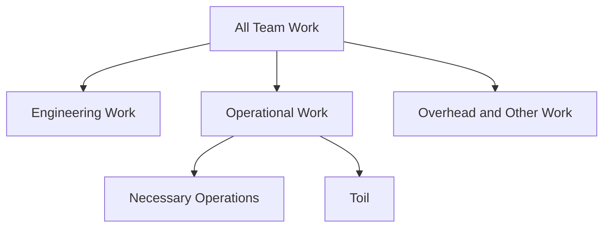
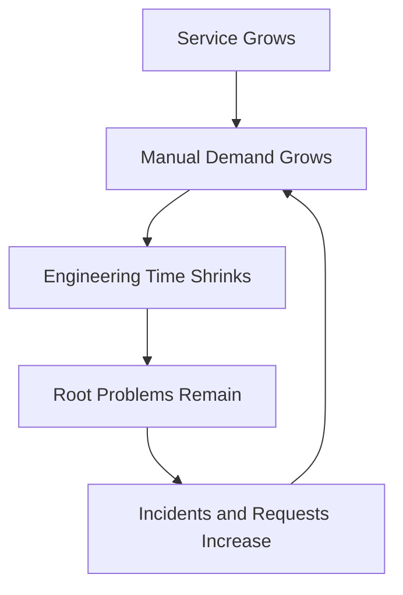
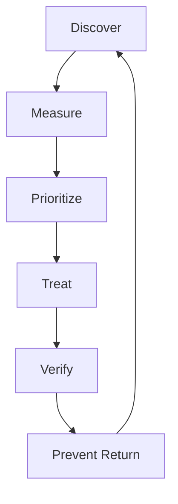

# Toil

> Toil is operational work that is manual, repetitive, automatable, tactical, without enduring value, and likely to grow as a service grows. SRE identifies and controls toil so that production demand does not consume the engineering capacity needed to improve reliability.

## Section Purpose

Toil is one of the defining concerns of Site Reliability Engineering.

Production services always require some operational work. Engineers investigate incidents, coordinate recovery, support launches, test disaster recovery, manage exceptional changes, and make decisions under uncertainty. This work can be necessary and valuable.

Toil is different.

Toil repeatedly consumes human effort without producing a lasting improvement. It often begins as a reasonable temporary action. Over time, the service grows, the action repeats, and the temporary solution becomes part of normal operations.

This section explains:

- The defining characteristics of toil
- How toil differs from necessary operations, overhead, and engineering work
- How toil enters production systems
- Technical, procedural, organizational, and cognitive forms of toil
- How to discover, classify, measure, and prioritize toil
- How to eliminate, redesign, automate, simplify, delegate, or consciously retain work
- How to calculate automation value and maintenance cost
- How toil affects reliability, on-call, people, security, and business outcomes
- How to prevent toil from returning
- How to govern toil without turning measurement into more toil

---

## Learning Objectives

After completing this section, you should be able to:

1. Define toil using its characteristics rather than calling all operations toil.
2. Distinguish toil from necessary operational work, engineering work, maintenance, and overhead.
3. Identify visible and hidden forms of toil.
4. Explain how service growth causes toil to scale.
5. Build a practical toil inventory.
6. Measure toil using time, frequency, interruption, risk, and growth.
7. Prioritize toil reduction using evidence.
8. Select elimination, redesign, automation, simplification, self-service, delegation, or acceptance appropriately.
9. Design safe, owned, observable automation.
10. Verify that a toil-reduction project produced lasting improvement.
11. Protect engineering capacity when toil exceeds an agreed limit.
12. Prevent new services and changes from introducing avoidable toil.

---

## 1. A Working Definition of Toil

Toil is operational work that has several of these characteristics:

- Manual
- Repetitive
- Automatable
- Tactical
- Without enduring value
- Scales with service growth

Google's SRE material uses these characteristics to distinguish toil from work that creates lasting service improvement.

Not every toil item displays every characteristic equally. Classification requires judgment.

---

## 2. Toil Is a Subset of Operational Work



Operational work is the broad activity of running and supporting production. Toil is the portion that repeatedly consumes effort without sufficient lasting value.

---

## 3. Manual

Manual work requires direct human execution or supervision.

Examples include:

- Engineer restarts a job
- Operator approves a standard request
- On-call copies data between systems
- Team updates hundreds of configurations individually
- Responder checks the same dashboards after every alert

Manual work is not automatically toil. Manual diagnosis of a new production failure may require valuable judgment.

---

## 4. Repetitive

Repetitive work follows substantially the same pattern.

It may repeat:

- Every request
- Every deployment
- Every incident
- Every week
- Every service onboarding
- Every capacity increase
- Every certificate renewal

Repetition makes the work predictable enough to question whether it should continue in its current form.

---

## 5. Automatable

Automatable work can be performed reliably by software or removed through system design.

Ask:

- Are inputs well defined?
- Are decisions rule-based?
- Are outcomes observable?
- Can safety limits be encoded?
- Can failure be reversed or contained?

Not every automatable task should be automated. Low-frequency work may cost more to automate and maintain than to perform safely by hand.

---

## 6. Tactical

Tactical work addresses an immediate need without changing the underlying condition.

Examples include:

- Add capacity after saturation
- Restart a leaking process
- Clear a stuck queue
- Reissue an expired credential
- Silence a noisy alert

Tactical action may be necessary during an incident. It becomes toil when the same mitigation repeats without lasting follow-up.

---

## 7. Without Enduring Value

Toil does not leave the service meaningfully easier, safer, more reliable, or more understandable after completion.

The action may restore normal state, but the same demand is likely to return.

Examples include:

- Manually repair one instance while the defect remains
- Update one account through a repeated administrative process
- Reconcile one recurring data mismatch without fixing its cause

---

## 8. Scales With Service Growth

Toil often grows with:

- Users
- Traffic
- Data
- Services
- Machines
- Regions
- Deployments
- Customers
- Incidents

If every new customer creates one manual task, growth creates a linear staffing requirement.

SRE seeks operating models where human effort grows more slowly than the service.

---

## 9. The Toil Growth Loop



This loop is one reason toil requires explicit limits and leadership attention.

---

## 10. Toil Versus Necessary Operations

| Necessary operational work | Toil |
| --- | --- |
| Investigate a new failure mode | Restart the same failed process daily |
| Coordinate a severe incident | Forward routine alerts manually |
| Execute a rare high-risk recovery | Perform standard recovery steps every week |
| Review a novel critical launch | Approve every low-risk change manually |
| Validate an unusual data repair | Reconcile the same known mismatch repeatedly |

Novelty, judgment, learning, and enduring follow-up often distinguish necessary operations from toil.

---

## 11. Toil Versus Engineering Work

Engineering work changes the future system.

Toil maintains the present state.

Example:

- Toil: manually expand storage every Friday.
- Engineering: build a capacity model, safe automatic expansion, and alerts based on time to exhaustion.

Engineering work should reduce future effort or risk and be verified in production.

---

## 12. Toil Versus Overhead

Overhead supports organizational coordination. Toil directly relates to running a service.

Examples of overhead:

- General planning
- Hiring administration
- Budget meetings
- Organization-wide reporting

Examples of toil:

- Copying the same service data into several reports
- Repeatedly creating identical access requests
- Manually updating routine service metadata

Overhead can be excessive, but not every inefficient activity is SRE toil.

---

## 13. Toil Versus Maintenance

Maintenance preserves supported and safe operation.

Examples include:

- Upgrade an expiring runtime
- Patch a vulnerability
- Test restore procedures
- Renew a certificate

Maintenance becomes toil when preventable repetition, manual scale, or poor system design dominates the work.

---

## 14. Toil Versus Technical Debt

Technical debt is a design or implementation condition that creates future cost or risk.

Toil is recurring operational work.

They often reinforce each other:

- Technical debt creates repeated manual intervention.
- Toil consumes the engineering time required to remove technical debt.

Not all technical debt produces toil, and not all toil comes from code debt.

---

## 15. Toil Versus Complexity

Complexity increases understanding and operating cost. It can create toil, but complexity itself is not toil.

Example:

- Complex dependency graph: system complexity.
- Manually checking every dependency after each change: toil.

Simplifying architecture can remove entire categories of toil.

---

## 16. Toil Versus Cognitive Load

Cognitive load is the amount of knowledge and reasoning required to perform work.

Toil can have high cognitive load when humans repeatedly make difficult but similar decisions.

Examples include:

- Manually select capacity settings for every tenant
- Reconstruct service context for repetitive escalations
- Compare many dashboards for a known alert

Reducing clicks without reducing cognitive demand may not solve the problem.

---

## 17. Sources of Toil

Toil commonly originates from:

- Rapid service growth
- Temporary launch processes
- Missing product features
- Weak platform capabilities
- Poor observability
- Noisy alerts
- Unsafe change processes
- Incomplete ownership
- Fragile dependencies
- Missing APIs
- Deferred maintenance
- Organizational handoffs
- Compliance procedures designed without automation
- Unreliable automation

The source determines the correct treatment.

---

## 18. Temporary Work Becomes Permanent

Many toil items begin with phrases such as:

- Just for launch
- Until the migration ends
- Until the API is ready
- Only for this customer
- Until we automate it

Temporary work needs:

- Owner
- Expiry
- Volume limit
- Risk limit
- Replacement plan
- Review trigger

Without these controls, temporary operations become the permanent operating model.

---

## 19. Alert Toil

Alert toil includes:

- Nonactionable pages
- Duplicate pages
- Alerts for expected behavior
- Alerts routed to the wrong team
- Pages requiring the same known response
- Alerts with no user or SLO impact
- Alerts caused by broken monitoring

Every page should require timely human judgment or action. Other signals can use tickets, reports, or dashboards.

---

## 20. Incident Toil

Incident response is not automatically toil.

Incident toil appears when:

- The same failure recurs
- The same mitigation repeats
- Evidence must be gathered manually each time
- Incident roles must be rediscovered
- Known state must be reconciled by hand
- Corrective actions are repeatedly deferred

The incident is operational work. Repeated preventable parts are toil candidates.

---

## 21. Deployment Toil

Examples include:

- Manually copy artifacts
- Update configuration by hand
- Request routine approval for every release
- Execute repeated validation steps without automation
- Coordinate standard deployment through chat messages
- Perform manual rollback because no safe mechanism exists

Deployment automation must include verification, rollback, permissions, and observability.

---

## 22. Capacity Toil

Capacity toil includes:

- Repeatedly add instances by hand
- Manually calculate routine quotas
- Respond to predictable saturation
- Resize every tenant individually
- Request standard capacity through tickets

Treatment may require forecasting, automatic scaling, quotas, admission control, or architecture changes.

---

## 23. Access Toil

Examples include:

- Manual routine access grants
- Repeated approval forwarding
- Account creation across many systems
- Manual access reviews from inconsistent records
- Emergency access caused by missing standard paths

Access automation must preserve least privilege, separation of duties, expiry, auditability, and revocation.

---

## 24. Configuration Toil

Configuration toil includes:

- Update the same setting across services
- Repair configuration drift manually
- Compare environments by hand
- Recreate standard configuration for each launch
- Correct frequent invalid changes

Useful controls include schemas, validation, version control, policy checks, safe defaults, and automated reconciliation.

---

## 25. Data Toil

Examples include:

- Manual data correction
- Repeated record reconciliation
- Backfill execution
- Schema repair
- Queue replay
- Duplicate removal

Data automation requires strong safeguards because a fast incorrect action can corrupt large volumes of state.

---

## 26. Backup and Recovery Toil

Examples include:

- Manually initiate every backup
- Copy recovery artifacts between locations
- Reconstruct restore steps from memory
- Repeatedly test without recording evidence
- Manually verify large restored datasets

Recovery should be automated where safe, but human exercises still provide essential readiness evidence.

---

## 27. Certificate and Secret Toil

Examples include:

- Track expiry in personal calendars
- Rotate every credential manually
- Distribute secrets through tickets
- Repair outages caused by missed renewal

Automation should include inventory, ownership, renewal, distribution, verification, revocation, and failure alerting.

---

## 28. Ticket Toil

A ticket queue can hide repeated demand.

Examples include:

- Standard provisioning request
- Routine restart request
- Repeated log retrieval
- Common configuration update
- Predictable support escalation

Group tickets by intent and cause. High closure volume may indicate unmanaged toil rather than strong productivity.

---

## 29. Reporting Toil

Examples include:

- Copy metrics into weekly documents
- Rebuild the same chart
- Reconcile inconsistent inventory records
- Manually collect SLO data
- Duplicate status updates across channels

First ask who uses the report and which decision it supports. Remove reports without a real consumer.

---

## 30. Service Onboarding Toil

Onboarding toil appears when every service requires unique manual setup for:

- Monitoring
- Alerts
- Access
- Dashboards
- Deployment
- Backup
- Ownership records
- On-call routing

Standard templates and supported service patterns can reduce repeated work while preserving service-specific judgment.

---

## 31. Dependency Toil

Examples include:

- Manually check dependency status
- Repeatedly request quota changes
- Translate between inconsistent escalation processes
- Retry failed provider operations by hand
- Reconfigure consumers after routine provider changes

Dependency contracts, APIs, fallback design, and clear ownership can reduce this toil.

---

## 32. Security and Compliance Toil

Security and compliance work can become repetitive without losing importance.

Examples include:

- Evidence copied manually
- Repeated access certification
- Policy checks performed by hand
- Vulnerability ownership assigned manually
- Standard controls reviewed separately for every similar service

Reduce toil without weakening control intent, audit evidence, independence, or approval authority.

---

## 33. Communication Toil

Examples include:

- Repeat the same status in many channels
- Manually locate stakeholders during incidents
- Forward routine alerts
- Answer repeated service questions
- Recreate standard maintenance notices

Automation can distribute consistent information, but sensitive or high-impact communication still needs human judgment.

---

## 34. Coordination Toil

Coordination toil grows when ownership and interfaces are unclear.

Symptoms include:

- Tickets bounce between teams
- Approvers are rediscovered every time
- No team owns the end-to-end result
- Routine work requires several meetings
- Escalation depends on personal relationships

Clarifying ownership may remove more toil than technical automation.

---

## 35. Shadow Toil

Shadow toil is recurring work that official systems do not capture.

Examples include:

- Personal scripts
- Direct messages
- Unrecorded after-hours actions
- Manual checks before shifts
- Spreadsheet tracking
- Informal support

Shadow toil makes capacity plans inaccurate and creates key-person risk.

---

## 36. Emotional Toil

Repeated low-value work can create emotional strain through:

- Constant interruption
- Fear of making a manual mistake
- Lack of control
- Unrecognized labor
- Repeated nighttime pages
- Frustration that known problems remain

Emotional impact should not be reduced to a time percentage. It affects retention, learning, judgment, and safety.

---

## 37. Toil and Human Error

Manual repetition increases exposure to:

- Skipped steps
- Incorrect target selection
- Copy errors
- Stale instructions
- Fatigue
- Confirmation bias
- Unsafe shortcuts

When one small manual mistake can create a large blast radius, toil is also a production-risk issue.

---

## 38. Toil and Reliability

Toil harms reliability when it:

- Delays response
- Produces inconsistent execution
- Hides systemic defects
- Displaces preventive work
- Increases fatigue
- Creates access risk
- Makes growth dependent on staffing
- Normalizes temporary mitigation

Reducing toil should improve service or operator outcomes, not only save time.

---

## 39. Toil and Security

Security risks include:

- Broad standing access for routine work
- Credentials copied manually
- Incomplete audit trails
- Missed revocation
- Repeated emergency access
- Unreviewed personal automation

Toil reduction must use least privilege, strong identity, logging, validation, and safe failure behavior.

---

## 40. Toil and Business Growth

Linear manual work can become a growth constraint.

Example:

> Every new customer requires two hours of engineering setup.

At 10 customers per month, the load is 20 hours. At 1,000 customers, it becomes 2,000 hours.

Growth can expose a process that appeared harmless at small scale.

---

## 41. Discovering Toil

Use several evidence sources:

- On-call logs
- Incident timelines
- Tickets
- Chat requests
- Change records
- Runbooks
- Calendar interruptions
- Personal scripts
- Work sampling
- Team interviews
- Service onboarding records
- Access requests
- Capacity actions

Do not rely only on formal ticket categories.

---

## 42. Ask the People Doing the Work

Engineers performing the work often know:

- Which actions repeat
- Which steps are risky
- Which requests are unnecessary
- Which tools fail
- Which approvals add no value
- Which temporary processes never ended

Create a safe environment for reporting toil. Do not treat the existence of toil as personal failure.

---

## 43. Toil Diary

A short toil diary can record:

- Date
- Service
- Trigger
- Work performed
- Duration
- Interruption
- Frequency
- Risk
- Current owner
- Suggested treatment

Use a short sampling period. Permanent detailed time tracking can become new toil.

---

## 44. Toil Inventory

A useful inventory contains:

| Field | Purpose |
| --- | --- |
| Toil item | Clear name |
| Service | Affected production service |
| Trigger | What creates the work |
| Frequency | How often it occurs |
| Duration | Human effort per occurrence |
| People | Number and roles involved |
| Growth driver | What increases demand |
| Risk | Error, security, and user impact |
| Owner | Accountable team |
| Treatment | Eliminate, redesign, automate, or retain |
| Verification | Evidence of reduction |
| Review date | Next decision point |

---

## 45. Example Toil Record

```yaml
toil_item:
  name: manual-capacity-expansion
  service: checkout
  owner: commerce-sre

  trigger: database-storage-above-75-percent
  frequency_per_month: 6
  average_minutes: 45
  people_per_event: 2
  interrupts_on_call: true
  growth_driver: transaction-volume

  risks:
    - wrong-database-selected
    - expansion-started-too-late
    - customer-latency

  treatment: automated-capacity-policy
  verification: zero-manual-expansions-for-90-days
  review_date: 2026-12-13
```

Keep the record concise and free of credentials or unnecessary personal information.

---

## 46. Measuring Toil Time

A basic estimate is:

\[
\text{Toil hours per period} =
\text{Frequency} \times \text{Duration} \times \text{People involved}
\]

Example:

\[
6 \times 0.75 \times 2 = 9 \text{ hours per month}
\]

This estimate does not include context switching, training, incident risk, or growth.

---

## 47. Toil Share

\[
\text{Toil share} =
\frac{\text{Toil hours}}
{\text{Total measured work hours}} \times 100
\]

Use the measure to identify trends and trigger action.

Do not use it to punish accurate reporting or reward relabeling.

---

## 48. Interruption Cost

An interruption's cost includes:

- Direct work time
- Investigation setup
- Communication
- Context switching
- Recovery of concentration
- Delayed project work
- After-hours impact

A five-minute recurring page can create much more than five minutes of lost engineering capacity.

---

## 49. Growth-Adjusted Toil

Estimate future toil using the expected growth driver.

Example:

\[
\text{Future toil} =
\text{Current toil} \times \text{Expected demand multiplier}
\]

If current toil is 20 hours per month and traffic is expected to triple, linear work may become 60 hours per month.

Document where the relationship may not be linear.

---

## 50. Risk-Adjusted Toil

Time alone can understate dangerous work.

Prioritize toil that can cause:

- Data loss
- Security exposure
- Large outage
- Incorrect transactions
- Recovery failure
- Regulatory breach
- Operator injury or exhaustion

A rare fifteen-minute action with catastrophic error potential may outrank a frequent low-risk task.

---

## 51. Toil Budget

A toil budget defines the maximum acceptable toil burden before action is required.

It may include:

- Percentage of team time
- Hours per person
- Pages per shift
- Manual actions per service
- Maximum growth rate
- High-risk toil count

The budget should trigger prioritization, service handback, scope reduction, staffing review, or engineering work.

---

## 52. Google's Operational Work Boundary

Google's published SRE model seeks to keep operational work within 50 percent of SRE time, preserving at least half for engineering.

The limit includes more than toil, and it reflects Google's operating model.

Other organizations may choose a different number. The transferable principle is that toil and operations must not eliminate engineering capacity.

---

## 53. Toil Limits by Service

Team-level totals can hide one harmful service.

Track toil by:

- Service
- Journey
- Work type
- Owning team
- Time of day
- Risk
- Growth driver

A service that consumes disproportionate effort may need redesign, handback, or retirement.

---

## 54. Prioritizing Toil Reduction

Consider:

- Total time
- Frequency
- Growth rate
- Interruption
- Error risk
- User impact
- On-call impact
- Security exposure
- Reuse potential
- Feasibility
- Payback

Avoid selecting only the easiest visible task.

---

## 55. A Simple Priority Score

One possible model is:

\[
P = 0.25T + 0.20G + 0.20R + 0.15I + 0.10U + 0.10F
\]

Where:

- \(T\) = time consumed
- \(G\) = growth rate
- \(R\) = operational risk
- \(I\) = interruption cost
- \(U\) = user impact
- \(F\) = feasibility of treatment

The score makes assumptions visible. It does not replace judgment.

---

## 56. Treatment Options

Possible treatments include:

1. Eliminate the work.
2. Redesign the system.
3. Simplify the process.
4. Automate safely.
5. Standardize repeated variation.
6. Provide guarded self-service.
7. Delegate to the correct owner.
8. Reduce frequency or scope.
9. Retire the service.
10. Consciously retain and budget the work.

Automation is one option, not the automatic answer.

---

## 57. Eliminate the Work

Ask why the work exists.

Examples:

- Remove an unused report
- Retire an obsolete service
- Delete an unnecessary approval
- Stop collecting unused data
- Remove a configuration option that creates support demand

Elimination avoids automation code, maintenance, monitoring, and failure modes.

---

## 58. Redesign the System

System redesign removes the condition that creates toil.

Examples include:

- Replace manual repair with self-healing state management
- Add idempotency to remove duplicate cleanup
- Isolate tenants to reduce complex recovery
- Add backpressure to prevent queue clearing
- Change data ownership to remove repeated reconciliation

Redesign may cost more initially but can remove entire work classes.

---

## 59. Simplify the Process

Simplification may reduce:

- Steps
- Tools
- Handoffs
- Approvals
- Variants
- Required context
- Error opportunities

Do not automate a twenty-step process before asking whether five steps are sufficient.

---

## 60. Automate Safely

Safe automation needs:

- Defined objective
- Owner
- Supported inputs
- Permissions
- Validation
- Idempotency where required
- Rate and blast-radius limits
- Observability
- Failure handling
- Rollback or disablement
- Documentation
- Maintenance plan

Automation is production software.

---

## 61. Automation Failure Modes

Automation can:

- Select the wrong target
- Repeat a destructive action
- Amplify invalid input
- Fail silently
- Depend on expired credentials
- Produce partial state
- Hide manual fallback loss
- Create correlated failure
- Continue after conditions change

Design for safe failure, detection, containment, and human override.

---

## 62. Human in the Loop

Keep human judgment where:

- Consequences are severe
- Context is difficult to encode
- Data is uncertain
- Legal approval is required
- Action is irreversible
- Frequency is very low

Reduce toil by automating evidence collection, validation, and execution preparation while preserving the necessary decision.

---

## 63. Guarded Self-Service

Self-service allows a user or service team to complete routine work within safe boundaries.

It should provide:

- Authentication
- Authorization
- Validated inputs
- Supported options
- Quotas
- Audit trail
- Clear failure messages
- Reversal where possible
- Escalation

Uncontrolled self-service transfers risk rather than removing toil.

---

## 64. Delegate to the Correct Owner

Work may exist because it is performed by the wrong team.

Delegation is appropriate when:

- The receiving team owns the decision
- Knowledge and access are available
- The task fits its service boundary
- Workload is accepted
- Safety controls exist

Moving repetitive work to a cheaper or less powerful team does not eliminate toil.

---

## 65. Consciously Retain Toil

Some toil may be retained because:

- Frequency is very low
- Automation cost is high
- Process will soon disappear
- Human judgment is essential
- Risk of automation exceeds manual risk

Record:

- Rationale
- Owner
- Expected volume
- Safety controls
- Review date
- Condition that would trigger automation or removal

---

## 66. Automation Cost

Automation cost includes:

- Design
- Implementation
- Testing
- Security review
- Deployment
- Documentation
- Monitoring
- Maintenance
- Incident response
- Decommissioning

A small script can create a long-lived service obligation.

---

## 67. Payback Period

A simple estimate is:

\[
\text{Payback period} =
\frac{\text{Engineering effort}}
{\text{Operational effort removed per period}}
\]

Example:

- Automation effort: 120 hours
- Toil removed: 20 hours per month
- Simple payback: 6 months

Also include risk reduction and ongoing maintenance.

---

## 68. Net Toil Reduction

Automation can create new work.

\[
\text{Net toil reduction} =
\text{Old toil removed} - \text{New recurring work introduced}
\]

New work may include:

- Automation failures
- Dependency updates
- Alert response
- Manual exceptions
- Support
- Audit review

Measure net effect, not only the removed procedure.

---

## 69. Verification

Define success before implementation.

Possible measures include:

- Manual actions reduced
- Pages reduced
- Time saved
- Failure rate reduced
- Recovery improved
- Access exposure reduced
- Growth no longer increases work linearly
- Operator satisfaction improved

Verify over a meaningful production period.

---

## 70. Remove the Old Path

After a successful replacement:

- Update runbooks
- Remove obsolete permissions
- Retire old scripts
- Stop duplicate alerts
- Close temporary procedures
- Train users
- Preserve emergency fallback only when justified

Leaving both paths active can double complexity and toil.

---

## 71. Preventing Toil

Preventive controls include:

- Production readiness review
- Service templates
- Clear ownership
- SLOs
- Actionable alerting
- Capacity models
- Safe deployment
- Supported APIs
- Automated lifecycle management
- Decommission plans
- Operational-load estimates

Toil prevention should begin during design, not after SRE inherits the service.

---

## 72. Toil in Production Readiness

Before launch, ask:

- Which tasks are manual?
- How often will they occur?
- What happens when traffic grows?
- Which tasks require privileged access?
- Which tasks interrupt on-call?
- What is the team limit?
- Who will remove temporary work?

An unready operating model is a launch risk.

---

## 73. Toil and Service Ownership

The service owner should own toil created by the service.

SRE may help measure and reduce it, but development must participate when the cause requires application or architecture changes.

Shared operation must not allow the creator of toil to externalize all human cost to another team.

---

## 74. Toil and Error Budgets

Error budgets manage service reliability risk. A toil budget manages human operational burden.

They interact:

- Poor reliability creates incident toil.
- Excessive toil prevents reliability engineering.
- Unsafe toil reduction can consume error budget.

Do not treat them as the same measure.

---

## 75. Toil Reduction as Change Risk

Removing manual work can introduce risk.

Use:

- Staged rollout
- Shadow mode
- Dry runs
- Limited scope
- Approval for destructive action
- Comparison with human results
- Rollback
- Post-release monitoring

The objective is safer and more scalable operation, not automation at any cost.

---

## 76. Toil Ownership and Governance

A practical governance cycle is:



Each major toil item needs an owner and review point.

---

## 77. Toil Review

Review:

- Largest toil items
- Fastest-growing items
- High-risk manual work
- On-call interruptions
- Treatment progress
- Automation maintenance
- Retained-toil decisions
- Service-level concentration
- New toil from launches
- Work that returned

The review should produce priorities and decisions, not only a report.

---

## 78. Reporting Toil to Leadership

Report:

- Human capacity consumed
- Services creating the demand
- Growth trend
- User and operational risk
- Engineering work displaced
- Proposed treatment
- Required ownership or funding decision
- Verified reduction

Translate toil into reliability, delivery, cost, and workforce consequences.

---

## 79. Toil Anti-Patterns

### All Operations Are Toil

Necessary high-judgment work is mislabeled.

### Automate Everything

Cost, risk, and maintenance are ignored.

### Move It to Another Team

The organization transfers burden without removing it.

### Count Hours Without Action

Measurement creates reporting but no priority change.

### Hide Toil to Look Efficient

Plans become unrealistic and overload continues.

### Build Unowned Scripts

Automation becomes a new production risk.

### Keep Both Paths Forever

Old manual and new automated processes coexist indefinitely.

### Treat Symptoms Only

The repeated action is accelerated while the system condition remains.

### Ignore Human Impact

After-hours interruption and error anxiety are excluded.

### Accept Toil Without Review

A reasonable short-term decision becomes permanent.

---

## 80. Scenario 1: Noisy Disk Alert

An alert pages every night at 70 percent disk use. Engineers confirm that automatic cleanup runs safely at 75 percent.

### Analysis

The page is repetitive, actionable only through observation, and without enduring value.

### Treatment

- Remove the premature page
- Monitor cleanup success
- Alert on predicted exhaustion or cleanup failure
- Verify page reduction and storage safety

---

## 81. Scenario 2: Manual Customer Provisioning

Every enterprise customer requires ninety minutes of privileged setup across six systems.

### Risk

Growth increases time, access exposure, inconsistency, and delay.

### Treatment

- Remove unnecessary variation
- Define one service interface
- Build guarded self-service
- Use least privilege and audit logs
- Verify successful provisioning and reduced human effort

---

## 82. Scenario 3: Rare Disaster Recovery

A recovery procedure requires trained engineers and occurs only during annual testing or severe disaster.

### Analysis

The work is manual and partly automatable, but it is rare, high-risk, and judgment-intensive. It is not automatically toil.

Automate repeatable evidence and execution safely while retaining necessary human command and validation.

---

## 83. Scenario 4: Failed Automation

An automated queue repair fails twice per week and requires a senior engineer to correct partial state.

### Analysis

Automation has created new toil and risk.

### Treatment

- Contain unsafe actions
- Add idempotency and state validation
- Improve observability
- Define rollback
- Compare net toil before and after

---

## 84. Scenario 5: Compliance Evidence Collection

Engineers spend three days each quarter collecting the same access and change evidence.

### Treatment

- Preserve control intent and auditor requirements
- Standardize evidence fields
- Generate evidence from authoritative systems
- Protect integrity and retention
- Keep required independent review
- Verify reduced effort and accepted evidence quality

---

## 85. Scenario 6: SRE Inherits Launch Toil

A product launches with twenty manual operational steps promised as temporary. Six months later, volume has tripled and no development time is assigned.

### Required response

- Inventory and quantify the work
- Enforce the original expiry and engagement terms
- Assign application changes to development
- Prioritize the highest-risk steps
- Pause further scale if operation is unsafe
- Escalate ownership and capacity decisions

---

## 86. Practical Exercise 1: Identify Toil

Review ten recent operational tasks.

For each, score:

- Manual
- Repetitive
- Automatable
- Tactical
- Enduring value
- Growth relationship

Classify the item and explain uncertain cases.

---

## 87. Practical Exercise 2: Build a Toil Inventory

For one service, record:

- Toil item
- Trigger
- Frequency
- Duration
- People
- Interruption
- Risk
- Growth driver
- Owner
- Proposed treatment

Identify missing shadow work through team interviews.

---

## 88. Practical Exercise 3: Calculate Toil Cost

Calculate:

- Monthly human hours
- Annual hours
- Context-switch estimate
- Expected hours after forecast growth
- Risk exposure

State the uncertainty in your estimate.

---

## 89. Practical Exercise 4: Select a Treatment

Choose one high-priority item and compare:

- Elimination
- Redesign
- Simplification
- Automation
- Self-service
- Delegation
- Retention

Select the option with the best combined effect on effort, risk, maintenance, and user outcome.

---

## 90. Practical Exercise 5: Write an Automation Design

Include:

- Objective
- Inputs
- Preconditions
- Permissions
- Safe limits
- Idempotency
- Observability
- Failure behavior
- Rollback
- Owner
- Maintenance
- Verification

Identify one way the automation could increase blast radius.

---

## 91. Practical Exercise 6: Design a Toil Budget

Define:

- Team limit
- Service-level limit
- High-risk manual-work limit
- Warning threshold
- Breach action
- Review cadence
- Reporting method
- Leadership escalation

Ensure measurement does not create excessive new work.

---

## 92. Toil Checklist

### Identification

- [ ] Operational work is distinguished from toil.
- [ ] Manual, repetitive, automatable, tactical, enduring-value, and growth characteristics are assessed.
- [ ] Shadow and after-hours work are included.
- [ ] High-risk low-frequency work is reviewed separately.

### Measurement

- [ ] Frequency, duration, and people are recorded.
- [ ] Interruption and on-call impact are considered.
- [ ] Growth is forecast.
- [ ] Risk is considered alongside time.
- [ ] Reporting remains lightweight.

### Treatment

- [ ] Elimination is considered first.
- [ ] System redesign and simplification are considered.
- [ ] Automation has a clear payback and safety case.
- [ ] Self-service has guardrails.
- [ ] Delegation moves work only to the correct owner.
- [ ] Retained toil has rationale and review date.

### Automation Safety

- [ ] Ownership is clear.
- [ ] Permissions use least privilege.
- [ ] Inputs and preconditions are validated.
- [ ] Blast radius is limited.
- [ ] Failure is observable.
- [ ] Rollback or disablement exists.
- [ ] Maintenance is funded.

### Verification and Governance

- [ ] Success measures are defined before implementation.
- [ ] Net toil reduction is measured.
- [ ] Old paths are retired where appropriate.
- [ ] New toil is checked after launches and changes.
- [ ] Budget breaches trigger action.
- [ ] Development and service owners address causes they control.

---

## 93. Reflection Questions

1. Which repeated operational action has no enduring value?
2. Which work is hidden outside formal tickets?
3. Which toil item will grow fastest with service demand?
4. Which manual task has the largest blast radius?
5. Which temporary process has no expiry?
6. Which automation created new toil?
7. What work can be removed instead of automated?
8. Which team owns the system condition creating the toil?
9. What engineering work is displaced by current toil?
10. How will you prove that a treatment worked?

---

## 94. Knowledge Check

### 1. What is toil?

Operational work that is manual, repetitive, automatable, tactical, without enduring value, and likely to scale with service growth.

### 2. Is every operational task toil?

No. Necessary operations may require novel judgment, provide learning, or handle rare high-risk events.

### 3. Is every manual task toil?

No. Manual investigation, experimentation, and exceptional recovery can produce important value.

### 4. Why is service growth important?

Toil that scales with users, traffic, or services creates a linear human-capacity requirement.

### 5. What should be considered before automation?

Whether the work can be eliminated, redesigned, simplified, reduced, or assigned to the correct owner.

### 6. What makes automation safe?

Clear ownership, validated inputs, least privilege, limits, observability, safe failure, rollback, testing, and maintenance.

### 7. What is net toil reduction?

Old recurring work removed minus new recurring work introduced by the solution.

### 8. Why can toil measurement become harmful?

Excessive tracking creates new work and incentives to hide or relabel toil.

### 9. What is a toil budget?

An agreed limit on toil burden that triggers corrective engineering, scope, ownership, or staffing decisions.

### 10. Can toil be consciously retained?

Yes, when manual execution is safer or cheaper, but the decision needs rationale, ownership, controls, and review.

### 11. Who owns toil created by a service?

The service owner remains accountable, while SRE and other teams may help reduce it within defined responsibilities.

### 12. How is toil reduction verified?

Measure sustained changes in manual actions, time, pages, risk, growth behavior, and operator or user outcomes.

---

## 95. Completion Checklist

You have completed this section when you can:

- [ ] Define toil using its six common characteristics.
- [ ] Distinguish toil from operations, engineering, overhead, maintenance, debt, and complexity.
- [ ] Identify technical, procedural, organizational, cognitive, and shadow toil.
- [ ] Build and prioritize a toil inventory.
- [ ] Calculate time, growth, interruption, and risk-adjusted impact.
- [ ] Compare treatment options beyond automation.
- [ ] Design safe automation and guarded self-service.
- [ ] Define a toil budget and breach response.
- [ ] Verify net toil reduction.
- [ ] Prevent toil during production readiness and service ownership.

---

## 96. Key Takeaways

- Toil is a subset of operational work, not a synonym for operations.
- Its common characteristics are manual, repetitive, automatable, tactical, without enduring value, and growth-linked.
- Necessary human judgment should not be mislabeled as toil.
- Toil consumes engineering capacity and can increase reliability, security, and human risk.
- Hidden, cognitive, after-hours, and coordination toil must be considered.
- Measure frequency, duration, people, interruption, growth, and risk.
- Elimination and redesign may be better than automation.
- Automation is production software and needs ownership, limits, observability, safe failure, and maintenance.
- Moving toil to another team does not remove it.
- Retained toil requires an explicit, reviewed decision.
- Toil reduction succeeds only when production evidence shows a lasting net improvement.
- Healthy SRE organizations set operational boundaries and protect engineering time.

---

## 97. Authoritative Resources

### Toil Definition and Management

- [Google SRE Book: Eliminating Toil](https://sre.google/sre-book/eliminating-toil/)
- [Google SRE Workbook: Identifying and Tracking Toil](https://sre.google/workbook/identifying-toil/)
- [Google SRE Workbook: Eliminating Toil](https://sre.google/workbook/eliminating-toil/)
- [Google SRE Workbook: Example Toil Questionnaire](https://sre.google/workbook/eliminating-toil/#toil-questionnaire)

### Operational Load and Engineering Capacity

- [Google SRE Book: Introduction](https://sre.google/sre-book/introduction/)
- [Google SRE Book: Being On-Call](https://sre.google/sre-book/being-on-call/)
- [Google SRE Workbook: SRE Engagement Model](https://sre.google/workbook/engagement-model/)
- [Google SRE Workbook: SRE Team Lifecycles](https://sre.google/workbook/team-lifecycles/)

### Source Interpretation

Google's published definitions and operational-work limits describe its SRE model. Organizations can adapt numerical limits, measurement methods, and treatment processes. The core requirement is to preserve engineering capacity and prevent recurring manual demand from scaling without control.

---

## 98. Related SRE World Sections

- [What Is SRE](./01-What-Is-SRE.md)
- [The SRE Mindset](./03-The-SRE-Mindset.md)
- [Production Responsibility](./08-Production-Responsibility.md)
- [Service Ownership](./09-Service-Ownership.md)
- [Engineering Work and Operational Work](./12-Engineering-Work-and-Operational-Work.md)
- [SRE Foundations](./README.md)
- [Toil and Automation](../12-Toil-and-Automation/)
- [On-Call Engineering](../10-On-Call-Engineering/)
- [Incident Management](../08-Incident-Management/)
- [Automation and Remediation](../13-Automation-and-Remediation/)

---

## Next Section

[Section 14: SRE and DevOps](./14-SRE-and-DevOps.md)

---

## Maintained by VERIQTA

SRE World is created and maintained by [VERIQTA](https://github.com/veriqta).

- Website: [veriqta.com](https://www.veriqta.com/)
- GitHub: [github.com/veriqta](https://github.com/veriqta)
- Instagram: [@veriqta](https://www.instagram.com/veriqta/)
- Medium: [veriqta.medium.com](https://veriqta.medium.com/)

> Toil is not defeated when a task becomes faster. It is defeated when recurring human demand, operational risk, and growth pressure are measurably reduced.
