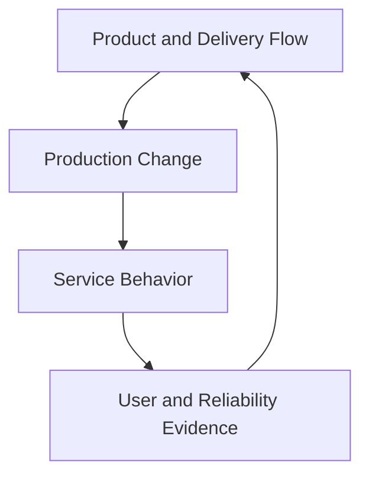
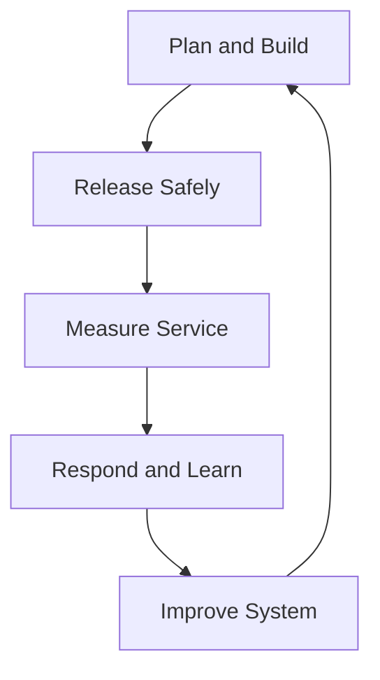

# SRE and DevOps

> DevOps is a broad set of principles and capabilities for improving how software is built, delivered, and operated. Site Reliability Engineering is a reliability-focused engineering discipline that turns many of those principles into explicit production practices, decision mechanisms, and operating responsibilities.

## Section Purpose

SRE and DevOps are often presented as competing job titles, interchangeable teams, or collections of tools. Those descriptions obscure their relationship.

DevOps addresses the organizational and technical conditions that allow teams to deliver valuable software safely and continuously. SRE concentrates on whether production services meet explicit reliability expectations with controlled risk and sustainable human effort.

The two fields overlap substantially, but they are not identical.

This section explains:

- What DevOps and SRE mean
- How their histories and scopes differ
- Which principles they share
- Which mechanisms are distinctive to SRE
- How delivery performance and service reliability relate
- How DevOps, product, platform, security, and SRE responsibilities interact
- How teams can use both without creating duplicate ownership
- Which common claims and organizational patterns are misleading
- How to evaluate the relationship in real production environments

This is not a catalog of DevOps tools. Tools may support a practice, but they do not define either discipline.

---

## Learning Objectives

After completing this section, you should be able to:

1. Define DevOps and SRE without reducing either to tools or job titles.
2. Explain why SRE can be understood as a concrete implementation of several DevOps principles.
3. Identify the shared goals and different scopes of the two disciplines.
4. Distinguish delivery performance from service reliability.
5. Explain the roles of SLOs, error budgets, toil limits, and on-call in SRE.
6. Compare DevOps capabilities with SRE operating mechanisms.
7. Design clear ownership boundaries among product, development, platform, security, and SRE teams.
8. Connect change practices to production risk and user impact.
9. Recognize organizations that use DevOps or SRE language without adopting the underlying practices.
10. Evaluate whether a proposed operating model supports both fast delivery and dependable service.

---

## 1. The Short Answer

DevOps and SRE are related approaches to building and operating software systems.

DevOps provides broad principles and capabilities for:

- Collaboration across delivery and operations
- Fast, safe, and repeatable change
- Short feedback loops
- Automation of delivery and operational processes
- Shared responsibility for production outcomes
- Continuous learning and improvement

SRE applies engineering to production operations with particular emphasis on:

- User-centered reliability
- Service Level Indicators and Service Level Objectives
- Error budgets and explicit risk decisions
- Production ownership and on-call
- Incident response and learning
- Toil control
- Capacity, performance, resilience, and recovery
- Sustainable operational work

A useful summary is:

> DevOps describes a broad direction for improving software delivery and operation. SRE provides an opinionated reliability system that can implement many of those ideas.

This relationship is useful, but it must not erase the differences in scope.

---

## 2. A Working Definition of DevOps

DevOps is a set of cultural, organizational, and technical capabilities that improves the flow of software changes from idea to production while strengthening feedback, quality, stability, and shared responsibility.

DevOps commonly emphasizes:

- Collaboration
- Flow
- Feedback
- Automation
- Continuous delivery
- Small changes
- Fast recovery
- Learning
- Product-aligned ownership
- Reduction of organizational silos

DevOps does not have one governing specification or universally accepted implementation. Organizations use the term differently.

That flexibility allowed broad adoption, but it also made the term easy to dilute.

---

## 3. A Working Definition of SRE

Site Reliability Engineering applies software engineering, systems engineering, measurement, and operational experience to keep services within explicit reliability objectives while controlling risk and human workload.

SRE asks:

- Which user journeys matter?
- How is successful service measured?
- What reliability level is required?
- How much failure is tolerable?
- Who owns production behavior?
- What happens when objectives are missed?
- How is operational demand kept sustainable?
- How will the service withstand and recover from failure?

SRE has a narrower center of gravity than DevOps. Its central subject is production reliability.

---

## 4. Why the Terms Are Confused

The terms are confused because both may involve:

- Automation
- Deployment systems
- Infrastructure
- Observability
- Incident response
- Cross-team collaboration
- Production ownership
- Continuous improvement

They are also confused because organizations frequently use both as job titles without defining the operating model behind the title.

Shared activities do not make the disciplines identical.

---

## 5. Different Historical Starting Points

DevOps emerged publicly from attempts to improve collaboration and flow between software development and technology operations. It challenged slow handoffs, separate incentives, fragile releases, and production feedback that arrived too late.

SRE was named at Google as an approach in which software engineers designed and performed an operations function for large-scale services. Its public model emphasized explicit service objectives, error budgets, bounded operational work, on-call, automation, and engineering for scale.

Both histories respond to failures created by organizational separation. They begin from different problem statements and developed different vocabularies.

---

## 6. Different Centers of Gravity

| Discipline | Central concern |
| --- | --- |
| DevOps | How an organization builds, delivers, operates, and learns from software effectively |
| SRE | How services achieve explicit reliability outcomes with controlled risk and sustainable operations |

DevOps may examine the entire value stream from product idea to production feedback.

SRE may examine the entire service lifecycle, but through the lens of reliability, production risk, and operational sustainability.

---

## 7. Shared System View

Both disciplines reject a narrow view in which one team writes code and another team absorbs every production consequence.

They recognize that service outcomes emerge from a system containing:

- Product decisions
- Architecture
- Code
- Delivery processes
- Infrastructure
- Dependencies
- Operational procedures
- Organizational incentives
- Human decisions
- User behavior

Reliability and delivery performance cannot be improved by optimizing only one isolated component.

---

## 8. Shared Responsibility

Both DevOps and SRE promote stronger production responsibility among the people who design and change services.

Shared responsibility does not mean everyone owns everything.

It means:

- Development teams remain responsible for production consequences of their changes.
- Operators and SREs influence design before failure occurs.
- Product leaders participate in reliability tradeoffs.
- Platform teams own the capabilities and guarantees they provide.
- Security teams define and support relevant controls.
- One accountable owner remains identifiable for each service outcome.

Without explicit boundaries, shared responsibility becomes ambiguous responsibility.

---

## 9. Shared Emphasis on Feedback

Both disciplines shorten feedback loops.

Useful feedback includes:

- Test results before release
- Deployment health during change
- User-centered service indicators
- Incident reports
- Support cases
- Capacity trends
- Security findings
- Recovery exercises
- On-call experience
- Delivery performance

Feedback has value only when it changes a decision or produces learning.

---

## 10. Shared Emphasis on Small, Safe Change

Smaller changes can be easier to:

- Review
- Test
- Deploy
- Observe
- Diagnose
- Reverse
- Attribute to an outcome

Neither discipline claims that a small change is automatically safe. A one-line configuration change can create global failure.

Change safety also depends on:

- Blast-radius control
- Progressive delivery
- Validation
- Dependency behavior
- Reversibility
- Production telemetry
- Operator readiness

---

## 11. Shared Emphasis on Automation

Both DevOps and SRE use automation to improve consistency, speed, scale, and safety.

Automation may support:

- Testing
- Provisioning
- Deployment
- Policy enforcement
- Detection
- Diagnosis
- Remediation
- Capacity management
- Recovery

Automation is not the objective by itself. Unsafe automation can amplify failure faster than a manual process.

---

## 12. Shared Emphasis on Learning

Both disciplines treat operational evidence as input to improvement.

Learning may change:

- Architecture
- Tests
- Delivery controls
- Alerts
- Runbooks
- Staffing
- Ownership
- SLOs
- Product priorities
- Recovery design

An incident review that produces no change, accepted risk, or verified learning is only documentation.

---

## 13. SRE as an Implementation of DevOps Principles

Google describes SRE as a concrete implementation of the DevOps interface. This framing is useful because SRE supplies mechanisms for several goals that DevOps expresses broadly.

| DevOps goal | SRE mechanism |
| --- | --- |
| Shared production responsibility | Service ownership and on-call participation |
| Objective production feedback | SLIs, SLOs, alerts, and error budgets |
| Balance speed and stability | Error-budget policy |
| Reduce manual operational burden | Toil measurement and engineering investment |
| Learn from failure | Incident review and corrective action |
| Make safe changes | Production readiness, canaries, rollback, and risk controls |

The statement does not mean SRE is the only valid DevOps implementation. It also does not mean all DevOps practices belong to SRE.

---

## 14. Why SRE Is Not Simply Another Name for DevOps

SRE has explicit concepts that may be absent from a generic DevOps program:

- A service-level measurement model
- Quantified reliability objectives
- Error budgets
- Policies triggered by reliability performance
- Defined limits on toil
- Production on-call expectations
- Service onboarding and production-readiness criteria
- Reliability-focused engineering priorities

An organization can improve deployment flow and collaboration without operating an SRE model.

---

## 15. Why DevOps Is Broader Than SRE

DevOps can include concerns that are not owned primarily by SRE:

- Product-to-production value flow
- Source-control practices
- Build systems
- Test architecture
- Continuous integration
- Release workflow
- Developer experience
- Environment consistency
- Software supply chain
- Cross-functional product delivery

SRE may influence these areas when they affect reliability, but it does not automatically own them.

---

## 16. Detailed Comparison

| Dimension | DevOps | SRE |
| --- | --- | --- |
| Primary focus | Software delivery and operation as one system | Reliable production service operation |
| Typical scope | Idea, build, test, release, operate, learn | Design, launch, measure, operate, recover, improve |
| Core unit | Product value stream or software service | Service and its critical user journeys |
| Reliability model | Stability and operational performance are important | SLIs, SLOs, error budgets, resilience, and recovery are explicit |
| Change model | Frequent, small, automated, well-tested change | Change governed by user impact, SLO state, and risk |
| Operational work | Reduce handoffs and automate recurring work | Measure toil, limit it, and protect engineering capacity |
| Incident model | Restore quickly and learn | Restore user outcomes, coordinate response, measure impact, and engineer against recurrence |
| Metrics | Flow, delivery, quality, recovery, outcomes | Service level, user impact, risk, capacity, toil, response, and recovery |
| Organizational form | Broad principles across teams | Practice, role, team, or engagement model |
| Tool dependence | None | None |

The table describes emphasis, not exclusive ownership.

---

## 17. DevOps Is Not a Team Handoff

Creating a team called DevOps between development and operations can preserve the exact handoff problem DevOps was intended to address.

An intermediary queue may become responsible for:

- Deployments
- Environment requests
- Access changes
- Infrastructure tickets
- Production troubleshooting

If product teams remain disconnected from production, the label changed but the system did not.

---

## 18. SRE Is Not a Renamed Operations Team

An operations team does not become SRE because its members receive new titles.

Evidence of a real SRE model includes:

- Defined service ownership
- User-centered reliability objectives
- Engineering authority
- Time protected for engineering work
- Measured and controlled toil
- Sustainable on-call
- Incident learning
- Influence over design and change

Without these conditions, the team may be capable operations engineers working under an inaccurate title.

---

## 19. CI/CD Is Not DevOps

Continuous integration and continuous delivery are important DevOps capabilities. They do not constitute the whole discipline.

A company may have an advanced deployment pipeline while still having:

- Separate incentives
- Long approval queues
- Unsafe production ownership
- Weak feedback
- Blame after failure
- Unmeasured user outcomes
- Recurring manual work

Pipeline automation cannot repair every organizational constraint.

---

## 20. Monitoring Is Not SRE

Monitoring supplies evidence. SRE uses evidence to make reliability decisions.

A monitoring program without:

- User-centered indicators
- Objectives
- Ownership
- Response
- Risk decisions
- Improvement

does not form a complete SRE practice.

Thousands of metrics cannot replace a service reliability model.

---

## 21. Infrastructure Automation Is Neither Discipline by Itself

Infrastructure automation may improve repeatability and reduce manual work.

It does not prove:

- Product and operations collaboration
- Safe delivery
- Reliable user outcomes
- Controlled production risk
- Sustainable support
- Effective incident learning

The same automation can support DevOps, SRE, platform engineering, security, or traditional operations.

---

## 22. The Service Is the SRE Unit of Analysis

SRE begins with a service and asks whether users can achieve intended outcomes.

The unit is not merely:

- A repository
- A cluster
- A pipeline
- A dashboard
- A cloud account
- A team name

One service may cross many repositories, platforms, dependencies, and teams.

---

## 23. The Value Stream Is a Common DevOps Unit of Analysis

DevOps frequently examines how work moves from an idea to a useful production outcome.

The value stream may contain:

- Product discovery
- Planning
- Coding
- Review
- Testing
- Build
- Release
- Deployment
- Operation
- Customer feedback

Delays, queues, rework, and handoffs across this stream can harm both delivery and reliability.

---

## 24. The Two Views Intersect in Production

DevOps improves how change reaches production and how feedback returns.

SRE makes the reliability consequences of that change explicit and actionable.

---

## 25. Service Level Indicators

An SLI measures a defined aspect of service behavior.

Examples include:

- Proportion of valid requests completed successfully
- Proportion of searches returning a correct result within 500 milliseconds
- Proportion of accepted writes remaining retrievable
- Proportion of scheduled jobs completing before the deadline

SLIs connect technical operation to the user outcome that SRE protects.

---

## 26. Service Level Objectives

An SLO sets a target for an SLI over a defined period.

Example:

> At least 99.9 percent of valid checkout attempts complete correctly within two seconds over a rolling 28-day window.

The objective makes reliability explicit enough to guide engineering and product decisions.

---

## 27. Error Budgets

An error budget represents the amount of unreliability permitted by an SLO.

For a 99.9 percent success objective, the allowed unsuccessful portion is 0.1 percent within the measurement rules.

The error budget creates a shared decision mechanism:

- Healthy budget may support normal delivery risk.
- Rapid budget consumption may trigger investigation or tighter controls.
- Exhaustion may require reliability work or restricted change.
- Exceptions require explicit authority and recorded risk acceptance.

This turns the vague conflict between speed and stability into an evidence-based discussion.

---

## 28. Error Budgets Do Not Punish Delivery Teams

An error-budget policy should not be used as a weapon.

Its purpose is to:

- Expose reliability risk
- Align teams on acceptable failure
- Trigger proportionate action
- Protect users
- Guide investment

Poor policies freeze all change mechanically, hide exceptions, or blame one team for a system-wide failure.

---

## 29. Toil Limits

SRE distinguishes engineering work from recurring operational toil.

Toil control supports a DevOps goal of improving flow, but it adds a specific operating boundary. An SRE team must not become an unlimited queue for manual production demand.

When toil grows, the organization should:

- Measure it
- Identify its source
- Prioritize reduction
- Protect engineering capacity
- Renegotiate service commitments when necessary

---

## 30. On-Call

On-call connects engineers to real production behavior.

It can shorten feedback and strengthen ownership, but only when:

- Alerts are actionable
- Load is sustainable
- Responders are trained
- Escalation is clear
- Authority matches responsibility
- Incidents produce improvement

Requiring exhausted engineers to absorb recurring failure is not DevOps and is not SRE.

---

## 31. Production Readiness

SRE commonly uses production-readiness reviews or onboarding criteria to evaluate whether a service can be operated safely.

Evidence may include:

- Ownership
- Architecture and dependency knowledge
- SLOs
- Observability
- Capacity
- Change and rollback
- Incident procedures
- Security controls
- Recovery objectives
- Tested restoration
- Operational workload

The review should improve readiness, not become a ceremonial gate.

---

## 32. Continuous Delivery and Reliability

Continuous delivery keeps software in a releasable state and reduces the risk of large, infrequent changes.

SRE contributes reliability controls such as:

- SLO-aware release decisions
- Canary analysis
- Progressive traffic movement
- Automated rollback
- Post-deployment verification
- Blast-radius limits
- Capacity validation

Delivery speed and reliability can reinforce each other when the system makes changes observable and reversible.

---

## 33. Deployment Frequency Is Not the Goal

More frequent deployment can reduce batch size and accelerate feedback. It is not automatically a sign of value or safety.

A useful measurement asks:

- Did the change deliver value?
- Did it preserve critical journeys?
- Was failure detected quickly?
- Was recovery safe?
- Did operational burden increase?

Frequency without outcome context can reward activity instead of improvement.

---

## 34. Delivery Performance and Service Reliability

Delivery performance and service reliability are related but different.

| Question | Example measure |
| --- | --- |
| How quickly does a committed change reach production? | Change lead time |
| How often is production changed? | Deployment frequency |
| How often does a change require remediation? | Change failure measure |
| How quickly is service restored after failure? | Recovery measure |
| Can users complete a critical journey? | Availability or success SLI |
| Is the service fast enough? | Latency SLI |
| Is committed data retained? | Durability SLI |
| Is operational demand sustainable? | Toil and on-call load |

No single metric set proves complete engineering effectiveness.

---

## 35. DORA Metrics and SRE Metrics

DORA research popularized measures related to software delivery performance. SRE uses service-level and operational measures.

These measures are complementary when used carefully.

Delivery data may show that releases are slow or recovery is difficult. SRE data may show which user journeys are harmed, how much reliability risk exists, and whether the operating burden is sustainable.

Metrics should be interpreted at a clear boundary with consistent definitions. They should not be converted into individual performance targets.

---

## 36. Change Failure Requires a Defined Boundary

Teams must define what counts as a change failure.

Possibilities include a change that causes:

- Rollback
- Hotfix
- User-visible degradation
- SLO violation
- Incident response
- Data correction
- Emergency configuration change

Different definitions produce different rates. Comparisons without shared definitions are misleading.

---

## 37. Recovery Measures Need Context

A single average recovery time can hide:

- Severe outliers
- Partial user impact
- Data loss
- Repeated incidents
- Manual effort
- Unsafe recovery

SRE evaluates restoration together with user impact, service objectives, incident severity, recurrence, and recovery quality.

---

## 38. Reliability Can Improve Delivery

Reliability engineering can improve delivery by creating:

- Safer rollback
- Better test environments
- Clear health signals
- Smaller blast radius
- Known capacity limits
- Automated recovery
- Simpler architecture
- Faster diagnosis

Reliability work is not necessarily a delay imposed on delivery. It can be an enabling capability.

---

## 39. Delivery Can Improve Reliability

Strong delivery capabilities can improve reliability by enabling:

- Small corrective changes
- Rapid security patches
- Repeatable deployment
- Tested configuration
- Progressive rollout
- Quick reversal
- Frequent removal of known defects

A service that is difficult to change may remain exposed to known reliability risks.

---

## 40. The Speed Versus Stability Myth

Speed and stability are not always opposing outcomes.

Large batches, manual releases, weak testing, and slow feedback can make change both slow and dangerous.

However, there are real short-term tradeoffs. A severely depleted error budget may justify delaying nonessential risky change while reliability is restored.

The goal is not unrestricted speed. It is a delivery and operating system that makes risk visible and manageable.

---

## 41. Product Teams

Product or application teams commonly own:

- User-facing behavior
- Application design and code
- Tests
- Instrumentation
- Deployment readiness
- Dependency use
- Production defects
- Participation in incidents

They should not treat SRE as the final destination for operational consequences.

---

## 42. SRE Teams

Depending on the operating model, SRE teams may own or support:

- Reliability objectives
- Production readiness
- On-call
- Incident systems
- Capacity and performance
- Resilience and recovery
- Reliability automation
- Toil reduction
- Reliability consulting

The engagement must define what SRE owns, what the service team retains, and when the arrangement changes.

---

## 43. Platform Teams

Platform teams provide reusable capabilities that help other teams build and operate services.

Examples include:

- Deployment paths
- Runtime platforms
- Observability foundations
- Identity integration
- Service templates
- Policy controls
- Developer self-service

Platform engineering can enable DevOps and SRE. A platform team does not automatically own the reliability of every workload using the platform.

---

## 44. Security Teams

Security and reliability intersect in:

- Identity and access
- Secrets
- Software supply chain
- Dependency risk
- Abuse resistance
- Incident response
- Backup protection
- Disaster recovery

A highly available compromised service is not operating acceptably. A security control that prevents safe recovery also creates operational risk.

DevSecOps language can encourage earlier security integration, but accountability must remain explicit.

---

## 45. Traditional Operations Teams

Operations teams often hold deep knowledge of:

- Production systems
- Networks
- Storage
- Capacity
- Recovery
- Change risk
- Incident coordination

Adopting DevOps or SRE should not dismiss this knowledge. The important question is how responsibilities, authority, engineering capacity, and feedback are redesigned.

---

## 46. One Team Can Practice Both

A product-aligned team may use DevOps capabilities and perform SRE practices without a separate SRE department.

It may:

- Own code and production
- Use continuous delivery
- Define SLOs
- Operate an on-call rotation
- Apply error-budget policy
- Reduce toil
- Learn from incidents

SRE is a discipline, not a requirement to create a particular organization chart.

---

## 47. A Separate SRE Team Can Also Work

A separate SRE team may be appropriate when services need specialized reliability expertise, scale, or cross-system coordination.

The model requires:

- Clear engagement criteria
- Shared goals
- Defined decision rights
- Balanced on-call
- Service-team participation
- Transfer and exit conditions

Without these safeguards, SRE may become a permanent operations queue.

---

## 48. Embedded SRE Model

In an embedded model, SREs work closely within a product or service team.

Potential strengths:

- Strong context
- Fast collaboration
- Early design influence
- Shared priorities

Potential risks:

- Isolation from other SREs
- Inconsistent practices
- Product delivery consuming reliability time
- Unclear reporting and authority

---

## 49. Central SRE Model

A central team may provide reliability capabilities across several services.

Potential strengths:

- Shared expertise
- Consistent incident systems
- Cross-service visibility
- Reusable engineering

Potential risks:

- Ticket-driven engagement
- Weak service context
- Too many supported services
- Ownership moving away from developers

---

## 50. Consulting SRE Model

A consulting or enablement team helps service teams adopt reliability practices without taking permanent ownership.

It may support:

- SLO workshops
- Production-readiness reviews
- Incident-program design
- Resilience reviews
- Toil analysis
- Reliability assessments

Success requires transfer of capability, not long-term dependency on consultants.

---

## 51. Shared Platform Reliability Model

An SRE group may own reliability for shared platforms while application teams own workload behavior.

The boundary must state:

- Platform guarantees
- Workload responsibilities
- Supported failure modes
- Escalation paths
- Joint incident rules
- SLO dependencies

“The platform is healthy” does not prove that the application journey works.

---

## 52. Responsibility Across the Lifecycle

| Lifecycle stage | DevOps contribution | SRE contribution |
| --- | --- | --- |
| Design | Cross-functional planning, testability, delivery design | Reliability requirements, failure analysis, SLO design |
| Build | Automated build, review, and tests | Operability, instrumentation, resilience features |
| Release | Repeatable delivery and environment controls | Risk limits, readiness, canary and rollback criteria |
| Operate | Shared ownership and fast feedback | SLO monitoring, on-call, capacity, toil management |
| Incident | Collaboration and rapid learning | User-impact assessment, command, mitigation, recovery |
| Improve | Continuous experimentation and process improvement | Corrective engineering and reliability investment |
| Retire | Controlled lifecycle completion | Dependency removal, data and operational risk closure |

---

## 53. A Joint Operating Loop

DevOps capabilities support movement through the loop. SRE supplies a reliability model for deciding whether the loop is producing acceptable production outcomes.

---

## 54. Ownership Must Be Written

For each service, document:

- Accountable team
- Product owner
- Code owners
- Production owner
- On-call rotation
- Platform dependencies
- Security contacts
- SLO decision authority
- Release authority
- Incident authority
- Risk-acceptance authority
- Recovery ownership

Names without decision rights are insufficient.

---

## 55. Reliability Requirements Begin Before Deployment

SRE should not enter only after a service becomes unstable.

During design, teams should identify:

- Critical user journeys
- Reliability expectations
- Failure modes
- Dependencies
- Capacity assumptions
- Recovery requirements
- Observability needs
- Operational workload

Early reliability work reduces expensive retrofitting.

---

## 56. Incident Response

DevOps encourages collaboration and feedback from production. SRE defines detailed mechanisms for managing service incidents.

A mature response system includes:

- Detection based on meaningful impact
- Severity classification
- Incident command
- Clear roles
- Communication
- Mitigation
- Recovery verification
- Documentation
- Follow-up ownership

The objective is restoration of the required user outcome, not merely clearing an alert.

---

## 57. Post-Incident Learning

Both disciplines favor learning over blame.

A strong review examines:

- Conditions that made the event possible
- Detection and response behavior
- Organizational pressures
- Tool and interface design
- Successful adaptations
- User and business impact
- Corrective options
- Verification of completed work

“Human error” is not a sufficient stopping point.

---

## 58. Blameless Does Not Mean Accountless

A learning culture avoids punishment for reasonable actions taken in context.

It does not remove:

- Ownership
- Professional standards
- Decision records
- Corrective action
- Risk escalation
- Response to reckless or malicious conduct

Accountability and systemic learning can coexist.

---

## 59. Reliability Feedback Into Product Decisions

Reliability data should influence:

- Release plans
- Feature priorities
- Architecture investment
- Staffing
- Capacity
- Customer commitments
- Risk acceptance

If SLO violations never change a decision, the objectives may be decorative.

---

## 60. Business Context

Neither DevOps nor SRE exists to maximize technical metrics independently of business needs.

Teams must consider:

- User harm
- Revenue
- Safety
- Compliance
- Contractual obligations
- Cost
- Opportunity
- Reputation
- Operational sustainability

The correct reliability level is a risk decision, not a universal percentage.

---

## 61. Common Anti-Pattern: The DevOps Team as Ticket Queue

Symptoms include:

- Developers submit every production action as a request.
- One team owns all pipelines but cannot influence applications.
- Operational feedback reaches developers slowly.
- Queue length replaces product outcome as the main measure.

The repair is not necessarily team deletion. It is redesigning interfaces, self-service, ownership, and feedback.

---

## 62. Common Anti-Pattern: SRE as Overflow Support

Symptoms include:

- SRE receives every difficult operational issue.
- Services have no entry criteria.
- Product teams leave the on-call rotation.
- SRE cannot reject unsafe launches.
- Toil grows without limit.

This model consumes reliability engineering capacity and hides the real cost of service ownership.

---

## 63. Common Anti-Pattern: Tool Adoption as Transformation

Buying or deploying tools may change technical capability. It does not automatically change:

- Incentives
- Decision authority
- Ownership
- Risk tolerance
- Learning culture
- Staffing
- Product priorities

Transformation claims require evidence in behavior and outcomes.

---

## 64. Common Anti-Pattern: Reliability Gatekeeping

An SRE team can become a late approval gate that reviews changes without sufficient context.

This creates:

- Queues
- Conflict
- Superficial compliance
- Hidden workarounds
- Diffused ownership

Prefer early collaboration, automated safeguards, transparent criteria, and risk-proportionate review.

---

## 65. Common Anti-Pattern: Every Team Defines Everything Differently

Local autonomy can create incompatible definitions for:

- Incident severity
- Service ownership
- SLO compliance
- Change failure
- Recovery time
- Toil

Standardize the minimum needed for shared decisions while allowing service-specific implementation.

---

## 66. Common Anti-Pattern: Metrics as Targets for Individuals

When a delivery or reliability metric becomes an individual quota, people may optimize the number rather than the system.

Examples include:

- Splitting meaningless deployments to increase frequency
- Reclassifying incidents to protect a target
- Excluding failures from an SLI
- Closing follow-up work without verification

Use metrics for system learning and decisions, not simplistic ranking.

---

## 67. Common Anti-Pattern: Hero Culture

Hero culture rewards a few people for repeated emergency recovery.

It hides:

- Fragile systems
- Knowledge concentration
- Unsustainable on-call
- Missing automation
- Weak documentation
- Unfinished corrective work

Both DevOps and SRE should turn heroic recovery into shared, repeatable capability.

---

## 68. Common Anti-Pattern: One Reliability Target for Everything

Applying one availability target to every service ignores:

- User expectations
- Criticality
- Architecture
- Cost
- Dependency limits
- Recovery needs

Objectives should be based on service behavior and risk.

---

## 69. Evaluating a DevOps Claim

Ask:

1. How does work flow from idea to production?
2. Where are the queues and handoffs?
3. Who owns production outcomes?
4. How quickly does feedback return?
5. Are changes small, testable, observable, and reversible?
6. What happens after failure?
7. Which repeated tasks are being removed?
8. Which outcomes improved?

Tool inventory is secondary evidence.

---

## 70. Evaluating an SRE Claim

Ask:

1. Which services and user journeys are protected?
2. What SLIs and SLOs define reliability?
3. How are error budgets used?
4. Who has production authority?
5. How is on-call operated?
6. How much work is toil?
7. Which engineering improvements resulted from operations?
8. How are resilience and recovery tested?
9. What evidence shows improved reliability?

Titles are secondary evidence.

---

## 71. A Combined Maturity Model

| Level | Delivery and operations behavior | Reliability behavior |
| --- | --- | --- |
| 1. Siloed | Large handoffs and manual change | Reactive monitoring and unclear ownership |
| 2. Repeatable | Basic automation and shared procedures | Named services, basic alerts, initial on-call |
| 3. Measured | Delivery flow and failures measured | User-centered SLIs, SLOs, incident data, toil measured |
| 4. Managed | Small safe change and fast feedback | Error-budget decisions, readiness controls, sustainable operations |
| 5. Learning | System continuously improves from evidence | Reliability engineering prevents recurrence and adapts objectives |

Maturity is not a permanent certification. Different services may operate at different levels.

---

## 72. Adoption Sequence

A practical sequence is:

1. Define services and ownership.
2. Identify critical user journeys.
3. Establish production feedback.
4. Define initial SLIs and SLOs.
5. Make changes observable and reversible.
6. Establish incident roles and learning.
7. Measure delivery flow and operational demand.
8. Introduce an error-budget policy.
9. Reduce the highest-risk toil.
10. Verify outcomes and refine the model.

The sequence may be adapted to immediate risk. A service with unsafe recovery may need recovery work first.

---

## 73. Minimum Evidence of a Healthy Combined Practice

A healthy implementation should be able to show:

- A service catalog with accountable owners
- Critical user journeys
- Meaningful SLIs and SLOs
- Delivery and rollback evidence
- Actionable alerts
- Sustainable on-call data
- Incident reviews and completed actions
- Toil measurements
- Tested recovery
- Decisions influenced by reliability and delivery data

Documents alone are not proof. Production behavior must support them.

---

## 74. Production Scenario: Fast Delivery, Weak Reliability

A team deploys twenty times per day. Its pipeline is automated and changes are small. Checkout failures are measured only through host health, and users report partial payment failures before alerts fire.

### Analysis

The team has useful delivery capabilities but an incomplete reliability model.

### Appropriate actions

1. Define the checkout critical user journey.
2. Measure valid attempts, correct completion, latency, and duplicate outcomes.
3. Establish an SLO and alert on meaningful budget burn.
4. Connect deployment verification to the service indicators.
5. Preserve the delivery strengths while improving user-centered detection.

---

## 75. Production Scenario: Reliable but Painfully Slow Change

A service meets its availability target, but releases require six weeks of coordination and a weekend maintenance window. Engineers avoid urgent fixes because deployment is risky.

### Analysis

Current reliability may depend on change avoidance. The inability to deliver safely creates future reliability and security risk.

### Appropriate actions

1. Map the release flow and its constraints.
2. Reduce batch size.
3. Automate repeatable validation.
4. Create progressive deployment and rollback capability.
5. Measure whether change safety and service reliability remain acceptable.

---

## 76. Production Scenario: SRE Owns Every Incident

Application engineers deploy a new version and leave for the day. SRE receives the resulting alerts, rolls back the service, and opens defect tickets for the application team.

### Analysis

The arrangement separates change authority from production consequence.

### Appropriate actions

1. Require service-team participation in on-call or escalation.
2. Define release and rollback ownership.
3. Share incident review and corrective work.
4. Use readiness criteria for future changes.
5. Preserve a single accountable service owner.

---

## 77. Production Scenario: Error Budget Used as Punishment

A service exhausts its budget after a provider outage. Leadership freezes every deployment for a quarter and evaluates the team negatively.

### Analysis

The response is mechanical and may discourage honest measurement.

### Appropriate actions

1. Identify which changes affect the exhausted SLO.
2. Allow low-risk corrective and security changes.
3. Evaluate dependency controls and accepted assumptions.
4. Define exception authority.
5. Restore normal policy when evidence supports it.

---

## 78. Production Scenario: Platform Health Masks Workload Failure

The platform team reports 99.99 percent platform availability. A customer service misses its SLO because a required platform feature degrades under its traffic pattern.

### Analysis

Platform and workload boundaries are not aligned with the end-to-end journey.

### Appropriate actions

1. Map the service dependency.
2. Compare platform guarantees with workload requirements.
3. Add journey-level indicators.
4. Define joint incident and escalation rules.
5. Decide whether to improve the platform, adapt the workload, or accept risk.

---

## 79. Production Scenario: Automation Increases Blast Radius

A configuration system deploys an invalid setting to all regions in minutes. The automation is fast and consistent, but there is no staged rollout.

### Analysis

Automation improved speed while removing containment.

### Appropriate actions

1. Add validation before distribution.
2. Roll out to a limited scope first.
3. Observe service-level behavior.
4. Stop automatically on defined failure.
5. Provide a tested reversal path.

---

## 80. Practical Exercise: Compare the Disciplines

Choose one real service and create a two-column analysis.

### DevOps questions

- How does change flow to production?
- Where are handoffs and delays?
- How does feedback return?
- Which work is automated?

### SRE questions

- What user outcome is protected?
- Which SLO applies?
- How is risk controlled?
- Which operational work is toil?

### Deliverable

A one-page comparison identifying two delivery improvements and two reliability improvements.

---

## 81. Practical Exercise: Map Responsibilities

Create a responsibility map for one service covering:

- Product decisions
- Application code
- Delivery system
- Runtime platform
- SLO ownership
- On-call
- Incident command
- Security response
- Disaster recovery
- Risk acceptance

Mark every gap, duplicate owner, and responsibility without authority.

---

## 82. Practical Exercise: Connect Metrics

Select one recent production change.

Record:

- Lead time
- Deployment method
- Verification time
- User-centered SLI behavior
- Error-budget consumption
- Operational effort
- Recovery action, if any

Explain what the delivery measures reveal and what only the reliability measures reveal.

---

## 83. Practical Exercise: Design an Error-Budget Policy

For one service, define:

1. The governing SLO.
2. Fast and slow burn conditions.
3. Normal release behavior.
4. Actions when consumption accelerates.
5. Actions when the budget is exhausted.
6. Permitted corrective and security changes.
7. Exception authority.
8. Return-to-normal criteria.

Review whether the policy supports collaboration rather than punishment.

---

## 84. Practical Exercise: Diagnose a Tool-First Program

Inventory a current automation, deployment, monitoring, or infrastructure initiative.

For each capability, state:

- The problem it solves
- The owner
- The user or team outcome
- The production risk it changes
- The evidence of improvement
- Its ongoing operational cost

Remove claims supported only by tool installation.

---

## 85. Practical Exercise: Improve a Change Path

Choose a risky release process and redesign it with:

- Smaller scope
- Automated validation
- Progressive exposure
- Service-level observation
- Stop conditions
- Rollback or roll-forward criteria
- Clear authority
- Post-change verification

Test the design in a noncritical environment or controlled exercise.

---

## 86. Combined Practice Checklist

### Service and ownership

- [ ] The service and critical user journeys are defined.
- [ ] One accountable service owner is named.
- [ ] Product, development, platform, security, and SRE boundaries are written.
- [ ] Authority matches production responsibility.

### Delivery

- [ ] Changes are reviewable, testable, observable, and reversible where practical.
- [ ] Delivery flow and delays are measured.
- [ ] Release verification uses service-level evidence.
- [ ] High-risk changes have containment.

### Reliability

- [ ] Meaningful SLIs and SLOs exist.
- [ ] An error-budget policy influences decisions.
- [ ] Alerts represent actionable conditions.
- [ ] Capacity, resilience, and recovery are tested.

### Operations

- [ ] On-call is sustainable.
- [ ] Incident roles and escalation are clear.
- [ ] Toil is measured and reduced.
- [ ] Corrective actions are owned and verified.

### Learning

- [ ] Delivery and reliability data are reviewed together.
- [ ] Metrics are not individual quotas.
- [ ] Production evidence changes priorities.
- [ ] Teams can explain which outcomes improved.

---

## 87. Reflection Questions

1. Does your organization use DevOps as a philosophy, a capability model, a team name, or a job title?
2. Does it use SRE as a reliability discipline or as a renamed operations function?
3. Which shared goals are supported by concrete mechanisms?
4. Where is change authority separated from production responsibility?
5. Which delivery metric needs service-level context?
6. Does reliability evidence alter product and release decisions?
7. Which team absorbs recurring operational work?
8. What would fail if the current production heroes were unavailable?
9. Are platform guarantees aligned with application requirements?
10. Which organizational boundary creates the longest feedback delay?

---

## 88. Knowledge Check

1. What is the primary center of gravity of DevOps?
2. What is the primary center of gravity of SRE?
3. Why can SRE be described as an implementation of DevOps principles?
4. Why are the disciplines not identical?
5. What problem does an error budget help teams solve?
6. Why does CI/CD alone not prove DevOps adoption?
7. Why does monitoring alone not prove SRE adoption?
8. How do delivery-performance measures and SRE measures complement each other?
9. What makes shared ownership different from ambiguous ownership?
10. How can reliability engineering increase delivery speed safely?
11. What evidence distinguishes an SRE team from a renamed operations queue?
12. Why should metrics not be used as individual quotas?

---

## 89. Knowledge Check Answers

1. Improving the system through which software is built, delivered, operated, and learned from.
2. Achieving explicit production reliability outcomes with controlled risk and sustainable human effort.
3. SRE provides concrete mechanisms such as SLOs, error budgets, toil limits, on-call, and incident learning for several shared principles.
4. DevOps has a broader delivery and organizational scope, while SRE has a more explicit reliability model and production focus.
5. It creates an evidence-based way to balance acceptable unreliability, delivery risk, and reliability investment.
6. A pipeline does not establish shared ownership, collaboration, feedback, learning, or safe production outcomes.
7. Metrics without user-centered objectives, ownership, decisions, response, and improvement are only observation.
8. Delivery measures describe change flow and recovery behavior; SRE measures describe user impact, objective compliance, risk, and operational sustainability.
9. Shared ownership assigns clear, connected responsibilities; ambiguous ownership leaves accountability and authority unresolved.
10. It creates observable, reversible, contained change paths and faster diagnosis and recovery.
11. Explicit objectives, engineering authority, protected engineering capacity, toil control, sustainable on-call, and verified reliability improvement.
12. Quotas encourage gaming and local optimization instead of learning about the complete system.

---

## 90. Key Takeaways

- DevOps and SRE overlap, but they are not synonyms.
- DevOps is a broad approach to software delivery, operation, collaboration, and learning.
- SRE is an engineering discipline centered on measurable production reliability.
- SRE can implement several DevOps principles through explicit mechanisms.
- SLOs, error budgets, toil limits, on-call, and production readiness distinguish a mature SRE model.
- Delivery performance and service reliability require complementary measures.
- CI/CD, monitoring, infrastructure automation, and job titles do not prove adoption.
- Shared responsibility requires explicit ownership and authority.
- Product, development, platform, security, operations, and SRE teams must define their boundaries.
- Fast delivery and strong reliability can reinforce each other when change is small, observable, contained, and reversible.
- Tools support operating practices. They do not replace them.

---

## 91. Authoritative Resources

### SRE and DevOps Relationship

- [Google Cloud: SRE versus DevOps](https://cloud.google.com/blog/products/gcp/sre-vs-devops-competing-standards-or-close-friends)
- [Google SRE Book: Introduction](https://sre.google/sre-book/introduction/)
- [Google SRE Workbook: How SRE Relates to DevOps](https://sre.google/workbook/how-sre-relates/)

### SRE Practices

- [Google SRE Workbook: Implementing SLOs](https://sre.google/workbook/implementing-slos/)
- [Google SRE Book: Embracing Risk](https://sre.google/sre-book/embracing-risk/)
- [Google SRE Book: Eliminating Toil](https://sre.google/sre-book/eliminating-toil/)
- [Google SRE Workbook: SRE Engagement Model](https://sre.google/workbook/engagement-model/)

### Delivery and Organizational Performance

- [DORA](https://dora.dev/)
- [DORA Capabilities](https://dora.dev/capabilities/)
- [DORA Research](https://dora.dev/research/)

### Source Interpretation

Google's publications describe SRE through Google's history and an adaptable public model. DORA publishes research about software delivery and organizational performance. Neither source requires every organization to use one team structure, one toolchain, or one universal target. Apply the principles to explicit service risks, organizational constraints, and verified outcomes.

---

## 92. Related SRE World Sections

- [What Is SRE](./01-What-Is-SRE.md)
- [History and Evolution of SRE](./02-History-and-Evolution-of-SRE.md)
- [The SRE Mindset](./03-The-SRE-Mindset.md)
- [Reliability as a Product Feature](./04-Reliability-as-a-Product-Feature.md)
- [Production Responsibility](./08-Production-Responsibility.md)
- [Service Ownership](./09-Service-Ownership.md)
- [Engineering Work and Operational Work](./12-Engineering-Work-and-Operational-Work.md)
- [Toil](./13-Toil.md)
- [SRE Foundations](./README.md)

---

## Next Section

[Section 15: SRE and Traditional Operations](./15-SRE-and-Traditional-Operations.md)

---

## Maintained by VERIQTA

SRE World is created and maintained by [VERIQTA](https://github.com/veriqta).

- Website: [veriqta.com](https://www.veriqta.com/)
- GitHub: [github.com/veriqta](https://github.com/veriqta)
- Instagram: [@veriqta](https://www.instagram.com/veriqta/)
- Medium: [veriqta.medium.com](https://veriqta.medium.com/)

> DevOps improves how software moves and how teams collaborate. SRE makes the reliability of the resulting service explicit, measurable, and governable.
