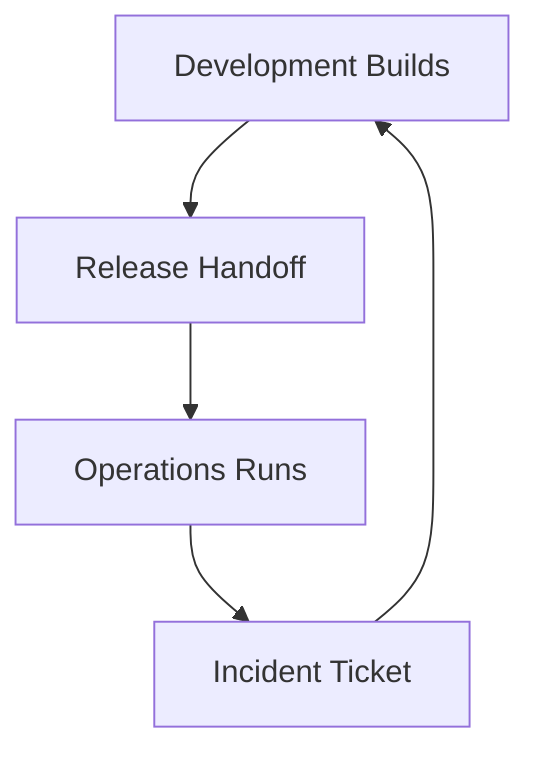
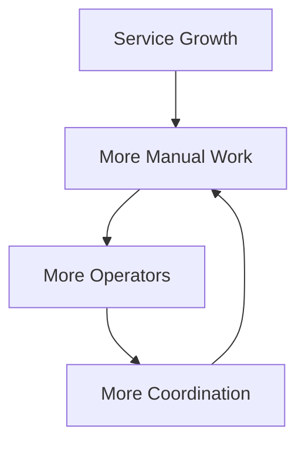
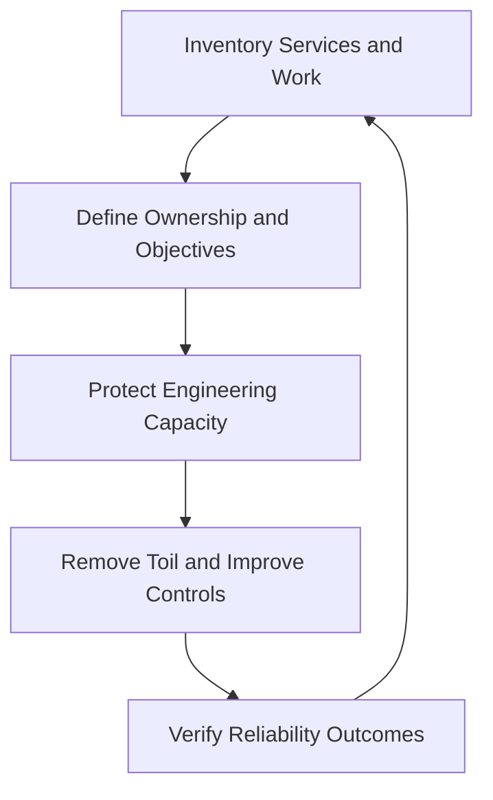

# SRE and Traditional Operations

> Traditional operations and Site Reliability Engineering share responsibility for keeping production systems dependable. SRE does not reject operations. It changes how operational responsibility is measured, staffed, automated, and connected to software engineering, product decisions, and service reliability.

## Section Purpose

Comparisons between SRE and traditional operations are often inaccurate and disrespectful.

Traditional operations is sometimes described as entirely manual, slow, reactive, or obsolete. SRE is sometimes described as operations with a new title. Neither description is sufficient.

Operations professionals have long managed critical systems, networks, databases, storage, backups, capacity, security controls, incidents, recovery, and change. Modern services still depend on that knowledge.

SRE introduces a more explicit reliability model and a strong engineering response to operational demand. It defines service reliability from the user's perspective, measures objectives, limits toil, protects engineering capacity, shares production ownership, and uses software to create lasting improvements.

This section explains:

- What traditional operations means in this comparison
- Which responsibilities traditional operations and SRE share
- How their operating assumptions differ
- Which traditional practices remain valuable
- How SRE changes ownership, measurement, automation, change, incidents, and staffing
- How IT service management and SRE can work together
- How organizations can move toward SRE without discarding operational expertise
- How to recognize renamed operations, unsafe transformation, and false comparisons

This section does not promote one universal team structure. The correct model depends on service risk, scale, regulation, architecture, workforce, and organizational context.

---

## Learning Objectives

After completing this section, you should be able to:

1. Define traditional operations without reducing it to a stereotype.
2. Explain the historical purpose and continuing value of operations work.
3. Compare traditional operations and SRE across ownership, measurement, change, automation, incidents, and staffing.
4. Identify the conditions that cause operational work to scale linearly with service growth.
5. Explain how SLOs, error budgets, and toil limits change operational decisions.
6. Distinguish necessary operational control from unnecessary bureaucracy.
7. Explain how IT service management practices can coexist with SRE.
8. Identify operational knowledge that must be preserved during transformation.
9. Design a safe transition from reactive operations to reliability engineering.
10. Evaluate whether an organization has adopted SRE or only changed job titles.

---

## 1. What Traditional Operations Means Here

Traditional operations refers to operating models in which a dedicated operations function runs, supports, controls, and restores production technology.

Common responsibilities include:

- Server and operating-system administration
- Network operations
- Database administration
- Storage management
- Backup and restoration
- Batch scheduling
- Monitoring and alert response
- Access administration
- Capacity planning
- Incident management
- Change implementation
- Vendor coordination
- Service requests
- Business continuity and disaster recovery

The term describes a broad family of models. It does not describe every operations team in the same way.

---

## 2. Traditional Operations Is Not One Thing

Operations varies across:

- Mainframe environments
- Telecommunications
- Financial services
- Government systems
- Data centers
- Managed service providers
- Enterprise applications
- Cloud environments
- Software-as-a-service companies
- Safety-critical systems

Some operations teams are highly automated and engineering-led. Others depend on manual procedures and ticket queues. A fair comparison examines actual behavior rather than the team label.

---

## 3. Why Traditional Operations Developed

Dedicated operations functions developed for valid reasons.

Organizations needed people who could:

- Maintain scarce and specialized systems
- Control access to production
- Coordinate high-risk change
- Operate services around the clock
- Preserve stability across many applications
- Respond to hardware and network failure
- Meet audit and regulatory obligations
- Maintain knowledge outside application projects

Separation also protected production from uncontrolled change when software delivery processes were weak.

---

## 4. The Expertise Inside Operations

Strong operations professionals often understand:

- Real failure behavior
- Dependency chains
- Capacity limits
- Network paths
- Storage characteristics
- Operating-system behavior
- Recovery procedures
- Change risk
- Vendor failure modes
- Historical incidents
- Organizational escalation

SRE transformation that ignores this expertise increases risk.

---

## 5. A Working Definition of SRE

Site Reliability Engineering applies software engineering, systems engineering, measurement, and production experience to keep services within explicit reliability objectives with controlled risk and sustainable human effort.

SRE commonly includes:

- Critical User Journeys
- Service Level Indicators
- Service Level Objectives
- Error budgets
- Engineering for resilience and recovery
- Production readiness
- Sustainable on-call
- Incident response and learning
- Toil measurement and reduction
- Capacity and performance engineering

SRE is not defined by a cloud provider, container platform, monitoring product, or job title.

---

## 6. The Shared Mission

Traditional operations and SRE both seek to keep important services working.

They share concerns about:

- Availability
- Performance
- Capacity
- Change risk
- Security
- Data protection
- Incident response
- Recovery
- Cost
- User and business impact

The main differences concern how this mission is translated into objectives, authority, work design, engineering investment, and organizational responsibility.

---

## 7. The Central Difference

A traditional operating model may organize work around technology assets, functional teams, tickets, procedures, and service-management processes.

SRE organizes reliability around a service, its users, critical journeys, objectives, failure modes, and accountable owners.

The distinction is not absolute. Mature operations organizations may already use service-centered practices. SRE makes the model explicit and connects it to engineering decisions.

---

## 8. Comparison at a Glance

| Dimension | Common traditional operations pattern | SRE pattern |
| --- | --- | --- |
| Primary unit | Asset, system, application, queue, or technology domain | Service and Critical User Journey |
| Reliability target | Uptime commitment, SLA, internal target, or general stability | User-centered SLI and SLO |
| Risk control | Approval, procedure, separation, and change windows | Objective evidence, automation, containment, and error-budget policy |
| Ownership | Development builds, operations runs | Shared production responsibility with explicit accountability |
| Work model | Operational demand is the team's main work | Operational work is bounded so engineering capacity is protected |
| Scaling | Add operators as demand grows | Engineer systems so human effort grows more slowly than demand |
| Automation | Automate tasks where useful | Eliminate or redesign recurring work, then automate safely where appropriate |
| Incidents | Restore service and follow escalation process | Restore user outcome, measure impact, learn, and reduce recurrence |
| Change | Stability protected through control and scheduling | Risk reduced through small, observable, reversible, contained change |
| Success | Process completion and infrastructure stability | SLO performance, risk reduction, sustainability, and user outcomes |

These are patterns, not universal rules.

---

## 9. Asset-Centered Operations

Traditional teams are often divided by technical domain:

- Server team
- Network team
- Database team
- Storage team
- Middleware team
- Backup team
- Application support team

This structure can create deep expertise and strong control of specialized systems.

It can also make end-to-end service ownership difficult when one user journey crosses every domain.

---

## 10. Service-Centered Reliability

SRE begins with the service outcome.

A service includes:

- Users or dependent systems
- Intended behavior
- Critical journeys
- Owners
- Dependencies
- Reliability objectives
- Failure modes
- Change mechanisms
- Recovery requirements

Technical components remain important, but they are evaluated according to their effect on the service.

---

## 11. Infrastructure Health Is Not Service Reliability

All servers may be reachable while users cannot complete a payment.

A database may be available while it returns stale information.

A network may pass basic checks while one customer region experiences severe packet loss.

SRE asks whether the required service behavior occurred, not only whether the components appeared healthy.

---

## 12. The Handoff Model

A common traditional lifecycle is:

The handoff can create:

- Incomplete operational knowledge
- Delayed feedback
- Conflicting incentives
- Weak application ownership
- Long incident escalation
- Documentation that becomes stale

The problem is not that responsibilities differ. The problem is that information, authority, and consequences become disconnected.

---

## 13. Shared Production Responsibility

SRE expects the people who design and change a service to remain connected to production outcomes.

Shared responsibility may include:

- Application engineers participating in on-call
- SRE influencing architecture and release decisions
- Joint incident response
- Shared SLO ownership
- Product participation in risk decisions
- Platform teams publishing clear service guarantees

Shared responsibility still requires one accountable owner for each service outcome.

---

## 14. Responsibility Requires Authority

A team cannot own reliability if it cannot influence:

- Architecture
- Code
- Configuration
- Release timing
- Capacity
- Dependencies
- Reliability priorities
- Incident mitigation
- Recovery design

Traditional operations teams are sometimes held accountable for availability while having little control over application design. Renaming that team SRE does not fix the authority gap.

---

## 15. Reliability Must Be Defined

Statements such as “keep the service stable” or “avoid downtime” are not sufficient operational requirements.

A complete objective identifies:

- The user or dependent system
- The important behavior
- The measurement method
- The target
- The time window
- Valid and excluded events
- The response when performance is unacceptable

SRE uses SLIs and SLOs to make this requirement measurable.

---

## 16. SLAs and SLOs

Traditional operations may focus on Service Level Agreements, especially where customer contracts or internal service commitments drive work.

SRE distinguishes several concepts:

| Concept | Purpose |
| --- | --- |
| SLI | Measures a defined aspect of service behavior |
| SLO | Sets an internal reliability target for an SLI |
| SLA | Defines a formal commitment and possible consequence |
| Error budget | Represents permitted unreliability under an SLO |

An SLA is not a complete internal reliability strategy. A service can remain within a weak contract while still harming users.

---

## 17. From Uptime to User Outcomes

Traditional availability reports may measure whether infrastructure was running.

SRE prefers indicators that approximate whether users succeeded.

For a payment service, useful measures may include:

- Valid authorization success
- End-to-end checkout completion
- Correct, exactly-once transaction outcome
- Confirmation latency
- Durable transaction recording

Host uptime may help diagnosis, but it is not the final outcome.

---

## 18. Error Budgets Change the Conversation

Without an explicit tolerance for failure, development may appear to want change while operations appears to want stability.

An error budget creates a shared basis for decision-making.

It helps teams decide:

- Whether normal release risk is acceptable
- Whether reliability work requires priority
- Whether controls should tighten temporarily
- Whether an exception needs formal approval
- Whether the SLO itself is appropriate

The budget does not remove judgment. It makes the evidence visible.

---

## 19. Process Compliance Versus Outcome Evidence

Traditional operations may use process adherence as evidence that work was controlled.

Examples include:

- Approved change record
- Completed checklist
- Documented backup job
- Closed incident ticket
- Signed operational acceptance

These controls can be valuable. SRE adds outcome verification.

Ask:

- Did the service remain within its objective?
- Did the backup restore correctly?
- Did the change preserve the user journey?
- Did the incident action prevent recurrence?

Completion is not the same as effectiveness.

---

## 20. The Ticket Queue

Ticket systems help record, prioritize, route, and audit work.

They become harmful when every production interaction requires a manual request to another team.

Consequences include:

- Delay
- Context loss
- Repeated approval
- Queue growth
- Ownership separation
- Hidden operational cost
- Incentives to close tickets rather than improve systems

SRE asks which requests should be eliminated, made self-service, automated, or retained for valid control reasons.

---

## 21. Operational Work Is Necessary

SRE does not eliminate all operational work.

Valuable operational work includes:

- Novel incident diagnosis
- Risk-based change review
- Capacity decisions
- Recovery exercises
- Complex maintenance
- Security response
- Service launch support
- Analysis of unexpected behavior

The objective is sustainable operation and lasting improvement, not zero human involvement.

---

## 22. Toil Is the Scaling Problem

Toil is operational work that is manual, repetitive, automatable, tactical, without enduring value, and likely to grow with service demand.

Examples include:

- Repeated restarts
- Manual account changes
- Routine capacity additions
- Recurring alert inspection
- Repeated deployment repair
- Manual configuration synchronization

A team can perform important operations while still being consumed by toil.

---

## 23. The Linear Staffing Model

If every new service, server, customer, or deployment creates similar manual work, staffing must grow with the system.

SRE seeks systems where engineering reduces the operational cost of growth.

---

## 24. Protecting Engineering Capacity

An SRE team needs protected time to create durable improvements.

Engineering work may include:

- Removing failure modes
- Building safe automation
- Improving observability
- Reducing blast radius
- Redesigning dependencies
- Improving recovery
- Eliminating recurring requests
- Developing capacity models

If operational demand consumes all available time, the team cannot engineer reliability.

---

## 25. The Toil Limit

Google's public SRE model describes a 50 percent maximum for operational work in its context. The deeper principle is more important than copying the number.

An organization should define:

- What counts as operational work
- What counts as toil
- How work is measured
- Which limit applies
- What happens when the limit is exceeded
- Who has authority to reduce commitments

A limit without an enforcement mechanism is only an aspiration.

---

## 26. Automation in Traditional Operations

Traditional operations has always used automation.

Examples include:

- Shell scripts
- Job schedulers
- Configuration systems
- Monitoring rules
- Backup software
- Provisioning systems
- Batch controls
- Network automation

It is historically inaccurate to claim that SRE introduced automation to operations.

---

## 27. The SRE Automation Difference

SRE treats automation as one possible response to operational demand.

The preferred order is often:

1. Question whether the work is required.
2. Remove the source where possible.
3. Simplify or redesign the system.
4. Standardize the safe path.
5. Automate when automation has clear value.
6. Observe and maintain the automation.

Automating an unnecessary process preserves its complexity.

---

## 28. Automation Must Be Operated

Automation introduces production responsibilities.

It requires:

- Ownership
- Testing
- Access control
- Auditability
- Observability
- Failure handling
- Rate and scope limits
- Rollback
- Maintenance
- Retirement

Unowned automation becomes another failure source.

---

## 29. Manual Control Can Still Be Correct

Manual action may be appropriate when:

- The event is rare
- Judgment is essential
- Automation cost exceeds expected value
- Consequences are severe and independent verification is required
- The process is temporary
- The failure mode is not sufficiently understood

The decision should be explicit, documented, and reviewed as conditions change.

---

## 30. Change Management

Traditional change management often protects production through:

- Change records
- Scheduled windows
- Review boards
- Separation of duties
- Approval chains
- Implementation plans
- Backout plans

These mechanisms can reduce uncontrolled change. They can also create delay without reducing risk when applied mechanically.

---

## 31. SRE Change Safety

SRE reduces change risk through technical and organizational controls such as:

- Small changes
- Automated testing
- Progressive rollout
- Canary analysis
- Blast-radius limits
- Service-level verification
- Automated stop conditions
- Rollback or roll-forward capability
- Error-budget policy

Approval may remain necessary for high-risk changes, regulated systems, or business-critical decisions.

---

## 32. Risk-Proportionate Change Control

Not every change needs the same process.

Classify changes using factors such as:

- Potential user impact
- Blast radius
- Reversibility
- Novelty
- Data risk
- Security risk
- Dependency risk
- Timing
- SLO condition

Low-risk, well-tested, reversible changes may follow an automated path. High-risk changes may require deeper review and coordinated execution.

---

## 33. Change Windows

Change windows can coordinate people and reduce exposure during sensitive periods.

They can also create:

- Large batches
- Long delays
- High-pressure releases
- Difficult diagnosis
- Accumulated security risk

Use a window when its risk benefit is clear. Do not treat the calendar as proof that a change is safe.

---

## 34. Separation of Duties

Separation of duties reduces fraud, error, and unauthorized activity by preventing one person from controlling an entire sensitive process.

SRE does not require its removal.

Modern implementation may include:

- Peer review
- Policy-as-code
- Protected branches
- Short-lived authorization
- Independent production approval
- Recorded emergency access
- Automated evidence

The control objective should remain even when the mechanism changes.

---

## 35. Incident Management

Traditional operations developed valuable incident-management practices, including:

- Severity classification
- Escalation
- Coordination
- Communication
- Service restoration
- Vendor engagement
- Incident records

SRE builds on these practices and connects them more directly to user impact, service objectives, engineering ownership, and learning.

---

## 36. Restore the User Outcome

An incident is not resolved merely because:

- A server restarted
- An alert cleared
- A ticket closed
- Traffic moved
- A dashboard became green

Recovery must verify that the required user behavior is restored and that the resulting state is safe.

---

## 37. Incident Command

A scalable incident response separates responsibilities.

Common roles include:

- Incident commander
- Operations lead
- Communications lead
- Subject-matter experts
- Scribe

The exact structure depends on severity. The essential principle is clear authority and coordinated work under pressure.

---

## 38. Escalation Must Add Capability

Escalation should add:

- Knowledge
- Authority
- Capacity
- Vendor access
- Business decision-making

Repeatedly escalating a ticket without changing available capability only moves the queue.

---

## 39. Problem Management and SRE Learning

Traditional problem management seeks to understand and manage causes of incidents.

SRE shares this goal through:

- Post-incident review
- Failure analysis
- Corrective engineering
- Risk acceptance
- Follow-up verification
- Reliability backlog management

The terminology may differ. The quality of evidence and resulting change matters more than the label.

---

## 40. Blameless Learning

SRE examines the conditions under which actions made sense at the time.

A review should consider:

- System design
- Interfaces
- Procedures
- Training
- Workload
- Incentives
- Time pressure
- Missing information
- Successful adaptations

Blameless does not mean accountless. Reckless or malicious behavior still requires an appropriate organizational response.

---

## 41. On-Call and Shift Operations

Traditional operations may use staffed shifts, network operations centers, service desks, or follow-the-sun teams.

SRE often uses engineering on-call rotations.

Neither arrangement is automatically superior. Evaluate:

- Coverage requirement
- Alert frequency
- Expertise needed
- Handoff quality
- Fatigue
- Escalation speed
- Decision authority
- Connection to corrective engineering

The model must be safe for both users and responders.

---

## 42. The Network Operations Center

A Network Operations Center can provide continuous visibility, initial triage, coordination, and communication.

It becomes ineffective when staff:

- Receive nonactionable alerts
- Lack authority
- Follow scripts that cannot address the failure
- Escalate without context
- Measure ticket closure instead of service restoration

SRE can work with a NOC if detection, escalation, ownership, and feedback are designed clearly.

---

## 43. The Service Desk

A service desk manages user contact, requests, and initial support.

It is not the same as SRE.

Service-desk evidence can still help reliability work by revealing:

- User-visible failures
- Affected segments
- Repeated requests
- Poor error messages
- Undetected incidents
- Product confusion

Feedback should reach service owners without unnecessary delay.

---

## 44. Monitoring Versus Observability

Traditional monitoring often checks known conditions and thresholds.

Observability supports investigation of internal system state through available outputs, especially when failures were not predicted in advance.

SRE needs both:

- Monitoring for known, actionable conditions
- Rich telemetry for diagnosis
- Service-level indicators for user outcomes
- Logs, metrics, traces, profiles, events, and change context where appropriate

Installing telemetry tools does not create observability by itself.

---

## 45. Alerting Philosophy

Traditional environments may alert on many component thresholds.

SRE asks whether an alert requires timely human action to protect a service objective.

An effective alert identifies:

- The affected service
- The meaningful condition
- The expected responder
- The urgency
- Relevant context
- A safe starting action

Nonactionable alerts create fatigue and hide real failure.

---

## 46. Capacity Management

Traditional operations has long performed capacity planning.

SRE extends this work with service demand models, automation, performance engineering, and explicit risk.

A capacity model should include:

- Demand forecast
- Critical resources
- Saturation point
- Required headroom
- Scaling delay
- Dependency limits
- Degraded behavior
- Emergency actions

Automatic scaling does not remove the need for capacity engineering.

---

## 47. Availability Management

Traditional availability management may track component uptime, maintenance, and service commitments.

SRE adds:

- User-centered success measures
- Objective windows
- Error-budget consumption
- Burn-rate detection
- Dependency analysis
- Decision policies

Availability percentages must be paired with duration, distribution, affected users, correctness, and business timing.

---

## 48. Backup Is Not Recovery

Operations teams have long managed backups. SRE requires evidence that data and service can be restored.

Verify:

- Backup completeness
- Integrity
- Encryption
- Access
- Retention
- Isolation
- Restoration time
- Recovered data correctness
- Application compatibility
- Return to normal operation

A successful backup job is not proof of recoverability.

---

## 49. Disaster Recovery

Traditional disaster recovery commonly uses plans, alternate sites, backups, replication, and scheduled exercises.

SRE connects recovery to:

- Service criticality
- RTO and RPO
- SLOs
- Dependency behavior
- Automation
- Data validation
- Incident command
- Measured exercise results

Recovery plans must be executable under realistic failure conditions.

---

## 50. Configuration Management

Traditional operations may maintain inventories, approved baselines, and controlled configuration records.

SRE and modern engineering practices may add:

- Declarative configuration
- Version control
- Automated validation
- Policy checks
- Reconciliation
- Drift detection
- Progressive rollout

The goal is known, reviewable, recoverable state. A configuration database and code-managed configuration can complement each other when boundaries are clear.

---

## 51. The CMDB Question

A Configuration Management Database can support dependency, ownership, audit, and change analysis.

It fails when records are:

- Manually maintained without verification
- Too detailed to remain current
- Disconnected from deployment systems
- Missing service relationships
- Treated as authoritative despite known drift

Prefer automated discovery, clear ownership, limited required fields, and freshness indicators.

---

## 52. Standard Operating Procedures

Procedures are valuable when they capture repeatable, safety-critical work.

Strong procedures are:

- Owned
- Tested
- Current
- Clear about prerequisites
- Explicit about risk
- Verifiable
- Designed for stressed responders

SRE does not reject procedures. It also asks whether the system can remove or safely automate the recurring need.

---

## 53. Runbooks

A runbook guides operational action for a defined condition.

A useful runbook contains:

- Trigger and scope
- Preconditions
- Diagnostic evidence
- Safe actions
- Stop conditions
- Escalation
- Verification
- Rollback
- Owner
- Review date

Blind execution is dangerous. Responders need enough understanding to recognize when the procedure does not fit.

---

## 54. Knowledge Concentration

Traditional environments may depend on a few long-serving experts who remember system history and hidden dependencies.

SRE reduces this risk through:

- Shared on-call
- Documentation
- Pairing
- Automation
- Exercises
- Service ownership records
- Incident learning
- Rotation where appropriate

The goal is not to replace experts. It is to make their knowledge a durable team capability.

---

## 55. Vendor and Managed-Service Dependencies

Operations teams often manage providers and support contracts.

SRE adds service-level analysis:

- Does the vendor commitment support the service SLO?
- How is vendor failure detected?
- What control remains with the organization?
- Is failover independent?
- How long does escalation take?
- What evidence supports recovery claims?

Outsourcing a component does not outsource accountability for the user outcome.

---

## 56. IT Service Management and SRE

IT Service Management, or ITSM, provides structured practices for managing technology services.

Relevant practices may include:

- Incident management
- Problem management
- Change enablement
- Service-level management
- Configuration management
- Capacity and performance management
- Availability management
- Service continuity management
- Knowledge management

SRE and ITSM can coexist. Conflict usually arises from rigid implementation, unclear ownership, or controls that are disconnected from actual risk.

---

## 57. Translate Control Objectives, Not Just Terminology

When integrating SRE with ITSM, identify the control objective behind each process.

| Control objective | Possible modern implementation |
| --- | --- |
| Authorized change | Reviewed code, policy checks, and controlled deployment identity |
| Traceable change | Version history and deployment event record |
| Risk review | Automated classification with deeper review for high-risk change |
| Separation of duties | Peer approval, protected environments, and short-lived access |
| Incident record | Automatically created timeline linked to service evidence |
| Configuration accuracy | Discovery and reconciliation from authoritative systems |

Do not remove a necessary control without providing an effective replacement.

---

## 58. Compliance and Audit

Regulated organizations may require evidence of:

- Authorization
- Access control
- Change history
- Incident handling
- Recovery tests
- Data protection
- Control ownership

SRE can strengthen evidence through automation and reliable system records.

Compliance does not require every control to be manual. The organization must show that the control is designed appropriately, operates effectively, and produces trustworthy evidence.

---

## 59. Security and Reliability

Traditional operations and SRE both contribute to secure operation.

Shared concerns include:

- Patch management
- Privileged access
- Secrets
- Network controls
- Logging
- Vulnerability response
- Backup protection
- Recovery after compromise

Security and reliability decisions must be coordinated. A rushed reliability mitigation can create exposure, while an inaccessible control can delay safe recovery.

---

## 60. Cost and Efficiency

Traditional operations may measure staffing, licenses, hardware use, and vendor spend.

SRE connects cost to service behavior and risk.

Questions include:

- Which reliability level is worth its cost?
- Which redundancy provides meaningful protection?
- Which toil consumes expensive engineering time?
- Which failure creates the largest expected loss?
- Which automation has a maintainable return?

Cost reduction that materially weakens reliability is a risk decision, not an automatic efficiency gain.

---

## 61. What SRE Should Preserve

An SRE transition should preserve:

- Production discipline
- Systems knowledge
- Network and storage expertise
- Incident coordination
- Capacity experience
- Recovery practice
- Change-risk awareness
- Security control knowledge
- Business continuity relationships
- Service history

The aim is to combine this foundation with software engineering, user-centered measurement, and sustainable work design.

---

## 62. What SRE Should Change

SRE should challenge:

- Unlimited manual demand
- Ownership by ticket queue
- Responsibility without authority
- Infrastructure-only health measures
- Large, risky change batches
- Alert volume as coverage
- Repeated incidents without engineering action
- Hero-dependent recovery
- Documentation without verification
- Staffing growth as the default scaling strategy

Change should follow evidence, not fashion.

---

## 63. Renaming Operations Is Not Transformation

Warning signs include:

- Every operator receives an SRE title overnight.
- Responsibilities remain unchanged.
- The team still cannot change application code.
- No SLOs or error-budget policies exist.
- Toil is not measured.
- All work arrives through tickets.
- Engineering time is not protected.
- Product teams remain absent from incidents.

This is a title change, not an operating-model change.

---

## 64. Replacing Operations Without Knowledge Transfer

Removing an operations function before transferring knowledge can cause:

- Unknown dependencies
- Missed maintenance
- Failed backups
- Unowned certificates
- Incomplete escalation paths
- Lost vendor relationships
- Unsafe access
- Recovery failure

Transformation must inventory and transfer both documented and tacit knowledge.

---

## 65. Automation-First Transformation

Automating every existing operation can reproduce:

- Unnecessary approvals
- Incorrect assumptions
- Excessive privilege
- Unsafe global actions
- Poor service boundaries
- Unowned complexity

Begin with the service outcome and risk. Remove, simplify, or redesign work before automating it.

---

## 66. Cloud Does Not Automatically Create SRE

Moving infrastructure to a cloud provider can change provisioning, scaling, ownership, and cost.

It does not automatically create:

- SLOs
- Sustainable on-call
- Safe deployments
- Reliable recovery
- Shared ownership
- Toil control
- Incident learning

Manual data-center operations can become manual cloud operations with higher speed and a larger blast radius.

---

## 67. Kubernetes Does Not Automatically Create SRE

Kubernetes can provide scheduling, reconciliation, rollout, and failure-recovery mechanisms.

It also introduces:

- Control-plane dependencies
- Cluster lifecycle work
- Networking complexity
- Resource-management risk
- Workload and platform ownership questions

A container platform is infrastructure. SRE is the reliability discipline applied to the service and platform outcomes.

---

## 68. A Safe Transition Model

Transition is iterative. It should improve production safety while changing the operating system.

---

## 69. Step 1: Establish the Baseline

Inventory:

- Services
- Owners
- Users
- Dependencies
- Alerts
- Incidents
- Requests
- Changes
- Operational tasks
- Capacity risks
- Recovery capabilities
- On-call load

Do not assume that an incomplete service catalog represents the complete environment.

---

## 70. Step 2: Define Service Boundaries

For each service, record:

- Purpose
- Users
- Critical journeys
- Accountable team
- Dependencies
- Data
- Failure modes
- Support expectation
- Change mechanism
- Recovery requirement

This converts asset ownership into service accountability.

---

## 71. Step 3: Create Initial Reliability Objectives

Start with a small number of meaningful indicators.

Use:

- User-centered success
- Useful latency
- Correctness
- Durability
- Timeliness

Avoid creating dozens of objectives before the organization can act on them.

---

## 72. Step 4: Measure Operational Demand

Record:

- Pages
- Tickets
- Manual changes
- Interruptions
- Repeated recovery
- Shift handoffs
- Escalations
- Time spent
- Cognitive load
- Growth rate

Separate necessary operations, toil, engineering work, and organizational overhead.

---

## 73. Step 5: Select High-Value Engineering Work

Prioritize work using:

- User harm
- Incident frequency
- Time consumed
- Growth pressure
- Security exposure
- Recovery risk
- Engineering cost
- Confidence in the proposed improvement

Do not choose automation only because it is technically interesting.

---

## 74. Step 6: Redesign Ownership and On-Call

Define:

- Accountable service team
- Primary responders
- Application-team participation
- Operations and SRE roles
- Escalation
- Decision authority
- Handoff expectations
- Maximum sustainable load

Change rotations gradually and train responders before transferring responsibility.

---

## 75. Step 7: Modernize Controls Safely

For each current control:

1. State its purpose.
2. Identify the risk it addresses.
3. Measure whether it works.
4. Remove unnecessary steps.
5. Automate repeatable evidence where appropriate.
6. Preserve required approval and separation.
7. Test the replacement before retiring the old path.

Control modernization is an engineering and governance activity.

---

## 76. Step 8: Verify the Transition

Measure whether the change improved:

- SLO performance
- Detection
- Recovery
- Change safety
- Toil
- Ticket volume
- On-call sustainability
- Engineering capacity
- Ownership clarity
- Recovery evidence

A new organization chart is not sufficient proof.

---

## 77. Production Scenario: The Renamed Operations Team

A company changes the operations team's title to SRE. The team still handles server tickets, deployments, alerts, backups, and every incident. It cannot modify application code or reject an unsafe launch.

### Analysis

The organization has not established SRE. Responsibility remains disconnected from authority, and no engineering capacity is protected.

### Appropriate actions

1. Define service ownership.
2. Measure operational work and toil.
3. Give the team appropriate engineering authority.
4. Require application-team production participation.
5. Introduce SLOs and an engagement model.

---

## 78. Production Scenario: The Approval Bottleneck

Every production change requires a weekly review board. Most changes are routine, automatically tested, reversible, and low risk. Emergency changes bypass the board completely.

### Analysis

The process delays ordinary work while providing weak control during the highest-risk situation.

### Appropriate actions

1. Define change-risk classes.
2. Automate approval for standard low-risk changes.
3. Preserve deeper review for high-risk changes.
4. Record emergency authority and evidence.
5. Measure change outcomes, not approval count.

---

## 79. Production Scenario: Green Infrastructure, Failed Service

The server, database, and network dashboards remain green. Customers cannot complete orders because an event schema changed between two services.

### Analysis

Component monitoring did not represent the end-to-end user journey.

### Appropriate actions

1. Define the order-completion journey.
2. Add success, correctness, and latency indicators.
3. Test interface compatibility during delivery.
4. Alert on material service impact.
5. Assign end-to-end ownership.

---

## 80. Production Scenario: Automation With Excessive Privilege

An operations script has permanent administrator credentials and can modify every production account. It saves time but has no scope limit, peer review, or audit trail.

### Analysis

The automation reduced manual effort while increasing security and reliability risk.

### Appropriate actions

1. Define the minimum required permissions.
2. Use short-lived workload identity.
3. Limit scope and rate.
4. Add review, testing, and audit evidence.
5. Create safe failure and recovery behavior.

---

## 81. Production Scenario: Failed Knowledge Transfer

A senior database administrator retires after a cloud migration. During the next incident, the team discovers that a critical recovery sequence and vendor escalation path were never transferred.

### Analysis

The transformation moved technology but not operational capability.

### Appropriate actions

1. Inventory undocumented procedures and relationships.
2. Pair engineers during real and simulated work.
3. Test recovery without the original expert.
4. Record ownership and escalation.
5. Verify the knowledge through exercises.

---

## 82. Production Scenario: SRE Rejects Every Manual Task

An SRE team refuses a rare, high-risk recovery procedure because it is manual. Automating it would require substantial complexity and would be used once every several years.

### Analysis

The team has confused automation with the objective. A tested manual procedure may be the safer choice.

### Appropriate actions

1. Evaluate frequency, risk, and automation cost.
2. Improve the manual procedure and safeguards.
3. Exercise it regularly.
4. Automate validation where useful.
5. Review the decision when conditions change.

---

## 83. Practical Exercise: Compare Operating Models

Choose one service and document its current operating model.

Compare:

- Unit of ownership
- Reliability target
- Change process
- Alerting
- Incident response
- Recovery
- Operational workload
- Engineering authority

Identify three practices to preserve and three practices to change.

---

## 84. Practical Exercise: Map a Ticket Queue

Review one month of operational requests.

Classify each request as:

- Necessary judgment
- Valid control
- Toil
- Self-service candidate
- Elimination candidate
- Engineering defect

Estimate time, frequency, risk, and growth. Select one improvement and define how success will be verified.

---

## 85. Practical Exercise: Translate a Change Control

Choose one existing change process.

Document:

1. The control objective.
2. The risk addressed.
3. Current evidence.
4. Delay and failure created by the process.
5. A risk-proportionate design.
6. Automated and manual safeguards.
7. Verification criteria.

Do not remove required controls without authorized review.

---

## 86. Practical Exercise: Build a Service SLO

Select one service currently measured by infrastructure uptime.

Define:

- User
- Critical journey
- Valid events
- Successful outcome
- Useful latency
- SLI
- Initial SLO
- Measurement window
- Error-budget response

Compare the new measure with the old uptime report.

---

## 87. Practical Exercise: Measure Toil

For two weeks, record recurring operational work.

Capture:

- Task
- Trigger
- Frequency
- Time
- Interruption
- Risk
- Required judgment
- Growth driver
- Candidate response

Calculate the portion of team capacity consumed and identify the largest preventable source.

---

## 88. Practical Exercise: Test Knowledge Resilience

Choose a critical operation normally performed by one expert.

Ask another qualified engineer to execute it in a controlled environment using the available documentation.

Observe:

- Missing prerequisites
- Hidden decisions
- Unsafe steps
- Access gaps
- Verification gaps
- Escalation gaps

Update the system, procedure, and training based on the result.

---

## 89. Practical Exercise: Design a Transition Plan

Create a 90-day plan for one service.

### Days 1 to 30

- Establish ownership
- Map the service
- Baseline incidents, changes, alerts, and toil
- Identify critical risk

### Days 31 to 60

- Define initial SLOs
- Improve high-value alerts
- Transfer critical knowledge
- Select one toil-reduction project

### Days 61 to 90

- Introduce decision policy
- Test recovery
- Redesign on-call or escalation
- Verify outcomes

Do not attempt an organization-wide title change as a substitute for this work.

---

## 90. Operating-Model Assessment Checklist

### Service definition

- [ ] Production services are identified.
- [ ] Critical user journeys are known.
- [ ] One accountable owner exists for each service.
- [ ] Dependencies and failure modes are documented.

### Reliability

- [ ] User-centered SLIs exist.
- [ ] SLOs guide decisions.
- [ ] Error-budget responses are defined.
- [ ] Component health is not treated as complete service evidence.

### Work design

- [ ] Necessary operations and toil are distinguished.
- [ ] Operational demand is measured.
- [ ] Engineering capacity is protected.
- [ ] Repeated work has an owner and reduction plan.

### Change and control

- [ ] Change controls are proportionate to risk.
- [ ] Low-risk paths are repeatable and automated where appropriate.
- [ ] High-risk changes receive suitable review.
- [ ] Control evidence is trustworthy.

### Incidents and recovery

- [ ] Alerts require meaningful action.
- [ ] Incident authority is clear.
- [ ] Recovery verifies user outcomes.
- [ ] Corrective actions are owned and checked.
- [ ] Backups and disaster recovery are tested.

### People and knowledge

- [ ] On-call or shift work is sustainable.
- [ ] Responsibility is matched by authority.
- [ ] Critical knowledge is shared.
- [ ] Operations expertise is preserved during change.

---

## 91. Reflection Questions

1. Which parts of your current operations model protect the organization from real risk?
2. Which parts exist mainly because the system has always worked that way?
3. Does the team own assets, queues, or complete service outcomes?
4. Can operations influence the applications it is expected to keep reliable?
5. Which manual work grows with service demand?
6. Which component metric is mistaken for user success?
7. Does a completed change record prove a safe change?
8. Can the service recover without its most experienced operator?
9. Which SRE practice already exists under another name?
10. What evidence would prove that a transition improved reliability?

---

## 92. Knowledge Check

1. Why is traditional operations not one uniform operating model?
2. What expertise should an SRE transition preserve?
3. What is the central unit of SRE reliability analysis?
4. Why can infrastructure be healthy while a service is unreliable?
5. How does an error budget change the development and operations conversation?
6. Why is process completion not sufficient evidence of effectiveness?
7. What causes operational work to scale linearly?
8. How does SRE treat automation differently from simple task automation?
9. When can manual control be appropriate?
10. How can ITSM and SRE coexist?
11. Why is renaming an operations team insufficient?
12. What must be measured to verify an SRE transition?

---

## 93. Knowledge Check Answers

1. Operations practices vary by industry, technology, risk, regulation, maturity, and organizational design.
2. Production, systems, network, storage, incident, capacity, recovery, control, vendor, and service-history knowledge.
3. A service and the critical user outcomes it provides.
4. Component checks may pass while an end-to-end journey is slow, incorrect, partial, stale, or unavailable.
5. It provides shared evidence for balancing delivery risk, acceptable failure, and reliability investment.
6. A completed process may not produce the intended service, control, or recovery outcome.
7. Manual tasks that repeat or increase with services, users, infrastructure, changes, or incidents.
8. SRE first questions, removes, simplifies, or redesigns work, then automates when appropriate and operates the automation safely.
9. When work is rare, judgment is essential, automation is not economical, or independent human control addresses severe risk.
10. Preserve valid service-management objectives while using SRE measurement, engineering, automation, and service ownership to implement them effectively.
11. A title does not create SLOs, authority, engineering capacity, toil control, shared ownership, or learning.
12. Service reliability, detection, recovery, change safety, toil, operational load, ownership, engineering capacity, and human sustainability.

---

## 94. Key Takeaways

- Traditional operations contains valuable expertise and practices that modern services still need.
- SRE does not eliminate operations. It applies an explicit reliability and engineering model to operational responsibility.
- Traditional operations and SRE overlap in availability, incidents, capacity, change, security, and recovery.
- SRE centers reliability on services, users, Critical User Journeys, SLIs, and SLOs.
- Error budgets make reliability risk part of delivery and product decisions.
- Toil limits protect the engineering capacity needed for lasting improvement.
- Automation existed before SRE. SRE adds a disciplined decision about what to remove, redesign, automate, and maintain.
- Process controls remain valuable when they address real risk and produce effective evidence.
- ITSM and SRE can coexist when objectives, ownership, and implementation are clear.
- Cloud platforms, Kubernetes, monitoring tools, and title changes do not automatically create SRE.
- A safe transition preserves operational knowledge, changes responsibility and authority, and verifies production outcomes.

---

## 95. Authoritative Resources

### Site Reliability Engineering

- [Google SRE](https://sre.google/)
- [Google SRE Book: Introduction](https://sre.google/sre-book/introduction/)
- [Google SRE Book: Eliminating Toil](https://sre.google/sre-book/eliminating-toil/)
- [Google SRE Book: Monitoring Distributed Systems](https://sre.google/sre-book/monitoring-distributed-systems/)
- [Google SRE Book: Managing Incidents](https://sre.google/sre-book/managing-incidents/)
- [Google SRE Workbook: On-Call](https://sre.google/workbook/on-call/)
- [Google SRE Workbook: SRE Engagement Model](https://sre.google/workbook/engagement-model/)
- [Google SRE Workbook: Organizational Change Management in SRE](https://sre.google/workbook/organizational-change/)

### Service Management and Control Context

- [PeopleCert ITIL](https://www.peoplecert.org/browse-certifications/it-governance-and-service-management/ITIL-1)
- [NIST Cybersecurity Framework](https://www.nist.gov/cyberframework)
- [NIST Contingency Planning Guide for Federal Information Systems](https://csrc.nist.gov/pubs/sp/800/34/r1/upd1/final)

### Reliability and Recovery

- [Google Cloud Architecture Framework: Reliability](https://cloud.google.com/architecture/framework/reliability)
- [Google Cloud: Architecting Disaster Recovery](https://cloud.google.com/architecture/disaster-recovery)

### Source Interpretation

Google's publications describe SRE using Google's experience and a public operating model that organizations adapt to their own conditions. ITIL provides a broader service-management framework. NIST publications provide risk, security, and contingency-planning guidance. These sources have different purposes and should not be treated as competing universal organization charts.

---

## 96. Related SRE World Sections

- [What Is SRE](./01-What-Is-SRE.md)
- [History and Evolution of SRE](./02-History-and-Evolution-of-SRE.md)
- [The SRE Mindset](./03-The-SRE-Mindset.md)
- [Fault Tolerance and Disaster Recovery](./07-Fault-Tolerance-and-Disaster-Recovery.md)
- [Production Responsibility](./08-Production-Responsibility.md)
- [Service Ownership](./09-Service-Ownership.md)
- [Engineering Work and Operational Work](./12-Engineering-Work-and-Operational-Work.md)
- [Toil](./13-Toil.md)
- [SRE and DevOps](./14-SRE-and-DevOps.md)
- [SRE Foundations](./README.md)

---

## Next Section

[Section 16: SRE and Platform Engineering](./16-SRE-and-Platform-Engineering.md)

---

## Maintained by VERIQTA

SRE World is created and maintained by [VERIQTA](https://github.com/veriqta).

- Website: [veriqta.com](https://www.veriqta.com/)
- GitHub: [github.com/veriqta](https://github.com/veriqta)
- Instagram: [@veriqta](https://www.instagram.com/veriqta/)
- Medium: [veriqta.medium.com](https://veriqta.medium.com/)

> Strong SRE does not erase operations knowledge. It turns that knowledge into measurable reliability, safer systems, sustainable work, and lasting engineering improvement.
