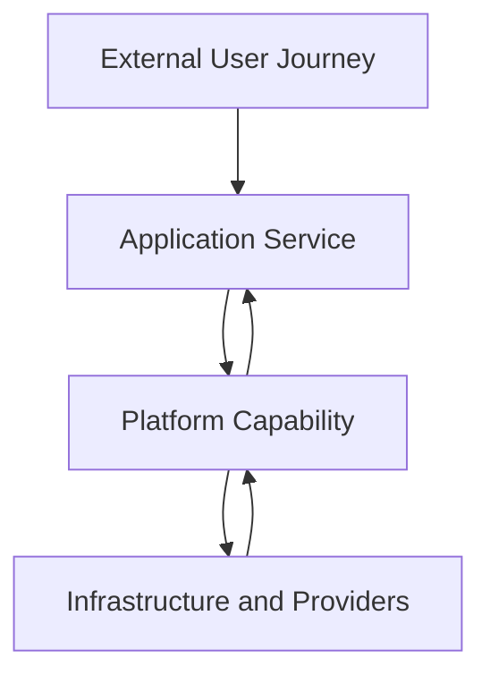

# SRE and Platform Engineering

> Platform engineering creates and operates shared capabilities that other teams use to build and run services. Site Reliability Engineering protects defined service outcomes through reliability objectives, production engineering, risk control, incident response, and sustainable operations. A platform may enable SRE, require SRE, or be an SRE-owned service, but the disciplines are not interchangeable.

## Section Purpose

SRE and platform engineering are frequently combined, confused, or placed under the same team.

The confusion is understandable. Both disciplines may work on infrastructure, automation, observability, delivery systems, Kubernetes, cloud services, security controls, self-service, and production operations. Both seek to reduce repeated work and make complex systems safer to use.

Their primary responsibilities are different.

Platform engineering creates shared products and capabilities for internal users. SRE defines, measures, and engineers the reliability of services. A platform team asks whether its users can obtain and use the capabilities they need. An SRE practice asks whether a service delivers its required user outcomes within an agreed reliability boundary.

This section explains:

- What platforms and platform engineering mean
- How platform engineering differs from infrastructure engineering and tool administration
- How SRE and platform engineering overlap
- How their users, objectives, responsibilities, and measures differ
- How platform reliability affects workload reliability
- How to define ownership across platform, SRE, and application teams
- How to design self-service without hiding risk
- How golden paths, paved roads, escape paths, control planes, and platform APIs affect reliability
- How platforms can reduce toil without becoming another source of toil
- How to evaluate platform and SRE operating models in production

This section is not a catalog of platform tools. It focuses on service boundaries, reliability, operating responsibilities, failure modes, and evidence.

---

## Learning Objectives

After completing this section, you should be able to:

1. Define platform engineering and SRE separately.
2. Explain why a platform must be treated as a production service.
3. Identify the users, interfaces, capabilities, and dependencies of an internal platform.
4. Distinguish platform availability from application reliability.
5. Define ownership boundaries between platform, SRE, and workload teams.
6. Create platform SLIs and SLOs from user journeys.
7. Explain how self-service, golden paths, and policy controls affect reliability.
8. Identify platform failure domains and concentration risk.
9. Evaluate whether a platform reduces or redistributes toil.
10. Design an operating model in which platform engineering and SRE reinforce each other.

---

## 1. A Working Definition of Platform Engineering

Platform engineering is the discipline of designing, building, operating, and improving shared capabilities that internal users consume through defined interfaces.

A platform may provide:

- Compute and runtime environments
- Networking
- Storage and data services
- Identity and secrets
- Build and delivery capabilities
- Observability foundations
- Service templates
- Policy enforcement
- Service discovery
- Cost and capacity information
- Operational workflows

The platform integrates these capabilities into a usable internal product.

---

## 2. A Working Definition of SRE

Site Reliability Engineering applies software engineering, systems engineering, measurement, and production experience to keep services within explicit reliability objectives while controlling risk and human workload.

SRE commonly uses:

- Critical User Journeys
- Service Level Indicators
- Service Level Objectives
- Error budgets
- Production readiness
- Incident response
- On-call
- Toil control
- Capacity engineering
- Resilience and recovery engineering

The primary object is a service and the outcome it provides.

---

## 3. The Short Answer

Platform engineering builds and operates reusable internal capabilities.

SRE makes service reliability explicit, measurable, and governable.

A platform team may practice SRE for its own platform. An SRE team may build platform capabilities used by many services. Neither fact makes the disciplines identical.

---

## 4. Why the Disciplines Are Confused

Both may work with:

- Cloud infrastructure
- Containers and orchestration
- Infrastructure APIs
- Delivery automation
- Observability
- Identity
- Reliability controls
- Incident response
- Capacity
- Production standards

Organizations also use the same team for both functions or change team names without changing responsibilities.

Shared technology does not prove shared purpose.

---

## 5. Different Centers of Gravity

| Discipline | Central concern |
| --- | --- |
| Platform engineering | Provide reusable capabilities through safe, usable, supported interfaces |
| SRE | Keep services within explicit reliability objectives with controlled risk and sustainable operations |

Platform engineering is organized around a platform product and its consumers.

SRE is organized around reliability outcomes and production responsibility.

---

## 6. The Platform Is a Product

A platform is not merely a collection of installed tools.

A product-oriented platform has:

- Defined users
- User needs
- Supported use cases
- Interfaces
- Service commitments
- Owners
- A roadmap
- Feedback mechanisms
- Operational support
- Lifecycle management

If a team assembles technology without understanding who will use it and why, it has an infrastructure collection rather than a complete platform product.

---

## 7. Internal Users Are Real Users

Platform users may include:

- Application teams
- SRE teams
- Data teams
- Security teams
- Operations teams
- Infrastructure teams
- Machine learning teams
- Automated systems
- Auditors and governance functions

Internal status does not reduce the need for reliability, support, clear interfaces, and safe change.

---

## 8. The Platform User Journey

A platform user may need to:

1. Discover an approved capability.
2. Request or provision it.
3. Configure it safely.
4. Deploy a workload.
5. Observe its state.
6. Change or scale it.
7. Diagnose failure.
8. Recover or retire it.

Each step can become a Critical User Journey for the platform.

---

## 9. Platform Capabilities and Platform Interfaces

A capability is what the platform makes possible.

An interface is how a user requests, configures, observes, or controls that capability.

Interfaces may include:

- APIs
- Command-line interfaces
- Portals
- Declarative configuration
- Templates
- Documentation
- Support channels

A reliable backend with an unusable or misleading interface can still create an unreliable platform experience.

---

## 10. Platform Engineering Is Not Tool Administration

Maintaining a tool can be part of platform work, but tool administration alone does not establish platform engineering.

A platform team must also answer:

- Who are the users?
- Which problem does the capability solve?
- What interface is supported?
- Which guarantee applies?
- How is feedback collected?
- How is the capability operated and retired?
- What is the user's responsibility?

Tool uptime is not the same as platform value.

---

## 11. Platform Engineering Is Not Only Kubernetes

Kubernetes may provide a runtime foundation. A platform may also include:

- Identity
- Networking
- Delivery
- Data services
- Policy
- Observability
- Documentation
- Support
- Recovery workflows

A cluster is not automatically an internal platform. A useful platform presents integrated capabilities around real user needs.

---

## 12. Platform Engineering Is Not Only a Portal

A portal can improve discovery and provide a consistent interface.

It does not prove that the underlying capabilities are:

- Reliable
- Secure
- Supported
- Observable
- Recoverable
- Cost controlled
- Correctly owned

A polished front end cannot repair weak service contracts or unreliable backing systems.

---

## 13. Platform Engineering and Infrastructure Engineering

Infrastructure engineering designs and operates foundational compute, network, storage, identity, and related systems.

Platform engineering composes or exposes infrastructure and shared services through user-oriented interfaces.

One team may perform both roles, but the responsibilities remain distinguishable.

| Infrastructure concern | Platform concern |
| --- | --- |
| Build and operate a network | Provide an approved network capability through a supported interface |
| Operate a runtime | Make workload deployment and operation consistent and safe |
| Manage storage | Offer storage classes with clear guarantees and use conditions |
| Run identity systems | Provide understandable workload and user identity workflows |

---

## 14. Platform Engineering and DevOps

DevOps provides broad principles for collaboration, flow, feedback, automation, shared responsibility, and learning.

Platform engineering can implement some of those principles by creating reusable self-service capabilities and reducing coordination across teams.

SRE can implement related principles through SLOs, error budgets, toil control, on-call, and reliability engineering.

DevOps, platform engineering, and SRE overlap, but they answer different questions.

---

## 15. Detailed Comparison

| Dimension | Platform engineering | SRE |
| --- | --- | --- |
| Primary object | Internal platform product | Production service reliability |
| Primary user | Teams and systems consuming platform capabilities | Users or systems depending on the supported service |
| Main question | Can users obtain and use safe shared capabilities effectively? | Does the service meet its required reliability outcome? |
| Core output | Interfaces, capabilities, templates, policies, and support | Reliability objectives, production engineering, response, and risk decisions |
| Measurement | Adoption, task success, fulfillment, reliability, satisfaction, and organizational impact | SLIs, SLOs, error budgets, incidents, toil, capacity, and recovery |
| Operating scope | Platform and capability lifecycle | Service lifecycle through a reliability lens |
| Failure concern | Platform failure and harmful platform behavior | Any failure that harms the protected service outcome |
| Tool dependence | None | None |

---

## 16. Where They Overlap

Both disciplines may contribute to:

- Automation
- Production architecture
- Observability
- Capacity
- Resilience
- Incident response
- Change safety
- Security controls
- Documentation
- Toil reduction
- Standardization
- Recovery

Overlap requires explicit ownership, not duplicate teams solving the same problem independently.

---

## 17. The Platform as a Production Service

An internal platform has users, dependencies, failure modes, changes, and operational commitments.

It therefore needs:

- Ownership
- Reliability objectives
- Observability
- On-call or support coverage
- Capacity planning
- Incident response
- Change controls
- Recovery procedures
- Lifecycle management

Internal services do not become less important simply because external customers do not access them directly.

---

## 18. Platform Critical User Journeys

Examples include:

- Create a service environment
- Deploy a new version
- Obtain workload identity
- Provision a database
- Retrieve production telemetry
- Roll back a failed release
- Restore a deleted resource
- Rotate a secret
- Scale a workload
- Decommission a service safely

Platform SLIs should measure the completion and quality of these journeys, not only component uptime.

---

## 19. Platform SLIs

Useful platform indicators may measure:

- Successful provisioning
- Provisioning latency
- Deployment success
- Rollback success
- API availability
- Policy-decision latency
- Telemetry ingestion completeness
- Credential issuance success
- Recovery completion
- Support response for defined cases

Each indicator requires a clear population, success condition, measurement point, and exclusion rule.

---

## 20. Platform SLOs

A platform SLO sets a target for an important platform journey.

Example:

> At least 99.9 percent of valid production deployment requests reach a verified terminal state within 15 minutes over a rolling 28-day window.

The example measures the user's deployment outcome. It does not merely measure whether the deployment controller process was running.

---

## 21. The Platform Error Budget

An error budget can guide platform decisions about:

- Feature delivery
- Platform migration
- Risky upgrades
- Reliability investment
- Capacity work
- Dependency replacement
- User onboarding

The policy should state what changes when the budget is consumed and which corrective or security changes remain permitted.

---

## 22. Platform Reliability Does Not Equal Workload Reliability

A platform can meet its SLO while an application fails because of:

- Defective application code
- Incorrect configuration
- Insufficient requested capacity
- Unsafe dependency use
- Missing application instrumentation
- Poor retry behavior
- Data corruption

Likewise, a workload can temporarily remain healthy while the platform control plane is impaired.

Boundaries must be defined carefully.

---

## 23. Workload Reliability Depends on Platform Behavior

Platform failure can cause:

- Deployment interruption
- Traffic loss
- Identity failure
- Lost telemetry
- Scaling failure
- Policy failure
- Data unavailability
- Recovery delay
- Multi-service incidents

Application teams cannot engineer around every platform failure. The platform must publish credible guarantees and failure behavior.

---

## 24. End-to-End Reliability

The external user experiences the combined behavior of application, platform, infrastructure, and providers.

Local SLOs help ownership, but end-to-end reliability requires dependency analysis.

---

## 25. Provider, Platform, and Workload Boundaries

For each capability, define:

- Provider responsibility
- Platform responsibility
- Workload-team responsibility
- User responsibility
- Supported use
- Unsupported use
- Escalation path
- Recovery responsibility
- Risk-acceptance authority

Undefined boundaries create incident delay and false assumptions.

---

## 26. Shared Responsibility Is Not Equal Responsibility

Different teams control different parts of the system.

Example:

| Responsibility | Platform team | Workload team |
| --- | --- | --- |
| Runtime control plane | Owns | Consumes |
| Workload image | Scans or constrains | Builds and owns |
| Deployment interface | Owns | Uses correctly |
| Application SLO | Supports | Owns |
| Platform SLO | Owns | Supplies feedback |
| Incident response | Handles platform cause | Handles application cause and user impact |

The exact allocation varies, but it must be written.

---

## 27. Platform Guarantees

A platform guarantee should state:

- Capability
- User population
- Supported conditions
- Reliability objective
- Capacity limits
- Maintenance behavior
- Failure behavior
- Recovery expectation
- Support model
- User obligations

“Highly available platform” is not a complete guarantee.

---

## 28. Dependency SLOs

An application SLO must account for platform dependencies.

Questions include:

- Is the platform SLO strong enough for the application target?
- Does the application have other failure sources?
- Are failures independent or correlated?
- Does the platform objective cover the exact capability used?
- What happens during maintenance?
- Can the workload degrade safely?

Dependency targets cannot be combined through simple arithmetic without understanding architecture and failure behavior.

---

## 29. Platform Concentration Risk

A shared platform can reduce duplicated work while concentrating failure.

One platform defect may affect:

- Many services
- Several business units
- Multiple regions
- Every delivery pipeline
- Central identity
- Organization-wide telemetry

The platform's blast radius must influence architecture, testing, rollout, and recovery investment.

---

## 30. Control-Plane and Data-Plane Failure

A platform control plane manages configuration, scheduling, policy, or lifecycle.

A data plane performs the runtime work used by services.

Possible conditions include:

- Control plane unavailable while workloads continue
- Control plane accepting changes that do not reconcile
- Data plane degraded while control plane appears healthy
- Recovery action causing unsafe state divergence

Platform SLOs and runbooks should distinguish these failure modes.

---

## 31. Failure Domains

Identify platform failure domains across:

- Process
- Host
- Cluster
- Availability zone
- Region
- Account or subscription
- Identity boundary
- Network
- Storage system
- Control plane
- Organization and operator access

Multiple replicas do not provide independence when they share the same failure domain.

---

## 32. Common-Mode Failure

Standardization can spread both safe practice and defects.

Common-mode failures may arise from:

- Shared templates
- Central policy
- Common credentials
- One deployment system
- Global configuration
- Shared libraries
- Central DNS
- Organization-wide upgrades

Platforms need staged rollout, versioning, containment, and recovery for their own changes.

---

## 33. The Platform Blast Radius

The platform team should know:

- Which services use each capability
- Which journeys depend on it
- Which tenants share failure domains
- Which changes affect all users
- Which emergency isolation controls exist
- How impact is measured

A shared platform often deserves stricter change safeguards than a single low-criticality application.

---

## 34. Self-Service

Self-service allows users to obtain or operate capabilities without waiting for another team to perform routine work.

Good self-service provides:

- Clear choices
- Safe defaults
- Fast feedback
- Defined ownership
- Policy controls
- Observable state
- Reversibility
- Documentation

Self-service is an operating interface, not the absence of governance.

---

## 35. Self-Service Can Transfer Toil

A platform may claim to remove tickets while forcing every user to:

- Learn complex provider details
- Debug opaque automation
- Maintain copied configuration
- Interpret unclear errors
- Perform repeated upgrades
- Own hidden dependencies

This does not eliminate toil. It transfers toil from the platform team to its users.

---

## 36. Measure Total System Toil

To evaluate a platform change, measure operational work across:

- Platform team
- Application teams
- SRE teams
- Security teams
- Support teams
- Infrastructure teams

A local reduction may increase total organizational effort.

The correct question is whether the complete system became safer and easier to operate.

---

## 37. Golden Paths

A golden path is a supported way to complete a common task using recommended patterns and platform capabilities.

A useful golden path is:

- Easy to discover
- Safe by default
- Maintained
- Observable
- Documented
- Supported
- Adaptable within defined limits

It should make the preferred path attractive through value, not mandatory through unexplained restriction.

---

## 38. Paved Roads

The phrase paved road commonly describes a well-supported route that reduces the effort of common engineering work.

A paved road may include:

- Service templates
- Approved runtime choices
- Standard telemetry
- Deployment controls
- Identity patterns
- Recovery hooks

The road must be operated as a product. An abandoned template becomes a source of inherited risk.

---

## 39. Escape Paths

Not every workload fits the standard platform path.

An escape path should define:

- Justification
- Risk owner
- Required controls
- Support boundary
- Integration expectations
- Review date
- Possible path back to the platform

Prohibiting every exception can create hidden systems. Allowing every exception can destroy platform value.

---

## 40. Standards and Autonomy

Platforms balance:

- Organizational consistency
- Security and compliance
- Reliability
- Cost control
- Team autonomy
- Specialized workload needs

Standardize repeated, undifferentiated concerns. Preserve choice where different requirements create meaningful value.

---

## 41. Policy as Code

Policy as code can apply repeatable controls to platform actions.

It can support:

- Resource constraints
- Identity requirements
- Network rules
- Image policy
- Location restrictions
- Required metadata
- Cost limits

Policy code requires testing, review, observability, versioning, exceptions, and rollback. A defective global policy can become a shared outage.

---

## 42. Safe Defaults

Defaults influence most users more than documentation.

Safe platform defaults may include:

- Least privilege
- Encryption
- Resource limits
- Multiple failure domains
- Standard telemetry
- Health checks
- Protected deletion
- Backup policy
- Controlled exposure

Defaults must match the supported use case and be reviewed as conditions change.

---

## 43. Templates Are Executable Architecture

A service template may encode:

- Runtime
- Network access
- Identity
- Observability
- Delivery
- Scaling
- Security controls
- Ownership metadata

A template defect can spread widely. Treat templates as production software with owners, tests, versions, change notes, and migration support.

---

## 44. Platform APIs

A platform API is a production contract.

It needs:

- Clear semantics
- Authentication and authorization
- Idempotency where required
- Validation
- Rate limits
- Versioning
- Error behavior
- Auditability
- Availability objectives
- Deprecation policy

An internal API deserves the same design discipline as an external dependency.

---

## 45. Asynchronous Platform Operations

Provisioning, deployment, scaling, and deletion may take time.

The platform should expose:

- Accepted state
- Progress
- Terminal success
- Terminal failure
- Retry behavior
- Cancellation
- Partial completion
- Recovery action

A request returning success before the underlying capability exists can mislead users and automation.

---

## 46. Idempotency

Users and automation will retry after timeouts and ambiguous failure.

Idempotent operations prevent repeated requests from creating duplicate or conflicting outcomes.

Critical cases include:

- Environment creation
- Database provisioning
- Secret rotation
- Deployment
- Scaling
- Resource deletion

Where idempotency is impossible, the interface must expose safe reconciliation behavior.

---

## 47. Reconciliation

Declarative platforms often compare desired state with observed state and act to reduce the difference.

Reconciliation requires:

- Accurate state observation
- Clear ownership of fields
- Safe retry
- Conflict handling
- Rate limiting
- Failure visibility
- Convergence verification

Continuous reconciliation can continuously reproduce a harmful desired state if validation is weak.

---

## 48. Platform Observability

The platform must allow its operators to understand:

- User requests
- Internal decisions
- Dependency behavior
- State transitions
- Errors
- Saturation
- Change events
- Tenant impact

It must also give users appropriate visibility into their own resources without exposing other tenants or sensitive platform internals.

---

## 49. Observability as a Platform Capability

A platform may provide collection, storage, query, dashboards, and alert integration.

The platform team can own:

- Collection reliability
- Data transport
- Retention guarantees
- Query service
- Tenant isolation
- Standard instrumentation support

Application teams still own meaningful application signals and user-centered service indicators.

---

## 50. Telemetry Failure

Telemetry failure can cause:

- Missed incidents
- Incorrect SLO calculations
- Delayed diagnosis
- Audit gaps
- False confidence
- Unnecessary paging

The observability platform needs its own reliability objectives, loss detection, capacity planning, and degraded-mode procedures.

---

## 51. Delivery Platforms

A delivery platform may provide:

- Build execution
- Artifact handling
- Test integration
- Deployment
- Progressive delivery
- Approval controls
- Verification
- Rollback

Its reliability affects the organization's ability to release features, patches, and recovery changes.

---

## 52. Delivery Reliability

Useful delivery-platform measures include:

- Build queue latency
- Valid build success
- Artifact integrity
- Deployment completion
- Verification success
- Rollback completion
- Credential availability
- Control decision latency

A delivery system may be available while producing incorrect or unverifiable releases.

---

## 53. Identity as a Platform Capability

Identity platforms may provide:

- User authentication
- Workload identity
- Authorization
- Credential issuance
- Certificate lifecycle
- Emergency access

Identity failure can stop deployment, service-to-service communication, diagnosis, and recovery. It is often a high-concentration dependency.

---

## 54. Secrets Management

A platform can reduce unsafe secret handling through controlled storage, distribution, rotation, and audit.

It must address:

- Availability
- Access isolation
- Rotation failure
- Expiration
- Recovery
- Bootstrap identity
- Emergency access
- Secret leakage

Centralization improves control but increases the impact of platform failure.

---

## 55. Data Platforms

Data capabilities may include databases, caches, object storage, queues, streams, and backup services.

Platform guarantees must distinguish:

- Availability
- Durability
- Consistency
- Performance
- Recovery time
- Recovery point
- Supported scale
- User configuration responsibility

“Managed database” does not remove data ownership or recovery verification.

---

## 56. Runtime Platforms

A runtime platform may own:

- Scheduling
- Compute lifecycle
- Network integration
- Resource isolation
- Runtime upgrades
- Base images
- Node capacity
- Control-plane operation

Workload teams usually retain responsibility for application code, configuration, resource requests, health behavior, and service objectives.

---

## 57. Multi-Tenancy

Shared platforms must isolate tenants across:

- Compute
- Network
- Storage
- Identity
- Secrets
- Telemetry
- Rate and quota
- Administrative access

Noisy-neighbor behavior, information leakage, and cross-tenant control errors are reliability and security concerns.

---

## 58. Quotas and Fairness

Quotas protect shared capacity and contain failure.

Poorly designed quotas can:

- Block critical recovery
- Cause unexplained workload failure
- Favor early users
- Hide platform undercapacity
- Encourage wasteful reservation

Quota decisions require visibility, escalation, emergency paths, and periodic review.

---

## 59. Capacity Ownership

Platform and workload teams need a shared capacity model.

The platform team may own:

- Aggregate supply
- Scaling mechanism
- Shared headroom
- Provider limits
- Allocation policy

The workload team may own:

- Demand forecast
- Resource requests
- Application efficiency
- Load testing
- Degraded behavior

Unassigned capacity responsibility produces late surprises.

---

## 60. Platform Change Management

Platform changes can affect many services simultaneously.

Safe change requires:

- Compatibility testing
- Limited initial exposure
- Tenant selection
- Service-level observation
- Stop conditions
- Rollback or roll-forward
- Communication
- Support readiness
- Version management

Platform teams should test the upgrade path and the failure path.

---

## 61. Versioning

Platform interfaces, templates, runtimes, and policies need version strategies.

Define:

- Compatibility promises
- Supported versions
- Upgrade path
- Deprecation notice
- Migration ownership
- Exception handling
- End-of-support behavior

Permanent support for every version creates unsustainable complexity. Forced migration without a safe path transfers risk to users.

---

## 62. Platform Deprecation

Deprecation is a production responsibility.

A credible process includes:

- Usage discovery
- Named affected owners
- Replacement capability
- Migration guidance
- Reliability comparison
- Deadlines
- Progress evidence
- Escalation
- Safe shutdown

Removing a capability without understanding dependencies can create organization-wide incidents.

---

## 63. Platform Incident Response

A platform incident may require coordination across many tenant teams.

Response should identify:

- Affected capabilities
- Affected tenants
- External user impact
- Control-plane and data-plane state
- Safe mitigation
- Communication ownership
- Recovery verification

Platform recovery is not complete until dependent services can use the capability safely.

---

## 64. Joint Incidents

During a joint incident, the platform and workload teams should not debate ownership while users are harmed.

Predefine:

- Incident commander selection
- Technical leads
- Escalation
- Evidence sharing
- Tenant communication
- Mitigation authority
- Recovery verification
- Follow-up ownership

Cause and accountability can be analyzed after immediate harm is controlled.

---

## 65. Platform Status Communication

Useful internal status communication states:

- Affected capability
- User-visible behavior
- Scope
- Start time
- Current mitigation
- Workaround
- Next update

“Platform degraded” is too broad. “Cluster healthy” may be irrelevant to a failed deployment journey.

---

## 66. Platform Recovery

Platform recovery must consider:

- Control-plane state
- Tenant data
- Desired and observed state
- Credentials
- Network configuration
- Provider dependencies
- In-flight operations
- Reconciliation after restoration

Recovery can be dangerous if restored state is stale or if queued actions execute unexpectedly.

---

## 67. Disaster Recovery for Shared Platforms

A disaster-recovery design should define:

- Critical platform journeys
- Recovery time objective
- Recovery point objective
- Independent failure domains
- Bootstrap dependencies
- Alternate control path
- Tenant restoration order
- Data validation
- Failback
- Exercise evidence

A platform that supports many critical services requires prioritization for constrained recovery.

---

## 68. Platform On-Call

Platform on-call should cover conditions that require timely platform action.

It must define:

- Supported hours
- Primary and secondary responders
- Tenant escalation
- Provider escalation
- Application-team participation
- Decision authority
- Sustainable alert load

The platform rotation should not become first-line support for every application defect.

---

## 69. Support Models

Platform support may include:

- Documentation
- Self-service diagnostics
- Community support
- Office hours
- Ticketed support
- On-call escalation
- Embedded engagement

Support level should match capability criticality and published commitments.

High request volume may reveal an interface or product problem, not simply a staffing shortage.

---

## 70. Platform Toil

Platform-team toil may include:

- Manual provisioning
- Repeated tenant repair
- Routine permission changes
- Upgrade coordination
- Capacity adjustments
- Repeated incident triage
- Configuration reconciliation
- Support for unclear interfaces

Measure time, frequency, interruption, risk, and growth.

---

## 71. User Toil

Users may experience toil through:

- Repeated configuration
- Copying templates
- Manual evidence collection
- Environment drift
- Undocumented failure recovery
- Ticket-based access
- Platform-specific workarounds

A successful platform reduces total toil while preserving necessary knowledge and control.

---

## 72. Cognitive Load

A platform can reduce the amount of specialized infrastructure knowledge required for common work.

It should not hide knowledge that users need to operate their services safely.

Users still need to understand:

- Their service behavior
- Application failure modes
- Resource needs
- Dependency assumptions
- SLOs
- Incident responsibilities

Abstraction should remove unnecessary complexity, not production responsibility.

---

## 73. Abstraction Leaks

Every abstraction exposes lower-level behavior during some failures.

A platform should document:

- What is hidden
- What is guaranteed
- Which failure behavior may surface
- Which diagnostics users receive
- When escalation is required

Opaque abstraction increases recovery time when the platform does not provide enough evidence.

---

## 74. Platform Documentation

Documentation should cover:

- Supported journeys
- Interfaces
- Guarantees
- Limits
- Examples
- Failure behavior
- Diagnostics
- Escalation
- Migration
- Ownership

Documentation is part of the platform interface. It requires testing, feedback, and lifecycle ownership.

---

## 75. Platform Adoption

Adoption can indicate value, but high adoption alone is not success.

Adoption may be driven by mandate while users experience:

- Slow fulfillment
- Unreliable behavior
- Hidden toil
- Missing capabilities
- Difficult exceptions

Measure adoption together with task success, reliability, support burden, user feedback, and organizational outcomes.

---

## 76. Platform Success Measures

Useful categories include:

### User outcomes

- Task completion
- Time to obtain a capability
- Successful deployment
- User feedback

### Platform reliability

- SLO attainment
- Error-budget consumption
- Incident impact
- Recovery performance

### Organizational effect

- Reduced repeated work
- Reduced unsafe variation
- Faster controlled change
- Improved service reliability

### Sustainability

- Platform toil
- Support load
- Upgrade burden
- Cost per supported service

---

## 77. Metrics Must Not Become Quotas

If platform adoption becomes a target, teams may force unsuitable workloads onto the platform.

If ticket reduction becomes a target, unresolved work may move to users.

If provisioning speed becomes the only target, unsafe resources may be created faster.

Use multiple measures and qualitative evidence to understand the complete system.

---

## 78. Platform Product Management

Platform priorities should be based on:

- User research
- Service risk
- Repeated organizational needs
- Operational evidence
- Strategic constraints
- Cost
- Security and compliance
- Capability gaps

The loudest team, newest tool, or most interesting engineering project should not automatically control the roadmap.

---

## 79. Minimum Viable Platform

A minimum viable platform provides the smallest coherent set of capabilities that solves a real repeated need for a defined user group.

It is not:

- Every infrastructure service
- A universal abstraction
- A large portal before working workflows exist
- A forced migration for every team

Start narrow, verify value and reliability, then expand deliberately.

---

## 80. The Thinnest Viable Platform

A platform should avoid rebuilding capabilities already provided effectively by trusted internal teams or external services.

It may compose existing services and provide:

- Consistent interfaces
- Safe defaults
- Policy
- Documentation
- Integration
- Support

Every custom layer creates code, ownership, incidents, and lifecycle cost.

---

## 81. Platform Team Operating Models

Common models include:

- Platform team owns product and runtime
- Platform team owns interfaces, infrastructure teams own backing capabilities
- Platform team builds capabilities, SRE operates them
- SRE team owns a reliability platform
- Joint platform and SRE group with explicit internal roles
- Federated platform teams for different domains

Choose based on capability boundaries and required expertise, not title preference.

---

## 82. When One Team Owns Both

One team can perform platform engineering and SRE when it has:

- Clear product and reliability objectives
- Adequate staffing
- Product-management capability
- Production engineering skills
- Sustainable support
- Defined priorities
- Authority

The risk is that urgent operational work consumes platform product development, or feature work displaces reliability investment.

---

## 83. When Separate Teams Work Better

Separate teams may help when:

- The platform has large product scope
- Reliability requires specialized expertise
- Many critical services depend on it
- On-call demand is substantial
- Platform product research needs dedicated capacity

Separation requires shared objectives, decision rights, incident rules, and feedback. Otherwise it creates a new handoff.

---

## 84. Common Anti-Pattern: Build It and Mandate It

Symptoms include:

- Platform chosen without user research
- Adoption required before reliability is proven
- Exceptions rejected without analysis
- Feedback treated as resistance
- Success measured only by migration count

The result may centralize dissatisfaction and risk.

---

## 85. Common Anti-Pattern: Platform as Ticket Queue

A team may use platform language while every capability still requires manual fulfillment.

Tickets can remain appropriate for exceptional or high-risk work. Common, predictable, low-risk journeys should be examined for elimination or safe self-service.

A portal that creates a ticket is not necessarily self-service.

---

## 86. Common Anti-Pattern: Platform Owns Every Failure

If the platform team receives every application alert and incident, application teams lose production feedback and ownership.

Define which conditions indicate:

- Platform failure
- Workload failure
- Shared failure
- Unknown cause requiring joint response

Route by service evidence, then refine ownership after learning.

---

## 87. Common Anti-Pattern: SRE Owns the Platform but Cannot Change It

An SRE team may be held accountable for platform reliability while another team controls architecture and roadmap.

This creates responsibility without authority.

SRE needs influence over:

- Reliability priorities
- Change controls
- Capacity
- Architecture
- Operational interfaces
- Incident corrective work

---

## 88. Common Anti-Pattern: One Platform for Every Workload

Workloads may differ in:

- Criticality
- Data needs
- Performance
- Isolation
- Regulation
- Geography
- Runtime model

A platform should define its supported domain. It should not claim universal fit without evidence.

---

## 89. Common Anti-Pattern: Hidden Platform Dependency

A service may depend on shared identity, delivery, policy, DNS, or telemetry without recording the dependency.

Hidden dependencies cause:

- Incomplete SLO analysis
- Missed incident correlation
- Unsafe maintenance
- Failed recovery
- Unowned risk

Maintain discoverable service and capability relationships.

---

## 90. Common Anti-Pattern: Reliability Only After Adoption

Waiting until many teams depend on a platform before defining SLOs, capacity, recovery, and on-call creates concentration risk without controls.

Reliability requirements should grow with:

- User count
- Criticality
- Blast radius
- Data responsibility
- Recovery complexity

Early pilots still need ownership and safe failure behavior.

---

## 91. Production Scenario: Platform Is Green, Deployments Fail

The platform control plane reports healthy. Deployment requests are accepted, but a credentials dependency prevents workloads from pulling artifacts. The platform availability dashboard remains green.

### Analysis

The measurement covers components rather than the deployment journey.

### Appropriate actions

1. Define the end-to-end deployment SLI.
2. Include artifact and identity dependencies.
3. Measure terminal success and latency.
4. Alert on meaningful failure.
5. Verify recovery through a real controlled deployment.

---

## 92. Production Scenario: Shared Upgrade Causes Organization-Wide Failure

A platform team upgrades a shared admission policy globally. The new rule rejects every production deployment, including emergency rollback.

### Analysis

The platform change lacked containment and a protected recovery path.

### Appropriate actions

1. Restore a safe policy version.
2. Preserve break-glass recovery under controlled authority.
3. Test policies against representative workloads.
4. Roll out by limited tenant groups.
5. Observe rejection behavior before expansion.

---

## 93. Production Scenario: Self-Service Transfers Toil

A new portal removes provisioning tickets. Each application team must now debug lengthy templates and provider errors. Total provisioning time increases.

### Analysis

The platform moved work rather than reducing it.

### Appropriate actions

1. Measure the complete user journey.
2. Analyze common failure points.
3. Improve validation and error messages.
4. Provide safer defaults and diagnostics.
5. Measure total organizational effort after the change.

---

## 94. Production Scenario: Application Blames Platform Capacity

An application fails during peak demand. The platform has available compute, but the workload declared limits below its actual need and cannot scale because of application startup time.

### Analysis

The failure crosses the shared capacity boundary.

### Appropriate actions

1. Compare demand, requests, limits, and platform supply.
2. Assign workload forecasting and efficiency responsibility.
3. Test scaling delay.
4. Define platform headroom guarantees.
5. Add safe degraded behavior.

---

## 95. Production Scenario: Observability Platform Loses Data

Telemetry ingestion silently drops 20 percent of data during saturation. Application dashboards appear healthy because failed requests are missing from the denominator.

### Analysis

The observability platform corrupted reliability evidence.

### Appropriate actions

1. Detect and measure telemetry loss.
2. Mark SLO data incomplete.
3. Add ingestion-capacity controls.
4. Provide independent health signals.
5. Recalculate affected reports where possible.

---

## 96. Production Scenario: Forced Migration Breaks Recovery

A legacy service is forced onto the standard platform. Its recovery process requires a storage behavior the platform does not support. The gap is discovered during an outage.

### Analysis

Adoption was prioritized over workload requirements and recovery evidence.

### Appropriate actions

1. Stabilize the service using the safest available recovery path.
2. Record the unsupported requirement.
3. Decide whether to extend the platform or approve an exception.
4. Test recovery before migration resumes.
5. Add suitability criteria to future onboarding.

---

## 97. Practical Exercise: Define the Platform Product

Choose one internal platform and document:

- Users
- Problems solved
- Supported journeys
- Interfaces
- Capabilities
- Dependencies
- Owners
- Support model
- Exclusions

Identify any capability that exists without a defined user need.

---

## 98. Practical Exercise: Build a Platform SLO

Select one critical platform journey.

Define:

- Valid request population
- Success condition
- Latency threshold
- Measurement point
- SLI
- SLO
- Window
- Exclusions
- Error-budget response

Confirm that the measure represents user success rather than component health.

---

## 99. Practical Exercise: Map Shared Responsibility

For one workload, create a responsibility table covering:

- Application code
- Runtime
- Network
- Identity
- Delivery
- Observability
- Capacity
- Incident response
- Data recovery
- Risk acceptance

Mark every gap, overlap, and responsibility without authority.

---

## 100. Practical Exercise: Measure Total Toil

Choose one platform workflow and record effort across all participating teams.

Measure:

- Manual steps
- Waiting time
- Rework
- Support contacts
- Failure rate
- Required expertise
- Interruption

Design one change that reduces total effort rather than moving it.

---

## 101. Practical Exercise: Analyze Blast Radius

Choose one shared platform capability.

Identify:

- Dependent services
- Critical journeys
- Common configuration
- Shared credentials
- Failure domains
- Global changes
- Emergency isolation
- Recovery order

Propose controls for staged change and failure containment.

---

## 102. Practical Exercise: Review a Golden Path

Test one golden path with a representative user.

Observe:

- Discovery
- Setup
- Safe defaults
- Error messages
- Diagnostics
- Documentation
- Time to completion
- Required support

Record both product improvements and reliability improvements.

---

## 103. Practical Exercise: Run a Joint Incident Simulation

Simulate a platform dependency failure affecting two services.

Test:

- Detection
- Incident command
- Platform and workload roles
- Impact measurement
- Communication
- Mitigation authority
- Recovery verification
- Follow-up ownership

Update the operating model based on observed gaps.

---

## 104. Platform and SRE Assessment Checklist

### Platform product

- [ ] Platform users and supported needs are defined.
- [ ] Critical platform journeys are documented.
- [ ] Interfaces and capabilities have owners.
- [ ] Product feedback affects the roadmap.

### Reliability

- [ ] Platform SLIs measure user outcomes.
- [ ] Platform SLOs and error-budget responses exist.
- [ ] Control-plane and data-plane failure are distinguished.
- [ ] Capacity and recovery are tested.

### Shared responsibility

- [ ] Platform and workload boundaries are written.
- [ ] Application teams retain service ownership.
- [ ] Joint incident roles are defined.
- [ ] Authority matches accountability.

### Platform design

- [ ] Self-service includes safe controls and feedback.
- [ ] Golden paths are supported and versioned.
- [ ] Escape paths have explicit risk ownership.
- [ ] Templates and policies use staged change.

### Sustainability

- [ ] Platform-team toil is measured.
- [ ] User toil is measured.
- [ ] Support load influences product improvement.
- [ ] Platform success is not measured only by adoption.

### Failure control

- [ ] Failure domains and concentration risk are known.
- [ ] Platform changes limit blast radius.
- [ ] Hidden dependencies are discovered.
- [ ] Recovery verifies dependent-service behavior.

---

## 105. Reflection Questions

1. Does your organization have a platform product or only a collection of infrastructure tools?
2. Who are the platform's actual users?
3. Which platform journey matters most during an incident?
4. Can the platform meet its SLO while workloads fail?
5. Which responsibility is currently ambiguous between platform and application teams?
6. Has self-service removed toil or transferred it?
7. What is the largest platform concentration risk?
8. Can emergency recovery proceed if the platform control plane fails?
9. Which golden-path assumption excludes an important workload?
10. What evidence proves that the platform improves reliability?

---

## 106. Knowledge Check

1. What is the primary purpose of platform engineering?
2. What is the primary purpose of SRE?
3. Why must an internal platform be treated as a production service?
4. Why does platform reliability not prove application reliability?
5. What should a platform SLI measure?
6. How can self-service transfer toil?
7. Why are templates a reliability concern?
8. What is platform concentration risk?
9. Why must control-plane and data-plane failure be separated?
10. What makes a golden path credible?
11. What responsibilities should application teams retain?
12. How should platform success be measured?

---

## 107. Knowledge Check Answers

1. To provide reusable internal capabilities through safe, usable, supported interfaces.
2. To keep services within explicit reliability objectives with controlled risk and sustainable operations.
3. It has users, dependencies, failures, changes, support needs, and operational commitments.
4. Applications retain independent failure modes and may misuse or exceed platform capabilities.
5. Completion, quality, and timeliness of a meaningful platform user journey.
6. Users may inherit repeated configuration, troubleshooting, upgrades, and provider complexity.
7. A defect can be copied into many services and remain for the lifetime of each generated system.
8. The risk that one shared platform failure affects many otherwise separate services.
9. One plane may appear healthy while the other fails, and each requires different detection and recovery.
10. It is useful, safe by default, maintained, observable, documented, supported, and adaptable within clear limits.
11. Application behavior, code, configuration, resource needs, user-centered SLOs, and participation in incidents.
12. Through user outcomes, platform reliability, organizational effect, cost, support load, and total operational sustainability.

---

## 108. Key Takeaways

- Platform engineering and SRE overlap, but they are not synonyms.
- Platform engineering creates and operates shared capabilities for internal users.
- SRE defines, measures, and engineers service reliability.
- A platform is a production service and needs owners, SLOs, incident response, capacity, and recovery.
- Platform health does not prove workload or external user reliability.
- Shared platforms reduce duplication but create concentration and common-mode risk.
- Self-service must reduce total system toil, not transfer it to users.
- Golden paths, templates, policies, and APIs are production interfaces that require reliability engineering.
- Application teams retain responsibility for application behavior and user outcomes.
- Platform, SRE, and workload responsibilities must be written and supported by authority.
- Adoption alone does not prove platform value.
- The best combined model connects platform product evidence with service reliability evidence.

---

## 109. Authoritative Resources

### Platform Engineering

- [CNCF Platforms White Paper](https://tag-app-delivery.cncf.io/whitepapers/platforms/)
- [CNCF Platform Engineering Maturity Model](https://tag-app-delivery.cncf.io/whitepapers/platform-eng-maturity-model/)
- [Google Cloud: What Is Platform Engineering?](https://cloud.google.com/solutions/platform-engineering)
- [Google Cloud: Platform Engineering Versus DevOps](https://cloud.google.com/discover/platform-engineering-vs-devops)

### Site Reliability Engineering

- [Google SRE](https://sre.google/)
- [Google SRE Book: Introduction](https://sre.google/sre-book/introduction/)
- [Google SRE Workbook: Implementing SLOs](https://sre.google/workbook/implementing-slos/)
- [Google SRE Workbook: SRE Engagement Model](https://sre.google/workbook/engagement-model/)
- [Google SRE Workbook: On-Call](https://sre.google/workbook/on-call/)
- [Google SRE: Product-Focused Reliability](https://sre.google/resources/practices-and-processes/product-focused-reliability-for-sre/)

### Security and Reliability

- [Google: Building Secure and Reliable Systems](https://sre.google/books/building-secure-reliable-systems/)

### Source Interpretation

The CNCF white paper describes internal cloud-native platforms as integrated capabilities presented according to user needs. Google Cloud provides current platform-engineering guidance, while Google's SRE publications describe an explicit reliability discipline and operating model. These sources support principles and patterns, not one required product, toolchain, or organization chart.

---

## 110. Related SRE World Sections

- [What Is SRE](./01-What-Is-SRE.md)
- [The SRE Mindset](./03-The-SRE-Mindset.md)
- [Reliability as a Product Feature](./04-Reliability-as-a-Product-Feature.md)
- [Fault Tolerance and Disaster Recovery](./07-Fault-Tolerance-and-Disaster-Recovery.md)
- [Production Responsibility](./08-Production-Responsibility.md)
- [Service Ownership](./09-Service-Ownership.md)
- [Critical User Journeys](./10-Critical-User-Journeys.md)
- [Engineering Work and Operational Work](./12-Engineering-Work-and-Operational-Work.md)
- [Toil](./13-Toil.md)
- [SRE and DevOps](./14-SRE-and-DevOps.md)
- [SRE and Traditional Operations](./15-SRE-and-Traditional-Operations.md)
- [SRE Foundations](./README.md)

---

## Next Section

[Section 17: SRE and Production Engineering](./17-SRE-and-Production-Engineering.md)

---

## Maintained by VERIQTA

SRE World is created and maintained by [VERIQTA](https://github.com/veriqta).

- Website: [veriqta.com](https://www.veriqta.com/)
- GitHub: [github.com/veriqta](https://github.com/veriqta)
- Instagram: [@veriqta](https://www.instagram.com/veriqta/)
- Medium: [veriqta.medium.com](https://veriqta.medium.com/)

> Platform engineering makes shared capabilities usable and repeatable. SRE makes their reliability, risk, failure behavior, and operational responsibility explicit.
