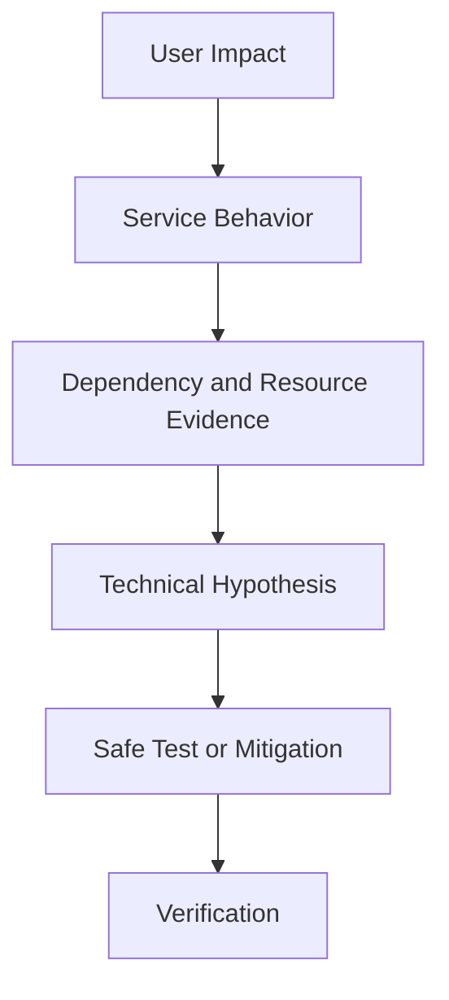

# SRE and Production Engineering

> Site Reliability Engineering and Production Engineering both apply deep software and systems knowledge to production services. They often overlap in reliability, scale, performance, incident response, capacity, and automation. Their exact relationship depends on the organization, because SRE has a widely published operating model while Production Engineering is used less consistently across the industry.

## Section Purpose

SRE and Production Engineering are among the most closely related disciplines in modern production systems.

Both may involve engineers who write production code, debug distributed systems, manage capacity, improve performance, respond to incidents, automate operations, and work with application teams. In some organizations, the titles describe nearly equivalent work. In others, Production Engineering focuses more heavily on full-stack systems performance, service scaling, production code, and direct partnership with product teams, while SRE uses a more explicit reliability-management system based on SLOs, error budgets, toil limits, and defined engagement models.

The title alone cannot settle the comparison.

This section explains:

- What Production Engineering means and why the title varies
- How Production Engineering and SRE developed
- What the disciplines share
- Where their emphasis and operating mechanisms may differ
- How coding, systems knowledge, performance, capacity, reliability, and security fit each role
- How production ownership and partnerships should work
- How to evaluate real roles, teams, and job descriptions
- How organizations can combine both disciplines without duplicate ownership
- How production scenarios expose the difference between titles and capabilities

This is not a career-marketing comparison. It focuses on production responsibility, engineering methods, service outcomes, risk, and sustainable operation.

---

## Learning Objectives

After completing this section, you should be able to:

1. Define SRE and Production Engineering without treating the titles as universal standards.
2. Explain why Production Engineering varies across organizations.
3. Identify the common technical and operational responsibilities of both disciplines.
4. Distinguish an SRE operating model from a general production-engineering role.
5. Explain how software engineering and systems engineering combine in production work.
6. Compare the disciplines across reliability, performance, capacity, security, incidents, and service ownership.
7. Evaluate whether a team has the authority and capacity required for its production responsibilities.
8. Design clear engagement boundaries among Production Engineering, SRE, product, platform, and infrastructure teams.
9. Recognize title inflation, renamed operations, and production support disguised as engineering.
10. Assess a real production role using evidence rather than its name.

---

## 1. A Working Definition of Production Engineering

Production Engineering applies software engineering and systems engineering to the design, operation, scaling, performance, security, and reliability of production services.

Production engineers may:

- Write production software
- Analyze system behavior
- Improve service architecture
- Build automation
- Diagnose complex failures
- Plan capacity
- Improve efficiency
- Lead incidents
- Strengthen security
- Partner with service teams

The definition is intentionally broad because the title does not have one universal industry specification.

---

## 2. A Working Definition of SRE

Site Reliability Engineering applies engineering methods to production operations so services meet explicit reliability objectives with controlled risk and sustainable human effort.

SRE commonly uses:

- Critical User Journeys
- Service Level Indicators
- Service Level Objectives
- Error budgets
- Toil limits
- Production readiness
- On-call
- Incident response and learning
- Capacity and resilience engineering
- Defined team engagement models

SRE is both an engineering discipline and, in some organizations, a role or team structure.

---

## 3. The Short Answer

SRE and Production Engineering can describe very similar work.

The safest distinction is:

> Production Engineering describes engineering applied deeply to production systems. SRE describes a reliability-centered engineering discipline with explicit service-level and work-management mechanisms.

This distinction is useful, not absolute.

---

## 4. Why the Comparison Is Difficult

The comparison is difficult because organizations use the terms differently.

A Production Engineer may be:

- A hybrid software and systems engineer
- An application performance specialist
- An infrastructure engineer
- A production software engineer
- An advanced operations engineer
- A support escalation engineer

An SRE title can be equally inconsistent. Actual authority, work, measures, and outcomes matter more than labels.

---

## 5. A Public Production Engineering Model

Meta publicly describes Production Engineers as hybrid software and systems engineers who work with engineering teams to improve reliability, scalability, performance, and security of production services.

This model emphasizes:

- Production code
- Deep systems work
- Partnership with product and infrastructure teams
- Large-scale services
- Performance and capacity
- Reliability and security
- Knowledge sharing

It is an important example, not a mandatory definition for every organization.

---

## 6. The Published SRE Model

Google publicly describes SRE as treating operations as a software problem.

Its published model includes:

- Software engineering applied to operations
- Service-level objectives
- Error budgets
- Toil control
- On-call
- Shared ownership
- Capacity planning
- Monitoring
- Incident response
- Engineering for scale

Organizations adapt this model, but its vocabulary makes SRE more explicitly defined than many Production Engineering roles.

---

## 7. Shared Historical Problem

Both disciplines address a recurring problem:

> Production systems cannot scale safely when software creation, systems expertise, and operational consequences remain disconnected.

Both bring engineers closer to real service behavior and use production evidence to improve design.

---

## 8. Shared Engineering Identity

Both roles should be engineering functions, not ticket queues with upgraded titles.

Engineering work includes:

- Forming hypotheses
- Measuring behavior
- Designing systems
- Writing and reviewing code
- Testing failure modes
- Evaluating tradeoffs
- Verifying outcomes
- Creating durable improvements

Responding to production events can provide valuable evidence, but repeated response without improvement becomes unsustainable.

---

## 9. Shared Production Focus

Both disciplines work where software meets:

- Real users
- Real traffic
- Long-running state
- Partial failure
- Dependencies
- Capacity limits
- Security threats
- Concurrent change
- Human pressure
- Business obligations

Passing tests is not proof that a service can be operated safely.

---

## 10. Shared Systems View

Both examine the complete system, including:

- Application code
- Runtime
- Operating system
- Network
- Storage
- Database
- Dependencies
- Control planes
- Delivery systems
- Observability
- People and procedures

Local component improvement can harm the end-to-end service if system interactions are ignored.

---

## 11. Shared Partnership Model

Both disciplines often partner with application and infrastructure teams.

Effective partnership requires:

- Shared goals
- Clear service boundaries
- Defined authority
- Joint design work
- Production participation
- Incident collaboration
- Corrective ownership
- Exit or transfer conditions

A specialist team should not become the permanent owner of consequences created by every other team.

---

## 12. Different Centers of Gravity

| Discipline | Common center of gravity |
| --- | --- |
| Production Engineering | Engineering production systems for scale, performance, reliability, security, and operability |
| SRE | Managing and engineering service reliability through explicit objectives, risk mechanisms, and sustainable operations |

The centers overlap heavily. Team charters provide the real distinction.

---

## 13. Detailed Comparison

| Dimension | Production Engineering | SRE |
| --- | --- | --- |
| Industry definition | Varies significantly | More widely documented through public SRE literature |
| Primary focus | Production systems engineering | Explicit service reliability engineering |
| Core technical identity | Hybrid software and systems engineering | Software and systems engineering applied to operations |
| Reliability mechanism | May use any appropriate method | Commonly uses SLIs, SLOs, and error budgets |
| Work control | Depends on organization | Toil measurement and protected engineering capacity are defining concerns |
| Performance | Often central | Important where performance affects reliability and efficiency |
| Capacity | Often central | Core production reliability responsibility |
| Security | Frequently explicit | Integrated with reliable system design and operations |
| Engagement | Often partnership with product or infrastructure teams | Embedded, central, consulting, or service-engagement models |
| Tool dependence | None | None |

---

## 14. Similar Roles Can Use Different Names

Two engineers may perform nearly identical work under different titles because of:

- Company history
- Hiring structure
- Compensation framework
- Team lineage
- Regional terminology
- Leadership preference
- Public branding

Do not infer capability from title alone.

---

## 15. Same Title, Different Work

Two Production Engineers may have entirely different responsibilities.

One may write distributed systems software and lead capacity architecture. Another may execute deployment tickets and restart services.

The same problem occurs with SRE titles.

Assess:

- Work performed
- Authority
- Engineering time
- On-call
- Objectives
- Ownership
- Expected outcomes

---

## 16. SRE Is Not Automatically More Senior

Neither title establishes seniority.

Seniority depends on:

- Scope
- Complexity
- Independence
- Technical depth
- Decision quality
- Organizational influence
- Incident leadership
- Measured impact

A Production Engineer may have broader or deeper responsibility than an SRE, and the reverse may also be true.

---

## 17. Software Engineering Expectations

Both roles may write software for:

- Automation
- Control systems
- Reliability features
- Traffic management
- Capacity management
- Deployment safety
- Diagnostics
- Data repair
- Failure containment
- Service performance

Coding expectations should be visible in the team charter and hiring process.

---

## 18. Production Code

Production engineers and SREs may change the actual service, not only supporting scripts.

Examples include:

- Adding graceful degradation
- Improving retry behavior
- Removing a bottleneck
- Building rate limiting
- Correcting resource leaks
- Adding idempotency
- Improving failure isolation
- Redesigning recovery

Authority to change service code strengthens ownership, but requires appropriate review and testing.

---

## 19. Systems Engineering Expectations

Both roles need to reason across:

- Processes and threads
- Memory and CPU
- File systems
- Network protocols
- Storage behavior
- Distributed state
- Concurrency
- Scheduling
- Failure domains
- Resource contention

Systems knowledge connects observed symptoms to plausible failure mechanisms.

---

## 20. Debugging Depth

Deep production diagnosis may require moving between:

- User symptoms
- Application behavior
- Service dependencies
- Runtime state
- Operating-system evidence
- Network packets
- Storage latency
- Hardware events
- Recent changes

Neither role should stop at the first dashboard that shows a correlation.

---

## 21. The Evidence Chain

The goal is not only to identify an unusual metric. It is to explain and verify the system behavior that harmed the service.

---

## 22. Reliability as the SRE Anchor

SRE begins with the required service outcome.

It asks:

- Who uses the service?
- Which journey matters?
- What counts as success?
- Which target applies?
- How much failure is acceptable?
- What action follows poor performance?

This explicit reliability model is the clearest conceptual anchor for SRE.

---

## 23. Production Health as a Production Engineering Anchor

Production Engineering may use a broader concept of production health that includes:

- Reliability
- Scalability
- Performance
- Efficiency
- Security
- Operability
- Maintainability

An organization should convert these terms into measurable responsibilities rather than leave them as slogans.

---

## 24. Service Level Indicators

An SLI measures a defined aspect of service behavior.

Examples include:

- Valid request success
- Useful latency
- Correct response
- Durable write retention
- Scheduled completion
- Freshness

Production Engineering teams can and often should use SLIs. The concepts are not restricted by job title.

---

## 25. Service Level Objectives

An SLO sets a target for an SLI over a defined window.

Example:

> At least 99.95 percent of valid message-send requests produce one durable accepted message within 800 milliseconds over 28 days.

The objective connects engineering work to user expectations and risk.

---

## 26. Error Budgets

An error budget represents the unreliability permitted by an SLO.

It can guide:

- Release risk
- Reliability investment
- Incident follow-up
- Capacity work
- Exception handling
- Product tradeoffs

A Production Engineering team may use error budgets. Doing so means it is applying an SRE mechanism, regardless of the team name.

---

## 27. SLOs Do Not Cover Everything

Service objectives may not fully represent:

- Security exposure
- Rare catastrophic failure
- Data corruption
- Regulatory breach
- Excessive cost
- Operator harm
- Long-term maintainability

SRE and Production Engineering need additional risk controls and engineering judgment.

---

## 28. Performance Engineering

Performance Engineering studies how a system behaves under demand.

It includes:

- Latency
- Throughput
- Resource use
- Queueing
- Contention
- Tail behavior
- Load distribution
- Efficiency
- Scaling limits

Production Engineering frequently places strong emphasis on this work. SRE treats it as central when performance affects service reliability, capacity, cost, or recovery.

---

## 29. Tail Latency

Average latency can hide severe user experiences.

Analyze:

- Percentiles
- Affected operations
- User segments
- Dependency contribution
- Queueing
- Timeout behavior
- Retry amplification

A small slow tail can dominate the reliability of a multi-step journey.

---

## 30. Throughput

Throughput measures completed work over time.

It must be interpreted with:

- Success
- Latency
- Correctness
- Resource use
- Queue growth
- Backpressure

A system can report high throughput while dropping important work or creating unacceptable delay.

---

## 31. Profiling

Profiling helps identify where a system consumes:

- CPU
- Memory
- Allocation
- Lock time
- I/O wait
- Network time

Production profiling must control overhead, access, sensitive data, and tenant impact.

Evidence should support a hypothesis before a risky change is made.

---

## 32. Queueing and Backpressure

Queues absorb short bursts but can hide overload.

Important signals include:

- Queue depth
- Age of oldest item
- Arrival rate
- Completion rate
- Rejection
- Retry volume
- Deadline miss

Backpressure should reduce incoming work or degrade safely before uncontrolled resource exhaustion occurs.

---

## 33. Capacity Engineering

Both disciplines plan for sufficient capacity under expected demand and failure.

A capacity model includes:

- Demand forecast
- Resource relationship
- Saturation point
- Headroom
- Scaling delay
- Failure reserve
- Provider quota
- Dependency limit
- Emergency action

Capacity is a reliability control, not only a purchasing activity.

---

## 34. Demand Forecasting

Forecast demand using:

- Historical patterns
- Product launches
- Customer growth
- Seasonal events
- Regional behavior
- Marketing activity
- Dependency changes
- Uncertainty ranges

Forecasts should state assumptions and be updated when reality diverges.

---

## 35. Planned Events

Known events may create unusual traffic or usage patterns.

Preparation may include:

- Load testing
- Capacity reservation
- Dependency review
- Feature controls
- Staffing
- Incident communication
- Degraded-mode testing
- Rollback restrictions

Production Engineering has often played a central role in preparing large services for these events.

---

## 36. Unexpected Demand

Unexpected demand can arise from:

- Viral activity
- External events
- Abuse
- Retry storms
- Dependency recovery
- Misconfiguration
- Traffic shifts

Systems need load shedding, quotas, backpressure, prioritization, and safe degraded behavior.

---

## 37. Efficiency Engineering

Efficiency asks how much useful service outcome is produced for a given resource cost.

Possible measures include:

- Requests per CPU unit
- Transactions per host
- Storage cost per retained unit
- Network cost per delivered result
- Energy per workload

Efficiency improvements must preserve reliability, security, and correctness.

---

## 38. Cost Is Not Separate From Production

Cost can affect:

- Capacity headroom
- Redundancy
- Recovery strategy
- Architecture
- Provider selection
- Staffing

Both disciplines should explain the reliability consequence of cost decisions. Business owners decide whether residual risk is acceptable.

---

## 39. Scalability

Scalability is the ability to accommodate increased or changed demand within acceptable service and cost limits.

It may require:

- Horizontal expansion
- Partitioning
- Caching
- Asynchronous work
- Load distribution
- Data-model changes
- Operational automation

Adding instances is not a complete scaling strategy when another dependency remains fixed.

---

## 40. Reliability Under Scale

A service that works at normal load may fail through:

- Queue buildup
- Hot partitions
- Lock contention
- Connection exhaustion
- Control-plane limits
- Retry amplification
- Cache collapse
- Observability overload

Scale testing should include failure and recovery, not only peak throughput.

---

## 41. Resilience Engineering

Both disciplines may design systems to:

- Absorb failure
- Isolate faults
- Degrade gracefully
- Recover automatically
- Preserve critical work
- Restore safely

Resilience includes architecture, people, procedures, and learning.

---

## 42. Failure Models

A failure model states which failures a system is expected to handle.

Examples include:

- Process crash
- Host loss
- Network partition
- Zone outage
- Dependency timeout
- Corrupt data
- Credential failure
- Operator mistake
- Control-plane loss

“Fault tolerant” is incomplete without a defined fault scope.

---

## 43. Graceful Degradation

Graceful degradation preserves the most important service behavior when full operation is impossible.

It may:

- Disable optional features
- Serve cached information
- Reduce result detail
- Queue nonurgent work
- Protect read access
- Reject low-priority demand

The degraded mode needs its own correctness, security, capacity, and recovery rules.

---

## 44. Disaster Recovery

Both roles may contribute to:

- Recovery architecture
- RTO and RPO analysis
- Backup validation
- Failover
- Data restoration
- Dependency recovery
- Failback
- Exercises

Recovery is proven by controlled evidence, not by the existence of backups or replicas.

---

## 45. Production Readiness

Before launch or operational transfer, evaluate:

- Ownership
- Architecture
- SLOs
- Capacity
- Observability
- Change safety
- Security
- Incident response
- Recovery
- Operational workload

Readiness review should expose risk early, not become a late ceremonial gate.

---

## 46. Operational Readiness and Engineering Readiness

Operational readiness asks whether the service can be observed, supported, changed, and recovered.

Engineering readiness also asks whether the design can meet its reliability, scale, performance, and failure requirements.

Both are necessary. A complete runbook cannot compensate for an architecture that cannot meet demand.

---

## 47. Service Ownership

Service ownership includes continuing accountability for:

- User outcomes
- Reliability
- Security
- Operability
- Capacity
- Cost
- Dependencies
- Incidents
- Recovery
- Retirement

A Production Engineering or SRE team may share responsibility, but the owning service team should remain identifiable.

---

## 48. Shared Ownership Requires Boundaries

Document:

- What the product team owns
- What Production Engineering owns
- What SRE owns
- What platform and infrastructure teams own
- Which decisions are joint
- Who leads incidents
- Who accepts risk
- When an engagement ends

“Everyone owns production” is not sufficient.

---

## 49. Responsibility Without Authority

A reliability team cannot own an outcome if it cannot influence:

- Architecture
- Code
- Release
- Capacity
- Dependencies
- Corrective priorities
- Incident mitigation

Authority must be constrained by review, access control, and evidence, but it must exist.

---

## 50. Embedded Partnership

An engineer embedded with a service team may gain:

- Strong service context
- Early design influence
- Fast collaboration
- Shared priorities

Risks include:

- Isolation from the home discipline
- Feature pressure consuming reliability time
- Unclear long-term ownership
- Inconsistent standards

Define duration, objectives, authority, and exit conditions.

---

## 51. Central Production Engineering

A central Production Engineering group may provide deep expertise across services.

Benefits may include:

- Cross-service patterns
- Specialist debugging
- Shared capacity knowledge
- Reusable systems work

Risks include:

- Too many partner teams
- Shallow service context
- Ticket-based engagement
- Unbounded demand

Engagement criteria protect focus and quality.

---

## 52. Central SRE

A central SRE team may own shared reliability systems or engage with selected services.

It requires:

- Service acceptance criteria
- SLOs
- Shared on-call
- Toil limits
- Reliability authority
- Exit conditions

Without these, central SRE can become an overflow operations team.

---

## 53. Consulting and Enablement

Production Engineering or SRE specialists may advise teams without assuming permanent operational ownership.

Engagements may cover:

- Performance analysis
- Capacity review
- Reliability design
- Incident-system design
- Production readiness
- Recovery testing
- Toil analysis

Success means the service team gains durable capability.

---

## 54. Service Onboarding

Before accepting a service, define:

- Business and user importance
- Technical state
- Reliability objectives
- Existing operational load
- Known risks
- Ownership
- Staffing
- Required remediation
- Engagement duration

Specialist teams should not inherit unlimited unstable services without negotiation.

---

## 55. Service Handoff

A safe handoff includes:

- Architecture knowledge
- Access
- Dashboards and alerts
- Runbooks
- SLO history
- Incident history
- Capacity model
- Recovery evidence
- Joint on-call period
- Explicit acceptance

Documentation alone does not prove operational readiness.

---

## 56. On-Call

Both disciplines may participate in on-call.

A sustainable rotation requires:

- Actionable alerts
- Adequate staffing
- Trained responders
- Clear escalation
- Safe authority
- Recovery procedures
- Follow-up engineering
- Load measurement

On-call connects engineers to production, but should not depend on chronic exhaustion.

---

## 57. Incident Response

During an incident, both may:

- Assess impact
- Form hypotheses
- Mitigate failure
- Coordinate teams
- Communicate status
- Restore service
- Verify recovery
- Preserve evidence

Role selection should depend on service knowledge and incident needs, not title prestige.

---

## 58. Incident Command and Technical Leadership

The incident commander coordinates the response. The technical lead directs diagnosis and mitigation.

One person may hold both roles in a small event. Larger incidents benefit from separation.

Deep technical skill does not automatically make someone the best coordinator, and strong coordination does not require personally debugging every subsystem.

---

## 59. Production Debugging Under Pressure

Use a disciplined sequence:

1. Confirm user impact.
2. Establish the timeline.
3. Identify recent changes.
4. Compare healthy and unhealthy behavior.
5. Form testable hypotheses.
6. Choose the safest mitigation.
7. Limit blast radius.
8. Verify recovery.

Avoid uncontrolled parallel changes that destroy evidence.

---

## 60. Recovery Is Not Root Cause

Restoring service answers the immediate incident need.

It does not prove that the initiating conditions, contributing factors, or recurrence risk are understood.

Separate:

- Mitigation
- Recovery
- Technical analysis
- Systemic analysis
- Corrective engineering
- Risk acceptance

Each produces a different outcome.

---

## 61. Post-Incident Learning

A useful review examines:

- User and business impact
- Detection
- Response
- Technical conditions
- Organizational conditions
- Successful adaptations
- Recovery quality
- Recurrence risk
- Corrective options

The review should create owned, prioritized, and verifiable actions.

---

## 62. Toil

Toil is operational work that is manual, repetitive, automatable, tactical, without enduring value, and likely to grow with service demand.

Both disciplines should reduce toil. SRE makes toil control a defining operating requirement.

Examples include:

- Repeated restarts
- Manual capacity changes
- Routine data repair
- Repetitive alert triage
- Standard access requests

---

## 63. Engineering Capacity

Teams need protected capacity for lasting work.

Without it:

- Incidents repeat
- Automation decays
- Capacity risk grows
- Performance regresses
- Documentation remains stale
- On-call worsens

An operational team that spends all its time reacting cannot fulfill an engineering mission.

---

## 64. Automation

Automation should reduce risk and recurring human effort.

Before automating, ask:

- Can the need be removed?
- Can the system be simplified?
- Are decisions rule-based?
- Is the outcome observable?
- Can scope be limited?
- Can failure be reversed?

Automation becomes production software and needs ownership.

---

## 65. Remediation Automation

Automated remediation may detect and correct known conditions.

It needs:

- Precise trigger
- Confidence threshold
- Rate limit
- Scope limit
- Audit trail
- Stop condition
- Verification
- Human escalation

An incorrect remediation loop can amplify a small failure.

---

## 66. Safe Production Access

Both roles may require privileged access during incidents.

Use:

- Least privilege
- Short-lived credentials
- Strong authentication
- Recorded elevation
- Scoped commands
- Peer coordination
- Audit logs
- Expiration

Permanent broad access increases both security and reliability risk.

---

## 67. Security Engineering

Production Engineering frequently treats security posture as a core production property. SRE also integrates security with reliable design and operation.

Shared work may include:

- Workload identity
- Secrets
- Abuse controls
- Patch safety
- Isolation
- Logging
- Recovery after compromise
- Supply-chain protection

Security and reliability failures often share dependencies and response paths.

---

## 68. Correctness

A service can be available and fast while producing incorrect results.

Correctness concerns include:

- Duplicate processing
- Missing updates
- Stale reads
- Incorrect authorization
- Ordering failure
- Partial writes
- Invalid calculations

Reliability measurement must represent correct user outcomes where correctness matters.

---

## 69. Data Integrity

Data integrity requires that information remain accurate, complete, consistent within defined rules, and protected from unauthorized change.

Both disciplines may engineer:

- Validation
- Checksums
- Reconciliation
- Audit trails
- Repair tools
- Backup verification
- Safe migrations

Data repair needs strict scope, review, and verification.

---

## 70. Change Safety

Both roles may improve change through:

- Small releases
- Automated testing
- Canarying
- Progressive exposure
- Service-level verification
- Rollback
- Feature controls
- Blast-radius limits

SRE may also use error-budget state to change release behavior.

---

## 71. Configuration Safety

Configuration can alter production behavior without a code release.

Treat it with:

- Schema validation
- Review
- Versioning
- Staged rollout
- Scope limits
- Observability
- Rollback
- Ownership

Global configuration changes deserve controls proportional to their blast radius.

---

## 72. Observability

Both disciplines need evidence to understand production behavior.

Evidence may include:

- Metrics
- Logs
- Traces
- Profiles
- Events
- Changes
- User reports
- Synthetic tests

Telemetry should answer operational questions, not merely fill dashboards.

---

## 73. Monitoring

Monitoring detects known conditions and measures service behavior.

An alert should require timely human action.

Good alerting identifies:

- Affected service
- Meaningful symptom
- Urgency
- Owner
- Diagnostic context
- Safe starting action

Alert volume is not proof of coverage.

---

## 74. Production Tooling

Tools may support both disciplines, but tools do not define either one.

The same monitoring, orchestration, delivery, profiling, or automation system may be used by:

- SRE
- Production Engineering
- Platform Engineering
- Infrastructure Engineering
- Operations
- Application teams

Classify work by purpose, responsibility, and outcome.

---

## 75. Documentation

Useful production documentation includes:

- Service overview
- Architecture
- Dependencies
- Ownership
- SLOs
- Alerts
- Runbooks
- Capacity model
- Recovery plan
- Incident history

Documentation requires an owner, review trigger, and verification through use.

---

## 76. Knowledge Sharing

Both disciplines should reduce dependence on individual heroes through:

- Pairing
- Reviews
- Training
- Incident analysis
- Runbook exercises
- Technical talks
- Rotation
- Shared tooling

Deep specialists remain valuable. Their knowledge should become accessible to the team.

---

## 77. Production Engineering Success Measures

Depending on the charter, useful measures may include:

- Reliability improvement
- Capacity headroom
- Performance improvement
- Resource efficiency
- Security risk reduction
- Reduced recurring work
- Faster safe diagnosis
- Partner-service outcomes

Activity such as scripts written or tickets closed is incomplete evidence.

---

## 78. SRE Success Measures

SRE measures may include:

- SLO performance
- Error-budget behavior
- User-impact reduction
- Detection and recovery
- Toil
- On-call sustainability
- Capacity risk
- Corrective completion
- Engineering contribution

No single metric proves complete success.

---

## 79. Measuring Shared Work

When both teams contribute, define:

- Baseline
- Intended outcome
- Contribution boundary
- Verification method
- Review period

Avoid claiming causation from a metric that improved while many other changes occurred.

---

## 80. Role Evaluation Framework

Evaluate a role across six questions:

1. What service outcome does it protect?
2. What engineering work does it perform?
3. What production authority does it have?
4. What operational load does it carry?
5. Which measures guide decisions?
6. What lasting improvements must it produce?

This framework is more reliable than the job title.

---

## 81. Job Description Warning Signs

Warning signs include:

- Every tool listed, no service outcome defined
- Twenty-four-hour support with no staffing model
- Responsibility for uptime without authority
- Automation required but no coding scope
- Every infrastructure domain assigned to one person
- No engineering time
- No product-team responsibility
- Success measured by ticket closure

Titles should not hide an unsafe job design.

---

## 82. Healthy Job Description Evidence

A credible description explains:

- Supported services
- Engineering responsibilities
- Production ownership
- On-call expectations
- Reliability or production-health objectives
- Partner teams
- Authority
- Required systems depth
- How success is measured

Tool knowledge may be relevant, but it should support the mission.

---

## 83. Common Anti-Pattern: Renamed Support

Symptoms include:

- Work arrives only through tickets.
- Engineers cannot change services.
- The team performs repeated manual recovery.
- Application teams do not join incidents.
- No time exists for lasting engineering.

This is production support under an engineering title.

---

## 84. Common Anti-Pattern: Reliability Without Objectives

A team claims to own reliability but has no defined user journeys, SLIs, SLOs, risk boundaries, or decision policy.

It may still perform valuable production work, but reliability remains subjective and difficult to govern.

Start with a small number of meaningful objectives.

---

## 85. Common Anti-Pattern: Performance at Any Cost

A latency improvement may increase:

- Failure risk
- Complexity
- Cost
- Data inconsistency
- Operator burden

Performance work should state the required outcome and guardrails.

---

## 86. Common Anti-Pattern: Specialist Becomes Permanent Owner

A Production Engineer joins to solve scaling problems, then becomes responsible for every future deployment and incident.

This removes ownership from the service team and consumes specialist capacity.

Define engagement goals, shared work, capability transfer, and exit criteria.

---

## 87. Common Anti-Pattern: SRE and PE Compete

Two teams may independently build monitoring, automation, capacity models, and incident processes for the same service.

Resolve this through:

- One service owner
- Written charters
- Shared objectives
- Clear decision rights
- Joint prioritization
- Elimination of duplicate systems

The organization needs reliability, not title territory.

---

## 88. Common Anti-Pattern: Hero Debugger

One engineer repeatedly solves the hardest incidents but leaves no durable improvement.

The organization remains dependent on:

- Individual memory
- Emergency access
- Undocumented techniques
- Personal availability

Require knowledge transfer, corrective work, tooling, and recovery exercises.

---

## 89. Common Anti-Pattern: Automation Without Guardrails

An automated production action may have:

- Excessive privilege
- Global scope
- No rate limit
- No dry run
- Weak verification
- No rollback

Fast action is not safe action.

---

## 90. Choosing an Organizational Name

Choose the name that matches the organization's history and talent model, then define the practice precisely.

Do not create both teams merely to appear mature.

The charter should explain:

- Mission
- Scope
- Engagement
- Ownership
- Measures
- Engineering expectations
- Operational boundaries

---

## 91. When Production Engineering May Fit

The title may fit when the team strongly emphasizes:

- Hybrid software and systems engineering
- Full-stack production diagnosis
- Performance and scale
- Production code
- Security posture
- Direct service partnership

The organization should still define reliability and sustainable work.

---

## 92. When SRE May Fit

The title may fit when the organization adopts:

- User-centered SLIs and SLOs
- Error budgets
- Toil limits
- Shared on-call
- Reliability engagement criteria
- Explicit risk decisions
- Reliability engineering work

Using the title creates an expectation that these mechanisms are real.

---

## 93. When One Combined Team May Fit

A combined team may work when:

- Responsibilities substantially overlap
- One leadership structure reduces duplication
- Service boundaries are clear
- Work is prioritized coherently
- Engineering and operational capacity are protected

Internal specializations can remain without creating separate queues.

---

## 94. When Separate Teams May Fit

Separate teams may be useful when:

- Production Engineering provides deep service-specific systems work
- SRE owns shared reliability policy or selected service operation
- Scale justifies specialized capabilities
- Charters and interfaces are clear

Separation must not create competing ownership.

---

## 95. Production Scenario: Latency Regression at Peak Load

A service meets its average latency target but times out for five percent of users during peak demand. CPU averages remain normal.

### Analysis

Average resource and latency data hide tail behavior and possible localized contention.

### Appropriate actions

1. Measure journey latency distribution.
2. Segment by region, shard, request type, and dependency.
3. Inspect queues, locks, saturation, and retries.
4. Apply a contained mitigation.
5. Verify both performance and user success.

---

## 96. Production Scenario: SRE and PE Duplicate On-Call

SRE and Production Engineering both receive the same pages. Each assumes the other team is leading, while the application owner remains offline.

### Analysis

Duplicate paging did not create clear accountability.

### Appropriate actions

1. Define primary ownership by service and symptom.
2. Establish incident command rules.
3. Require application-team escalation.
4. Remove duplicate nonactionable pages.
5. Test the new model through an exercise.

---

## 97. Production Scenario: Capacity Forecast Miss

A product launch doubles traffic. Compute scales, but a database connection limit causes service failure.

### Analysis

Capacity planning covered one resource and missed the complete dependency path.

### Appropriate actions

1. Map demand through each constrained resource.
2. Mitigate connection pressure safely.
3. Load test the end-to-end path.
4. Define headroom and scaling delay.
5. Add degraded behavior and capacity alerts.

---

## 98. Production Scenario: Optimization Causes Incorrect Results

A cache change reduces latency by 40 percent but serves stale account balances for several minutes.

### Analysis

Performance improved while correctness reliability failed.

### Appropriate actions

1. Stop or roll back the unsafe behavior.
2. Define freshness and correctness requirements.
3. Identify invalidation and consistency failure modes.
4. Add guardrail SLIs.
5. Test performance within correctness limits.

---

## 99. Production Scenario: Automated Repair Loop

An automation detects memory pressure and restarts instances. A software leak causes restarts to repeat faster until capacity collapses.

### Analysis

The remediation treated a symptom and amplified instability.

### Appropriate actions

1. Disable or rate-limit the loop.
2. Restore safe capacity.
3. Diagnose the leak.
4. Add escalation and stop conditions.
5. Verify that automation reduces rather than hides risk.

---

## 100. Production Scenario: Specialist Handoff Failure

A Production Engineering team improves a service and ends its engagement. The application team does not understand the new capacity controls and disables them during a later release.

### Analysis

The technical change succeeded, but capability transfer failed.

### Appropriate actions

1. Restore safe controls.
2. Document ownership and decision rules.
3. Pair teams during future changes.
4. Add tests and policy safeguards.
5. Define exit evidence for future engagements.

---

## 101. Practical Exercise: Compare Two Roles

Choose one SRE and one Production Engineering job description.

Compare:

- Service outcome
- Coding expectations
- Systems depth
- Performance work
- Reliability mechanisms
- On-call
- Authority
- Success measures

Ignore title and company reputation during the first analysis.

---

## 102. Practical Exercise: Build a Production Health Model

For one service, define measures for:

- Reliability
- Performance
- Capacity
- Efficiency
- Security
- Operability

Identify which measures are user outcomes, system signals, risks, and operational workload.

---

## 103. Practical Exercise: Diagnose a Performance Failure

Use a controlled environment to create a latency regression.

Follow this sequence:

1. Confirm the user symptom.
2. Establish a baseline.
3. Compare healthy and unhealthy requests.
4. Inspect saturation, queues, locks, and dependencies.
5. Form a hypothesis.
6. Apply one controlled change.
7. Verify latency, correctness, and resource use.

---

## 104. Practical Exercise: Create a Capacity Model

Choose a service and record:

- Demand unit
- Historical peak
- Growth forecast
- Resource relationship
- Saturation point
- Headroom
- Scaling time
- Dependency quota
- Failure reserve
- Emergency action

State uncertainty and test one important assumption.

---

## 105. Practical Exercise: Map Engagement Boundaries

Create a responsibility table for:

- Product team
- Production Engineering
- SRE
- Platform team
- Infrastructure team
- Security team

Cover design, release, SLOs, capacity, on-call, incidents, recovery, and risk acceptance.

Resolve every duplicate accountable owner.

---

## 106. Practical Exercise: Measure Engineering Capacity

For two weeks, classify team work as:

- Engineering
- Necessary operations
- Toil
- Overhead
- Incident interruption

Calculate how much capacity remains for durable improvement. Define an action if operational work exceeds the team's boundary.

---

## 107. Practical Exercise: Review an Automation

Choose one production automation and evaluate:

- Trigger
- Decision logic
- Access
- Scope
- Rate limit
- Failure behavior
- Verification
- Ownership
- Maintenance cost
- Retirement condition

Identify one way the automation could amplify failure.

---

## 108. Practical Exercise: Run a Production Readiness Review

Assess one service for:

- Ownership
- Critical journeys
- SLOs
- Architecture
- Capacity
- Performance
- Observability
- Security
- Change safety
- Incident response
- Recovery
- Operational load

Record risks, owners, deadlines, and acceptance authority.

---

## 109. SRE and Production Engineering Assessment Checklist

### Role clarity

- [ ] The team mission is defined without relying on its title.
- [ ] Supported services and partners are named.
- [ ] Software and systems engineering expectations are clear.
- [ ] Success measures are documented.

### Reliability and production health

- [ ] Critical user journeys are known.
- [ ] Reliability objectives influence decisions.
- [ ] Performance, capacity, correctness, and security have guardrails.
- [ ] Service health is not reduced to component uptime.

### Ownership

- [ ] One accountable service owner exists.
- [ ] SRE, Production Engineering, product, platform, and infrastructure boundaries are written.
- [ ] Responsibility has corresponding authority.
- [ ] Engagement and exit conditions are explicit.

### Operations

- [ ] On-call is sustainable.
- [ ] Alerts are actionable.
- [ ] Incident roles are clear.
- [ ] Recovery verifies user outcomes.

### Engineering work

- [ ] Operational demand is measured.
- [ ] Toil is controlled.
- [ ] Engineering capacity is protected.
- [ ] Automation has safeguards and ownership.

### Learning

- [ ] Incidents produce verified learning.
- [ ] Specialists transfer knowledge.
- [ ] Capacity and recovery assumptions are tested.
- [ ] Improvements are measured against a baseline.

---

## 110. Reflection Questions

1. What does Production Engineering mean in your organization?
2. Which explicit SRE mechanisms are present regardless of team name?
3. Does the role write production software or only operational scripts?
4. Which production outcome is the team accountable for?
5. Can the team change the systems it must keep healthy?
6. Which performance metric could hide user harm?
7. How much team capacity remains for durable engineering?
8. Where do SRE and Production Engineering responsibilities overlap?
9. Which specialist knowledge depends on one person?
10. What evidence would distinguish real engineering from renamed support?

---

## 111. Knowledge Check

1. Why is Production Engineering difficult to define universally?
2. What is the clearest conceptual anchor for SRE?
3. What do SRE and Production Engineering share?
4. Why does a title not establish seniority or capability?
5. How do performance and reliability differ?
6. Why should capacity planning cover dependencies?
7. What makes on-call an engineering feedback mechanism?
8. Why is service recovery different from root-cause analysis?
9. What is the risk of a specialist becoming the permanent owner?
10. How should combined SRE and Production Engineering work be measured?
11. What distinguishes production support from Production Engineering?
12. When can one combined team be appropriate?

---

## 112. Knowledge Check Answers

1. Organizations use the title for different mixtures of software, systems, infrastructure, performance, and support work.
2. Explicitly defined and measured service reliability.
3. Software and systems engineering, production ownership, scale, capacity, performance, automation, incidents, and resilience.
4. Seniority and capability depend on scope, authority, depth, decision quality, and outcomes.
5. Performance measures speed and resource behavior, while reliability asks whether the service consistently provides the required outcome.
6. A service fails when any constrained dependency prevents the end-to-end journey, even if compute remains available.
7. Engineers experience real failures and use that evidence to create lasting improvements.
8. Recovery restores service, while analysis explains conditions and guides recurrence reduction.
9. The service team may lose ownership while scarce specialist capacity becomes consumed by routine work.
10. Define baseline, intended outcome, contribution boundary, and verification method.
11. Authority to engineer durable system changes, protected engineering time, and measured production outcomes.
12. When responsibilities overlap, scope is clear, staffing is sufficient, and both engineering and operational priorities are protected.

---

## 113. Key Takeaways

- SRE and Production Engineering are closely related but not universally identical.
- Production Engineering has no single industry-wide implementation.
- Meta's public model emphasizes hybrid software and systems engineering for reliability, scale, performance, and security.
- SRE has a more explicit published reliability model built around SLIs, SLOs, error budgets, toil, on-call, and engineering work.
- Both disciplines should write or influence production code and create lasting improvements.
- Performance, capacity, efficiency, security, correctness, resilience, and recovery are shared production concerns.
- Titles do not establish seniority, authority, or engineering depth.
- One accountable service owner must remain clear when specialist teams engage.
- Operational load must not consume all engineering capacity.
- Job descriptions and team charters should be evaluated by work, authority, measures, and outcomes.
- Organizations can use either name or both, but must prevent duplicate ownership and competing systems.

---

## 114. Authoritative Resources

### Production Engineering

- [Engineering at Meta: Production Engineering](https://engineering.fb.com/category/production-engineering/)
- [Meta Engineering: Production Engineering Overview](https://engineering.fb.com/2024/07/10/production-engineering/)
- [Meta Engineering: Supporting Global Events](https://engineering.fb.com/2018/02/12/production-engineering/how-production-engineers-support-global-events-on-facebook/)

### Site Reliability Engineering

- [Google SRE](https://sre.google/)
- [Google SRE Book: Introduction](https://sre.google/sre-book/introduction/)
- [Google SRE Book: Embracing Risk](https://sre.google/sre-book/embracing-risk/)
- [Google SRE Book: Eliminating Toil](https://sre.google/sre-book/eliminating-toil/)
- [Google SRE Book: Software Engineering in SRE](https://sre.google/sre-book/software-engineering-in-sre/)
- [Google SRE Book: Managing Incidents](https://sre.google/sre-book/managing-incidents/)
- [Google SRE Workbook: SRE Engagement Model](https://sre.google/workbook/engagement-model/)

### Secure and Reliable Systems

- [Google: Building Secure and Reliable Systems](https://sre.google/books/)

### Source Interpretation

Meta's public material describes Production Engineering in Meta's organizational context. Google's publications describe Google's SRE model and the practices shared with the wider community. These sources illustrate mature implementations. They do not establish one universal distinction that every employer follows.

---

## 115. Related SRE World Sections

- [What Is SRE](./01-What-Is-SRE.md)
- [History and Evolution of SRE](./02-History-and-Evolution-of-SRE.md)
- [The SRE Mindset](./03-The-SRE-Mindset.md)
- [Reliability as a Product Feature](./04-Reliability-as-a-Product-Feature.md)
- [Fault Tolerance and Disaster Recovery](./07-Fault-Tolerance-and-Disaster-Recovery.md)
- [Production Responsibility](./08-Production-Responsibility.md)
- [Service Ownership](./09-Service-Ownership.md)
- [Engineering Work and Operational Work](./12-Engineering-Work-and-Operational-Work.md)
- [Toil](./13-Toil.md)
- [SRE and DevOps](./14-SRE-and-DevOps.md)
- [SRE and Traditional Operations](./15-SRE-and-Traditional-Operations.md)
- [SRE and Platform Engineering](./16-SRE-and-Platform-Engineering.md)
- [SRE Foundations](./README.md)

---

## Next Section

[Section 18: SRE Responsibilities](./18-SRE-Responsibilities.md)

---

## Maintained by VERIQTA

SRE World is created and maintained by [VERIQTA](https://github.com/veriqta).

- Website: [veriqta.com](https://www.veriqta.com/)
- GitHub: [github.com/veriqta](https://github.com/veriqta)
- Instagram: [@veriqta](https://www.instagram.com/veriqta/)
- Medium: [veriqta.medium.com](https://veriqta.medium.com/)

> The title matters less than the operating reality. Strong SRE and Production Engineering both connect deep engineering work to real production outcomes, clear ownership, controlled risk, and systems that improve after failure.
