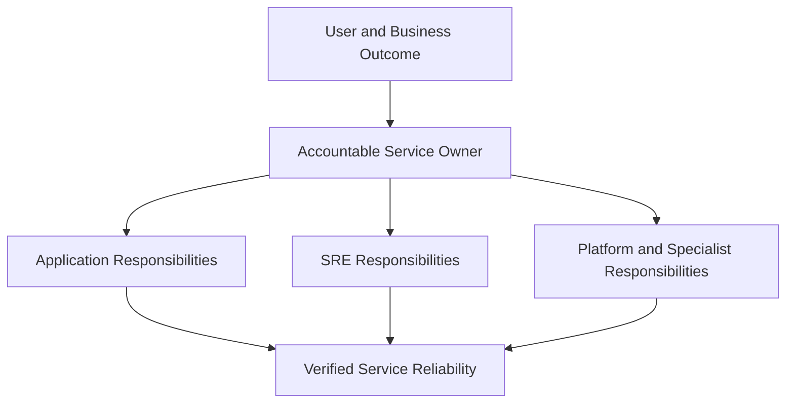

# SRE Responsibilities

> SRE is responsible for turning reliability expectations into measurable objectives, production decisions, engineering work, incident capability, and sustainable operations. SRE does not own every production task, every infrastructure system, or every failure. Its responsibilities must be defined at the service boundary and matched by authority, staffing, and evidence.

## Section Purpose

SRE responsibilities are often described as an unbounded list of technical activities.

Organizations may expect SREs to monitor everything, manage every cloud resource, own all deployments, answer every incident, administer every tool, maintain every platform, solve every performance problem, and guarantee uptime for services they cannot change.

That is not a workable SRE model.

A responsibility is credible only when it identifies:

- The service or capability involved
- The expected outcome
- The accountable owner
- The work SRE performs
- The authority SRE holds
- The partners who share responsibility
- The evidence used to verify completion
- The boundary at which responsibility ends

This section explains:

- Core SRE responsibilities
- Shared and conditional responsibilities
- Responsibilities that remain with product and service teams
- How responsibilities change across the service lifecycle
- Required authority, staffing, and engineering capacity
- Responsibilities for SLOs, risk, production readiness, on-call, incidents, capacity, resilience, security, change, and toil
- How to document, govern, transfer, and assess SRE responsibility
- How to recognize unsafe or false SRE accountability

The goal is not to make every SRE team identical. The goal is to make every SRE responsibility explicit, supportable, and verifiable.

---

## Learning Objectives

After completing this section, you should be able to:

1. Define SRE responsibility in terms of services, outcomes, authority, and evidence.
2. Distinguish core, shared, conditional, and out-of-scope responsibilities.
3. Explain which responsibilities remain with application and product teams.
4. Create a responsibility map for an SRE-supported service.
5. Connect SLOs, error budgets, incidents, toil, capacity, and recovery to accountable owners.
6. Identify responsibility without authority and authority without guardrails.
7. Define SRE responsibilities across service design, launch, operation, failure, recovery, transfer, and retirement.
8. Evaluate whether an on-call or service engagement is sustainable.
9. Design evidence that proves an SRE responsibility is being fulfilled.
10. Reject unbounded accountability while preserving collaboration and production responsibility.

---

## 1. A Working Definition of SRE Responsibility

An SRE responsibility is an agreed obligation to perform or coordinate defined work that protects a service's reliability within stated boundaries.

It includes:

- A named service or capability
- A reliability outcome
- A responsible team or role
- Decision authority
- Operating conditions
- Required partners
- Escalation
- Verification

“SRE owns reliability” is not complete enough to guide production work.

---

## 2. Responsibility Is Not Activity

An activity is something a person does.

A responsibility connects the activity to an outcome.

| Activity | Responsibility |
| --- | --- |
| Build a dashboard | Provide evidence needed to make a defined reliability decision |
| Configure an alert | Ensure a responder receives timely notice of an actionable reliability threat |
| Join an incident | Perform an assigned response role and help restore the service safely |
| Write automation | Reduce a measured source of operational demand without creating unacceptable risk |

Activity counts do not prove responsibility was fulfilled.

---

## 3. The Unit of Responsibility Is the Service

SRE responsibility should attach to a service or clearly bounded shared capability.

It should not attach only to:

- A repository
- A cluster
- A dashboard
- A ticket queue
- A cloud account
- A monitoring tool

One service may cross many technical assets. One asset may support many services.

---

## 4. Start With the User Outcome

For each responsibility, ask:

- Who depends on the service?
- Which behavior matters?
- What failure creates harm?
- How is success measured?
- Which reliability level is required?
- Who can make the necessary decisions?

SRE responsibility begins with the outcome, then moves inward to systems and work.

---

## 5. Responsibility, Accountability, Authority, and Participation

| Concept | Meaning |
| --- | --- |
| Responsibility | Obligation to perform defined work |
| Accountability | Answerability for the result |
| Authority | Power to decide or act within a boundary |
| Participation | Contribution without owning the result |
| Consultation | Specialist advice before a decision |
| Notification | Required awareness after an event or decision |

Confusing these concepts creates hidden gaps and delayed incidents.

---

## 6. One Accountable Owner

Every service outcome should have one clearly accountable team.

Many teams may contribute:

- Product
- Application engineering
- SRE
- Platform engineering
- Infrastructure
- Security
- Data
- Network
- Support
- Vendors

Multiple contributors do not remove the need for one accountable service owner.

---

## 7. Authority Must Match Responsibility

SRE cannot be responsible for a reliability outcome if it cannot influence:

- Architecture
- Code
- Configuration
- Capacity
- Release behavior
- Dependencies
- Incident mitigation
- Reliability priorities
- Recovery design

Responsibility without authority creates accountability theater.

---

## 8. Authority Needs Guardrails

Production authority should define:

- Who may act
- Under which conditions
- Which scope is permitted
- Which review applies
- What evidence must be recorded
- How the action is verified
- When access expires

Authority without constraints can increase blast radius.

---

## 9. Five Responsibility Categories

SRE work can be classified as:

1. Core SRE responsibility
2. Shared responsibility
3. Conditional responsibility
4. Responsibility retained by another owner
5. Work SRE should refuse or renegotiate

This classification prevents every production concern from becoming an automatic SRE obligation.

---

## 10. Core SRE Responsibilities

Core responsibilities commonly include:

- Reliability measurement
- SLO design and operation
- Error-budget decision mechanisms
- Production reliability engineering
- Operational-load and toil control
- On-call quality
- Incident capability
- Capacity and performance risk
- Resilience and recovery evidence
- Reliability learning

Implementation varies by engagement.

---

## 11. Shared Responsibilities

SRE commonly shares responsibility for:

- Service architecture
- Production readiness
- Observability
- Change safety
- Incident response
- Security and reliability
- Dependency management
- Capacity planning
- Disaster recovery
- Corrective work

Shared work needs explicit division and one accountable outcome owner.

---

## 12. Conditional Responsibilities

SRE may conditionally own:

- A shared reliability platform
- Deployment infrastructure
- Traffic systems
- Service runtime
- Capacity automation
- Observability services
- Disaster-recovery orchestration

These responsibilities depend on team charter, skills, staffing, and service boundaries.

---

## 13. Responsibilities Retained by Product Teams

Product and application teams commonly retain responsibility for:

- Product behavior
- Application code
- Functional correctness
- Tests
- Instrumentation
- Dependency use
- Resource requirements
- Safe configuration
- Defect correction
- Incident participation

SRE engagement does not transfer these responsibilities automatically.

---

## 14. Responsibilities SRE Does Not Automatically Own

SRE does not automatically own:

- Every cloud resource
- Every CI/CD pipeline
- Every Kubernetes cluster
- Every security control
- Every database
- Every deployment
- Every support request
- Every cost decision
- Every application incident
- Every production approval

The service and team charter must establish ownership.

---

## 15. Responsibility Map

The map joins responsibilities at the service outcome instead of allowing separate teams to report local success while users fail.

---

## 16. Reliability Definition

SRE helps define what reliability means for a service.

This includes:

- User or dependent system
- Critical journey
- Success condition
- Latency or quality requirement
- Measurement source
- Target
- Window
- Exclusions
- Decision policy

The definition should be agreed with service and business owners.

---

## 17. Critical User Journeys

SRE helps identify and protect the journeys that matter most.

Responsibilities may include:

- Discovering users
- Defining journey boundaries
- Mapping dependencies
- Identifying failure criteria
- Prioritizing impact
- Connecting journeys to SLIs
- Maintaining the journey inventory

Product teams provide essential user and business context.

---

## 18. SLI Design

SRE helps create indicators that represent service behavior.

An SLI definition includes:

- Valid event population
- Good event condition
- Measurement point
- Aggregation
- Data source
- Missing-data behavior
- Exclusions
- Ownership

Easy-to-collect infrastructure metrics should not replace meaningful user outcomes.

---

## 19. SLO Design

SRE facilitates SLO decisions using:

- User expectations
- Business impact
- Historical performance
- Dependency limits
- Architecture
- Cost
- Risk tolerance
- Measurement quality

SRE should not select a target alone when the target changes business or product risk.

---

## 20. SLO Operation

SRE responsibilities continue after an SLO is written.

They may include:

- Measuring compliance
- Validating data
- Reviewing trends
- Detecting burn
- Managing exclusions
- Reporting uncertainty
- Triggering policy
- Revising objectives

An SLO that never changes a decision is likely decorative.

---

## 21. Error-Budget Policy

SRE helps define how permitted unreliability affects work.

The policy should state:

- Normal condition
- Accelerated consumption
- Exhaustion
- Release response
- Reliability response
- Corrective and security exceptions
- Risk-acceptance authority
- Return-to-normal criteria

The policy should guide collaboration, not punishment.

---

## 22. Reliability Risk Analysis

SRE identifies and analyzes risks involving:

- Dependencies
- Capacity
- Change
- Monitoring
- Operations
- Security
- Data
- Recovery
- People

SRE provides technical evidence. Authorized business owners accept residual business risk.

---

## 23. Risk Statements

A useful reliability risk statement contains:

- Cause
- Event
- Service effect
- User consequence
- Business consequence

Example:

> Because payment authorization depends on one regional credential service, regional identity failure could stop checkout and cause lost orders until credentials are restored or traffic is moved.

---

## 24. Risk Prioritization

SRE helps compare risks using:

- Likelihood
- User impact
- Duration
- Detection time
- Recovery time
- Data consequence
- Correlation
- Control strength
- Uncertainty

Precision should not be invented when evidence is weak.

---

## 25. Risk Acceptance

SRE may recommend acceptance, reduction, transfer, or avoidance.

SRE should not silently accept risks outside its authority.

A record should identify:

- Risk
- Evidence
- Proposed treatment
- Residual exposure
- Authorized owner
- Review date
- Trigger for reconsideration

---

## 26. Production Readiness

SRE assesses whether a service can be launched and operated within agreed risk.

Review areas include:

- Ownership
- SLOs
- Architecture
- Dependencies
- Capacity
- Observability
- Change safety
- Security
- Incidents
- Recovery
- Operational workload

Readiness review should begin early enough to influence design.

---

## 27. Readiness Is Evidence, Not a Meeting

Evidence may include:

- Load-test results
- Failure-test results
- Rollback demonstration
- Restore test
- Alert exercise
- Capacity model
- Access validation
- On-call training
- Dependency agreements

A completed checklist without working evidence does not prove readiness.

---

## 28. Launch Responsibility

During launch, SRE may help:

- Define launch criteria
- Review capacity
- Limit initial exposure
- Observe critical indicators
- Establish rollback conditions
- Coordinate support
- Verify user outcomes

The product team remains responsible for the feature and application behavior.

---

## 29. Service Onboarding

Before SRE accepts an engagement, define:

- Supported service
- Reliability objective
- Current risk
- Operational load
- Required remediation
- On-call division
- Authority
- Staffing
- Duration
- Exit conditions

Onboarding without boundaries creates permanent overflow support.

---

## 30. Service Engagement

An engagement document should state:

- Mission
- Scope
- Owners
- Responsibilities
- Decision rights
- Measures
- Meetings
- Escalation
- Review cadence
- Exit criteria

The document must reflect real work, not an idealized structure.

---

## 31. On-Call Responsibility

SRE may own, share, or advise on an on-call rotation.

Responsibilities include:

- Coverage
- Training
- Escalation
- Alert quality
- Access
- Runbooks
- Load measurement
- Handoffs
- Fatigue control
- Improvement

On-call is a production capability, not simply a schedule.

---

## 32. Actionable Alerting

SRE helps ensure that pages represent conditions requiring timely human action.

An alert should identify:

- Affected service
- Meaningful condition
- Urgency
- Expected responder
- Context
- Safe first action
- Escalation

Nonactionable alerts consume attention and hide important failure.

---

## 33. SLO-Based Alerting

Burn-rate alerts can identify error-budget consumption across different time windows.

SRE responsibilities include:

- Selecting meaningful SLIs
- Setting thresholds
- Controlling false positives
- Testing routing
- Validating missing-data behavior
- Reviewing alert outcomes

SLO alerting does not replace alerts for every severe safety, security, or data-integrity condition.

---

## 34. Incident Preparedness

SRE helps establish:

- Severity model
- Incident roles
- Escalation
- Communication channels
- Status templates
- Access
- Runbooks
- Training
- Exercises

Preparedness reduces coordination cost when people are under pressure.

---

## 35. Incident Command

SREs may serve as incident commanders.

The commander is responsible for:

- Establishing control
- Assigning roles
- Setting priorities
- Coordinating work
- Managing risk
- Requesting resources
- Maintaining shared understanding
- Confirming recovery

The commander does not need to perform every technical action.

---

## 36. Technical Incident Response

SRE may diagnose and mitigate failures using:

- User-impact evidence
- Service indicators
- Logs, metrics, traces, and profiles
- Change history
- Dependency state
- Capacity data
- Controlled experiments

Mitigation should minimize further harm and preserve useful evidence where practical.

---

## 37. Incident Communication

SRE may lead or support communication about:

- Affected service
- User-visible behavior
- Scope
- Timeline
- Current mitigation
- Workaround
- Next update

Technical certainty should not be overstated during an evolving incident.

---

## 38. Recovery Verification

SRE helps confirm that:

- The user journey works
- Data is correct
- Latency is acceptable
- Queues are recovering
- Capacity is stable
- Temporary actions are understood
- No harmful side effect remains

An alert clearing is not sufficient recovery evidence.

---

## 39. Post-Incident Review

SRE helps create a learning process that examines:

- Impact
- Detection
- Response
- Technical conditions
- Organizational conditions
- Successful adaptations
- Recovery
- Recurrence risk

The review should focus on system improvement rather than convenient blame.

---

## 40. Corrective Actions

Corrective work should have:

- Clear risk connection
- Owner
- Priority
- Deadline or review point
- Completion evidence
- Effectiveness verification

Closing an action without verifying risk reduction creates false confidence.

---

## 41. Incident Trend Analysis

SRE may analyze incidents for:

- Repeated failure modes
- Common dependencies
- Detection gaps
- Long recovery stages
- Change patterns
- User segments
- Operational overload
- Corrective-action failure

Trend analysis should account for reporting changes and inconsistent severity classification.

---

## 42. Toil Identification

SRE identifies operational work that is:

- Manual
- Repetitive
- Automatable
- Tactical
- Without enduring value
- Growing with service demand

Not every operational task is toil. Classification requires context and judgment.

---

## 43. Toil Measurement

Measure:

- Time
- Frequency
- Interruption
- Risk
- Required expertise
- Growth rate
- Affected teams

Measurement should be lightweight enough that it does not become another source of toil.

---

## 44. Toil Reduction

Possible responses include:

- Eliminate the need
- Redesign the service
- Simplify the process
- Standardize the task
- Provide safe self-service
- Automate
- Transfer with explicit ownership
- Consciously retain

Automation is one option, not the complete strategy.

---

## 45. Protecting Engineering Capacity

SRE leadership must ensure that operational work does not consume the capacity needed for lasting improvement.

When load exceeds the boundary, possible actions include:

- Remove alerts
- Reduce service scope
- Return work to the service owner
- Pause onboarding
- Fund reliability work
- Add qualified staffing
- Renegotiate commitments

The response must address the source, not normalize overload.

---

## 46. Automation Responsibility

SRE automation requires:

- Defined purpose
- Owner
- Source control
- Review
- Testing
- Access control
- Observability
- Failure handling
- Rollback
- Maintenance
- Retirement

Automation becomes part of the production system.

---

## 47. Automation Safety

Safe automation uses:

- Scope limits
- Rate limits
- Idempotency
- Dry-run capability where useful
- Staged rollout
- Stop conditions
- Audit evidence
- Human escalation
- Outcome verification

Automation can reproduce a mistake at system speed.

---

## 48. Observability Responsibility

SRE helps ensure that production evidence supports:

- Service measurement
- Detection
- Diagnosis
- Capacity analysis
- Change verification
- Security investigation
- Recovery validation

SRE does not automatically own every telemetry pipeline or dashboard.

---

## 49. Telemetry Quality

SRE should evaluate:

- Completeness
- Accuracy
- Timeliness
- Cardinality
- Retention
- Sampling
- Tenant isolation
- Missing-data behavior
- Cost

Unreliable telemetry can corrupt SLOs and incident decisions.

---

## 50. Dashboard Responsibility

A useful dashboard should answer a defined question.

Examples include:

- Are users succeeding?
- Is the error budget burning?
- Which dependency is degraded?
- Is the service approaching saturation?
- Has recovery completed?

Dashboard ownership includes review and removal when it no longer supports decisions.

---

## 51. Capacity Responsibility

SRE helps ensure that a service has sufficient capacity for expected demand and defined failures.

Responsibilities may include:

- Demand forecasting
- Resource models
- Headroom
- Failure reserve
- Scaling delay
- Dependency quotas
- Load tests
- Emergency plans

Product teams must communicate launches and expected demand.

---

## 52. Capacity Boundaries

Define who owns:

- Demand forecast
- Application efficiency
- Resource requests
- Platform supply
- Provider quotas
- Budget
- Scaling automation
- Emergency capacity

Unclear capacity ownership creates preventable incidents.

---

## 53. Performance Responsibility

SRE may help protect:

- Useful latency
- Throughput
- Tail behavior
- Queue age
- Resource efficiency
- Dependency performance

Performance work needs correctness and reliability guardrails. A faster incorrect result is not an improvement.

---

## 54. Scalability Responsibility

SRE evaluates whether human and technical systems can handle growth.

This includes:

- Traffic
- Data
- Services
- Regions
- Deployments
- Alerts
- Requests
- Incidents

Scaling by adding operators is rarely sufficient for repeated predictable work.

---

## 55. Resilience Responsibility

SRE helps services prepare, absorb, adapt, recover, and learn.

Responsibilities may include:

- Failure modeling
- Fault isolation
- Graceful degradation
- Redundancy analysis
- Dependency controls
- Recovery design
- Resilience testing

Resilience involves systems and people.

---

## 56. Failure Models

SRE helps define failures the service should handle.

Examples include:

- Process crash
- Host loss
- Zone loss
- Network partition
- Dependency slowdown
- Data corruption
- Credential failure
- Control-plane outage
- Operator error

The model should expose assumptions and excluded events.

---

## 57. Graceful Degradation

SRE may design or review degraded modes that preserve critical behavior.

Responsibilities include:

- Selecting protected journeys
- Defining disabled features
- Preserving correctness
- Communicating degraded state
- Testing capacity
- Planning recovery

A degraded mode that has never been tested is only a design claim.

---

## 58. Disaster-Recovery Responsibility

SRE may own or support:

- RTO and RPO analysis
- Recovery architecture
- Backup validation
- Failover
- Data restoration
- Dependency recovery
- Failback
- Exercises

Business owners define acceptable business interruption and data loss.

---

## 59. Backup Verification

SRE should distinguish backup completion from recoverability.

Verify:

- Completeness
- Integrity
- Access
- Isolation
- Retention
- Restoration time
- Data correctness
- Application compatibility
- Return to service

Evidence should reflect realistic recovery conditions.

---

## 60. Dependency Responsibility

SRE helps discover and analyze:

- Technical dependencies
- Control planes
- Third parties
- Shared platforms
- Identity systems
- Telemetry systems
- Operational dependencies
- Human and vendor escalation

Outsourcing a component does not outsource service accountability.

---

## 61. Dependency Agreements

For critical dependencies, define:

- Capability used
- Reliability guarantee
- Capacity limit
- Maintenance behavior
- Failure behavior
- Support path
- Recovery expectation
- User obligation

The dependency commitment must be compatible with the service requirement.

---

## 62. Change-Safety Responsibility

SRE may create or influence:

- Release criteria
- Automated tests
- Progressive delivery
- Canary analysis
- Blast-radius limits
- Rollback
- Post-change verification
- Error-budget policy

SRE should not become a manual approval gate for every low-risk change.

---

## 63. Configuration Safety

SRE treats configuration as production change.

Safe practice includes:

- Validation
- Review
- Versioning
- Staged rollout
- Scope control
- Observability
- Rollback
- Ownership

Global configuration deserves safeguards proportional to its impact.

---

## 64. Release Responsibility

SRE may own release infrastructure or reliability policy, but application teams retain responsibility for their changes.

Define who:

- Builds artifacts
- Approves risk
- Executes release
- Observes behavior
- Stops rollout
- Rolls back
- Verifies recovery

Authority must be available when decisions are time sensitive.

---

## 65. Security and Reliability

SRE shares responsibility for systems that remain secure and dependable.

Areas include:

- Identity
- Secrets
- Privileged access
- Supply chain
- Isolation
- Abuse resistance
- Detection
- Recovery after compromise

Security teams retain specialist policy and risk responsibilities.

---

## 66. Access Responsibility

SRE helps design production access using:

- Least privilege
- Strong authentication
- Short-lived authorization
- Recorded elevation
- Scoped actions
- Emergency access
- Audit logs
- Expiration

Access must support safe incident response without creating permanent excessive privilege.

---

## 67. Data-Reliability Responsibility

Where data is part of the service outcome, SRE may protect:

- Durability
- Integrity
- Correctness
- Freshness
- Consistency
- Recoverability

Database ownership alone does not establish end-to-end data reliability.

---

## 68. Cost Responsibility

SRE may analyze cost where it affects:

- Capacity
- Redundancy
- Performance
- Architecture
- Automation
- Staffing
- Recovery

Finance and business owners make budget decisions. SRE explains the reliability consequences and alternatives.

---

## 69. Efficiency Responsibility

SRE may improve useful service output per unit of resource.

Efficiency work must preserve:

- Reliability
- Correctness
- Security
- Capacity reserve
- Recovery capability

Removing all headroom may reduce cost while increasing outage probability.

---

## 70. Documentation Responsibility

SRE may own or contribute to:

- Service overview
- Architecture
- Dependency map
- SLO definitions
- Alerts
- Runbooks
- Capacity model
- Recovery plan
- Incident records
- Engagement agreement

Each artifact needs an owner and review trigger.

---

## 71. Runbook Responsibility

A runbook should include:

- Trigger
- Scope
- Preconditions
- Diagnosis
- Safe actions
- Stop conditions
- Escalation
- Verification
- Rollback
- Owner

Responders must know when the runbook does not fit the event.

---

## 72. Knowledge Responsibility

SRE reduces dependence on individuals through:

- Pairing
- Reviews
- Training
- Exercises
- Documentation
- Rotation
- Incident learning
- Automation

Specialist knowledge should become a durable team capability.

---

## 73. Service Catalog Responsibility

SRE may contribute reliability fields to a service catalog, including:

- Owner
- Criticality
- SLOs
- On-call
- Dependencies
- Data classification
- Recovery objectives
- Lifecycle state

Catalog accuracy requires automated evidence and accountable owners where possible.

---

## 74. Reliability Reporting

SRE reporting should communicate:

- User outcomes
- SLO performance
- Error-budget state
- Important incidents
- Capacity risk
- Toil
- Recovery readiness
- Accepted risks
- Required decisions

Reports should not hide uncertainty or rely only on averages.

---

## 75. Business Communication

SRE translates technical conditions into:

- User harm
- Business process impact
- Duration
- Data consequence
- Risk
- Options
- Cost
- Recommendation

SRE provides evidence. Authorized leaders make decisions within their business authority.

---

## 76. Reliability Governance

SRE may support governance through:

- Standards
- Review criteria
- SLO policy
- Risk escalation
- Exception records
- Reliability assessments
- Service tiers
- Maturity reviews

Governance should enable consistent decisions without creating unnecessary approval queues.

---

## 77. Standardization

Standardize where shared practice reduces risk and repeated work.

Candidates include:

- SLO format
- Incident roles
- Severity model
- Ownership fields
- Readiness evidence
- Alert requirements
- Recovery-test records

Allow service-specific differences when requirements genuinely differ.

---

## 78. Consulting Responsibility

An SRE consulting team may help others adopt:

- SLOs
- Incident practices
- Production readiness
- Capacity models
- Resilience reviews
- Toil controls
- Recovery testing

The team should transfer capability instead of creating permanent dependence.

---

## 79. Reliability Platform Responsibility

SRE may own shared capabilities such as:

- SLO systems
- Incident tooling
- Alerting platforms
- Traffic controls
- Capacity automation
- Reliability testing

These capabilities are production services with their own users, SLOs, on-call, capacity, and recovery.

---

## 80. Service Transfer

Responsibility transfer requires:

- Defined scope
- Knowledge transfer
- Access
- Operational evidence
- Joint response period
- Accepted risks
- Named new owner
- Completion approval

A change in a catalog field is not sufficient.

---

## 81. SRE Exit

An SRE engagement may end when:

- Objectives are met
- Service ownership is capable
- Operational load is sustainable
- Required knowledge is transferred
- Risks are accepted
- On-call is reassigned
- Artifacts are current

Exit is a planned production activity.

---

## 82. Service Retirement

SRE may help verify:

- Traffic removal
- Dependency migration
- Data handling
- Alert removal
- Access revocation
- Backup disposition
- Capacity release
- Ownership closure

An unused but running service remains a production risk.

---

## 83. Team Health Responsibility

SRE leadership must protect:

- Sustainable on-call
- Recovery time after incidents
- Fair rotation
- Psychological safety
- Training
- Staffing
- Workload visibility
- Escalation support

Human reliability is part of the operating system.

---

## 84. Staffing Responsibility

Before accepting service responsibility, assess:

- Rotation size
- Skill coverage
- Time zones
- Alert load
- Incident frequency
- Service complexity
- Leave coverage
- Engineering workload

Responsibility without adequate staffing is an unmanaged risk.

---

## 85. Training Responsibility

SRE teams should provide or require training for:

- Service architecture
- Production access
- On-call
- Incident roles
- SLO interpretation
- Recovery
- Security
- Tooling

Training should include practical exercises and demonstrated readiness.

---

## 86. SRE Leadership Responsibilities

SRE leaders are responsible for:

- Clear team charter
- Work prioritization
- Staffing
- Toil control
- Engineering capacity
- On-call health
- Partner alignment
- Risk escalation
- Technical quality
- Outcome measurement

They should not measure success only through service uptime.

---

## 87. Individual SRE Responsibilities

An individual SRE may be responsible for:

- Safe technical work
- Evidence-based decisions
- Code and design quality
- Incident role execution
- Clear communication
- Documentation
- Knowledge sharing
- Risk escalation
- Follow-up completion

Individuals should not silently absorb organizational failures in staffing or authority.

---

## 88. Product Leadership Responsibilities

Product leaders contribute:

- User priorities
- Business impact
- Reliability expectations
- Tradeoff decisions
- Reliability-work priority
- Risk acceptance within authority

SRE cannot set product risk tolerance independently.

---

## 89. Application Engineering Responsibilities

Application engineers retain responsibility for:

- Code correctness
- Tests
- Instrumentation
- Resource behavior
- Dependency handling
- Release safety
- Production defects
- Incident participation
- Corrective changes

SRE partnership strengthens this responsibility rather than replacing it.

---

## 90. Platform Responsibilities

Platform teams may own:

- Shared runtime
- Provisioning interfaces
- Delivery capability
- Identity integration
- Observability foundations
- Platform SLOs
- Platform incidents

Application teams own their workload behavior. SRE may support either boundary depending on its charter.

---

## 91. Security Responsibilities

Security teams commonly own:

- Security policy
- Threat expertise
- Detection standards
- Vulnerability governance
- Incident specialization
- Formal security risk processes

SRE integrates these requirements into reliable service operation and recovery.

---

## 92. Business Owner Responsibilities

Business owners decide matters such as:

- Acceptable business interruption
- Customer commitments
- Financial exposure
- Regulatory response
- Investment
- Residual risk acceptance

SRE supplies technical evidence and recommendations.

---

## 93. Vendor Responsibilities

A vendor may own a contracted capability, but the consuming organization retains responsibility for its complete service outcome.

SRE should understand:

- Contracted guarantee
- Technical behavior
- Escalation
- Failure history
- Recovery
- Exit strategy
- Concentration risk

Provider status does not always represent application impact.

---

## 94. Responsibility Matrix Example

| Outcome | Service team | SRE | Platform | Product |
| --- | --- | --- | --- | --- |
| Application correctness | Accountable | Consulted | Informed | Consulted |
| Service SLO | Accountable | Responsible or shared | Consulted | Approves expectation |
| Platform SLO | Informed | Consulted or shared | Accountable | Informed |
| Incident response | Shared | Shared | Shared when involved | Informed or decision authority |
| Error-budget policy | Shared | Facilitates | Consulted | Approves tradeoff |
| Application fix | Accountable | Contributes | Informed | Prioritizes |
| Business risk acceptance | Consulted | Recommends | Consulted | Authorized owner |

Use the table as a starting point, not a universal assignment.

---

## 95. Work SRE Should Refuse or Renegotiate

SRE should challenge work when:

- Responsibility lacks authority
- Operational demand has no limit
- Service ownership is absent
- Product teams refuse production participation
- On-call is unsafe
- Required skills or staffing are missing
- Risk is accepted without an authorized owner
- Repeated toil has no reduction path

Refusal should state the risk, evidence, required conditions, and escalation path.

---

## 96. Common Anti-Pattern: SRE Owns Everything

Consequences include:

- Unclear accountability
- Unbounded on-call
- Weak product ownership
- Shallow service knowledge
- Excessive toil
- Delayed engineering

Limit engagements to explicit services and responsibilities.

---

## 97. Common Anti-Pattern: SRE Owns Nothing

An advisory team with no authority, service commitment, or measurable outcome may produce recommendations that are never implemented.

Consulting models can work, but they need:

- Defined partner obligations
- Decision paths
- Outcome measures
- Escalation
- Completion evidence

---

## 98. Common Anti-Pattern: Pager Equals Ownership

Receiving alerts does not prove ownership.

A true owner needs:

- Knowledge
- Authority
- Staffing
- Access
- Reliability objectives
- Engineering capacity

A team that can only escalate is a response layer, not the complete owner.

---

## 99. Common Anti-Pattern: SLO Administrator

SRE may become responsible for producing SLO dashboards while other teams ignore the results.

Repair the model by assigning:

- Objective owner
- Decision policy
- Review cadence
- Product participation
- Action authority

SLO reporting without decisions is administrative work.

---

## 100. Common Anti-Pattern: Reliability Gatekeeper

Late SRE approval can create queues, conflict, and superficial compliance.

Prefer:

- Early design involvement
- Transparent criteria
- Automated safeguards
- Risk-proportionate review
- Clear exception authority

SRE should improve safe delivery, not become an unexplained obstacle.

---

## 101. Common Anti-Pattern: Permanent Firefighting

Constant emergency work indicates:

- Weak service design
- Poor alert quality
- Insufficient capacity
- Missing ownership
- Unfinished corrective work
- Excessive scope

Leadership must create space for structural improvement.

---

## 102. Common Anti-Pattern: Responsibility by Tool

“SRE owns Prometheus” or “SRE owns Kubernetes” may describe a system assignment, not the reliability responsibility.

Ask:

- Which service does the tool provide?
- Who uses it?
- What SLO applies?
- Who operates it?
- Who owns dependent outcomes?

Tool ownership needs a service boundary.

---

## 103. Production Scenario: SRE Cannot Stop an Unsafe Release

SRE is accountable for availability, but product leadership can release during rapid error-budget burn without SRE review or rollback authority.

### Analysis

Responsibility and authority are misaligned.

### Appropriate actions

1. Define release decision rights.
2. Establish an error-budget policy.
3. Give incident and rollback authority within guardrails.
4. Define business exception approval.
5. Record and review accepted risk.

---

## 104. Production Scenario: Every Alert Goes to SRE

SRE receives pages for application defects, platform failures, certificate expiration, batch delays, and customer configuration errors.

### Analysis

The pager has replaced an ownership model.

### Appropriate actions

1. Map alerts to service symptoms and owners.
2. Remove nonactionable pages.
3. Route application and platform failures appropriately.
4. Define joint incident escalation.
5. Measure remaining load and sustainability.

---

## 105. Production Scenario: SLO Is Met but Data Is Wrong

The availability SLO is healthy, but a reconciliation defect duplicates a small set of financial transactions.

### Analysis

The reliability model omitted correctness and high-severity data risk.

### Appropriate actions

1. Stop further incorrect processing.
2. Protect and verify affected data.
3. Add correctness indicators and controls.
4. Review risk outside the availability SLO.
5. Assign safe repair and verification ownership.

---

## 106. Production Scenario: Toil Exceeds Team Capacity

SRE spends 80 percent of its time on manual provisioning, routine restarts, and repetitive access requests.

### Analysis

The team cannot fulfill its engineering responsibility.

### Appropriate actions

1. Measure and classify the work.
2. Stop new service onboarding temporarily.
3. Eliminate or redesign the highest-cost sources.
4. Return inappropriate work to accountable owners.
5. Renegotiate scope, staffing, or commitments.

---

## 107. Production Scenario: Recovery Plan Has No Owner

A service has documented RTO and RPO values, but no team owns restoration tests or dependency recovery.

### Analysis

Objectives exist without executable responsibility.

### Appropriate actions

1. Assign accountable recovery ownership.
2. Map dependencies and access.
3. Execute a controlled restoration test.
4. Measure achieved RTO and RPO.
5. Resolve gaps or obtain authorized risk acceptance.

---

## 108. Production Scenario: SRE Engagement Never Ends

SRE joined a service for a six-month reliability improvement. Three years later, it performs every deployment and incident while the application team has lost production knowledge.

### Analysis

The engagement became an ownership transfer without explicit acceptance.

### Appropriate actions

1. Reassess service ownership and operational load.
2. Restore application-team production participation.
3. Transfer knowledge and authority.
4. Define shared or exit criteria.
5. Verify the new model through on-call and recovery exercises.

---

## 109. Practical Exercise: Build a Responsibility Inventory

For one service, list every reliability-related responsibility.

Classify each as:

- Core SRE
- Shared
- Conditional
- Retained by another owner
- Refuse or renegotiate

Record the owner, authority, evidence, and boundary.

---

## 110. Practical Exercise: Map Authority

For each major decision, identify who may:

- Release
- Stop a rollout
- Roll back
- Shift traffic
- Disable a feature
- Declare a disaster
- Use emergency access
- Accept business risk

Resolve every responsibility that lacks decision authority.

---

## 111. Practical Exercise: Create an SRE Engagement Document

Define:

- Service
- Objective
- Scope
- Owners
- On-call
- SLO responsibilities
- Engineering work
- Operational limit
- Escalation
- Measures
- Review cadence
- Exit conditions

Have every accountable owner confirm the document.

---

## 112. Practical Exercise: Audit an On-Call Rotation

Review:

- Staffing
- Page volume
- Actionability
- Night interruption
- Escalation
- Access
- Runbooks
- Recovery time
- Follow-up work

Define immediate safety actions and longer-term engineering actions.

---

## 113. Practical Exercise: Review SLO Responsibility

Choose one SLO and identify:

- SLI owner
- Data owner
- Target authority
- Error-budget decision owner
- Review participants
- Exception authority
- Corrective owner

If a field is missing, the SLO operating model is incomplete.

---

## 114. Practical Exercise: Test Recovery Responsibility

Run a controlled recovery exercise.

Observe:

- Who declares the event
- Who performs technical recovery
- Who validates data
- Who verifies the user journey
- Who communicates
- Who approves failback
- Who records gaps

Update ownership based on evidence.

---

## 115. Practical Exercise: Measure Toil and Engineering Capacity

For two weeks, classify work and calculate:

- Operational work percentage
- Toil percentage
- Incident interruption
- Engineering project time
- Overhead

Define the action that follows a breached work boundary.

---

## 116. Practical Exercise: Evaluate a Job Description

Review an SRE job description for:

- Service scope
- Reliability outcomes
- Engineering responsibilities
- On-call expectations
- Authority
- Staffing
- Shared ownership
- Success measures

Identify responsibilities that are unbounded, unsupported, or only tool based.

---

## 117. SRE Responsibility Checklist

### Scope

- [ ] Supported services and capabilities are named.
- [ ] Critical user journeys are defined.
- [ ] One accountable service owner exists.
- [ ] SRE responsibility boundaries are written.

### Authority

- [ ] SRE can influence architecture and corrective priorities.
- [ ] Release and rollback rights are clear.
- [ ] Incident authority is defined.
- [ ] Business risk acceptance has an authorized owner.

### Reliability

- [ ] SLIs represent meaningful service behavior.
- [ ] SLOs and error-budget policies guide decisions.
- [ ] Reliability risks are recorded and reviewed.
- [ ] Telemetry quality is understood.

### Operations

- [ ] On-call is sustainable.
- [ ] Alerts are actionable.
- [ ] Incident roles and escalation are tested.
- [ ] Recovery verifies user outcomes.

### Engineering

- [ ] Operational work and toil are measured.
- [ ] Engineering capacity is protected.
- [ ] Automation has guardrails and ownership.
- [ ] Corrective work is verified.

### Lifecycle

- [ ] Production readiness uses evidence.
- [ ] Engagement and onboarding criteria exist.
- [ ] Transfer and exit conditions are explicit.
- [ ] Retirement responsibilities are assigned.

### People

- [ ] Staffing matches service responsibility.
- [ ] Training includes practical verification.
- [ ] Critical knowledge is shared.
- [ ] Fatigue and overload trigger action.

---

## 118. Reflection Questions

1. What exactly does SRE own in your organization?
2. Which SRE responsibility lacks authority?
3. Which responsibility has several supposed owners but no accountable owner?
4. Does the pager reflect service ownership or historical routing?
5. Who can accept reliability risk?
6. Which SLO changes a real decision?
7. How much SRE capacity remains for engineering?
8. Which responsibility belongs with the application team?
9. Can SRE exit an engagement safely?
10. What evidence proves that SRE improved the service?

---

## 119. Knowledge Check

1. What makes an SRE responsibility credible?
2. How does responsibility differ from accountability?
3. Why should one team remain accountable for a service outcome?
4. What are the five responsibility categories?
5. Which responsibilities commonly remain with application teams?
6. Why is an SLO not complete when first written?
7. Who should accept residual business risk?
8. What does sustainable on-call require?
9. Why is backup completion not proof of recovery?
10. When should SRE refuse or renegotiate work?
11. Why is tool ownership not a complete service responsibility?
12. What evidence should an SRE engagement produce?

---

## 120. Knowledge Check Answers

1. It identifies the service, outcome, responsible party, authority, partners, evidence, and boundary.
2. Responsibility is the obligation to perform work, while accountability is answerability for the result.
3. Clear accountability prevents gaps, conflicts, and local success that does not produce the complete service outcome.
4. Core, shared, conditional, retained by another owner, and refuse or renegotiate.
5. Product behavior, application code, correctness, tests, instrumentation, dependency use, resource needs, defects, and incident participation.
6. It must be measured, reviewed, connected to policy, revised, and used in decisions.
7. The business or service owner with formal authority, using SRE evidence and recommendations.
8. Adequate staffing, actionable alerts, training, access, escalation, load limits, and follow-up engineering.
9. Data may be incomplete, corrupt, inaccessible, too slow to restore, or incompatible with the recovered application.
10. When authority, ownership, staffing, sustainability, or authorized risk decisions are missing.
11. A tool must be defined as a service with users, objectives, owners, support, and dependent boundaries.
12. Measurable reliability, controlled risk, sustainable work, verified engineering improvements, and transferable operational capability.

---

## 121. Key Takeaways

- SRE responsibility must be attached to a service, outcome, authority, and evidence.
- SRE does not automatically own every production system or operational task.
- One accountable service owner should remain clear even when many teams contribute.
- Core SRE work includes reliability measurement, SLO operation, risk control, incident capability, toil management, capacity, resilience, and engineering improvement.
- Product and application teams retain responsibility for application behavior, code, tests, instrumentation, defects, and production participation.
- Error budgets require decision owners and authorized exception paths.
- On-call is a capability that must be staffed, trained, measured, and improved.
- Automation is production software and requires safeguards and ownership.
- Responsibility without authority and authority without guardrails are both unsafe.
- SRE should refuse or renegotiate unbounded, unsupported, or unsustainable accountability.
- Engagement, transfer, exit, and retirement are part of production responsibility.
- SRE success is proven by service outcomes, risk reduction, sustainable operations, and lasting engineering change.

---

## 122. Authoritative Resources

### SRE Principles and Responsibilities

- [Google SRE](https://sre.google/)
- [Google SRE Book: Introduction](https://sre.google/sre-book/introduction/)
- [Google SRE Book: Embracing Risk](https://sre.google/sre-book/embracing-risk/)
- [Google SRE Book: Service Level Objectives](https://sre.google/sre-book/service-level-objectives/)
- [Google SRE Book: Eliminating Toil](https://sre.google/sre-book/eliminating-toil/)
- [Google SRE Book: Being On-Call](https://sre.google/sre-book/being-on-call/)
- [Google SRE Book: Managing Incidents](https://sre.google/sre-book/managing-incidents/)

### SRE Operations and Engagement

- [Google SRE Workbook: Implementing SLOs](https://sre.google/workbook/implementing-slos/)
- [Google SRE Workbook: On-Call](https://sre.google/workbook/on-call/)
- [Google SRE Workbook: Incident Response](https://sre.google/workbook/incident-response/)
- [Google SRE Workbook: SRE Engagement Model](https://sre.google/workbook/engagement-model/)
- [Google Cloud: How SREs Analyze Risks](https://cloud.google.com/blog/products/devops-sre/how-sres-analyze-risks-to-evaluate-slos)

### Secure and Reliable Systems

- [Google: Building Secure and Reliable Systems](https://sre.google/books/)

### Source Interpretation

Google's publications describe responsibilities within Google's SRE history and public operating model. Organizations should adapt the model to their services and risks. Adaptation should not remove the defining requirements for explicit reliability objectives, engineering work, toil control, sustainable on-call, shared production ownership, and verified learning.

---

## 123. Related SRE World Sections

- [What Is SRE](./01-What-Is-SRE.md)
- [The SRE Mindset](./03-The-SRE-Mindset.md)
- [Reliability and Business Risk](./05-Reliability-and-Business-Risk.md)
- [Production Responsibility](./08-Production-Responsibility.md)
- [Service Ownership](./09-Service-Ownership.md)
- [Critical User Journeys](./10-Critical-User-Journeys.md)
- [Risk Tolerance](./11-Risk-Tolerance.md)
- [Engineering Work and Operational Work](./12-Engineering-Work-and-Operational-Work.md)
- [Toil](./13-Toil.md)
- [SRE and DevOps](./14-SRE-and-DevOps.md)
- [SRE and Traditional Operations](./15-SRE-and-Traditional-Operations.md)
- [SRE and Platform Engineering](./16-SRE-and-Platform-Engineering.md)
- [SRE and Production Engineering](./17-SRE-and-Production-Engineering.md)
- [SRE Foundations](./README.md)

---

## Next Section

[Section 19: SRE Operating Models](./19-SRE-Operating-Models.md)

---

## Maintained by VERIQTA

SRE World is created and maintained by [VERIQTA](https://github.com/veriqta).

- Website: [veriqta.com](https://www.veriqta.com/)
- GitHub: [github.com/veriqta](https://github.com/veriqta)
- Instagram: [@veriqta](https://www.instagram.com/veriqta/)
- Medium: [veriqta.medium.com](https://veriqta.medium.com/)

> SRE responsibility is not ownership of every problem. It is disciplined accountability for defined reliability outcomes, supported by authority, engineering capacity, sustainable operations, and evidence that the service improved.
