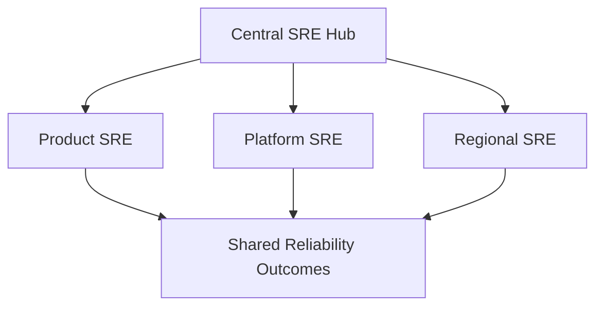
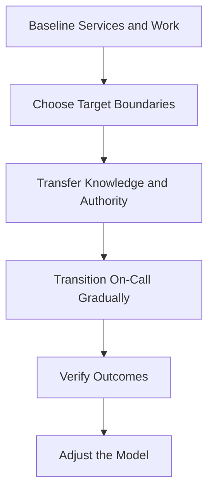

# SRE Operating Models

> An SRE operating model defines how reliability responsibility, authority, engineering capacity, on-call, service ownership, funding, and decision-making are organized. The correct model is not determined by company size or fashion. It must fit the services, risks, skills, and organizational constraints while preserving the defining principles of SRE.

## Section Purpose

SRE does not require one organization chart.

An organization may use a centralized SRE team, embed SREs within service teams, operate a consulting group, assign SRE to shared infrastructure, create product-aligned SRE teams, use a federated reliability model, or adopt SRE practices without hiring anyone with the SRE title.

Each model creates different strengths, failure modes, ownership boundaries, and staffing demands.

The operating model must answer:

- Which services receive SRE support?
- What depth of support do they receive?
- Who owns the service outcome?
- Who carries the pager?
- Who can stop unsafe change?
- How is SRE work prioritized and funded?
- How is toil controlled?
- How are practices standardized?
- How does a service enter or leave SRE support?
- How does the organization verify that the model works?

This section explains:

- The elements of an SRE operating model
- Major team structures and engagement patterns
- SRE practices without dedicated SRE staff
- Centralized, product-aligned, infrastructure, tools, embedded, consulting, federated, and regional models
- Tiered service support
- Team charters, service onboarding, workload control, and handback
- Funding, staffing, leadership, governance, and career considerations
- Model-selection criteria and migration strategies
- Common operating-model failures

The objective is not to choose the most impressive model. It is to choose the smallest credible model that can produce reliable services and sustainable engineering work.

---

## Learning Objectives

After completing this section, you should be able to:

1. Define an SRE operating model and identify its required elements.
2. Explain why SRE practices do not require a dedicated SRE team.
3. Compare centralized, embedded, product-aligned, infrastructure, tools, consulting, federated, and regional models.
4. Identify the strengths and risks of each model.
5. Design service tiers and engagement boundaries.
6. Define onboarding, handback, transfer, and exit criteria.
7. Match accountability with production authority.
8. Evaluate staffing, on-call, funding, and engineering-capacity requirements.
9. Select a model using service risk and organizational evidence.
10. Recognize when an SRE organization has become a gatekeeper, ticket queue, or renamed operations function.

---

## 1. What an SRE Operating Model Is

An SRE operating model is the complete arrangement through which an organization applies SRE principles and performs reliability work.

It includes:

- Team structure
- Service scope
- Responsibility boundaries
- Decision authority
- On-call model
- Engineering work
- Toil limits
- Funding
- Staffing
- Governance
- Service lifecycle
- Success measures

A team name alone is not an operating model.

---

## 2. The Model Must Serve the Reliability Mission

The purpose of the model is to help services meet explicit reliability objectives with controlled risk and sustainable human effort.

The organization chart is a means, not the outcome.

Evaluate whether the model improves:

- User reliability
- Ownership
- Decision quality
- Incident response
- Recovery
- Engineering capacity
- Operational sustainability

---

## 3. SRE Principles Before Team Structure

Before choosing a structure, establish principles such as:

- Reliability is defined through meaningful service objectives.
- SLO performance has consequences.
- Product teams retain production responsibility.
- SRE has time for lasting engineering work.
- SRE can regulate operational workload.
- On-call is sustainable.
- Failure produces learning.
- Authority matches responsibility.

Structure without these principles can reproduce traditional problems under new titles.

---

## 4. Practices Without an SRE Team

An organization can apply SRE practices without dedicated SRE staff.

Service teams can:

- Identify Critical User Journeys
- Define SLIs and SLOs
- Establish error-budget policies
- Improve alerting
- Operate on-call
- Measure toil
- Review incidents
- Test recovery

This model is appropriate when scale or risk does not justify a separate team.

---

## 5. The SRE Advocate Model

One or more engineers may act as part-time SRE advocates while remaining in existing teams.

They may:

- Introduce shared language
- Facilitate initial SLOs
- Improve incident practice
- Identify repeated work
- Build a reliability community
- Collect evidence for future investment

The main risk is that ordinary delivery work consumes all available reliability time.

---

## 6. The Reliability Champion Network

Each service team designates a reliability champion.

Champions coordinate through a shared forum and may maintain:

- SLO standards
- Incident practices
- Reliability reviews
- Learning sessions
- Common templates
- Escalated risks

Champions need allocated time and leadership support. An unpaid extra duty is not a durable model.

---

## 7. The Kitchen-Sink Model

A kitchen-sink SRE team accepts a broad range of services and reliability work.

Potential strengths:

- Fast initial formation
- Few organizational boundaries
- Broad visibility
- Cross-service pattern discovery

Major risks:

- Unbounded scope
- Shallow support
- Excessive context switching
- Organization-wide dependency on one team
- Operational overload

This model is safest only while the organization and service scope remain small.

---

## 8. The Centralized SRE Model

A centralized SRE team supports several services from one organizational home.

Potential strengths:

- Shared expertise
- Consistent practices
- Cross-service visibility
- Concentrated engineering capacity
- Easier professional development

Potential risks:

- Weak service context
- Ticket-driven engagement
- Too many supported services
- Perceived gatekeeping
- Product teams losing ownership

Strong charters and service tiers are essential.

---

## 9. The Product-Aligned SRE Model

An SRE team is aligned to a major product, business capability, or service group.

Potential strengths:

- Clear business connection
- Deep architecture knowledge
- Stable partner relationships
- Strong incident context
- Focused reliability roadmap

Potential risks:

- Duplicated tooling
- Different standards between products
- Limited mobility
- Local priorities overriding shared needs

Horizontal coordination can reduce divergence.

---

## 10. The Application SRE Model

Application SRE focuses on a specific user-facing service or tightly related service set.

Typical work includes:

- SLOs
- Application on-call
- Capacity
- Release safety
- Dependency analysis
- Incident response
- Resilience engineering

The application team must retain code ownership and production participation.

---

## 11. The Infrastructure SRE Model

Infrastructure SRE supports shared foundations such as:

- Compute
- Networks
- Storage
- Runtime platforms
- Identity
- Traffic systems
- Shared databases

Potential strength comes from improving reliability for many services at once.

The major risk is measuring infrastructure health without connecting it to dependent service outcomes.

---

## 12. The Platform-Aligned SRE Model

SRE may support an internal platform as a production service.

Responsibilities may include:

- Platform SLIs and SLOs
- Control-plane reliability
- Capacity
- Incident response
- Tenant impact
- Recovery
- Platform toil

Application teams still own their workloads and external user outcomes.

---

## 13. The Tools SRE Model

A tools SRE team builds reliability capabilities used by other teams.

Examples include:

- SLO systems
- Incident tooling
- Capacity systems
- Alerting frameworks
- Release safeguards
- Reliability testing

Risks include building tools without user evidence, creating support toil, and becoming an infrastructure team without updating the charter.

---

## 14. The Reliability Standards Model

A standards group defines common expectations for:

- SLOs
- Error budgets
- Production readiness
- Incident response
- Alerting
- Recovery testing
- Service ownership

Its influence may rely on guidance, automated conformance, formal mandates, or a combination.

Standards need implementation support and exception paths.

---

## 15. The Embedded SRE Model

SREs work inside or closely beside a service team for a defined period or purpose.

Potential strengths:

- Deep context
- Fast collaboration
- Direct code changes
- Practical transfer of SRE methods
- Early design influence

Potential risks:

- Isolation from SRE peers
- Inconsistent practice
- Feature work consuming SRE time
- Permanent embedding without clear ownership

Time, purpose, reporting, and exit conditions must be explicit.

---

## 16. The Consulting SRE Model

A consulting team advises many service teams without taking permanent on-call or code ownership.

It may provide:

- SLO workshops
- Production-readiness reviews
- Incident-program design
- Risk analysis
- Capacity reviews
- Resilience assessments
- Recovery exercises

The model scales influence, but recommendations need accountable implementation owners.

---

## 17. Embedded Versus Consulting

| Dimension | Embedded SRE | Consulting SRE |
| --- | --- | --- |
| Service context | Deep | Broader but often shallower |
| Hands-on code changes | Common | Limited or engagement dependent |
| Duration | Usually time bounded | Often project or advisory based |
| On-call | May participate temporarily | Usually not primary owner |
| Main value | Direct improvement and capability transfer | Advice, review, standards, and reach |
| Main risk | Becomes permanent service labor | Advice lacks context or implementation |

---

## 18. The Federated SRE Model

A central reliability function defines shared practices while reliability engineers work within product, regional, or platform teams.

The center may own:

- Standards
- Shared tooling
- Training
- Community
- Cross-service risk
- Career framework

Local teams retain service context and execution.

Federation requires clear authority and a way to resolve incompatible local decisions.

---

## 19. The Hub-and-Spoke Model

The hub provides shared SRE capabilities and governance. Spokes provide service-aligned reliability work.

The hub should enable and coordinate rather than become an approval bottleneck.

---

## 20. The Regional SRE Model

SRE teams are organized by geography or time zone.

Potential strengths:

- Local coverage
- Follow-the-sun response
- Regional regulatory or infrastructure knowledge
- Reduced night work

Potential risks:

- Handoff loss
- Regional silos
- Unequal authority
- Divergent practices
- Duplicate ownership

One service still needs coherent global accountability.

---

## 21. Follow-the-Sun Operations

Work transfers between regions as the day progresses.

A safe model requires:

- Overlap time
- Structured handoff
- Shared incident record
- Consistent access
- Equal training
- Clear commander transfer
- Global escalation

Handoffs reduce night work but introduce coordination risk.

---

## 22. The Dual-Site Model

Two sites share ownership of the same services and on-call rotation.

Benefits may include:

- Resilience to local disruption
- Broader hiring
- Time-zone coverage
- Shared knowledge

Risks include an “us and them” culture, uneven work, and split technical direction.

Leadership and technical ownership must span both sites.

---

## 23. The Service-Owned SRE Model

One team builds and operates the complete service while applying SRE practices internally.

There is no separate application team to receive a handback.

The team must balance:

- Features
- Reliability
- On-call
- Capacity
- Toil
- Engineering work

Error-budget policy and workload control remain necessary.

---

## 24. The Shared-On-Call Model

SRE and application engineers share the pager.

Potential benefits:

- Shared production knowledge
- Aligned incentives
- Broader staffing
- Faster application diagnosis

Requirements include equal training, access, authority, clear escalation, and fair load.

Shared paging without shared capability is unsafe.

---

## 25. The SRE-Primary On-Call Model

SRE serves as the primary responder and escalates application expertise when required.

This model needs:

- Deep service knowledge
- Authority
- Actionable alerts
- Application escalation
- Toil limits
- Corrective participation from service teams

SRE must not become a buffer that shields developers from production consequences.

---

## 26. The Application-Primary Model

Application teams own primary on-call. SRE provides escalation, systems expertise, tooling, standards, or consulting.

This model can work when application teams have:

- Production access
- Training
- Good observability
- Reliable deployment
- Recovery procedures
- Time for corrective work

SRE support should strengthen, not replace, their ownership.

---

## 27. The Temporary Recovery Model

An SRE team embeds with an overloaded service to restore sustainable operation.

The engagement may:

- Reduce paging
- Repair observability
- Establish SLOs
- Remove toil
- Improve deployment
- Transfer knowledge

It needs measurable entry, stabilization, transfer, and exit conditions.

---

## 28. The Launch Coordination Model

A reliability team helps services prepare for launch without assuming long-term operation.

It may provide:

- Readiness standards
- Risk reviews
- Capacity assessment
- Launch checklists
- Staged rollout guidance
- Incident preparation

The service team remains accountable after launch.

---

## 29. Customer Reliability Engineering

Customer Reliability Engineering applies SRE practices at a provider-customer boundary.

It may help customers:

- Define SLOs
- Analyze architecture risk
- Prepare incidents
- Understand provider dependencies
- Improve reliability practices

The model does not transfer complete customer-service ownership to the provider.

---

## 30. Managed-Service SRE

An external provider may perform reliability work for a customer service.

The contract must define:

- Service boundary
- SLOs and SLAs
- Access
- On-call
- Incident roles
- Change authority
- Data handling
- Recovery
- Exit and knowledge transfer

Outsourcing work does not remove the customer's business accountability.

---

## 31. Hybrid Models

Most mature organizations combine models.

Example:

- Central standards team
- Infrastructure SRE
- Product-aligned SRE for critical services
- Embedded SRE for temporary projects
- Application-owned on-call for other services

Hybrid design should be intentional. Accidental mixtures create unclear ownership.

---

## 32. Model Components Can Change Independently

A team may be:

- Centralized in reporting
- Embedded in daily work
- Product aligned in scope
- Shared in on-call
- Federated in standards

Do not classify the whole operating model using one organizational dimension.

---

## 33. The Team Charter

Every SRE team needs a charter stating:

- Mission
- Services
- Users
- Responsibilities
- Exclusions
- Decision authority
- On-call model
- Work boundaries
- Partners
- Success measures
- Review cadence

An unbounded charter is an overload plan.

---

## 34. Charter Exclusions

Explicit exclusions may include:

- End-user support
- Routine account administration
- Application feature ownership
- Unreviewed manual deployments
- Unsupported legacy services
- Services without accountable owners

Exclusions should include the correct destination or escalation path where possible.

---

## 35. Service Tiers

Service tiers allow different depths of SRE involvement.

An example model:

| Tier | SRE involvement |
| --- | --- |
| Tier 0 | Published standards and occasional guidance |
| Tier 1 | Time-bounded project or consulting support |
| Tier 2 | Regular reliability partnership without primary on-call |
| Tier 3 | Fully onboarded shared ownership and on-call |

Tier names and details should fit the organization.

---

## 36. Tier Criteria

Tier assignment may consider:

- Business criticality
- User harm
- Reliability objective
- Service complexity
- Incident history
- Operational load
- Regulatory importance
- SRE capacity
- Service-team maturity

Political visibility alone should not determine depth of support.

---

## 37. Tier Commitments

For each tier, document:

- SRE time
- On-call
- Review frequency
- Required artifacts
- Incident participation
- Engineering work
- Escalation
- Exit conditions

Teams must not assume that consulting support includes full operational ownership.

---

## 38. Service Selection

SRE support should prioritize services where specialized reliability work creates material value.

Consider:

- Business and user impact
- Reliability challenge
- Scale
- Reusable learning
- Ability to improve the system
- Service-owner commitment
- Cost of engagement

Unreliability alone does not automatically justify SRE ownership.

---

## 39. Minimum Viable Service Set

Identify the smallest set of services required for critical product journeys.

Prioritize:

- Authentication
- Transaction paths
- Critical data
- Traffic control
- Recovery dependencies
- Shared failure points

Noncritical services should degrade without preventing essential outcomes.

---

## 40. Onboarding Criteria

Before full SRE support, require:

- Named service owner
- Defined Critical User Journeys
- Initial SLOs
- Architecture and dependencies
- Observability
- Capacity model
- Change and rollback
- Incident procedures
- Recovery evidence
- Measured operational work

Gaps may become onboarding work, but ownership must remain clear.

---

## 41. Onboarding Decision

The decision should identify:

- Accepted scope
- Required remediation
- Owners
- Schedule
- Pager transition
- Risk exceptions
- Review point
- Exit or handback criteria

SRE must have authority to decline or delay unsafe onboarding.

---

## 42. Gradual Pager Transfer

A safe transfer may progress through:

1. Observation
2. Paired response
3. Secondary on-call
4. Shared primary rotation
5. Independent response with escalation

Progress requires demonstrated competence, not elapsed time alone.

---

## 43. Handback

SRE may return operational responsibility when:

- Toil exceeds the agreed boundary
- SLO operation is impossible within available capacity
- The service owner rejects required reliability work
- The engagement objective is complete
- Organizational priorities change

Handback should be planned, documented, and safe.

---

## 44. Handback Is Not Punishment

Handback protects sustainable operation and restores accountability.

A handback record should state:

- Reason
- Evidence
- Current risks
- New owner
- Pager transfer
- Access changes
- Required follow-up
- Effective date

User safety remains important during the transition.

---

## 45. Exit From a Successful Engagement

SRE may leave because the service is healthy and remaining work no longer requires dedicated SRE expertise.

Success evidence may include:

- Stable SLO performance
- Sustainable on-call
- Reduced toil
- Tested recovery
- Capable service ownership
- Reliable change process
- Transferred knowledge

Perpetual engagement is not always the best use of scarce SRE capacity.

---

## 46. Workload Self-Determination

A mature SRE team needs meaningful control over its workload.

It should be able to:

- Prioritize reliability engineering
- Reject inappropriate work
- Limit onboarding
- Reduce operational scope
- Escalate overload
- Hand back services

Without workload control, SRE becomes an unlimited operations queue.

---

## 47. Toil Boundary

The operating model should define:

- What counts as operational work
- What counts as toil
- How it is measured
- The maximum acceptable level
- Who responds when it is exceeded
- Which commitments may change

The exact percentage may vary. The enforcement mechanism is essential.

---

## 48. Engineering Capacity

SRE must retain time to:

- Remove failure modes
- Improve automation
- Redesign systems
- Strengthen observability
- Test recovery
- Improve capacity
- Reduce toil

A team with no project capacity is not operating as SRE.

---

## 49. Staffing the Rotation

Staffing should account for:

- Coverage hours
- Page frequency
- Incident duration
- Service complexity
- Secondary support
- Leave
- Training
- Recovery after severe incidents

An organizational model is unsafe if it depends on a permanently exhausted rotation.

---

## 50. Skill Composition

A balanced SRE capability may require:

- Software engineering
- Systems engineering
- Networking
- Storage and data
- Distributed systems
- Capacity and performance
- Incident leadership
- Security
- Communication

Not every individual must have equal depth in every area.

---

## 51. Team Size

Team size should reflect:

- Operational load
- Service complexity
- On-call design
- Engineering commitments
- Geographic coverage
- Skill diversity
- Management span

Copying another company's ratio without matching context creates false precision.

---

## 52. SRE Scarcity

Demand for SRE support often exceeds available qualified engineers.

The operating model should therefore:

- Prioritize high-impact services
- Use tiers
- Build reusable capabilities
- Train service teams
- Limit full engagements
- Review existing commitments

Scarcity should drive discipline, not chronic overload.

---

## 53. Funding Model

Funding may come from:

- Central technology budget
- Product organization
- Shared platform budget
- Allocated service cost
- Temporary transformation program

Funding affects incentives and authority.

Reliability should not be treated as an optional external service purchased only after failure.

---

## 54. Central Funding

Central funding can support:

- Organization-wide standards
- Shared tools
- Cross-service risk
- Independent escalation
- Consistent career paths

Risks include distance from product priorities and pressure to support everyone equally.

---

## 55. Product Funding

Product funding can align SRE work with business outcomes.

Risks include:

- Feature pressure controlling SRE priorities
- Reduced independence
- Reliability work cut during budget pressure
- Different funding across equally critical shared systems

Governance must protect engineering and risk responsibilities.

---

## 56. Chargeback and Allocation

Internal allocation can expose the cost of support.

Poor models may encourage teams to avoid reporting incidents, reject necessary reliability work, or dispute ownership.

Use cost information for planning and accountability, not to turn every SRE interaction into a transaction.

---

## 57. Reporting Structure

SRE may report through:

- Infrastructure engineering
- Product engineering
- Platform engineering
- Operations
- A dedicated reliability organization
- A federated structure

The reporting line matters less than whether the model preserves SRE principles and authority.

---

## 58. Technical Leadership

Technical leaders coordinate:

- Architecture direction
- Reliability standards
- Cross-team decisions
- Complex incidents
- Engineering quality
- Knowledge sharing

In multi-team models, an overarching technical lead can prevent gaps and incompatible local designs.

---

## 59. Management Responsibilities

SRE managers protect:

- Team charter
- Staffing
- On-call sustainability
- Engineering capacity
- Partner relationships
- Workload control
- Career development
- Risk escalation

They should not evaluate the team only through uptime.

---

## 60. Reliability Governance

Governance may include:

- SLO standards
- Error-budget policies
- Production-readiness criteria
- Incident severity
- Recovery-test requirements
- Service tiers
- Exception management
- Periodic service review

Governance should improve decisions without becoming a universal manual gate.

---

## 61. Reliability Review

A periodic review may assess:

- SLO performance
- Error-budget use
- Pager load
- Toil
- Incidents
- Engineering delivery
- Corrective work
- Capacity
- Recovery readiness
- Team health

Review context before interpreting changes in metrics.

---

## 62. Production Excellence Review

A senior cross-team review can identify patterns and teams at risk of overload.

It should:

- Recognize effective work
- Provide technical guidance
- Escalate structural problems
- Share patterns
- Support struggling teams

It should not rank teams using one uncontextualized score.

---

## 63. Standards Through Influence

Teams may adopt standards because they:

- Solve a real problem
- Reduce work
- Improve safety
- Come with usable tooling
- Have credible evidence
- Are supported by respected engineers

Influence is powerful where local autonomy is strong.

---

## 64. Standards Through Mandate

Mandates may be appropriate for:

- Legal obligations
- Security controls
- Severe shared risk
- Minimum incident capability
- Required ownership records

Mandates need clear authority, implementation support, evidence, and exception processes.

---

## 65. Conformance Automation

Automated checks can verify minimum standards for:

- Ownership
- SLO configuration
- Alert routing
- Backup policy
- Identity
- Deployment safeguards
- Required metadata

Conformance tests must be versioned, observable, and safe. Passing a check does not prove complete reliability.

---

## 66. Cross-Team Community

An SRE community can support:

- Technical talks
- Incident learning
- Shared reviews
- Standards discussion
- Mentoring
- Tool reuse
- Career development

Community improves consistency without requiring every engineer to report to one manager.

---

## 67. Training Model

Training should cover:

- SRE principles
- SLOs
- Risk
- On-call
- Incident command
- Troubleshooting
- Change safety
- Capacity
- Recovery
- Internal systems

Training needs practical exercises and demonstrated readiness.

---

## 68. Rotation and Exchange

Temporary rotations can:

- Spread production knowledge
- Improve relationships
- Expose documentation gaps
- Share practices
- Develop engineers

Rotations need defined learning goals, supervision, and safe access.

---

## 69. Career Model

SRE career paths should recognize:

- Software engineering
- Systems depth
- Incident leadership
- Reliability architecture
- Cross-team influence
- Operational excellence
- Tool and platform development

Promotion should not reward heroics or page volume.

---

## 70. Geographic Expansion

Before creating a new site, evaluate:

- Service need
- Talent availability
- Time-zone benefit
- Leadership
- Training capacity
- Travel and relationship cost
- Pager transition
- Ownership boundaries

Geographic distribution is an organizational change, not only a scheduling change.

---

## 71. Splitting an SRE Team

A team may split because of:

- Service complexity
- Cognitive load
- Product boundaries
- Geography
- Technical specialization
- On-call scale

Every service and component must have a named destination after the split.

---

## 72. Architectural Split

Teams may divide by:

- Frontend and backend
- Compute and storage
- Control plane and data plane
- Online and batch
- Regional and global systems

Architectural splits need end-to-end incident and SLO coordination.

---

## 73. Product Split

Product-aligned teams can deepen ownership and business context.

They may duplicate:

- Tooling
- Standards
- Capacity systems
- Incident methods

A central community or shared platform can reduce unnecessary divergence.

---

## 74. Service Complexity Limit

A team can support only a limited number of distinct services safely.

Complexity grows with:

- Architectures
- Languages
- Dependencies
- On-call procedures
- Failure modes
- Business domains

Count alone is insufficient. Ten similar services may create less cognitive load than two unrelated critical systems.

---

## 75. Model Selection Criteria

Evaluate:

- Service criticality
- Number and diversity of services
- Existing ownership
- Engineering skills
- Operational load
- Geographic distribution
- Shared infrastructure
- Regulatory needs
- Funding
- Organizational culture

No single factor determines the answer.

---

## 76. Small Organization Model

A small organization may begin with:

- Service-owned SRE practices
- One reliability advocate
- Shared on-call
- Initial SLOs
- Simple incident roles
- Limited recovery exercises

Creating a separate SRE team too early can fragment a small engineering group.

---

## 77. Growing Organization Model

A growing organization may add:

- Central reliability guidance
- Shared observability and incident capabilities
- Product-aligned reliability roles
- Service tiers
- Onboarding criteria
- Toil measurement

Growth should follow demonstrated need and staffing capacity.

---

## 78. Large Organization Model

A large organization may need:

- Federated SRE
- Infrastructure and product SRE teams
- Central standards
- Shared tooling
- Regional coverage
- Tiered engagements
- Formal service review
- Career and training programs

Complex structure increases the need for clear boundaries.

---

## 79. Regulated Organization Model

Regulated environments may require:

- Separation of duties
- Formal risk acceptance
- Auditable change
- Recovery evidence
- Data controls
- Documented accountability

SRE can implement these controls through automation and evidence without removing required governance.

---

## 80. Multi-Cloud and Hybrid Environment

Organizing teams by provider may deepen expertise but fragment service ownership.

Organizing by service preserves user context but requires broad platform knowledge.

A hybrid model may use provider specialists with service-aligned SRE accountability.

---

## 81. Acquisition and Merger Model

During integration, avoid forcing one model before understanding:

- Services
- Ownership
- On-call
- Reliability objectives
- Tooling
- Skills
- Regulatory boundaries
- Culture

Standardize critical interfaces first, then change structures based on evidence.

---

## 82. Model Migration

A safe migration follows:

Changing reporting lines before transferring capability creates risk.

---

## 83. Migration Baseline

Record:

- SLO performance
- Services and owners
- Pager load
- Incidents
- Toil
- Engineering capacity
- Capacity risks
- Recovery evidence
- Team health

Without a baseline, improvement claims are difficult to verify.

---

## 84. Responsibility Transfer

Transfer requires:

- Named source and destination owners
- Service knowledge
- Access
- Runbooks
- Incident history
- SLO data
- Capacity model
- Recovery evidence
- Joint operating period
- Formal acceptance

Do not transfer a pager without transferring authority and knowledge.

---

## 85. Organizational Stability

Frequent team restructures can weaken:

- Trust
- Service knowledge
- Ownership
- Career clarity
- Incident response
- Engineering progress

Choose a coherent model and allow enough time to evaluate it.

---

## 86. Measuring Model Success

Measure outcomes across:

- User reliability
- SLO decisions
- Incident impact
- Detection and recovery
- Toil
- Engineering project work
- On-call health
- Ownership clarity
- Partner feedback
- Recovery readiness

No organization chart proves success by itself.

---

## 87. Leading Indicators

Possible leading indicators include:

- SLO coverage for critical journeys
- Alert actionability
- Readiness completion
- Recovery-test frequency
- Toil trend
- Engineering capacity
- Training readiness
- Ownership completeness

Leading indicators should connect to meaningful outcomes.

---

## 88. Lagging Indicators

Possible lagging indicators include:

- User-impact minutes
- Severe incidents
- SLO misses
- Recovery performance
- Repeated failure
- Attrition
- Escalation failure

Lagging indicators confirm outcomes after risk has materialized.

---

## 89. Qualitative Evidence

Collect evidence from:

- On-call engineers
- Product teams
- Platform teams
- Incident participants
- Service owners
- Users where appropriate

Numbers may not reveal unclear authority, poor trust, or hidden operational work.

---

## 90. Common Anti-Pattern: Everything SRE

Symptoms include:

- Unbounded service scope
- Every production ticket sent to SRE
- Shallow service knowledge
- No onboarding criteria
- No ability to refuse work

Repair through a charter, service tiers, ownership, and workload control.

---

## 91. Common Anti-Pattern: SRE as Gatekeeper

Symptoms include:

- Late mandatory review
- Approval queues
- Little hands-on help
- Unclear criteria
- Teams bypassing controls

Prefer early partnership, automated safeguards, transparent standards, and risk-proportionate review.

---

## 92. Common Anti-Pattern: Embedded Forever

An embedded SRE becomes the service team's permanent operator.

Consequences include:

- Lost application ownership
- Isolation
- Feature work replacing reliability work
- No capability transfer

Use time-bounded objectives and exit evidence.

---

## 93. Common Anti-Pattern: Consulting Without Implementation

The consulting team produces reviews and recommendations that have no owners or priority.

Require:

- Partner commitment
- Action owners
- Decision authority
- Review dates
- Outcome verification

Advice without a path to action has limited production value.

---

## 94. Common Anti-Pattern: Infrastructure Is Always Green

Infrastructure SRE reports healthy components while customer journeys fail.

Connect platform and infrastructure measures to:

- Dependent services
- Critical journeys
- Tenant impact
- End-to-end incidents

Local SLOs need dependency context.

---

## 95. Common Anti-Pattern: Regional Silos

Regional teams use different procedures, access, tooling, and severity definitions.

Consequences include unsafe handoffs and unequal service response.

Standardize the minimum global operating contract while preserving valid regional differences.

---

## 96. Common Anti-Pattern: Tier Inflation

Every service claims the highest support tier.

Prevent this with:

- Objective eligibility
- Published commitments
- Cost visibility
- Capacity limits
- Periodic review
- Authorized exception

The highest tier should represent real need and support capability.

---

## 97. Common Anti-Pattern: Renamed Operations

Warning signs include:

- No SLOs
- No error budgets
- No engineering capacity
- Unlimited tickets
- Application teams absent from on-call
- Responsibility without authority

Changing the team name does not create SRE.

---

## 98. Common Anti-Pattern: Reorganization as Reliability Work

Moving people between managers may change coordination but does not directly fix:

- Failure modes
- Alert quality
- Capacity
- Recovery
- Toil
- Unsafe releases

Organizational change needs a specific reliability hypothesis and verification plan.

---

## 99. Production Scenario: Central Team Overload

A central SRE team supports forty unrelated services. Pages increase every month, project work stops, and no service has onboarding criteria.

### Analysis

The model has exceeded its cognitive and operational capacity.

### Appropriate actions

1. Freeze new onboarding.
2. Measure service load and criticality.
3. Introduce tiers.
4. Hand back inappropriate services safely.
5. Split scope or add qualified capacity where justified.

---

## 100. Production Scenario: Embedded SRE Becomes Feature Engineer

An embedded SRE is assigned application features because the product deadline is urgent. Reliability work and pager improvement stop.

### Analysis

The engagement charter and reporting protection are ineffective.

### Appropriate actions

1. Restate the engagement objective.
2. Protect allocated reliability capacity.
3. Escalate priority conflict.
4. Measure missed reliability work.
5. Exit or redesign the engagement if the model cannot be sustained.

---

## 101. Production Scenario: Consulting Findings Ignored

A consulting SRE team identifies severe recovery gaps. The service team accepts the report but schedules no work.

### Analysis

The model lacks decision authority and accountable follow-through.

### Appropriate actions

1. Assign risk owners.
2. Quantify user and business impact.
3. Set decision deadlines.
4. Escalate unresolved risk.
5. Record authorized acceptance or remediation.

---

## 102. Production Scenario: Follow-the-Sun Handoff Failure

A regional team transfers an incident through chat without a structured record. The next team repeats diagnostics and reverses a useful mitigation.

### Analysis

The staffing model reduced night work but introduced unsafe state transfer.

### Appropriate actions

1. Restore incident control.
2. Use one shared timeline.
3. Require verbal and written handoff.
4. Transfer command explicitly.
5. Exercise the handoff process.

---

## 103. Production Scenario: Highest Tier for Every Service

Business leaders request full SRE on-call for every application. SRE staffing can support only six critical services.

### Analysis

Demand exceeds specialized capacity and the tier model lacks enforceable eligibility.

### Appropriate actions

1. Rank services by user and business impact.
2. Define tier commitments and cost.
3. Provide standards and training for lower tiers.
4. Require executive acceptance of uncovered risk.
5. Review allocation periodically.

---

## 104. Production Scenario: Successful Engagement Never Ends

A service has met its SLO for two years, pager load is low, and the product team is capable. SRE remains assigned because no exit process exists.

### Analysis

Scarce SRE capacity is locked in a completed engagement.

### Appropriate actions

1. Assess exit criteria.
2. Transfer remaining knowledge and access.
3. Move on-call gradually.
4. Retain consulting escalation if useful.
5. Reassign SRE to higher-impact work.

---

## 105. Practical Exercise: Describe the Current Model

Document:

- Team structure
- Service scope
- Reporting line
- On-call
- Responsibilities
- Authority
- Funding
- Staffing
- Workload boundary
- Success measures

Describe actual practice, not the intended organization chart.

---

## 106. Practical Exercise: Compare Three Models

Choose three candidate operating models.

For each, evaluate:

- Service context
- Ownership
- Scale
- On-call
- Engineering capacity
- Standardization
- Cost
- Main failure mode

Recommend one model and state the assumptions behind the choice.

---

## 107. Practical Exercise: Design Service Tiers

Create three or four tiers with:

- Eligibility
- SRE time
- On-call commitment
- Required artifacts
- Incident support
- Review frequency
- Exit criteria

Test the model against five real services.

---

## 108. Practical Exercise: Write a Team Charter

Define:

- Mission
- Supported services
- Users
- Responsibilities
- Exclusions
- Decision rights
- Workload limits
- Partners
- Measures
- Review cadence

Ask whether any phrase creates unlimited responsibility.

---

## 109. Practical Exercise: Create Onboarding Criteria

Define minimum evidence for:

- Ownership
- SLOs
- Architecture
- Observability
- Capacity
- Change
- Security
- Incident response
- Recovery
- Operational load

Specify who can approve exceptions.

---

## 110. Practical Exercise: Plan a Handback

Choose one service that should leave full SRE support.

Plan:

- New owner
- Knowledge transfer
- Pager transition
- Access
- Open risks
- Required exercises
- Effective date
- Post-transfer review

Do not transfer responsibility before capability is verified.

---

## 111. Practical Exercise: Audit Workload Sustainability

Measure:

- Page volume
- Night interruption
- Incident time
- Tickets
- Toil
- Engineering work
- Staffing
- Leave coverage

Define the action that follows a breached boundary.

---

## 112. Practical Exercise: Simulate Regional Handoff

Run an incident exercise across two teams.

Test:

- Shared record
- Command transfer
- Access
- Context preservation
- Escalation
- Communication
- Recovery verification

Update the model based on observed failures.

---

## 113. Practical Exercise: Build a Migration Plan

For a proposed reorganization, define:

- Reliability hypothesis
- Baseline
- Target model
- Responsibility changes
- Knowledge transfer
- Pager transition
- Risks
- Measures
- Review dates

Do not use team movement as the only deliverable.

---

## 114. SRE Operating-Model Checklist

### Principles

- [ ] SLO performance has consequences.
- [ ] Product teams retain production responsibility.
- [ ] SRE has protected engineering time.
- [ ] SRE can regulate workload.

### Structure

- [ ] The model is described beyond reporting lines.
- [ ] Team charters define scope and exclusions.
- [ ] Service and platform boundaries are clear.
- [ ] Hybrid elements are intentional.

### Engagement

- [ ] Service tiers are defined.
- [ ] Onboarding criteria use evidence.
- [ ] On-call responsibilities are explicit.
- [ ] Handback and exit are possible.

### Authority

- [ ] Responsibility is matched by decision rights.
- [ ] Release and rollback authority are clear.
- [ ] Risk acceptance has an authorized owner.
- [ ] Escalation is tested.

### Sustainability

- [ ] Staffing supports the rotation.
- [ ] Toil and operational work are measured.
- [ ] Engineering capacity is protected.
- [ ] Overload triggers defined action.

### Scale

- [ ] Service complexity is considered.
- [ ] Geographic handoffs preserve context.
- [ ] Standards support multiple teams.
- [ ] Team splits preserve complete ownership.

### Governance

- [ ] Reviews use outcomes and context.
- [ ] Exceptions are recorded.
- [ ] Training and community are funded.
- [ ] Model success is measured against a baseline.

---

## 115. Reflection Questions

1. Which operating model does your organization actually use?
2. Can teams practice SRE without dedicated SRE staff?
3. Which services deserve full SRE support?
4. Can SRE decline onboarding or hand back a service?
5. Does the funding model distort reliability priorities?
6. Which regional handoff creates the most risk?
7. Is an embedded engagement transferring capability?
8. Does the central team enable services or gate them?
9. Which service tier is overcommitted?
10. What evidence proves the model improved reliability?

---

## 116. Knowledge Check

1. What elements make up an SRE operating model?
2. Why can SRE practices exist without an SRE team?
3. What is the main risk of the kitchen-sink model?
4. How does embedded SRE differ from consulting SRE?
5. What does a federated model combine?
6. Why are service tiers useful?
7. What should onboarding criteria verify?
8. Why must SRE be able to regulate workload?
9. When is handback appropriate?
10. What risks accompany regional SRE models?
11. Why is team size not determined by a universal ratio?
12. How should model success be measured?

---

## 117. Knowledge Check Answers

1. Structure, service scope, responsibilities, authority, on-call, engineering work, toil limits, funding, staffing, governance, lifecycle, and measures.
2. Service teams can use CUJs, SLOs, error budgets, on-call, toil control, incidents, and recovery practices directly.
3. Unbounded scope that creates overload, shallow service knowledge, and loss of engineering capacity.
4. Embedded SRE usually works hands-on within a team for a bounded period, while consulting SRE primarily advises and reviews without taking direct ownership.
5. Central standards, tools, community, and governance with locally embedded or aligned reliability execution.
6. They match scarce SRE capacity and commitments to service criticality and need.
7. Ownership, objectives, architecture, observability, capacity, change safety, incident readiness, recovery, and operational workload.
8. Without workload control, operational demand consumes engineering capacity and turns SRE into an unlimited queue.
9. When operational boundaries are breached, owners reject necessary work, the engagement completes, or another model better serves the service.
10. Handoff loss, regional silos, unequal authority, divergent practice, and duplicate ownership.
11. Required staffing depends on service complexity, pager load, coverage, skills, engineering commitments, and risk.
12. Through user reliability, incidents, recovery, toil, engineering capacity, team health, ownership, partner evidence, and readiness.

---

## 118. Key Takeaways

- SRE does not require one organization chart.
- SRE practices can begin without dedicated SRE staff.
- The operating model must preserve SLO consequences, engineering time, workload control, shared ownership, and sustainable on-call.
- Centralized, product-aligned, infrastructure, tools, embedded, consulting, federated, and regional models create different tradeoffs.
- Hybrid models are common and should be documented intentionally.
- Service tiers help allocate scarce SRE capacity.
- Team charters must define scope, exclusions, authority, and measures.
- Onboarding, pager transfer, handback, and exit require evidence.
- SRE must be able to regulate operational workload.
- Funding and reporting lines affect incentives but do not define SRE by themselves.
- Reorganization is not proof of reliability improvement.
- The best model is the smallest credible arrangement that produces reliable services and sustainable engineering work.

---

## 119. Authoritative Resources

### SRE Team Structures and Lifecycles

- [Google SRE Workbook: SRE Team Lifecycles](https://sre.google/workbook/team-lifecycles/)
- [Google Cloud: How SRE Teams Are Organized](https://cloud.google.com/blog/products/devops-sre/how-sre-teams-are-organized-and-how-to-get-started)
- [Google SRE Workbook: SRE Engagement Model](https://sre.google/workbook/engagement-model/)
- [Google SRE Workbook: SRE Reaching Beyond Your Walls](https://sre.google/workbook/reaching-beyond/)
- [Google SRE Workbook: Organizational Change Management in SRE](https://sre.google/workbook/organizational-change/)

### Core SRE Principles

- [Google SRE Book: Introduction](https://sre.google/sre-book/introduction/)
- [Google SRE Book: Embracing Risk](https://sre.google/sre-book/embracing-risk/)
- [Google SRE Book: Eliminating Toil](https://sre.google/sre-book/eliminating-toil/)
- [Google SRE Book: Communication and Collaboration in SRE](https://sre.google/sre-book/communication-and-collaboration/)

### Source Interpretation

Google's SRE Workbook documents several team implementations, including kitchen-sink, infrastructure, tools, product or application, embedded, and consulting models. It explicitly presents these as examples rather than an exhaustive list. Organizations should adapt team structure while preserving measurable reliability, SLO consequences, engineering capacity, workload control, and accountable service ownership.

---

## 120. Related SRE World Sections

- [What Is SRE](./01-What-Is-SRE.md)
- [The SRE Mindset](./03-The-SRE-Mindset.md)
- [Production Responsibility](./08-Production-Responsibility.md)
- [Service Ownership](./09-Service-Ownership.md)
- [Risk Tolerance](./11-Risk-Tolerance.md)
- [Engineering Work and Operational Work](./12-Engineering-Work-and-Operational-Work.md)
- [Toil](./13-Toil.md)
- [SRE and DevOps](./14-SRE-and-DevOps.md)
- [SRE and Traditional Operations](./15-SRE-and-Traditional-Operations.md)
- [SRE and Platform Engineering](./16-SRE-and-Platform-Engineering.md)
- [SRE and Production Engineering](./17-SRE-and-Production-Engineering.md)
- [SRE Responsibilities](./18-SRE-Responsibilities.md)
- [SRE Foundations](./README.md)

---

## Next Section

[Section 20: When an Organization Needs SRE](./20-When-an-Organization-Needs-SRE.md)

---

## Maintained by VERIQTA

SRE World is created and maintained by [VERIQTA](https://github.com/veriqta).

- Website: [veriqta.com](https://www.veriqta.com/)
- GitHub: [github.com/veriqta](https://github.com/veriqta)
- Instagram: [@veriqta](https://www.instagram.com/veriqta/)
- Medium: [veriqta.medium.com](https://veriqta.medium.com/)

> A strong SRE operating model makes reliability ownership clear, gives engineers authority and time to improve systems, protects people from unbounded operational load, and changes as services and risks change.
