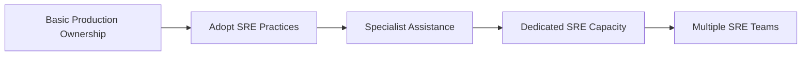
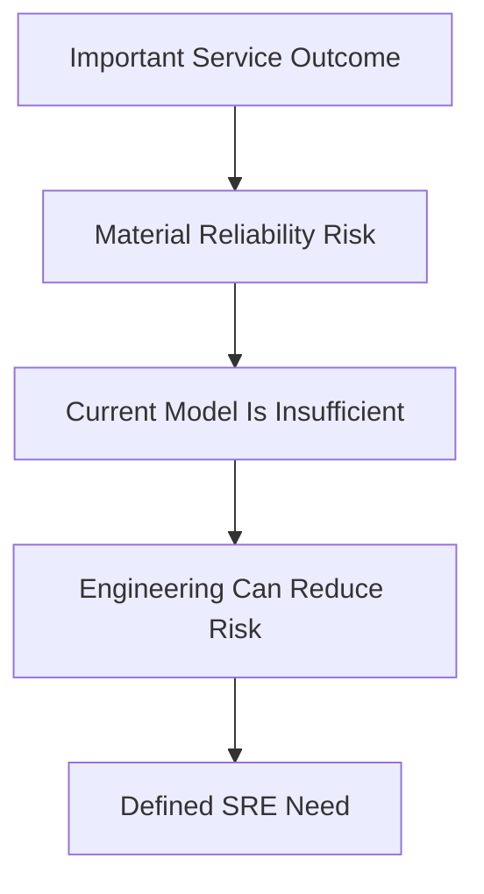

# When an Organization Needs SRE

> An organization needs SRE when the reliability of important services has become a material user, business, or operational risk that requires explicit objectives, production engineering, sustainable response, and continuous reduction of recurring failure. The need is created by consequences and operating conditions, not by company size, cloud adoption, or industry fashion.

## Section Purpose

Not every organization needs a dedicated SRE team. Every organization that operates a service needs some form of production responsibility, but SRE is a specific response to reliability problems that can no longer be managed safely through informal ownership, reactive operations, or occasional improvement work.

An organization may need SRE when:

- Important user journeys fail too often
- Service growth has exceeded the existing operating model
- Incidents recur without lasting correction
- On-call work is unsafe or unsustainable
- Operational demand grows with every service or customer
- Reliability decisions lack measurable objectives
- Teams cannot balance change velocity with production risk
- Recovery capability is uncertain or untested
- Critical dependencies create concentrated risk
- Manual work limits scale and consumes engineering capacity
- Ownership is fragmented across teams
- Business commitments require stronger reliability evidence

This section explains how to recognize those conditions, distinguish symptoms from causes, assess the strength of the evidence, choose where SRE should begin, and decide whether the need justifies practices, a temporary engagement, or a dedicated team.

The objective is not to prove that every organization needs SRE. It is to make the decision using service criticality, reliability evidence, operational load, business risk, and the expected value of engineering intervention.

---

## Learning Objectives

After completing this section, you should be able to:

1. Explain why production operation does not automatically justify a dedicated SRE team.
2. Distinguish the need for reliability engineering from the need for an SRE organization.
3. Identify user, business, technical, and human signals that indicate an SRE need.
4. Evaluate whether reliability problems are recurring, material, and suitable for engineering intervention.
5. Use service criticality, operational load, and risk to prioritize SRE attention.
6. Distinguish growth symptoms from reliability symptoms.
7. Recognize when incident frequency, toil, change risk, or recovery uncertainty has crossed an important threshold.
8. Select an appropriate starting scope for SRE.
9. Build an evidence-based proposal for SRE investment.
10. Explain why SRE cannot compensate for missing ownership, product neglect, or fundamental organizational dysfunction.

---

## 1. Start With the Problem, Not the Title

The first question is not:

> Should we hire SREs?

The first question is:

> Which important service outcomes are at risk, why is the current operating approach insufficient, and what engineering capability is required?

Starting with a title encourages role inflation and vague expectations. Starting with a production problem creates a testable reason for intervention.

---

## 2. Every Production Service Needs Reliability Work

Every production service requires some combination of:

- Ownership
- Monitoring
- Change control
- Capacity management
- Incident response
- Recovery
- Security
- Maintenance
- Learning

This does not mean every service requires SRE.

A small, low-risk service may be operated responsibly by its development team. A critical or rapidly scaling service may require dedicated reliability engineering capacity.

---

## 3. SRE Need Exists on a Continuum

SRE need is not a binary condition.

An organization may begin with SLOs, incident learning, and toil measurement before it creates an SRE role. The response should match the scale and persistence of the problem.

---

## 4. Need Is Not the Same as Readiness

An organization may clearly need stronger reliability engineering while lacking the conditions required for a successful SRE implementation.

| Question | Meaning |
| --- | --- |
| Does the organization need SRE? | Are reliability risks and operational conditions serious enough to justify focused engineering intervention? |
| Is the organization ready for SRE? | Will it provide ownership, authority, staffing, objectives, engineering time, and leadership support? |

This section evaluates need. [Section 21](./21-When-an-Organization-Is-Not-Ready-for-SRE.md) evaluates readiness.

---

## 5. The Core Need Test

An SRE need becomes credible when four conditions exist together:

1. A service provides an important outcome.
2. Failure creates material consequences.
3. The current operating approach cannot control the risk sustainably.
4. Engineering changes can improve the outcome.

If any condition is absent, a dedicated SRE response may be unnecessary or ineffective.

---

## 6. The SRE Need Chain

This chain prevents an organization from justifying SRE through vague statements such as “we are growing” or “we use Kubernetes.”

---

## 7. Begin With Services and Users

Assess a defined service, not the organization in the abstract.

Identify:

- The service boundary
- The users or dependent systems
- The critical user journeys
- The intended outcomes
- The accountable owner
- The reliability expectations
- The consequences of failure

One organization may have a critical payment service that needs SRE and an internal information site that does not.

---

## 8. Service Criticality

Criticality describes how much protection and recovery attention a service requires.

Consider:

- User harm
- Revenue dependence
- Safety implications
- Security consequences
- Data integrity
- Legal or regulatory obligations
- Contractual commitments
- Time sensitivity
- Downstream dependence
- Availability of alternatives

Criticality should influence the depth of SRE involvement, but high criticality alone does not define the solution.

---

## 9. Material User Harm

SRE becomes more valuable when service failure prevents users from completing important outcomes.

Examples include:

- Customers cannot complete payments
- Patients cannot retrieve current records
- Employees cannot authenticate
- Partners do not receive required events
- Users lose committed work
- Emergency messages arrive too late
- Account recovery fails during compromise

The evidence should describe affected users, failed journeys, duration, scope, and severity.

---

## 10. Material Business Risk

Reliability problems may justify SRE when they expose the organization to:

- Revenue loss
- Customer churn
- Contractual penalties
- Regulatory action
- Data loss
- Reputational harm
- Operational interruption
- Emergency labor cost
- Partner disruption
- Missed market commitments

SRE does not own every business decision. It provides engineering evidence about the risk and the available controls.

---

## 11. Reliability Has Become a Product Constraint

An organization needs focused reliability work when new features no longer create value because the existing product cannot be used dependably.

Signals include:

- Customers report that core actions cannot be trusted
- Product launches repeatedly destabilize existing journeys
- Support demand is dominated by reliability failures
- Sales commitments exceed operating capability
- Reliability concerns delay every major release
- Teams build around outages instead of improving the product

At this point, reliability is not maintenance beside the product. It is a condition for product value.

---

## 12. Growth Has Exposed Operating Limits

Growth can expose the need for SRE when traffic, customers, services, data, or geographic scope exceeds the capacity of the current operating model.

Common signs include:

- Capacity emergencies become frequent
- Manual provisioning delays demand
- More customers create proportional support work
- Peak events require repeated emergency preparation
- Dependencies fail at new load levels
- Recovery procedures no longer fit the system scale

Growth alone is not an SRE problem. Uncontrolled reliability risk created by growth is.

---

## 13. Complexity Has Exceeded Informal Coordination

As systems become distributed, failures can cross:

- Services
- Teams
- Regions
- Networks
- Data stores
- Providers
- Control planes
- Organizational boundaries

SRE may be needed when no team can understand end-to-end behavior, local metrics conflict with user impact, and incidents depend on improvised coordination.

---

## 14. Scale Is More Than Traffic

Scale may refer to:

- Request volume
- Data volume
- Number of services
- Number of deployments
- Number of dependencies
- Number of engineers
- Geographic distribution
- Regulatory obligations
- Operational events
- Customer diversity

A low-traffic financial system may need stronger reliability engineering than a high-traffic entertainment feature because the consequences of incorrect behavior are greater.

---

## 15. Incident Frequency Is Increasing

Frequent incidents may indicate that the system changes faster than the organization learns.

Investigate:

- Incidents per service and user journey
- Recurrence of known failure modes
- Incident severity
- Time between incidents
- Proportion caused by change
- Corrective-action completion
- Repeated manual mitigations

Incident count alone can mislead. Better detection can initially increase the number recorded.

---

## 16. Incident Severity Is Increasing

Even infrequent incidents can justify SRE when consequences are severe.

Examples include:

- Irrecoverable data loss
- Prolonged loss of a critical service
- Safety exposure
- Widespread authorization failure
- Corruption that remains undetected
- Failure during a legally significant period

Evaluate credible worst cases, not only historical averages.

---

## 17. Incidents Recur

Recurring incidents are one of the strongest SRE signals.

Recurrence may mean:

- Root causes remain unaddressed
- Corrective actions are not prioritized
- Fixes treat symptoms only
- Ownership is unclear
- Operational knowledge is not converted into design changes
- Teams lack engineering capacity

Repeated recovery without risk reduction is an operating-model failure.

---

## 18. Recovery Is Slow or Unpredictable

SRE may be needed when teams cannot restore important services within acceptable time.

Evidence includes:

- Increasing time to detect
- Increasing time to mitigate
- Recovery depends on one expert
- Runbooks fail during real incidents
- Rollback is unreliable
- Required access is unavailable
- Teams cannot verify restored state
- Communications delay technical action

The goal is not only a lower average recovery time. Recovery should be repeatable across people and failure conditions.

---

## 19. Recovery Capability Is Untested

An organization has material reliability exposure when it claims recovery capability without evidence.

Warning signs include:

- Backups exist but restores are not tested
- Failover exists but has never been exercised
- Disaster recovery depends on outdated instructions
- Recovery objectives are copied from contracts without validation
- Critical credentials are unavailable outside the primary environment
- Failback is undocumented

SRE can help turn recovery claims into measured capability.

---

## 20. Change Is the Dominant Source of Failure

SRE becomes valuable when deployment and configuration activity produces a large share of user impact.

Look for:

- High change-failure rate
- Long rollback time
- Large deployment batches
- Weak canary signals
- Unsafe configuration changes
- Hidden dependency incompatibility
- Releases without user-centered verification
- Repeated emergency change freezes

The response may include safer delivery, better observability, smaller changes, automated verification, and explicit error-budget policy.

---

## 21. Delivery Speed and Reliability Are in Conflict

An SRE need exists when product teams and operations repeatedly argue about whether to release because no shared risk mechanism exists.

Symptoms include:

- Reliability decisions depend on seniority or urgency
- Operations blocks change without measurable criteria
- Product teams release despite repeated instability
- Reliability work loses every planning cycle
- Emergency freezes replace ongoing risk control

SLOs and error budgets can create a common decision framework when leadership honors their consequences.

---

## 22. Reliability Is Undefined

An organization may need SRE practices when it cannot answer:

- Which service behaviors matter?
- How are they measured?
- What level is acceptable?
- Over which time window?
- Which failures count?
- Who decides the target?
- What happens when the target is missed?

Without these answers, teams cannot distinguish acceptable risk from operational anxiety.

---

## 23. Infrastructure Health Does Not Represent User Experience

SRE is needed when dashboards remain green while users fail.

This often happens because teams monitor:

- Host availability
- CPU
- Memory
- Container state
- Queue depth
- Database reachability

These signals matter, but they do not prove that a critical user journey completed correctly and on time.

---

## 24. Alerting Does Not Support Action

Alerting problems may justify focused reliability work when:

- Pages do not correspond to user impact
- Alerts fire without a required action
- The same condition creates many pages
- Warnings wake engineers without urgency
- Important failures create no alert
- Thresholds have no relation to an SLO
- Responders cannot identify the owning service

SRE should connect urgent alerts to meaningful service risk and a clear response.

---

## 25. On-Call Has Become Unsustainable

Human sustainability is a direct SRE concern.

Warning signs include:

- Frequent sleep interruption
- Long incident shifts
- Too few qualified responders
- Constant escalation to one expert
- No recovery time after severe incidents
- Burnout and rotation attrition
- Fear of taking the pager
- Pages for work that can wait

An organization should not scale service availability by consuming people without limit.

---

## 26. Hero Dependence

The service may need SRE when safe operation depends on particular individuals.

Hero dependence appears when:

- Only one person can diagnose the service
- Recovery requires undocumented knowledge
- Engineers are contacted while off duty
- Access belongs to individuals instead of roles
- Teams celebrate exceptional rescue but do not remove the cause
- Vacations create operational risk

SRE replaces hero dependence with observable systems, shared knowledge, tested procedures, automation, and sustainable staffing.

---

## 27. Operational Work Is Growing Linearly

A central SRE principle is that operational load should not grow in direct proportion to service growth.

Linear work includes:

- Manual provisioning for each customer
- Repeated certificate renewal
- Routine restart requests
- Manual deployment coordination
- Repetitive access changes
- Hand-correcting failed jobs
- Rebuilding identical environments

When growth requires proportional staffing for repetitive operations, engineering intervention may create substantial value.

---

## 28. Toil Consumes Engineering Capacity

Toil becomes an SRE signal when it is manual, repetitive, automatable, tactical, service-related, and grows with the service.

Measure:

- Time spent on recurring operational work
- Interruptions
- Rework
- Manual incident mitigation
- Queue growth
- Work outside normal hours
- Engineering improvements displaced by operations

The issue is not that operations exist. The issue is that recurring work prevents the team from making the service easier and safer to operate.

---

## 29. Ticket Queues Hide Reliability Problems

An operations queue may disguise systemic failure as individual requests.

Examples include:

- Hundreds of similar restart tickets
- Repeated storage increases
- Recurring access corrections
- Manual cleanup after every release
- Routine scaling requests
- Repeated recovery of the same batch process

Grouping tickets by service and failure pattern can reveal where SRE work has the highest return.

---

## 30. Automation Exists Without Reliability Engineering

Automation does not eliminate the need for SRE when it:

- Accelerates an unsafe process
- Has no owner
- Lacks verification
- Hides failure
- Expands blast radius
- Cannot be rolled back
- Requires frequent manual repair

SRE evaluates the service outcome, failure modes, controls, and operating consequences of automation.

---

## 31. Capacity Is Managed Through Emergencies

SRE may be needed when capacity planning consists of reacting to saturation.

Signals include:

- Repeated resource exhaustion
- Emergency quota requests
- Scaling after customers are affected
- Unknown demand limits
- No load model
- No capacity headroom policy
- Dependencies with lower limits than the service
- Seasonal demand treated as a surprise

Capacity management should connect forecasts, limits, service objectives, cost, and graceful degradation.

---

## 32. Performance Problems Threaten User Outcomes

A service can remain available while becoming unusable.

SRE attention may be justified when:

- Tail latency repeatedly breaches user expectations
- Performance degrades under predictable load
- Slow dependencies exhaust shared resources
- Averages hide severe user segments
- Teams cannot relate resource usage to service demand
- Performance regressions escape release checks

Reliability includes completing the intended work within a useful time.

---

## 33. Data Integrity and Durability Are Uncertain

Services that store or transform important data may need SRE when the organization cannot prove that data remains correct, preserved, and recoverable.

Warning signs include:

- Silent corruption
- Duplicate processing
- Lost events
- Stale reads with harmful consequences
- Unverified backups
- Undefined recovery point objectives
- Reconciliation performed manually after incidents
- No ownership for data repair

Availability alone is insufficient for these services.

---

## 34. Dependency Risk Is Unmanaged

Modern services depend on internal and external systems.

SRE may be needed when teams do not know:

- Which dependencies support critical journeys
- Their reliability characteristics
- Their owners
- Their limits
- Their failure modes
- How the service degrades when they fail
- Which dependencies share failure domains
- How escalation works

Dependency mapping should lead to isolation, timeouts, budgets, fallback, capacity planning, and tested recovery decisions.

---

## 35. Shared Platforms Have Large Blast Radius

A platform may justify dedicated SRE attention when many services depend on it and one failure can create organization-wide impact.

Examples include:

- Identity
- Networking
- Service discovery
- Deployment systems
- Container platforms
- Messaging
- Databases
- Secrets management
- Observability pipelines

Platform reliability must be measured through the capabilities consumers depend on, not only the health of platform components.

---

## 36. Geographic Expansion Changes the Failure Model

Moving from one location to many introduces:

- Network partitions
- Replication delay
- Data residency constraints
- Regional capacity differences
- Control-plane dependence
- Traffic-management complexity
- Follow-the-sun handoffs
- Regional provider failures

SRE can help define which failures the service must tolerate and how global user journeys are protected.

---

## 37. Cloud Adoption Has Increased Change and Complexity

Cloud adoption does not itself create an SRE need.

The need may appear when cloud use introduces:

- Faster but less controlled change
- Dynamic infrastructure
- New service dependencies
- Quota and regional constraints
- Shared-responsibility gaps
- Cost and capacity coupling
- New failure modes
- Reduced visibility across managed services

The problem is not the cloud. The problem is an operating model that cannot control the resulting reliability risk.

---

## 38. Containers and Kubernetes Do Not Define the Need

Kubernetes may increase the number of objects, control loops, dependencies, and failure modes engineers must understand. It may also standardize and automate operation.

An organization needs SRE because important services have reliability and operational problems, not because Kubernetes is present.

Hiring SREs solely to administer clusters usually creates a platform or operations team with an inaccurate title.

---

## 39. Microservices Have Increased Coordination Cost

Microservices may justify SRE attention when:

- End-to-end journeys cross many owners
- Local SLOs do not represent user success
- Cascading failure is common
- Retry behavior amplifies load
- Dependency changes cause incidents
- Incident command requires too many teams
- Ownership gaps delay mitigation

SRE can provide end-to-end measurement, reliability standards, dependency analysis, and cross-service incident practices.

---

## 40. Organizational Growth Has Fragmented Ownership

As teams multiply, service accountability can become unclear.

Signals include:

- Orphaned services
- Conflicting ownership records
- Multiple teams assume another team is on call
- Shared components lack decision authority
- Reorganizations break escalation paths
- End-to-end journeys have no accountable owner

SRE may help establish service-level accountability, but it should not become the default owner of every abandoned system.

---

## 41. Reliability Knowledge Is Inconsistent

An organization may need a consulting, standards, or enablement form of SRE when teams vary widely in their ability to:

- Define SLOs
- Design alerts
- Run incidents
- Test recovery
- Control toil
- Review production readiness
- Analyze failure
- Manage capacity

The appropriate response may be shared methods and coaching rather than permanent pager ownership.

---

## 42. Production Readiness Is Repeatedly Discovered After Launch

SRE becomes valuable when launches reveal missing operational capabilities such as:

- No actionable telemetry
- No rollback
- No capacity evidence
- No runbook
- No service owner
- No recovery plan
- No dependency limits
- No support coverage
- No reliability objective

A production-readiness process can move these discoveries before user exposure.

---

## 43. Business Commitments Require Reliability Evidence

Organizations may need SRE capability when customers, regulators, auditors, or partners require credible evidence for:

- Availability commitments
- Recovery objectives
- Incident response
- Capacity
- Continuity
- Data protection
- Change control
- Operational ownership

SRE should produce operational evidence, not compliance theater. A document cannot substitute for a tested capability.

---

## 44. Contractual Commitments Exceed Measured Capability

An SLA may promise more than the service can currently deliver.

Warning signs include:

- No internal SLO supports the SLA
- Exclusions hide frequent user harm
- The measurement source is disputed
- Penalties are treated as the only consequence
- Teams cannot explain the engineering cost of the commitment
- Recovery requirements conflict with architecture

SRE can expose the gap and help the organization decide whether to improve capability, change the commitment, or accept the risk through authorized governance.

---

## 45. Security Events Depend on Reliable Operation

Security and reliability overlap when the organization must:

- Preserve authentication during failure
- Revoke access quickly
- Rotate compromised credentials
- Maintain audit evidence
- Recover from destructive action
- Operate through denial of service
- Restore trusted state

SRE may be needed where security controls must remain available, scalable, observable, and recoverable under stress.

---

## 46. Cost Pressure Is Distorting Reliability Decisions

SRE can help when cost reduction creates hidden reliability exposure or overprovisioning is used instead of engineering.

Examples include:

- Removing redundancy without risk analysis
- Operating without headroom
- Excessive capacity with no demand model
- Disabling telemetry to reduce cost
- Selecting cheaper dependencies without recovery analysis
- Emergency spending after predictable saturation

The objective is not minimum cost. It is an explicit balance among reliability, performance, delivery, and cost.

---

## 47. Teams Cannot Explain Reliability Investment

Reliability work loses support when it is described only as technical cleanup.

An SRE need becomes easier to evaluate when teams can connect investment to:

- Protected user journeys
- Reduced incident exposure
- Faster recovery
- Lower toil
- Safer delivery
- Increased capacity
- Reduced data risk
- Sustainable on-call
- Contractual or regulatory obligations

The proposal should describe both expected benefit and uncertainty.

---

## 48. A Single Signal Is Usually Insufficient

No single metric proves that an organization needs SRE.

For example:

- Many incidents may reflect improved reporting
- Low incident count may reflect weak detection
- High toil may affect a noncritical service
- Rapid growth may remain operationally simple
- Strict SLAs may be met through a dependable managed service

Use multiple forms of evidence and examine the complete service context.

---

## 49. Build an Evidence Portfolio

A credible assessment combines:

| Evidence type | Examples |
| --- | --- |
| User | Failed journeys, complaints, abandonment, affected segments |
| Service | SLI performance, saturation, correctness, dependency behavior |
| Incident | Frequency, severity, recurrence, detection and recovery time |
| Change | Failure rate, rollback success, release-related impact |
| Human | Pages, interruptions, burnout, specialist dependence |
| Work | Toil, queue growth, engineering capacity, repeated manual action |
| Business | Revenue, obligations, operational disruption, risk acceptance |
| Recovery | Restore tests, failover tests, achieved RTO and RPO |

The evidence should cover trends and failure patterns, not only one severe event.

---

## 50. Establish the Assessment Window

Choose a period long enough to include:

- Normal demand
- Peak demand
- Releases
- Incidents
- Maintenance
- Seasonal behavior
- Recovery exercises

A 30-day window may suit a high-volume online service. A quarterly or annual window may be necessary for seasonal or infrequently used critical systems.

---

## 51. Use Both Leading and Lagging Evidence

Lagging evidence describes harm that already occurred:

- SLO misses
- Incidents
- Lost transactions
- Recovery overruns

Leading evidence describes conditions that make future harm more likely:

- Unowned services
- Untested restoration
- Rising toil
- Saturation trends
- Unsafe deployment paths
- Single-person knowledge

Strong decisions use both.

---

## 52. Correct for Missing and Biased Data

Reliability evidence is rarely complete.

Ask:

- Are all user segments measured?
- Are failed requests missing from telemetry?
- Do incident records depend on voluntary reporting?
- Do averages hide tail behavior?
- Are support tickets linked to services?
- Does maintenance disappear from availability reports?
- Are recovery tests representative?

Unknown risk should be stated, not silently treated as zero.

---

## 53. Distinguish Symptoms, Causes, and Capabilities

| Type | Example |
| --- | --- |
| Symptom | Checkout incidents recur every week |
| Cause | Payment retries are not idempotent |
| Capability gap | No team owns end-to-end checkout reliability |
| SRE response | Define journey SLOs, improve telemetry, engineer safe retries, and establish ownership |

Hiring SREs is not a root-cause analysis. The organization must identify what capability is missing.

---

## 54. Determine Whether Engineering Can Change the Outcome

SRE is appropriate when software and systems engineering can materially reduce the risk.

Potential interventions include:

- Failure isolation
- Safer change
- User-centered measurement
- Capacity automation
- Recovery engineering
- Dependency controls
- Load shedding
- Graceful degradation
- Toil elimination
- Operational tooling

If the primary problem is a commercial dispute, missing product strategy, or refusal to assign ownership, SRE cannot solve it alone.

---

## 55. Determine Whether the Problem Is Persistent

A temporary incident does not always justify a permanent team.

Ask:

- Does the condition recur?
- Will growth make it worse?
- Does it affect several services?
- Is specialized knowledge continuously required?
- Will the intervention create ongoing engineering work?
- Can the service team own the improvements after a temporary engagement?

Persistent needs support permanent capacity. Bounded needs may suit consulting or temporary embedding.

---

## 56. Determine the Cost of Doing Nothing

Estimate the likely consequences if the operating model remains unchanged.

Consider:

- Expected user harm
- Incident frequency and severity
- Lost engineering time
- On-call attrition
- Delayed delivery
- Contractual exposure
- Capacity limits
- Recovery uncertainty
- Accumulating technical risk

State assumptions and ranges. False precision weakens the decision.

---

## 57. Determine the Cost of SRE

SRE investment includes more than salaries.

Consider:

- Staffing a sustainable rotation
- Training
- Service onboarding
- Observability
- Reliability engineering work
- Product-team participation
- Migration and handoff
- Management and technical leadership
- Opportunity cost

An understaffed SRE team can increase risk by accepting responsibility it cannot fulfill.

---

## 58. Evaluate Expected Risk Reduction

A useful proposal describes:

1. The current risk.
2. The engineering intervention.
3. The expected change in likelihood or consequence.
4. The evidence that will verify the change.
5. The residual risk.

SRE should not be justified by activity volume alone.

---

## 59. Use a Service-Level Decision Matrix

| Criticality | Operational complexity | Reliability evidence | Likely response |
| --- | --- | --- | --- |
| Low | Low | Acceptable | Development-team ownership with basic practices |
| High | Low | Acceptable | Strong ownership, objectives, and tested recovery |
| Low | High | Poor | Simplify, reduce toil, or use temporary specialist help |
| High | High | Poor | Strong candidate for dedicated SRE involvement |

This matrix supports discussion. It does not replace engineering judgment.

---

## 60. Use Thresholds Carefully

Organizations often ask for a universal threshold such as a traffic level, incident count, or company size.

No universal threshold exists.

Thresholds should be based on:

- Service commitments
- User tolerance
- Business risk
- Historical behavior
- Team capacity
- Recovery objectives
- Operating cost

A threshold should trigger review or action, not hide context.

---

## 61. Useful Internal Triggers

An organization may define triggers such as:

- Two severe incidents from the same failure mode
- A critical journey misses its SLO for two windows
- Toil exceeds the team limit
- After-hours pages exceed the sustainable threshold
- Capacity headroom falls below policy
- Recovery tests fail
- A new SLA exceeds demonstrated performance
- A critical service lacks an owner

Each trigger should identify who reviews the evidence and what decisions are available.

---

## 62. The Need for SRE Practices

Many organizations first need practices rather than a team.

The initial set may include:

- Service ownership records
- Critical user journeys
- SLIs and SLOs
- Error-budget policy
- Actionable alerting
- Incident command
- Learning reviews
- Toil measurement
- Production readiness
- Recovery testing

These practices can reveal whether dedicated SRE capacity is warranted.

---

## 63. The Need for SRE Consulting

A consulting model may fit when:

- Several teams need reliability guidance
- Problems are important but bounded
- Service teams can retain ownership
- Specialist review can unlock progress
- The organization is establishing common methods
- Pager transfer is unnecessary

Consulting must produce implementation, capability transfer, and verified outcomes, not only recommendations.

---

## 64. The Need for Temporary Embedding

Temporary embedding may fit when a service needs concentrated assistance with:

- A launch
- A recurring failure pattern
- An SLO program
- A reliability redesign
- On-call stabilization
- Recovery capability
- Production-readiness improvement

Define entry, outcomes, duration, shared responsibilities, and exit before the engagement begins.

---

## 65. The Need for a Dedicated SRE Team

A dedicated team becomes more credible when:

- Several critical services require continuing specialist attention
- On-call requires sustained reliability expertise
- Engineering work extends across planning cycles
- Operational load is substantial but controllable
- Service teams need a stable reliability partner
- Shared systems create broad blast radius
- Reliability work requires a coherent technical roadmap

The team must have enough staff, authority, and engineering capacity to avoid becoming an operations queue.

---

## 66. The Need for Infrastructure or Platform SRE

Infrastructure or platform SRE may fit when shared capabilities create material risk across many product services.

Candidates include:

- Compute
- Networking
- Storage
- Identity
- Container orchestration
- Deployment platforms
- Messaging
- Observability

The team should define consumer-facing outcomes and avoid measuring success only through component uptime.

---

## 67. The Need for Product-Aligned SRE

Product-aligned SRE may fit when:

- Critical journeys cross many services
- Product context determines reliability decisions
- Frequent change creates sustained risk
- Shared ownership with application engineers is possible
- The product needs continuing reliability design

Alignment should preserve SRE engineering identity and workload control.

---

## 68. The Need for a Federated Model

A federated model may fit when a large organization needs both local context and organization-wide consistency.

It can combine:

- Central standards
- Shared reliability platforms
- Product-aligned SRE teams
- Reliability champions
- Communities of practice
- Common incident and SLO methods

Federation requires explicit authority and interfaces. Otherwise, it becomes a name for inconsistent local practice.

---

## 69. Select the First Service Carefully

The first SRE engagement should be important enough to matter but bounded enough to learn from.

A strong candidate has:

- A defined service
- Identifiable users
- A willing owner
- Measurable behavior
- Material reliability pain
- Available engineering partners
- Problems suitable for engineering
- Leadership support

The largest and most politically visible service is not always the best first choice.

---

## 70. Avoid Starting With Every Service

Attempting organization-wide SRE adoption at once can create:

- Shallow practices
- Inconsistent definitions
- Excessive onboarding
- Staff dilution
- Unclear priorities
- Unsupported pager commitments
- Governance without capability

Begin with a small service set, verify outcomes, refine the model, and expand based on evidence.

---

## 71. Define the Initial Reliability Problem

Write a problem statement that includes:

- Service
- User journey
- Current behavior
- Required behavior
- Consequences
- Evidence
- Suspected contributing conditions
- Current operating limitation

Example:

> During peak sales, valid checkout journeys fall below the agreed success target because payment and inventory dependencies saturate. Recovery depends on manual scaling by two senior engineers, and the pattern has recurred during three events.

---

## 72. Define the Desired Outcomes

Possible outcomes include:

- A valid SLO and error-budget policy
- Lower recurring incident rate
- Faster, repeatable recovery
- Tested failover
- Reduced after-hours pages
- Reduced toil
- Safe capacity automation
- Better change verification
- Clear service ownership
- Transferable operational knowledge

Outcomes should be measurable and time-bounded without promising perfect reliability.

---

## 73. Define What SRE Will Not Own

An SRE proposal should exclude responsibilities that remain elsewhere.

Examples include:

- Product strategy
- All feature development
- Every support ticket
- Business risk acceptance
- All security ownership
- All infrastructure administration
- Vendor contract ownership
- Every deployment approval

Clear exclusions protect shared ownership and prevent SRE from becoming the destination for unwanted work.

---

## 74. Establish Baseline Evidence

Before intervention, record:

- SLI performance
- Incident patterns
- Recovery performance
- Alert volume
- On-call burden
- Toil
- Change-failure behavior
- Capacity risk
- Ownership gaps
- Team health

Without a baseline, the organization may be unable to determine whether SRE created value.

---

## 75. Run a Time-Bounded Pilot

A pilot can test whether SRE methods improve the service before a larger organizational commitment.

Define:

- Service scope
- Duration
- Participants
- Responsibilities
- Required access
- Engineering objectives
- Success measures
- Review points
- Exit conditions

A pilot should not quietly become permanent pager ownership.

---

## 76. Pilot Success Criteria

Success may include:

- User-centered SLOs adopted
- Incident recurrence reduced
- Recovery tested successfully
- Page load reduced
- Toil reduced
- Service owners trained
- Reliability work enters product planning
- Risks become visible and governed

Success is not the number of dashboards, scripts, meetings, or tickets created.

---

## 77. Pilot Failure Can Produce Useful Evidence

A pilot may show that:

- The problem was misidentified
- The service boundary is wrong
- Ownership is absent
- Telemetry cannot support decisions
- Staffing is insufficient
- The organization will not prioritize corrective work
- A different operating model is required

Record these findings. Do not hide them by extending the pilot indefinitely.

---

## 78. SRE Is Not a Substitute for Service Ownership

SRE cannot safely operate a service when no product or engineering team remains accountable for:

- Intended behavior
- Code changes
- Product priorities
- Architecture
- Dependencies
- Correctness
- Lifecycle decisions

Assigning an orphaned service to SRE transfers confusion. It does not create ownership.

---

## 79. SRE Is Not a Substitute for Adequate Staffing

If a development team cannot maintain its own service because it is understaffed, adding one SRE may only move the shortage.

Evaluate whether the need is primarily for:

- Application engineering
- Operations staffing
- Platform engineering
- Security engineering
- Technical support
- SRE

The roles can collaborate, but they solve different primary problems.

---

## 80. SRE Is Not a Substitute for Product Decisions

Engineering cannot decide alone:

- Which users matter most
- Which journeys are critical
- What risk is commercially acceptable
- Whether a commitment should change
- Which features should be retired
- Whether investment is justified

SRE supplies reliability evidence. Authorized product and business owners make decisions within their scope.

---

## 81. SRE Is Not a Universal Ticket Destination

Requests involving production are not automatically SRE work.

Routing all operational work to SRE causes:

- Unbounded demand
- Lost product ownership
- Growing toil
- Weak engineering capacity
- Slow response
- Misleading accountability

Work should be assigned based on service ownership, required capability, risk, and agreed engagement boundaries.

---

## 82. SRE Is Not Required Because Competitors Have It

Job titles do not prove capability.

An organization should not create SRE because:

- Large technology companies have SRE teams
- A customer expects the term
- Recruitment markets favor the title
- Kubernetes administration needs a new name
- Leadership wants to appear mature

The proposal must connect to real service outcomes and operating conditions.

---

## 83. SRE Is Not Defined by Company Size

A small organization may need SRE practices for one critical service. A large organization may operate many low-risk services without dedicated SRE support.

Company size affects available operating models and staffing. It does not determine need by itself.

---

## 84. SRE Is Not Only for Internet Companies

SRE principles can apply to:

- Financial services
- Healthcare
- Telecommunications
- Government services
- Manufacturing
- Logistics
- Media
- Education
- Internal enterprise platforms
- Data and machine learning systems

The relevant question is whether dependable software service outcomes matter and require engineering-based operation.

---

## 85. Internal Services Can Need SRE

An internal service may be critical when failure prevents employees or systems from completing important work.

Examples include:

- Identity
- Payroll
- Deployment platforms
- Data pipelines
- Communication systems
- Security controls
- Supply-chain systems

Internal users should not be treated as if their time and outcomes have no value.

---

## 86. Low-Volume Services Can Need SRE

Volume is not the same as importance.

A low-volume service may require strong reliability because it supports:

- Emergency response
- Financial settlement
- Regulatory submission
- Administrative recovery
- Safety controls
- Rare but irreversible operations

Assess consequence, time sensitivity, and recoverability.

---

## 87. High-Volume Services May Not Need a Dedicated Team

A high-volume service may remain simple, stable, well-owned, and largely managed by dependable platforms.

It may need:

- Clear SLOs
- Responsible on-call
- Tested recovery
- Capacity planning

It may not need permanent SRE staffing if the service team can perform this work sustainably.

---

## 88. Managed Services Change but Do Not Remove Responsibility

Managed services can reduce operational work, but the organization still owns:

- Configuration
- Integration
- Capacity choices
- Data
- Access
- Dependency behavior
- Service-level monitoring
- Recovery assumptions
- Provider escalation

SRE need depends on the remaining risk and complexity, not on whether infrastructure is self-managed.

---

## 89. Acquisition Can Create an SRE Need

Acquisition or merger may produce:

- Unknown services
- Conflicting ownership
- Different incident practices
- Duplicate platforms
- Incompatible reliability commitments
- Unmapped dependencies
- Unsupported systems
- Identity and access gaps

SRE may help inventory critical journeys, establish reliability baselines, and guide safe integration. It should not be expected to resolve all organizational integration problems.

---

## 90. A Major Incident Can Be a Trigger, Not the Entire Case

A severe incident often creates attention and funding.

Use the event to investigate:

- Whether the failure mode remains credible
- Whether similar services share the exposure
- Which controls failed
- Whether recovery was sustainable
- Which organizational conditions amplified harm
- What engineering capability is missing

Do not build a permanent organization solely around the emotional intensity of one event.

---

## 91. Leadership Questions Before Approving SRE

Leadership should ask:

1. Which services and users are at risk?
2. What evidence shows the current approach is insufficient?
3. Which engineering interventions are expected?
4. Why can existing teams not perform them sustainably?
5. What authority will SRE receive?
6. How will product teams participate?
7. How will on-call be staffed?
8. What will SRE refuse or hand back?
9. How will success be measured?
10. What happens if the required conditions are not provided?

---

## 92. Questions for Service Owners

Service owners should answer:

- Who uses the service?
- Which journeys are critical?
- What reliability is required?
- What currently fails?
- Which risks are accepted?
- Which work recurs?
- Who responds today?
- What prevents lasting improvement?
- Which changes can the team make?
- What help is actually needed?

These answers should be supported by evidence where possible.

---

## 93. Questions for Engineers and Responders

Ask the people doing the work:

- Which pages are unnecessary?
- Which failures repeat?
- Which manual actions are risky?
- Where does diagnosis stall?
- Which dependencies are least understood?
- What requires a particular expert?
- Which improvement is repeatedly postponed?
- Which recovery step has not been tested?
- What would make the next incident safer?

Frontline operational evidence often exposes risks that summary reports miss.

---

## 94. Questions for Product and Business Leaders

Ask:

- Which user outcomes cannot fail without material harm?
- What failure is tolerable?
- Which commitments exist?
- When is service demand most critical?
- What is the cost of delayed recovery?
- Which risks require formal acceptance?
- Which reliability investment competes with product delivery?
- Who has authority to decide the tradeoff?

SRE requires these decisions to become explicit.

---

## 95. A Minimum SRE Need Assessment

Document at least:

| Field | Required information |
| --- | --- |
| Service | Name, boundary, owner, users |
| Critical journeys | Important user outcomes |
| Reliability expectations | Current targets and commitments |
| Evidence | SLI, incidents, toil, recovery, change, capacity |
| Consequences | User, business, security, data, operational harm |
| Current model | Who operates, responds, and improves |
| Capability gap | What the current team cannot do sustainably |
| Proposed response | Practices, consulting, embedding, or dedicated team |
| Verification | How improvement will be measured |
| Risks and assumptions | Unknowns, dependencies, and required conditions |

---

## 96. SRE Need Scorecards

A scorecard can structure assessment, but it must not make the decision automatically.

Possible dimensions include:

- Service criticality
- Reliability performance
- Incident recurrence
- Change risk
- Operational load
- Recovery confidence
- Dependency complexity
- Ownership maturity
- Engineering leverage
- Human sustainability

Record evidence and uncertainty beside every rating.

---

## 97. Prioritize by Risk and Engineering Leverage

High priority exists where:

- Consequences are material
- Failure is likely or already recurring
- Current controls are weak
- Engineering intervention can reduce risk
- The service owner will participate

This prevents scarce SRE capacity from being allocated only to the loudest team.

---

## 98. Define the Decision

An assessment should conclude with one of several explicit decisions:

- Existing service team continues with defined improvements
- Organization adopts selected SRE practices
- Reliability consultant assists for a bounded period
- SRE embeds temporarily
- Service receives dedicated SRE engagement
- Shared platform receives SRE support
- Decision is deferred pending evidence
- Need exists, but readiness conditions are not met

Record the owner, review date, and rationale.

---

## 99. Review the Need Over Time

SRE need changes as:

- Services mature
- Architecture simplifies
- Platforms improve
- Risk changes
- Teams gain capability
- Products decline or retire
- Regulations change
- Traffic grows
- Dependencies change

SRE engagement should be able to expand, contract, transfer, or end.

---

## 100. Production Scenario: Rapid Growth and Manual Scaling

### Situation

A retail service doubles traffic in six months. Engineers manually raise limits before every campaign. Two recent events caused checkout saturation. Only one engineer knows the scaling sequence.

### Assessment

- The checkout journey is business critical.
- Failure is recurring and tied to predictable demand.
- The current response is manual and specialist-dependent.
- Capacity engineering and automation can reduce the risk.

### Appropriate Response

Begin a bounded SRE engagement focused on demand modeling, capacity signals, safe scaling, load testing, and knowledge transfer. Dedicated ongoing support should depend on the remaining operational need after these controls are established.

---

## 101. Production Scenario: Stable Small Service

### Situation

A five-person team owns a low-risk internal directory. It has modest usage, simple architecture, tested backups, actionable alerts, and few incidents. The team operates it sustainably.

### Assessment

The service needs responsible production practices but does not show a strong case for dedicated SRE staffing.

### Appropriate Response

Keep ownership with the development team. Maintain basic objectives, incident learning, and recovery tests.

---

## 102. Production Scenario: Green Dashboards, Failed Payments

### Situation

Infrastructure dashboards show normal health, but customers intermittently receive duplicate charges. Teams monitor component uptime and HTTP response codes but not end-to-end payment correctness.

### Assessment

- User harm is material.
- Existing measurement does not represent the critical journey.
- Data correctness and retry behavior require engineering work.
- Cross-service ownership is unclear.

### Appropriate Response

Use product-aligned reliability engineering to define the payment journey, correctness SLIs, ownership, idempotency controls, reconciliation, alerting, and recovery.

---

## 103. Production Scenario: SRE Requested for Kubernetes

### Situation

An organization creates an SRE vacancy because application teams do not want to administer Kubernetes. Services have no SLOs, incident process, or defined production owners.

### Assessment

The stated need is cluster operation, not yet a complete SRE mission.

### Appropriate Response

Clarify platform ownership and required production practices. Establish service ownership and reliability objectives before assigning SRE responsibility. A platform engineering or infrastructure operations capability may be the immediate need.

---

## 104. Production Scenario: Severe but Rare Regulatory Service

### Situation

A regulatory submission system is used four times each year. Missing one deadline could create severe legal exposure. The last recovery exercise exceeded the required recovery time.

### Assessment

Low usage does not reduce the consequence. Recovery evidence shows a material gap.

### Appropriate Response

Apply focused SRE and recovery engineering before the next submission window. Permanent pager ownership may not be required, but continuing test ownership and explicit readiness reviews are.

---

## 105. Production Scenario: Operations Queue Overload

### Situation

An operations team receives thousands of monthly tickets for restarts, storage expansion, certificate renewal, and failed batch recovery. Headcount grows, but the queue continues to increase.

### Assessment

The work contains high toil and linear scaling. Repeated requests expose system and ownership problems.

### Appropriate Response

Create protected engineering capacity to classify demand, remove high-cost patterns, improve service interfaces, automate verified actions, and return appropriate responsibility to service teams. Renaming the existing queue as SRE would not solve the problem.

---

## 106. Production Scenario: One Major Outage

### Situation

A previously stable service experiences its first major outage after a faulty deployment. Leadership immediately proposes a large SRE organization.

### Assessment

The incident justifies urgent corrective action and broader risk review, but one event does not establish the correct permanent model.

### Appropriate Response

Complete a rigorous learning review, correct the deployment and recovery weaknesses, assess similar services, and collect baseline evidence before choosing permanent staffing.

---

## 107. Production Scenario: High Incident Load, No Product Owner

### Situation

A legacy service fails weekly. No active product team owns it. Leadership asks SRE to take the pager and keep it alive indefinitely.

### Assessment

The reliability need is real, but ownership is absent. SRE cannot safely accept unlimited accountability without authority over code, priorities, and retirement.

### Appropriate Response

Assign an accountable owner and decide whether to repair, replace, contain, or retire the service. SRE may support stabilization after those decisions are made.

---

## 108. Practical Exercise: Identify the Service Outcome

Choose one production service and document:

1. Its users.
2. Its three most important journeys.
3. The success criteria for each journey.
4. The consequences of failure.
5. The accountable owner.
6. The current operating team.

Do not begin with infrastructure components.

---

## 109. Practical Exercise: Build the Evidence Portfolio

For the selected service, collect:

- SLI history
- Incident records
- Support reports
- Page volume
- Toil estimates
- Change failures
- Capacity events
- Recovery-test results
- Dependency risks

Label facts, estimates, assumptions, and missing evidence separately.

---

## 110. Practical Exercise: Trace a Recurring Failure

Select one recurring production problem and describe:

1. Trigger.
2. Internal failure.
3. User impact.
4. Business consequence.
5. Current mitigation.
6. Reason for recurrence.
7. Engineering intervention.
8. Verification method.

Decide whether the work needs a service team, platform team, temporary specialist, or ongoing SRE involvement.

---

## 111. Practical Exercise: Measure Toil

For two weeks, record operational work by:

- Service
- Task
- Frequency
- Duration
- Interruption cost
- Manual steps
- Risk
- Growth rate
- Potential engineering response

Rank the work by total human cost and reliability consequence.

---

## 112. Practical Exercise: Test Recovery Confidence

Choose a critical failure mode and answer:

- What must be recovered?
- What RTO and RPO apply?
- When was recovery last tested?
- What was actually achieved?
- Which people, access, dependencies, and data are required?
- How is recovered state verified?
- What prevents meeting the objective?

Treat untested claims as unknown capability.

---

## 113. Practical Exercise: Compare Response Models

For one reliability problem, compare:

1. Service-team improvement.
2. SRE consulting.
3. Temporary SRE embedding.
4. Dedicated SRE engagement.

For each option, assess cost, authority, speed, knowledge transfer, sustainability, and likely risk reduction.

---

## 114. Practical Exercise: Write an SRE Need Proposal

Create a short proposal containing:

- Service and critical journeys
- Current reliability problem
- Evidence
- User and business consequences
- Capability gap
- Proposed operating response
- Required participation
- Desired outcomes
- Baseline and success measures
- Assumptions and risks
- Review and exit conditions

Remove any statement that depends only on tools, fashion, or job titles.

---

## 115. Practical Exercise: Challenge the Proposal

Ask a review group to argue that SRE is not the correct response.

Test whether:

- The service is important enough
- The evidence is representative
- The problem is persistent
- Existing owners can solve it
- Another engineering function is a better fit
- The expected benefit justifies the cost
- Readiness conditions exist

Revise the proposal using the strongest objections.

---

## 116. When an Organization Needs SRE Checklist

### Service and Users

- [ ] A defined production service exists.
- [ ] Its users or dependent systems are known.
- [ ] Critical user journeys are documented.
- [ ] Success and failure are defined at the service boundary.
- [ ] An accountable service owner exists.

### Risk and Consequence

- [ ] Failure creates material user, business, security, data, or operational harm.
- [ ] Service criticality is supported by evidence.
- [ ] Accepted and unacceptable risks are distinguished.
- [ ] Credible severe failure modes are considered.
- [ ] The cost of doing nothing is described.

### Reliability Evidence

- [ ] Relevant SLIs or equivalent service evidence exist.
- [ ] Incident frequency, severity, and recurrence are understood.
- [ ] Change-related failure is measured.
- [ ] Capacity and performance risks are assessed.
- [ ] Recovery capability is tested.
- [ ] Data gaps and uncertainty are recorded.

### Operational Sustainability

- [ ] On-call burden is measured.
- [ ] Toil is identified and quantified.
- [ ] Specialist dependence is understood.
- [ ] Operational demand is evaluated for linear growth.
- [ ] Engineering work is being displaced by reactive work.

### Engineering Fit

- [ ] Engineering intervention can reduce the risk.
- [ ] The required capabilities are identified.
- [ ] The problem is persistent enough for the proposed response.
- [ ] Alternative owners and team types were considered.
- [ ] The response is proportional to the need.

### Proposal

- [ ] Initial service scope is bounded.
- [ ] Desired outcomes are measurable.
- [ ] Responsibilities and exclusions are explicit.
- [ ] Baseline evidence is recorded.
- [ ] Success, review, handback, and exit conditions are defined.
- [ ] Need and organizational readiness are evaluated separately.

---

## 117. Common Mistakes

### Starting With Tools

Monitoring, cloud, containers, and automation do not define an SRE need.

### Starting With the Organization Chart

A new reporting line does not identify the reliability problem.

### Treating All Services Equally

Services have different users, consequences, and required commitments.

### Using One Incident as the Complete Case

A severe event is evidence, but permanent structure requires broader analysis.

### Ignoring Human Cost

User reliability achieved through chronic responder harm is not sustainable.

### Confusing Need With Readiness

Serious reliability problems do not guarantee that the organization will support SRE correctly.

### Measuring Activity Instead of Outcomes

Dashboards, scripts, tickets, and meetings do not prove reduced reliability risk.

### Giving SRE Every Unwanted Responsibility

This destroys ownership and turns SRE into a general operations queue.

---

## 118. Reflection Questions

1. Which service in your organization creates the greatest user harm when it fails?
2. Which reliability risk is visible to engineers but not to leadership?
3. Which service appears healthy internally while users experience failure?
4. Which incident has repeated, and why has it not been engineered out?
5. Which operational task grows directly with customers, traffic, or services?
6. Which recovery capability is claimed but not tested?
7. Which critical service depends on one person?
8. Where do delivery speed and reliability decisions conflict?
9. Would SRE solve the problem, or would it hide missing ownership?
10. What is the smallest credible SRE intervention that could produce evidence?
11. Which service should not receive dedicated SRE support, and why?
12. What readiness condition could prevent a justified SRE effort from succeeding?

---

## 119. Knowledge Check

1. Does every production service require a dedicated SRE team?
2. What four conditions form the core SRE need test?
3. What is the difference between SRE need and SRE readiness?
4. Why is company size an insufficient decision criterion?
5. Why are recurring incidents a strong SRE signal?
6. What does linear operational growth indicate?
7. Why can green infrastructure dashboards coexist with poor reliability?
8. When may SRE consulting be more appropriate than a dedicated team?
9. Why should the first SRE service scope be limited?
10. What is the purpose of baseline evidence?
11. Why can SRE not accept an orphaned service safely?
12. What should an SRE need decision produce?

---

## 120. Knowledge Check Answers

1. No. Every service needs production responsibility and reliability work, but the service team may perform it sustainably without dedicated SRE staffing.
2. An important service outcome, material failure consequences, an insufficient current operating approach, and an opportunity for engineering to reduce the risk.
3. Need asks whether reliability conditions justify focused intervention. Readiness asks whether the organization will provide the conditions required for that intervention to work.
4. Size does not describe service criticality, failure consequence, operational complexity, or existing capability.
5. They show that recovery is not being converted into lasting risk reduction and may expose missing ownership or engineering capacity.
6. Manual operational demand is increasing in proportion to service growth and may require engineering intervention rather than proportional staffing.
7. Component signals may not measure whether users complete critical journeys correctly and within useful time.
8. When the problem is bounded, service teams retain ownership, and specialist guidance plus capability transfer can produce the required outcome.
9. Limited scope protects scarce capacity, supports learning, makes accountability clearer, and allows outcomes to be verified.
10. It allows the organization to compare conditions before and after intervention and determine whether risk and operational burden changed.
11. SRE would lack an accountable partner and may lack authority over code, priorities, architecture, and lifecycle decisions.
12. An explicit choice of response, scope, owner, rationale, required conditions, success measures, and review date.

---

## 121. Key Takeaways

- Every production service needs responsible operation, but not every service needs a dedicated SRE team.
- SRE need begins with important service outcomes and material reliability risk.
- Need and readiness are separate decisions.
- Company size, cloud adoption, Kubernetes, and industry fashion do not prove an SRE need.
- Recurring incidents, rising toil, unsustainable on-call, unsafe change, untested recovery, and fragmented ownership are important signals.
- A single signal is rarely sufficient.
- Strong assessment combines user, service, incident, change, human, business, and recovery evidence.
- SRE is appropriate when engineering can materially reduce persistent reliability risk.
- Practices, consulting, temporary embedding, and dedicated teams are different levels of response.
- The first SRE scope should be important, bounded, measurable, and supported by a service owner.
- SRE cannot replace product ownership, adequate staffing, business decisions, or organizational accountability.
- Success must be measured through improved service outcomes, reduced risk, lower toil, and sustainable operations.

---

## 122. Authoritative Resources

### Establishing SRE and Assessing Need

- [Google SRE Workbook: Implementing SLOs](https://sre.google/workbook/implementing-slos/)
- [Google SRE Workbook: SRE Engagement Model](https://sre.google/workbook/engagement-model/)
- [Google SRE Workbook: SRE Team Lifecycles](https://sre.google/workbook/team-lifecycles/)
- [Google Cloud: How SRE Teams Are Organized and How to Get Started](https://cloud.google.com/blog/products/devops-sre/how-sre-teams-are-organized-and-how-to-get-started)
- [Google SRE Workbook: Organizational Change Management in SRE](https://sre.google/workbook/organizational-change/)

### Reliability, Risk, and Operations

- [Google SRE Book: Introduction](https://sre.google/sre-book/introduction/)
- [Google SRE Book: Embracing Risk](https://sre.google/sre-book/embracing-risk/)
- [Google SRE Book: Service Level Objectives](https://sre.google/sre-book/service-level-objectives/)
- [Google SRE Book: Eliminating Toil](https://sre.google/sre-book/eliminating-toil/)
- [Google SRE Book: Monitoring Distributed Systems](https://sre.google/sre-book/monitoring-distributed-systems/)
- [Google SRE Book: Managing Incidents](https://sre.google/sre-book/managing-incidents/)

### Source Interpretation

These resources describe principles and implementation patterns, not a universal requirement to create an SRE team. Apply them according to service criticality, organizational context, engineering capability, and demonstrated risk.

---

## 123. Related SRE World Sections

- [What Is SRE?](./01-What-Is-SRE.md)
- [The SRE Mindset](./03-The-SRE-Mindset.md)
- [Reliability as a Product Feature](./04-Reliability-as-a-Product-Feature.md)
- [Reliability and Business Risk](./05-Reliability-and-Business-Risk.md)
- [Production Responsibility](./08-Production-Responsibility.md)
- [Service Ownership](./09-Service-Ownership.md)
- [Critical User Journeys](./10-Critical-User-Journeys.md)
- [Risk Tolerance](./11-Risk-Tolerance.md)
- [Engineering Work and Operational Work](./12-Engineering-Work-and-Operational-Work.md)
- [Toil](./13-Toil.md)
- [SRE Responsibilities](./18-SRE-Responsibilities.md)
- [SRE Operating Models](./19-SRE-Operating-Models.md)
- [SRE Foundations](./README.md)

---

## Next Section

[Section 21: When an Organization Is Not Ready for SRE](./21-When-an-Organization-Is-Not-Ready-for-SRE.md)

---

## Maintained by VERIQTA

SRE World is created and maintained by [VERIQTA](https://github.com/veriqta).

- Website: [veriqta.com](https://www.veriqta.com/)
- GitHub: [github.com/veriqta](https://github.com/veriqta)
- Instagram: [@veriqta](https://www.instagram.com/veriqta/)
- Medium: [veriqta.medium.com](https://veriqta.medium.com/)

> An organization needs SRE when important service outcomes face material reliability risk, the current operating model cannot control that risk sustainably, and focused engineering can create measurable improvement.
