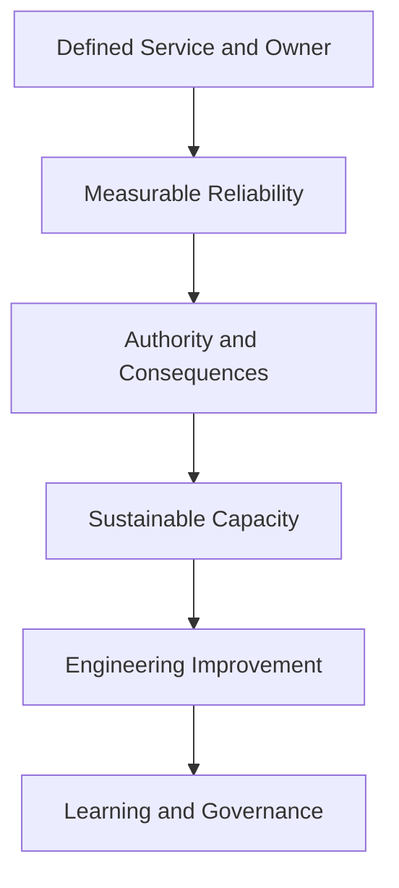
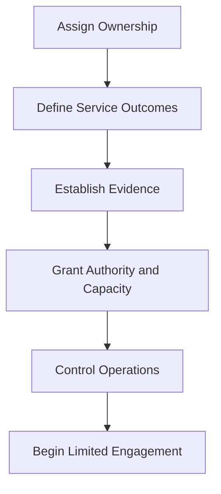

# When an Organization Is Not Ready for SRE

> An organization is not ready for SRE when it expects reliability accountability without defining service ownership, measurable objectives, decision authority, sustainable staffing, engineering capacity, or consequences for reliability failure. SRE cannot succeed as a title placed over unresolved organizational problems.

## Section Purpose

An organization can need stronger reliability engineering and still be unprepared to implement SRE successfully.

The distinction matters. A serious production problem creates urgency, but urgency does not create the conditions required for SRE. If an organization introduces SRE without those conditions, the new team often becomes:

- A renamed operations team
- A ticket queue
- A permanent incident response group
- A deployment gatekeeper
- The owner of abandoned services
- A substitute for missing application engineers
- A team held accountable without authority
- A source of unlimited on-call labor

This section explains:

- The minimum conditions required for credible SRE
- Hard blockers and recoverable readiness gaps
- Leadership, ownership, staffing, authority, and funding requirements
- Why SLOs require consequences
- Why SRE must control operational workload
- Why product teams must retain production responsibility
- How to assess readiness at organization, service, and team levels
- How to repair gaps before launching SRE
- When a limited pilot is appropriate
- How to stop or redesign an unsafe SRE implementation

The objective is not to delay reliability work until an organization is mature. The objective is to prevent the SRE label from hiding conditions that make reliable services and sustainable engineering impossible.

---

## Learning Objectives

After completing this section, you should be able to:

1. Distinguish the need for SRE from readiness to implement it.
2. Identify the minimum organizational conditions required for SRE.
3. Recognize responsibility without authority, SLOs without consequences, and on-call without sustainability.
4. Explain why product and development teams must retain production responsibility.
5. Separate hard blockers from gaps that can be addressed during a pilot.
6. Assess readiness at the organization, service, and team levels.
7. Define corrective actions for common readiness failures.
8. Establish safe entry, pause, handback, and exit conditions.
9. Evaluate whether an existing SRE team is functioning as SRE or renamed operations.
10. Build a phased readiness plan based on evidence.

---

## 1. Need and Readiness Are Different Decisions

[Section 20](./20-When-an-Organization-Needs-SRE.md) asks whether material reliability risk justifies focused engineering intervention.

This section asks whether the organization will support that intervention correctly.

| Decision | Core question |
| --- | --- |
| Need | Is reliability risk serious, persistent, and suitable for engineering intervention? |
| Readiness | Can the organization provide ownership, authority, objectives, staffing, engineering time, and support? |

A service can score high on need and low on readiness.

---

## 2. Readiness Is Not Perfection

An organization does not need mature SRE practices before it begins.

It does need enough commitment and capability to learn safely.

Minimum readiness means:

- A service can be defined
- An accountable owner exists
- Important users and outcomes are understood
- Reliability can be measured or measurement can be built
- Decision authority can be assigned
- Engineers can perform lasting improvement work
- Operational demand can be limited
- Leadership will act on reliability evidence

Gaps beyond this minimum can become part of the implementation plan.

---

## 3. The Readiness Chain

Weakness in an early link reduces the value of everything that follows.

---

## 4. Three Levels of Readiness

Assess readiness at three levels.

### Organization

Will leadership fund, protect, and govern SRE correctly?

### Service

Does the service have ownership, defined outcomes, operability, and an addressable reliability problem?

### Team

Does the proposed SRE team have skills, staffing, authority, and sustainable workload?

Approval at only one level is insufficient.

---

## 5. Readiness States

| State | Meaning | Appropriate action |
| --- | --- | --- |
| Ready | Minimum conditions exist | Begin with bounded scope |
| Conditionally ready | Gaps exist but can be controlled during a pilot | Start only with explicit safeguards |
| Not ready | Critical conditions are absent | Repair blockers before engagement |
| Unsafe | SRE would inherit serious risk without authority or capacity | Refuse, pause, or hand back responsibility |

Readiness should produce a decision, not only a score.

---

## 6. No Defined Service

An organization is not ready to assign SRE when it cannot define what is being operated.

Weak scopes include:

- Everything in production
- The cloud
- All Kubernetes clusters
- Whatever creates alerts
- Any system without another owner

A credible scope identifies users, outcomes, boundaries, dependencies, owners, objectives, and failure modes.

---

## 7. No Accountable Service Owner

SRE requires an accountable partner for the service.

The owner must be able to answer for:

- Intended behavior
- Product priorities
- Code and architecture
- Reliability decisions
- Dependencies
- Correctness
- Security obligations
- Lifecycle decisions

SRE should not become the owner merely because everyone else declined responsibility.

---

## 8. Ownership Exists Only on Paper

A name in a catalog is not sufficient.

Test whether the owner:

- Understands the service
- Participates in incidents
- Can prioritize corrective work
- Maintains code and configuration
- Reviews reliability evidence
- Has authority over change
- Can accept or escalate risk
- Plans retirement

If these capabilities are absent, the ownership record is administrative, not operational.

---

## 9. Product Teams Want to Hand Off Production

An organization is not ready when development teams believe their responsibility ends at deployment.

This creates:

- Weak instrumentation
- Unsafe releases
- Slow diagnosis
- Poor runbooks
- Repeated defects
- Conflict over corrective work
- Knowledge concentrated outside SRE

SRE can share production work. It cannot safely absorb all consequences of decisions it does not control.

---

## 10. SRE Is Expected to Own Every Failure

SRE should contribute to reliability across service boundaries, but it cannot own every cause of failure.

Application defects, unsafe product choices, dependency behavior, security weaknesses, and data correctness often require other owners.

Readiness requires a responsibility model that identifies who acts, who decides, and who remains accountable.

---

## 11. Responsibility Without Authority

This is a hard blocker.

SRE cannot be accountable for reliability while unable to:

- Influence architecture
- Change software
- Improve telemetry
- Reject unsafe onboarding
- Stop or roll back harmful change
- Obtain reliability work
- Regulate pager load
- Hand back an unhealthy service

Responsibility without authority creates accountability theater.

---

## 12. Authority Without Boundaries

Unlimited production authority is also unsafe.

Define:

- Who may act
- Under which conditions
- Which systems are in scope
- Which evidence is required
- What must be recorded
- How actions are verified
- When emergency access expires

SRE requires meaningful authority with auditable guardrails.

---

## 13. Leadership Wants the Title, Not the Discipline

Warning signs include:

- SRE is introduced for recruitment branding
- Existing operations roles are renamed without changing work
- Leaders cannot explain SLOs, error budgets, toil, or shared ownership
- Success is measured by ticket closure
- No engineering roadmap exists
- No one will change priorities when reliability fails

The title should follow the operating commitment.

---

## 14. Leadership Will Not Make Tradeoffs

SRE makes reliability, delivery, cost, and risk tradeoffs explicit.

An organization is not ready when leadership demands all of the following without prioritization:

- Maximum feature speed
- Perfect availability
- Minimum cost
- No additional staff
- No reduced scope
- No operational risk

Engineering cannot remove physical and economic constraints through effort alone.

---

## 15. Reliability Has No Executive Sponsor

Cross-team reliability work often competes with visible product delivery.

An accountable sponsor is needed to:

- Protect the mission
- Resolve ownership disputes
- Fund sustainable staffing
- Support error-budget consequences
- Remove structural blockers
- Review material risk
- Prevent SRE from becoming an unlimited queue

The sponsor need not control daily technical decisions.

---

## 16. Reliability Work Is Never Prioritized

If every planning cycle removes reliability work, SRE cannot create lasting improvement.

Symptoms include:

- Corrective actions remain open indefinitely
- Capacity risks are accepted by silence
- Recovery testing is repeatedly postponed
- Toil projects lose to features
- Known dangerous dependencies remain unchanged

Readiness requires a mechanism that reserves and protects engineering capacity.

---

## 17. No Shared Definition of Reliability

Teams may use "reliable" to mean:

- Servers are running
- No customer complained
- No page fired
- The SLA penalty was avoided
- The service returned HTTP 200
- The product worked in a test

SRE needs a service and user-centered definition that can guide measurement and decisions.

---

## 18. No Critical User Journeys

An organization is not ready for product-focused SRE when it cannot identify which user outcomes matter most.

Without Critical User Journeys, teams may protect components while users fail.

The first corrective step is to identify users, outcomes, boundaries, success, timeliness, correctness, and consequence.

---

## 19. SLOs Do Not Exist

Missing SLOs do not always prevent a pilot. Creating them may be the pilot's first task.

However, pager ownership should not be transferred before the parties agree on:

- What is measured
- What target applies
- Which window applies
- Which failures count
- Who owns the objective
- What action follows a miss

Otherwise, SRE is asked to defend an undefined promise.

---

## 20. SLOs Exist Without Consequences

An SLO without consequences is only a reporting metric.

Readiness requires agreement about what happens when the error budget is threatened or exhausted.

Possible actions include:

- Review risky launches
- Prioritize reliability work
- Reduce change scope
- Increase testing
- Escalate accepted risk
- Reassess the SLO

If evidence never changes decisions, the SLO has no operational authority.

---

## 21. SLOs Are Set at 100 Percent

A universal target of perfect reliability prevents honest risk management.

It can create:

- Permanent error-budget exhaustion
- Fear of necessary change
- Misleading exclusions
- Constant reactive work
- Unbounded cost
- Targets users do not require

Where life, safety, or irreversible harm is involved, extremely strong controls may be necessary. Even then, teams must define failure modes and residual risk honestly.

---

## 22. SLAs Are Mistaken for SLOs

An SLA is an external or contractual commitment. An SLO is an internal reliability objective used to operate and improve a service.

An organization is not ready when it expects SRE to manage only against penalty thresholds while ignoring user harm before the SLA is breached.

Internal objectives should normally provide a margin before external commitments fail.

---

## 23. Measurement Cannot Represent Users

Readiness is weak when the only available signals are infrastructure metrics.

SRE needs a path to measure:

- Success
- Latency
- Correctness
- Freshness
- Durability
- Coverage
- Quality

The relevant dimensions depend on the service. Measurement can improve over time, but known blind spots must be explicit.

---

## 24. Telemetry Is Untrusted

Warning signs include:

- Missing requests
- Inconsistent clocks
- Unknown sampling
- Unexplained gaps
- Metrics that disagree with logs
- Dashboards without owners
- Changing definitions
- Failed telemetry during incidents

Do not use untrusted data for strong reliability claims. Establish provenance, validation, coverage, and failure behavior.

---

## 25. No Incident Record

An organization cannot learn systematically when incidents disappear into chat, memory, or private notes.

Minimum incident records should capture:

- User impact
- Timeline
- Detection
- Response
- Mitigation
- Contributing conditions
- Decisions
- Follow-up ownership

The record supports learning, not punishment.

---

## 26. A Blame Culture Dominates Incident Review

SRE cannot learn safely when incident analysis searches for a person to punish.

Blame culture causes:

- Hidden mistakes
- Incomplete timelines
- Defensive explanations
- Avoidance of on-call
- Superficial corrective actions
- Repeated systemic conditions

Accountability still matters. The review should examine decisions, context, controls, system design, and organizational conditions.

---

## 27. No Corrective-Action Ownership

Post-incident analysis without action creates documentation, not improvement.

Every accepted action needs:

- An owner
- Priority
- Due date or review date
- Expected risk reduction
- Verification method
- Closure evidence

Not every observation requires an action. Accepted actions must be governed.

---

## 28. Incidents Are Treated as Normal Work

Frequent emergency response should not become a permanent staffing model.

An organization is not ready when it:

- Rewards rescue but not prevention
- Plans capacity around repeated emergencies
- Refuses to address known causes
- Uses SRE to absorb instability
- Calls recurring incidents unavoidable without evidence

The operating model must convert experience into safer systems.

---

## 29. No Production Access Model

SRE cannot respond safely without defined access.

Readiness requires:

- Role-based permissions
- Least privilege
- Emergency elevation
- Auditability
- Credential availability
- Revocation
- Break-glass testing
- Separation of duties where required

Access must support action without creating uncontrolled risk.

---

## 30. Access Is Either Absent or Unlimited

Both extremes are unsafe.

No access makes SRE accountable but powerless. Unlimited standing access increases blast radius and weakens accountability.

Use scoped, time-bound, observable access with clear emergency procedures.

---

## 31. The Service Cannot Be Changed Safely

Readiness is low when:

- Deployments are manual and undocumented
- Rollback is unavailable
- Configuration changes are untracked
- Releases require one person
- Environments differ without explanation
- Verification is subjective
- Small changes require large batches

SRE engagement may help improve change safety, but the risk must be bounded before SRE assumes primary on-call.

---

## 32. No Rollback or Mitigation Path

Every change cannot be instantly reversed, but every critical service needs credible mitigation options.

Options may include:

- Rollback
- Roll forward
- Traffic shift
- Feature disablement
- Load shedding
- Graceful degradation
- Dependency isolation
- Restore from known state

If no safe action exists, incident responsibility cannot be transferred casually.

---

## 33. Recovery Is a Documented Assumption

Backups, replicas, and secondary regions do not prove recovery.

Readiness requires evidence that:

- Data can be restored
- Failover can be completed
- Dependencies remain available
- Credentials work
- Recovered state is correct
- RTO and RPO can be achieved
- Failback is safe

Untested recovery should be recorded as unknown capability.

---

## 34. Disaster Recovery Has No Business Owner

Engineering can design and test recovery, but business owners must define:

- Critical services
- Recovery priorities
- Acceptable downtime
- Acceptable data loss
- Manual workarounds
- Declaration authority
- Residual risk acceptance

SRE cannot invent these requirements alone.

---

## 35. Architecture Has Unbounded Failure Domains

A service may be unsafe to onboard when a single failure can affect all instances, data copies, regions, or control paths.

SRE does not require perfect architecture before engagement. It does require:

- Known failure domains
- Explicit assumptions
- Prioritized containment work
- Honest objectives
- Authority to address severe risks

Hidden common-mode failure is more dangerous than known limitation.

---

## 36. Dependencies Are Unknown

An organization is not ready to promise reliability when it cannot identify critical dependencies.

Document:

- Internal services
- External providers
- Networks
- Identity
- Data stores
- Control planes
- Human procedures
- Escalation paths

SRE should know which assumptions sit outside its direct control.

---

## 37. No Capacity Model

Capacity emergencies become inevitable when no one understands:

- Demand
- Service limits
- Dependency limits
- Growth
- Headroom
- Scaling delay
- Degraded modes
- Cost constraints

A basic model may be developed during onboarding. Primary operational responsibility should not transfer while known imminent saturation remains unaddressed.

---

## 38. Security and Reliability Responsibilities Conflict

Readiness is weak when security controls prevent recovery or reliability practices weaken security.

Examples include:

- Responders cannot obtain emergency access
- Shared credentials are required for recovery
- Logging exposes secrets
- Security patches cannot be deployed safely
- Disaster copies bypass data controls
- Availability pressure encourages excessive privilege

Security and reliability owners must design compatible controls.

---

## 39. Compliance Is Used to Block Learning

Regulation and audit obligations may constrain actions, but they do not require unsafe or opaque operations.

Warning signs include:

- No one can explain the actual control requirement
- Manual approval exists without risk value
- Incident records are suppressed from fear
- Recovery tests are avoided
- Evidence is created after the event

Involve legal, risk, compliance, security, and engineering owners to define evidence-based controls.

---

## 40. SRE Is Expected to Work Around Every Governance Failure

SRE cannot compensate indefinitely for:

- Missing decision owners
- Contradictory policies
- Inaccessible change approval
- Unfunded commitments
- Unsupported technology
- Unmanaged vendors
- Absent data ownership

Escalate structural blockers to the authority that can resolve them.

---

## 41. The Proposed Team Is Too Small for On-Call

One or two engineers cannot provide sustainable 24-hour coverage for a critical service.

Staffing must account for:

- Rotation frequency
- Vacations
- Illness
- Training
- Incident duration
- Escalation depth
- Engineering work
- Geographic coverage

Do not use heroic availability as a staffing plan.

---

## 42. Staffing Counts Ignore Skills

Headcount alone does not prove readiness.

The team may need capability in:

- Software engineering
- Distributed systems
- Networking
- Data systems
- Observability
- Incident command
- Capacity
- Security
- Recovery
- Product communication

The required mix depends on the service and engagement.

---

## 43. No Time for Engineering Work

This is a defining blocker.

If all capacity is consumed by:

- Pages
- Tickets
- Deployments
- Manual changes
- Support escalation
- Repetitive maintenance

the team cannot make tomorrow safer than today.

SRE requires protected time for software, systems design, automation, simplification, testing, and risk reduction.

---

## 44. Operational Workload Cannot Be Regulated

SRE must be able to refuse, defer, automate, transfer, or hand back work.

Without workload control:

- Every production task becomes SRE work
- Toil grows without limit
- Service owners disengage
- Engineering projects disappear
- On-call becomes unsafe

Workload self-determination is necessary for the SRE mission.

---

## 45. No Toil Definition

An organization cannot control toil if it treats all operations as equal.

Define toil as work that is commonly:

- Manual
- Repetitive
- Automatable
- Tactical
- Service-related
- Growing with the service
- Low in enduring value

Measure it by source, owner, frequency, duration, and growth.

---

## 46. Toil Limits Have No Enforcement

A stated toil target is ineffective when:

- Intake remains unlimited
- Product teams reject handback
- Managers reward ticket volume
- Staffing assumes constant interruption
- Engineering time is the first capacity removed

Define what happens when toil crosses the limit.

---

## 47. On-Call Is Used as Cheap Labor

On-call exists for urgent response to material service risk.

It should not become:

- After-hours project work
- Routine customer support
- A substitute for staffing
- A channel for nonurgent requests
- A permanent workaround for weak systems

Compensation, recovery time, health, safety, and local employment requirements must be considered.

---

## 48. Alert Quality Is Unacceptable

Primary on-call should not transfer when:

- Pages have no required action
- Alert volume is unbounded
- Alerts do not identify services
- Duplicate pages are common
- User-impacting failures remain silent
- Escalation is undefined
- Runbooks are absent

Alert remediation may be an onboarding prerequisite or an early shared task.

---

## 49. The Team Cannot Hand Work Back

Handback protects both SRE and the service.

It may be necessary when:

- SLOs are persistently missed
- Toil exceeds limits
- Owners stop participating
- Corrective work is refused
- Onboarding assumptions become false
- The service becomes unsafe

If handback is politically impossible, SRE cannot regulate its workload.

---

## 50. SRE Is the Final Escalation for Every Team

An organization is not ready when SRE becomes the place where unresolved tickets, incidents, and ownership disputes accumulate.

Escalation must identify:

- The accountable service owner
- The immediate responder
- Specialist support
- Incident authority
- Business decision authority
- Vendor paths

SRE may coordinate severe incidents without owning every underlying system.

---

## 51. Funding Is Temporary but Responsibility Is Permanent

A permanent pager commitment cannot depend on short-term project funding.

Readiness requires funding for:

- Sustainable staffing
- Training
- Engineering projects
- Observability
- Recovery testing
- Leadership
- Operational support
- Growth

Time-limited funding should create time-limited scope and explicit exit.

---

## 52. Funding Incentives Distort Priorities

Funding can make SRE serve the payer instead of the highest reliability risk.

Risks include:

- Teams purchasing unlimited operational labor
- Shared services receiving no investment
- Critical low-revenue services being ignored
- Reliability work fragmented across budgets

Governance should connect funding to service criticality, risk, and agreed engagement.

---

## 53. No SRE Charter

A team charter should define:

- Mission
- Service scope
- Users and partners
- Responsibilities
- Exclusions
- Authority
- On-call model
- Engineering commitment
- Toil boundary
- Engagement lifecycle
- Success measures

Without a charter, expectations expand through habit and escalation.

---

## 54. The Charter Says "Ensure Everything Is Reliable"

This mission is too broad to operate.

It does not identify:

- Which services
- Which level of reliability
- Which risks
- Which owners
- Which authority
- Which resource limits
- Which evidence

Replace broad aspiration with bounded service commitments.

---

## 55. No Onboarding Criteria

SRE should not accept a service solely because it is important or unstable.

Criteria may include:

- Named owner
- Defined service boundary
- SLO or path to establish one
- Actionable telemetry
- Safe change mechanism
- Incident participation
- Recovery plan
- Known dependencies
- Manageable toil
- Agreed responsibility model

Exceptions require explicit risk acceptance and a correction plan.

---

## 56. Pager Transfer Happens on Day One

Immediate pager transfer prevents knowledge development and hides service weaknesses.

A safer sequence is:

1. Observe.
2. Review service evidence.
3. Shadow incidents.
4. Share response.
5. Correct critical gaps.
6. Transfer defined responsibilities gradually.
7. Verify capability.

The exact sequence depends on risk and existing knowledge.

---

## 57. No Engagement Exit

Every engagement does not need to end, but every engagement needs an exit model.

Exit may occur when:

- Objectives are achieved
- The service team gains capability
- Risk falls
- The product declines
- Another model fits better
- Engagement conditions fail
- The service retires

Without exit, scarce SRE capacity becomes permanently locked.

---

## 58. Embedded SRE Has No Time Limit

Permanent unstructured embedding can turn SREs into feature engineers or local operations staff.

Define:

- Problem
- Duration
- Outcomes
- Reporting relationship
- SRE practice support
- On-call expectations
- Knowledge-transfer plan
- Exit

Long-term product alignment can work, but it must preserve the SRE mission and community.

---

## 59. Consulting Produces Advice Without Implementation

An organization is not ready for consulting SRE when service teams lack capacity or authority to act on recommendations.

Before engagement, identify:

- Implementation owners
- Planning capacity
- Decision authority
- Verification
- Escalation

A report that cannot change the service creates little reliability value.

---

## 60. Platform Teams and SRE Have Unclear Boundaries

Confusion appears when both teams claim or reject:

- Shared infrastructure
- Developer tooling
- Runtime operation
- Service objectives
- Incident response
- Capacity
- Reliability standards

Define platform capabilities, consumer responsibilities, service ownership, and escalation paths.

---

## 61. Traditional Operations Is Renamed SRE

Renaming may be legitimate only if the operating model changes.

Evidence of no change includes:

- Same manual queue
- Same ticket metrics
- No software engineering expectation
- No SLOs
- No toil control
- No production influence
- No shared ownership
- No engineering roadmap

Respect the existing operations discipline. Do not mislabel it.

---

## 62. SRE Is Used to Centralize Control

SRE should not become a universal approval gate for every deployment and production action.

Central gates can create:

- Queues
- Slow feedback
- Reduced team ownership
- Superficial compliance
- Pressure to bypass controls

Prefer automated guardrails, risk-based review, clear standards, and local ownership where possible.

---

## 63. Teams Hide Information From SRE

SRE cannot operate through selective disclosure.

Required information may include:

- Architecture
- Known defects
- Dependencies
- Changes
- Incidents
- Capacity limits
- Security constraints
- Data risks
- Business commitments

The relationship needs transparency without turning SRE into an enforcement police force.

---

## 64. SRE and Development Are Adversaries

An adversarial model produces:

- Hidden changes
- Contested incidents
- Blame
- Slow remediation
- Defensive SLOs
- Unsafe handoffs

Readiness requires shared service outcomes, explicit decision rights, reliable escalation, and joint learning.

---

## 65. Reliability Is Considered Only an SRE Metric

Product, development, platform, security, and leadership decisions all affect reliability.

If only SRE is measured against service outcomes, incentives become misaligned.

Shared measures should preserve clear accountability rather than making everyone vaguely responsible.

---

## 66. Managers Reward Reactive Volume

Metrics such as pages answered, tickets closed, and incidents joined can reward system failure.

Evaluate SRE through:

- User reliability
- Risk reduction
- Recovery capability
- Reduced recurrence
- Reduced toil
- Engineering leverage
- Sustainable on-call
- Knowledge transfer

Activity may explain effort, but it is not the mission.

---

## 67. Performance Reviews Punish Prevention

Engineers will prioritize visible emergencies if quiet prevention receives little recognition.

Career and performance systems should value:

- Reliability design
- Automation with verified impact
- Simplification
- Incident learning
- Mentoring
- Risk communication
- Cross-team improvement
- Operational sustainability

Invisible prevention still needs credible evidence.

---

## 68. No Technical Leadership

SRE requires technical direction across incidents, architecture, observability, capacity, and reliability work.

Without technical leadership:

- Standards diverge
- Projects become reactive
- Complex risks remain unresolved
- Career growth weakens
- Local fixes replace coherent design

Management and technical leadership are distinct, complementary needs.

---

## 69. Management Does Not Protect Sustainability

SRE managers must address:

- Pager health
- Staffing
- Interruptions
- Workload boundaries
- Psychological safety
- Prioritization
- Partner conflict
- Career development

A manager who only expands service scope can destroy the team's ability to engineer.

---

## 70. No Skills Development Plan

Reliability work changes with services and architecture.

Readiness includes time for:

- Service learning
- Systems fundamentals
- Software engineering
- Incident practice
- Recovery exercises
- Security
- Communication
- Mentoring

Hiring experienced engineers does not remove the need for continuous learning.

---

## 71. Knowledge Is Not Shared

Warning signs include:

- One-person service expertise
- Private runbooks
- Undocumented mitigations
- No incident shadowing
- No design review
- Repeated escalations to former owners

Use pairing, rotations, exercises, documentation, review, and automation to distribute knowledge.

---

## 72. Geographic Coverage Is Added Without Handoff Design

Follow-the-sun operation requires:

- Shared service context
- Common severity models
- Handoff records
- Overlap time
- Clear incident command
- Consistent access
- Escalation across regions
- Learning across sites

Geographic presence does not automatically create safe coverage.

---

## 73. Regional Teams Have Unequal Authority

A regional team cannot own incidents if all important actions require another time zone.

Assess whether each site can:

- Diagnose
- Mitigate
- Deploy emergency changes
- Access dependencies
- Escalate vendors
- Communicate externally where authorized

If not, coverage claims must reflect the limitation.

---

## 74. Vendor Dependence Is Unmanaged

Using a vendor does not transfer complete service accountability.

Readiness requires:

- Named vendor owner
- Support entitlement
- Tested escalation
- Contract and SLA understanding
- Service-level telemetry
- Exit or containment options
- Data recovery knowledge
- Shared failure assumptions

SRE should not be accountable for a vendor relationship it cannot influence.

---

## 75. Outsourcing Removes Internal Knowledge

An organization is not ready when external providers operate critical services but internal owners cannot:

- Explain architecture
- Interpret reliability evidence
- Declare incidents
- Assess risk
- Verify recovery
- Change providers
- Continue during provider failure

External capability should complement, not erase, accountable internal ownership.

---

## 76. Legacy Systems Are Assigned Without Change Authority

Legacy technology can receive SRE support, but not when:

- Code cannot be changed
- Vendors are unsupported
- Knowledge is absent
- Recovery is impossible
- Objectives exceed capability
- Retirement is forbidden without risk acceptance

The organization must choose containment, modernization, replacement, reduced commitment, or explicit risk acceptance.

---

## 77. End-of-Life Services Have No Retirement Plan

SRE should not preserve obsolete services indefinitely by heroics.

Readiness requires:

- Named retirement owner
- User migration
- Data retention plan
- Dependency removal
- Reduced change
- Support timeline
- Final shutdown verification

Reliability includes safe retirement.

---

## 78. Acquisitions Create Orphaned Services

After acquisition, do not transfer unknown services directly to SRE.

First establish:

- Inventory
- Ownership
- Users
- Criticality
- Dependencies
- Access
- Commitments
- Operational history
- Retention or retirement decision

Unknown scope creates unlimited and unmeasured risk.

---

## 79. Reorganization Is Used as the Fix

Moving teams does not by itself improve:

- Architecture
- Measurement
- Recovery
- Toil
- Change safety
- Ownership
- Capacity

Reorganization may enable improvement, but the plan must identify mechanisms and outcomes.

---

## 80. A Tool Purchase Is Treated as Readiness

Observability, incident, automation, and service-management products can support SRE.

They cannot create:

- Ownership
- Risk tolerance
- Decision authority
- Engineering capacity
- Sustainable staffing
- Learning culture

Select tools after defining the service, decisions, users, and operating model.

---

## 81. Certification Is Treated as Capability

Training and certification can build vocabulary and baseline knowledge.

They do not prove that a team can:

- Operate a real service
- Diagnose distributed failure
- Make risk decisions
- Lead incidents
- Engineer recovery
- Influence product priorities

Assess practical capability through evidence and supervised experience.

---

## 82. Automation Is the Only SRE Plan

Automation is valuable when it reduces risk and sustainable human effort.

It is unsafe when it:

- Encodes a broken process
- Lacks ownership
- Has broad privilege
- Hides failure
- Cannot be stopped
- Expands blast radius
- Has no verification

SRE is an operating discipline, not an automation department.

---

## 83. Artificial Intelligence Is Expected to Replace Readiness

AI may assist diagnosis, summarization, pattern detection, and operational interfaces.

It does not remove the need for:

- Service ownership
- Trusted telemetry
- Access controls
- Human authority
- Verification
- Incident command
- Risk acceptance
- Safe fallback

AI-generated action can increase operational risk when inputs, boundaries, and review are weak.

---

## 84. Hard Blockers

Do not transfer major reliability accountability while any of these conditions remain:

- No accountable service owner
- No authority to influence the service
- No sustainable staffing for promised coverage
- No control over operational workload
- No path to engineering work
- No safe access or mitigation capability
- No leadership support for reliability consequences
- Known severe risk is concealed or denied

Reliability practices may still begin while these blockers are escalated.

---

## 85. Conditional Gaps

Some gaps can be addressed through a controlled pilot:

- Initial SLOs need refinement
- Telemetry has known coverage limits
- Runbooks need testing
- Toil has not been fully measured
- Service knowledge needs transfer
- Incident roles need practice
- Recovery evidence needs improvement

Each gap needs an owner, deadline, risk control, and exit condition.

---

## 86. Exception Criteria

An exception may be justified when delay creates greater risk than controlled engagement.

Document:

- The unmet criterion
- Why engagement must begin
- Temporary controls
- Authorized risk owner
- Correction deadline
- Review frequency
- Stop condition

Exceptions should not become permanent hidden policy.

---

## 87. Minimum Viable Readiness

Before a limited SRE pilot, require at least:

1. A defined service and accountable owner.
2. An important user outcome.
3. A documented reliability problem.
4. Access to relevant evidence.
5. Authority to implement agreed changes.
6. Protected engineering capacity.
7. Bounded operational responsibility.
8. Leadership support for decisions.
9. Measurable pilot outcomes.
10. Pause and exit conditions.

---

## 88. Build a Readiness Backlog

For every gap, record:

- Condition
- Evidence
- Risk
- Required action
- Owner
- Authority
- Target date
- Interim control
- Verification
- Status

Prioritize blockers that prevent safe ownership before general maturity improvements.

---

## 89. Sequence the Remediation

A practical sequence is:

The sequence may overlap, but later steps should not conceal missing foundations.

---

## 90. Phase 1: Establish Ownership

Actions include:

- Inventory services
- Assign accountable teams
- Record decision rights
- Identify dependencies
- Resolve orphaned services
- Define escalation
- Create retirement owners

Do not confuse a service catalog with completed ownership.

---

## 91. Phase 2: Define Reliability

Actions include:

- Identify Critical User Journeys
- Define SLIs
- Propose SLOs
- Identify commitments
- Document failure consequences
- Agree on error-budget responses
- Record assumptions

Begin with a few meaningful indicators.

---

## 92. Phase 3: Make the Service Operable

Actions include:

- Improve telemetry
- Define incident roles
- Build safe access
- Establish mitigation paths
- Test runbooks
- Review capacity
- Map dependencies
- Test recovery

Operability is part of service design.

---

## 93. Phase 4: Protect Engineering Capacity

Actions include:

- Measure operational demand
- Classify toil
- Set intake boundaries
- Reserve project time
- Define handback
- Staff on-call sustainably
- Prioritize recurring failure

This phase protects SRE from becoming a permanent reaction queue.

---

## 94. Phase 5: Begin a Limited Pilot

Choose a service with:

- Meaningful reliability need
- Cooperative owner
- Bounded scope
- Measurable outcomes
- Manageable risk
- Available engineering partners

Review the pilot at predetermined points and stop if hard blockers reappear.

---

## 95. Readiness Review Participants

Include people with relevant authority and evidence:

- Service owner
- Product representative
- Application engineers
- SRE
- Platform or infrastructure owner
- Security
- Incident responders
- Risk, compliance, or continuity specialists where relevant
- Business decision owner

Do not invite every function by default. Match participation to the service risk.

---

## 96. Readiness Evidence

Useful evidence includes:

| Area | Evidence |
| --- | --- |
| Ownership | Service record, decision rights, escalation path |
| Reliability | CUJs, SLIs, SLOs, commitments |
| Incidents | History, recurrence, response, corrective actions |
| Change | Deployment path, rollback, verification, failure rate |
| Operations | Pages, tickets, toil, runbooks, staffing |
| Recovery | Tests, achieved RTO and RPO, restore evidence |
| Authority | Access, release authority, prioritization agreements |
| Sustainability | Rotation design, workload limits, engineering allocation |

Documents should be supported by observed capability.

---

## 97. Readiness Decision Record

Record:

- Service and scope
- Decision date
- Participants
- Readiness state
- Evidence
- Blockers
- Accepted exceptions
- Required actions
- Engagement boundaries
- Review date
- Decision owner

This prevents assumptions from becoming invisible commitments.

---

## 98. Pause Criteria

Pause onboarding or engagement when:

- A critical owner leaves without replacement
- Pager load becomes unsafe
- SLO data becomes untrusted
- Required access is removed
- Corrective work is repeatedly rejected
- Severe risk is concealed
- The service changes beyond agreed scope
- Product participation stops

Pause is a risk control, not a punishment.

---

## 99. Handback Criteria

Handback may be required when:

- Entry conditions no longer hold
- Toil exceeds agreed limits
- The service remains below objectives without owner action
- SRE lacks authority to reduce risk
- Operational scope expands without capacity
- The team cannot sustain coverage

Define a safe transition, risk owner, date, and communication plan.

---

## 100. Reassessment

Readiness should be reassessed:

- Before onboarding
- Before pager transfer
- After severe incidents
- After major architecture change
- After reorganization
- When service commitments change
- When toil exceeds limits
- Before expanding scope

Readiness is a maintained condition, not a one-time approval.

---

## 101. Production Scenario: Renamed Operations Team

### Situation

Leadership renames a 12-person operations team as SRE. The team still closes tickets, performs manual deployments, and handles every alert. It has no software engineering time or SLO authority.

### Assessment

The organization changed the title but not the operating model.

### Corrective Action

Define services and owners, measure toil, reduce intake, establish engineering expectations, create SLO-based decisions, and protect project capacity. Keep role names accurate during the transition.

---

## 102. Production Scenario: Critical Service Without an Owner

### Situation

A legacy settlement service is highly critical. Its original team disbanded. Leadership asks SRE to take full ownership immediately.

### Assessment

Need is high, but readiness is unsafe. No accountable product or engineering owner exists.

### Corrective Action

Assign executive and technical ownership. Decide whether to stabilize, modernize, replace, or retire the service. SRE may support emergency containment without silently accepting permanent ownership.

---

## 103. Production Scenario: SLO Without Consequences

### Situation

A checkout service has a 99.9 percent SLO. It misses the target for four consecutive months, but every planned feature still ships and corrective work remains unstaffed.

### Assessment

The SLO is reporting, not decision-making.

### Corrective Action

Agree on an error-budget policy, assign decision authority, prioritize the highest-risk corrections, and establish escalation when owners accept residual risk.

---

## 104. Production Scenario: Two-Person Global Rotation

### Situation

Two SREs are asked to provide continuous coverage for a global identity service.

### Assessment

The staffing model is unsafe and leaves no credible capacity for engineering work.

### Corrective Action

Limit coverage, share response with trained service owners, reduce paging, add staffing, or change the commitment. Do not build the service promise on personal sacrifice.

---

## 105. Production Scenario: Immediate Pager Transfer

### Situation

An application team asks SRE to take the pager on the first day of engagement. The service has 180 weekly alerts, no tested rollback, and incomplete dependency documentation.

### Assessment

The service is not ready for pager transfer.

### Corrective Action

Keep primary response with the owner, establish an alert remediation plan, test mitigation, transfer knowledge, shadow incidents, and use evidence-based transfer gates.

---

## 106. Production Scenario: Leadership Demands Perfect Reliability

### Situation

Leadership requires 100 percent availability, faster weekly releases, lower cloud cost, and no increase in staffing.

### Assessment

The organization refuses necessary tradeoffs and has not defined risk tolerance.

### Corrective Action

Present user needs, current capability, cost ranges, failure modes, and options. Require an authorized decision on targets and residual risk before assigning SRE accountability.

---

## 107. Production Scenario: Blameless in Name Only

### Situation

Post-incident meetings are called blameless, but the engineer who deployed a faulty change receives a poor performance rating. Engineers begin omitting details.

### Assessment

The learning system is unsafe and incident evidence is becoming unreliable.

### Corrective Action

Separate good-faith learning from misconduct processes, review system and decision conditions, protect truthful reporting, and align management behavior with the stated policy.

---

## 108. Production Scenario: Consulting With No Implementers

### Situation

An SRE consulting group identifies capacity, recovery, and alerting risks. The service team has no planning capacity to act, and leadership asks for another assessment.

### Assessment

More advice will not create capability.

### Corrective Action

Assign implementation owners, reserve engineering capacity, prioritize by risk, and verify completed changes before commissioning further review.

---

## 109. Production Scenario: Conditional Readiness

### Situation

A product team owns a critical service and supports SLO decisions. Telemetry coverage is incomplete, recovery testing is overdue, and paging is noisy but manageable.

### Assessment

The service may be conditionally ready because ownership, authority, and willingness exist.

### Corrective Action

Run a bounded pilot with telemetry, recovery, and alert quality as entry milestones. Delay full pager transfer until verification succeeds.

---

## 110. Practical Exercise: Separate Need From Readiness

Choose one service and create two lists.

### Need Evidence

- User harm
- Reliability performance
- Incident recurrence
- Operational load
- Business risk

### Readiness Evidence

- Ownership
- Authority
- SLO consequences
- Staffing
- Engineering capacity
- Workload control

Give the service a separate decision for each list.

---

## 111. Practical Exercise: Test Real Ownership

Ask the named service owner to demonstrate:

1. Current service objectives.
2. Recent reliability decisions.
3. Incident participation.
4. Corrective-work prioritization.
5. Change authority.
6. Dependency ownership.
7. Retirement planning.

Record gaps between documented and actual ownership.

---

## 112. Practical Exercise: Audit Authority

For each expected SRE responsibility, record:

- Required decision
- Current authority holder
- Required access
- Guardrails
- Escalation path
- Maximum decision delay

Identify responsibilities that lack matching authority.

---

## 113. Practical Exercise: Evaluate SLO Consequences

Select one SLO and answer:

- Who approved it?
- Who owns it?
- What happens when burn rate is high?
- What happens when the budget is exhausted?
- Who can change release priorities?
- Which risk owner accepts an exception?
- When is the policy reviewed?

If no decision changes, the SLO is not operational.

---

## 114. Practical Exercise: Model the Rotation

Create a 12-week on-call schedule that includes:

- Primary and secondary coverage
- Vacations
- Illness
- Training
- Recovery after severe incidents
- Escalation
- Engineering time

Determine whether the proposed staffing can sustain the commitment without heroics.

---

## 115. Practical Exercise: Measure the Workload Boundary

For four weeks, classify incoming work as:

- Urgent response
- Necessary operations
- Toil
- Engineering improvement
- Product work
- Support
- Misrouted work

Identify which work SRE should accept, automate, return, defer, or reject.

---

## 116. Practical Exercise: Create Onboarding Gates

Write service onboarding criteria for:

- Ownership
- Objectives
- Telemetry
- Change safety
- Recovery
- Dependencies
- Security
- On-call
- Toil
- Engineering partnership

Define allowed exceptions and who may approve them.

---

## 117. Practical Exercise: Build a Readiness Backlog

For every failed criterion, record:

1. Risk.
2. Corrective action.
3. Owner.
4. Authority required.
5. Interim control.
6. Verification evidence.
7. Target date.
8. Stop condition.

Prioritize hard blockers first.

---

## 118. Practical Exercise: Design a Safe Pilot

Define:

- Service scope
- Reliability problem
- Minimum readiness
- Participants
- Responsibilities
- Engineering objectives
- Pager boundaries
- Success measures
- Review dates
- Pause and exit criteria

Do not allow the pilot to become an undocumented permanent engagement.

---

## 119. Practical Exercise: Audit an Existing SRE Team

Evaluate whether the team has:

- SLO-based work
- Software and systems engineering capacity
- Workload control
- Sustainable on-call
- Shared ownership
- Production authority
- Toil limits
- Engagement lifecycle
- Outcome measures

Identify which conditions reflect SRE and which reflect traditional operations.

---

## 120. SRE Readiness Checklist

### Service

- [ ] The service boundary is defined.
- [ ] Users and Critical User Journeys are known.
- [ ] An accountable service owner exists.
- [ ] Dependencies and major failure modes are documented.
- [ ] Lifecycle status is clear.

### Reliability

- [ ] Reliability is defined from the user perspective.
- [ ] SLIs and SLOs exist, or there is an approved plan to create them.
- [ ] SLO misses have agreed consequences.
- [ ] External commitments are understood.
- [ ] Risk tolerance has an authorized owner.

### Operability

- [ ] Telemetry is relevant and sufficiently trusted.
- [ ] Alerts require urgent action.
- [ ] Incident roles and escalation are defined.
- [ ] Safe mitigation paths exist.
- [ ] Recovery capability is tested.
- [ ] Capacity risks are understood.

### Ownership and Authority

- [ ] Product and development teams retain responsibility.
- [ ] SRE authority matches assigned accountability.
- [ ] Production access is controlled and sufficient.
- [ ] Reliability work can be prioritized.
- [ ] SRE can refuse unsafe onboarding.
- [ ] SRE can pause or hand back work.

### Sustainability

- [ ] On-call staffing is credible.
- [ ] Pager health is measured.
- [ ] Toil is defined and measured.
- [ ] Operational workload can be regulated.
- [ ] Engineering capacity is protected.
- [ ] Training and knowledge transfer are planned.

### Organization

- [ ] Leadership supports reliability tradeoffs.
- [ ] A sponsor can resolve structural blockers.
- [ ] Funding matches the commitment.
- [ ] The SRE charter defines scope and exclusions.
- [ ] Success is measured through outcomes.
- [ ] Incident learning is psychologically safe.

### Engagement

- [ ] Onboarding criteria are explicit.
- [ ] Knowledge transfer precedes responsibility transfer.
- [ ] Exceptions have owners and deadlines.
- [ ] Pause, handback, and exit criteria exist.
- [ ] Readiness will be reassessed.

---

## 121. Common Misunderstandings

### "Not Ready" Means "Do Nothing"

Incorrect. Ownership, measurement, incident learning, recovery testing, and toil reduction can begin immediately.

### SRE Must Wait for Perfect Systems

Incorrect. SRE exists to improve imperfect systems. It needs bounded risk, authority, and partners.

### A Severe Incident Automatically Creates Readiness

Incorrect. It may create urgency, but not staffing, ownership, or decision authority.

### Hiring Senior SREs Solves Organizational Gaps

Incorrect. Experienced engineers cannot compensate indefinitely for absent sponsorship and authority.

### More Tools Create Readiness

Incorrect. Tools support practices but do not create ownership or consequences.

### Handback Means Failure

Incorrect. Handback can protect sustainability, restore ownership, and expose unmet conditions.

---

## 122. Reflection Questions

1. Which SRE responsibility in your organization lacks matching authority?
2. Does reliability evidence change product priorities?
3. Which service owner exists only on paper?
4. Can SRE reject an unsafe service?
5. Can SRE hand work back when engagement conditions fail?
6. How much protected engineering capacity does the team actually receive?
7. Is on-call sustainable during vacation, illness, and severe incidents?
8. Which recovery capability has never been tested?
9. Does incident review encourage truthful reporting?
10. Which metric rewards reactive work?
11. What is the strongest readiness blocker?
12. What limited reliability work can begin before that blocker is removed?

---

## 123. Knowledge Check

1. What is the difference between need and readiness?
2. Does readiness require mature SRE practices before work begins?
3. Why is missing service ownership a hard blocker?
4. What makes an SLO operational?
5. Why must SRE control its operational workload?
6. Why is immediate pager transfer unsafe?
7. What is responsibility without authority?
8. Name four hard blockers to SRE engagement.
9. What makes a readiness exception credible?
10. Why can a consulting engagement fail even when its recommendations are correct?
11. What is minimum viable readiness?
12. When should readiness be reassessed?

---

## 124. Knowledge Check Answers

1. Need asks whether reliability risk justifies focused engineering. Readiness asks whether the conditions required for that work to succeed exist.
2. No. It requires minimum ownership, authority, evidence, capacity, boundaries, and willingness to learn safely.
3. SRE would lack an accountable partner for intended behavior, priorities, code, architecture, and lifecycle decisions.
4. Stakeholders agree on the measurement and target, an owner exists, and performance changes real decisions through an error-budget policy or equivalent mechanism.
5. Without workload control, toil and operational demand consume engineering capacity and turn SRE into an unlimited queue.
6. SRE lacks service knowledge, alert quality, tested mitigation, and verified capability at the start of engagement.
7. It is a condition where SRE is held accountable for an outcome but cannot make or influence the decisions required to produce it.
8. Examples include no service owner, no production authority, unsustainable staffing, no engineering time, no workload control, unsafe access, or no leadership support for reliability consequences.
9. It identifies the unmet criterion, authorized risk owner, temporary control, correction deadline, review schedule, and stop condition.
10. The service team may lack capacity or authority to implement the recommendations.
11. The smallest set of ownership, evidence, authority, capacity, operational boundaries, leadership support, and measurable outcomes required for a safe pilot.
12. Before onboarding and pager transfer, after severe incidents or major changes, when engagement assumptions fail, and before scope expands.

---

## 125. Key Takeaways

- An organization can need SRE and still be unready to implement it.
- Readiness does not require perfection. It requires enough structure to learn and improve safely.
- A defined service and accountable owner are foundational.
- Product and development teams retain production responsibility.
- SRE accountability must include authority to influence the service.
- SLOs must change decisions when reliability is threatened.
- SRE needs protected engineering capacity and control over operational workload.
- On-call must be staffed sustainably and supported by actionable alerts and safe mitigation.
- Tools, titles, certifications, and reorganizations do not create readiness.
- Hard blockers must be corrected before major responsibility transfer.
- Conditional gaps may be addressed through a bounded pilot with explicit safeguards.
- Onboarding, pause, handback, and exit protect both the service and the SRE team.
- Readiness must be verified through observed capability and reviewed over time.

---

## 126. Authoritative Resources

### SRE Adoption and Engagement

- [Google SRE Workbook: SRE Engagement Model](https://sre.google/workbook/engagement-model/)
- [Google SRE Workbook: SRE Team Lifecycles](https://sre.google/workbook/team-lifecycles/)
- [Google SRE Workbook: Organizational Change Management in SRE](https://sre.google/workbook/organizational-change/)
- [Google SRE Workbook: SRE Reaching Beyond Your Walls](https://sre.google/workbook/reaching-beyond/)

### Objectives, Toil, and Sustainable Operations

- [Google SRE Workbook: Implementing SLOs](https://sre.google/workbook/implementing-slos/)
- [Google SRE Workbook: Eliminating Toil](https://sre.google/workbook/eliminating-toil/)
- [Google SRE Workbook: On-Call](https://sre.google/workbook/on-call/)
- [Google SRE Workbook: Incident Response](https://sre.google/workbook/incident-response/)
- [Google SRE Workbook: Postmortem Culture](https://sre.google/workbook/postmortem-culture/)

### Core Principles

- [Google SRE Book: Introduction](https://sre.google/sre-book/introduction/)
- [Google SRE Book: Embracing Risk](https://sre.google/sre-book/embracing-risk/)
- [Google SRE Book: Eliminating Toil](https://sre.google/sre-book/eliminating-toil/)
- [Google SRE Book: Being On-Call](https://sre.google/sre-book/being-on-call/)

### Source Interpretation

These sources describe principles and operating patterns. They do not provide a universal maturity score or require one organization structure. Readiness must be evaluated against the actual service, risks, authority, staffing, workload, and organizational commitments.

---

## 127. Related SRE World Sections

- [What Is SRE?](./01-What-Is-SRE.md)
- [The SRE Mindset](./03-The-SRE-Mindset.md)
- [Reliability as a Product Feature](./04-Reliability-as-a-Product-Feature.md)
- [Reliability and Business Risk](./05-Reliability-and-Business-Risk.md)
- [Production Responsibility](./08-Production-Responsibility.md)
- [Service Ownership](./09-Service-Ownership.md)
- [Critical User Journeys](./10-Critical-User-Journeys.md)
- [Risk Tolerance](./11-Risk-Tolerance.md)
- [Engineering Work and Operational Work](./12-Engineering-Work-and-Operational-Work.md)
- [Toil](./13-Toil.md)
- [SRE Responsibilities](./18-SRE-Responsibilities.md)
- [SRE Operating Models](./19-SRE-Operating-Models.md)
- [When an Organization Needs SRE](./20-When-an-Organization-Needs-SRE.md)
- [SRE Foundations](./README.md)

---

## Next Section

[Section 22: Common SRE Misunderstandings](./22-Common-SRE-Misunderstandings.md)

---

## Maintained by VERIQTA

SRE World is created and maintained by [VERIQTA](https://github.com/veriqta).

- Website: [veriqta.com](https://www.veriqta.com/)
- GitHub: [github.com/veriqta](https://github.com/veriqta)
- Instagram: [@veriqta](https://www.instagram.com/veriqta/)
- Medium: [veriqta.medium.com](https://veriqta.medium.com/)

> SRE becomes credible when the organization gives reliability work real owners, measurable objectives, decision authority, sustainable capacity, controlled operational demand, and consequences that turn evidence into action.
