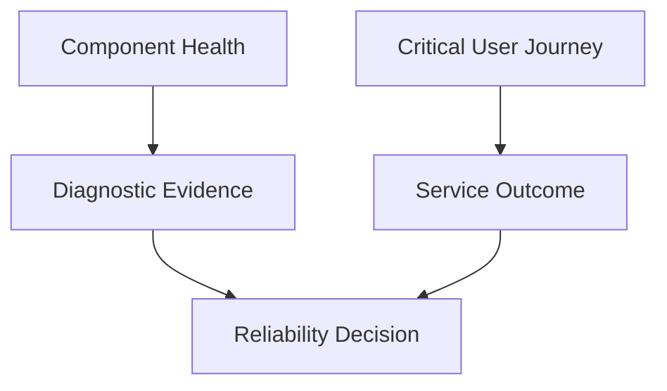

# Common SRE Misunderstandings

> SRE is commonly misunderstood when organizations copy its tools, titles, or visible rituals without adopting its service-centered measurement, explicit risk decisions, engineering approach to operations, shared production responsibility, and protection of sustainable human effort.

## Section Purpose

Site Reliability Engineering is often reduced to a job title, a toolset, an on-call team, a cloud operations function, or a promise of perfect uptime. These interpretations remove the principles that make SRE distinct.

Misunderstandings are not merely vocabulary problems. They change organizational behavior. A false belief can lead an organization to:

- Hire for the wrong skills
- Assign responsibility without authority
- Measure infrastructure instead of user outcomes
- Set impossible reliability targets
- Treat error budgets as permission to cause outages
- Call every operational task toil
- Automate unsafe processes
- Transfer production responsibility away from developers
- Turn SRE into a permanent incident queue
- Reward heroics and normalize responder harm

This section examines common SRE claims, explains why they are incomplete or wrong, shows the production consequences, and provides a more accurate interpretation.

The purpose is not to enforce one company model. SRE can be implemented in different organizational forms. The defining test is whether the operating behavior supports measurable reliability, controlled risk, production engineering, learning, and sustainable work.

---

## Learning Objectives

After completing this section, you should be able to:

1. Identify common misunderstandings about the purpose and scope of SRE.
2. Distinguish SRE principles from tools and job titles.
3. Explain why SRE is not equivalent to operations, DevOps, platform engineering, or cloud administration.
4. Correct misconceptions about SLOs, SLIs, SLAs, and error budgets.
5. Distinguish toil from all operational work.
6. Explain why automation, observability, and on-call do not independently create SRE.
7. Recognize organizational structures that misuse the SRE label.
8. Evaluate misleading reliability claims using user and service evidence.
9. Communicate corrections without dismissing adjacent engineering disciplines.
10. Assess whether an organization practices SRE or only uses SRE terminology.

---

## 1. Why SRE Is Easy to Misunderstand

SRE combines ideas from:

- Software engineering
- Systems engineering
- Production operations
- Distributed systems
- Reliability engineering
- Risk management
- Human factors
- Organizational design

Different organizations encounter different parts first. One may begin with on-call, another with SLOs, and another with automation. The visible practice can then be mistaken for the complete discipline.

---

## 2. A Misunderstanding Test

When someone defines SRE, ask whether the definition includes:

- A service and its users
- Explicit reliability objectives
- Acceptable risk
- Engineering applied to operations
- Production ownership
- Incident learning
- Toil control
- Sustainable human effort
- Decision authority

If the definition contains only tools or tasks, it is incomplete.

---

## 3. Myth: SRE Is a Toolset

SRE is not created by using Kubernetes, Terraform, Prometheus, Grafana, cloud platforms, incident software, or automation frameworks.

Tools can support SRE work. They do not define:

- Which user outcome matters
- What reliability is required
- Which risk is acceptable
- Who owns the service
- What happens after an SLO miss
- Whether operational work is sustainable

The same tool can support SRE, platform engineering, development, security, or traditional operations.

---

## 4. Myth: Kubernetes Means SRE

Kubernetes is a workload orchestration platform. Operating it can involve reliability engineering, but cluster administration is not automatically SRE.

A team may operate Kubernetes without:

- User-centered SLOs
- Error budgets
- Service ownership
- Incident learning
- Toil limits
- Product engagement

Call the team according to its actual mission. Platform engineering, infrastructure engineering, and Kubernetes operations are valid disciplines.

---

## 5. Myth: Cloud Engineering Is SRE

Cloud engineering commonly focuses on cloud architecture, services, accounts, networks, security, cost, and delivery.

SRE focuses on operating service outcomes at an explicitly agreed reliability level.

The work can overlap. A cloud engineer may practice SRE principles, and an SRE may engineer cloud systems. The disciplines are not interchangeable.

---

## 6. Myth: SRE Is DevOps With Another Name

DevOps is a broad movement concerned with improving how software is built, delivered, and operated through collaboration, automation, feedback, and shared responsibility.

SRE is a more specific reliability discipline with mechanisms such as:

- SLIs
- SLOs
- Error budgets
- Toil control
- Production engineering
- Sustainable on-call

SRE can implement many DevOps principles, but the terms do not mean the same thing.

---

## 7. Myth: SRE Replaces DevOps

SRE does not need to defeat or replace DevOps.

An organization may use DevOps principles broadly and SRE practices for services that require explicit reliability management. The useful question is which operating problems need to be solved, not which label wins.

---

## 8. Myth: SRE Is Platform Engineering

Platform engineering creates and operates shared capabilities that help teams build and run software.

SRE manages reliability risk for services through objectives, production engineering, response, and learning.

A platform can be an SRE-supported service. An SRE team can build platform capabilities. The primary purpose remains different.

---

## 9. Myth: SRE Replaces Platform Engineering

SRE should not become the default team for every internal platform, developer workflow, or infrastructure service.

Platform engineering may own the capability and consumer experience. SRE may help define reliability, operate critical components, or improve resilience. Clear service boundaries prevent duplicate or abandoned ownership.

---

## 10. Myth: SRE Is Production Engineering Everywhere

Production engineering and SRE can overlap deeply in software, systems, performance, scalability, and production operation.

Some organizations use the titles differently. Do not assume equivalence based on title alone. Examine:

- Mission
- Reliability mechanisms
- Ownership model
- Work mix
- On-call boundaries
- Decision authority

---

## 11. Myth: SRE Is Traditional Operations With a Modern Title

Traditional operations includes valuable work such as infrastructure maintenance, support, change, backup, access, and incident response.

SRE is distinct when it includes:

- Software engineering as a core method
- Explicit reliability objectives
- Control of operational workload
- Protected engineering capacity
- Shared production responsibility
- Reduction of recurring work

Renaming a team without changing its operating model does not create SRE.

---

## 12. Myth: Traditional Operations Is Obsolete

SRE does not make every operations model illegitimate.

Some environments require specialized administration, controlled procedures, physical operations, vendor coordination, or stable manual work. The correct model depends on service risk, technology, scale, and economics.

The issue is not whether work is called operations. The issue is whether the model produces dependable and sustainable outcomes.

---

## 13. Myth: SRE Is System Administration

System administration may be part of operating a service, but SRE is not defined by managing servers, accounts, packages, or operating systems.

SRE organizes work around the service and its users. System administration organizes much of its work around computing environments and their operation. Both can require deep expertise.

---

## 14. Myth: SRE Is Infrastructure Support

Infrastructure support usually responds to requests and failures involving infrastructure components.

SRE should connect infrastructure behavior to service objectives and use engineering to reduce recurring demand. If a team only receives tickets and restores components, its mission is incomplete for SRE.

---

## 15. Myth: SRE Is a Help Desk for Engineers

SRE is not the destination for every difficult production question.

An unlimited support model causes:

- Lost service ownership
- Growing queues
- Increasing toil
- Reduced engineering capacity
- Dependence on SRE

SRE may consult, create shared capabilities, or respond within a defined engagement. Work boundaries must remain explicit.

---

## 16. Myth: SRE Owns Everything in Production

Production contains services, platforms, data, networks, security controls, and vendor systems with different owners.

SRE can coordinate reliability across boundaries without owning every component. One accountable owner should exist for each service outcome, while supporting teams own defined capabilities.

---

## 17. Myth: Developers Stop Owning Software After Deployment

The teams that design and change a service continue to influence its production behavior.

They retain responsibilities for:

- Code correctness
- Instrumentation
- Safe change
- Dependency behavior
- Incident participation
- Corrective work
- Lifecycle decisions

SRE partnership does not erase those responsibilities.

---

## 18. Myth: You Build It, You Run It Means Every Developer Is Always On Call

Production ownership does not require one universal rotation design.

Coverage should match:

- Service criticality
- Commitments
- Team size
- Skills
- Incident frequency
- Support hours

Developers must remain connected to production consequences, but the mechanism can include shared rotations, escalation, business-hours ownership, or SRE partnership.

---

## 19. Myth: SRE Removes the Need for Application Engineers

SRE cannot substitute for the people who understand product behavior and own application changes.

If a service lacks application engineers, SRE may diagnose failures but remain unable to correct business logic, redesign features, or make lifecycle decisions.

---

## 20. Myth: SRE Is Solely Responsible for Reliability

Reliability is affected by:

- Product priorities
- Application design
- Infrastructure
- Security controls
- Dependencies
- Change practices
- Staffing
- Business commitments

SRE provides specialized reliability capability. Accountability must still be distributed clearly across decision owners.

---

## 21. Myth: Reliability Means Uptime

Uptime is only one possible reliability dimension.

A service can be reachable and still fail because it:

- Returns incorrect results
- Responds too slowly
- Loses data
- Serves stale information
- Duplicates an action
- Fails for one user group
- Cannot complete a critical journey

Reliability means performing the intended function consistently under defined conditions.

---

## 22. Myth: Availability and Reliability Are Identical

Availability asks whether a function can be used when required. Reliability is broader and may include correctness, latency, durability, capacity, consistency, and recovery.

A highly available service that returns incorrect balances is not reliable.

---

## 23. Myth: Resilience Means Nothing Ever Fails

Resilience assumes disruption will occur.

It concerns the ability to:

- Prepare
- Absorb
- Adapt
- Continue critical behavior
- Recover
- Learn

A resilient service may degrade safely rather than remain fully functional through every failure.

---

## 24. Myth: Redundancy Proves Resilience

Several replicas may share:

- One zone
- One control plane
- One configuration error
- One identity dependency
- One corrupted data source
- One operator action

Redundancy helps only when failure domains and common causes are understood and tested.

---

## 25. Myth: Backups Prove Recoverability

A backup is an input to recovery, not proof of recovery.

Evidence requires restoration, validation, access, dependency availability, achieved recovery time, achieved recovery point, and safe return to operation.

Untested backups provide uncertain recovery capability.

---

## 26. Myth: Replication Is Backup

Replication can copy:

- Corruption
- Accidental deletion
- Malicious changes
- Invalid writes

Backups, replication, fault tolerance, and disaster recovery solve related but different problems. A complete data protection design states which failures each control addresses.

---

## 27. Myth: Disaster Recovery Means Multi-Region

Multiple regions do not create disaster recovery by themselves.

A credible plan includes:

- Activation criteria
- Decision authority
- Data recovery
- Dependency recovery
- Access
- Communication
- Verification
- Failback
- Testing

Regional architecture is only one component.

---

## 28. Myth: Reliability Must Be 100 Percent

Perfect reliability is generally impossible to guarantee and may be unnecessary or prohibitively expensive.

SRE makes the target explicit based on user needs, business risk, cost, and system capability. A target below 100 percent creates room for controlled change while still protecting users.

---

## 29. Myth: Lower Than 100 Percent Means Engineers Plan to Fail

An SLO below 100 percent does not instruct engineers to create outages.

It acknowledges that failure risk exists and defines the maximum level compatible with user expectations. Teams should still prevent avoidable harm and use the budget to make informed decisions.

---

## 30. Myth: More Nines Are Always Better

Each additional nine can increase design, capacity, testing, operational, and organizational cost.

A stricter target is valuable only when the user and business benefit justifies it. Unnecessarily strict objectives can reduce delivery speed without creating noticeable value.

---

## 31. Myth: One SLO Covers the Entire Service

A service may require separate objectives for:

- Availability
- Latency
- Correctness
- Freshness
- Durability
- Coverage
- Quality

Different Critical User Journeys may also require different targets. Avoid both one vague objective and an unmanageable number of indicators.

---

## 32. Myth: Every Metric Is an SLI

An SLI is a quantitative measure of a relevant aspect of service level.

CPU, memory, queue depth, and pod count may help diagnosis, but they are not automatically SLIs. An SLI should represent behavior users or dependent systems care about.

---

## 33. Myth: Every SLI Needs an SLO

Teams can observe a useful service indicator without immediately setting an objective for it.

Create SLOs for behaviors that guide decisions. Too many objectives divide attention and make governance unclear.

---

## 34. Myth: SLOs Are Just Dashboard Targets

An SLO should influence engineering and product decisions.

If performance below the target never changes priorities, releases, risk review, or corrective work, the SLO is only a reporting number.

---

## 35. Myth: SLOs Must Be Perfect Before Use

Initial SLOs can be provisional.

Teams should:

- State assumptions
- Measure coverage
- Review user relevance
- Compare with incidents and support evidence
- Refine targets and implementation

Waiting for perfect measurement can preserve complete ambiguity.

---

## 36. Myth: Set the SLO From Current Performance

Current performance is evidence, not the complete requirement.

An SLO should consider:

- User expectations
- Business consequence
- External commitments
- Dependency limits
- Product alternatives
- Cost
- Engineering capability

Copying current performance may formalize an unnecessary level or excuse poor service.

---

## 37. Myth: Set the SLO From the SLA

The SLA is often a contractual boundary with exclusions and remedies. The SLO is an internal operating target.

An internal SLO should normally provide enough margin to detect and respond before an external commitment is violated.

---

## 38. Myth: SLO Compliance Proves Users Are Happy

An SLO is a model of selected service behavior. It can miss:

- Unmeasured journeys
- Small user groups
- Correctness defects
- Client-side failure
- Requests that never reach measurement
- Qualitative trust loss

Compare SLOs with support, product, incident, and segmented user evidence.

---

## 39. Myth: Averages Are Enough

Averages can hide:

- Tail latency
- Regional failure
- Tenant-specific impact
- Short severe outages
- Low-volume critical journeys
- Unequal user harm

Use distributions, percentiles, event ratios, and segmentation where they match the service question.

---

## 40. Myth: Internal Health Equals User Success

Healthy hosts, pods, databases, and load balancers do not prove that users completed an outcome.

Component health supports diagnosis. Service outcomes define reliability.

---

## 41. Myth: Error Budget Means Planned Downtime

An error budget is the amount of unreliability permitted by an SLO over its window.

It is not a requirement to consume failure. It is a risk allowance used to balance reliability and change.

---

## 42. Myth: Error Budget Is Permission to Break the Service

Teams should not create avoidable user harm simply because budget remains.

The budget informs how much risk the organization can take. Safe engineering practices, security obligations, and change controls still apply.

---

## 43. Myth: Error Budget Belongs to Developers

The budget is not a reward one team spends against another team's service.

It represents the service's tolerance for unreliability and should support shared decisions among product, development, SRE, and authorized risk owners.

---

## 44. Myth: Error Budget Belongs to SRE

SRE may calculate and report the budget, but it does not independently own the user or business tradeoff.

Decision authority should be explicit. SRE provides engineering evidence and enforces agreed policies within its authority.

---

## 45. Myth: Exhausted Error Budget Requires a Total Feature Freeze

A freeze may be one policy response, but it is not universal.

Responses can include:

- Pausing high-risk changes
- Allowing low-risk fixes
- Reducing release scope
- Increasing review
- Prioritizing recovery work
- Escalating accepted risk

The policy should be agreed before pressure rises.

---

## 46. Myth: Error Budgets Punish Product Teams

An effective policy creates shared decision evidence. It should not be used as punishment or as a way for SRE to win arguments.

If teams manipulate measurements or conceal incidents to avoid consequences, the governance model has failed.

---

## 47. Myth: Burn Rate and Remaining Budget Are the Same

Remaining budget describes how much allowance is left in the window. Burn rate describes how quickly the service is consuming that allowance relative to the expected rate.

A service may have budget remaining while consuming it fast enough to require urgent action.

---

## 48. Myth: SLA, SLO, and SLI Are Interchangeable

| Term | Purpose |
| --- | --- |
| SLI | Measures an aspect of service level |
| SLO | Defines the target for that measure |
| SLA | Defines an external or contractual commitment and consequence |

The concepts relate, but they serve different decisions.

---

## 49. Myth: SRE Is Monitoring

Monitoring provides evidence about systems and services.

SRE also includes:

- Objective design
- Risk decisions
- Production engineering
- Capacity
- Incident response
- Recovery
- Toil reduction
- Organizational engagement

A dashboard without decisions and action is not an SRE practice by itself.

---

## 50. Myth: Observability Automatically Creates Reliability

Observability can improve the ability to understand internal system state from emitted signals. It does not prevent all failure or decide what reliability users require.

Telemetry must be connected to service outcomes, investigation, response, and engineering change.

---

## 51. Myth: More Telemetry Is Always Better

More signals can increase:

- Cost
- Noise
- Cognitive load
- Privacy risk
- Storage demand
- Conflicting interpretations

Collect telemetry that supports known reliability questions, while preserving enough exploratory evidence for unknown failure.

---

## 52. Myth: A Dashboard Is an Operating Model

A dashboard does not define:

- Who responds
- What action is required
- Which risk is acceptable
- Who owns the service
- What happens after failure
- How improvement is prioritized

Dashboards support an operating model. They do not replace one.

---

## 53. Myth: Every Alert Should Page

A page should require urgent human action because delay creates material harm.

Other signals can create:

- Tickets
- Reports
- Dashboard context
- Automated remediation
- Business-hours investigation

Paging every abnormal condition creates noise and weakens response to real emergencies.

---

## 54. Myth: No Alerts Means the Service Is Healthy

No alerts may mean:

- No failure
- Missing coverage
- Broken telemetry
- Poor thresholds
- Disabled paging
- Unknown user impact

Verify service outcomes rather than treating silence as proof.

---

## 55. Myth: SRE Is On-Call

On-call is one mechanism for urgent production response.

SRE also needs engineering time to reduce failure, improve recovery, control toil, and make operation sustainable. A team that only answers pages cannot complete the SRE mission.

---

## 56. Myth: The Best SRE Handles the Most Incidents

High incident participation may reflect experience, but it can also reveal unhealthy dependence.

Strong SRE work makes response knowledge shared, reduces recurrence, improves systems, and lowers the need for individual heroics.

---

## 57. Myth: Fast Acknowledgment Equals Fast Recovery

Acknowledgment shows that someone received the page. It does not prove diagnosis, mitigation, restoration, or verification.

Measure the response stages that matter to user harm.

---

## 58. Myth: Mean Time to Recovery Tells the Whole Story

An average can hide long severe events and mix unrelated incident types.

Consider:

- Time to detect
- Time to engage
- Time to mitigate
- Time to restore
- Time to verify
- User-impact duration
- Recurrence
- Distribution by severity

Use the measure to support learning, not rank individuals.

---

## 59. Myth: Every Incident Needs a Large Postmortem

The depth of review should match learning value, severity, novelty, recurrence, and risk.

A small recurring failure may deserve deep review. A well-understood low-impact event may need only a short record and verified correction.

---

## 60. Myth: Blameless Means No Accountability

Blameless learning avoids reducing complex failure to individual fault.

Accountability still includes:

- Owning actions
- Following agreed controls
- Reporting honestly
- Making decisions within authority
- Addressing reckless or malicious behavior through appropriate processes

Learning and accountability can coexist.

---

## 61. Myth: Root Cause Is Always One Thing

Production incidents often emerge from interacting technical and organizational conditions.

Searching for one root cause can hide:

- Design assumptions
- Weak controls
- Dependency behavior
- Communication delay
- Workload pressure
- Missing verification

Identify contributing conditions and the controls that can reduce recurrence or consequence.

---

## 62. Myth: Human Error Is a Complete Cause

Human action occurs within a system of interfaces, permissions, procedures, incentives, time pressure, and feedback.

Ask why the action was reasonable at the time, why the system allowed harmful effect, and why detection or containment failed.

---

## 63. Myth: Automation Removes Human Error

Automation changes where human decisions occur. Engineers still design, configure, approve, and maintain it.

Automation can repeat one mistake at large scale. Use scope limits, review, testing, staged rollout, observability, and rollback.

---

## 64. Myth: Automate Everything

Automation has design, maintenance, security, and failure costs.

Prioritize work that is:

- Frequent
- Risky
- Time-consuming
- Standardizable
- Growing
- Suitable for verification

Some rare, high-judgment work is safer with human control and strong procedure.

---

## 65. Myth: Automation Is Always Engineering Work

A script can be tactical or fragile.

Engineering work creates a maintainable capability with:

- Ownership
- Tests
- Failure handling
- Security boundaries
- Observability
- Documentation
- Lifecycle management

Automating one manual step does not necessarily solve the system problem.

---

## 66. Myth: All Manual Work Is Toil

Manual work may create learning, judgment, design, mentoring, or one-time value.

Toil is commonly manual, repetitive, automatable, tactical, service-related, and growing with service demand. Evaluate the nature and value of the work, not only whether a human performs it.

---

## 67. Myth: All Operational Work Is Toil

Operations can include high-value engineering and decision work such as:

- Incident command
- Recovery design
- Capacity analysis
- Production experimentation
- Failure-mode review
- Complex diagnosis

Toil is a subset of operational work.

---

## 68. Myth: Toil Has No Value

Some toil is necessary to operate a service safely until a better solution exists.

The problem is unbounded toil that grows, displaces engineering, and remains unexamined. Measure it, prioritize it, and decide whether to automate, simplify, transfer, defer, or accept it.

---

## 69. Myth: Zero Toil Is the Goal

Eliminating every recurring task may cost more than the task or introduce greater complexity.

The goal is a sustainable workload with enough engineering capacity to improve the service. Accepted toil should be explicit and periodically reviewed.

---

## 70. Myth: Toil Is a Junior Engineer's Job

Concentrating repetitive work on junior engineers creates:

- Unequal burden
- Slow learning
- Weak retention
- Hidden system problems
- Reduced feedback to senior decision makers

Distribute necessary operations fairly and give junior engineers meaningful engineering work, support, and context.

---

## 71. Myth: SRE Exists to Reduce Headcount

Engineering away repetitive work can reduce proportional staffing growth. That does not make SRE a workforce-reduction program.

SRE capacity should be reinvested in reliability, scalability, recovery, simplification, and safer delivery.

---

## 72. Myth: SRE Means Fewer People Are Needed for Every Service

Higher reliability can require more people, deeper expertise, geographic coverage, and stronger governance.

SRE seeks efficient and sustainable operation, not minimum staffing regardless of risk.

---

## 73. Myth: SRE Is a Cost Center With No Product Value

Reliability affects:

- Whether features can be used
- Customer trust
- Revenue
- Retention
- Employee productivity
- Risk
- Delivery speed

SRE value should be connected to protected user outcomes and reduced operational risk, not described only through infrastructure activity.

---

## 74. Myth: Reliability Work Always Has Positive Return

Reliability investment can be wasteful when it protects low-value behavior, exceeds user needs, adds excessive complexity, or costs more than the risk reduction.

SRE includes the discipline to decide when not to add reliability.

---

## 75. Myth: SRE Should Prevent Every Incident

Some incidents will occur because systems, dependencies, people, and environments are imperfect.

SRE aims to:

- Prevent avoidable failure
- Limit blast radius
- Detect meaningful impact
- Recover predictably
- Learn
- Control recurring risk

Incident absence is not the only evidence of resilience.

---

## 76. Myth: SRE Is Reactive

Incident response is visible, but much SRE value should occur before failure through:

- Design review
- SLOs
- Capacity planning
- Production readiness
- Testing
- Safe delivery
- Recovery engineering
- Toil reduction

A permanently reactive team lacks protected engineering capacity.

---

## 77. Myth: SRE Should Join Only After Launch

Early involvement can prevent expensive reliability defects through architecture review, failure modeling, capacity planning, operability design, and objective definition.

SRE engagement should match the service lifecycle and risk.

---

## 78. Myth: Production Readiness Review Is an Approval Ceremony

A Production Readiness Review should examine evidence, risks, ownership, and capability.

It should not become:

- A late checklist
- A universal bureaucracy
- A substitute for engineering
- A one-time guarantee
- A gate owned only by SRE

Readiness must continue after launch.

---

## 79. Myth: Passing Readiness Review Guarantees Reliability

A review evaluates known evidence at a point in time. Production introduces real users, traffic, dependencies, change, and unknown interactions.

Continue measurement, incident learning, recovery testing, and reassessment.

---

## 80. Myth: SRE Should Approve Every Release

Universal manual approval does not scale and weakens product-team ownership.

Prefer:

- Automated safety controls
- Risk-based review
- Progressive delivery
- Clear rollback criteria
- SLO-informed policy
- Local authority within guardrails

SRE may directly review exceptional high-risk changes.

---

## 81. Myth: Error Budgets Eliminate Change Review

Available budget does not make every change safe.

Security, data integrity, regulatory, and irreversible changes may require additional controls. Error budget is one decision input, not the entire governance system.

---

## 82. Myth: Change Freezes Create Reliability

A temporary freeze can limit risk during instability or critical periods.

Long freezes can also:

- Delay security fixes
- Increase batch size
- Reduce practice
- Hide weak delivery systems
- Create risky post-freeze releases

Use freezes as bounded controls while improving change safety.

---

## 83. Myth: More Process Always Improves Reliability

Process can reduce ambiguity and prevent known failure. Excessive process can add delay, handoffs, confusion, and workarounds.

Evaluate controls through actual risk reduction and failure evidence.

---

## 84. Myth: Simplicity Means Using Fewer Technologies

Technology count can influence complexity, but operational simplicity also depends on:

- Clear ownership
- Predictable behavior
- Understandable failure modes
- Safe change
- Observable state
- Recoverability

One large system can be more complex to operate than several well-bounded services.

---

## 85. Myth: Microservices Are More Reliable

Microservices can isolate some failures and enable independent change. They also add networks, dependencies, deployment surfaces, ownership boundaries, and cascading failure modes.

Reliability comes from design and operation, not architecture style alone.

---

## 86. Myth: Monoliths Are Not Suitable for SRE

SRE principles apply to any production service with users, objectives, risks, and operational work.

A monolith can have clear ownership, strong measurement, safe delivery, predictable recovery, and controlled toil.

---

## 87. Myth: Managed Services Remove Reliability Responsibility

A provider may operate components, but the customer still owns:

- Configuration
- Integration
- Data
- Access
- Capacity choices
- Service-level measurement
- Recovery assumptions
- Provider escalation

Shared responsibility changes the boundary. It does not remove service ownership.

---

## 88. Myth: Multi-Cloud Automatically Improves Reliability

Multiple providers may reduce some concentration risks while adding:

- Operational complexity
- Inconsistent services
- Data movement
- Identity complexity
- Skill demands
- Untested failover

Use an explicit failure model and test whether the added design reduces meaningful risk.

---

## 89. Myth: More Regions Always Improve Availability

Regional distribution can introduce coordination, replication, routing, consistency, and failover failures.

Additional regions improve reliability only when the service can use them correctly and operations can test and sustain the design.

---

## 90. Myth: Capacity Is Only an Infrastructure Problem

Capacity may be constrained by:

- Application concurrency
- Database connections
- Queue consumers
- External quotas
- Human approval
- Data processing windows
- Recovery throughput

End-to-end capacity must support the user journey.

---

## 91. Myth: Performance Is Separate From Reliability

A service that responds after the useful deadline has failed its purpose.

Latency, throughput, freshness, and quality can be reliability dimensions when they determine whether users succeed.

---

## 92. Myth: Security and Reliability Compete in Every Decision

Security and reliability often reinforce each other through:

- Controlled access
- Trusted recovery
- Integrity
- Isolation
- Auditability
- Safe change

Tradeoffs still exist. Joint threat and failure analysis can identify designs that protect both.

---

## 93. Myth: Security Incidents Are Not SRE Concerns

Security events can destroy availability, integrity, control, and recoverability.

SRE may contribute incident command, observability, capacity, containment, recovery, and safe operation. Security retains its specialist responsibilities.

---

## 94. Myth: SRE Can Accept Business Risk

SRE can explain service behavior, technical failure modes, controls, and uncertainty.

Authorized business owners decide whether financial, contractual, regulatory, safety, or strategic residual risk is acceptable.

---

## 95. Myth: A High SLA Makes a Service Critical

Criticality comes from consequences and dependencies, not only a contract percentage.

A low-volume recovery service may be critical without a formal SLA. A high-SLA component may have limited end-to-end importance because alternatives exist.

---

## 96. Myth: Low Traffic Means Low Reliability Need

Rare actions can be critical.

Examples include:

- Emergency access
- Regulatory submission
- Disaster recovery
- Financial settlement
- Data restoration

Assess harm, time sensitivity, and alternatives.

---

## 97. Myth: Internal Users Do Not Need SLOs

Internal services can block revenue, delivery, security, payroll, communication, and customer support.

Define objectives according to internal user outcomes and business dependence, not whether users pay directly.

---

## 98. Myth: Every Service Needs Dedicated SRE Support

Every service needs production responsibility. Not every service needs a dedicated SRE team.

Development teams may operate low-risk or well-engineered services sustainably. SRE capacity should focus where reliability risk and engineering leverage justify it.

---

## 99. Myth: SRE Is Only for Large Companies

Small organizations can use SLOs, error budgets, incident learning, toil control, and recovery testing.

They may not need a separate team. SRE practices can be applied by existing engineers within a simple operating model.

---

## 100. Myth: SRE Is Only for Technology Companies

Any organization that depends on software services may benefit from SRE principles.

Examples include healthcare, finance, logistics, government, education, manufacturing, media, and telecommunications. The service risk and operating context determine applicability.

---

## 101. Myth: SRE Requires a Dedicated Team

Organizations can begin with:

- Service ownership
- SLOs
- Incident practice
- Toil measurement
- Reliability champions
- Consulting
- Shared platform improvements

A dedicated team is one operating model, not a prerequisite for the discipline.

---

## 102. Myth: One SRE Operating Model Fits Every Organization

Centralized, embedded, product-aligned, infrastructure, consulting, and federated models create different strengths and risks.

Select the smallest credible model that matches service criticality, skills, scale, and organizational authority.

---

## 103. Myth: Embedded SRE Means Permanent Staff Augmentation

Embedding should have a reliability mission, defined outcomes, protected SRE practice, and clear duration or continuing model.

Without these boundaries, SREs may become general feature developers or local operations staff.

---

## 104. Myth: Consulting SRE Only Writes Recommendations

Good consulting includes diagnosis, joint implementation planning, capability transfer, verification, and follow-up.

Advice without an owner, capacity, or authority to implement has limited value.

---

## 105. Myth: Centralized SRE Should Standardize Everything

Common standards can improve consistency. Universal rules can ignore service context and create bottlenecks.

Standardize where shared risk and repeated need justify it. Allow documented variation where requirements differ.

---

## 106. Myth: SRE Must Carry the Pager Forever

Engagement can change as services mature, decline, simplify, or transfer.

SRE may hand back, reduce, or end support when objectives are met, conditions fail, or another model fits better.

---

## 107. Myth: Handback Is Punishment

Handback is a workload and accountability mechanism.

It can occur because:

- SLOs remain below target without owner action
- Toil exceeds limits
- Service ownership weakens
- Engagement completes
- SRE lacks authority

The transfer should be planned and safe.

---

## 108. Myth: SRE Success Means No Incidents

An incident-free period may reflect good reliability, low change, low demand, or poor detection.

Assess success through:

- User outcomes
- Risk reduction
- Recovery capability
- Incident recurrence
- Change safety
- Toil
- Team health
- Engineering capacity

---

## 109. Myth: SRE Success Is Ticket Closure

Tickets describe work processed. They do not prove reliability improvement.

High ticket volume may show that the service or operating interface remains inefficient. Use activity data to find patterns, then measure outcome change.

---

## 110. Myth: SRE Success Is Automation Count

Counting scripts, pipelines, or automated tasks rewards output without impact.

Measure whether automation reduced risk, toil, recovery time, variance, or capacity constraints without creating unacceptable new failure modes.

---

## 111. Myth: SRE Success Is Deployment Frequency

Deployment frequency can reflect delivery capability, but it does not prove service reliability.

Connect change activity with user outcomes, change failure, rollback, error-budget consumption, and recovery.

---

## 112. Myth: SRE Success Can Be Reduced to One Metric

No single metric captures user reliability, risk, response, engineering leverage, and human sustainability.

Use a balanced evidence set and avoid metrics that teams can improve while the service worsens.

---

## 113. Myth: More SRE Headcount Means More Reliability

Additional people help only when the organization provides:

- Clear scope
- Authority
- Service partners
- Engineering work
- Sustainable on-call
- Workload control

Adding staff to an unlimited queue may only increase the queue's capacity temporarily.

---

## 114. Myth: Senior SREs Can Fix Organizational Dysfunction

Experienced SREs can identify and communicate structural problems. They cannot independently create executive sponsorship, product ownership, staffing, funding, or risk authority.

Treat organizational blockers as leadership responsibilities.

---

## 115. Myth: SRE Culture Means Being Calm During Outages

Calm response is useful, but SRE culture is not a personality type.

It is visible when the organization:

- Uses evidence
- Makes risk explicit
- Learns from failure
- Shares ownership
- Rejects hero dependence
- Protects sustainable work
- Changes systems after incidents

---

## 116. Myth: SREs Must Know Every Technology

No engineer can master every language, platform, database, network, and vendor service.

Strong SRE capability includes systems reasoning, software engineering, evidence-based diagnosis, collaboration, and the ability to learn unfamiliar systems safely.

---

## 117. Myth: SRE Is an Entry-Level Shortcut Into DevOps

SRE often requires depth in software, systems, networking, distributed systems, production operations, and incident response.

Junior SRE roles can exist, but they need supervised work, safe access, structured learning, and an appropriately staffed team. The title should not hide unsupported production responsibility.

---

## 118. Myth: Only Software Engineers Can Become SREs

Strong SREs can come from software, systems, operations, network, database, security, platform, or production backgrounds.

They need the ability to apply engineering methods, write or understand software where required, reason about systems, and improve production outcomes.

---

## 119. Myth: SRE Is Mostly Coding

Software engineering is central, but SRE also involves:

- Systems analysis
- Incident command
- Risk communication
- Capacity planning
- Architecture
- Recovery
- Measurement
- Organizational negotiation

Code is a method, not the complete mission.

---

## 120. Myth: SRE Is Mostly Meetings and Policy

SRE needs coordination and governance, but a team that cannot change systems or build engineering solutions has lost the engineering part of the discipline.

Meetings should produce decisions, ownership, and action.

---

## 121. Myth: Runbooks Are for Junior Engineers

Runbooks preserve operational knowledge and support consistent action under pressure.

Senior engineers also need them for rare, complex, or high-risk procedures. A runbook should define conditions, actions, risks, verification, escalation, and ownership.

---

## 122. Myth: Runbooks Replace Understanding

A runbook cannot anticipate every failure. Responders need system models, diagnostic skills, and authority to depart safely from procedure when evidence requires it.

Runbooks support judgment. They do not remove it.

---

## 123. Myth: Chaos Engineering Means Breaking Production Randomly

Reliability experiments should have:

- A hypothesis
- Defined scope
- Safety controls
- Abort conditions
- Observability
- Authorized participants
- Learning objectives

Random disruption without controls is not disciplined experimentation.

---

## 124. Myth: Load Testing Proves Production Capacity

A load test models selected demand under selected conditions.

Results may not represent real traffic mix, dependency behavior, data shape, regional conditions, or concurrent failure. Use tests with production evidence and explicit assumptions.

---

## 125. Myth: Reliability Is Only Technical

Reliability depends on people, incentives, communication, staffing, authority, and organizational structure.

A technically redundant service can fail because no one can declare failover, access the recovery environment, or coordinate dependencies.

---

## 126. Myth: Human Factors Are Soft Concerns

Fatigue, interface design, handoffs, workload, cognitive load, and psychological safety directly affect production outcomes.

Human factors are engineering inputs, not optional cultural decoration.

---

## 127. Myth: Hero Culture Improves Reliability

Hero culture creates dependence on exceptional personal effort.

It hides:

- Weak systems
- Missing staffing
- Poor documentation
- Uncontrolled toil
- Unsafe access patterns
- Failure to learn

Reliable organizations make successful response repeatable across trained people.

---

## 128. Myth: Follow-the-Sun Removes On-Call Problems

Geographic coverage can reduce overnight work, but it introduces handoff, authority, consistency, and communication risks.

Safe coverage requires overlap, shared context, common practices, and tested escalation.

---

## 129. Myth: Reliability Is Free After Automation

Automated systems require maintenance, testing, observability, security, capacity, and ownership.

Automation changes cost and failure modes. It does not remove them.

---

## 130. Myth: Mature Services Need No SRE Work

Mature services still experience:

- Dependency change
- Traffic change
- Staff turnover
- Security threats
- Platform retirement
- Data growth
- Knowledge decay

The work may decline or shift toward maintenance, simplification, and retirement, but reliability must still be owned.

---

## 131. Myth: Deprecated Services Can Be Ignored

Deprecated services may support remaining users and require safe migration, data retention, incident response, and shutdown.

Risk can increase when expertise leaves before the service does.

---

## 132. Myth: SRE Ends When the Service Is Stable

Stability may justify reduced involvement, handback, or attention to new risks. It does not mean ownership disappears.

The engagement lifecycle should respond to evidence rather than continue automatically.

---

## 133. How to Correct a Misunderstanding

Use a five-step approach:

1. State the claim precisely.
2. Identify the true part.
3. Explain what is missing.
4. Show the production consequence.
5. Replace it with an operational definition.

This approach is more useful than dismissing the speaker or defending terminology alone.

---

## 134. Example Correction

### Claim

SRE is the team that manages Kubernetes.

### True Part

An SRE team may operate Kubernetes or services that depend on it.

### Missing Part

Cluster operation does not define user outcomes, objectives, risk, toil control, or shared ownership.

### Production Consequence

The team may keep clusters healthy while applications remain unreliable.

### Better Definition

SRE applies engineering to production so defined services meet explicit reliability objectives with controlled risk and sustainable effort.

---

## 135. Evaluate Behavior, Not Labels

Ask whether the organization:

- Defines services and users
- Measures meaningful outcomes
- Uses SLOs in decisions
- Controls toil
- Protects engineering capacity
- Shares production responsibility
- Learns from incidents
- Tests recovery
- Matches authority with accountability
- Sustains on-call

These behaviors provide stronger evidence than team names.

---

## 136. Production Scenario: The Kubernetes SRE Team

### Situation

A team called SRE manages clusters, upgrades nodes, responds to namespace tickets, and restarts workloads. Application teams own no SLOs and do not join incidents.

### Misunderstanding

Kubernetes operation is treated as complete SRE.

### Correction

Define the team accurately as platform or infrastructure operations unless its mission changes. Establish platform service outcomes, application ownership, SLOs, workload control, and engineering capacity.

---

## 137. Production Scenario: Error Budget as Outage Permission

### Situation

A product team says it can launch an untested high-risk change because 70 percent of the error budget remains.

### Misunderstanding

The error budget is treated as permission to cause avoidable harm.

### Correction

Apply change controls, evaluate blast radius, security and data risk, stage the release, define rollback, and use the budget as one input to the decision.

---

## 138. Production Scenario: Green Infrastructure, Failed Checkout

### Situation

All hosts and databases report healthy. A schema mismatch drops paid-order events, so customers are charged but receive no order.

### Misunderstanding

Component health is treated as service reliability.

### Correction

Measure the end-to-end checkout journey, including correctness and durable order creation. Use component telemetry for diagnosis.

---

## 139. Production Scenario: Zero Toil Program

### Situation

Leadership requires every recurring task to be automated. Engineers spend three months automating a safe quarterly procedure that takes 20 minutes.

### Misunderstanding

Zero toil is treated as the goal without considering investment value.

### Correction

Prioritize toil by total human cost, risk, growth, interruption, and engineering return. Accept low-cost work explicitly when automation is not justified.

---

## 140. Production Scenario: Blameless Means No Standards

### Situation

An engineer bypasses a required control repeatedly. Leaders avoid addressing it because postmortems are blameless.

### Misunderstanding

Blameless learning is treated as absence of accountability.

### Correction

Investigate system and organizational conditions while applying fair accountability through a separate process for deliberate or repeated policy violation.

---

## 141. Production Scenario: Multi-Region Confidence

### Situation

A service runs in two regions. During failure, both regions depend on one unavailable identity control plane, and no operator can shift traffic.

### Misunderstanding

Regional duplication is treated as proven resilience.

### Correction

Model shared dependencies, assign failover authority, test access, exercise traffic shift, and validate recovered user journeys.

---

## 142. Production Scenario: SRE Owns the Legacy Service

### Situation

A product team disbands and transfers a failing service to SRE. SRE cannot change the application or retire it.

### Misunderstanding

Pager ownership is treated as complete service ownership.

### Correction

Assign accountable product and technical owners, provide change authority, and decide whether to stabilize, replace, contain, or retire the service.

---

## 143. Production Scenario: More Alerts Mean Better Coverage

### Situation

A team creates 900 alerts after an outage. Responders receive hundreds of pages each week and begin ignoring them.

### Misunderstanding

Alert quantity is treated as reliability coverage.

### Correction

Page only for urgent actionable risk, remove duplicates, link alerts to service outcomes, and route nonurgent evidence appropriately.

---

## 144. Production Scenario: Perfect SLA, Harmed Users

### Situation

A service meets its monthly availability SLA, but one continuous outage blocks payroll submission during the only valid filing window.

### Misunderstanding

Aggregate SLA compliance is treated as proof of acceptable user reliability.

### Correction

Measure the critical time-bound journey and include maximum outage duration, timing, and business consequence in internal objectives.

---

## 145. Practical Exercise: Audit Definitions

Ask five people from product, development, operations, SRE, and leadership to define SRE independently.

Compare whether each definition includes:

- Users
- Services
- Objectives
- Risk
- Engineering
- Ownership
- Toil
- Sustainability

Identify gaps that could change operating behavior.

---

## 146. Practical Exercise: Classify Team Work

Review one month of work and classify each item as:

- Software engineering
- Systems engineering
- Necessary operations
- Toil
- Incident response
- Consulting
- Product work
- Support
- Misrouted work

Compare the actual work with the team's stated mission.

---

## 147. Practical Exercise: Test an SLI

Choose one reported SLI and answer:

1. Which user does it represent?
2. Which journey does it measure?
3. What counts as good?
4. What enters the denominator?
5. Which failures are missing?
6. Which segments are hidden?
7. Which decision does it support?

If these questions have no answer, the indicator may not be suitable.

---

## 148. Practical Exercise: Review an Error-Budget Policy

Verify that the policy states:

- Budget calculation
- Measurement window
- Burn thresholds
- Allowed actions
- Restricted actions
- Decision owners
- Exception authority
- Recovery conditions
- Review schedule

Remove language that treats the budget as punishment or outage permission.

---

## 149. Practical Exercise: Separate Operations From Toil

Select ten recurring operational tasks. For each, assess:

- Manual effort
- Repetition
- Automation potential
- Tactical nature
- Service relation
- Growth
- Enduring value
- Risk

Do not classify work as toil based only on dislike or repetition.

---

## 150. Practical Exercise: Evaluate Automation

For one proposed automation, document:

- User or operational outcome
- Current risk and cost
- Trigger
- Permissions
- Failure modes
- Scope limit
- Verification
- Rollback
- Ownership
- Maintenance cost

Decide whether automation, simplification, process removal, or accepted manual work is best.

---

## 151. Practical Exercise: Review Incident Language

Examine three incident reports for phrases such as:

- Human error
- Engineer forgot
- Unexpected failure
- Monitoring failed
- Root cause was deployment

For each phrase, ask which deeper technical and organizational conditions remain unexplained.

---

## 152. Practical Exercise: Test Service Ownership

For one SRE-supported service, identify:

- Accountable service owner
- Code owner
- Pager owner
- SLO owner
- Release authority
- Business risk owner
- Dependency owners
- Retirement owner

Resolve missing or conflicting accountability.

---

## 153. Practical Exercise: Correct a Misunderstanding

Choose one myth from this section and write:

1. The claim.
2. The valid concern behind it.
3. The missing principle.
4. The production consequence.
5. A corrected definition.
6. One behavior that must change.
7. Evidence that will confirm the change.

---

## 154. Common SRE Misunderstandings Checklist

### Definition

- [ ] SRE is defined without relying on tools.
- [ ] The definition begins with services and users.
- [ ] Reliability objectives and risk are explicit.
- [ ] Engineering and sustainable operations are included.

### Ownership

- [ ] Product and development teams retain production responsibility.
- [ ] SRE does not own everything in production.
- [ ] Accountability and authority match.
- [ ] Pager ownership is not confused with service ownership.

### Reliability

- [ ] Reliability is broader than uptime.
- [ ] Availability, resilience, durability, and recovery are distinguished.
- [ ] Redundancy and backup claims are tested.
- [ ] Critical User Journeys guide measurement.

### Service Levels

- [ ] SLIs, SLOs, and SLAs are distinguished.
- [ ] SLOs represent meaningful service behavior.
- [ ] SLO misses have agreed consequences.
- [ ] Error budgets guide risk decisions.
- [ ] Error budgets are not treated as outage permission.

### Operations

- [ ] On-call is one part of SRE.
- [ ] Pages require urgent action.
- [ ] Incident reviews support learning and accountability.
- [ ] Operational work and toil are distinguished.
- [ ] Zero toil is not treated as the goal.

### Engineering

- [ ] Automation is connected to verified outcomes.
- [ ] Tools are not treated as the operating model.
- [ ] Engineering capacity is protected.
- [ ] Simplicity, recovery, and safe change are valued.

### Organization

- [ ] SRE is not a renamed ticket queue.
- [ ] Adjacent disciplines are described accurately.
- [ ] The operating model fits the organization.
- [ ] Success is measured through outcomes, risk, and sustainability.

---

## 155. Reflection Questions

1. Which SRE misconception is most visible in your organization?
2. Does your team define itself through tools or outcomes?
3. Which infrastructure metric is being mistaken for user reliability?
4. Does your error-budget policy change real decisions?
5. Which manual work is incorrectly labeled toil?
6. Which automation creates more risk than it removes?
7. Who owns the service after deployment?
8. Is pager ownership confused with service ownership?
9. Which reliability target exceeds user need without evidence?
10. Does your incident process support both learning and accountability?
11. Which adjacent discipline is being mislabeled as SRE?
12. What behavior would prove that the misunderstanding has been corrected?

---

## 156. Knowledge Check

1. Why does using SRE tools not prove that a team practices SRE?
2. How does SRE differ from platform engineering?
3. Why is uptime an incomplete definition of reliability?
4. What is the difference among an SLI, SLO, and SLA?
5. Does an error budget authorize avoidable outages?
6. Why is all operational work not toil?
7. Why can automation increase reliability risk?
8. What does blameless incident learning mean?
9. Why does multi-region deployment not prove resilience?
10. Does every production service require a dedicated SRE team?
11. Why is ticket volume a weak SRE success measure?
12. What is the best way to evaluate whether a team practices SRE?

---

## 157. Knowledge Check Answers

1. Tools do not define users, objectives, acceptable risk, ownership, decision consequences, toil limits, or sustainable work.
2. Platform engineering primarily creates and operates shared capabilities. SRE primarily manages service reliability risk through objectives, production engineering, response, and learning.
3. A reachable service may be slow, incorrect, stale, unsafe, or unable to complete its critical journey.
4. An SLI measures service level, an SLO sets a target for the measure, and an SLA defines an external or contractual commitment and consequence.
5. No. It represents tolerated unreliability and informs risk decisions while normal engineering controls continue to apply.
6. Operational work can require judgment, learning, design, response, and lasting engineering value. Toil has a narrower set of characteristics.
7. Automation can repeat errors at high speed, expand blast radius, hide failure, or operate with excessive privilege.
8. It means examining technical and organizational conditions without reducing complex failure to personal blame, while preserving fair accountability.
9. Regions may share dependencies, control planes, data risks, configuration, and unavailable decision authority. Capability must be tested.
10. No. Every service needs production responsibility, but existing service teams may perform it sustainably.
11. It measures processed work and may increase as system health worsens. It does not prove user reliability or risk reduction.
12. Examine actual behavior, including user-centered measurement, SLO decisions, engineering capacity, toil control, shared ownership, learning, recovery, authority, and sustainable on-call.

---

## 158. Key Takeaways

- SRE is a reliability discipline, not a toolset or job-title convention.
- Kubernetes, cloud, monitoring, automation, and on-call may support SRE but do not define it.
- SRE overlaps with DevOps, platform engineering, production engineering, and operations without replacing them.
- Reliability is broader than uptime and must reflect intended service behavior.
- SLIs measure, SLOs set internal objectives, and SLAs define external commitments.
- Error budgets guide risk decisions. They do not grant permission to create avoidable harm.
- On-call and incident response are only part of the SRE mission.
- Blameless learning does not remove accountability.
- Toil is a subset of operational work, and zero toil is not the goal.
- Automation must reduce verified risk or human cost without introducing unacceptable failure modes.
- Product and development teams retain production responsibility.
- Every service needs ownership, but not every service needs dedicated SRE staffing.
- SRE success should be evaluated through user outcomes, risk reduction, engineering leverage, recovery, and human sustainability.

---

## 159. Authoritative Resources

### SRE Definition and Principles

- [Google SRE Book: Introduction](https://sre.google/sre-book/introduction/)
- [Google SRE Workbook: How SRE Relates to DevOps](https://sre.google/workbook/how-sre-relates/)
- [Google SRE Book: Embracing Risk](https://sre.google/sre-book/embracing-risk/)
- [Google SRE Book: Service Level Objectives](https://sre.google/sre-book/service-level-objectives/)

### SLOs, Error Budgets, and Monitoring

- [Google SRE Workbook: Implementing SLOs](https://sre.google/workbook/implementing-slos/)
- [Google SRE Workbook: Alerting on SLOs](https://sre.google/workbook/alerting-on-slos/)
- [Google SRE Book: Monitoring Distributed Systems](https://sre.google/sre-book/monitoring-distributed-systems/)

### Toil, On-Call, and Incidents

- [Google SRE Book: Eliminating Toil](https://sre.google/sre-book/eliminating-toil/)
- [Google SRE Workbook: Eliminating Toil](https://sre.google/workbook/eliminating-toil/)
- [Google SRE Workbook: On-Call](https://sre.google/workbook/on-call/)
- [Google SRE Workbook: Incident Response](https://sre.google/workbook/incident-response/)
- [Google SRE Workbook: Postmortem Culture](https://sre.google/workbook/postmortem-culture/)

### Organization and Engagement

- [Google SRE Workbook: SRE Engagement Model](https://sre.google/workbook/engagement-model/)
- [Google SRE Workbook: SRE Team Lifecycles](https://sre.google/workbook/team-lifecycles/)
- [Google Cloud: How SRE Teams Are Organized and How to Get Started](https://cloud.google.com/blog/products/devops-sre/how-sre-teams-are-organized-and-how-to-get-started)

### Source Interpretation

These sources describe principles and implementations from particular contexts. SRE can take different organizational forms. Evaluate whether the underlying service, risk, engineering, ownership, and sustainability principles are present.

---

## 160. Related SRE World Sections

- [What Is SRE?](./01-What-Is-SRE.md)
- [The SRE Mindset](./03-The-SRE-Mindset.md)
- [Reliability as a Product Feature](./04-Reliability-as-a-Product-Feature.md)
- [Reliability and Business Risk](./05-Reliability-and-Business-Risk.md)
- [Reliability, Availability, Resilience, and Durability](./06-Reliability-Availability-Resilience-and-Durability.md)
- [Fault Tolerance and Disaster Recovery](./07-Fault-Tolerance-and-Disaster-Recovery.md)
- [Production Responsibility](./08-Production-Responsibility.md)
- [Service Ownership](./09-Service-Ownership.md)
- [Critical User Journeys](./10-Critical-User-Journeys.md)
- [Risk Tolerance](./11-Risk-Tolerance.md)
- [Engineering Work and Operational Work](./12-Engineering-Work-and-Operational-Work.md)
- [Toil](./13-Toil.md)
- [SRE and DevOps](./14-SRE-and-DevOps.md)
- [SRE and Traditional Operations](./15-SRE-and-Traditional-Operations.md)
- [SRE and Platform Engineering](./16-SRE-and-Platform-Engineering.md)
- [SRE and Production Engineering](./17-SRE-and-Production-Engineering.md)
- [SRE Responsibilities](./18-SRE-Responsibilities.md)
- [SRE Operating Models](./19-SRE-Operating-Models.md)
- [When an Organization Needs SRE](./20-When-an-Organization-Needs-SRE.md)
- [When an Organization Is Not Ready for SRE](./21-When-an-Organization-Is-Not-Ready-for-SRE.md)
- [SRE Foundations](./README.md)

---

## Next Section

[Section 23: Measuring SRE Success](./23-Measuring-SRE-Success.md)

---

## Maintained by VERIQTA

SRE World is created and maintained by [VERIQTA](https://github.com/veriqta).

- Website: [veriqta.com](https://www.veriqta.com/)
- GitHub: [github.com/veriqta](https://github.com/veriqta)
- Instagram: [@veriqta](https://www.instagram.com/veriqta/)
- Medium: [veriqta.medium.com](https://veriqta.medium.com/)

> SRE should be identified by how an organization defines reliability, makes risk decisions, engineers production systems, learns from failure, shares responsibility, and protects sustainable work, not by the tools it buys or the titles it assigns.
