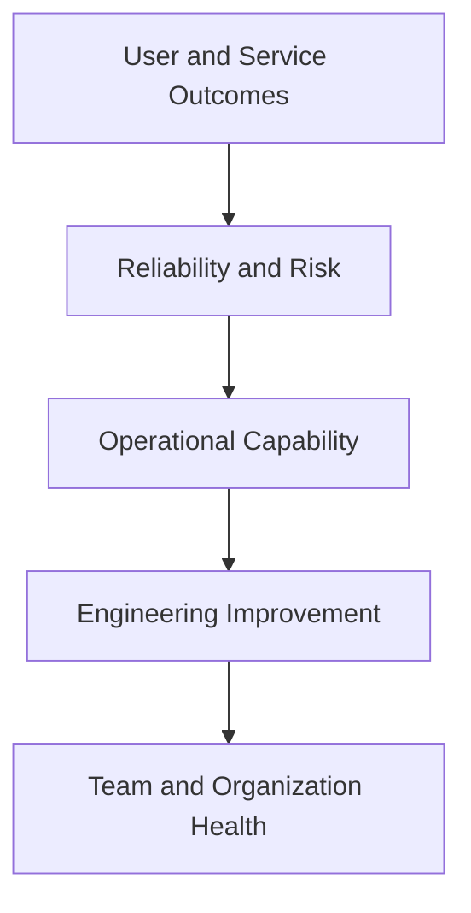

# Measuring SRE Success

> SRE succeeds when important services meet explicitly agreed reliability objectives, reliability risk becomes visible and controlled, recurring operational work is reduced, recovery becomes safer and more predictable, product teams retain production responsibility, and engineers can sustain the work without dependence on heroics.

## Section Purpose

Measuring SRE success is difficult because many visible activities are not outcomes.

An SRE team may create dashboards, automate tasks, close tickets, join incidents, publish postmortems, and deploy frequently while users continue to experience unreliable services. Another team may prevent severe incidents quietly, simplify systems, transfer capability to service owners, and reduce its own operational role. The second team can produce greater value while appearing less busy.

A useful measurement system must answer:

- Are important user journeys sufficiently reliable?
- Is reliability risk understood and controlled?
- Are incidents becoming less harmful and less repetitive?
- Can services recover within their objectives?
- Is change becoming safer?
- Is operational work sustainable?
- Is toil controlled?
- Does SRE retain time for lasting engineering work?
- Are service owners participating in production?
- Does reliability evidence change decisions?
- Is SRE creating capability beyond its own team?
- Does the value justify the cost and complexity?

This section explains how to design a balanced SRE measurement system. It covers service outcomes, SLIs, SLOs, error budgets, incidents, recovery, change, capacity, toil, on-call, engineering impact, organizational behavior, business context, scorecards, review cycles, data quality, anti-gaming controls, production scenarios, practical exercises, and assessment.

The objective is not to create the largest possible metric catalog. It is to create the smallest set of trusted measures that supports real decisions.

---

## Learning Objectives

After completing this section, you should be able to:

1. Define SRE success through outcomes instead of activity volume.
2. Build a measurement hierarchy that begins with users and services.
3. Distinguish leading indicators, lagging indicators, diagnostic signals, and decision metrics.
4. Measure SLO performance and error-budget consumption correctly.
5. Evaluate incident, recovery, change, capacity, toil, and on-call evidence.
6. Measure engineering impact without rewarding output alone.
7. Assess organizational and engagement health.
8. Connect reliability evidence to business risk without false precision.
9. Design scorecards that resist gaming and misleading aggregation.
10. Establish baselines, targets, review cycles, ownership, and verification.

---

## 1. Success Begins With the Service

SRE does not succeed because the SRE team is busy.

It succeeds when a defined service delivers its intended user outcomes within agreed reliability, risk, and sustainability boundaries.

The primary unit of measurement is therefore the service and its Critical User Journeys.

---

## 2. Activity, Output, Outcome, and Impact

| Level | Example |
| --- | --- |
| Activity | Engineer works on alert tuning |
| Output | Twenty alerts are removed or rerouted |
| Outcome | After-hours actionable page volume falls |
| Impact | Responders recover sleep, urgent pages receive faster attention, and service risk declines |

Measure outputs to understand delivery. Judge success through outcomes and impact.

---

## 3. The SRE Measurement Hierarchy

Lower layers explain how outcomes are produced. They should not replace the top layer.

---

## 4. A Balanced Success Model

Use evidence from six dimensions:

1. User and service reliability
2. Risk and resilience
3. Incident and operational performance
4. Engineering leverage
5. Human sustainability
6. Organizational effectiveness

Business impact provides context across all six.

---

## 5. No Single Metric Defines SRE Success

A single measure can be improved while the system worsens.

Examples:

- Incident count falls because reporting declines
- Mean recovery time improves because severe incidents are excluded
- Availability rises while correctness declines
- Ticket closure increases while toil grows
- Deployment frequency rises while error-budget burn accelerates

Use a small balanced set with explicit interpretation.

---

## 6. The Measurement Contract

Every important metric should define:

- Name
- Purpose
- Decision supported
- Owner
- Population
- Numerator and denominator where applicable
- Data source
- Calculation
- Window
- Segmentation
- Limitations
- Target or trigger
- Review frequency
- Response

This prevents one label from hiding different calculations.

---

## 7. Start With a Decision

Do not begin by collecting every available signal.

Begin with a decision such as:

- Should a release proceed?
- Which reliability project has priority?
- Is pager load sustainable?
- Can a service transfer to SRE?
- Did a recovery investment work?
- Should an SLO change?

Then identify the minimum evidence required.

---

## 8. Metric Types

| Type | Purpose | Example |
| --- | --- | --- |
| Outcome | Describes achieved service behavior | Checkout success ratio |
| Leading | Signals future risk | Capacity headroom |
| Lagging | Describes realized harm | SLO miss |
| Diagnostic | Helps explain behavior | Database connection saturation |
| Control | Triggers action | Error-budget burn rate |
| Health | Describes sustainability | After-hours pages per responder |

One metric can serve more than one type, but its intended use should be clear.

---

## 9. Leading and Lagging Indicators

Lagging indicators show what already happened:

- User-impact minutes
- Failed journeys
- Data loss
- Severe incidents

Leading indicators show conditions that may create future harm:

- Declining headroom
- Untested recovery
- Rising toil
- Open high-risk actions
- Growing dependency concentration

Strong reviews use both.

---

## 10. Measures and Metrics

A measure is a directly observed value. A metric is a defined calculation or interpretation using one or more measures.

Examples:

- Measure: 4,000 failed eligible requests
- Measure: 8,000,000 eligible requests
- Metric: 99.95 percent success ratio

The distinction helps teams inspect the underlying data.

---

## 11. Begin With Critical User Journeys

For each Critical User Journey, define:

- User
- Intent
- Start and end
- Eligible events
- Success
- Failure
- Timeliness
- Correctness
- Dependencies
- Owner

This provides the boundary for meaningful reliability measurement.

---

## 12. User-Centered Service Level Indicators

An SLI should represent an aspect of service behavior that matters to users or dependent systems.

Common dimensions include:

- Availability
- Latency
- Correctness
- Freshness
- Durability
- Coverage
- Quality
- Throughput completion

Choose dimensions according to the service's purpose.

---

## 13. Event-Based Success Ratio

A common SLI form is:

$$
\text{Success Ratio} = \frac{\text{Good Eligible Events}}{\text{Total Eligible Events}}
$$

For 9,995,000 successful events out of 10,000,000 eligible events:

$$
\text{Success Ratio} = 99.95\%
$$

Define both good and eligible precisely.

---

## 14. Time-Based Availability

For a service whose usefulness is meaningfully represented by time:

$$
\text{Availability} = \frac{\text{Eligible Time} - \text{Bad Time}}{\text{Eligible Time}}
$$

Time-based measurement can overstate reliability when demand varies greatly. Ten minutes during peak demand may harm more users than one hour overnight.

---

## 15. Request-Based Availability

Request-based availability measures the proportion of eligible interactions that succeed.

It often represents demand better than time, but it can miss:

- Requests that never reach the measurement point
- Abandoned attempts
- Client-side failure
- Suppressed traffic during outage
- Low-volume critical actions

State the measurement boundary.

---

## 16. Latency SLI

A latency SLI commonly measures the proportion of eligible events completed within a useful threshold.

$$
\text{Latency Success Ratio} = \frac{\text{Events Completed Within Threshold}}{\text{Total Eligible Events}}
$$

This form aligns naturally with error budgets and avoids relying only on averages.

---

## 17. Correctness SLI

Correctness asks whether the result is right, not merely returned.

Examples include:

- Orders created exactly once
- Account balances calculated correctly
- Authorized users admitted and unauthorized users rejected
- Reports containing complete data
- Messages delivered to the intended recipient

Correctness may require reconciliation, sampling, or delayed validation.

---

## 18. Freshness SLI

Freshness measures whether data or processing results are recent enough to remain useful.

Example:

$$
\text{Freshness Ratio} = \frac{\text{Results Newer Than Required Age}}{\text{Total Eligible Results}}
$$

A pipeline can be available and still unreliable because it serves stale data.

---

## 19. Durability SLI

Durability concerns whether committed data remains preserved and retrievable.

Durability evidence may include:

- Lost objects per committed objects
- Restore validation
- Corruption detection
- Reconciliation failures
- Backup coverage
- Recovery-point achievement

Claims with many nines require long periods, large populations, or defensible models.

---

## 20. Quality and Coverage SLIs

Some services provide degraded rather than binary results.

Measure whether:

- Search uses the complete eligible corpus
- Recommendations meet a quality floor
- Data processing covers all required sources
- Responses contain required fields
- A fallback preserves essential value

Define quality carefully to prevent convenient but useless success.

---

## 21. SLI Specification and Implementation

### Specification

The service behavior that should be measured, independent of the data source.

### Implementation

The actual method used to calculate it.

One specification may have several implementations with different coverage, accuracy, cost, and delay.

---

## 22. Measurement Point Matters

Possible measurement points include:

- Client
- Edge
- Load balancer
- Application
- Dependency
- Log pipeline
- Synthetic probe
- Reconciliation system

A backend may not see requests that fail before reaching it. Choose the point that best represents the decision and document blind spots.

---

## 23. Eligible Events

Define which events belong in the denominator.

Consider:

- Valid versus invalid requests
- Authorized versus unauthorized attempts
- Planned maintenance
- Test traffic
- Bot traffic
- Dependency-caused failure
- User cancellation
- Duplicate attempts

Exclusions must reflect the service promise, not protect the metric from bad results.

---

## 24. Good Events

A good event may require more than a status code.

For a payment journey, good may mean:

- Valid request accepted
- Authorization completed
- Charge recorded once
- Order created
- Durable confirmation returned within threshold

Define good at the outcome boundary.

---

## 25. Unknown Events

Telemetry gaps create events that cannot be classified confidently.

Do not silently treat unknown events as good.

Options include:

- Count them as bad when the risk warrants it
- Report them separately
- Exclude them with visible coverage loss
- Use another measurement source

The policy should be explicit.

---

## 26. Segmentation

Aggregate reliability can hide concentrated harm.

Review by relevant dimensions such as:

- Region
- Tenant
- User plan
- Client version
- Device
- Dependency path
- Request type
- Accessibility mode
- Critical journey

Avoid segmentation that exposes personal data or creates misleading small samples.

---

## 27. Tail Behavior

Averages conceal extreme but important outcomes.

For latency, examine:

- Threshold success ratios
- Percentiles
- Maximum useful delay
- Distribution by segment
- Long-tail contribution to failures

Do not use a percentile without explaining the population and window.

---

## 28. Service Level Objectives

An SLO defines a target for an SLI over a specified window.

Example:

> At least 99.9 percent of valid checkout attempts will create exactly one durable order and return confirmation within two seconds over a rolling 28-day window.

The statement identifies behavior, population, threshold, target, and window.

---

## 29. SLO Compliance

For a good-event ratio:

$$
\text{SLO Compliance} = \frac{\text{Good Events}}{\text{Eligible Events}}
$$

Compliance answers whether performance met the target. It does not explain why performance changed or whether the SLO represents every important user experience.

---

## 30. Error Budget

For an SLO target expressed as a percentage:

$$
\text{Error Budget Percentage} = 100\% - \text{SLO Target}
$$

For a 99.9 percent SLO, the budget is 0.1 percent of eligible events or eligible time during the window.

---

## 31. Error-Budget Events

If a service receives 20,000,000 eligible events under a 99.9 percent SLO:

$$
\text{Allowed Bad Events} = 20{,}000{,}000 \times 0.001 = 20{,}000
$$

The budget is calculated from the actual eligible population unless policy defines another method.

---

## 32. Error-Budget Consumption

$$
\text{Budget Consumption} = \frac{\text{Observed Bad Events}}{\text{Allowed Bad Events}}
$$

If 5,000 bad events occur against an allowance of 20,000, 25 percent of the budget has been consumed.

---

## 33. Remaining Error Budget

$$
\text{Remaining Budget} = 1 - \text{Budget Consumption}
$$

A negative value means the service has exceeded its allowance. Remaining budget alone does not show how quickly conditions are changing.

---

## 34. Burn Rate

Burn rate compares the observed error rate with the error rate allowed by the SLO.

$$
\text{Burn Rate} = \frac{\text{Observed Error Rate}}{\text{Allowed Error Rate}}
$$

A burn rate of 1 consumes the budget at exactly the sustainable rate for the full window. A burn rate of 10 consumes it ten times faster.

---

## 35. Burn Rate and Detection

High burn over a short period may require urgent action. Lower burn over a longer period may expose a persistent problem.

Multi-window alerting can detect both without paging on every small fluctuation.

Alert policy should define:

- Burn threshold
- Short window
- Long window
- Urgency
- Required action

---

## 36. Calendar and Rolling Windows

### Calendar Window

Resets at a defined time, such as the first day of the month.

### Rolling Window

Continuously evaluates the most recent period.

Calendar windows align with reporting periods but create reset effects. Rolling windows provide continuous context but can be harder to explain. Choose according to decisions.

---

## 37. SLO Target Quality

A good target is:

- Connected to user need
- Achievable under normal conditions
- Stricter than harmful external failure where appropriate
- Useful for decisions
- Supported by credible measurement
- Reviewed as the service changes

An impressive number that no one uses is not a successful SLO.

---

## 38. SLO Adoption

Measure whether SLOs are operational, not merely documented.

Evidence includes:

- Stakeholder approval
- Named owner
- Regular review
- Error-budget policy
- Release decisions influenced
- Reliability work prioritized
- Target refined using evidence

Counting SLO documents can reward empty adoption.

---

## 39. SLO Coverage

Coverage asks what proportion of important service behavior is represented by usable objectives.

Possible measures include:

- Critical journeys with approved SLOs
- Critical services with trusted SLIs
- External commitments backed by internal objectives
- SLOs with active owners and policies

Do not pursue 100 percent document coverage without considering value.

---

## 40. SLO Effectiveness

An effective SLO helps teams:

- Detect meaningful deterioration
- Prioritize work
- Evaluate risk
- Review launches
- Explain reliability
- Resolve disagreements

Measure examples where the SLO changed a decision, not only whether a dashboard exists.

---

## 41. Error-Budget Policy Effectiveness

Evaluate:

- Whether triggers are clear
- Whether owners act
- Whether exceptions are authorized
- Whether actions match risk
- Whether service performance recovers
- Whether teams manipulate measurement

A policy that is never applied is not an operating control.

---

## 42. Reliability Above the SLO

Performance above target may mean:

- The service is healthy
- The target is too weak
- Users receive valuable margin
- The service is overengineered
- Demand was unusually low
- Measurement misses failures

Do not automatically raise the target. Investigate user value, cost, risk, and measurement quality.

---

## 43. Reliability Below the SLO

An SLO miss should trigger analysis of:

- User impact
- Failure source
- Budget consumption pattern
- Recurrence
- Change contribution
- Dependency behavior
- Corrective options
- Risk acceptance

The response should follow agreed policy rather than blame.

---

## 44. SLOs Are Not the Entire Scorecard

SLOs may miss:

- Recovery readiness
- Low-frequency catastrophic risk
- Toil
- On-call health
- Technical debt
- Unmeasured segments
- Organizational ownership

Use supporting measures without weakening the primacy of service outcomes.

---

## 45. Incident Count

Incident count is useful for workload and pattern analysis, but interpretation is difficult.

An increase may mean:

- Reliability worsened
- Detection improved
- Reporting improved
- Severity thresholds changed
- Service scope grew

Always provide denominator, definition, and context.

---

## 46. Incident Rate

Normalize incidents against relevant exposure where possible:

- Per million eligible journeys
- Per deployment
- Per service-month
- Per peak event
- Per customer cohort

Normalization supports comparison but does not make different services equivalent.

---

## 47. Incident Severity

Severity should reflect consequences such as:

- User scope
- Journey criticality
- Duration
- Data integrity
- Safety
- Security
- Regulatory or contractual harm
- Operational interruption

Technical complexity alone should not determine severity.

---

## 48. User-Impact Minutes

A simple form is:

$$
\text{User-Impact Minutes} = \text{Affected Users} \times \text{Impact Duration}
$$

This can compare broad short events with narrow long events, but it treats all users and impact equally. Add severity and journey context.

---

## 49. Failed-Journey Volume

Count the eligible Critical User Journeys that failed or completed below quality requirements.

This often communicates impact more clearly than infrastructure downtime.

Preserve distinctions among failure, excessive latency, incorrect result, and abandonment.

---

## 50. Time to Detect

Time to detect measures from the beginning of meaningful impact to reliable detection.

Challenges include:

- Unknown impact start
- Gradual degradation
- Delayed data
- Disagreement about first evidence

Record method and uncertainty.

---

## 51. Time to Engage

Time to engage measures how long it takes for an appropriate responder to begin useful action after detection or page delivery.

It can expose routing, ownership, access, and staffing problems that acknowledgment time hides.

---

## 52. Time to Mitigate

Mitigation reduces user harm even if the underlying cause remains.

Examples include:

- Rollback
- Traffic shift
- Feature disablement
- Load shedding
- Dependency isolation

Measure from impact start or detection consistently and state the chosen boundary.

---

## 53. Time to Restore

Restoration returns the service to its required operating condition.

Do not declare restoration solely because internal metrics recover. Verify Critical User Journeys, data correctness, dependencies, and residual risk.

---

## 54. Time to Verify

Verification confirms that restoration is real and stable.

This stage may include:

- Synthetic journey success
- Data reconciliation
- Backlog drainage
- Dependency health
- Regional checks
- Customer confirmation

Separating verification prevents premature closure.

---

## 55. Recovery-Time Distribution

Averages can hide severe long incidents.

Review:

- Median
- Percentiles
- Maximum
- Distribution by severity
- Distribution by service
- Repeat failure modes

Use small samples carefully and show counts.

---

## 56. Recurrence Rate

Recurrence asks whether incidents arise from previously known failure modes or materially similar contributing conditions.

A high rate can indicate:

- Weak corrective actions
- Poor prioritization
- Symptom-only fixes
- Ownership gaps
- Insufficient engineering capacity

Define similarity through review, not automated labels alone.

---

## 57. Detection Source

Track whether incidents are first detected by:

- SLO alert
- Other monitoring
- Customer report
- Support
- Partner
- Engineer observation
- Provider notification

Customer-first detection of material harm may expose coverage gaps.

---

## 58. Escalation Quality

Useful measures include:

- Correct owner reached
- Escalation delay
- Number of unnecessary handoffs
- Required expertise available
- Vendor escalation success
- Decision authority available

Do not reward fast escalation that pages many irrelevant people.

---

## 59. Incident Role Effectiveness

Evaluate whether incident command, technical work, communication, and documentation were assigned and effective.

Use structured review and participant evidence. Avoid turning subjective feedback into individual ranking.

---

## 60. Communication Quality

Assess whether communications were:

- Timely
- Accurate
- Audience-appropriate
- Consistent
- Clear about uncertainty
- Updated at agreed intervals

Message count is not a quality metric.

---

## 61. Post-Incident Review Coverage

Track whether qualifying incidents receive the required level of review.

Coverage should account for:

- Severity
- Recurrence
- Novelty
- Learning value
- Near misses

Do not require large reports for every event.

---

## 62. Corrective-Action Completion

Measure accepted actions by:

- Priority
- Age
- Owner
- Completion
- Verification
- Risk reduced

Closing a ticket without verifying the service change is not completion.

---

## 63. Corrective-Action Effectiveness

Ask whether the action:

- Prevented recurrence
- Reduced likelihood
- Reduced blast radius
- Improved detection
- Improved mitigation
- Improved recovery

One incident can support several controls. One action need not eliminate every failure.

---

## 64. Near-Miss Evidence

A near miss is a condition that could have produced material harm but did not, often because of timing, luck, or a successful control.

Track near misses to learn before users are harmed. Avoid rewarding teams for suppressing or redefining them.

---

## 65. Recovery Time Objective

RTO defines the maximum acceptable time to restore a required capability after disruption.

Measure:

- Stated RTO
- Achieved recovery time
- Test conditions
- Scope restored
- Verification

Meeting an RTO in a tabletop exercise does not prove technical recovery.

---

## 66. Recovery Point Objective

RPO defines the maximum acceptable data-loss interval after disruption.

Measure:

- Stated RPO
- Achieved recovery point
- Data validation
- Missing or duplicated records
- Reconciliation effort

Replication delay is only one input.

---

## 67. Restore Success Rate

$$
\text{Restore Success Rate} = \frac{\text{Successful Verified Restores}}{\text{Total Restore Attempts}}
$$

Define a successful restore as usable, correct, authorized, and completed within relevant objectives.

---

## 68. Recovery Exercise Coverage

Measure whether critical failure modes are exercised across:

- Applications
- Data
- Regions
- Dependencies
- Access
- Control planes
- People
- Vendors

Counting exercises alone can hide narrow repetition.

---

## 69. Recovery Confidence

Confidence should be based on evidence quality.

| Evidence | Confidence contribution |
| --- | --- |
| Document exists | Low |
| Tabletop completed | Limited |
| Component restore tested | Moderate |
| End-to-end recovery verified | Strong |
| Repeated representative recovery | Stronger |

Confidence declines as systems, people, and dependencies change.

---

## 70. Failover and Failback

Measure both directions.

A service may shift traffic successfully but fail to:

- Preserve data consistency
- Restore full capacity
- Return safely
- Reconcile state
- Reestablish monitoring

Recovery is incomplete until stable operation is verified.

---

## 71. Change Failure Rate

Define the proportion of production changes that cause degraded service, incident response, rollback, hotfix, or other agreed failure condition.

$$
\text{Change Failure Rate} = \frac{\text{Failed Production Changes}}{\text{Eligible Production Changes}}
$$

Define an eligible change and failure consistently.

---

## 72. Change Risk Is Not Equal Across Deployments

A one-line configuration update and a regional data migration do not have equal risk.

Segment by:

- Change type
- Scope
- Reversibility
- Service criticality
- Deployment strategy
- Failure consequence

Avoid using one aggregate rate to compare unlike work.

---

## 73. Rollback Success

Measure whether rollback:

- Was available
- Started within required time
- Completed successfully
- Restored user outcomes
- Preserved data integrity
- Avoided secondary failure

Rollback existence is not rollback capability.

---

## 74. Progressive-Delivery Coverage

For appropriate services, assess whether changes use:

- Limited initial exposure
- Representative traffic
- Automated analysis
- Clear promotion criteria
- Abort criteria
- Verified rollback

Do not treat canary adoption percentage as success without outcome evidence.

---

## 75. Deployment Frequency

Deployment frequency can describe delivery capability and change exposure.

It does not independently prove SRE success. Interpret it with:

- SLO performance
- Change failures
- Batch size
- Recovery
- User value
- Operational load

The correct frequency depends on service context.

---

## 76. Change Lead Time

Lead time may reveal slow feedback, large batches, approval delay, or deployment friction.

SRE may reduce reliability-related delay through safer paths and evidence. Do not assign every product delivery delay to SRE.

---

## 77. Release Decision Quality

Assess whether decisions use:

- Current error budget
- Change risk
- Test evidence
- Rollback capability
- Business timing
- Security and data constraints
- Authorized exceptions

Decision quality cannot be reduced to whether the release succeeded once.

---

## 78. Capacity Headroom

$$
\text{Headroom} = \frac{\text{Safe Capacity} - \text{Current Demand}}{\text{Safe Capacity}}
$$

Safe capacity should reflect tested operating limits, dependencies, redundancy loss, and scaling delay.

---

## 79. Time to Exhaustion

Forecast when demand will reach a meaningful capacity limit under stated assumptions.

Include:

- Growth range
- Seasonality
- Planned launches
- Scaling lead time
- Quotas
- Dependency limits

Forecast error should be measured and used to improve the model.

---

## 80. Demand Forecast Accuracy

Compare forecast and observed demand at relevant horizons.

Accuracy matters because both underestimation and overestimation create cost or reliability consequences. Do not punish honest uncertainty. Improve inputs and ranges.

---

## 81. Overload Behavior

Success during overload may mean preserving critical work, not serving all demand.

Measure:

- Protected journeys
- Rejected low-priority work
- Queue growth
- Recovery after overload
- Fairness
- Data integrity
- Time to shed load

Graceful degradation should be defined before overload.

---

## 82. Dependency Reliability

Track dependency contribution to service-level failure, but do not automatically exclude it from the user SLI.

Users experience the complete service. Internal attribution supports engineering and vendor decisions.

---

## 83. Dependency Budget Allocation

An end-to-end SLO may require tighter internal objectives for contributing dependencies.

Budget allocation should consider:

- Serial dependencies
- Parallel paths
- Retry behavior
- Shared failure
- Fallback
- Criticality

Simple multiplication may not represent conditional behavior accurately.

---

## 84. Concentration Risk

Measure reliance on shared providers, regions, control planes, identities, or experts.

Useful evidence includes:

- Critical journeys per dependency
- Services per failure domain
- Alternatives
- Tested isolation
- Recovery lead time

Low incident history does not eliminate concentration risk.

---

## 85. Toil Measurement

Measure work that is commonly manual, repetitive, automatable, tactical, service-related, and growing with demand.

Record:

- Task
- Service
- Frequency
- Duration
- Interruptions
- Risk
- Growth
- Owner

Do not classify all operations as toil.

---

## 86. Toil Percentage

$$
\text{Toil Percentage} = \frac{\text{Time Spent on Toil}}{\text{Total Relevant Work Time}} \times 100
$$

Define the denominator. Excluding meetings, training, leave, or overhead can make percentages incomparable.

---

## 87. Toil Volume and Toil Rate

### Volume

Total hours or task count during the period.

### Rate

Toil normalized by demand, service, or engineer capacity.

Volume may rise during growth while the rate improves. Both views matter.

---

## 88. Toil Distribution

Average team toil can hide unequal burden.

Review by:

- Engineer level
- Location
- Rotation
- Service
- Time of day
- Task type

Protect privacy and avoid individual performance ranking.

---

## 89. Toil Reduction

Measure before and after an intervention:

- Human time
- Frequency
- Failure risk
- Variance
- Interruptions
- Demand growth

Confirm that work disappeared or became safer, rather than moving to another team.

---

## 90. Automation Impact

Evaluate automation through:

- Toil removed
- Risk reduced
- Recovery improved
- Capacity increased
- Variance reduced
- New failure modes
- Maintenance cost
- Adoption

Script count is not an impact measure.

---

## 91. Engineering Capacity

Track the proportion of capacity spent on lasting improvement, including:

- Software
- Architecture
- Automation
- Reliability design
- Testing
- Capacity engineering
- Recovery
- Simplification

The exact target depends on the operating model. The core requirement is that operations cannot consume all capacity.

---

## 92. Engineering Work Completion

Completion should require:

- Delivered capability
- Adoption where needed
- Operational readiness
- Verification
- Ownership
- Documentation

Merged code alone may not create production value.

---

## 93. Engineering Leverage

Engineering leverage describes enduring improvement produced per unit of effort.

Examples include:

- One platform control protects many services
- One automation removes recurring work
- One design pattern limits common blast radius
- One training program enables service owners

Do not force all value into one financial number.

---

## 94. Reliability Project Impact

For each significant project, define:

1. Baseline problem.
2. Target service outcome.
3. Expected mechanism.
4. Leading indicators.
5. Lagging indicators.
6. Risks and side effects.
7. Verification date.

This supports learning when expected impact does not occur.

---

## 95. Risk Reduction

Reliability projects may reduce:

- Failure likelihood
- User scope
- Duration
- Data loss
- Detection delay
- Recovery uncertainty
- Human exposure

State which part of the risk changes. Avoid claiming that risk is eliminated.

---

## 96. Technical Debt Reduction

Debt count alone is weak because items vary greatly.

Measure whether the work improves:

- Change safety
- Operability
- Reliability
- Capacity
- Security
- Recovery
- Cognitive load

Tie debt reduction to an explicit consequence or capability.

---

## 97. Simplicity

Possible evidence of improved operational simplicity includes:

- Fewer failure paths
- Fewer manual decisions
- Reduced dependency depth
- Faster diagnosis
- Smaller change scope
- Easier recovery
- Reduced knowledge concentration

Technology count alone does not define simplicity.

---

## 98. Operational Knowledge Distribution

Measure whether service knowledge is shared through:

- Rotation participation
- Runbook use
- Incident shadowing
- Recovery exercises
- Design reviews
- Training
- Successful response without a specific expert

Avoid tests that reward memorization rather than capability.

---

## 99. Runbook Effectiveness

Evaluate runbooks through actual use and exercises.

Evidence includes:

- Correct trigger
- Successful action
- Time saved
- Safe escalation
- Verification completed
- Stale steps identified
- Owner and review date

Document count is insufficient.

---

## 100. On-Call Page Volume

Track pages by:

- Service
- Alert
- Time
- Severity
- Actionability
- Responder
- Outcome

Normalize by rotation size and demand where helpful.

---

## 101. Pages Per Shift

Pages per shift can expose overload and interrupted sleep.

Review distribution, not only average. One quiet week does not make a rotation healthy if peak shifts are unsafe.

---

## 102. After-Hours Pages

After-hours pages create different human cost from business-hours alerts.

Measure:

- Pages per responder
- Sleep interruptions
- Consecutive disturbed nights
- Time engaged
- Recovery time provided

Use aggregate data responsibly and protect individual privacy.

---

## 103. Actionability

$$
\text{Actionability Ratio} = \frac{\text{Pages Requiring Timely Human Action}}{\text{Total Pages}}
$$

Define timely action and verify through review. A high ratio does not prove the total volume is sustainable.

---

## 104. Page Precision and Coverage

### Precision

How many pages represent conditions that require urgent action?

### Coverage

How many urgent user-impacting conditions produce an appropriate page?

Removing all pages improves precision superficially while destroying coverage.

---

## 105. Acknowledgment and Useful Engagement

Fast acknowledgment can be automated or superficial.

Measure whether a qualified responder begins useful investigation and mitigation. Separate delivery, acknowledgment, engagement, and action.

---

## 106. Escalation Load

Track:

- Escalations per incident
- Time to correct owner
- Repeated specialist escalation
- Unavailable secondary responders
- Cross-team handoffs

High escalation can expose missing knowledge, authority, routing, or staffing.

---

## 107. On-Call Sustainability

Combine operational and human evidence:

- Page frequency
- After-hours disruption
- Shift length
- Incident duration
- Rotation size
- Recovery time
- Burnout signals
- Attrition
- Willingness to remain in rotation

No individual metric can prove sustainability.

---

## 108. Team Health Evidence

Use confidential surveys, interviews, workload data, retention, and observed behavior.

Ask whether engineers:

- Can focus
- Feel safe reporting risks
- Receive recovery after incidents
- Have growth opportunities
- Trust escalation
- Can refuse unsafe work

Do not expose individual responses.

---

## 109. Burnout Is Not a Personal Resilience Metric

Burnout can reflect workload, control, support, fairness, sleep, and organizational conflict.

Do not measure it to identify weak individuals. Use it to improve the operating system and work design.

---

## 110. Attrition and Rotation Exit

Track why engineers leave the team or pager rotation.

Possible signals include:

- Unsustainable pages
- Limited engineering work
- Weak career path
- Role ambiguity
- Conflict with service owners
- Compensation issues

Protect confidentiality and avoid causal claims from small samples.

---

## 111. Service Ownership Health

Evidence includes:

- Named accountable owner
- Current ownership record
- Incident participation
- Corrective-work ownership
- SLO decisions
- Dependency management
- Lifecycle planning

Ownership is capability, not catalog coverage alone.

---

## 112. Product-Team Participation

Measure whether product and development teams:

- Join reliability reviews
- Participate in incidents
- Prioritize corrective work
- Maintain instrumentation
- Share on-call where agreed
- Include SRE in design
- Act on error-budget policy

Participation should lead to decisions and action.

---

## 113. Decision Latency

Reliability work may stall because no authorized owner decides.

Measure time required to resolve:

- SLO approval
- Risk acceptance
- Release exceptions
- Incident actions
- Recovery declarations
- Reliability investment

Separate necessary evaluation from avoidable organizational delay.

---

## 114. Reliability Work Acceptance

Track whether high-priority reliability work enters product plans and completes.

Interpretation should consider capacity, alternative controls, and authorized risk decisions. Acceptance is not the same as doing every SRE recommendation.

---

## 115. Engagement Health

For an SRE-service partnership, assess:

- Shared goals
- Responsibility clarity
- Communication
- SLO agreement
- Operational workload
- Engineering commitments
- Conflict resolution
- Exit conditions

Use evidence from both teams.

---

## 116. Onboarding Success

Successful onboarding means the service meets agreed entry conditions and both teams can perform their responsibilities.

Measure:

- Readiness gaps closed
- Knowledge transferred
- Alerts validated
- Recovery tested
- SLOs adopted
- Pager transfer completed safely

Speed alone is not success.

---

## 117. Handback Success

Handback succeeds when responsibility transfers safely with:

- Clear ownership
- Knowledge
- Access
- Pager coverage
- Risk record
- Communication
- Verification

Avoid measuring success as services retained by SRE forever.

---

## 118. Consulting Impact

Measure whether consulting produces:

- Implemented changes
- Capability transfer
- Risk reduction
- Reusable practices
- Independent service-team operation

Reports and recommendations are outputs, not final outcomes.

---

## 119. Reliability Practice Adoption

Adoption should be demonstrated through use.

Examples include:

- SLO influences a release
- Runbook succeeds in an exercise
- Error-budget policy changes priority
- Postmortem action reduces recurrence
- Capacity model prevents saturation

Counting templates filled out can reward compliance without capability.

---

## 120. Organizational Learning

Evidence of learning includes:

- Similar services adopt a control
- Repeated failure patterns decline
- Standards change after incidents
- Training reflects production evidence
- Architecture reviews use prior lessons
- Near misses produce preventive work

Learning should travel beyond the team that experienced the event.

---

## 121. Business Context

Reliability evidence should connect to consequences such as:

- Revenue
- Customer trust
- Contractual commitments
- Safety
- Regulatory obligations
- Operational continuity
- Employee productivity

SRE supplies service evidence. Authorized owners interpret and accept business risk.

---

## 122. Cost of Unreliability

Possible components include:

- Lost transactions
- Delayed revenue
- Support demand
- Recovery labor
- Penalties
- Customer credits
- Churn risk
- Data repair
- Partner impact

Use ranges and assumptions. Many effects cannot be measured precisely.

---

## 123. Cost of Reliability

Include:

- Engineering time
- Additional capacity
- Redundancy
- Tools
- Testing
- Operational staffing
- Complexity
- Slower or constrained delivery

Reliability above user need can consume resources without proportional value.

---

## 124. Reliability Investment Return

A simplified comparison is:

$$
\text{Net Expected Value} = \text{Expected Loss Avoided} - \text{Investment Cost}
$$

This can guide discussion but should not hide nonfinancial harm, uncertainty, tail risk, or ethical obligations.

---

## 125. Revenue Is Not the Only Value

Some services protect:

- Safety
- Rights
- Trust
- Legal compliance
- Data integrity
- Public access
- Employee capability

Do not deprioritize them because revenue attribution is difficult.

---

## 126. Customer Support Evidence

Support contacts can reveal:

- Unmeasured failure
- Confusing degraded modes
- Segment-specific harm
- Recovery problems
- Trust loss

Normalize by user volume and account for changes in support channels and classification.

---

## 127. Customer Sentiment

Sentiment can provide context but should not replace service evidence.

Responses may be delayed, selective, and influenced by factors beyond reliability. Use it with journey, incident, and support data.

---

## 128. Productivity Impact

For internal services, measure consequences such as:

- Blocked work
- Delayed deployments
- Failed builds
- Manual workaround time
- Access delay
- Lost data

Avoid assuming that every minute of outage produces equal lost productivity.

---

## 129. Metric Ownership

Every important metric needs an owner responsible for:

- Definition
- Data quality
- Change control
- Review
- Interpretation
- Retirement

Metric ownership does not mean the owner controls the underlying service outcome alone.

---

## 130. Data Provenance

Record where data originates, how it is transformed, and where it can fail.

Include:

- Source system
- Collection method
- Sampling
- Aggregation
- Delay
- Retention
- Transformation
- Access control

Reliability metrics have their own reliability requirements.

---

## 131. Data Completeness

Measure whether expected data arrived across the period and population.

Missing data during incidents is especially dangerous because it can make reliability appear better when systems fail.

---

## 132. Data Freshness

A decision metric must arrive within the time needed for action.

A monthly report cannot support a release decision today. Define acceptable measurement delay and stale-data behavior.

---

## 133. Data Accuracy

Validate calculated metrics against independent evidence such as:

- Raw events
- Synthetic tests
- Client telemetry
- Reconciliation
- Incident timelines
- Support reports

Investigate disagreement instead of selecting the preferred result.

---

## 134. Metric Definition Changes

Version metric definitions.

Record:

- Change date
- Reason
- Old and new logic
- Historical comparability
- Expected effect
- Approver

Do not present a trend across incompatible definitions without disclosure.

---

## 135. Missing Data Policy

Define how missing data affects:

- SLO calculation
- Alerts
- Reports
- Release decisions
- Incident declaration

The policy should reflect risk. Silent omission encourages false confidence.

---

## 136. Sample Size

Small populations create unstable percentages.

Always show counts beside ratios where practical. A 50 percent failure rate based on two events differs from the same rate across two million events.

---

## 137. Statistical Uncertainty

Observed performance is an estimate of underlying behavior.

Use confidence intervals, ranges, or clear uncertainty statements where sampling and low event counts matter. Do not display unnecessary decimal precision.

---

## 138. Seasonality

Reliability, demand, and incident behavior can change by:

- Hour
- Day
- Month
- Business cycle
- Holiday
- Launch
- Regulatory period

Compare equivalent periods and keep peak risk visible.

---

## 139. Baselines

A baseline describes current behavior before an intervention.

It should include:

- Time window
- Population
- Definition
- Data quality
- Significant events
- Known confounders

Without a baseline, improvement claims are difficult to verify.

---

## 140. Targets

Targets should be:

- Connected to a decision
- Supported by evidence
- Time-bounded
- Owned
- Achievable without unsafe behavior
- Reviewed

Targets should not become quotas that encourage metric manipulation.

---

## 141. Thresholds and Triggers

A threshold becomes useful when it defines an action.

Document:

- Value
- Window
- Severity
- Owner
- Required response
- Exception
- Reset condition

Color alone is not governance.

---

## 142. Benchmarks

External benchmarks can provide context, but services differ in architecture, users, criticality, workload, and measurement definitions.

Use benchmarks to ask questions, not to copy targets blindly.

---

## 143. Trend Analysis

Review direction, rate of change, and variation.

Ask:

- Is the shift sustained?
- Did definition change?
- Did demand change?
- Did one event dominate?
- Which segments changed?
- Does another metric confirm it?

Trend interpretation should lead to investigation or decision.

---

## 144. Correlation Is Not Causation

Reliability may improve after a project for unrelated reasons such as lower traffic, fewer releases, or provider improvement.

Use mechanism, timing, comparison, experiments, and multiple evidence sources before claiming causality.

---

## 145. Counterfactual Reasoning

Ask what likely would have happened without the intervention.

Possible evidence includes:

- Similar untreated services
- Historical recurrence
- Controlled rollout
- Failure simulation
- Capacity model
- Expert review

State uncertainty rather than inventing precise avoided losses.

---

## 146. Goodhart's Law

When a measure becomes a target, people may change behavior to improve the number rather than the intended outcome.

Examples include:

- Reclassifying incidents
- Excluding failed requests
- Closing actions without verification
- Suppressing alerts
- Avoiding deployments

Use balanced measures, review definitions, and preserve learning culture.

---

## 147. Anti-Gaming Controls

Controls include:

- Stable definitions
- Independent data sources
- Raw counts beside ratios
- Qualitative review
- Segmentation
- Audit trails
- No individual ranking from team reliability metrics
- Periodic metric retirement

Design incentives before attaching rewards or penalties.

---

## 148. Vanity Metrics

Common vanity metrics include:

- Dashboards created
- Scripts written
- Alerts added
- Tickets closed
- Postmortem pages written
- Meetings held
- Tools deployed

These may describe outputs. They require a clear path to service or operational impact.

---

## 149. Metric Overload

Too many measures create:

- Conflicting priorities
- Review fatigue
- High maintenance
- Weak ownership
- Selective interpretation

Retain diagnostic depth, but keep decision scorecards small.

---

## 150. Metric Retirement

Retire a metric when:

- It no longer supports a decision
- The service changed
- The definition is misleading
- A better measure exists
- Collection cost exceeds value
- It encourages harmful behavior

Record why it was retired and how historical reporting changes.

---

## 151. Scorecard Design

A practical scorecard can contain:

| Dimension | Primary question |
| --- | --- |
| User reliability | Are Critical User Journeys meeting objectives? |
| Risk | Are serious failure modes controlled? |
| Incidents | Is harm and recurrence declining? |
| Recovery | Can the service recover within objectives? |
| Engineering | Are improvements producing verified leverage? |
| Sustainability | Are toil and on-call healthy? |
| Ownership | Are partners making and executing decisions? |

Each item should link to deeper evidence.

---

## 152. Red, Amber, and Green Status

Color can summarize state, but define it numerically and operationally.

For every status, specify:

- Conditions
- Evidence freshness
- Owner
- Required action
- Escalation

Green should never mean no investigation is needed anywhere.

---

## 153. Confidence Status

Show confidence separately from performance.

A service can report green performance with low confidence because telemetry coverage is weak. It can report poor performance with high confidence because the evidence is strong.

This distinction prevents unknown conditions from appearing healthy.

---

## 154. Service Review Cadence

Review frequency should match risk and decision speed.

Examples include:

- Continuous alerting for fast burn
- Weekly operational review
- Monthly SLO review
- Quarterly risk and investment review
- Annual objective and recovery review

Avoid meetings that repeat dashboards without decisions.

---

## 155. Weekly Operational Review

Possible agenda:

1. Current SLO and burn state.
2. Significant incidents and near misses.
3. Capacity risks.
4. Page and toil exceptions.
5. Change risks.
6. Decisions and owners.

Keep detailed investigations outside the meeting when possible.

---

## 156. Monthly Reliability Review

Examine:

- SLO performance and segments
- Error-budget use
- Incident patterns
- Corrective-action effectiveness
- Recovery evidence
- Reliability project impact
- Toil and on-call health
- Upcoming risks

Record decisions, not only observations.

---

## 157. Quarterly SRE Review

Evaluate:

- Service portfolio
- Engagement health
- Engineering roadmap
- Risk reduction
- Staffing and sustainability
- Cross-team capability
- Funding
- Onboarding and handback
- Metric quality

This is broader than one service's operational review.

---

## 158. Executive Reliability Reporting

Executives need concise evidence about:

- Critical service outcomes
- Material risk
- Customer and business consequences
- Recovery confidence
- Investment decisions
- Accepted residual risk
- Ownership

Avoid presenting infrastructure detail without decision relevance.

---

## 159. Engineering Reporting

Engineers need enough detail to act:

- Failure modes
- Segments
- Dependencies
- Change attribution
- Capacity
- Telemetry limitations
- Corrective options

Use one evidence base with audience-appropriate views.

---

## 160. Narrative With Numbers

A strong review explains:

1. What changed.
2. Which users were affected.
3. Why it matters.
4. What evidence supports the claim.
5. What is uncertain.
6. What decision is required.
7. Who owns the action.

Numbers without interpretation can obscure rather than clarify.

---

## 161. Measuring an SRE Team Versus a Service

A service outcome is shared across product, application, platform, security, and SRE decisions.

Do not assign all service failure to SRE performance. Evaluate the team's contribution, authority, scope, engineering outcomes, operational health, and partner conditions.

---

## 162. Team-Level Measures

Useful team-level evidence may include:

- Supported service outcomes
- Engineering capacity
- Toil and page load
- Project impact
- Engagement health
- Knowledge distribution
- Onboarding and handback quality
- Team health

Avoid ranking individual engineers by incidents or pages.

---

## 163. Individual Performance

Service reliability is a system outcome and should not be mechanically assigned to an individual.

Individual evaluation may consider:

- Technical contribution
- Judgment
- Learning
- Collaboration
- Ownership
- Mentoring
- Risk communication

Use contextual evidence and protect psychological safety.

---

## 164. Comparing SRE Teams

Teams support different services, risks, workloads, and maturity levels.

Direct league tables can punish teams that accept difficult services or report incidents honestly. Compare definitions and context before drawing conclusions.

---

## 165. Measuring Prevention

Prevention is difficult because the avoided event is not observed.

Use:

- Control tests
- Failure experiments
- Near-miss evidence
- Historical recurrence
- Before-and-after exposure
- Reduced blast radius
- Independent review

State counterfactual uncertainty.

---

## 166. Measuring Reliability Culture

Culture is visible through behavior:

- Risks are reported early
- SLO evidence changes decisions
- Incidents produce learning
- Teams share ownership
- Engineers can stop unsafe work
- Hero dependence declines
- Leaders accept explicit tradeoffs

Survey statements alone are insufficient.

---

## 167. Measuring Maturity

Maturity models can structure discussion across ownership, objectives, incidents, recovery, toil, and engineering.

Do not assume every service must reach the highest level. Required maturity should match criticality, risk, and value.

---

## 168. Measuring Improvement, Not Conformance

Conformance asks whether a standard was followed. Improvement asks whether the service became safer or more sustainable.

Both can matter. Do not let checklist completion replace outcome verification.

---

## 169. Common Failure: Measuring What Is Easy

Easy measures include CPU, ticket counts, and deployment volume.

Important questions such as correctness, recovery confidence, and user harm may require additional engineering. Difficulty does not make them optional.

---

## 170. Common Failure: Measuring Only Availability

Availability can improve while latency, correctness, freshness, or durability worsens.

Measure the dimensions required by the service outcome.

---

## 171. Common Failure: Ignoring Small User Segments

Aggregate SLOs can remain healthy while one region, tenant, or client version fails.

Segment by meaningful risk and establish safeguards for small but critical groups.

---

## 172. Common Failure: Rewarding Low Incident Counts

Teams may underreport, downgrade, or avoid detecting incidents.

Reward learning quality, risk reduction, and truthful evidence instead.

---

## 173. Common Failure: Ranking Responders by Speed

Fast action can be unsafe. Difficult incidents may require careful diagnosis.

Review decision quality, coordination, mitigation, verification, and system improvement. Do not create individual leaderboards.

---

## 174. Common Failure: Closing Actions Without Verification

An action is not complete because code merged or a ticket closed.

Confirm the control exists, operates, and changes the intended risk or capability.

---

## 175. Common Failure: Counting Automation

Automation count encourages many small scripts and hides maintenance cost.

Measure verified reduction in toil, risk, variance, or recovery time.

---

## 176. Common Failure: Hiding Cost

Reliability gains can depend on excessive capacity, responder labor, or growing complexity.

Report the resources and human effort required to sustain the outcome.

---

## 177. Common Failure: Ignoring Unknown Risk

No recorded incident does not prove safety.

Track untested recovery, missing telemetry, unowned dependencies, and low-frequency severe failure modes.

---

## 178. Common Failure: Comparing Incompatible Windows

Do not compare:

- Rolling and calendar periods
- Peak and normal seasons
- Different SLI definitions
- Different service populations
- Partial and complete data

Disclose changes and rebuild comparable history where practical.

---

## 179. Common Failure: Metrics Without Owners

Unowned metrics become stale, disputed, or silently wrong.

Assign definition, data quality, review, and retirement responsibilities.

---

## 180. Common Failure: Reviews Without Decisions

A report has little operational value if no one can:

- Prioritize work
- Accept risk
- Change a target
- Restrict unsafe change
- Fund improvement
- Assign ownership

Invite decision owners and record outcomes.

---

## 181. Production Scenario: Ticket Closure Looks Successful

### Situation

An SRE team increases monthly ticket closure by 40 percent. Ticket intake rises by 60 percent, toil reaches 75 percent of capacity, and recurring restart requests continue.

### Analysis

Output increased while the operating system worsened.

### Better Measures

- Recurring demand by source
- Toil percentage
- Engineering capacity
- Work removed permanently
- Service reliability
- Queue age

---

## 182. Production Scenario: Availability Hides Incorrect Payments

### Situation

A payment API reports 99.99 percent availability because it returns HTTP 200. A reconciliation process finds duplicate charges affecting 0.2 percent of transactions.

### Analysis

The SLI measures reachability, not payment correctness.

### Better Measures

Define good payments as authorized, recorded exactly once, reconciled, and confirmed within the required time.

---

## 183. Production Scenario: Incident Count Increases

### Situation

Incident count doubles after the organization introduces clearer severity criteria and easier reporting. User-impact minutes decline by 35 percent.

### Analysis

The count increase may represent improved visibility while harm declines.

### Better Measures

Review definition change, severity, user impact, detection source, recurrence, and reporting behavior together.

---

## 184. Production Scenario: Mean Recovery Time Improves

### Situation

Mean recovery time falls from 50 to 20 minutes after the team includes hundreds of minor alerts as incidents. The two severe outages each last six hours.

### Analysis

The average is distorted by population change and hides tail severity.

### Better Measures

Report counts, severity groups, distributions, user-impact duration, and maximum recovery time.

---

## 185. Production Scenario: Error Budget Is Green

### Situation

A service has 60 percent of its monthly budget remaining. During the last hour, a dependency failure produces a burn rate of 50.

### Analysis

Remaining budget hides rapid current deterioration.

### Better Measures

Use short and long burn windows with an urgent response tied to the policy.

---

## 186. Production Scenario: Automation Moves Toil

### Situation

SRE automates certificate renewal and reports 300 hours saved. The automation fails weekly, and the security team now spends 25 hours each week investigating incorrect renewals.

### Analysis

Work moved and new risk appeared.

### Better Measures

Measure total cross-team effort, failure rate, security impact, recovery, maintenance, and net time saved.

---

## 187. Production Scenario: Recovery Test Passes

### Situation

A database restore finishes within RTO, but application validation later finds missing records and unusable credentials.

### Analysis

Component restoration is not verified service recovery.

### Better Measures

Include end-to-end journey validation, data reconciliation, access, dependencies, achieved RPO, and stable operation.

---

## 188. Production Scenario: Low Page Average

### Situation

The team averages two pages per shift. One engineer receives 20 pages during every monthly batch window, while most shifts remain quiet.

### Analysis

The average hides concentrated harm and predictable overload.

### Better Measures

Review distribution, time, service, sleep interruption, responder load, and batch-window controls.

---

## 189. Production Scenario: SLO Coverage Reaches 100 Percent

### Situation

Every service has an SLO document, but half have no owner, stale data, or no policy consequence.

### Analysis

Document coverage is mistaken for operational adoption.

### Better Measures

Measure trusted SLIs, approved objectives, active ownership, policy use, and decisions changed.

---

## 190. Production Scenario: Reliability Improves Through a Freeze

### Situation

Incidents decline after all production changes stop for three months. Security patches and necessary product changes accumulate.

### Analysis

Short-term reliability improved by increasing other risks and future batch size.

### Better Measures

Review reliability, change capability, security exposure, backlog, batch size, and sustainable operating state.

---

## 191. Practical Exercise: Build a Measurement Contract

Choose one reliability metric and document:

1. Purpose.
2. Decision.
3. Owner.
4. Population.
5. Calculation.
6. Data source.
7. Window.
8. Segments.
9. Limitations.
10. Action threshold.

Ask another engineer to reproduce it.

---

## 192. Practical Exercise: Design a User-Centered SLI

Choose a Critical User Journey and define:

- Eligible events
- Good events
- Required quality
- Time threshold
- Measurement point
- Missing-event policy
- Segmentation
- Validation source

Compare it with the existing infrastructure metrics.

---

## 193. Practical Exercise: Calculate an Error Budget

A service has:

- 99.95 percent SLO
- 12,000,000 eligible events
- 9,000 bad events

Calculate:

1. Allowed error percentage.
2. Allowed bad events.
3. Budget consumption.
4. Remaining budget.

Then explain which additional evidence is needed before a release decision.

---

## 194. Practical Exercise: Review Incident Metrics

Take ten incidents and record:

- Severity
- Failed journey
- User impact
- Detection source
- Detection time
- Mitigation time
- Restore time
- Verification time
- Recurrence
- Change contribution

Compare conclusions from the full evidence with conclusions from incident count alone.

---

## 195. Practical Exercise: Measure Recovery

Run or review a representative recovery exercise.

Record:

- Failure model
- Declared RTO and RPO
- Actual start
- Detection
- Decision time
- Restore time
- Achieved recovery point
- Journey verification
- Data reconciliation
- Failback

State confidence and remaining gaps.

---

## 196. Practical Exercise: Build a Toil Baseline

For four weeks, record toil by task, service, duration, frequency, interruption, risk, and responder.

Calculate:

- Total toil hours
- Toil percentage
- Distribution
- Highest growth source
- Highest risk source
- Best engineering candidate

Define how impact will be verified after improvement.

---

## 197. Practical Exercise: Audit On-Call Health

Review twelve weeks of:

- Pages per shift
- After-hours pages
- Actionability
- Time engaged
- Escalations
- Consecutive disruptions
- Rotation size
- Recovery time
- Responder feedback

Identify averages that hide extreme burden.

---

## 198. Practical Exercise: Evaluate a Reliability Project

Choose one completed project and document:

1. Baseline.
2. Intended mechanism.
3. Output.
4. Outcome.
5. User impact.
6. New risk.
7. Maintenance cost.
8. Confidence in causality.
9. Next review.

Do not count delivery alone as success.

---

## 199. Practical Exercise: Find a Gaming Risk

Select one team target and ask:

- How could the number improve while the system worsens?
- Which exclusions could be manipulated?
- Who controls classification?
- Which balancing measure is needed?
- Which qualitative review is required?

Revise the target and incentives.

---

## 200. Practical Exercise: Build an SRE Scorecard

Create one page containing no more than two primary measures for each of:

- User reliability
- Risk and recovery
- Incidents
- Engineering impact
- Toil and on-call
- Ownership and engagement

For every measure, include state, trend, confidence, owner, and next decision.

---

## 201. Practical Exercise: Run a Reliability Review

Use the scorecard to conduct a review.

Record:

- Evidence
- Interpretation
- Uncertainty
- Decision
- Owner
- Deadline
- Verification

Remove agenda items that produce no decision, learning, or escalation.

---

## 202. SRE Success Measurement Checklist

### Purpose

- [ ] Every primary metric supports a decision.
- [ ] Success is defined through outcomes, not activity alone.
- [ ] The measurement set is small enough to govern.
- [ ] Business and user context is explicit.

### Service Reliability

- [ ] Critical User Journeys are identified.
- [ ] SLIs represent meaningful behavior.
- [ ] Eligible and good events are defined.
- [ ] SLO targets and windows are explicit.
- [ ] Error-budget consumption and burn rate are understood.
- [ ] Important segments are visible.

### Incidents and Recovery

- [ ] Incident definitions are stable.
- [ ] User impact and severity are measured.
- [ ] Detection, mitigation, restoration, and verification are separated.
- [ ] Recurrence is reviewed.
- [ ] Corrective actions require verification.
- [ ] RTO and RPO are tested.

### Change and Capacity

- [ ] Change failures are defined and segmented.
- [ ] Rollback capability is verified.
- [ ] Release decisions use reliability evidence.
- [ ] Capacity headroom and exhaustion risk are tracked.
- [ ] Overload behavior is measured.

### Engineering Impact

- [ ] Engineering capacity is protected and measured.
- [ ] Projects have baselines and expected mechanisms.
- [ ] Automation is measured through impact.
- [ ] Risk reduction is explicit.
- [ ] New complexity and maintenance cost are included.

### Toil and On-Call

- [ ] Toil is defined consistently.
- [ ] Volume, percentage, rate, and distribution are reviewed.
- [ ] Page volume and actionability are measured.
- [ ] After-hours burden is visible.
- [ ] Team health and privacy are protected.

### Organization

- [ ] Service ownership is measured as capability.
- [ ] Product-team participation is visible.
- [ ] SLO evidence changes decisions.
- [ ] Engagement health is reviewed from both sides.
- [ ] Learning spreads beyond individual incidents.

### Data Quality

- [ ] Metric ownership is assigned.
- [ ] Provenance, completeness, freshness, and accuracy are known.
- [ ] Missing-data policy exists.
- [ ] Definition changes are versioned.
- [ ] Counts accompany unstable ratios.
- [ ] Confidence and uncertainty are reported.

### Governance

- [ ] Targets have owners and response policies.
- [ ] Gaming risks are reviewed.
- [ ] Balancing measures exist.
- [ ] Reviews produce decisions and actions.
- [ ] Metrics are retired when they no longer help.

---

## 203. Reflection Questions

1. Which metric does your organization treat as SRE success today?
2. Can that number improve while users experience worse service?
3. Which Critical User Journey lacks a meaningful SLI?
4. Which user segment is hidden by aggregation?
5. Does your error-budget policy change real decisions?
6. Which incident average hides severe tail behavior?
7. Is a completed reliability project producing verified impact?
8. Did automation remove work or move it elsewhere?
9. Is on-call sustainable for every responder, not only on average?
10. Which reliability claim depends on untrusted data?
11. Which metric should be retired?
12. What decision should the next reliability review make?

---

## 204. Knowledge Check

1. Why should SRE success begin with the service rather than team activity?
2. What is the difference among activity, output, outcome, and impact?
3. What information belongs in a measurement contract?
4. How is an event-based success ratio calculated?
5. How are error-budget percentage and burn rate calculated?
6. Why is incident count difficult to interpret?
7. Why should recovery measurement include verification?
8. What is the difference between toil volume and toil rate?
9. Why is automation count a weak success measure?
10. What evidence contributes to on-call sustainability?
11. What is Goodhart's Law in this context?
12. Why should confidence be shown separately from performance?

---

## 205. Knowledge Check Answers

1. SRE exists to improve service outcomes for users. Team activity matters only when it contributes to those outcomes, controlled risk, and sustainable operation.
2. Activity is work performed, output is the delivered artifact, outcome is the changed condition, and impact is the resulting value or consequence.
3. Purpose, decision, owner, population, calculation, source, window, segmentation, limitations, target or trigger, review, and response.
4. Divide good eligible events by total eligible events.
5. Error-budget percentage equals 100 percent minus the SLO target. Burn rate equals observed error rate divided by allowed error rate.
6. It changes with detection, reporting, severity definitions, service scope, and demand, not only reliability.
7. Internal restoration may leave user journeys, data, dependencies, or access broken. Verification confirms required service behavior.
8. Volume is total work during a period. Rate normalizes the work against demand, service scope, or capacity.
9. It measures output and ignores toil removed, risk reduced, new failures, adoption, and maintenance cost.
10. Page distribution, after-hours disruption, actionability, time engaged, rotation size, escalation, recovery time, health evidence, and responder experience.
11. Once a measure becomes a target, people may improve the number in ways that damage or fail to improve the intended outcome.
12. A service can appear healthy with weak or missing evidence. Separate confidence prevents unknown conditions from appearing successful.

---

## 206. Key Takeaways

- SRE success begins with user and service outcomes.
- Activity and output explain work. Outcomes and impact determine value.
- No single metric can represent reliability, engineering impact, and human sustainability.
- SLIs must define good and eligible events at a meaningful service boundary.
- SLO performance, remaining budget, and burn rate answer different questions.
- Incident metrics require stable definitions, severity, user impact, and context.
- Recovery is not complete until service behavior and data are verified.
- Change and capacity measures must reflect service risk, not only infrastructure activity.
- Toil measurement must include volume, rate, distribution, and displaced engineering capacity.
- Automation should be judged by verified risk and work reduction.
- On-call success includes actionability, distribution, sleep disruption, staffing, and team health.
- Organizational success includes ownership, decision authority, partner participation, and learning.
- Business value includes financial and nonfinancial consequences.
- Metric data needs ownership, provenance, completeness, accuracy, and version control.
- Balanced measures and qualitative review reduce gaming risk.
- Reliability reviews should produce decisions, owners, and verification.

---

## 207. Authoritative Resources

### Service Levels and Error Budgets

- [Google SRE Book: Service Level Objectives](https://sre.google/sre-book/service-level-objectives/)
- [Google SRE Workbook: Implementing SLOs](https://sre.google/workbook/implementing-slos/)
- [Google SRE Workbook: Alerting on SLOs](https://sre.google/workbook/alerting-on-slos/)
- [Google SRE Workbook: SLO Engineering Case Studies](https://sre.google/workbook/slo-engineering-case-studies/)

### Monitoring, Incidents, and Recovery

- [Google SRE Book: Monitoring Distributed Systems](https://sre.google/sre-book/monitoring-distributed-systems/)
- [Google SRE Workbook: Incident Response](https://sre.google/workbook/incident-response/)
- [Google SRE Workbook: Postmortem Culture](https://sre.google/workbook/postmortem-culture/)
- [Google SRE Book: Managing Incidents](https://sre.google/sre-book/managing-incidents/)

### Toil and On-Call

- [Google SRE Book: Eliminating Toil](https://sre.google/sre-book/eliminating-toil/)
- [Google SRE Workbook: Eliminating Toil](https://sre.google/workbook/eliminating-toil/)
- [Google SRE Workbook: On-Call](https://sre.google/workbook/on-call/)

### Organization and Engagement

- [Google SRE Workbook: SRE Engagement Model](https://sre.google/workbook/engagement-model/)
- [Google SRE Workbook: SRE Team Lifecycles](https://sre.google/workbook/team-lifecycles/)
- [Google SRE Workbook: Organizational Change Management in SRE](https://sre.google/workbook/organizational-change/)

### Source Interpretation

These resources provide principles, examples, and operating methods. They do not define one universal SRE scorecard. Metrics must be selected according to the service, users, risk, operating model, and decisions the organization needs to make.

---

## 208. Related SRE World Sections

- [What Is SRE?](./01-What-Is-SRE.md)
- [The SRE Mindset](./03-The-SRE-Mindset.md)
- [Reliability as a Product Feature](./04-Reliability-as-a-Product-Feature.md)
- [Reliability and Business Risk](./05-Reliability-and-Business-Risk.md)
- [Reliability, Availability, Resilience, and Durability](./06-Reliability-Availability-Resilience-and-Durability.md)
- [Fault Tolerance and Disaster Recovery](./07-Fault-Tolerance-and-Disaster-Recovery.md)
- [Production Responsibility](./08-Production-Responsibility.md)
- [Service Ownership](./09-Service-Ownership.md)
- [Critical User Journeys](./10-Critical-User-Journeys.md)
- [Risk Tolerance](./11-Risk-Tolerance.md)
- [Engineering Work and Operational Work](./12-Engineering-Work-and-Operational-Work.md)
- [Toil](./13-Toil.md)
- [SRE Responsibilities](./18-SRE-Responsibilities.md)
- [SRE Operating Models](./19-SRE-Operating-Models.md)
- [When an Organization Needs SRE](./20-When-an-Organization-Needs-SRE.md)
- [When an Organization Is Not Ready for SRE](./21-When-an-Organization-Is-Not-Ready-for-SRE.md)
- [Common SRE Misunderstandings](./22-Common-SRE-Misunderstandings.md)
- [SRE Foundations](./README.md)

---

## Next Section

[Section 24: SRE Foundation Production Scenarios](./24-SRE-Foundation-Production-Scenarios.md)

---

## Maintained by VERIQTA

SRE World is created and maintained by [VERIQTA](https://github.com/veriqta).

- Website: [veriqta.com](https://www.veriqta.com/)
- GitHub: [github.com/veriqta](https://github.com/veriqta)
- Instagram: [@veriqta](https://www.instagram.com/veriqta/)
- Medium: [veriqta.medium.com](https://veriqta.medium.com/)

> Strong SRE measurement connects trusted service evidence to decisions, verifies that engineering reduces real risk and human burden, and makes uncertainty visible rather than hiding it behind activity counts.
