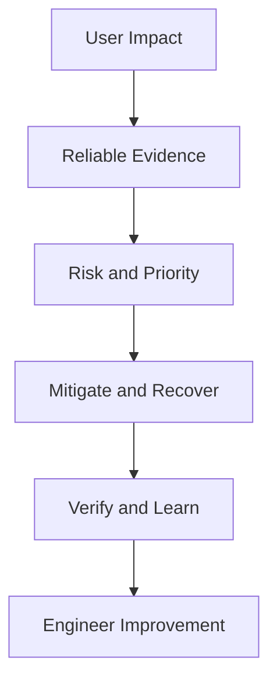

# SRE Foundation Production Scenarios

> Production scenarios turn SRE principles into decisions. They require engineers to connect user impact, service behavior, evidence, risk, ownership, immediate response, recovery, and long-term engineering without reducing the problem to a tool or a single technical symptom.

## Section Purpose

Knowing SRE terminology is not enough. Production work presents incomplete evidence, conflicting priorities, time pressure, uncertain failure modes, and organizational constraints. A strong SRE must decide what matters, what is known, what remains uncertain, who has authority, and which action reduces user harm safely.

This section provides production scenarios covering:

- User-centered reliability
- Critical User Journeys
- Reliability and business risk
- Availability, resilience, and durability
- Fault tolerance and disaster recovery
- Production responsibility
- Service ownership
- Risk tolerance
- Engineering work and operational work
- Toil
- SRE relationships with adjacent disciplines
- SRE responsibilities and operating models
- Organizational need and readiness
- Measurement of SRE success

Each scenario follows a common structure:

1. Production context
2. Available evidence
3. Misleading signals or assumptions
4. Immediate priorities
5. SRE analysis
6. Ownership and authority
7. Long-term engineering work
8. Success measures
9. Review questions

The scenarios do not assume one cloud, orchestrator, monitoring platform, or incident product. The reasoning should remain useful as technology changes.

---

## Learning Objectives

After completing this section, you should be able to:

1. Begin production analysis with users and service outcomes.
2. Separate facts, hypotheses, assumptions, and decisions.
3. Identify misleading infrastructure signals.
4. Prioritize mitigation before complete diagnosis when users are being harmed.
5. Connect technical failure to business and operational consequence.
6. Assign ownership and decision authority explicitly.
7. Distinguish immediate response from long-term engineering.
8. Evaluate risk, recovery, toil, and sustainability.
9. Select useful success measures.
10. Apply Chapter 1 SRE principles to unfamiliar situations.

---

## 1. How to Use These Scenarios

For each scenario:

1. Read only the context and evidence.
2. Write your initial diagnosis and actions.
3. Separate known facts from hypotheses.
4. Identify the affected Critical User Journey.
5. Decide who should lead and who should participate.
6. Compare your answer with the analysis.
7. Challenge the proposed long-term work.
8. Define how you would verify success.

The objective is not to guess one hidden cause. It is to demonstrate safe reasoning under uncertainty.

---

## 2. The Production Reasoning Framework

This is a loop. New evidence may change the diagnosis, action, or risk assessment.

---

## 3. Facts, Hypotheses, Assumptions, and Decisions

| Type | Meaning | Example |
| --- | --- | --- |
| Fact | Supported by current evidence | Checkout success fell to 82 percent |
| Hypothesis | Testable explanation | Payment retries are exhausting connections |
| Assumption | Condition treated as true but not verified | The secondary region has enough capacity |
| Decision | Chosen action within authority | Disable nonessential recommendations |

Mixing these categories creates false confidence.

---

## 4. Immediate Response Versus Long-Term Work

### Immediate Response

- Protect users
- Contain blast radius
- Restore critical behavior
- Preserve evidence
- Communicate
- Verify recovery

### Long-Term Work

- Remove or contain failure modes
- Improve detection
- Automate safe response
- Clarify ownership
- Test recovery
- Reduce toil
- Change objectives or policy where needed

Do not delay safe mitigation while searching for a complete cause.

---

## 5. Scenario 1: Green Infrastructure, Failed Checkout

### Production Context

An online retailer begins a major campaign. Infrastructure dashboards show normal CPU, memory, host availability, and database health. Customer support reports that shoppers are charged but do not receive order confirmation.

### Available Evidence

- Payment authorization returns success.
- Order creation success falls to 71 percent.
- A new event schema was deployed 20 minutes earlier.
- The order consumer rejects messages with an unknown field.
- The payment service retries timed-out confirmations.

### Misleading Signals

- All containers are running.
- The payment API returns HTTP 200.
- The database accepts connections.

### Immediate Priorities

1. Stop or roll back the incompatible schema change.
2. Prevent duplicate charges and repeated retries.
3. Preserve rejected events for controlled replay.
4. Reconcile authorized payments against created orders.
5. Communicate the user impact accurately.

### SRE Analysis

The Critical User Journey is not payment authorization alone. It is the creation of one durable order after one valid payment, followed by timely confirmation. Component availability hides an end-to-end correctness failure.

### Ownership and Authority

- Checkout owner remains accountable for the complete journey.
- Payment and order teams own their service changes.
- Incident commander coordinates mitigation.
- Product and finance owners approve customer remediation.

### Long-Term Engineering Work

- Enforce compatible event contracts.
- Add consumer-driven compatibility testing.
- Make payment and order processing idempotent.
- Create end-to-end correctness SLIs.
- Build automated reconciliation and controlled replay.
- Add progressive delivery with journey verification.

### Success Measures

- Exactly-once business outcome ratio
- Checkout success and latency SLO
- Reconciliation exceptions
- Schema-related change failures
- Time to stop duplicate processing

### Review Questions

1. Why did internal health remain green?
2. Which events belong in the SLI denominator?
3. How would recovery verify that no customer was charged twice?

---

## 6. Scenario 2: Authentication Latency in One Region

### Production Context

Users in one region report sign-in delays and timeouts. Global availability remains above target. Most dashboards show normal averages.

### Available Evidence

- Regional p99 latency increased from 600 milliseconds to 14 seconds.
- Median global latency changed little.
- One identity dependency is routing traffic across continents.
- The affected region represents 4 percent of global users.
- Enterprise customers in that region begin their business day now.

### Misleading Signals

- Global success is 99.92 percent.
- Average latency is 480 milliseconds.
- No host is unavailable.

### Immediate Priorities

1. Confirm the affected user segment and journey.
2. Restore regional dependency routing or use a safe local fallback.
3. Limit retry amplification.
4. Communicate the regional impact.

### SRE Analysis

Global aggregation hides concentrated harm. Small population does not mean low importance. Authentication blocks every dependent journey.

### Ownership and Authority

The identity service owner leads technical restoration. Regional operations provides local evidence. Product and customer teams assess contractual impact.

### Long-Term Engineering Work

- Add regional SLO views and alerts.
- Test routing failover.
- Define dependency latency budgets.
- Add local degraded authentication where security permits.
- Review retry and timeout hierarchy.

### Success Measures

- Regional sign-in success
- Regional tail latency
- Time to detect segmented failure
- Cross-region routing incidents
- Failover verification

### Review Questions

1. Should the global SLO be considered met?
2. Which segment safeguards are required?
3. What security risks accompany a local fallback?

---

## 7. Scenario 3: Stale Medical Results

### Production Context

A clinical portal remains available, but laboratory results shown to clinicians are up to six hours old. The freshness pipeline has stopped processing one data source.

### Available Evidence

- Portal request success is 99.99 percent.
- Page latency is normal.
- Freshness for one laboratory falls below the 15-minute requirement.
- No alert exists for source-specific backlog age.
- Clinicians assume displayed results are current.

### Misleading Signals

- The portal is reachable.
- The database is healthy.
- Most sources remain fresh.

### Immediate Priorities

1. Prevent stale data from appearing current.
2. Notify clinical and safety owners.
3. Display freshness status or suppress unsafe results.
4. Restore processing and verify record completeness.

### SRE Analysis

Availability is not sufficient. Freshness and correctness are required reliability dimensions. Silent stale data can be more harmful than explicit unavailability.

### Ownership and Authority

Clinical product owners decide safe degraded behavior. Data service owners restore processing. Safety and compliance teams assess notification obligations.

### Long-Term Engineering Work

- Define freshness SLIs per source.
- Alert on age and coverage.
- Add source-level reconciliation.
- Design explicit stale-state behavior.
- Test backlog recovery and ordering.

### Success Measures

- Results within freshness threshold
- Source coverage
- Undetected stale-result duration
- Backlog recovery time
- Reconciliation failures

### Review Questions

1. Is showing stale data worse than showing no data?
2. Who decides the degraded product behavior?
3. Which data events require reconciliation?

---

## 8. Scenario 4: Successful Backup, Failed Restore

### Production Context

A database reports successful nightly backups. An accidental deletion requires restoration. The restore completes, but the application cannot read the recovered data.

### Available Evidence

- Backup jobs have reported success for 14 months.
- Encryption keys for older backups were retired.
- The restored schema is incompatible with the current application.
- No end-to-end restore test has occurred in a year.
- The stated RTO is four hours.

### Misleading Signals

- Backup success is 100 percent.
- Multiple backup copies exist.
- Storage durability is high.

### Immediate Priorities

1. Preserve all available copies.
2. Locate valid keys and compatible application versions.
3. Establish the latest usable recovery point.
4. Communicate likely data loss and time uncertainty.
5. Validate recovered data before reopening writes.

### SRE Analysis

Backup completion is an output. Recoverability is the required capability. The recovery system includes data, keys, schema, application, access, dependencies, and verification.

### Ownership and Authority

The data owner defines acceptable recovery point. Database and application teams perform restoration. Security controls key access. Business owners accept residual loss.

### Long-Term Engineering Work

- Test representative restores regularly.
- Preserve key lifecycle compatibility.
- Version schema and recovery procedures.
- Verify application journeys after restore.
- Measure achieved RTO and RPO.

### Success Measures

- Verified restore success rate
- Achieved RTO and RPO
- Restore test coverage
- Data reconciliation results
- Recovery procedure freshness

### Review Questions

1. Why did backup success create false confidence?
2. What defines a successful restore?
3. Who may accept data loss beyond the RPO?

---

## 9. Scenario 5: Multi-Region Service With One Control Plane

### Production Context

A service operates active-active across two regions. Both regions depend on one global identity and traffic-management control plane. That control plane becomes unavailable during a provider incident.

### Available Evidence

- Application instances remain healthy in both regions.
- Existing sessions continue.
- New sessions fail.
- Operators cannot change traffic routes.
- Emergency access depends on the same identity system.

### Misleading Signals

- The service is deployed in two regions.
- Regional compute remains available.
- Replication is current.

### Immediate Priorities

1. Preserve existing sessions.
2. Activate tested break-glass access if available.
3. Use preauthorized routing or degraded mode.
4. Avoid untested changes that could terminate healthy sessions.
5. Escalate the shared provider failure.

### SRE Analysis

Regional redundancy did not remove a common-mode control-plane failure. The fault model excluded identity and operator access.

### Ownership and Authority

The service owner leads user decisions. Identity and network owners address shared dependencies. Incident authority must be available without the failed control plane.

### Long-Term Engineering Work

- Map common dependencies.
- Create independent emergency access.
- Prestage and test routing controls.
- Define session-preserving degraded behavior.
- Exercise control-plane loss.

### Success Measures

- Critical journeys sustained during control-plane failure
- Break-glass success
- Time to regain traffic authority
- Common-mode risks closed
- Exercise coverage

### Review Questions

1. Was the service truly fault tolerant?
2. Which assumptions should appear in the reliability claim?
3. How can emergency access remain secure?

---

## 10. Scenario 6: Error Budget Burn After a Release

### Production Context

A new search feature launches gradually. The service has 75 percent of its monthly error budget remaining, but the last 30 minutes show a burn rate of 40.

### Available Evidence

- Failures correlate with the new cohort.
- Rollback is available.
- A marketing event begins in two hours.
- Only 5 percent of users are exposed.
- Failed searches fall back to empty results and return HTTP 200.

### Misleading Signals

- Most budget remains.
- Overall HTTP error rate is low.
- Deployment status is healthy.

### Immediate Priorities

1. Halt promotion.
2. Measure actual empty-result failure.
3. Roll back or disable the feature.
4. Verify search quality for exposed users.

### SRE Analysis

Remaining budget hides rapid current consumption. Technical success codes hide product failure. Progressive delivery limited blast radius and provides a safe control point.

### Ownership and Authority

Product and search owners decide feature behavior within policy. SRE enforces agreed burn thresholds and supports verification.

### Long-Term Engineering Work

- Add quality SLIs.
- Use multi-window burn alerts.
- Define promotion and abort criteria.
- Test fallback behavior.
- Improve cohort comparison.

### Success Measures

- Search quality SLO
- Burn rate during rollout
- Detection before broad exposure
- Rollback time
- Change failure by cohort

### Review Questions

1. Why is remaining budget insufficient?
2. Is an empty successful response a good event?
3. Who can approve continued rollout?

---

## 11. Scenario 7: Perfect Reliability Target

### Production Context

Leadership requires 100 percent availability for an internal reporting service while also requesting weekly features and a 30 percent cost reduction.

### Available Evidence

- Users can tolerate up to one hour of delay outside quarter-end.
- The service currently achieves 99.97 percent.
- Most failures occur during releases.
- Redundancy cost is growing.
- No formal Critical User Journey analysis exists.

### Misleading Signals

- Higher availability must always be better.
- Internal users need no product research.
- A 100 percent target shows commitment.

### Immediate Priorities

No incident exists. The immediate priority is a decision process, not technical emergency work.

### SRE Analysis

The target conflicts with user tolerance, change, and cost. Reliability must be defined by the reporting journey and critical periods.

### Ownership and Authority

Business owners define critical reporting windows. Product and SRE propose objectives and costs. Leadership accepts the tradeoff.

### Long-Term Engineering Work

- Map reporting journeys.
- Establish different objectives for critical periods where justified.
- Improve release safety.
- Model cost per reliability increment.
- Create an error-budget policy.

### Success Measures

- Journey completion within required deadline
- Reliability during critical periods
- Change failure rate
- Cost of service
- Decisions driven by SLO evidence

### Review Questions

1. Is a time-varying objective appropriate?
2. What is the marginal value of another nine?
3. Who owns the business risk decision?

---

## 12. Scenario 8: Alert Storm During Dependency Failure

### Production Context

A shared messaging dependency slows down. Forty services page independently. More than 600 alerts reach responders in 15 minutes.

### Available Evidence

- One dependency is common to most affected services.
- Retries multiply traffic by eight.
- Some services can operate without messaging.
- Incident command is not established for 22 minutes.
- Several responders make conflicting configuration changes.

### Misleading Signals

- More alerts provide more visibility.
- Every service needs a separate urgent page.
- Retry is always safe.

### Immediate Priorities

1. Establish incident command.
2. Identify the common dependency.
3. Reduce retry amplification.
4. Protect critical journeys and shed lower-priority work.
5. Freeze conflicting manual changes.

### SRE Analysis

Alerting reflects component symptoms rather than coordinated user risk. Retry behavior creates positive feedback and increases dependency load.

### Ownership and Authority

Messaging owner leads dependency restoration. Incident command coordinates service actions. Service owners decide degraded behavior.

### Long-Term Engineering Work

- Deduplicate and correlate alerts.
- Define dependency-level incident response.
- Add retry budgets and backoff.
- Establish graceful degradation.
- Map critical consumers and capacity.

### Success Measures

- Pages per shared failure
- Time to incident command
- Retry amplification factor
- Critical journeys preserved
- Dependency recovery time

### Review Questions

1. Which alerts should page?
2. How should shared failure be communicated?
3. Which services should stop retrying first?

---

## 13. Scenario 9: Two-Person On-Call Rotation

### Production Context

Two engineers provide continuous coverage for a customer identity service. Each receives multiple night pages weekly. Both are also expected to deliver a reliability roadmap.

### Available Evidence

- Forty percent of pages require no action.
- One recurring certificate issue creates 25 percent of pages.
- Vacations are covered by the other engineer.
- Engineering project completion has stopped.
- Leadership reports that acknowledgment remains fast.

### Misleading Signals

- Fast acknowledgment proves the model works.
- Experienced engineers can handle the load.
- No customer outage means no reliability problem.

### Immediate Priorities

1. Reduce nonactionable paging.
2. Add safe coverage or limit the commitment.
3. Correct the certificate failure.
4. Provide recovery after disturbed nights.

### SRE Analysis

The service is being sustained through personal harm and hidden engineering loss. This is not a reliable operating model.

### Ownership and Authority

Management owns staffing and workload design. Service and SRE leaders own page remediation. Business leadership owns any reduced coverage decision.

### Long-Term Engineering Work

- Build a sustainable rotation.
- Define page quality standards.
- Share service knowledge.
- Protect engineering capacity.
- Measure on-call health and distribution.

### Success Measures

- After-hours pages per responder
- Actionability
- Rotation size
- Engineering capacity
- Consecutive sleep interruptions
- Team health evidence

### Review Questions

1. Which outcome is hidden by fast acknowledgment?
2. Should coverage be reduced before staffing improves?
3. Who can make that decision?

---

## 14. Scenario 10: Toil Hidden as Business as Usual

### Production Context

An operations group manually restarts failed jobs, increases storage, renews certificates, and reconciles transactions. The work grows 15 percent each quarter.

### Available Evidence

- Seventy percent of team capacity is recurring work.
- The same five request types create 60 percent of demand.
- Ticket closure remains within target.
- Senior engineers perform most complex reconciliation.
- Product teams rarely see the operational queue.

### Misleading Signals

- Service targets are met.
- Ticket service levels are healthy.
- Hiring can keep pace with demand.

### Immediate Priorities

No acute incident exists. Protect engineering capacity and stop further unbounded intake.

### SRE Analysis

Operational success is being measured through queue processing while toil grows linearly and hides system defects.

### Ownership and Authority

Service owners must participate in eliminating demand. Operations and SRE classify work. Leadership funds engineering and enforces workload boundaries.

### Long-Term Engineering Work

- Automate high-value repeatable tasks.
- Remove unnecessary requests.
- Provide safe self-service.
- Correct recurring job failure.
- Return product-specific work to owners.
- Verify that work is removed, not moved.

### Success Measures

- Toil volume and percentage
- Demand by source
- Engineering capacity
- Recurring request rate
- Cross-team total effort

### Review Questions

1. Which tasks are toil?
2. Which should be eliminated instead of automated?
3. How could automation move toil elsewhere?

---

## 15. Scenario 11: Automation Expands Blast Radius

### Production Context

A new remediation system restarts unhealthy instances automatically. A faulty health check marks every instance unhealthy and the automation restarts the entire fleet.

### Available Evidence

- Automation has production-wide permission.
- No concurrency limit exists.
- The health check depends on a slow external service.
- Operators cannot pause the process quickly.
- Manual restart previously affected one instance at a time.

### Misleading Signals

- Automation removes human error.
- Faster response is always safer.
- Health-check failure proves instance failure.

### Immediate Priorities

1. Stop automated restarts.
2. Preserve enough healthy capacity.
3. Isolate the external health dependency.
4. Restore instances gradually.
5. Verify user journeys.

### SRE Analysis

Automation converted a slow local action into a fast fleet-wide failure. Scope, independent evidence, and stop controls were missing.

### Ownership and Authority

The automation owner leads containment. Service owners verify recovery. Security reviews excessive privilege.

### Long-Term Engineering Work

- Add concurrency and blast-radius limits.
- Require multi-signal confirmation.
- Add circuit breakers and manual pause.
- Test failure modes.
- Use staged rollout for automation.

### Success Measures

- Automated remediation success
- Maximum simultaneous action
- False-positive rate
- Time to stop automation
- User impact from automation

### Review Questions

1. Which safeguards were missing?
2. When should a human approve action?
3. How should automation fail safely?

---

## 16. Scenario 12: Capacity Exhaustion Before a Launch

### Production Context

A media platform expects traffic to triple during a live event. Current testing shows database connection saturation at 1.8 times normal peak. Scaling the database requires a maintenance window.

### Available Evidence

- The event begins in five days.
- Application capacity can scale automatically.
- Database connections do not scale with instances safely.
- Cache hit rate falls during content updates.
- Marketing cannot move the event.

### Misleading Signals

- Autoscaling is enabled.
- Average utilization is low today.
- The platform handled last year's event.

### Immediate Priorities

1. Establish a realistic demand range.
2. Protect critical viewing and sign-in journeys.
3. Reduce connection use and nonessential work.
4. Prepare safe degraded modes and load shedding.
5. Decide whether risk is acceptable.

### SRE Analysis

Application scaling can worsen the database limit. Current averages do not represent event demand. The decision needs tested safe capacity, scaling lead time, and business consequence.

### Ownership and Authority

Product defines critical features. Database and application owners implement controls. Leadership accepts launch risk. Incident command is preassigned.

### Long-Term Engineering Work

- Build end-to-end capacity models.
- Test cache invalidation behavior.
- Control connection pools.
- Establish headroom policy.
- Rehearse event response.

### Success Measures

- Tested safe capacity
- Capacity headroom
- Critical journey SLO during event
- Load shed by priority
- Forecast accuracy

### Review Questions

1. What is the true bottleneck?
2. Which features should degrade first?
3. What evidence supports the launch decision?

---

## 17. Scenario 13: Retry Storm and Cascading Failure

### Production Context

An inventory service becomes slow. Checkout, recommendation, and warehouse clients retry without coordinated limits. The service and database collapse under amplified demand.

### Available Evidence

- Original request rate increased 20 percent.
- Inventory request rate increased 700 percent.
- Client timeout exceeds server queue time.
- Every client retries three times immediately.
- Some journeys can proceed with slightly stale inventory.

### Misleading Signals

- Retries improve reliability.
- More capacity in checkout will help.
- Inventory is the only failing component.

### Immediate Priorities

1. Reduce or disable retries.
2. Shed noncritical requests.
3. Use safe cached data where allowed.
4. Protect checkout and inventory correction paths.
5. Drain queues carefully.

### SRE Analysis

Independent local retry policies create a global positive feedback loop. The system lacks a shared retry budget and overload contract.

### Ownership and Authority

Inventory owner manages server recovery. Client owners change retry behavior. Incident commander prioritizes journeys and coordinates load reduction.

### Long-Term Engineering Work

- Establish exponential backoff and jitter.
- Limit attempts and total retry load.
- Align timeout hierarchy.
- Add admission control.
- Define stale-data behavior.
- Test overload across services.

### Success Measures

- Retry amplification
- Overload recovery time
- Critical journey success under dependency slowdown
- Queue age
- Admission-control effectiveness

### Review Questions

1. Why can a retry be harmful?
2. Who owns the total retry budget?
3. When is stale data safer than failure?

---

## 18. Scenario 14: Partial Data Corruption

### Production Context

A serialization defect corrupts one field in 0.05 percent of customer profiles. The service remains available and latency is normal. Corruption is discovered two weeks later.

### Available Evidence

- Corruption affects profiles updated by one application version.
- Replication copied the invalid values.
- Backups contain both valid and invalid states.
- No correctness SLI exists.
- Original source events remain available for 30 days.

### Misleading Signals

- Availability SLO was met.
- Replicas are healthy.
- Error rate is near zero.

### Immediate Priorities

1. Stop further corruption.
2. Preserve source events and evidence.
3. Identify affected records accurately.
4. Design reversible repair.
5. Notify data and business owners.

### SRE Analysis

Durability preserved corrupted data. Availability did not reveal correctness failure. Recovery must reconstruct valid state and verify every repair.

### Ownership and Authority

Profile owner remains accountable. Data engineers design repair. Security and privacy owners control access. Business owners decide notification.

### Long-Term Engineering Work

- Add schema validation and compatibility tests.
- Define correctness and reconciliation signals.
- Create repair tooling with dry-run and audit.
- Improve corruption detection.
- Test point-in-time recovery decisions.

### Success Measures

- Corrupted records detected
- Time to detect corruption
- Repair accuracy
- Reconciliation exceptions
- Recurrence after control deployment

### Review Questions

1. Why did replication not protect the data?
2. What is the safe repair process?
3. How should correctness enter the SLO model?

---

## 19. Scenario 15: Split Brain During Failover

### Production Context

A network partition separates two database sites. Both accept writes after operators force failover from different locations.

### Available Evidence

- Each site believes the other is unavailable.
- Quorum protection was disabled during previous maintenance.
- Conflicting transactions now exist.
- Customer balances differ by region.
- Failover authority is unclear.

### Misleading Signals

- Keeping both sites writable improves availability.
- Each operator acted to restore service.
- Replication will reconcile automatically.

### Immediate Priorities

1. Stop conflicting writes safely.
2. Establish one incident commander and authoritative data source.
3. Preserve transaction logs.
4. Define reconciliation with business owners.
5. Communicate correctness risk.

### SRE Analysis

Availability action created integrity risk. Fault tolerance needs quorum, fencing, clear authority, and tested partition behavior.

### Ownership and Authority

Database owner controls topology. Incident commander coordinates regions. Finance or domain owners approve reconciliation rules.

### Long-Term Engineering Work

- Restore quorum and fencing.
- Define failover authority.
- Test network partitions.
- Automate safe leadership election.
- Create conflict detection and repair procedures.

### Success Measures

- Conflicting writes during partition
- Failover success under test
- Time to establish authority
- Reconciliation completeness
- Quorum-control coverage

### Review Questions

1. When should availability yield to correctness?
2. Who may force failover?
3. How is stale leadership fenced?

---

## 20. Scenario 16: Change Freeze After Repeated Incidents

### Production Context

After four release-related incidents, leadership imposes an indefinite production freeze. Availability improves, but security patches and product changes accumulate.

### Available Evidence

- Changes are large and released monthly.
- Rollback takes 90 minutes.
- Test environments differ from production.
- The freeze has lasted eight weeks.
- Teams plan a very large post-freeze release.

### Misleading Signals

- No changes means no incidents.
- Improved short-term availability proves success.
- More preapproval will solve the problem.

### Immediate Priorities

1. Maintain the bounded freeze for high-risk change only.
2. Allow urgent security and reliability work through controlled paths.
3. Reduce the queued release into smaller units.
4. Define exit criteria.

### SRE Analysis

The freeze is a temporary risk control, not a reliable delivery system. Indefinite delay increases batch size and other risks.

### Ownership and Authority

Product, security, development, and SRE jointly define change classes. Authorized leadership accepts exceptions and ends the freeze.

### Long-Term Engineering Work

- Create smaller frequent changes.
- Align environments.
- Automate verification.
- Improve progressive delivery and rollback.
- Use error-budget policy.

### Success Measures

- Change failure rate
- Rollback time
- Batch size
- Safe deployment frequency
- Error-budget impact per change

### Review Questions

1. Which changes should remain allowed?
2. What ends the freeze?
3. How can the post-freeze risk be reduced?

---

## 21. Scenario 17: Third-Party Payment Provider Failure

### Production Context

A payment provider becomes intermittently unavailable. The retailer's internal services are healthy, but checkout success falls below its SLO.

### Available Evidence

- Provider errors affect two payment methods.
- One alternative provider is available for a subset of countries.
- The contract excludes this incident from credits.
- The user cannot distinguish provider ownership.
- Retry increases duplicate authorization risk.

### Misleading Signals

- The failure is external, so it should be excluded.
- The SLA provides no credit, so business impact is limited.
- Internal availability remains healthy.

### Immediate Priorities

1. Disable unsafe retries.
2. Route eligible traffic to the alternative.
3. Communicate affected methods and regions.
4. Preserve transaction state for reconciliation.
5. Escalate the provider.

### SRE Analysis

The dependency caused the failure, but users experience the retailer's service. The user SLI should generally include the impact. Internal attribution supports vendor and architecture decisions.

### Ownership and Authority

Checkout owner remains accountable. Vendor owner escalates. Finance and product decide alternative methods and customer treatment.

### Long-Term Engineering Work

- Build provider health routing.
- Define payment-method degradation.
- Test alternative capacity.
- Improve idempotency and reconciliation.
- Review concentration risk and contracts.

### Success Measures

- Checkout SLO
- Dependency contribution to bad events
- Provider failover success
- Duplicate authorizations
- Vendor escalation time

### Review Questions

1. Should provider errors count against the SLO?
2. What risk does multi-provider design add?
3. Which team owns the contract decision?

---

## 22. Scenario 18: Orphaned Legacy Service

### Production Context

A legacy settlement service fails weekly. Its development team was dissolved. Leadership asks SRE to take full ownership and keep it running.

### Available Evidence

- The service remains financially critical.
- Source code builds only on an unsupported environment.
- Two former engineers provide informal help.
- No funded replacement exists.
- SRE cannot change business logic safely.

### Misleading Signals

- SRE owns production, so it should own the service.
- Pager transfer creates accountability.
- Stability can be achieved through better monitoring.

### Immediate Priorities

1. Assign an executive risk owner.
2. Establish temporary technical ownership.
3. Contain the most severe known failures.
4. Preserve knowledge and build capability.
5. Decide repair, replacement, containment, or retirement.

### SRE Analysis

The need for reliability is high, but organizational readiness is low. SRE cannot accept permanent accountability without application ownership and change authority.

### Ownership and Authority

Leadership assigns product and technical owners. SRE may support stabilization within explicit boundaries. Business owners accept residual risk.

### Long-Term Engineering Work

- Make builds reproducible.
- Document service behavior and dependencies.
- Reduce specialist dependence.
- Create a replacement or retirement roadmap.
- Define handback and exit.

### Success Measures

- Named ownership
- Reproducible build and recovery
- Incident recurrence
- Knowledge coverage
- Milestones toward replacement or retirement

### Review Questions

1. What can SRE safely accept now?
2. Which authority is missing?
3. When should the service be refused or handed back?

---

## 23. Scenario 19: SRE as Deployment Gatekeeper

### Production Context

Every production release requires manual SRE approval. Deployment requests wait three days. Teams begin using emergency paths to bypass review.

### Available Evidence

- Ninety percent of changes are low risk and repeatable.
- Approval rarely changes the plan.
- High-risk data changes use the same process as documentation updates.
- SRE spends 30 percent of capacity on approval tickets.
- Bypassed changes have caused incidents.

### Misleading Signals

- Central approval creates safety.
- More review means lower risk.
- Bypass behavior is only a discipline problem.

### Immediate Priorities

1. Stop unsafe bypasses through usable normal paths.
2. Separate change classes by risk.
3. Automate low-risk controls.
4. Retain focused review for high-risk work.

### SRE Analysis

The gate adds delay without proportional risk reduction. It weakens ownership and creates pressure to avoid the system.

### Ownership and Authority

Service teams own routine changes within guardrails. SRE defines reliability controls and reviews exceptions. Security and data owners participate where relevant.

### Long-Term Engineering Work

- Build policy-based automated checks.
- Add progressive delivery.
- Define evidence requirements by risk.
- Measure approval value and bypass causes.
- Improve rollback capability.

### Success Measures

- Change lead time by risk class
- Change failure rate
- Manual approvals
- Bypass events
- Control-detected unsafe changes

### Review Questions

1. Which changes need human review?
2. How should local authority be bounded?
3. What evidence proves the gate adds value?

---

## 24. Scenario 20: Embedded SRE Becomes Feature Engineer

### Production Context

Two SREs embed with a product team for a six-month reliability engagement. After two months, they spend 85 percent of time on product features and sprint commitments.

### Available Evidence

- Reliability objectives remain undefined.
- On-call noise has not improved.
- Product management assigns all work.
- SRE leadership receives no progress data.
- The engagement has no exit criteria.

### Misleading Signals

- Embedding means complete integration.
- Feature output demonstrates partnership.
- Reliability can wait until the service grows.

### Immediate Priorities

1. Reconfirm the engagement charter.
2. Protect reliability engineering capacity.
3. Define objectives, page reduction, and exit.
4. Escalate conflicting priorities.

### SRE Analysis

Embedding lost the SRE mission and converted scarce reliability capacity into staff augmentation.

### Ownership and Authority

Product and SRE leaders jointly govern priorities. Product owns features. SRE owns its engagement boundaries and engineering commitments.

### Long-Term Engineering Work

- Establish shared goals.
- Maintain SRE community and technical review.
- Define allocation and reporting.
- Use time-bounded embedding.
- Measure capability transfer.

### Success Measures

- Reliability outcomes achieved
- SRE engineering capacity
- Page and toil reduction
- Product-team capability
- Exit readiness

### Review Questions

1. Can SRE contribute product code?
2. When does that contribution become mission loss?
3. Who resolves priority conflict?

---

## 25. Scenario 21: Consulting Recommendations Are Ignored

### Production Context

An SRE consulting group reviews a high-risk service and identifies recovery, capacity, and observability gaps. Six months later, no recommendation has been implemented.

### Available Evidence

- Service engineers agree with the findings.
- Product plans allocate no reliability capacity.
- Leadership requests another assessment.
- Two identified failure modes have since caused incidents.
- Recommendations have no named owners.

### Misleading Signals

- Publishing a report completed the engagement.
- More assessment will improve reliability.
- SRE owns implementation because it found the risks.

### Immediate Priorities

1. Stop repeated assessment without decision.
2. Assign risk and implementation owners.
3. Prioritize controls based on consequence.
4. Escalate accepted residual risk.

### SRE Analysis

Consulting cannot create value without product capacity and authority to act. Findings are outputs, not outcomes.

### Ownership and Authority

Service owners implement changes. Product leadership prioritizes capacity. Authorized business owners accept deferred risk. SRE verifies where agreed.

### Long-Term Engineering Work

- Define engagement entry criteria.
- Require implementation ownership.
- Track verified risk reduction.
- Use follow-up gates.
- Stop engagements without partner capacity.

### Success Measures

- High-risk findings implemented
- Time from finding to decision
- Verified controls
- Recurrence of identified failures
- Capability transferred

### Review Questions

1. Should consulting refuse the second review?
2. Who accepts unimplemented risk?
3. What defines engagement completion?

---

## 26. Scenario 22: Follow-the-Sun Handoff Failure

### Production Context

A database incident begins during one region's shift and continues into another. The incoming team receives a short message stating that failover is in progress. It repeats a dangerous command and extends the outage.

### Available Evidence

- No structured handoff record exists.
- Incident command changes without confirmation.
- Regions use different runbook versions.
- Command history is not shared.
- There is no overlap call.

### Misleading Signals

- Geographic coverage guarantees continuity.
- A chat message is sufficient handoff.
- The incoming team should restart diagnosis independently.

### Immediate Priorities

1. Reestablish one incident commander.
2. Stop uncoordinated action.
3. Reconstruct executed commands and current state.
4. Confirm the recovery plan and authority.
5. Resume with explicit verification.

### SRE Analysis

Coverage without common context and authority creates additional risk. Handoff is a technical control, not an administrative courtesy.

### Ownership and Authority

Incident command transfers explicitly. Regional leads confirm acceptance. Database owner retains technical authority where required.

### Long-Term Engineering Work

- Create structured handoff fields.
- Require overlap for active severe incidents.
- Use one controlled runbook source.
- Record actions automatically.
- Exercise cross-region transfer.

### Success Measures

- Handoff completeness
- Duplicate or conflicting actions
- Time to accepted command transfer
- Cross-region exercise success
- Incident extension from handoff

### Review Questions

1. What must a handoff contain?
2. When should command remain with the outgoing team?
3. How is authority transferred explicitly?

---

## 27. Scenario 23: Every Service Is Tier One

### Production Context

Every business unit classifies its services at the highest reliability tier. SRE capacity cannot meet the promised coverage.

### Available Evidence

- Some services have no users outside business hours.
- Criticality criteria are not documented.
- Higher tier provides faster support at no direct cost to the requesting unit.
- SRE onboarding backlog is 18 months.
- Truly critical services receive diluted attention.

### Misleading Signals

- Every service matters, so all are equally critical.
- Higher tier has no cost.
- Business owners should choose their own tier without challenge.

### Immediate Priorities

1. Stop new unsupported commitments.
2. Define criticality and tier evidence.
3. Identify genuinely critical journeys.
4. Align staffing and coverage with commitments.

### SRE Analysis

Incentives create tier inflation. Reliability prioritization requires consequence, time sensitivity, alternatives, and dependency evidence.

### Ownership and Authority

Business owners describe consequences. Reliability governance assigns tiers. SRE defines support capacity and entry conditions.

### Long-Term Engineering Work

- Establish tier criteria and review.
- Attach visible cost and obligations.
- Provide self-service practices for lower tiers.
- Reassess tiers as services change.

### Success Measures

- Tier distribution
- Services meeting tier obligations
- Critical-service SLO performance
- Onboarding queue
- Tier exceptions

### Review Questions

1. Which evidence defines criticality?
2. Should revenue be the primary criterion?
3. How should internal dependencies affect tier?

---

## 28. Scenario 24: SRE Team With No Engineering Time

### Production Context

An SRE team spends 65 percent of time on tickets and 30 percent on incidents. Five percent remains for all other work.

### Available Evidence

- Toil sources are known.
- Service teams refuse returned work.
- Managers reward closure volume.
- Reliability projects are repeatedly deferred.
- Incident recurrence is rising.

### Misleading Signals

- The team is productive because utilization is high.
- Operational demand proves SRE is valuable.
- More headcount will solve the issue permanently.

### Immediate Priorities

1. Protect a minimum engineering allocation.
2. Stop or reroute misaligned intake.
3. Prioritize highest-risk recurring work.
4. Escalate broken engagement agreements.

### SRE Analysis

The team cannot make tomorrow better than today. High utilization reflects system failure, not healthy productivity.

### Ownership and Authority

SRE leadership controls intake. Service owners receive appropriate handback. Executive sponsor resolves refusal and funding.

### Long-Term Engineering Work

- Enforce toil limits.
- Create service engagement criteria.
- Automate or remove repeated work.
- Change performance measures.
- Reassess supported service count.

### Success Measures

- Engineering capacity
- Toil percentage
- Incident recurrence
- Misrouted work
- Services per SRE team

### Review Questions

1. Which work should stop first?
2. Does adding staff preserve the wrong model?
3. What authority does SRE need?

---

## 29. Scenario 25: Blameless in Name Only

### Production Context

An engineer deploys a configuration that causes a two-hour outage. The postmortem is called blameless, but the engineer receives a poor performance rating and colleagues omit details from later reviews.

### Available Evidence

- The configuration passed required review.
- No staged rollout existed.
- Validation did not test the affected behavior.
- Rollback instructions were stale.
- The action was reasonable under current process.

### Misleading Signals

- The deployer caused the outage.
- Blameless means no accountability.
- The process was followed, so no system change is needed.

### Immediate Priorities

The incident has ended. Protect evidence quality and prevent retaliation from undermining future learning.

### SRE Analysis

Individual action interacted with weak controls, rollout, validation, and recovery. Punishment for good-faith action creates concealment and increases future risk.

### Ownership and Authority

Management owns fair performance process. Service owners correct technical controls. Reliability leaders protect review integrity.

### Long-Term Engineering Work

- Separate learning from misconduct review.
- Add staged rollout and validation.
- Test rollback.
- Train managers in learning review.
- Measure action effectiveness.

### Success Measures

- Incident-report completeness
- Corrective controls verified
- Repeat configuration failures
- Psychological safety evidence
- Time to rollback

### Review Questions

1. What does accountability mean here?
2. When should separate disciplinary review occur?
3. How can leaders rebuild trust?

---

## 30. Scenario 26: Internal Platform Reports 99.99 Percent

### Production Context

A deployment platform reports 99.99 percent API availability. Application teams report frequent failed deployments and manual recovery.

### Available Evidence

- API requests return success after accepting jobs.
- Twelve percent of jobs later fail without clear status.
- Queue time exceeds two hours during peak periods.
- Platform SLO excludes execution after acceptance.
- Teams maintain private scripts to recover jobs.

### Misleading Signals

- API availability proves platform reliability.
- Consumer workarounds are outside platform scope.
- Accepted requests are successful requests.

### Immediate Priorities

No broad outage exists. Correct the measurement and identify unsafe failed-job recovery.

### SRE Analysis

The platform capability is delivering a verified deployment within useful time, not accepting an API call. Consumer toil reveals hidden platform failure.

### Ownership and Authority

Platform team owns the capability. Application teams provide consumer evidence. Reliability governance aligns the SLO with the journey.

### Long-Term Engineering Work

- Define end-to-end deployment SLIs.
- Improve job state and error reporting.
- Reduce queue saturation.
- Replace private recovery scripts with supported capability.
- Measure consumer toil.

### Success Measures

- Verified deployment success
- Queue latency
- Manual recovery rate
- Consumer toil
- Failed jobs with actionable diagnosis

### Review Questions

1. Who is the platform user?
2. Where should the journey end?
3. How should consumer workarounds affect prioritization?

---

## 31. Scenario 27: No Incidents, Unknown Reliability

### Production Context

An executive dashboard reports zero incidents for a year. Customer complaints mention intermittent data loss, but no formal incident is declared.

### Available Evidence

- Incident declaration requires director approval.
- Teams resolve problems within support tickets.
- Telemetry retention is seven days.
- SLOs do not exist.
- Engineers fear blame for incident counts.

### Misleading Signals

- Zero incidents proves high reliability.
- Support cases are not production incidents.
- Formal declaration should be rare.

### Immediate Priorities

1. Investigate current data-loss risk.
2. Preserve evidence.
3. Remove the approval barrier for declaration.
4. Protect good-faith reporting.

### SRE Analysis

The metric measures reporting behavior, not service health. Incentives suppress visibility and learning.

### Ownership and Authority

Leadership changes incident policy and performance incentives. Data owners investigate integrity. SRE establishes measurement and review.

### Long-Term Engineering Work

- Define incident criteria.
- Create correctness SLIs.
- Improve retention and reconciliation.
- Separate learning from blame.
- Audit hidden support incidents.

### Success Measures

- Data-loss rate
- Detection source
- Incident reporting delay
- Support cases linked to service failure
- Corrective-action verification

### Review Questions

1. Should incident count rise after improvement?
2. Which incentive caused concealment?
3. How should leadership report the change?

---

## 32. Scenario 28: High Availability, Excessive Latency

### Production Context

A collaboration service meets its request-success target, but users cannot join meetings on time during morning peaks.

### Available Evidence

- Request success is 99.95 percent.
- p50 join time is two seconds.
- p99 join time is 48 seconds.
- Users abandon after 15 seconds.
- Capacity scales after a ten-minute delay.

### Misleading Signals

- Requests eventually succeed.
- Median latency is healthy.
- The availability SLO is met.

### Immediate Priorities

1. Add capacity before predictable peaks.
2. Protect the join path over nonessential features.
3. Reduce slow dependencies.
4. Measure abandonment and time-to-use.

### SRE Analysis

Eventual success after the useful deadline is service failure. Median performance hides tail harm.

### Ownership and Authority

Meeting owner defines useful join time. Capacity and application owners correct scaling. SRE designs meaningful latency objectives.

### Long-Term Engineering Work

- Add threshold-based latency SLI.
- Forecast regional peaks.
- Reduce scaling delay.
- Prewarm critical capacity.
- Segment by geography and client.

### Success Measures

- Joins completed within 10 seconds
- Abandonment
- Tail latency
- Capacity ready before peak
- Error-budget burn by region

### Review Questions

1. Which latency threshold is meaningful?
2. Should abandoned attempts enter the denominator?
3. How does capacity delay affect design?

---

## 33. Scenario 29: Rare Regulatory Submission Failure

### Production Context

A service is used four times each year to submit mandatory regulatory data. A test run completes in six hours, while the required window is two hours.

### Available Evidence

- Production volume is low.
- Failure could create material penalties.
- One engineer knows the manual recovery.
- The last real submission succeeded.
- The test used representative data.

### Misleading Signals

- Low use means low criticality.
- Historical success proves future success.
- Average availability is not meaningful enough to measure.

### Immediate Priorities

1. Escalate the failed recovery objective.
2. Preserve the representative test evidence.
3. Correct the largest time constraints before the next window.
4. Create a safe manual contingency.

### SRE Analysis

Criticality comes from consequence and time sensitivity, not request volume. Recovery and deadline completion are more useful than monthly availability.

### Ownership and Authority

Regulatory business owner defines the deadline and accepts residual risk. Service team and SRE engineer recovery. Compliance verifies obligations.

### Long-Term Engineering Work

- Define submission completion SLO.
- Automate and test recovery.
- Remove single-person knowledge.
- Measure end-to-end processing capacity.
- Rehearse before each window.

### Success Measures

- Submission completed within deadline
- Recovery time
- Data correctness
- Contingency readiness
- Number of qualified responders

### Review Questions

1. Which SLI fits a quarterly event?
2. How should readiness decay between events be handled?
3. Who accepts the residual legal risk?

---

## 34. Scenario 30: Cost Reduction Removes Headroom

### Production Context

A cost program reduces spare capacity from 35 percent to 5 percent. Normal spending falls, but the service now saturates during dependency slowdown.

### Available Evidence

- The SLO was previously met.
- Scaling takes 12 minutes.
- Traffic can increase 20 percent within five minutes.
- Dependency slowdown increases resource use per request.
- No one documented the reliability assumption behind headroom.

### Misleading Signals

- Unused capacity is waste.
- Autoscaling removes the need for headroom.
- Current average demand is the correct baseline.

### Immediate Priorities

1. Restore safe capacity temporarily.
2. Define tested headroom based on scaling delay and demand variation.
3. Protect critical work through load shedding.
4. Communicate cost and risk together.

### SRE Analysis

Cost reduction removed a reliability control without assessing the failure model. Headroom covers demand and recovery delay, not only normal utilization.

### Ownership and Authority

Service owner and SRE define safe operating capacity. Finance provides cost goals. Business leadership chooses among cost, risk, and service scope.

### Long-Term Engineering Work

- Improve scaling speed.
- Forecast demand ranges.
- Reduce resource cost per request.
- Establish headroom policy.
- Test degraded modes.

### Success Measures

- Tested headroom
- Scaling time
- SLO under dependency slowdown
- Cost per successful journey
- Saturation incidents

### Review Questions

1. Is all spare capacity waste?
2. What can reduce cost without reducing resilience?
3. Who may accept the new saturation risk?

---

## 35. Scenario 31: Security Control Blocks Recovery

### Production Context

A compromised credential requires emergency rotation. Security policy requires approval from a person who is unavailable. The service cannot access its database after the old credential is revoked.

### Available Evidence

- Rotation procedure was never tested after policy change.
- Break-glass access also requires the unavailable approver.
- Audit logging is available.
- Continued use of the old credential creates security risk.
- Revocation causes availability failure.

### Misleading Signals

- Security and reliability goals must conflict.
- More approval always lowers risk.
- Break-glass access exists because it is documented.

### Immediate Priorities

1. Establish authorized incident and security command.
2. Use the safest available emergency approval path.
3. Rotate and verify access with full audit.
4. Limit exposure and preserve evidence.
5. Restore service behavior.

### SRE Analysis

The control design created a shared human dependency and was not recoverable. Security and reliability need compatible emergency paths.

### Ownership and Authority

Security owns credential policy. Service owner owns availability. Authorized incident leadership resolves emergency risk. Compliance reviews evidence.

### Long-Term Engineering Work

- Create multi-person emergency approval.
- Test credential rotation.
- Use short-lived workload identity.
- Separate break-glass dependencies.
- Automate audited verification.

### Success Measures

- Rotation completion time
- Break-glass success
- Unauthorized exposure duration
- Service interruption
- Recovery exercise coverage

### Review Questions

1. How can emergency access preserve least privilege?
2. Which common dependency failed?
3. What should be tested after policy change?

---

## 36. Scenario 32: AI Remediation Takes Unsafe Action

### Production Context

An AI-assisted operations system detects database latency and automatically increases connection limits. The database exhausts memory and restarts.

### Available Evidence

- The system used a previous incident report as its main recommendation source.
- It had production write access.
- No maximum change limit existed.
- No simulation or approval was required.
- The original latency came from lock contention, not connection shortage.

### Misleading Signals

- A confident recommendation is a correct diagnosis.
- Previous remediation applies to similar symptoms.
- Automation speed improves recovery.

### Immediate Priorities

1. Disable autonomous changes.
2. Restore safe database configuration.
3. Resolve lock contention.
4. Audit all actions and affected services.
5. Verify data integrity.

### SRE Analysis

The system confused symptom similarity with causal equivalence and had excessive authority. AI assistance does not remove the need for evidence, boundaries, verification, and human accountability.

### Ownership and Authority

Database owner controls configuration. Automation owner controls the system. Security reviews privileges. Human incident command owns production decisions.

### Long-Term Engineering Work

- Restrict AI to advisory mode for high-risk actions.
- Require evidence and approval.
- Add action scope limits and rollback.
- Evaluate recommendations offline.
- Record confidence and provenance.

### Success Measures

- Unsafe recommendation rate
- Actions blocked by guardrails
- Verified remediation success
- Time to reverse action
- Production privileges granted

### Review Questions

1. Which actions may be autonomous?
2. How should confidence affect authority?
3. Who remains accountable for the decision?

---

## 37. Scenario 33: Service Meets SLO but Customers Leave

### Production Context

A file-storage service meets its 99.9 percent availability SLO. Customer churn increases after several incidents involving slow restoration and unclear file state.

### Available Evidence

- Upload and download request success meets target.
- Restore requests take up to five days.
- Some users cannot tell whether deleted files are recoverable.
- Support contacts about recovery doubled.
- Recovery journey has no SLO.

### Misleading Signals

- Meeting the availability SLO proves reliability success.
- Churn is only a product issue.
- Recovery is an exceptional support process.

### Immediate Priorities

There is no current incident. Investigate the recovery journey and customer harm.

### SRE Analysis

The existing SLO covers normal access but not a trust-critical recovery journey. SLO compliance is not proof that every important expectation is represented.

### Ownership and Authority

Product identifies customer recovery needs. Storage and SRE teams define recovery capability. Support provides evidence. Business owners decide investment.

### Long-Term Engineering Work

- Define recovery CUJ and SLO.
- Provide clear recovery state.
- Improve restore capacity and prioritization.
- Test durability and support workflows.
- Review retention promises.

### Success Measures

- Verified restore completion time
- Recovery success
- Support contacts
- Data-loss events
- Customer trust evidence

### Review Questions

1. Should the original SLO change or should another be added?
2. How can churn be attributed carefully?
3. What is the role of support evidence?

---

## 38. Scenario 34: Reliability Improves, Team Burns Out

### Production Context

A service meets its SLO for six months after SRE introduces manual overnight checks and an intensive release process. Three engineers leave the team.

### Available Evidence

- User reliability improved.
- After-hours labor doubled.
- Release lead time increased by 400 percent.
- No automation roadmap exists.
- Management calls the outcome successful.

### Misleading Signals

- Meeting the SLO is sufficient.
- Human effort is outside reliability measurement.
- More careful review always improves the system.

### Immediate Priorities

1. Stop unsafe work patterns.
2. Reduce or change the service commitment if necessary.
3. Identify controls that can be automated or simplified.
4. Restore sustainable staffing and recovery time.

### SRE Analysis

Reliability achieved through unbounded human effort is not SRE success. The operating model transferred risk from users to engineers.

### Ownership and Authority

Management owns staffing and health. Product and business owners decide service tradeoffs. SRE leadership protects workload boundaries.

### Long-Term Engineering Work

- Replace manual checks with meaningful signals.
- Use risk-based release controls.
- Reduce toil.
- Improve rollback and progressive delivery.
- Measure human sustainability.

### Success Measures

- SLO performance
- After-hours labor
- Toil percentage
- Release lead time
- Engineering capacity
- Team health and retention

### Review Questions

1. Can a service be reliable while the operating model is not?
2. Which commitment should change first?
3. How should team health enter the scorecard?

---

## 39. Scenario 35: Successful SRE Engagement That Never Ends

### Production Context

An SRE team stabilizes a product service, reduces paging by 80 percent, establishes SLOs, and trains the development team. The service remains in full SRE support because no exit was planned.

### Available Evidence

- Development engineers can operate the service.
- Toil is below the agreed limit.
- Reliability has remained healthy for a year.
- New higher-risk services wait for SRE help.
- Product leadership prefers to retain SRE coverage.

### Misleading Signals

- Permanent support proves the engagement succeeded.
- Handback would reduce service quality.
- SRE should keep every stable service.

### Immediate Priorities

No emergency exists. Begin an evidence-based engagement review.

### SRE Analysis

Success can create an exit opportunity. Scarce SRE capacity should move where it has greater reliability leverage when ownership and capability can transfer safely.

### Ownership and Authority

SRE and product leaders agree on transition. Development accepts operational ownership. Governance reviews residual risk.

### Long-Term Engineering Work

- Define handback plan.
- Transfer pager gradually.
- Preserve consulting and escalation paths.
- Verify owner capability.
- Reallocate SRE capacity.

### Success Measures

- Safe handback completion
- SLO after transfer
- Development response capability
- SRE capacity released
- New engagement value

### Review Questions

1. What evidence permits handback?
2. Is permanent partnership ever appropriate?
3. How should post-transfer support work?

---

## 40. Scenario Comparison Matrix

| Scenario | Primary SRE principle | Main hidden risk |
| --- | --- | --- |
| Failed checkout | User-centered reliability | Correctness hidden by component health |
| Regional authentication | Segmentation | Global aggregate hides regional harm |
| Stale medical results | Freshness and safety | Available but unsafe data |
| Failed restore | Recoverability | Backup output mistaken for capability |
| Shared control plane | Failure domains | Common-mode regional failure |
| Release burn | Error-budget control | Remaining budget hides rapid burn |
| Perfect target | Risk tolerance | Reliability, delivery, and cost conflict |
| Alert storm | Incident response | Noise and retry amplification |
| Two-person rotation | Sustainability | Reliability depends on personal harm |
| Toil queue | Engineering work | Throughput hides linear operational growth |
| Automation failure | Safe automation | Faster, larger blast radius |
| Launch capacity | Capacity engineering | Local autoscaling hides dependency limit |
| Retry storm | Systems thinking | Local recovery causes global overload |
| Data corruption | Durability and correctness | Replication preserves invalid state |
| Split brain | Fault tolerance | Availability action destroys integrity |
| Change freeze | Controlled risk | Temporary control becomes permanent |
| Provider failure | Dependency ownership | External cause excluded from user view |
| Orphaned service | Service ownership | Pager transfer hides missing ownership |
| Deployment gate | Authority and guardrails | Manual control creates bypass pressure |
| Embedded SRE | Operating model | Reliability mission becomes staff augmentation |
| Ignored consulting | Engagement model | Advice has no implementation capacity |
| Handoff failure | Production responsibility | Geographic coverage loses context |
| Tier inflation | Risk prioritization | Scarce capacity is diluted |
| No engineering time | Toil control | SRE becomes reaction queue |
| Blame culture | Incident learning | Evidence becomes unsafe to share |
| Platform SLO | Service outcome | API acceptance hides failed capability |
| Zero incidents | Measurement integrity | Reporting behavior hides failure |
| Latency failure | Reliability dimensions | Eventual success arrives too late |
| Regulatory service | Criticality | Low volume hides severe consequence |
| Cost and headroom | Business risk | Savings remove resilience control |
| Security blocks recovery | Shared controls | Approval becomes common dependency |
| AI remediation | Decision authority | Confident action lacks evidence |
| SLO and churn | SLO coverage | Important recovery journey is omitted |
| Burned-out team | Sustainable operation | User reliability consumes people |
| Endless engagement | SRE lifecycle | Success traps scarce capacity |

---

## 41. Cross-Scenario Decision Questions

Use these questions for every production problem:

1. Who is the user?
2. Which journey is failing?
3. What does success require?
4. What is known?
5. What is only a hypothesis?
6. Which assumption is most dangerous?
7. What action reduces user harm now?
8. What could that action damage?
9. Who has authority?
10. How will recovery be verified?
11. What recurring work should be engineered out?
12. Which measure will prove improvement?

---

## 42. Cross-Scenario Ownership Questions

Identify:

- Accountable service owner
- Incident commander
- Technical responders
- Product decision owner
- Business risk owner
- Data owner
- Security owner
- Dependency owners
- Communication owner
- Corrective-action owners

One person can hold several roles. The roles should still be explicit.

---

## 43. Cross-Scenario Evidence Questions

Ask:

- Does evidence represent users?
- Is the measurement point appropriate?
- Are important segments hidden?
- Are missing events treated honestly?
- Did a definition change?
- Is the data fresh enough?
- Does another source confirm it?
- What would disprove the current hypothesis?

Do not select only evidence that supports the preferred diagnosis.

---

## 44. Cross-Scenario Mitigation Questions

Before acting, ask:

- Will this reduce current harm?
- Is it reversible?
- What is the blast radius?
- Does it preserve data integrity?
- Can it increase load elsewhere?
- Is authority clear?
- What evidence confirms success?
- What is the stop condition?

The fastest action is not always the safest action.

---

## 45. Cross-Scenario Recovery Questions

Recovery requires more than returning components to green.

Verify:

- Critical journeys
- Correctness
- Data state
- Dependency behavior
- Backlog drainage
- Capacity
- Security posture
- Observability
- Stable operation
- Customer remediation

Record residual risk before closing the incident.

---

## 46. Cross-Scenario Engineering Questions

After mitigation, ask:

- Which failure mode should be removed?
- Which blast radius should be contained?
- Which manual action should be engineered?
- Which signal should be improved?
- Which recovery path should be tested?
- Which ownership gap should be resolved?
- Which complexity should be removed?
- Which policy should change?

Prioritize by risk reduction, not visibility alone.

---

## 47. Cross-Scenario Sustainability Questions

Assess:

- Page load
- Sleep interruption
- Incident duration
- Toil
- Staffing
- Expertise concentration
- Recovery time for responders
- Psychological safety
- Engineering capacity

A solution that depends on repeated heroics is incomplete.

---

## 48. Cross-Scenario Measurement Questions

Define measures for:

- User outcome
- Reliability objective
- Immediate harm
- Recovery
- Recurrence
- Engineering impact
- Operational workload
- Human sustainability
- Data confidence

Avoid measuring only what the current tools expose easily.

---

## 49. Scenario Facilitation Guide

For a group exercise:

1. Assign incident commander, service owner, responders, product owner, and observer.
2. Reveal evidence in stages.
3. Require each action to state expected outcome and risk.
4. Introduce one conflicting business constraint.
5. Stop when the team verifies recovery.
6. Run a learning review.
7. Score reasoning, not whether the team guessed the cause immediately.

---

## 50. Scenario Evaluation Rubric

| Dimension | Weak | Developing | Strong |
| --- | --- | --- | --- |
| User focus | Starts with components | Identifies users late | Begins with journey and harm |
| Evidence | Mixes fact and assumption | Uses some validation | Tests hypotheses and limitations |
| Mitigation | Searches for root cause first | Mitigates with limited risk review | Reduces harm with controlled action |
| Ownership | Assumes SRE owns all | Names some participants | Matches accountability and authority |
| Recovery | Declares green components | Tests partial service | Verifies journey, data, and stability |
| Learning | Lists generic actions | Identifies causes | Prioritizes verified risk reduction |
| Sustainability | Ignores human effort | Notes workload | Changes workload and staffing model |
| Measurement | Counts activity | Selects outcome metrics | Defines trusted decision measures |

---

## 51. Scenario Completion Checklist

### User and Service

- [ ] The service boundary is defined.
- [ ] Users and dependent systems are identified.
- [ ] The affected Critical User Journey is stated.
- [ ] Success, failure, correctness, and timing are clear.

### Evidence

- [ ] Facts are separated from hypotheses.
- [ ] Assumptions are visible.
- [ ] Misleading signals are identified.
- [ ] Measurement limitations are recorded.
- [ ] Important segments are reviewed.

### Response

- [ ] Immediate user harm is prioritized.
- [ ] Mitigation risk and reversibility are assessed.
- [ ] Incident roles are assigned.
- [ ] Authority is explicit.
- [ ] Communication is audience-appropriate.

### Recovery

- [ ] Critical journeys are verified.
- [ ] Data correctness is checked.
- [ ] Dependencies and capacity are stable.
- [ ] Backlogs and delayed work are addressed.
- [ ] Residual risk is recorded.

### Ownership

- [ ] One team is accountable for the service outcome.
- [ ] Product and development responsibilities remain visible.
- [ ] Business risk acceptance has an authorized owner.
- [ ] Dependencies have owners and escalation paths.

### Improvement

- [ ] Immediate actions are separated from long-term work.
- [ ] Corrective work targets specific failure conditions.
- [ ] Toil and human cost are considered.
- [ ] Owners and review dates are assigned.
- [ ] Verification measures are defined.

---

## 52. Reflection Questions

1. Which scenario most closely resembles a system you have operated?
2. In which scenario did green infrastructure hide failed service behavior?
3. Which scenario required availability to yield to correctness?
4. Which scenario showed need for SRE but low organizational readiness?
5. Which immediate action created the greatest secondary risk?
6. Where did a local optimization create global failure?
7. Which scenario exposed an ownership problem rather than only a technical problem?
8. Which scenario depended on heroics?
9. Where did an output metric hide a failed outcome?
10. Which scenario required formal business risk acceptance?
11. Which long-term action would produce the greatest shared leverage?
12. How would you design a new scenario for your own service?

---

## 53. Knowledge Check

1. Why should production analysis begin with the Critical User Journey?
2. What is the difference between a fact, hypothesis, assumption, and decision?
3. Why should mitigation sometimes begin before root cause is known?
4. Why can healthy components coexist with an unreliable service?
5. What does a fast error-budget burn rate reveal that remaining budget does not?
6. Why does replication not protect against every data failure?
7. What makes an on-call model unsustainable?
8. Why is an SRE deployment gate often an anti-pattern?
9. When should an external dependency failure count against the service SLO?
10. What is required before recovery can be declared complete?
11. Why can a successful SRE engagement end or change?
12. Which dimensions should be used to evaluate scenario performance?

---

## 54. Knowledge Check Answers

1. The journey defines the user outcome that reliability work must protect and prevents component health from becoming the final objective.
2. A fact is supported by evidence, a hypothesis is a testable explanation, an assumption is treated as true without verification, and a decision is a chosen action within authority.
3. Users may be experiencing active harm. A safe reversible action can reduce that harm while diagnosis continues.
4. Components may be reachable while the end-to-end journey is slow, incorrect, stale, incomplete, or unsafe.
5. It shows the current rate of deterioration and whether the budget will be exhausted rapidly despite a healthy remaining amount.
6. Replication can copy corruption, deletion, malicious change, or invalid writes across replicas.
7. Excessive pages, sleep disruption, too few responders, long incidents, unequal burden, missing recovery time, and loss of engineering capacity.
8. Universal manual approval creates delay, weakens local ownership, consumes SRE capacity, and encourages bypass without necessarily reducing risk.
9. It should generally count when users experience failure of the complete service. Internal attribution can still identify the dependency for engineering and vendor decisions.
10. Critical user journeys, data, dependencies, capacity, security posture, and stable operation must be verified, with residual risk recorded.
11. The service may become stable and transferable, another service may have greater need, or engagement conditions may change. SRE capacity should be allocated deliberately.
12. User focus, evidence quality, mitigation safety, ownership, recovery verification, engineering learning, sustainability, and measurement quality.

---

## 55. Key Takeaways

- Production SRE reasoning begins with users and Critical User Journeys.
- Infrastructure health is diagnostic evidence, not the final reliability outcome.
- Facts, hypotheses, assumptions, and decisions must remain separate.
- Safe mitigation can precede complete diagnosis when users are being harmed.
- Availability, latency, correctness, freshness, durability, and recovery may all define reliability.
- Redundancy, replication, backup, and multiple regions do not prove resilience or recovery.
- Error-budget state must include both remaining budget and current burn rate.
- Local retries, automation, and approvals can create system-wide risk.
- Service ownership, incident authority, and business risk authority are distinct.
- SRE cannot safely inherit orphaned services or unlimited operational work.
- Reliability achieved through burnout and heroics is not SRE success.
- Recovery must be verified at the service, data, dependency, and user levels.
- Long-term work should reduce specific risks, toil, and recurrence.
- Success measures must reflect outcomes and sustainability, not activity volume.
- A successful SRE engagement can change, hand back, or end.

---

## 56. Authoritative Resources

### SRE Foundations and Risk

- [Google SRE Book: Introduction](https://sre.google/sre-book/introduction/)
- [Google SRE Book: Embracing Risk](https://sre.google/sre-book/embracing-risk/)
- [Google SRE Workbook: Implementing SLOs](https://sre.google/workbook/implementing-slos/)
- [Google SRE Workbook: Alerting on SLOs](https://sre.google/workbook/alerting-on-slos/)

### Incidents and Learning

- [Google SRE Workbook: Incident Response](https://sre.google/workbook/incident-response/)
- [Google SRE Workbook: Postmortem Culture](https://sre.google/workbook/postmortem-culture/)
- [Google SRE Book: Managing Incidents](https://sre.google/sre-book/managing-incidents/)

### Toil, On-Call, and Overload

- [Google SRE Workbook: Eliminating Toil](https://sre.google/workbook/eliminating-toil/)
- [Google SRE Workbook: On-Call](https://sre.google/workbook/on-call/)
- [Google SRE Workbook: Identifying and Recovering From Overload](https://sre.google/workbook/managing-load/)

### Engagement and Production Readiness

- [Google SRE Workbook: SRE Engagement Model](https://sre.google/workbook/engagement-model/)
- [Google SRE Workbook: SRE Team Lifecycles](https://sre.google/workbook/team-lifecycles/)
- [Google SRE Book: Production Readiness Review](https://sre.google/sre-book/evolving-sre-engagement-model/)

### Source Interpretation

These sources provide principles, practices, and examples from specific organizations. The scenarios in this section are original educational composites. They are not claims about named companies or reports of individual real-world incidents.

---

## 57. Related SRE World Sections

- [What Is SRE?](./01-What-Is-SRE.md)
- [The SRE Mindset](./03-The-SRE-Mindset.md)
- [Reliability as a Product Feature](./04-Reliability-as-a-Product-Feature.md)
- [Reliability and Business Risk](./05-Reliability-and-Business-Risk.md)
- [Reliability, Availability, Resilience, and Durability](./06-Reliability-Availability-Resilience-and-Durability.md)
- [Fault Tolerance and Disaster Recovery](./07-Fault-Tolerance-and-Disaster-Recovery.md)
- [Production Responsibility](./08-Production-Responsibility.md)
- [Service Ownership](./09-Service-Ownership.md)
- [Critical User Journeys](./10-Critical-User-Journeys.md)
- [Risk Tolerance](./11-Risk-Tolerance.md)
- [Engineering Work and Operational Work](./12-Engineering-Work-and-Operational-Work.md)
- [Toil](./13-Toil.md)
- [SRE and DevOps](./14-SRE-and-DevOps.md)
- [SRE and Traditional Operations](./15-SRE-and-Traditional-Operations.md)
- [SRE and Platform Engineering](./16-SRE-and-Platform-Engineering.md)
- [SRE and Production Engineering](./17-SRE-and-Production-Engineering.md)
- [SRE Responsibilities](./18-SRE-Responsibilities.md)
- [SRE Operating Models](./19-SRE-Operating-Models.md)
- [When an Organization Needs SRE](./20-When-an-Organization-Needs-SRE.md)
- [When an Organization Is Not Ready for SRE](./21-When-an-Organization-Is-Not-Ready-for-SRE.md)
- [Common SRE Misunderstandings](./22-Common-SRE-Misunderstandings.md)
- [Measuring SRE Success](./23-Measuring-SRE-Success.md)
- [SRE Foundations](./README.md)

---

## Next Section

[Section 25: SRE Foundation Practical Exercises](./25-SRE-Foundation-Practical-Exercises.md)

---

## Maintained by VERIQTA

SRE World is created and maintained by [VERIQTA](https://github.com/veriqta).

- Website: [veriqta.com](https://www.veriqta.com/)
- GitHub: [github.com/veriqta](https://github.com/veriqta)
- Instagram: [@veriqta](https://www.instagram.com/veriqta/)
- Medium: [veriqta.medium.com](https://veriqta.medium.com/)

> Production judgment is demonstrated by protecting the right user outcome, acting safely with incomplete evidence, matching authority to responsibility, verifying recovery, and converting failure into measurable engineering improvement.
