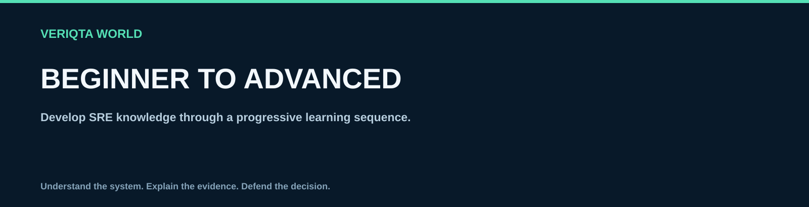

# Beginner to advanced

Develop SRE knowledge through a progressive learning sequence.

## Explore

- [01 what sre is and why it matters](01-what-sre-is-and-why-it-matters.md)
- [02 reliability availability durability and resilience](02-reliability-availability-durability-and-resilience.md)
- [03 user journeys and business risk](03-user-journeys-and-business-risk.md)
- [04 service ownership and dependencies](04-service-ownership-and-dependencies.md)
- [05 production responsibility and operating models](05-production-responsibility-and-operating-models.md)
- [06 toil and engineering work](06-toil-and-engineering-work.md)
- [07 service level indicators](07-service-level-indicators.md)
- [08 service level objectives](08-service-level-objectives.md)
- [09 service level agreements](09-service-level-agreements.md)
- [10 error budgets and reliability policy](10-error-budgets-and-reliability-policy.md)
- [11 reliability measurement and data quality](11-reliability-measurement-and-data-quality.md)
- [12 observability fundamentals](12-observability-fundamentals.md)
- [13 alerting and burn rates](13-alerting-and-burn-rates.md)
- [14 on call and escalation](14-on-call-and-escalation.md)
- [15 incident response](15-incident-response.md)
- [16 production debugging](16-production-debugging.md)
- [17 postmortems and learning](17-postmortems-and-learning.md)
- [18 automation and change safety](18-automation-and-change-safety.md)
- [19 production readiness](19-production-readiness.md)
- [20 release reliability and rollback](20-release-reliability-and-rollback.md)
- [21 capacity planning](21-capacity-planning.md)
- [22 performance and load](22-performance-and-load.md)
- [23 distributed system failure behaviour](23-distributed-system-failure-behaviour.md)
- [24 resilience and dependency handling](24-resilience-and-dependency-handling.md)
- [25 backup and disaster recovery](25-backup-and-disaster-recovery.md)
- [26 data and network reliability](26-data-and-network-reliability.md)
- [27 cloud and kubernetes reliability](27-cloud-and-kubernetes-reliability.md)
- [28 security and reliability](28-security-and-reliability.md)
- [29 sre teams culture and leadership](29-sre-teams-culture-and-leadership.md)
- [30 reliability maturity and continuous improvement](30-reliability-maturity-and-continuous-improvement.md)

[Return to SRE-WORLD](../README.md)
