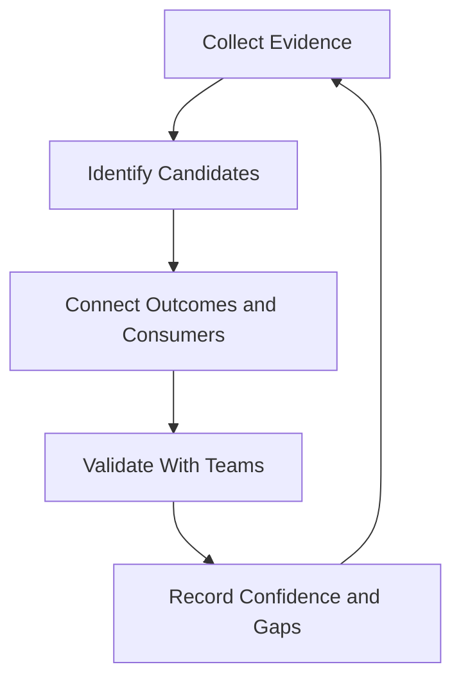
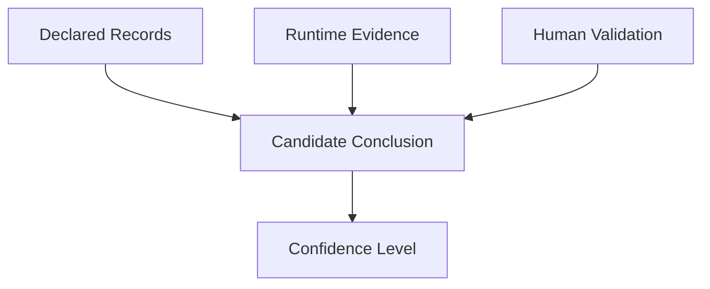

# Identifying Production Services

> An organization cannot assign, govern, or improve service ownership until it knows what it operates. Service discovery turns scattered runtime evidence into a reviewable inventory of production services, dependencies, owners, and unresolved questions.

## Section Purpose

Production estates rarely match their official diagrams.

Services are created, renamed, split, merged, migrated, and retired. Teams reorganize. Repositories outlive their original owners. Scheduled jobs operate quietly for years. Internal APIs become critical dependencies. A platform may support hundreds of workloads while remaining absent from the official service list.

An organization may believe it operates 50 services while production evidence reveals:

- 73 deployed applications
- 18 scheduled workloads
- 11 shared infrastructure services
- 9 data pipelines
- 6 undocumented APIs
- 4 control-plane services
- 3 legacy applications containing several independently operated service areas
- 2 systems whose current owners cannot be identified

The first task in service ownership is therefore discovery.

This section explains how to:

- Find production services across organizational and technical records
- Recognize different forms of production service
- Compare declared ownership with runtime reality
- Map repositories to deployed services
- Discover services through traffic, telemetry, deployments, dependencies, and operational work
- Record uncertainty without inventing ownership
- Distinguish a service from a component, resource, workload, and capability
- Produce an initial production service inventory

This section identifies candidate services. It does not define final service boundaries in detail. Detailed boundary design belongs in [Section 2: Defining Service Boundaries](./02-Defining-Service-Boundaries.md).

---

## Learning Objectives

After completing this section, you should be able to:

1. Explain why service discovery must use several evidence sources.
2. Identify user-facing and internal production services.
3. Recognize APIs, platforms, data pipelines, scheduled workloads, background workers, control planes, and shared infrastructure as possible services.
4. Find services hidden inside large applications.
5. Detect unknown and undocumented production systems.
6. Connect source repositories to deployed services without assuming a one-to-one relationship.
7. Use runtime, traffic, telemetry, deployment, dependency, and operational evidence during discovery.
8. Distinguish a service from a component, resource, workload, and capability.
9. Record confidence, evidence, ownership status, and unresolved questions.
10. Build an initial production service inventory.

---

## 1. What Service Identification Means

Service identification is the systematic discovery and recording of systems that deliver or support production outcomes.

It answers:

- What is running in production?
- What useful outcome does it provide?
- Who or what consumes it?
- Where does it run?
- How is it changed?
- What does it depend on?
- What depends on it?
- Who appears to own it?
- What evidence supports that conclusion?
- Which facts remain unknown?

The immediate result is a set of candidate service records.

These records are provisional. Later review may:

- Confirm a candidate as a service
- Split one candidate into several services
- Combine duplicate records
- Reclassify a candidate as a component or resource
- Mark a system for retirement
- Escalate an ownership gap

Discovery should reveal uncertainty rather than conceal it.

---

## 2. Discovery Is Not Final Boundary Design

Service identification and service-boundary design are related but different activities.

| Activity | Primary question | Output |
| --- | --- | --- |
| Service identification | What might the organization operate as a service? | Candidate inventory |
| Boundary design | Where should each service begin and end? | Confirmed service definition |

During discovery, it is acceptable to record:

> The billing application appears to contain invoice generation, tax calculation, payment reconciliation, and customer-statement capabilities. Further review is required to determine whether these are one service or several services.

It is not necessary to settle that question immediately.

Premature boundary decisions can hide evidence. The discovery stage should first expose the complete operating environment.

---

## 3. Why Official Inventories Are Usually Incomplete

An official spreadsheet or service catalog is useful evidence. It is not automatically the truth.

Inventories become incomplete because:

- Teams create systems without registering them
- Temporary services become permanent
- Repositories are renamed without updating records
- Services move between teams
- Migrations leave old and new systems running together
- Scheduled jobs receive less attention than interactive applications
- Internal services are omitted because customers do not access them directly
- Shared infrastructure is treated as equipment instead of a service
- Acquired systems use different naming and ownership conventions
- Decommissioned systems remain partially active
- Production experiments are never formally classified
- Documentation records intended architecture rather than current runtime behavior

A service inventory should therefore be treated as a maintained claim that must be tested against evidence.

---

## 4. The Discovery Principle

Use this rule:

> If a running system provides an outcome that people or other systems depend on, it should be investigated as a candidate service.

This rule does not mean that every process, virtual machine, container, queue, database, or function becomes a separate service.

It means that discovery should not exclude a system merely because it is:

- Internal
- Small
- Old
- Automated
- Infrequently used
- Not connected to a graphical interface
- Managed by an infrastructure team
- Deployed from a shared repository
- Missing from official documentation

Candidate status begins investigation. It does not settle classification.

---

## 5. Start With Outcomes, Not Technology

Technology names produce weak inventories.

Weak entries:

- Kubernetes
- Database
- API
- Linux server
- Cloud account
- Queue
- Repository

Stronger entries:

- Customer Authentication Service
- Payment Authorization Service
- Payroll Submission Service
- Deployment Control Service
- Customer Notification Service
- Order Reconciliation Pipeline
- Certificate Issuance Service

The stronger names suggest what the system provides.

Ask:

1. Who or what depends on this system?
2. What outcome does it provide?
3. What happens when it is unavailable, incorrect, delayed, or lost?
4. Does it have a distinct runtime, support obligation, change path, or owner?
5. Is it operated independently enough to require an ownership record?

Technology still matters. It belongs in the implementation fields of the inventory, not as the complete service identity.

---

## 6. The Service Discovery Loop



Discovery is iterative.

New evidence may reveal:

- An unknown dependency
- A second deployment of the same service
- A scheduled process that owns critical state
- A repository that produces several services
- A service that no longer has an active consumer
- A named owner who no longer has authority or knowledge

The inventory improves through repeated validation.

---

## 7. What Belongs in an Initial Service Inventory

The first inventory should contain enough information to support validation. It should not attempt to become the final service catalog immediately.

Recommended fields:

| Field | Purpose |
| --- | --- |
| Candidate ID | Provides a stable discovery reference |
| Candidate name | Gives the system a recognizable working name |
| Description | States what it appears to provide |
| Consumer | Identifies people, teams, or systems that depend on it |
| Outcome | Records the value or function delivered |
| Candidate type | Records the initial classification |
| Production evidence | Shows why the candidate is believed to exist |
| Runtime location | Records where it appears to run |
| Deployment mechanism | Records how it is changed |
| Source repositories | Connects runtime to source where known |
| Upstream dependencies | Records what the candidate needs |
| Downstream consumers | Records what depends on it |
| Data or state | Identifies important persistent information |
| Suspected owner | Records the team that may own it |
| Ownership status | Distinguishes verified, suspected, disputed, and unknown ownership |
| Criticality indication | Records an initial impact signal without final tiering |
| Lifecycle indication | Records whether it appears active, legacy, experimental, or retiring |
| Evidence sources | Makes the discovery traceable |
| Confidence | Shows the strength of the current conclusion |
| Open questions | Prevents assumptions from becoming facts |
| Last checked | Supports future verification |

Do not allow an empty owner field to remove a service from the inventory. Unknown ownership is a finding.

---

## 8. Candidate Identifiers

Assign a stable candidate identifier during discovery.

Example:

```text
DISC-SVC-001
DISC-SVC-002
DISC-SVC-003
```

A discovery identifier should:

- Remain stable while the candidate is investigated
- Avoid embedding a team name that may change
- Avoid embedding a technology that may be replaced
- Support duplicate detection
- Allow evidence and review notes to reference the same candidate

The final service identifier may differ after boundary and catalog review.

---

## 9. User-Facing Services

A user-facing service directly supports an outcome experienced by an external or internal human user.

Examples:

- Customer login
- Online checkout
- Account recovery
- Document upload
- Payroll submission
- Patient-record retrieval
- Customer support portal
- Employee expense submission

Discovery questions:

- Which user action depends on the service?
- Where does the journey begin?
- What result does the user expect?
- Which application or API accepts the request?
- Which downstream systems complete the outcome?
- Which failures can occur while the interface still appears healthy?

User-facing services are often the easiest to recognize, but their internal dependencies may be poorly documented.

---

## 10. Internal Services

Internal services provide outcomes to employees, engineering teams, business units, or other systems.

Examples:

- Identity verification for internal applications
- Pricing calculation
- Fraud scoring
- Internal search
- Employee directory
- Deployment orchestration
- Feature configuration
- Audit-event collection
- Secrets distribution

An internal service can be highly critical.

Its failure may:

- Block customer-facing services
- Stop deployments
- Prevent employees from working
- Delay financial processing
- Remove administrative control
- Create security exposure
- Break regulatory reporting

Do not exclude a service because its users are inside the organization.

---

## 11. APIs as Candidate Services

An API is an interface. It may expose a service, expose part of a service, or combine several services.

Investigate an API as a candidate service when it has:

- A defined consumer
- A meaningful outcome
- Independent deployment or operation
- Versioning or compatibility obligations
- Distinct data or state
- Separate support expectations
- Material failure consequences

Do not automatically create one service record per endpoint.

For example:

| Item | Likely interpretation |
| --- | --- |
| `POST /payments/authorize` | Endpoint within a payment authorization service |
| Public Payments API | Interface exposing several payment capabilities |
| Tax Calculation API operated by a separate team | Possible independent internal service |
| Health-check endpoint | Component interface, not a service outcome |

Record the API, its consumers, and its runtime evidence. Confirm the final service relationship during boundary design.

---

## 12. Platforms as Candidate Services

A platform provides reusable capabilities to internal consumers.

Examples:

- Application deployment platform
- Managed Kubernetes platform
- Internal database platform
- Identity platform
- Messaging platform
- Observability platform
- Data-processing platform
- Machine-learning platform

A platform may contain several services.

For example, an internal application platform may provide:

- Workload deployment
- Secret delivery
- Service discovery
- Logging
- Certificate issuance
- Runtime policy enforcement

During discovery, record both the platform-level capability and any independently operated candidate services within it.

Do not decide immediately that the entire platform is one service. Do not decide immediately that every platform component is a service. Preserve the evidence for Section 2.

---

## 13. Data Pipelines as Candidate Services

Data pipelines frequently disappear from inventories because they do not respond to interactive requests.

Examples:

- Order-event ingestion
- Financial reconciliation
- Analytics data transformation
- Fraud-model feature generation
- Regulatory report preparation
- Search-index updates
- Inventory synchronization
- Customer-notification event processing

A pipeline provides a service when a consumer depends on its output being:

- Complete
- Correct
- Timely
- Ordered where required
- Durable where required
- Available for downstream processing

Discovery evidence may include:

- Workflow definitions
- Scheduler records
- Queue consumers
- Stream-processing jobs
- Data lineage
- Warehouse tables
- Failed-job alerts
- Operational tickets
- Dependency configuration

Record the producer, transformation, destination, consumer, schedule, state, and suspected owner.

---

## 14. Scheduled Workloads

Scheduled workloads execute at defined times or intervals.

Examples:

- Payroll generation
- Billing runs
- Certificate renewal
- Backup verification
- Daily settlement
- Report generation
- Data retention cleanup
- Account reconciliation
- Inventory import

A scheduled workload may be a service, part of a service, or an operational task.

Investigate:

- Who depends on its completion?
- What deadline applies?
- What counts as success?
- What happens when it runs late?
- Can it be retried safely?
- Does it maintain state?
- Who responds to failure?
- Where is its schedule defined?
- How is execution history retained?

A job that runs for five minutes each night may support a business process that operates all day.

---

## 15. Background Workers

Background workers process work outside the immediate request path.

Examples:

- Email delivery workers
- Image-processing workers
- Payment reconciliation workers
- Queue consumers
- Report-generation workers
- Search-index workers
- Notification workers
- Data-enrichment workers

They are often hidden because:

- Users do not call them directly
- Front-end requests return before the work completes
- They share repositories with APIs
- They use generic deployment names
- Their failures appear as delay instead of unavailability

Discovery should record:

- Work accepted
- Queue or trigger
- Completion expectation
- Retry behavior
- Dead-letter path
- Idempotency requirement
- Backlog evidence
- Downstream result
- Owner

Do not classify every worker process as a separate service. Determine whether it delivers an independently meaningful outcome or forms part of a larger service.

---

## 16. Control-Plane Services

A control plane changes, coordinates, or governs other systems.

Examples:

- Deployment control
- Cluster management
- Identity administration
- Policy distribution
- Certificate issuance
- Configuration distribution
- Traffic-management control
- Secrets management
- Service registration

Control-plane services may not handle normal user traffic, but their failure can remove the organization's ability to:

- Deploy
- Roll back
- Scale
- Restore
- Rotate credentials
- Change traffic routes
- Revoke access
- Recover from another failure

Discovery questions:

- What systems does the control plane govern?
- Does the data plane continue operating when it fails?
- Which emergency actions depend on it?
- Who has administrative access?
- Is there an alternative control path?
- Which production changes originate from it?

Control-plane discovery is essential because these systems often create large shared failure domains.

---

## 17. Shared Infrastructure Services

Shared infrastructure can provide a service even when it is described as a resource pool.

Examples:

- Domain name resolution
- Network connectivity
- Load-balancing capability
- Certificate management
- Central identity
- Artifact storage
- Container registry
- Time synchronization
- Central logging
- Backup service
- Message delivery

Ask whether other teams consume a managed outcome.

For example:

- A network device is a resource.
- Managed connectivity between production environments is a service capability.
- A database instance is a resource.
- A managed database offering with provisioning, backup, recovery, support, and lifecycle obligations may be a platform service.

The inventory should name the provided outcome, not only the supporting equipment.

---

## 18. Services Hidden Inside Large Applications

A monolithic application can contain several service-like areas even when it is deployed as one unit.

Possible indicators include:

- Different user groups
- Distinct business outcomes
- Separate operational owners
- Independent failure patterns
- Different data obligations
- Separate support commitments
- Separate release schedules hidden behind one deployment
- Internal modules used by external systems
- Background processes with their own deadlines

Example:

```text
Enterprise Finance Application
├── Invoice Creation
├── Tax Calculation
├── Payment Reconciliation
├── Customer Statements
└── Regulatory Reporting
```

This observation does not prove that five services exist.

Record each area as a candidate or sub-candidate, then collect evidence about consumers, operation, ownership, change, data, and failure impact.

Avoid equating deployment architecture with service identity.

---

## 19. Unknown and Undocumented Production Systems

Unknown systems are not rare exceptions. They are a predictable result of long-lived production environments.

Common examples:

- A virtual machine nobody remembers provisioning
- A scheduled script owned by a departed employee
- An API used by one external partner
- A legacy database that still receives writes
- A queue consumer deployed outside the standard pipeline
- A cloud function created during an incident
- A duplicate service left after migration
- A manually maintained certificate process
- An old integration that still transfers money or data

Do not immediately disable an unknown system.

First determine:

- Whether it is active
- Whether it receives traffic
- Whether it changes data
- Whether it has downstream consumers
- Whether it participates in a critical business process
- Whether stopping it would create user, financial, security, or compliance harm

Unknown does not mean unused.

---

## 20. Discovery Through Organizational Records

Begin with existing records, but treat them as claims to verify.

Useful sources include:

- Service catalogs
- Asset inventories
- Architecture diagrams
- Team documentation
- Ownership spreadsheets
- Business capability maps
- Continuity plans
- Risk registers
- Compliance scope records
- Vendor registers
- Cost-center records
- Support directories
- On-call schedules
- Incident records
- Change calendars
- Project portfolios
- Acquisition inventories

Organizational records help identify intent and responsibility. Runtime evidence shows what actually operates.

---

## 21. Repository-to-Service Mapping

Repositories and services rarely have a reliable one-to-one relationship.

Possible relationships:

| Repository pattern | Service relationship |
| --- | --- |
| One repository, one deployment | May represent one service |
| One repository, several deployments | May produce several services or service components |
| Several repositories, one runtime outcome | May collectively implement one service |
| Shared library repository | Supports services but is not normally a production service |
| Infrastructure repository | May create resources for many services |
| Configuration repository | May control several independent services |
| Archived repository | May still correspond to a running, unchanged service |
| Active repository | May not deploy to production |

For each repository, investigate:

- Build outputs
- Deployment targets
- Runtime names
- Environment configuration
- Owning team
- Release pipeline
- Connected infrastructure definitions
- Service metadata
- Referenced secrets and dependencies
- Recent production changes

Do not conclude that a service does not exist because its repository is inactive. Stable legacy software can continue running for years.

---

## 22. Runtime Discovery

Runtime discovery examines what is actually executing.

Possible evidence includes:

- Running processes
- Virtual machines
- Containers
- Cluster workloads
- Serverless functions
- Managed application services
- Batch executions
- Workflow engines
- Queue consumers
- Database sessions
- Listening network services
- Service-registration records
- Scheduled tasks

For each runtime object, collect where permitted:

- Runtime identifier
- Environment
- Region or location
- Image, package, or artifact
- Start time
- Deployment source
- Labels or tags
- Network identity
- Service account
- Connected data stores
- Traffic source
- Suspected owner

A runtime object is discovery evidence. It is not automatically a service.

---

## 23. Discovering Services Through Traffic

Traffic reveals active relationships that documents may omit.

Sources may include:

- Load-balancer routing
- Gateway configuration
- Reverse-proxy configuration
- Domain name records
- Network-flow records
- Service-mesh telemetry
- API gateway records
- Message-broker routing
- Queue producers and consumers
- Database connection activity
- External endpoint scans performed with authorization

Traffic analysis can reveal:

- Active public endpoints
- Undocumented internal APIs
- Unexpected consumers
- Legacy callers
- Cross-region communication
- Direct database access
- Bypassed gateways
- Hidden shared dependencies
- Services that receive no observed traffic

Absence of observed traffic is not proof that a service is unused. Traffic may be seasonal, scheduled, sampled, encrypted, or outside the observation point.

---

## 24. Discovering Services Through Telemetry

Telemetry provides clues about service identity and behavior.

Review:

- Metrics
- Logs
- Traces
- Events
- Health checks
- Dashboards
- Alerts
- Synthetic tests
- Audit records
- Error reports

Useful discovery fields include:

- Service name
- Environment
- Deployment version
- Runtime instance
- Request route
- Dependency name
- Owning team label
- Region
- Data store
- Consumer identity

Telemetry can be misleading when:

- Service names are inconsistent
- Several systems use the same generic name
- Old services continue emitting data
- Development and production data are mixed
- Instrumentation covers only part of a request path
- Ownership labels are stale
- Sampling hides low-volume dependencies

Use telemetry as evidence, not as the only inventory source.

---

## 25. Discovering Services Through Deployment Records

Deployment systems reveal what the organization intentionally changes.

Review:

- Build pipelines
- Release pipelines
- Deployment manifests
- Environment promotion records
- Artifact registries
- Container registries
- Infrastructure change records
- Configuration releases
- Feature-release records
- Rollback history
- Manual deployment logs

Deployment evidence can connect:


Look for:

- Multiple production targets from one repository
- Runtime workloads without pipeline records
- Pipelines that no longer deploy
- Artifacts used by several services
- Manual production changes
- Separate configuration deployments
- Ownership differences between source and runtime

Deployment records show change paths. They do not by themselves define the service.

---

## 26. Discovering Services Through Dependencies

Known services often reveal unknown services.

For every candidate, ask:

- What must be available before it can start?
- What must remain available while it operates?
- Where does it obtain identity, configuration, secrets, time, and network resolution?
- Which APIs does it call?
- Which queues does it publish to or consume from?
- Which data stores does it read and write?
- Which systems consume its outputs?
- Which administrative systems are required for recovery?

Dependency investigation can uncover:

- Internal services missing from the catalog
- Shared control planes
- Vendor services
- Manual file transfers
- Hidden databases
- Single-person operational processes
- Old integrations
- Circular dependencies

Record both technical and organizational dependencies.

---

## 27. Discovering Services Through Operational Work

Operational work reveals systems that formal architecture overlooks.

Review:

- Incident tickets
- Support queues
- Access requests
- Certificate renewals
- Backup tasks
- Restart procedures
- Maintenance calendars
- Capacity requests
- Recovery tests
- Security exceptions
- Audit findings
- Recurring manual reports
- Escalation records

Ask operators:

- Which system wakes you at night?
- Which failure has no clear owner?
- Which job must be checked manually?
- Which service cannot be safely restarted?
- Which dependency is missing from diagrams?
- Which system would surprise leadership if it failed?
- Which production task depends on one person's memory?

People performing the work often know about services that catalogs do not.

---

## 28. Evidence Triangulation

No single discovery source is sufficient.

Use at least two independent sources before treating a candidate as verified.

Examples:

| Evidence combination | What it supports |
| --- | --- |
| Deployment record plus running workload | Confirms that an artifact is deployed |
| Traffic record plus consumer confirmation | Confirms active consumption |
| Repository plus pipeline plus runtime | Connects source to production |
| Incident record plus dependency telemetry | Confirms operational relevance |
| Scheduler record plus output table updates | Confirms active batch processing |
| Catalog record plus team confirmation | Confirms declared ownership, but still requires runtime validation |



When evidence conflicts, record the conflict.

Example:

> The catalog assigns the service to the Commerce Platform team. Deployment records identify the Payments team. Both teams report that they only support part of the system. Ownership is disputed.

---

## 29. Confidence Levels

Every candidate should receive a discovery confidence level.

| Confidence | Meaning |
| --- | --- |
| Confirmed | Runtime, outcome, consumer, and ownership evidence have been validated |
| High | Several evidence sources agree, but one material fact remains unverified |
| Medium | The system clearly exists, but outcome, relationship, or ownership remains uncertain |
| Low | Evidence is incomplete, stale, or conflicting |
| Unknown | A possible production system has been found but not yet investigated |

Confidence should apply to specific claims where possible.

For example:

- Existence: confirmed
- Production use: high confidence
- Source repository: medium confidence
- Ownership: low confidence
- Criticality: unknown

This is more useful than applying one confidence label to the complete record.

---

## 30. Ownership Status During Discovery

Use explicit ownership states.

| Status | Meaning |
| --- | --- |
| Verified | The team confirms ownership and has supporting knowledge and authority |
| Declared | A record names the team, but operational ownership has not been tested |
| Suspected | Evidence suggests a team, but the team has not confirmed ownership |
| Shared | Several teams perform defined ownership functions |
| Disputed | Teams disagree about accountability or scope |
| Transitional | Ownership is being transferred |
| Orphaned | No accountable team can be established |
| Unknown | Ownership investigation has not been completed |

A team name in a repository file proves only that the name was recorded. It does not prove current ownership capability.

---

## 31. Service, Component, Resource, Workload, or Capability

These concepts should not be treated as synonyms.

| Concept | Working meaning | Example |
| --- | --- | --- |
| Service | Delivers a defined outcome to users or dependent systems | Payment authorization |
| Component | Implements part of a service | Authorization rules engine |
| Resource | Technical asset used by a component or service | Database instance |
| Workload | Executing application, job, or process | Payment worker deployment |
| Capability | Ability made available to produce outcomes | Secure payment processing |
| Interface | Means through which a consumer interacts | Payments API |

The classification depends on context.

A database may be:

- A resource inside one service
- A shared component supporting several services
- Part of a managed database platform service

A queue consumer may be:

- A workload inside an order service
- An independently owned notification service
- One stage in a data pipeline

Use evidence about outcome, consumer, operation, change, state, and ownership.

---

## 32. Candidate Classification Test

Use these questions to form an initial classification.

### Outcome

- Does the item provide a recognizable result?
- Would a user or dependent system notice its failure?

### Consumer

- Is there a defined person, team, application, or process that depends on it?

### Operation

- Is it operated, supported, or recovered as a meaningful unit?

### Change

- Can it be deployed, configured, or changed independently?

### State

- Does it own or transform important state?

### Responsibility

- Does a team accept responsibility for its outcome?

### Failure

- Does its failure create a distinct service or business consequence?

Interpretation:

- Strong evidence across most questions suggests a candidate service.
- A useful technical unit without an independent outcome is more likely a component.
- A provisioned asset is more likely a resource.
- A running process is a workload until its service relationship is established.
- An ability offered across several services may be a capability.

This test supports discovery. It does not replace the boundary analysis in Section 2.

---

## 33. One Repository Is Not Always One Service

Consider a repository called `commerce-platform`.

It builds:

- A public checkout API
- A payment-event worker
- A daily reconciliation job
- An administrative portal
- A schema-migration utility

Possible interpretation:

| Build output | Initial discovery status |
| --- | --- |
| Checkout API | Candidate user-facing service or component |
| Payment-event worker | Candidate component of checkout or payment processing |
| Reconciliation job | Candidate scheduled service because finance depends on its result |
| Administrative portal | Candidate internal service or interface |
| Migration utility | Operational tool, not necessarily a service |

The repository gives discovery evidence. Consumers, outcomes, runtime operation, ownership, and failure impact determine the eventual service model.

---

## 34. One Service Is Not Always One Repository

A customer authentication service may depend on:

- An API repository
- A policy repository
- An identity-event worker repository
- Infrastructure definitions
- Database migration code
- Client libraries
- Configuration records

The service inventory should not create six services merely because six repositories exist.

Record the relationship between each repository and the candidate service:

- Implements runtime behavior
- Provides configuration
- Creates infrastructure
- Contains schemas
- Provides client integration
- Contains operational automation
- Contains documentation

This relationship becomes important when ownership differs across repositories.

---

## 35. Naming Candidate Services

Use names that describe outcomes and remain useful when technology changes.

Good characteristics:

- Recognizable to consumers
- Specific enough to distinguish the candidate
- Independent of current hosting technology
- Independent of temporary team structure
- Consistent with business or service language

Weak name:

> Kubernetes Backend Two

Stronger name:

> Customer Notification Service

Weak name:

> John's Cron

Stronger name:

> Daily Payment Reconciliation Job

Retain technical aliases in a separate field so engineers can connect service language to runtime identifiers.

---

## 36. Discovery Interviews

Interview people who build, operate, support, secure, fund, and depend on production systems.

Possible participants:

- Application engineers
- SREs
- Platform engineers
- Infrastructure engineers
- Network engineers
- Database engineers
- Security teams
- Data engineers
- Support teams
- Product managers
- Business process owners
- Finance or risk teams
- Vendor managers

Useful questions:

1. Which production outcomes does your team provide?
2. Which systems do other teams depend on you to operate?
3. Which systems does your team depend on?
4. Which production deployments can your team perform?
5. Which failures does your team respond to?
6. Which service is missing from the official catalog?
7. Which system has unclear ownership?
8. Which scheduled work would cause harm if it stopped?
9. Which legacy system still receives traffic or data?
10. Which shared service creates the largest failure exposure?
11. Which system cannot be safely changed today?
12. Which service name differs across code, runtime, dashboards, and business records?

Validate answers with technical evidence where possible.

---

## 37. Discovery Through Incidents

Incident history provides evidence about real production relationships.

Review incidents for:

- Services named during response
- Systems that caused user impact
- Dependencies discovered during diagnosis
- Teams contacted for assistance
- Delays caused by unclear ownership
- Unknown systems found during recovery
- Control planes needed for mitigation
- Manual jobs used to restore service
- Systems excluded from follow-up work

An incident may reveal that the official service model is wrong.

Example:

> The checkout service was documented as depending only on payment authorization and order storage. An incident revealed that it also depended on an undocumented feature-configuration service for every transaction.

Add the discovered candidate and record the incident as evidence.

---

## 38. Discovery Through Cost and Billing Records

Cost records can reveal production systems and owners.

Review:

- Cloud accounts
- Subscriptions
- Projects
- Resource tags
- Cost centers
- Vendor invoices
- Software subscriptions
- Reserved capacity
- Data-transfer charges
- Managed-service charges

Cost evidence may reveal:

- Untagged production resources
- Systems charged to obsolete teams
- Duplicate environments
- Forgotten services
- Unapproved vendor dependencies
- Shared services with unclear cost ownership

Cost ownership is not necessarily service ownership. It is a discovery lead.

---

## 39. Discovery Through Data

Persistent data can reveal services whose applications are difficult to identify.

Investigate:

- Active databases
- Table write activity
- Object-storage access
- Data-stream producers and consumers
- Warehouse lineage
- Backup jobs
- Retention policies
- Data exports
- File transfers
- Replication relationships

Questions:

- Which system writes this data?
- Which consumers read it?
- What business record does it represent?
- Who can change its schema?
- Which application would fail if it disappeared?
- Does the data outlive the service that created it?

Do not access sensitive data contents merely for inventory discovery. Use authorized metadata and activity evidence.

---

## 40. Discovery Safety

Service discovery must not create a production incident.

Safe practices include:

- Use read-only access where possible
- Follow authorization and privacy requirements
- Avoid broad active scans without approval
- Protect credentials and service metadata
- Do not restart or modify unknown systems to test ownership
- Do not delete resources because they appear unused
- Rate-limit approved queries
- Avoid exposing sensitive network or security details in public inventories
- Record how evidence was collected
- Escalate suspicious or unsafe findings through the correct channel

An unknown system should be contained or changed only through an authorized risk decision.

---

## 41. Discovery Scope

Define scope before beginning.

Possible scope dimensions:

- Business unit
- Product
- Environment
- Cloud account
- Data center
- Region
- Cluster
- Network zone
- Repository organization
- Critical business process
- Regulatory scope
- Acquisition

A scope statement should include:

- Included environments
- Excluded environments
- Evidence sources
- Time period
- Access limitations
- Responsible team
- Review deadline
- Escalation route

Example:

> This discovery covers production workloads supporting online ordering in the primary and recovery regions. Development environments and employee productivity systems are excluded. Evidence will be collected from deployment records, runtime metadata, traffic records, incidents, and team interviews.

---

## 42. Discovery Roles

Service discovery is a shared activity.

| Role | Contribution |
| --- | --- |
| Discovery coordinator | Defines scope, method, records, and review schedule |
| Service teams | Explain outcomes, runtime, changes, and dependencies |
| SRE | Contributes production, incident, and reliability evidence |
| Platform and infrastructure teams | Identify shared capabilities and workloads |
| Security | Identifies controlled systems and safe discovery methods |
| Data teams | Contribute lineage and state relationships |
| Product and business owners | Validate consumers and valuable outcomes |
| Support teams | Reveal user impact and undocumented systems |
| Governance or risk teams | Identify critical records and unresolved ownership exposure |

SRE should not be expected to invent ownership for every discovered service.

---

## 43. Initial Criticality Indications

Detailed service tiering belongs in Section 5. Discovery should still record signs of importance.

Initial indicators include:

- Direct customer impact
- Revenue dependency
- Safety consequences
- Security function
- Regulatory obligation
- Critical data
- No alternative process
- High downstream dependency count
- Recovery dependence
- Time-sensitive execution
- Large user population
- Administrative control

Use preliminary labels such as:

- Criticality review required
- High-impact indication
- Standard-impact indication
- Low-impact indication
- Unknown

Do not assign a final tier without the required business and risk review.

---

## 44. Lifecycle Indications

Detailed lifecycle states belong in Section 4. Discovery should record what the evidence suggests.

Possible indications:

- Active
- New or experimental
- Legacy
- Deprecated
- Migration source
- Migration target
- Retirement candidate
- Apparently inactive
- Unknown

An apparently inactive service still requires validation before retirement.

---

## 45. Duplicate and Conflicting Records

Duplicate entries are common when names differ across teams and systems.

Example aliases:

- `auth-api`
- `identity-prod`
- `login-service`
- `customer-access`

They may describe:

- The same service
- Separate components
- Old and new versions
- Different environments
- Different services with similar purposes

Before merging records, compare:

- Outcomes
- Consumers
- Runtime identities
- Endpoints
- Repositories
- Deployments
- Data stores
- Owners
- Dependencies

Retain aliases in the candidate record.

---

## 46. Discovery Gaps and Exceptions

Record incomplete access and evidence limitations.

Examples:

- Runtime metadata unavailable in one environment
- Traffic retention covers only seven days
- Acquired-system documentation has not been transferred
- Vendor dependency details are contract-restricted
- Ownership contact is unavailable
- Legacy deployment history does not exist
- Telemetry labels conflict with catalog names

For every gap, record:

- What is missing
- Why it matters
- Who can resolve it
- Required action
- Due date or review trigger
- Risk if unresolved

Unrecorded uncertainty becomes false confidence.

---

## 47. Common Discovery Mistakes

### Starting and Ending With the Catalog

The catalog may be incomplete or stale.

### Treating Every Runtime Object as a Service

Runtime objects are evidence. Many are replicas, components, jobs, or resources.

### Treating Every Repository as a Service

Repositories and services have many-to-many relationships.

### Looking Only for Public Applications

Internal, batch, platform, control-plane, and infrastructure services can be critical.

### Ignoring Low-Traffic Systems

Emergency, monthly, seasonal, or regulatory services may be used infrequently but remain important.

### Assigning Ownership From a Stale Label

A recorded team name does not prove current knowledge, capacity, accountability, or authority.

### Removing Unknown Systems Immediately

Unknown systems may support critical processes.

### Demanding Perfect Boundaries During Discovery

Premature precision slows discovery and can hide candidates.

### Ignoring Manual Dependencies

A human approval, file transfer, reconciliation step, or credential process may be essential to the service.

### Publishing Sensitive Inventory Details

Public records should not expose credentials, private endpoints, internal network details, personal contact information, or exploitable architecture information.

---

## 48. A Three-Pass Discovery Method

### Pass 1: Declared Estate

Collect existing records:

- Catalogs
- Repositories
- Diagrams
- Team lists
- Asset records
- Business service records

Output:

- Declared candidate inventory

### Pass 2: Observed Estate

Collect runtime evidence:

- Deployments
- Workloads
- Traffic
- Telemetry
- Schedulers
- Data activity
- Dependencies

Output:

- Observed candidate inventory

### Pass 3: Operated Estate

Collect operational evidence:

- Team interviews
- Incidents
- Support work
- Escalations
- Maintenance
- Recovery activities
- Cost records

Output:

- Validated inventory with ownership states and gaps

Compare the three views.

| Finding | Meaning |
| --- | --- |
| Declared and observed | Recorded system exists in production |
| Declared but not observed | May be inactive, seasonal, renamed, or incorrectly recorded |
| Observed but not declared | Undocumented production candidate |
| Operated but not declared | People support a system missing from formal records |
| Declared owner differs from operator | Possible ownership or responsibility conflict |

---

## 49. Discovery Workflow

Use this sequence:

1. Define the discovery scope.
2. Select evidence sources.
3. Export or record the declared inventory.
4. Collect runtime and deployment evidence.
5. Identify APIs, jobs, workers, pipelines, platforms, and shared infrastructure.
6. Trace traffic and dependencies.
7. Review incidents and operational work.
8. Interview teams and consumers.
9. Create candidate records.
10. Connect repositories to runtime objects.
11. Assign evidence-based confidence.
12. Record ownership status.
13. Flag duplicates, gaps, and conflicts.
14. Review unknown systems safely.
15. Submit candidates for boundary and classification review.

---

## 50. Initial Production Service Inventory Template

Use the following template for the practical output.

```markdown
# Initial Production Service Inventory

## Discovery Scope

- Business area:
- Environments:
- Locations or regions:
- Included systems:
- Excluded systems:
- Evidence period:
- Discovery owner:
- Review date:
- Access limitations:

## Evidence Sources

- [ ] Existing service catalog
- [ ] Repository records
- [ ] Build and deployment records
- [ ] Runtime workloads
- [ ] Traffic records
- [ ] Metrics, logs, and traces
- [ ] Scheduler and workflow records
- [ ] Data lineage or storage activity
- [ ] Dependency records
- [ ] Incident history
- [ ] Support and operational work
- [ ] Cost and billing records
- [ ] Team and consumer interviews
- [ ] Vendor records

## Candidate Summary

| Candidate ID | Candidate name | Type | Consumer | Outcome | Production evidence | Suspected owner | Ownership status | Confidence | Open questions |
| --- | --- | --- | --- | --- | --- | --- | --- | --- | --- |
| DISC-SVC-001 |  |  |  |  |  |  |  |  |  |

## Candidate Record

### Identity

- Candidate ID:
- Working name:
- Aliases:
- Description:
- Candidate type:
- Lifecycle indication:
- Criticality indication:

### Outcome and Consumers

- Outcome provided:
- Human users:
- System consumers:
- Business process supported:
- Consequence if unavailable:
- Consequence if delayed:
- Consequence if incorrect:

### Runtime Evidence

- Environment:
- Runtime location:
- Runtime identifiers:
- Endpoints or triggers:
- Schedules:
- Images or artifacts:
- Service accounts:
- Evidence source:
- Last observed:

### Source and Change

- Source repositories:
- Repository relationship:
- Build pipeline:
- Deployment mechanism:
- Configuration source:
- Last known production change:

### Dependencies and State

- Upstream dependencies:
- Downstream consumers:
- Data stores:
- Queues or streams:
- Control-plane dependencies:
- External providers:
- Manual dependencies:

### Ownership

- Suspected accountable team:
- Technical contacts:
- Operational responders:
- Ownership status:
- Ownership evidence:
- Ownership conflict:

### Confidence

- Existence confidence:
- Production-use confidence:
- Outcome confidence:
- Repository-mapping confidence:
- Ownership confidence:
- Criticality confidence:

### Open Questions

1.
2.
3.

### Required Follow-Up

- Boundary review:
- Classification review:
- Ownership review:
- Criticality review:
- Security review:
- Retirement review:
- Responsible reviewer:
- Review date:
```

---

## 51. Inventory Quality Checks

Before completing the initial inventory, verify:

### Coverage

- [ ] User-facing services were reviewed.
- [ ] Internal services were reviewed.
- [ ] APIs were reviewed.
- [ ] Platforms were reviewed.
- [ ] Data pipelines were reviewed.
- [ ] Scheduled workloads were reviewed.
- [ ] Background workers were reviewed.
- [ ] Control-plane services were reviewed.
- [ ] Shared infrastructure services were reviewed.
- [ ] Large applications were checked for hidden services.
- [ ] Unknown runtime systems were recorded.

### Evidence

- [ ] Every candidate has at least one production evidence source.
- [ ] Important candidates have at least two independent evidence sources.
- [ ] Repository relationships were checked against deployments.
- [ ] Runtime evidence was compared with declared records.
- [ ] Traffic or dependency evidence was reviewed where available.
- [ ] Human validation was recorded.

### Integrity

- [ ] Unknown ownership remains visible.
- [ ] Conflicting evidence is documented.
- [ ] Confidence is stated.
- [ ] Apparently unused systems were not removed without validation.
- [ ] Sensitive details are protected.
- [ ] Collection methods were authorized.
- [ ] Every open question has an owner or review route.

---

## 52. Worked Example

### Discovery Finding

The official inventory contains a `Customer Communications Application` owned by the Customer Platform team.

Runtime and operational review finds:

- A public notification API
- Three queue consumers
- A template-rendering worker
- A scheduled campaign dispatcher
- A delivery-status ingestion pipeline
- A separate suppression-list database
- A certificate-renewal job
- Two repositories
- Four deployment pipelines
- An external email provider
- An external SMS provider
- A support team that manually replays failed messages

### Initial Candidate Records

| Candidate | Initial interpretation | Confidence | Important question |
| --- | --- | --- | --- |
| Customer Notification Service | User-facing or internal messaging outcome | High | Does it include campaign delivery? |
| Campaign Dispatch Service | Scheduled delivery capability | Medium | Is it independently owned and supported? |
| Delivery Status Pipeline | Tracks delivery outcomes | High | Which service owns final status correctness? |
| Template Renderer | Probable component | Medium | Does any consumer use it independently? |
| Suppression List | Data resource or shared compliance service | Low | Who owns correctness and legal obligations? |
| Certificate Renewal Job | Operational workload | High | Which service depends on the certificate? |

### What Discovery Has Established

- The official record hides several runtime and operational elements.
- Repository count does not match candidate-service count.
- Vendor dependencies are part of the operating environment.
- Manual replay is a production dependency.
- Ownership of delivery-status correctness is unclear.

### What Discovery Has Not Established

- The final number of services
- Final service boundaries
- Final criticality tiers
- Complete ownership assignment
- Final support commitments

Those decisions belong in later sections.

---

## 53. Production Scenario: The Forgotten Settlement Job

A financial service inventory lists customer accounts, payment authorization, and transaction history. During a holiday weekend, finance reports that bank settlements have not been generated for two days.

Engineers discover a scheduled workload on an old virtual machine. It reads completed payment records, creates settlement files, encrypts them, and transfers them to a banking partner. The script repository has not changed in three years. Its original author left the organization. No service-catalog record exists.

### Questions

1. Why is the workload relevant to service discovery?
2. What outcome does it provide?
3. Who are its consumers?
4. What production evidence should be collected?
5. Is the old repository evidence that the workload is inactive?
6. Which dependencies should be recorded?
7. What ownership status should be assigned initially?
8. What immediate safety concerns exist?
9. Should the workload be classified as a service immediately?
10. What must be reviewed in Section 2?

### Analysis

The workload supports a time-sensitive financial outcome. It is therefore a production service candidate even though users do not call it interactively.

Evidence should include:

- Scheduler configuration
- Execution history
- Process state
- File generation
- Transfer records
- Data sources
- Banking endpoint
- Encryption and credential dependencies
- Failure notifications
- Finance procedures
- Repository and deployment history

Initial ownership should be recorded as orphaned or unknown. An inactive repository does not prove an inactive runtime.

The organization should not immediately modify or stop the job. It handles financial data and partner transfers. Authorized owners must contain the current failure, verify data state, investigate missed settlements, and establish temporary responsibility.

Boundary review must determine whether settlement is:

- A service
- Part of the payment service
- Part of a broader financial-reconciliation service
- A scheduled workload within another owned outcome

---

## 54. Production Scenario: One Repository, Four Services

A team owns one repository called `identity`. The build creates:

- A public authentication API
- An administrative access API
- A token-cleanup job
- An audit-event exporter

All four run in production. They use different credentials, deployment schedules, consumers, and escalation routes.

### Discovery Decision

Create separate candidate records for investigation.

Do not conclude that four final services exist. Record:

- Each outcome
- Consumers
- Runtime identities
- Change paths
- Data and credentials
- Dependencies
- Operational owners
- Failure consequences

Section 2 will determine whether the final service boundary follows one product outcome, four independently operated outcomes, or another model.

---

## 55. Production Scenario: The Green but Unused Service

A dashboard shows that an old reporting API is healthy. It has produced no errors in six months. The catalog marks it as active.

Traffic evidence shows no requests during the available 30-day retention period.

Do not immediately classify it as unused.

Investigate:

- Monthly, quarterly, and annual use
- Scheduled consumers
- Emergency or regulatory use
- Direct database access
- Alternative service names
- Archived traffic evidence
- Support and business records
- Whether a replacement exists
- Whether data retention obligations remain

The correct inventory state may be active, seasonal, deprecated, retirement candidate, or unknown.

---

## 56. Practical Exercise: Build the Initial Inventory

### Objective

Discover and record production service candidates within a defined scope.

### Step 1: Define Scope

Choose one:

- A personal production project
- An anonymized organizational system
- A fictional company with realistic production systems
- One product area
- One platform environment

Record inclusions, exclusions, evidence sources, and access limitations.

### Step 2: Build the Declared Inventory

Collect at least five candidates from documentation, repositories, catalogs, or diagrams.

### Step 3: Build the Observed Inventory

Use available runtime, deployment, traffic, telemetry, scheduler, or dependency evidence.

### Step 4: Add Hidden Workloads

Explicitly look for:

- One API
- One scheduled workload
- One background worker
- One data pipeline
- One control-plane or shared infrastructure service

If a category does not exist in the selected environment, record the evidence used to reach that conclusion.

### Step 5: Map Repositories

For every candidate, record:

- Repository or repositories
- Build output
- Deployment target
- Runtime identity
- Mapping confidence

### Step 6: Trace Dependencies

Record at least two upstream dependencies and two downstream consumers for each important candidate where applicable.

### Step 7: Validate With People

If working with a real environment, ask at least one builder, operator, or consumer to review the candidates.

If using a fictional environment, write the questions you would ask each role.

### Step 8: Record Uncertainty

Assign evidence confidence and ownership status. Do not fill unknown fields with guesses.

### Step 9: Review Classification

Mark each item as:

- Candidate service
- Probable component
- Probable resource
- Workload awaiting classification
- Capability awaiting service mapping
- Duplicate candidate
- Retirement candidate
- Unknown

### Step 10: Prepare Section 2 Inputs

Select candidates requiring detailed boundary review.

---

## 57. Exercise Acceptance Criteria

The practical output is complete when:

- The discovery scope is explicit.
- At least five production candidates are recorded.
- More than one evidence source is used.
- Interactive and non-interactive workloads are considered.
- Repository relationships are mapped.
- Runtime evidence is included.
- Dependencies are recorded.
- Ownership states are explicit.
- Confidence and uncertainty are visible.
- Unknown systems are not silently excluded.
- Service, component, resource, workload, and capability are distinguished.
- Boundary questions are passed to Section 2 rather than settled without evidence.

---

## 58. Knowledge Check

1. Why should a service catalog not be treated as complete production truth?
2. What makes a system a candidate service during discovery?
3. Why should internal services appear in the inventory?
4. Is every API a service?
5. Why might one platform contain several candidate services?
6. How can a scheduled workload provide a production service?
7. Why are background workers commonly missed?
8. Why are control-plane services important to discover?
9. How can a service be hidden inside a monolithic application?
10. Why should an unknown system not be disabled immediately?
11. Why is repository-to-service mapping many-to-many?
12. What does runtime discovery prove?
13. How can traffic reveal undocumented systems?
14. Why can telemetry names be misleading?
15. What can deployment records establish?
16. How do dependencies reveal additional services?
17. What is evidence triangulation?
18. Why should discovery confidence be recorded?
19. What is the difference between declared and verified ownership?
20. What is the difference between a service and a component?

---

## 59. Knowledge Check Answers

1. Catalog records can be stale, incomplete, duplicated, or based on intended architecture rather than current runtime evidence.
2. It appears to provide an outcome that people or systems depend on and has production evidence requiring investigation.
3. Internal service failure can block customer services, employees, deployments, security controls, data processing, and business operations.
4. No. An API is an interface. It may expose one service, part of a service, or several services.
5. A platform may provide independently operated capabilities with different consumers, changes, dependencies, and support obligations.
6. Other systems or business processes may depend on its correct and timely completion.
7. They operate outside the immediate request path, may share repositories with APIs, and often fail through delay or backlog rather than visible unavailability.
8. Their failure can remove the ability to deploy, recover, change traffic, rotate credentials, or administer production.
9. Distinct outcomes, users, data, operations, and owners may exist within one deployment unit.
10. It may support an undocumented but critical process. Impact and dependencies must be established before change.
11. One repository may produce several deployable outcomes, while one service may be implemented across several repositories.
12. It proves that a workload or resource was observed running. It does not by itself establish the final service identity.
13. Traffic can expose active endpoints, consumers, dependencies, legacy callers, and systems missing from declared records.
14. Labels can be inconsistent, duplicated, stale, incomplete, or mixed across environments.
15. They can connect source, artifacts, change paths, deployment targets, and runtime identities.
16. Tracing upstream and downstream relationships exposes systems that are absent from the initial inventory.
17. It is the use of independent declared, runtime, and human evidence to strengthen or challenge a discovery conclusion.
18. It prevents incomplete or conflicting evidence from being presented as established fact.
19. Declared ownership is recorded somewhere. Verified ownership has been confirmed through current knowledge, accountability, capacity, and authority.
20. A service delivers an outcome to a consumer. A component implements part of that outcome within a service or supporting system.

---

## 60. Reflection Questions

1. Which evidence source in your environment is most trusted, and has that trust been verified?
2. Which class of production workload is most likely to be missing from your inventory?
3. Where do repository names differ from service names?
4. Which shared infrastructure capability could affect the largest number of services?
5. Which scheduled process would cause the greatest harm if it silently stopped?
6. Which ownership record is based only on an old label?
7. Which service candidate has the weakest evidence?
8. Which apparently unused system requires further investigation?
9. Which large application may contain several service outcomes?
10. What discovery access is missing?
11. What sensitive inventory information must remain private?
12. Which candidates should move first into boundary review?

---

## 61. Key Takeaways

- An organization cannot govern services it has not identified.
- Official inventories must be tested against runtime and operational evidence.
- Discovery begins with outcomes and consumers, not technology names.
- User-facing applications are only one form of production service.
- APIs, platforms, data pipelines, jobs, workers, control planes, and shared infrastructure may provide service outcomes.
- Large applications may hide several candidate services.
- Unknown ownership is a finding, not a reason to remove a record.
- Repositories, deployments, workloads, and services do not have simple one-to-one relationships.
- Traffic, telemetry, deployment records, dependencies, incidents, cost, and operational work provide complementary evidence.
- Runtime evidence proves that something operates, not that it is an independent service.
- Service discovery should record confidence, conflicts, and open questions.
- Unknown systems must be investigated safely before modification or retirement.
- The output of this section is an initial candidate inventory.
- Final service boundaries belong in the next section.

---

## Related SRE World Sections

- [SRE Foundations](../01-SRE-Foundations/README.md)
- [What Is SRE?](../01-SRE-Foundations/01-What-Is-SRE.md)
- [Production Responsibility](../01-SRE-Foundations/08-Production-Responsibility.md)
- [Service Ownership](../01-SRE-Foundations/09-Service-Ownership.md)
- [Critical User Journeys](../01-SRE-Foundations/10-Critical-User-Journeys.md)
- [SRE Responsibilities](../01-SRE-Foundations/18-SRE-Responsibilities.md)
- [SRE Foundation Practical Exercises](../01-SRE-Foundations/25-SRE-Foundation-Practical-Exercises.md)
- [Service Ownership](./README.md)

---

## Next Section

[Section 2: Defining Service Boundaries](./02-Defining-Service-Boundaries.md)

---

## Maintained by VERIQTA

SRE World is created and maintained by [VERIQTA](https://github.com/veriqta).

- Website: [veriqta.com](https://www.veriqta.com/)
- GitHub: [github.com/veriqta](https://github.com/veriqta)
- Instagram: [@veriqta](https://www.instagram.com/veriqta/)
- Medium: [veriqta.medium.com](https://veriqta.medium.com/)

> Service ownership begins with an honest account of production. Find what exists, connect it to an outcome, preserve uncertainty, and make every ownership gap visible.
