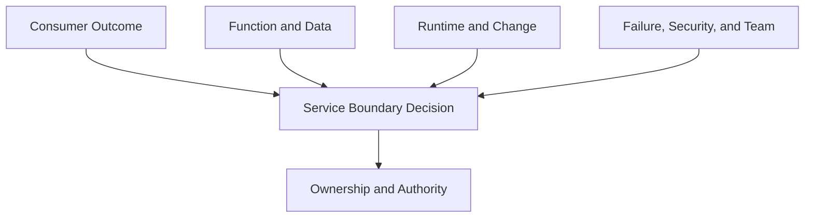

# Defining Service Boundaries

> A service boundary identifies the outcome, consumers, responsibilities, state, runtime behavior, change path, failure exposure, and authority that belong together as one operable service.

## Section Purpose

Section 1 produced an initial inventory of production service candidates. The next task is deciding which candidates represent complete services, which belong together, and which are components, resources, workloads, interfaces, or capabilities inside another service.

This decision matters because a weak boundary creates weak ownership.

If a boundary is too broad:

- No team understands the complete service
- Failures affect unrelated outcomes
- Changes require excessive coordination
- Reliability measurements hide important differences
- Accountability becomes vague
- One ownership record covers systems with different risks

If a boundary is too narrow:

- Every process becomes a service
- Ownership records multiply without improving accountability
- End-to-end outcomes disappear between components
- Teams optimize local health while users still fail
- Dependency and coordination costs increase
- The service catalog becomes difficult to maintain

A useful service boundary is neither the largest possible grouping nor the smallest deployable unit. It is the grouping that makes the production outcome understandable, operable, governable, and accountable.

This section explains how to evaluate:

- User and consumer boundaries
- Functional boundaries
- Runtime boundaries
- Data ownership boundaries
- Deployment boundaries
- Failure boundaries
- Security boundaries
- Team boundaries
- Service and component relationships
- Service and application relationships
- Service and platform relationships
- Service and repository relationships
- Conflicting boundary evidence
- Overly broad and overly narrow boundaries
- Boundary changes during architectural evolution

The practical output is a service boundary record.

---

## Learning Objectives

After completing this section, you should be able to:

1. Explain why service boundaries are operational and organizational decisions, not only architecture decisions.
2. Define a service boundary around a meaningful consumer outcome.
3. Compare user, functional, runtime, data, deployment, failure, security, and team evidence.
4. Explain why no single type of boundary automatically defines a service.
5. Distinguish a service from a component, application, platform, repository, resource, interface, and workload.
6. Detect boundaries that are too broad or too narrow.
7. Resolve conflicting boundary signals through explicit tradeoffs.
8. Record included and excluded responsibilities.
9. Identify cross-boundary dependencies and shared responsibilities.
10. Define ownership and decision authority at the selected boundary.
11. Review boundaries when architecture, users, risk, or team structures change.
12. Produce a complete service boundary record.

---

## 1. What a Service Boundary Is

A service boundary is an explicit statement of what belongs to a service and what does not.

It identifies:

- The outcome delivered
- The consumers served
- The behavior promised
- The functions included
- The runtime elements operated together
- The data and state controlled
- The change mechanisms used
- The failures managed within the service
- The security responsibilities retained
- The accountable team
- The dependencies crossing the boundary
- The decisions the owner may make

A boundary is complete only when another engineer can determine:

1. What the service is expected to do.
2. Which users or systems depend on it.
3. Which production behavior belongs to its owner.
4. Which systems are dependencies rather than owned parts.
5. Who can change, mitigate, recover, transfer, and retire it.

---

## 2. A Boundary Is a Decision, Not a Discovery Fact

Discovery produces evidence. Boundary design interprets that evidence.

The same production estate can support several technically possible boundaries. The organization must choose a model that supports:

- Clear accountability
- Meaningful reliability measurement
- Safe production authority
- Manageable coordination
- Understandable failure behavior
- Sustainable operation
- Appropriate security control
- Controlled architectural evolution

For example, an ordering application may contain:

- Cart management
- Pricing
- Payment authorization
- Order creation
- Customer notification

Possible boundary models include:

- One ordering service
- Ordering and payment as separate services
- Five independently owned services
- One customer-facing service supported by several internal services

The deployment structure alone cannot select the correct model. Consumer outcomes, ownership, change, data, failure, security, and organizational capability must also be considered.

---

## 3. The Boundary Evidence Model

Use several forms of evidence.



The boundary should be explainable from all relevant views.

| Boundary view | Core question |
| --- | --- |
| User or consumer | Who receives the outcome? |
| Functional | Which business or system behavior belongs together? |
| Runtime | Which elements operate as a unit? |
| Data | Who controls authoritative state and its lifecycle? |
| Deployment | Which elements change and roll back together? |
| Failure | Which failures are contained or shared? |
| Security | Which trust and control responsibilities belong together? |
| Team | Which group has knowledge, capacity, and authority? |

Agreement across the views strengthens the boundary. Disagreement requires an explicit decision.

---

## 4. Begin With the Consumer Outcome

The first boundary question is:

> What outcome does a defined consumer depend on this service to provide?

Consumers may be:

- External customers
- Employees
- Administrators
- Partners
- Applications
- APIs
- Data pipelines
- Scheduled business processes
- Other internal services
- Operations teams

A strong outcome statement describes a result.

Weak:

> Runs payment containers.

Stronger:

> Authorizes eligible payment requests and returns a definitive result without creating duplicate financial effects.

Weak:

> Hosts a Kubernetes platform.

Stronger:

> Provides approved teams with a managed environment for deploying and operating supported workloads.

The consumer outcome anchors the other boundary decisions.

---

## 5. User and Consumer Boundaries

A user boundary identifies the people or systems whose outcomes define the service.

Questions include:

- Who initiates the interaction?
- Who receives the result?
- Who decides whether the result is useful?
- Are consumers internal, external, or both?
- Do different consumers receive materially different outcomes?
- Do they have different reliability, security, or support requirements?
- Can one consumer fail while others succeed?
- Is one consumer group hidden by aggregate measurements?

### One Service, Several Consumers

A service may support several consumers when they depend on the same core outcome.

Example:

- Mobile application
- Web application
- Partner API client

All may consume the same payment authorization outcome.

### Several Services, Similar Consumers

The same customer may consume several distinct outcomes.

Example:

- Authenticate account
- Transfer funds
- Download statement

Shared users do not automatically mean one service.

### Boundary Warning

Do not define the service as every system touched during a user journey. A journey may cross several services with separate owners and obligations.

---

## 6. Consumer Contract Boundaries

A consumer contract describes the behavior visible at the service boundary.

It may include:

- Accepted inputs
- Returned outputs
- Success meaning
- Failure meaning
- Correctness expectations
- Timeliness expectations
- Compatibility expectations
- Data-handling expectations
- Support conditions
- Rate or capacity assumptions

The contract does not need to be a legal document or a formal API specification. It must make the visible service behavior clear.

Example:

> When an authorized client submits a valid payment request with a unique transaction identifier, the service returns an accepted, rejected, or unknown result. It must not create more than one financial effect for the same identifier.

This statement helps distinguish the payment service from:

- The client interface
- The bank dependency
- The notification service
- The reporting warehouse

---

## 7. Functional Boundaries

A functional boundary groups behavior that contributes to a coherent outcome.

Examples of functions include:

- Authenticate identity
- Calculate price
- Authorize payment
- Create order
- Deliver notification
- Reconcile settlement
- Issue certificate
- Schedule workload

Functions may belong together when they:

- Produce one inseparable outcome
- Use the same core rules
- Share authoritative state
- Must change coherently
- Fail and recover together
- Have one accountable owner

Functions may need separate boundaries when they:

- Serve different consumers
- Produce distinct outcomes
- Have different criticality
- Require separate authority
- Use different trust models
- Change independently
- Have different lifecycle or support obligations

Functional similarity alone is not enough. Two reporting functions may look similar but serve different regulated business processes with different owners.

---

## 8. Functional Cohesion

Functional cohesion describes how strongly included behaviors belong together.

High cohesion:

- Each behavior contributes directly to the same outcome
- Rules and state are closely related
- Consumers understand the service as one capability
- The owner can explain the full behavior

Low cohesion:

- The service contains unrelated business functions
- A broad name hides several outcomes
- Different teams change different areas
- Failure impact varies widely across functions
- Consumers use only isolated parts

Example of weak cohesion:

> Enterprise Utility Service

It performs authentication, invoice generation, email delivery, document storage, and audit export.

The grouping may reflect historical code organization rather than a useful service boundary.

---

## 9. Runtime Boundaries

A runtime boundary describes which executing elements operate together.

Runtime evidence includes:

- Processes
- Containers
- Virtual machines
- Serverless functions
- Batch jobs
- Queue consumers
- Schedulers
- Managed services
- Network endpoints
- Runtime identities
- Regions and environments

Runtime alignment strengthens a boundary when elements:

- Start and stop together
- Scale together
- Share health and capacity
- Use the same runtime identity
- Require coordinated recovery
- Are observed as one operational unit

Runtime separation may support separate boundaries when elements:

- Operate independently
- Scale differently
- Use distinct support procedures
- Have separate failure behavior
- Exist in different security zones
- Serve different outcomes

Runtime structure is evidence, not a final answer. One service can span many runtime elements. One runtime can host several service outcomes.

---

## 10. Runtime Topology and Logical Service Boundaries

Avoid confusing physical placement with logical ownership.

### Shared Runtime, Separate Services

Two services may run in the same cluster, virtual machine, or application process while retaining different:

- Consumers
- Data
- Owners
- Support commitments
- Security obligations

### Separate Runtime, One Service

One service may run across:

- Several regions
- Multiple clusters
- Background workers
- Public APIs
- Scheduled reconciliation jobs

If these elements collectively produce one owned outcome, separate runtimes do not automatically create separate services.

### Boundary Test

Ask whether the runtime relationship is essential to the service identity or merely the current implementation.

---

## 11. Data Ownership Boundaries

Data can provide strong evidence for a service boundary.

Investigate:

- Which service creates authoritative records?
- Which service may modify them?
- Which systems only read copies?
- Who defines the schema and meaning?
- Who validates correctness?
- Who controls retention and deletion?
- Who performs reconciliation?
- Who restores the state after failure?
- Which service owns derived data?
- Which data crosses trust or regulatory boundaries?

A service should not be declared the owner of data merely because it can access that data.

Data roles may include:

- System of record
- Producer
- Consumer
- Processor
- Custodian
- Replicator
- Archive owner

These roles must be recorded separately.

---

## 12. Authoritative State

Authoritative state is the state used to determine the accepted truth for a service outcome.

Examples:

- Accepted order
- Account balance
- Payment decision
- Identity status
- Certificate status
- Deployment state

Questions:

- Where is the authoritative record?
- Which service can create or change it?
- How are duplicate or conflicting records resolved?
- Does another system maintain a cached or derived copy?
- Who corrects inconsistent state?
- What happens during migration?

A boundary that separates behavior from the team responsible for authoritative state may create unclear recovery and correctness ownership.

However, shared databases do not prove that all accessing applications belong to one service. Shared state may instead reveal an unsafe coupling that requires explicit ownership rules.

---

## 13. Shared Data Boundaries

Several services may use the same database, schema, bucket, stream, or warehouse.

This creates questions:

- Which service owns the meaning of each record?
- Who may change the schema?
- Which service may write?
- Which consumers require compatibility?
- Who coordinates migrations?
- Who responds to corruption?
- Which service owns backup and restoration?
- Who verifies data after recovery?

Possible decisions include:

- One service owns the data and exposes it through a contract
- Several services own distinct datasets inside shared storage
- A data service owns the shared state
- Ownership remains shared under an explicit governance model
- The shared data design must be changed

Do not hide shared-data ambiguity inside a broad service boundary solely to avoid making a decision.

---

## 14. Deployment Boundaries

A deployment boundary identifies what changes together.

Evidence includes:

- Build artifacts
- Release pipelines
- Deployment units
- Configuration releases
- Database migrations
- Feature changes
- Rollback procedures
- Promotion paths
- Change approval

Elements that always deploy together may support one boundary.

Elements that deploy independently may support separate boundaries.

Neither conclusion is automatic.

A monolith may contain several service outcomes despite one deployment. A distributed service may require several coordinated deployments despite many artifacts.

Ask:

- Can this element change without changing the rest?
- Can it roll back independently?
- Who approves the change?
- Which consumers can be affected?
- Does change failure have a distinct blast radius?
- Are versions independently supported?

---

## 15. Deployment Independence

Deployment independence can reduce coordination, but it is not proof of service independence.

A separately deployed component may still:

- Have no independent consumer outcome
- Share all state with its parent service
- Be operated by the same team
- Fail only as part of the parent outcome
- Require synchronized releases

Likewise, two functions deployed together may deserve separate service records if they have different:

- Consumers
- Criticality
- Ownership
- Data obligations
- Security controls
- Lifecycle decisions

Use deployment as one input to the complete boundary decision.

---

## 16. Failure Boundaries

A failure boundary describes where faults are contained and where their effects spread.

Investigate:

- Can one function fail while another continues?
- Which components share capacity?
- Which components share state?
- Which systems share credentials or control planes?
- Which deployments share blast radius?
- Which failures affect the same consumers?
- Which failures require coordinated recovery?
- Can one team mitigate the failure independently?

A useful service boundary should make failure responsibility visible.

If two outcomes fail independently and require different responders, one broad service boundary may hide operational reality.

If several components always fail together and cannot be recovered separately, extremely narrow service boundaries may create false independence.

---

## 17. Blast Radius

Blast radius is the scope of impact caused by a failure or unsafe change.

Boundary analysis should record blast radius across:

- Consumers
- Regions
- Tenants
- Data
- Functions
- Dependencies
- Teams
- Administrative capabilities

Example:

> A configuration service supports ten products. Its runtime is small, but an incorrect configuration can disable authentication across all ten products.

The service boundary should reflect the configuration outcome and its shared production impact. It should not be hidden as a minor component inside one product team.

---

## 18. Recovery Boundaries

Recovery evidence can reveal the practical service boundary.

Ask:

- What must be restored together?
- Which state must be reconciled together?
- Can traffic be shifted independently?
- Does one rollback restore the complete outcome?
- Which team has recovery access?
- Which dependencies must participate?
- How is the result verified?

If a supposed service cannot be recovered or verified without another team controlling most of its state and runtime, the ownership boundary may be incomplete.

This does not mean every dependency belongs inside the service. It means recovery responsibilities across the boundary must be explicit.

---

## 19. Security Boundaries

A security boundary identifies where trust, identity, access, and sensitive data responsibilities change.

Review:

- Authentication
- Authorization
- Trust zones
- Service identities
- Administrative access
- Secrets
- Encryption responsibilities
- Data classification
- Tenant isolation
- Network policy
- Audit evidence
- Regulatory scope
- Third-party access

Separate boundaries may be appropriate when functions require materially different:

- Trust assumptions
- Privilege levels
- Data access
- Regulatory controls
- Administrative authority
- Isolation guarantees

Combining a low-trust public interface and a highly privileged administration system under one unclear boundary can obscure security accountability.

---

## 20. Trust Boundaries

A trust boundary exists where data or commands move between areas with different trust assumptions.

Examples:

- Public client to API
- Application to privileged control plane
- Internal service to third-party provider
- Tenant workload to shared platform
- Production system to administrative interface
- Service to secrets provider

For each crossing, record:

- Identity presented
- Authorization decision
- Data transferred
- Validation performed
- Owner of the control
- Failure consequence

A trust boundary does not always require a separate service. It requires explicit ownership of the security decision.

---

## 21. Team Boundaries

Team structure provides important operational evidence.

A team boundary may support a service boundary when the team has:

- Knowledge of the complete outcome
- Authority over change
- Access to production evidence
- Capacity to respond
- Responsibility for data and dependencies
- Ability to improve the service
- Lifecycle accountability

Do not define services only to match the current organization chart.

Teams change more frequently than durable service outcomes. If every reorganization changes the service model, identifiers, measurements, and documentation will become unstable.

The service boundary should be understandable independently of the current team name. The ownership record can then point to the current accountable team.

---

## 22. Team Cognitive Load

A boundary may be logically sound but impossible for one team to understand and operate.

Warning signs include:

- The team cannot explain all included functions
- Different specialists own isolated areas with little shared knowledge
- Changes require many informal approvals
- On-call engineers cannot diagnose most failures
- Documentation cannot represent the complete system
- Operational demand prevents engineering improvement
- Ownership depends on one expert

Possible responses include:

- Split the service boundary
- Assign supporting component ownership explicitly
- Reduce system complexity
- Improve interfaces and automation
- Add staffing or skills
- Change the operating model

Do not solve every cognitive-load problem by creating more services. Additional boundaries also create interfaces and coordination work.

---

## 23. Authority Boundaries

An accountable team must have authority appropriate to the service boundary.

Review whether the owner can:

- Deploy
- Roll back
- Change configuration
- Shift or stop traffic
- Scale capacity
- Disable unsafe behavior
- Access required telemetry
- Participate in data correction
- Coordinate dependency response
- Approve or request reliability work
- Deprecate interfaces
- Initiate retirement

If authority is split, record who owns each decision.

A service boundary that assigns accountability to one team while distributing every important decision elsewhere creates accountability without control.

---

## 24. Service Versus Component

A service delivers a defined outcome to consumers. A component implements part of that outcome.

| Test | Service | Component |
| --- | --- | --- |
| Consumer | Has a meaningful consumer relationship | Primarily used inside a larger service |
| Outcome | Produces a recognizable result | Contributes technical behavior |
| Ownership | Has accountable outcome ownership | Has implementation or maintenance ownership |
| Reliability | Can be measured at a meaningful boundary | Health is supporting evidence |
| Lifecycle | Can be accepted, transferred, deprecated, and retired as an outcome | Usually follows a parent service or architecture |

Example:

- Payment authorization is a service outcome.
- Connection pooling is a component capability within its implementation.
- A separately deployed fraud evaluator may be an internal service if several consumers depend on its decision.

Deployment size does not determine the answer.

---

## 25. When a Component Becomes a Service

A component may evolve into a service when it gains:

- Independent consumers
- A stable interface
- Separate ownership
- Independent change
- Distinct reliability obligations
- Independent scaling
- Separate state
- A different security model
- Its own lifecycle

Example:

An internal tax-calculation library is used only by one checkout application. Later, five products require tax calculation, country-specific rules change independently, and a specialist team assumes responsibility.

The capability may now justify a service boundary.

The decision should be recorded. Creating a network interface alone does not transform a component into a well-owned service.

---

## 26. Service Versus Application

An application is a software product or executable system. A service is an owned production outcome.

Possible relationships:

- One application implements one service
- One application implements several services
- Several applications implement one service
- One application provides interfaces to several underlying services

Example:

A mobile banking application provides access to:

- Authentication
- Balance retrieval
- Transfers
- Card management
- Statements

The application is not necessarily the service boundary for all those outcomes.

Conversely, a document-storage service may include a web application, API, background workers, indexing application, and recovery application.

Do not use the application name as the service boundary without analyzing the complete outcome and operating model.

---

## 27. Service Versus Platform

A platform provides reusable capabilities to internal consumers. It may be one service, a collection of services, or a product containing several service boundaries.

Consider:

- Consumer groups
- Capabilities offered
- Independent control planes
- Separate data planes
- Support models
- Change paths
- Failure domains
- Security models
- Component owners

Example:

An internal application platform may include:

- Workload deployment service
- Certificate issuance service
- Secrets delivery service
- Runtime hosting service
- Central logging service

The platform name provides a product grouping. It does not automatically establish one operational service boundary.

Avoid the opposite mistake. Do not create a separate service for every controller, operator, or infrastructure component inside the platform.

---

## 28. Platform Control Plane and Data Plane

Platform boundary decisions should distinguish:

- Control-plane behavior
- Data-plane behavior
- Consumer workload behavior

Example:

- The platform team may own the cluster control plane.
- The platform team may own shared node and network capability.
- The application team may own its workload and user outcome.
- A third team may own central identity.

These responsibilities cross technical layers. A clear boundary states which outcome each team owns and what happens when one layer fails.

The platform should not become the owner of every service merely because those services run on it.

---

## 29. Service Versus Repository

A repository is a source-control boundary. It is not automatically a service boundary.

Possible relationships:

| Repository structure | Possible service structure |
| --- | --- |
| One repository | One service |
| One repository | Several services and components |
| Several repositories | One service |
| Shared repository | Code used by many services |
| Infrastructure repository | Resources for several services |

Repository evidence helps answer:

- Who changes the code?
- What is built?
- Where is it deployed?
- Which configurations and schemas are included?
- Which teams review changes?

It does not fully answer:

- What outcome is owned?
- Who consumes it?
- Who responds in production?
- Who owns the state?
- What fails together?

Record repository relationships inside the service boundary record.

---

## 30. Service Versus Interface

An interface is how a consumer interacts with behavior.

Interfaces include:

- API
- User interface
- Command-line interface
- Event stream
- Queue
- File exchange
- Database view
- Administrative portal

One service may expose several interfaces. One interface may combine several services.

Example:

An ordering service may accept:

- Web requests
- Mobile requests
- Partner API requests
- Asynchronous order events

These do not necessarily represent four services.

Document interface-specific behavior without mistaking every interface for a separate ownership boundary.

---

## 31. Service Versus Resource and Workload

A resource is an asset. A workload is executing work. Both support a service.

Examples:

- Database instance: resource
- Container deployment: workload
- Queue: resource or managed capability
- Scheduled process: workload
- Payment authorization: service outcome

A workload may become a service candidate when it provides a distinct outcome, has independent consumers, carries separate obligations, and is operated as a meaningful unit.

The inventory should connect every workload and resource to the service it supports where possible.

Unmapped resources and workloads remain discovery findings.

---

## 32. Service Versus Capability

A capability describes an ability the organization possesses or offers.

Examples:

- Authenticate users
- Deploy applications
- Store documents
- Send notifications
- Recover data

A service is an operating arrangement that delivers a defined capability to consumers under explicit responsibilities.

One capability may be delivered through several services. One service may combine related capabilities.

Capability maps help identify outcomes, but the service boundary must also include production operation, ownership, state, change, failure, and authority.

---

## 33. The Boundary Decision Sequence

Use this sequence for each candidate:

1. State the consumer outcome.
2. Identify consumers and visible behavior.
3. List included functions.
4. Identify authoritative state.
5. Map runtime elements.
6. Map deployment and rollback units.
7. Identify failure and recovery relationships.
8. Identify security and trust boundaries.
9. Identify accountable and supporting teams.
10. Confirm production authority.
11. List cross-boundary dependencies.
12. Test whether the boundary is too broad.
13. Test whether the boundary is too narrow.
14. Record conflicts and tradeoffs.
15. Approve a provisional boundary.
16. Validate it through production use.

---

## 34. Boundary Decision Questions

### Outcome Questions

- Can the service outcome be stated in one clear sentence?
- Would consumers recognize the result?
- Can success and failure be observed at this boundary?

### Ownership Questions

- Is one team accountable for the outcome?
- Does that team understand the included behavior?
- Does it have authority to act?

### Operation Questions

- Can the boundary be monitored and supported coherently?
- Can responders understand the failure modes?
- Can recovery be verified?

### Change Questions

- Can the included elements change safely?
- Are coordination requirements explicit?
- Is rollback ownership clear?

### Risk Questions

- Does the boundary hide different levels of criticality?
- Does it hide security or data obligations?
- Does it create uncontrolled blast radius?

### Sustainability Questions

- Can the owner operate the boundary sustainably?
- Does the boundary create excessive dependency coordination?
- Does it create unnecessary catalog and governance work?

---

## 35. Boundary Decision Matrix

Score evidence from 0 to 2.

| Dimension | 0 | 1 | 2 |
| --- | --- | --- | --- |
| Consumer outcome | Unclear | Partly coherent | Clear and meaningful |
| Function | Unrelated behavior | Mixed cohesion | Closely related behavior |
| Runtime | No useful alignment | Partial alignment | Operates coherently |
| Data | Ownership unclear | Shared with rules | Clear authoritative state |
| Deployment | Highly conflicting | Some coordination | Change model is clear |
| Failure | Effects unclear | Partial containment | Failure responsibility is clear |
| Security | Trust unclear | Shared controls | Security responsibility is clear |
| Team | No capable owner | Shared or incomplete | Accountable team has capability |
| Authority | Owner cannot act | Authority is fragmented | Authority supports accountability |

The score does not make the decision automatically.

Use it to expose weak dimensions and required controls.

A high score suggests a workable boundary. A low score requires redesign, explicit shared responsibility, or further discovery.

---

## 36. Service Boundary Conflicts

Boundary evidence often conflicts.

Examples:

- One team owns the code, another operates production
- One repository deploys several outcomes
- Several services write to one database
- One deployment contains functions with different criticality
- A platform team owns runtime while product teams own user outcomes
- A vendor operates the system while the organization owns customer consequences
- A component has independent consumers but no independent support

Do not force all boundary views to match.

Instead:

1. Record the conflict.
2. Identify the risk created.
3. Decide which outcome must remain accountable.
4. Assign supporting responsibilities.
5. Define the interface across the boundary.
6. Define decision authority.
7. Add controls for unresolved coupling.
8. Set a review trigger.

---

## 37. Resolving Code and Runtime Ownership Conflict

Scenario:

- Application Team owns the source code.
- Operations Team deploys and restarts it.
- Database Team controls schema changes.
- SRE receives alerts.
- Product Team sets priorities.

Creating one broad statement that everyone owns the service will not resolve the conflict.

The boundary record should state:

- Which team remains accountable for the user outcome
- Who may deploy and roll back
- Who must approve schema changes
- Who responds to incidents
- Who provides production evidence
- Who prioritizes corrective work
- Who may accept residual business risk

The long-term operating model may need to change if the accountable owner lacks authority.

---

## 38. Resolving Shared Database Conflict

Scenario:

Three applications write to the same customer database. Each team believes it owns only its application.

Boundary questions:

- Which records belong to each outcome?
- Who defines shared schemas?
- Who approves migrations?
- Who corrects inconsistent data?
- Which change can affect all applications?
- Who restores and verifies the database?
- Can the applications be operated independently?

Possible result:

- Three service boundaries with explicit shared-data governance
- One customer-data service plus consuming services
- A temporary shared boundary pending architectural separation

The correct choice depends on actual authority and operation. A diagram alone cannot decide it.

---

## 39. Resolving Platform and Workload Conflict

Scenario:

A customer service runs on an internal platform. The product team says platform owns production because platform controls the cluster. The platform team says it only owns cluster availability.

A useful boundary model distinguishes:

- Customer outcome ownership
- Workload behavior
- Application configuration
- Platform capability
- Cluster control plane
- Shared network and identity dependencies
- Incident coordination

The product team remains accountable for its service outcome unless another model is explicitly accepted. The platform team owns the defined platform service. Both teams own the interface between them.

---

## 40. Overly Broad Boundaries

A boundary is overly broad when it groups more responsibility than one coherent service can support.

Warning signs:

- The name uses terms such as everything, enterprise, shared, core, or platform without a specific outcome
- Consumers depend on unrelated functions
- Functions have different criticality
- Several teams each understand only a portion
- Changes have unrelated release schedules
- Failures have very different impact
- Security obligations conflict
- Data ownership is unclear
- One reliability measure hides local failure
- Retirement of one function requires approval from many unrelated groups

Consequences include:

- Ambiguous accountability
- Large blast radius
- Slow change
- Weak measurement
- Excessive cognitive load
- Difficult incident coordination
- Hidden unsupported components

---

## 41. Broad Boundary Example

Service record:

> Corporate Platform

Included systems:

- Employee identity
- Customer authentication
- Payroll reporting
- Deployment tooling
- Central logging
- Certificate issuance

The systems share infrastructure leadership but not one outcome, consumer group, risk level, data model, or change path.

A better approach may create distinct service boundaries while retaining a portfolio or platform grouping above them.

Portfolio grouping and service ownership are different needs.

---

## 42. Overly Narrow Boundaries

A boundary is overly narrow when technical fragments are presented as independent services without sufficient outcome or ownership value.

Warning signs:

- One service record exists for every endpoint
- Every queue consumer is a separate service
- Replicas receive separate ownership records
- Each deployment artifact has an independent service name
- Components have no external or internal consumer contract
- The same team, state, change, and recovery model are repeated across many records
- End-to-end responsibility disappears
- Catalog maintenance exceeds operational value

Consequences include:

- Fragmented accountability
- Excessive coordination
- Unreadable service catalogs
- Duplicate documentation
- Local reliability measures without user meaning
- More interfaces and operational overhead

---

## 43. Narrow Boundary Example

An order service contains:

- Request validator
- Price checker
- Inventory adapter
- Order writer
- Confirmation worker

All are deployed together, share state, serve one outcome, use one support rotation, and cannot be recovered independently.

Creating five service records would add names without creating meaningful independent ownership.

They should remain documented as components inside the order-service boundary unless future evidence supports separation.

---

## 44. The Boundary Balance Test

A balanced boundary should satisfy most of these conditions:

- The outcome is meaningful to consumers
- Included functions are coherent
- Success and failure can be measured
- Authoritative state responsibility is clear
- Runtime operation can be understood
- Change authority is known
- Failure and recovery responsibilities are explicit
- Security controls have owners
- One team is accountable
- Supporting teams have defined obligations
- Cognitive load is manageable
- Cross-boundary dependencies are visible
- The service can evolve without constant identity changes

No boundary will be perfect. The goal is a defensible operating decision.

---

## 45. Boundary Granularity

Granularity describes the size and detail of service boundaries.

Choose granularity based on:

- Outcome independence
- Consumer needs
- Criticality
- State ownership
- Failure isolation
- Security isolation
- Change independence
- Team capacity
- Governance cost
- Architectural direction

Avoid universal rules such as:

- One service per team
- One service per repository
- One service per database
- One service per deployment
- One service per API
- One service per business capability

Each may be useful evidence in some contexts. None is a complete rule.

---

## 46. Boundary Stability

A service boundary should be stable enough to support:

- Durable identifiers
- Historical reliability measurement
- Ownership records
- Incident history
- Risk decisions
- Consumer documentation
- Lifecycle management

Stability does not mean permanence.

A boundary should change when the current model no longer represents production reality or creates harmful ownership conditions.

Avoid changing boundaries merely because:

- A repository was renamed
- A team changed its name
- A new runtime technology was adopted
- The service moved to another cloud account
- A deployment pipeline was replaced

These may change implementation without changing the owned outcome.

---

## 47. Boundary Changes During Architectural Evolution

Architecture evolves through:

- Monolith decomposition
- Service consolidation
- Platform adoption
- Cloud migration
- Regional expansion
- Database separation
- Event-driven redesign
- Vendor replacement
- Acquisition integration
- Legacy retirement

Boundary review should accompany these changes.


Do not assume the target architecture already exists. Record current, transitional, and target boundaries separately.

---

## 48. Monolith Decomposition

Breaking code into deployable services does not automatically produce good service ownership.

Before creating a new boundary, confirm:

- Independent consumer outcome
- Clear interface
- State responsibility
- Change ownership
- Failure isolation
- Security model
- Support capability
- Migration plan
- Operational evidence

During transition, record:

- Which system is authoritative
- Which requests use the old path
- Which requests use the new path
- How state is synchronized
- Who responds to cross-system failure
- Which boundary owns the user outcome
- When the old boundary ends

Avoid duplicate accountability during migration.

---

## 49. Service Consolidation

Services may be combined when separate boundaries create more cost than value.

Reasons include:

- Identical consumers and outcomes
- Shared state that cannot be separated safely
- Constant coordinated deployments
- The same team and support model
- Low independent criticality
- Excessive interface and operational overhead
- No meaningful failure isolation

Before consolidation, confirm:

- Consumer compatibility
- Data migration
- Combined blast radius
- Security consequences
- Historical measurement continuity
- Ownership acceptance
- Retirement of old identifiers and interfaces

Consolidation should not hide distinct critical outcomes merely to reduce catalog entries.

---

## 50. Platform Migration

Moving a service to a platform changes responsibility interfaces.

Review:

- Which runtime responsibilities move to the platform
- Which application responsibilities remain with the service owner
- Who owns configuration
- Who owns capacity at each layer
- Who owns recovery
- Which telemetry remains available
- Which control-plane failures affect the service
- Which authority the service team loses or gains

The service outcome normally remains stable even when its hosting model changes.

Update the boundary record to reflect new dependencies and shared responsibilities. Do not transfer customer-outcome ownership to the platform by implication.

---

## 51. Data Migration and Boundary Change

Data migration can create temporary dual ownership.

Record:

- Source system of record
- Target system of record
- Cutover condition
- Synchronization method
- Reconciliation owner
- Write authority
- Rollback rule
- Data-validation evidence
- Retirement trigger

During migration, avoid statements such as both systems own the data.

One system should be authoritative for each defined state at each stage, or the conflict-resolution rule must be explicit.

---

## 52. Third-Party Boundary Changes

Introducing or replacing a vendor changes the technical boundary but does not remove internal accountability.

Record:

- Outcome retained by the organization
- Function delegated to the vendor
- Data crossing the boundary
- Vendor interface
- Support route
- Failure and recovery responsibility
- Internal decision owner
- Exit and replacement path

The vendor may operate a dependency. The organization remains accountable for the service outcome promised to its consumers.

---

## 53. Organizational Change and Boundaries

A team split, merger, or reorganization should trigger review when it changes:

- Knowledge
- Authority
- Support capacity
- Change control
- Data stewardship
- Incident participation
- Dependency coordination

Do not redesign service boundaries only to reproduce the new reporting structure.

First ask whether the service outcome and production behavior changed. If not, update ownership assignments and responsibility interfaces while preserving service identity where possible.

---

## 54. Boundary Versioning

Maintain a history of material boundary decisions.

Record:

- Boundary version
- Effective date
- Previous boundary
- New boundary
- Reason for change
- Functions added or removed
- Consumers affected
- Data transferred
- Ownership transferred
- Dependency changes
- Measurement continuity
- Migration state
- Approval
- Review date

Boundary history supports incident analysis, audit, ownership transfer, and interpretation of historical reliability data.

---

## 55. Provisional Boundaries

Some evidence remains uncertain during discovery or transition.

A provisional boundary is acceptable when it includes:

- Stated assumptions
- Known conflicts
- Temporary owner
- Decision authority
- Risk controls
- Review deadline
- Evidence required for confirmation

Do not allow provisional status to become permanent through neglect.

Example:

> Invoice generation and tax calculation will remain one provisional service boundary until independent consumer use, data ownership, and support requirements are verified. Review is required before the regional tax rollout.

---

## 56. Boundary Approval

Approval should involve the people who understand or own:

- Consumer outcome
- Product or business impact
- Runtime operation
- Source and change
- Data
- Security
- Dependencies
- Support
- Risk

Approval does not require every participant to become accountable.

The record should identify:

- Accountable owner
- Approving authority
- Required contributors
- Disputed points
- Accepted exceptions
- Effective date
- Review triggers

High-criticality services require stronger evidence and authority than low-impact internal services.

---

## 57. Boundary Validation

A boundary should be tested through real operating work.

Validate whether it supports:

- Change review
- Deployment
- Rollback
- Incident response
- Dependency escalation
- Data correction
- Recovery
- Security review
- Capacity decisions
- Ownership transfer
- Retirement planning

If engineers repeatedly cross the boundary without clear authority or responsibility, the model may be incomplete.

If the boundary produces no useful decision, measurement, or accountability improvement, it may be administrative rather than operational.

---

## 58. Boundary Review Triggers

Review a service boundary when:

- A new consumer group appears
- A function gains independent consumers
- Criticality changes
- Authoritative state moves
- A shared database is separated or introduced
- Deployment independence changes
- Failure blast radius changes
- A new trust boundary appears
- A vendor is introduced or replaced
- A platform absorbs responsibilities
- A team gains or loses authority
- On-call or support ownership changes
- A major incident exposes a boundary gap
- A service is split, merged, deprecated, or retired
- The current owner cannot explain or operate the complete boundary

Set periodic review only where risk justifies it. Event-driven review is often more meaningful than calendar review alone.

---

## 59. Boundary Anti-Patterns

### Organization Chart Boundary

Every team is assigned one service even when the outcomes do not match the team structure.

### Repository Boundary

Every repository becomes a service.

### Deployment Boundary

Every independently deployed artifact becomes a service.

### Database Boundary

Everything using one database is declared one service.

### Platform Absorption

Every workload running on a platform is assigned to the platform owner.

### User Journey Absorption

Every service participating in one Critical User Journey is combined into one service.

### Boundary by Convenience

Unrelated systems are grouped because one manager wants fewer records.

### Microservice Inflation

Technical components are assigned independent service identities without consumers, obligations, or owners.

### Permanent Transitional Boundary

Old and new architectures remain ambiguously combined after migration stalls.

### Invisible Shared Responsibility

Several teams participate, but no record states who is accountable or who may decide.

---

## 60. Production Scenario: The Checkout Monolith

An online retailer operates one application called `commerce-core`. It contains:

- Product search
- Cart management
- Pricing
- Promotion calculation
- Payment initiation
- Order creation
- Customer notification

The application deploys as one artifact. Search and notification use separate data stores. The Payments team owns payment integration. The Commerce team owns the rest. A Notification team operates the messaging provider and delivery workers.

### Boundary Analysis

User evidence suggests several outcomes:

- Find a product
- Prepare an order
- Pay and create an order
- Receive confirmation

Deployment evidence suggests one unit.

Data, ownership, and failure evidence suggest separation in some areas.

### Defensible Provisional Model

- Product Discovery Service
- Ordering Service
- Payment Integration Service
- Customer Notification Service

The shared monolith remains a runtime and deployment constraint. It does not require one ownership boundary.

The boundary record must document:

- Coordinated releases
- Shared runtime blast radius
- Cross-service data access
- Incident authority
- Migration limitations

The final decision requires evidence about consumer behavior, state, and operating authority.

---

## 61. Production Scenario: The Internal Platform

An internal platform provides workload deployment, managed runtime, certificate issuance, secret delivery, logs, and metrics.

One Platform team maintains all code. Separate specialists manage identity and networking. Product teams own their applications.

### Weak Boundary

> The platform owns every service running on it.

### Better Analysis

Possible service boundaries include:

- Deployment Service
- Managed Runtime Service
- Certificate Service
- Secrets Delivery Service
- Observability Ingestion Service

Some may remain components of one platform service if they share consumers, operation, authority, failure, and support.

Product services remain separate. The platform boundary must state provider and consumer responsibilities without absorbing application outcomes.

---

## 62. Production Scenario: Shared Customer Data

Four applications read and write one customer database:

- Registration
- Profile management
- Billing
- Support administration

No team owns the schema. Each team performs migrations through its own pipeline.

### Boundary Finding

The database is a shared resource with an unresolved data ownership boundary.

Possible responses:

- Establish a Customer Profile Service as the authoritative owner
- Allocate ownership by dataset with shared schema governance
- Separate storage over time
- Create a temporary shared-data authority during migration

Declaring all four applications one service would hide distinct outcomes. Declaring the database ownerless would preserve the risk.

---

## 63. Production Scenario: The Worker That Became a Service

A notification worker originally processed email requests for one application. It now serves 20 teams, exposes a stable event contract, owns delivery state, scales independently, and has a dedicated support rotation.

The worker has evolved from a component into a candidate internal service.

Boundary review should confirm:

- Consumer contract
- Outcome
- Data ownership
- Failure behavior
- Deployment independence
- Security controls
- Accountable team
- Support obligations
- Migration from the original parent service

---

## 64. Service Boundary Record Template

Use this template for the practical output.

```markdown
# Service Boundary Record

## Record Control

- Service ID:
- Service name:
- Boundary version:
- Status: Proposed | Provisional | Approved | Transitional | Retired
- Effective date:
- Last reviewed:
- Next review trigger:
- Accountable team:
- Approving authority:

## Boundary Statement

This service provides [outcome] to [consumers] by [high-level behavior]. It is accountable for [included responsibilities] and depends on [external services or capabilities] for [dependency outcomes].

## Consumer Outcome

- Primary consumers:
- Secondary consumers:
- Outcome provided:
- Success meaning:
- Failure meaning:
- Correctness expectation:
- Timeliness expectation:
- Supported conditions:
- Unsupported conditions:

## Included Functions

| Function | Why included | Owner | Evidence |
| --- | --- | --- | --- |
|  |  |  |  |

## Excluded Functions

| Function | Why excluded | Owning service or team | Interface |
| --- | --- | --- | --- |
|  |  |  |  |

## Interfaces

- User interfaces:
- APIs:
- Events:
- Queues:
- File exchanges:
- Administrative interfaces:

## Runtime Boundary

- Runtime environments:
- Workloads:
- Regions or locations:
- Runtime identities:
- Shared runtime:
- Scaling unit:
- Runtime exclusions:

## Data Boundary

- Authoritative state:
- Data created:
- Data modified:
- Data consumed:
- Shared data:
- Schema authority:
- Retention authority:
- Correction and reconciliation owner:
- Recovery verification owner:

## Deployment Boundary

- Source repositories:
- Build artifacts:
- Deployment units:
- Configuration sources:
- Database migrations:
- Deployment authority:
- Rollback authority:
- Coordinated changes:

## Failure and Recovery Boundary

- Contained failures:
- Shared failures:
- Major blast radius:
- Failure dependencies:
- Recovery unit:
- Recovery authority:
- Verification responsibility:

## Security Boundary

- Trust zones:
- Service identities:
- Administrative roles:
- Sensitive data:
- Authentication owner:
- Authorization owner:
- Secrets owner:
- Audit responsibility:
- Third-party access:

## Team and Authority Boundary

- Accountable team:
- Supporting teams:
- Code owner:
- Runtime owner:
- Data owner:
- Security control owners:
- Incident authority:
- Change authority:
- Risk-acceptance authority:
- Retirement authority:

## Dependencies

| Dependency | Outcome consumed | Dependency owner | Failure consequence | Escalation route |
| --- | --- | --- | --- | --- |
|  |  |  |  |  |

## Boundary Evidence

| Evidence type | Source | Finding | Confidence |
| --- | --- | --- | --- |
| Consumer |  |  |  |
| Functional |  |  |  |
| Runtime |  |  |  |
| Data |  |  |  |
| Deployment |  |  |  |
| Failure |  |  |  |
| Security |  |  |  |
| Team |  |  |  |

## Boundary Conflicts

| Conflict | Risk | Decision | Control | Review trigger |
| --- | --- | --- | --- | --- |
|  |  |  |  |  |

## Granularity Review

### Too Broad Test

- [ ] Included functions produce one coherent outcome.
- [ ] Criticality is not hidden by aggregation.
- [ ] One team can understand the complete service.
- [ ] Failure and recovery remain manageable.
- [ ] Security obligations are compatible.

### Too Narrow Test

- [ ] The service has a meaningful consumer outcome.
- [ ] It is more than a replica, endpoint, process, or technical resource.
- [ ] Independent ownership creates operational value.
- [ ] End-to-end responsibility remains visible.
- [ ] Catalog and coordination costs are justified.

## Transitional State

- Current boundary:
- Target boundary:
- Migration owner:
- Authoritative state during transition:
- Temporary responsibilities:
- Exit criteria:
- Deadline:

## Open Questions

1.
2.
3.

## Approval

- Accountable owner acceptance:
- Security review:
- Data review:
- Platform or infrastructure review:
- Product or business review:
- SRE review, if applicable:
- Exceptions:
- Decision date:
```

---

## 65. Practical Exercise: Define a Service Boundary

### Objective

Convert one candidate from the initial production service inventory into a defensible service boundary.

### Step 1: Select a Candidate

Choose a candidate with:

- A recognizable consumer
- More than one runtime element
- At least one dependency
- Some persistent state or important data flow
- A known or suspected owner
- At least one boundary question

### Step 2: State the Outcome

Write one sentence describing:

- Consumer
- Action or need
- Result
- Important quality condition

### Step 3: Map Every Boundary View

Document:

- User and consumer
- Function
- Runtime
- Data
- Deployment
- Failure and recovery
- Security
- Team and authority

### Step 4: Classify Related Items

For each repository, application, component, resource, workload, interface, and capability, state whether it is:

- Inside the service boundary
- Outside as a dependency
- Shared across boundaries
- Awaiting evidence
- Transitional

### Step 5: Record Conflicts

Identify at least two places where evidence does not align.

Examples:

- Deployment and functional boundaries differ
- Team and data boundaries differ
- Runtime and security boundaries differ

### Step 6: Test Granularity

Complete the too-broad and too-narrow tests.

### Step 7: Assign Accountability

Name:

- Accountable team
- Supporting teams
- Change authority
- Incident authority
- Data authority
- Security authority
- Risk-acceptance authority

### Step 8: Define Transitional Needs

If the chosen boundary does not match current architecture, record current and target states separately.

### Step 9: Define Review Triggers

Choose events that require boundary review.

### Step 10: Obtain Review

Ask a builder, operator, consumer, data owner, or security owner to challenge the record. If a real reviewer is unavailable, write the questions each role should answer.

---

## 66. Exercise Acceptance Criteria

The service boundary record is complete when:

- The consumer outcome is clear.
- Included and excluded functions are explicit.
- Runtime elements are mapped without defining the service only by runtime.
- Authoritative state and data roles are recorded.
- Deployment and rollback responsibilities are visible.
- Failure and recovery responsibilities are visible.
- Security and trust crossings are recorded.
- One accountable team is named or the missing ownership is escalated.
- Authority supports accountability or the gap is documented.
- Dependencies crossing the boundary are listed.
- Repository, application, platform, interface, component, resource, and workload relationships are clear.
- Conflicting evidence is preserved.
- The boundary passes the broad and narrow tests.
- Transitional states and review triggers are recorded where required.

---

## 67. Boundary Review Checklist

### Consumer

- [ ] The service has a defined consumer.
- [ ] The outcome is meaningful to that consumer.
- [ ] Success and failure are visible at the boundary.
- [ ] Different consumer groups are not hidden.

### Function

- [ ] Included functions are coherent.
- [ ] Excluded functions are named.
- [ ] Interfaces to excluded functions are clear.

### Runtime and Change

- [ ] Runtime elements are mapped.
- [ ] Deployment units are known.
- [ ] Configuration and schema changes are included.
- [ ] Rollback authority is clear.

### Data

- [ ] Authoritative state is identified.
- [ ] Write authority is clear.
- [ ] Shared-data responsibilities are recorded.
- [ ] Correction and recovery verification have owners.

### Failure

- [ ] Failure containment is understood.
- [ ] Shared failure domains are recorded.
- [ ] Recovery dependencies are visible.
- [ ] Blast radius is not hidden.

### Security

- [ ] Trust boundaries are identified.
- [ ] Administrative authority is clear.
- [ ] Sensitive data responsibility is recorded.
- [ ] Third-party access is visible.

### Ownership

- [ ] One team is accountable for the outcome.
- [ ] Supporting responsibilities are explicit.
- [ ] Authority matches accountability.
- [ ] Cognitive load is manageable.

### Evolution

- [ ] The boundary reflects current production reality.
- [ ] Transitional and target boundaries are separate.
- [ ] Review triggers are recorded.
- [ ] Boundary history can be maintained.

---

## 68. Knowledge Check

1. What does a service boundary define?
2. Why is a boundary a decision rather than a discovered fact?
3. Which boundary view should normally anchor the analysis?
4. Why can one service support several consumer groups?
5. When may different consumer groups justify separate boundaries?
6. What is functional cohesion?
7. Why does a shared runtime not prove that one service exists?
8. Why does a separate deployment not prove that a separate service exists?
9. What is authoritative state?
10. Why is access to data different from ownership of data?
11. How can failure behavior influence boundaries?
12. What is a trust boundary?
13. Why should service boundaries not copy the organization chart automatically?
14. What does authority contribute to boundary quality?
15. How does a service differ from a component?
16. How does a service differ from an application?
17. Why can a platform contain several service boundaries?
18. Why is a repository not automatically a service?
19. What are signs of an overly broad boundary?
20. What are signs of an overly narrow boundary?
21. Why should current and target boundaries be recorded separately?
22. When can a component become a service?
23. What should happen when boundary evidence conflicts?
24. Which events should trigger boundary review?

---

## 69. Knowledge Check Answers

1. It defines the outcome, consumers, included behavior, state, runtime, change, failure, security, ownership, authority, dependencies, and exclusions that belong to one service.
2. Production evidence can support several possible groupings. The organization must select the model that provides the clearest and safest accountability.
3. The meaningful consumer outcome.
4. Several consumers may depend on the same core outcome through different interfaces.
5. When outcomes, reliability needs, criticality, security, support, or ownership differ materially.
6. It is the degree to which included functions contribute to one coherent outcome and operating responsibility.
7. Several services may share a process, cluster, host, or platform while retaining different outcomes and owners.
8. A deployed element may remain a component without an independent consumer outcome, state, support obligation, or owner.
9. It is the accepted state used to determine the truth of the service outcome.
10. A consumer or processor may read or change data under a contract without owning its meaning, lifecycle, correction, or authority.
11. Functions that fail and recover independently may justify separate boundaries. Components that always fail together may not be operationally independent.
12. It is a crossing between areas with different identity, access, data, or control assumptions.
13. Team structures change, while service outcomes may remain stable. Organizational alignment is evidence, not the complete definition.
14. It allows the accountable owner to change, mitigate, recover, improve, and retire the service within defined controls.
15. A service delivers a meaningful outcome. A component implements part of that outcome.
16. An application is software or an executable system. A service is the owned production outcome, which may span or divide applications.
17. Platform capabilities may have different consumers, control planes, data, failures, security obligations, and owners.
18. Repositories organize source. They do not fully define consumers, runtime responsibility, state, failure, support, or authority.
19. Unrelated functions, unclear ownership, different criticality, large cognitive load, weak measurements, and broad blast radius.
20. Records for technical fragments without independent outcomes, repeated ownership, excessive interfaces, and lost end-to-end accountability.
21. It prevents intended architecture from being mistaken for current production reality and clarifies transition ownership.
22. When it gains independent consumers, interface, ownership, change, state, reliability obligations, security, and lifecycle value.
23. Record the conflict, assess its risk, select accountability, define interfaces and authority, add controls, and set a review trigger.
24. Changes to consumers, outcomes, criticality, state, architecture, runtime, security, vendors, teams, authority, or incident evidence.

---

## 70. Reflection Questions

1. Which current service boundary is based mainly on a repository name?
2. Which application contains several distinct consumer outcomes?
3. Which independently deployed workload is actually only a component?
4. Which component now has enough independent responsibility to become a service?
5. Where is authoritative state unclear?
6. Which shared database creates the largest ownership conflict?
7. Which service has an owner without sufficient authority?
8. Which service boundary follows an outdated organization chart?
9. Which platform responsibility is confused with workload ownership?
10. Which boundary hides different levels of criticality?
11. Which boundary creates unnecessary catalog and coordination work?
12. Which architecture migration requires current, transitional, and target boundaries?
13. What evidence would change your boundary decision?
14. Which boundary needs immediate review after a production incident?

---

## 71. Key Takeaways

- A service boundary is an operating and ownership decision.
- The consumer outcome should anchor boundary design.
- User, functional, runtime, data, deployment, failure, security, and team evidence must be considered together.
- No repository, application, deployment, database, team, or runtime object automatically defines a service.
- A service delivers an outcome. A component implements part of that outcome.
- Platforms may contain several services, but platform components should not be inflated into services without operational value.
- Authoritative state and data responsibility strongly influence correctness and recovery ownership.
- Failure and recovery behavior reveal whether a proposed boundary is operationally credible.
- Security crossings require explicit control ownership, even when they do not create separate services.
- Accountability must be supported by production authority.
- Overly broad boundaries hide outcomes, risks, and responsibility.
- Overly narrow boundaries fragment accountability and increase coordination cost.
- Current, transitional, and target boundaries should be recorded separately.
- Boundaries require versioning and event-driven review as production evolves.
- A good boundary makes ownership, operation, measurement, change, and recovery clearer.

---

## Related SRE World Sections

- [Identifying Production Services](./01-Identifying-Production-Services.md)
- [Service Ownership](../01-SRE-Foundations/09-Service-Ownership.md)
- [Critical User Journeys](../01-SRE-Foundations/10-Critical-User-Journeys.md)
- [Production Responsibility](../01-SRE-Foundations/08-Production-Responsibility.md)
- [Fault Tolerance and Disaster Recovery](../01-SRE-Foundations/07-Fault-Tolerance-and-Disaster-Recovery.md)
- [SRE and Platform Engineering](../01-SRE-Foundations/16-SRE-and-Platform-Engineering.md)
- [SRE Responsibilities](../01-SRE-Foundations/18-SRE-Responsibilities.md)
- [Service Ownership](./README.md)

---

## Next Section

[Section 3: Service Taxonomy and Classification](./03-Service-Taxonomy-and-Classification.md)

---

## Maintained by VERIQTA

SRE World is created and maintained by [VERIQTA](https://github.com/veriqta).

- Website: [veriqta.com](https://www.veriqta.com/)
- GitHub: [github.com/veriqta](https://github.com/veriqta)
- Instagram: [@veriqta](https://www.instagram.com/veriqta/)
- Medium: [veriqta.medium.com](https://veriqta.medium.com/)

> A service boundary is useful when it makes the consumer outcome, production responsibility, failure exposure, and decision authority clearer than the architecture diagram alone.
