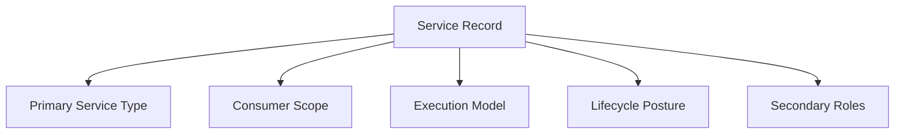
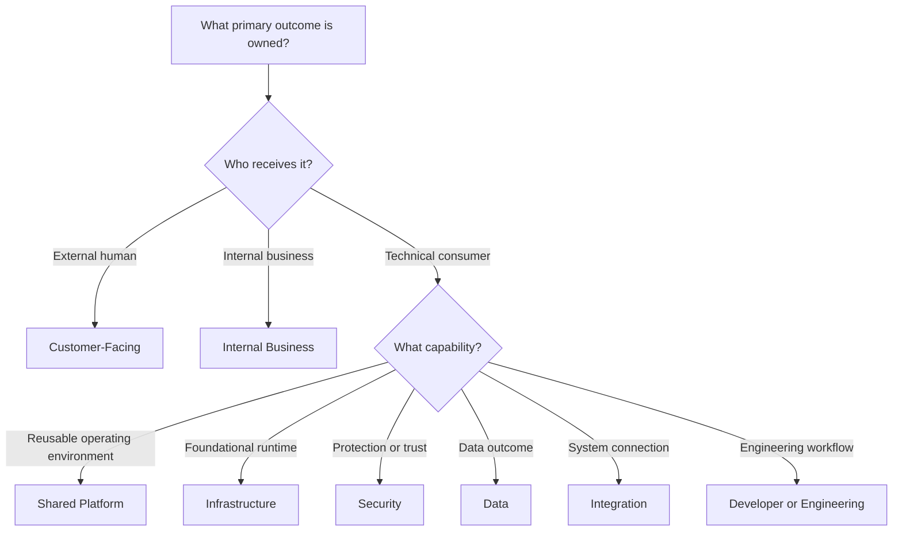

# Service Taxonomy and Classification

> A service taxonomy gives the organization a shared language for describing what a service primarily provides, whom it serves, how it operates, and which additional characteristics affect its ownership.

## Section Purpose

Sections 1 and 2 established what the organization operates and where each service boundary begins and ends. The next task is classification.

Without a consistent taxonomy, teams use the same words differently.

One team may call every internally used system a platform. Another may call every API a service. A third may classify a scheduled financial process as an application even though no interactive application exists. Experimental systems, legacy systems, infrastructure services, and shared control planes may disappear into broad categories that reveal little about their ownership.

A useful taxonomy must answer several different questions without mixing them into one field:

- What does the service primarily provide?
- Who primarily consumes it?
- How is its work initiated?
- What additional roles does it perform?
- What is its current lifecycle posture?
- Which classification is primary?
- Which classifications are secondary?
- Who may create or change taxonomy terms?

This section creates a structured, vendor-neutral method for classifying:

- Customer-facing services
- Internal business services
- Shared platform services
- Infrastructure services
- Control-plane services
- Data services
- Security services
- Integration services
- Batch services
- Event-processing services
- Developer or engineering services
- Experimental services
- Legacy services

The practical output is a governed service taxonomy that can be applied to the service inventory and future service-catalog records.

---

## Learning Objectives

After completing this section, you should be able to:

1. Explain why service taxonomy matters to ownership and governance.
2. Separate service type from criticality, lifecycle state, technology, and team ownership.
3. Select one primary service type using explicit rules.
4. Apply secondary classifications without creating uncontrolled labels.
5. Classify customer-facing and internal services consistently.
6. Distinguish shared platforms, infrastructure services, and control planes.
7. Recognize data, security, integration, batch, and event-processing service roles.
8. Classify developer and engineering services by the outcomes they provide.
9. Record experimental and legacy posture without confusing them with functional service types.
10. Resolve classification conflicts.
11. Govern taxonomy additions, changes, deprecations, and migrations.
12. Avoid classifications tied to vendors, products, or current implementation technologies.
13. Produce a complete service taxonomy.

---

## 1. What a Service Taxonomy Is

A service taxonomy is a controlled classification system for describing services consistently.

It provides:

- Defined classification dimensions
- Approved values
- Inclusion criteria
- Exclusion criteria
- Examples
- Decision rules
- Governance
- Version history
- Change procedures

A taxonomy is more than a list of labels.

For example, a list containing `platform`, `critical`, `Kubernetes`, `legacy`, `API`, and `finance` mixes:

- Service type
- Criticality
- Technology
- Lifecycle posture
- Interface
- Business domain

Those values cannot answer one consistent question.

A good taxonomy separates them into distinct fields.

---

## 2. Why Taxonomy Matters

Consistent classification supports:

- Service discovery
- Ownership assignment
- Catalog search
- Governance
- Reporting
- Support expectations
- Dependency analysis
- Lifecycle review
- Security review
- Reliability planning
- Organizational learning

Taxonomy allows an organization to ask useful questions such as:

- Which customer-facing services lack verified owners?
- Which control-plane services have broad failure impact?
- Which batch services have no completion owner?
- Which legacy services still support important business outcomes?
- Which experimental services receive real production traffic?
- Which shared platform services have undocumented consumers?
- Which integration services depend on one external provider?

Without controlled classification, the answers depend on inconsistent names and local knowledge.

---

## 3. What Taxonomy Must Not Do

A taxonomy should not:

- Replace the service boundary record
- Assign ownership automatically
- Determine criticality automatically
- Prove that a service is reliable
- Describe every technical implementation detail
- Copy a vendor's product catalog
- Become an unrestricted tag collection
- Hide uncertainty
- Force all organizations into one architecture

Classification helps organize evidence. It does not make production decisions on its own.

---

## 4. Separate the Classification Dimensions

Use multiple controlled dimensions rather than one overloaded `type` field.



Recommended dimensions:

| Dimension | Question answered | Example values |
| --- | --- | --- |
| Primary service type | What outcome does the service primarily provide? | Customer product, business operation, platform, infrastructure, data, security, integration |
| Consumer scope | Who primarily consumes it? | External, internal business, engineering, mixed, system-only |
| Execution model | How is work initiated or delivered? | Request-driven, scheduled, event-driven, streaming, continuous control |
| Lifecycle posture | What is its current strategic condition? | Experimental, standard, legacy, transitional |
| Secondary roles | Which additional service roles materially affect ownership? | Control plane, batch, event processing, shared capability |

Criticality and lifecycle state remain separate governed fields. They are covered in later sections.

---

## 5. The Recommended Taxonomy Model

Every service record should contain:

```text
Primary service type: exactly one
Secondary service roles: zero or more controlled values
Consumer scope: one primary value, optional additional values
Execution model: one or more controlled values
Lifecycle posture: exactly one
Business domain: organization-defined controlled value
Technology: separate implementation metadata
Criticality tier: separate risk classification
```

Example:

```yaml
service_name: Payment Reconciliation
primary_service_type: internal-business-service
secondary_service_roles:
  - data-service
  - integration-service
consumer_scope:
  primary: internal-business
  additional:
    - system
execution_model:
  - scheduled
  - batch
lifecycle_posture: standard
business_domain: finance
technology:
  - managed-workflow-runtime
criticality_tier: pending-assessment
```

This record remains meaningful if the runtime technology changes.

---

## 6. Primary and Secondary Classifications

The primary service type describes the service's dominant owned outcome.

Secondary roles describe additional characteristics that materially affect:

- Ownership
- Operation
- Risk
- Consumer expectations
- Governance
- Dependency relationships

### Primary Classification Rule

Select the type that best completes this statement:

> This service primarily exists to provide [outcome] to [consumer].

### Secondary Classification Rule

Add a secondary role only when removing that role from the record would hide an important ownership or operating responsibility.

Do not add every technically true label.

Example:

An internal fraud-decision service receives transaction events, uses security rules, and returns risk decisions.

Possible record:

- Primary type: Security Service
- Secondary roles: Event-Processing Service, Data Service
- Consumer scope: Internal systems
- Execution model: Event-driven

Its event-driven implementation does not need to replace its security outcome as the primary classification.

---

## 7. Classification Precedence

When several types apply, use this decision order:

1. Identify the primary consumer outcome.
2. Identify the organizational purpose of the service.
3. Identify the accountable ownership model.
4. Identify the major risk or control responsibility.
5. Record execution characteristics separately.
6. Add secondary roles only where they change ownership or governance.

Do not select the primary type based only on:

- Runtime technology
- Interface
- Team name
- Deployment method
- Database type
- Vendor product
- The most visible component

---

## 8. Classification Confidence

Classification may remain uncertain during discovery or transition.

Use confidence values:

| Confidence | Meaning |
| --- | --- |
| Confirmed | Outcome, consumer, boundary, and owner support the classification |
| High | Strong evidence exists, with one minor unresolved issue |
| Medium | The likely type is known, but the outcome or boundary remains under review |
| Low | Evidence conflicts or the service is poorly understood |
| Unclassified | Insufficient evidence exists |

Do not force a classification merely to complete a dashboard.

An `unclassified` service with an assigned review owner is more honest than a false label.

---

## 9. Customer-Facing Service

A customer-facing service directly provides an outcome to an external customer, citizen, member, patient, partner user, or other external human consumer.

Examples:

- Customer authentication
- Online checkout
- Funds transfer
- Document sharing
- Appointment booking
- Customer account recovery
- Product search
- Streaming playback

### Inclusion Criteria

Use this as the primary type when:

- An external human user's outcome is the main purpose
- The service behavior is visible to that user
- Failure directly prevents, delays, corrupts, or degrades the outcome
- Product or service commitments are defined around the external experience

### Exclusions

Do not use it as the primary type merely because:

- A public endpoint exists
- External traffic reaches the service
- A customer-facing service depends on it
- Its data eventually appears to customers

An internal pricing service may support checkout without being directly customer-facing.

### Ownership Implications

Classification should make visible:

- Product ownership
- Customer impact
- Support coordination
- External communication needs
- Journey-level measurement

---

## 10. Customer-Facing Does Not Mean Publicly Accessible

A service can be customer-facing without exposing a public network endpoint.

Example:

A payment-confirmation worker processes accepted events and creates the confirmation that customers see. It has no public endpoint, but its owned outcome is directly experienced by customers.

Conversely, a public webhook ingestion endpoint may primarily serve partner systems rather than human customers.

Classify based on the outcome and consumer, not network exposure.

---

## 11. Internal Business Service

An internal business service supports employees, business units, internal processes, or corporate operations.

Examples:

- Payroll submission
- Expense approval
- Financial close
- Employee directory
- Internal case management
- Procurement approval
- Regulatory reporting
- Revenue recognition
- Customer-support administration

### Inclusion Criteria

Use this as the primary type when:

- The main consumer is an employee or internal business function
- The service enables a business process rather than an engineering capability
- Business correctness and timing define the outcome

### Exclusions

Do not classify every internal API as an internal business service. A service used only by applications may be better classified by the outcome it provides, such as data, security, integration, or infrastructure.

### Ownership Implications

Record:

- Business process owner
- Operational owner
- Important deadlines
- Manual fallback where applicable
- Data and compliance obligations

---

## 12. Internal Does Not Mean Low Importance

Internal services may control:

- Payroll
- Financial statements
- Regulatory submissions
- Employee identity
- Production access
- Customer-support recovery
- Business continuity

Their criticality must be assessed separately.

Do not assign a lower criticality tier automatically because the service is internal.

Service type describes purpose and consumer. Criticality describes consequence and required protection.

---

## 13. Shared Platform Service

A shared platform service provides reusable technical capabilities to several internal product or service teams through a managed interface.

Examples:

- Application deployment service
- Managed container runtime
- Internal database platform
- Messaging platform
- Machine-learning platform
- Identity platform
- Observability platform
- Configuration platform

### Inclusion Criteria

Use this as the primary type when:

- Several teams consume the capability
- The provider manages an ongoing service outcome
- Consumer and provider responsibilities can be stated
- The platform has supported use cases and operational obligations
- Consumers do not need to own the underlying implementation

### Exclusions

Do not use it for:

- A collection of infrastructure resources with no managed consumer contract
- A shared repository
- A tool installed for one team
- Every technology operated by a platform-named team

### Ownership Implications

Classification should trigger attention to:

- Provider and consumer responsibilities
- Supported use cases
- Shared failure impact
- Consumer discovery
- Compatibility
- Capacity
- Change communication

---

## 14. Platform Service Versus Engineering Service

Both serve internal technical users.

Use `shared-platform-service` when the service provides a reusable operating environment or technical foundation that hosts, connects, or governs workloads.

Use `developer-engineering-service` when the service primarily supports engineering work, such as source collaboration, build execution, test coordination, or engineering documentation.

Examples:

| Service | Likely primary type |
| --- | --- |
| Managed application runtime | Shared Platform Service |
| Continuous integration execution | Developer or Engineering Service |
| Internal container registry | Infrastructure Service or Developer Service, depending on outcome |
| Deployment control portal | Developer Service with Control-Plane role |

Classify the owned outcome, not the team label.

---

## 15. Infrastructure Service

An infrastructure service provides a managed foundational technical outcome used by other services or platforms.

Examples:

- Domain name resolution
- Network connectivity
- Load-balancing capability
- Compute provisioning
- Time synchronization
- Certificate transport
- Storage provisioning
- Artifact storage
- Backup storage

### Inclusion Criteria

Use this as the primary type when:

- The primary consumers are services, platforms, or technical teams
- The outcome is a foundational runtime or connectivity capability
- The provider manages availability, capacity, change, and support
- The capability is not merely an unmanaged resource

### Exclusions

Do not create an infrastructure service record for every:

- Server
- Network device
- Disk
- Cluster node
- Cloud resource
- Configuration object

Those are normally resources or components inside an infrastructure service boundary.

### Ownership Implications

Pay attention to:

- Shared failure domains
- Capacity ownership
- Consumer mapping
- Maintenance impact
- Provider escalation
- Administrative authority

---

## 16. Infrastructure Service Versus Platform Service

The distinction depends on the consumer outcome.

| Characteristic | Infrastructure Service | Shared Platform Service |
| --- | --- | --- |
| Primary outcome | Foundational compute, storage, network, name, or runtime capability | Reusable environment or workflow for building and operating services |
| Typical consumer | Platforms, services, infrastructure teams | Application and service teams |
| Abstraction | Lower-level technical capability | Higher-level managed product or workflow |
| Consumer responsibility | Often greater implementation knowledge | More responsibility absorbed by platform provider |

The boundary may vary by organization.

A managed database offering may be classified as infrastructure when it primarily provisions database resources. It may be a shared platform service when it provides a complete managed experience with schemas, recovery, access, observability, and support.

Document the reasoning.

---

## 17. Control-Plane Service

A control-plane service coordinates, configures, governs, or changes other systems.

Examples:

- Deployment control
- Cluster management
- Traffic-management control
- Policy distribution
- Identity administration
- Certificate issuance
- Secrets administration
- Service registration
- Feature configuration

### Recommended Treatment

`control-plane-service` is usually a secondary role because the service may primarily be:

- Infrastructure
- Platform
- Security
- Developer or engineering

Use it as the primary type only when controlling other systems is the clearest consumer outcome and no more specific primary type applies.

### Inclusion Criteria

Record the role when failure affects the ability to:

- Deploy
- Roll back
- Scale
- Route traffic
- Change policy
- Issue or revoke identity
- Recover another service

### Ownership Implications

Control planes require visibility into:

- Administrative authority
- Large blast radius
- Data-plane behavior during control-plane failure
- Emergency access
- Recovery dependencies

---

## 18. Control Plane Versus Data Plane

The control plane makes or distributes operating decisions. The data plane performs normal service work.

Examples:

| System | Control-plane behavior | Data-plane behavior |
| --- | --- | --- |
| Traffic platform | Creates routing policy | Forwards requests |
| Deployment platform | Declares and applies desired workloads | Runs application traffic |
| Identity platform | Manages policies and credentials | Evaluates authentication requests |

One service may contain both planes. They may also require separate boundaries and classifications.

Record the control-plane role when its failure or compromise creates different ownership and recovery requirements.

---

## 19. Data Service

A data service provides governed access to, transformation of, or stewardship over data as its primary outcome.

Examples:

- Customer profile service
- Product catalog data service
- Metrics ingestion service
- Search indexing service
- Analytical dataset service
- Reference data service
- Data quality service
- Feature data service

### Inclusion Criteria

Use this as the primary type when:

- Consumers depend mainly on data being correct, timely, complete, and accessible
- The service owns data meaning, access, transformation, or delivery
- Data obligations define most of the production responsibility

### Exclusions

Do not classify every stateful service as a data service. Most services use data.

A payment service remains a customer or business outcome service even though it stores payment state.

### Ownership Implications

Record:

- Authoritative data
- Data producer and consumer relationships
- Schema authority
- Quality ownership
- Timeliness
- Retention and access responsibilities

---

## 20. Data Service Versus Database

A database is a resource or managed technology. A data service provides an owned data outcome.

Weak classification:

> PostgreSQL Service

Possible stronger classifications:

- Customer Profile Data Service
- Product Catalog Data Service
- Managed Relational Database Platform

The correct name depends on whether the consumer receives:

- Business data
- A technical storage capability
- A fully managed database environment

Avoid using a database engine as the taxonomy value.

---

## 21. Security Service

A security service primarily protects identity, access, confidentiality, integrity, detection, response, or policy enforcement.

Examples:

- Authentication service
- Authorization decision service
- Secrets service
- Certificate authority service
- Threat detection service
- Security event service
- Key management service
- Vulnerability intelligence service
- Policy enforcement service

### Inclusion Criteria

Use this as the primary type when:

- The main outcome is a security control or decision
- Consumers depend on protection, verification, enforcement, or trusted evidence
- Security failure defines the most important service consequence

### Exclusions

Do not classify every service that implements security controls as a security service.

All production services should authenticate, authorize, protect secrets, and preserve integrity where required. Those controls do not change their primary outcome automatically.

### Ownership Implications

Record:

- Control owner
- Decision authority
- Privileged access
- Evidence obligations
- Failure behavior
- Security and reliability dependencies

---

## 22. Security Service With Other Roles

A security service often carries secondary roles.

Examples:

| Service | Primary type | Secondary role |
| --- | --- | --- |
| Identity policy administration | Security Service | Control Plane |
| Security event processor | Security Service | Event Processing, Data Service |
| Certificate issuance | Security Service | Control Plane, Integration Service |
| Secrets delivery platform | Security Service | Shared Platform Service |

Secondary roles reveal operating characteristics without replacing the main security outcome.

---

## 23. Integration Service

An integration service connects systems, organizations, protocols, or data models so that an outcome can cross a boundary.

Examples:

- Banking partner gateway
- Supplier integration
- Payment-provider adapter
- Enterprise message gateway
- File-transfer service
- Protocol translation service
- Customer-data synchronization
- External webhook delivery

### Inclusion Criteria

Use this as the primary type when:

- Connecting otherwise separate systems is the main outcome
- Translation, routing, synchronization, or exchange is the core responsibility
- The service owns the interface across an organizational or technical boundary

### Exclusions

Do not classify every service with dependencies as an integration service.

### Ownership Implications

Record:

- Internal and external parties
- Contract and schema ownership
- Retry and duplicate behavior
- Reconciliation
- Vendor escalation
- Data crossing the boundary
- Compatibility responsibility

---

## 24. Integration Service Versus Adapter Component

An adapter used only inside one service may remain a component.

It becomes a stronger integration-service candidate when it has:

- Several consumers
- Independent ownership
- A stable interface
- Separate deployment and support
- Shared credentials or partner contracts
- Distinct reconciliation obligations
- Material cross-organizational risk

Do not create independent service ownership for a thin adapter when its lifecycle, failure, and operation remain inseparable from the parent service.

---

## 25. Batch Service

A batch service processes a bounded set of work without requiring an immediate interactive response.

Examples:

- Payroll calculation
- Daily settlement
- Invoice generation
- Monthly reporting
- Data retention cleanup
- Search index rebuild
- Backup verification
- Financial reconciliation

### Recommended Treatment

`batch-service` normally describes execution model. It may be used as a secondary role alongside a primary outcome type.

Examples:

- Payroll Processing: Internal Business Service, Batch role
- Settlement Reconciliation: Integration Service, Batch role
- Search Index Rebuild: Data Service, Batch role

Use it as a primary type only when the organization's taxonomy deliberately centers on operating mode and no clearer outcome classification exists.

### Ownership Implications

Batch classification highlights:

- Completion deadlines
- Partial completion
- Retry safety
- Rerun authority
- Data correctness
- Missed schedules
- Backlog
- Reconciliation

---

## 26. Scheduled Does Not Always Mean Batch

A scheduled task may:

- Process a bounded dataset
- Trigger another service
- Perform maintenance
- Check a control
- Generate a report
- Rotate a credential

Only the first pattern is necessarily batch processing.

Record `scheduled` as an execution model. Add the `batch` role when work is processed as a bounded collection with completion semantics.

This distinction prevents every cron job from becoming a batch service.

---

## 27. Event-Processing Service

An event-processing service consumes, transforms, correlates, routes, or reacts to events.

Examples:

- Order-event processor
- Fraud-event evaluator
- Delivery-status processor
- Audit-event pipeline
- Inventory-update processor
- Security-event correlator
- Notification dispatcher

### Recommended Treatment

`event-processing-service` usually describes execution model or secondary role.

The primary type should describe the owned outcome where possible.

Examples:

- Fraud Evaluation: Security Service, Event-Processing role
- Inventory Synchronization: Integration Service, Event-Processing role
- Audit Event Store: Data Service, Event-Processing role

### Ownership Implications

The role highlights:

- Event contract
- Producer and consumer ownership
- Ordering
- Duplication
- Idempotency
- Replay
- Backlog
- Late events
- Dead-letter handling

---

## 28. Event Processing Versus Streaming

Event-driven and streaming are related but different execution characteristics.

| Characteristic | Event processing | Streaming |
| --- | --- | --- |
| Unit | Discrete event | Continuous flow or sequence |
| Timing | Triggered by arrival | Continuously processed |
| State | May be stateless or stateful | Often maintains windows or ongoing state |
| Completion | Per event or group | May have no final completion |

A service may use both.

The taxonomy should record the execution model only when it changes ownership, support, or reliability obligations.

---

## 29. Developer or Engineering Service

A developer or engineering service provides an outcome used primarily to build, test, release, understand, or operate software and systems.

Examples:

- Source collaboration service
- Build execution service
- Test orchestration service
- Artifact publishing service
- Deployment coordination service
- Engineering documentation service
- Development environment service
- Change-analysis service

### Inclusion Criteria

Use this as the primary type when:

- Engineers are the primary consumers
- The outcome supports engineering work
- The service has ongoing production ownership and consumer expectations

### Exclusions

Do not classify every internal technical service as a developer service.

DNS, identity, network connectivity, and secrets may be infrastructure or security services even when engineers also consume them.

### Ownership Implications

Record:

- Supported engineering workflows
- Consumer groups
- Production dependency
- Change and release impact
- Support hours
- Control-plane authority where applicable

---

## 30. Engineering Service Versus Tool

A tool becomes a service when an accountable provider operates it for consumers under defined expectations.

Tool only:

- Installed locally
- Self-managed by each user
- No shared production owner
- No service commitment

Engineering service:

- Centrally operated
- Shared by defined consumers
- Has access and support responsibilities
- Has change and recovery processes
- Provides a measurable outcome

The product name does not determine the classification. The operating model does.

---

## 31. Experimental Service

An experimental service tests an uncertain product, technical, or operating hypothesis under controlled conditions.

Examples:

- Limited customer pilot
- New recommendation model
- Alternative routing service
- Prototype internal platform
- Trial integration

### Recommended Treatment

`experimental` should be a lifecycle posture, not a primary service type.

An experimental service still requires a functional classification.

Example:

- Primary type: Customer-Facing Service
- Lifecycle posture: Experimental
- Consumer scope: Limited external cohort

### Classification Conditions

An experimental posture should include:

- Hypothesis
- Approved scope
- Consumer limits
- Data restrictions
- Risk owner
- Expiry or review date
- Promotion criteria
- Shutdown criteria

Experimental does not mean ownerless, uncontrolled, or exempt from production responsibility.

---

## 32. Experimental Service Versus Development Environment

An experiment can run in production. A development environment normally does not serve production consumers or outcomes.

Classify a system as an experimental production service when:

- Real users or systems depend on it within an approved scope
- Real production data or effects are involved
- Failure can create material consequences
- An owner must operate and contain it

Do not place every prototype in the production service taxonomy.

---

## 33. Legacy Service

A legacy service remains in use while carrying constraints from age, technology, architecture, support, ownership, knowledge, or replacement history.

Examples include services that:

- Use unsupported technology
- Depend on scarce expertise
- Cannot be changed safely
- Lack reliable build or deployment paths
- Remain after an incomplete migration
- Have important consumers but no active product development
- Depend on retired interfaces

### Recommended Treatment

`legacy` should be a lifecycle posture, not a primary functional type.

Example:

- Primary type: Internal Business Service
- Secondary role: Batch Service
- Lifecycle posture: Legacy

### Classification Conditions

Legacy posture should be based on evidence, not age alone.

A ten-year-old stable service may be well owned and maintainable. A two-year-old service may already be unsupported and difficult to recover.

---

## 34. Legacy Is Not a Retirement Decision

Legacy classification should trigger review. It does not automatically mean:

- Unused
- Unimportant
- Unreliable
- Safe to remove
- Scheduled for immediate replacement

Record separately:

- Current service type
- Criticality
- Lifecycle state
- Constraints
- Replacement plan
- Retirement decision

Do not allow the word legacy to replace a documented risk statement.

---

## 35. Additional Consumer-Scope Classifications

Recommended consumer-scope values:

| Value | Meaning |
| --- | --- |
| External human | Primarily serves people outside the organization |
| External system | Primarily serves partner or customer systems |
| Internal business | Primarily serves employees or business processes |
| Internal engineering | Primarily serves engineers or technical operations |
| Internal service | Primarily serves other software services |
| Mixed | No single consumer category dominates |

Consumer scope does not replace primary service type.

Example:

A public partner gateway may be:

- Primary type: Integration Service
- Consumer scope: External system

---

## 36. Execution-Model Classifications

Recommended execution-model values:

- Request-driven
- Event-driven
- Scheduled
- Batch
- Streaming
- Continuous processing
- Continuous control
- Human-triggered
- Mixed

These values explain how work arrives and completes.

They should not replace the outcome classification.

Example:

```yaml
primary_service_type: data-service
execution_model:
  - streaming
  - continuous-processing
```

---

## 37. Lifecycle-Posture Classifications

Recommended high-level postures:

- Experimental
- Standard
- Legacy
- Transitional

These are not the full lifecycle states.

| Posture | Meaning |
| --- | --- |
| Experimental | Testing an approved hypothesis under controlled exposure |
| Standard | Operated as an established supported service |
| Legacy | Continues operating under material maintenance or evolution constraints |
| Transitional | Boundary, ownership, implementation, or authority is actively changing |

Section 4 defines detailed lifecycle states such as proposed, active, deprecated, retirement pending, and retired.

---

## 38. Business-Domain Classification

Business domain describes the area of organizational responsibility supported by the service.

Examples:

- Commerce
- Payments
- Identity
- Customer support
- Finance
- Human resources
- Supply chain
- Security
- Engineering infrastructure

Domain classification supports navigation and reporting.

It must remain separate from service type.

A finance domain may contain:

- Internal business services
- Data services
- Integration services
- Batch services

Domain names should reflect durable organizational capabilities rather than temporary team names.

---

## 39. Interface Classification

Interface types may be useful metadata:

- Web interface
- Mobile interface
- API
- Event
- Queue
- Stream
- File exchange
- Command-line interface
- Administrative interface

Do not use interface type as the primary service taxonomy.

One service may expose several interfaces. One interface may aggregate several services.

---

## 40. Technology Classification

Technology belongs in implementation metadata.

Examples:

- Runtime family
- Programming language
- Database engine
- Hosting model
- Orchestration system
- Cloud environment
- Messaging technology

Technology supports:

- Skills planning
- Vulnerability management
- Upgrade planning
- Cost analysis
- Operational tooling

It should not define the durable service type.

Weak:

> Kubernetes Service

Stronger:

> Managed Application Runtime, implemented on a container orchestration platform.

---

## 41. Avoid Vendor-Specific Classifications

Vendor products change. Service outcomes should remain understandable.

Vendor-specific taxonomy creates problems:

- Migrations require taxonomy redesign
- Comparable services receive different types
- Ownership becomes tied to procurement choices
- Reporting fragments across providers
- Architecture terms replace consumer outcomes

Weak primary types:

- AWS Service
- Azure Service
- GCP Service
- Kubernetes Service
- Salesforce Service
- Oracle Service

Better primary types:

- Infrastructure Service
- Data Service
- Integration Service
- Internal Business Service
- Security Service
- Shared Platform Service

Record the vendor and product in separate technology and dependency fields.

---

## 42. Vendor Product Versus Internally Owned Service

One vendor product may support several internal services. Several products may implement one internal service.

Example:

An organization uses external providers for:

- Email delivery
- SMS delivery
- Push notifications

Internally, it may own one Customer Notification Service.

The vendor products are dependencies. The internal service classification reflects the outcome the organization owns.

Alternatively, separate teams and consumer contracts may justify several internal service boundaries.

Taxonomy follows the approved boundary, not the invoice line.

---

## 43. Multiple Applicable Classifications

Many services legitimately fit several descriptions.

Example:

A service processes security events from internal systems in real time and stores searchable findings.

Applicable descriptions:

- Security
- Data
- Event processing
- Internal engineering
- Streaming

Recommended classification:

```yaml
primary_service_type: security-service
secondary_service_roles:
  - data-service
  - event-processing-service
consumer_scope:
  primary: internal-engineering
  additional:
    - internal-service
execution_model:
  - event-driven
  - streaming
lifecycle_posture: standard
```

The structured dimensions preserve every important fact without creating one uncontrolled combined label.

---

## 44. When Not to Add a Secondary Type

Do not add a secondary type merely because:

- The service stores data
- The service emits events
- The service runs on infrastructure
- Engineers use it occasionally
- It implements authentication
- It calls an external provider
- It has a scheduled maintenance task

Add a secondary role only when the role materially changes:

- Ownership
- Support
- Risk
- Governance
- Consumer expectations
- Operational procedures

This rule prevents label inflation.

---

## 45. Classification Decision Tree



After selecting the primary type:

1. Add consumer scope.
2. Add execution model.
3. Add lifecycle posture.
4. Add only material secondary roles.
5. Record confidence and evidence.

---

## 46. Classification Rules

Use these mandatory rules:

1. Every active service must have one primary type.
2. `Unclassified` is permitted temporarily when evidence is insufficient.
3. Primary type must describe the dominant owned outcome.
4. Consumer scope must be recorded separately.
5. Execution model must be recorded separately.
6. Experimental and legacy must be recorded as lifecycle posture.
7. Technology and vendor must not be used as primary types.
8. Team names must not be used as service types.
9. Secondary roles must come from the approved vocabulary.
10. Each classification must include evidence or a rationale.
11. Changes must preserve classification history.
12. Exceptions must have an owner and review date.

---

## 47. Classification Evidence

Useful evidence includes:

- Approved service boundary record
- Consumer documentation
- Product or business description
- Service interfaces
- Runtime and deployment records
- Data ownership records
- Security-control records
- Support agreements
- Dependency maps
- Team confirmation
- Incident history
- Lifecycle decisions

The strongest evidence connects the service outcome, consumer, and accountable owner.

Technology metadata alone provides weak classification evidence.

---

## 48. Classification Rationale

Each record should contain a short rationale.

Example:

> Classified as an Integration Service because its primary owned outcome is the validated exchange of settlement files between the internal payments environment and banking partners. Batch is a secondary role because exchanges run at defined settlement windows.

A rationale should explain:

- Primary outcome
- Primary consumer
- Why the selected type is dominant
- Why important secondary roles were added
- Which alternatives were rejected

---

## 49. Classification Conflicts

Conflicts occur when teams choose different types for the same service.

Common causes:

- Different views of the consumer
- Unclear service boundaries
- Team naming conventions
- Vendor terminology
- Mixed functional and execution labels
- Platform and infrastructure ambiguity
- Security controls mistaken for security outcomes
- Legacy names retained after architecture changes

Resolve conflicts by returning to:

1. Approved service boundary
2. Primary consumer outcome
3. Accountable ownership
4. Material operating obligations
5. Controlled classification rules

Do not resolve conflicts by allowing every proposed type as a tag.

---

## 50. Classification Review Questions

For every service, ask:

1. What outcome does it primarily provide?
2. Who is the primary consumer?
3. Does the type describe purpose rather than technology?
4. Is the primary type unique?
5. Are secondary roles materially relevant?
6. Is execution model separate from function?
7. Is lifecycle posture separate from type?
8. Is criticality recorded elsewhere?
9. Would the classification survive a vendor migration?
10. Would two independent reviewers reach the same result?
11. Is the rationale recorded?
12. Does the accountable owner accept the classification?

---

## 51. Taxonomy Granularity

A taxonomy needs enough detail to support decisions without becoming difficult to apply.

Too broad:

- Business Service
- Technical Service

These reveal little about ownership or operation.

Too narrow:

- Public REST Payment API
- Internal gRPC Payment API
- Scheduled Python Finance Service
- Kubernetes Event Consumer

These mix interface, technology, domain, and execution.

A balanced taxonomy uses a small number of durable primary types plus separate controlled dimensions.

---

## 52. Taxonomy Governance

Taxonomy governance defines who maintains the classification system and how changes are made.

Governance responsibilities include:

- Owning taxonomy definitions
- Reviewing proposed values
- Preventing duplicates
- Publishing examples
- Resolving disputes
- Versioning the schema
- Managing migrations
- Auditing unclassified services
- Retiring obsolete values
- Monitoring classification quality

Possible governance owners include:

- Service ownership council
- Architecture group
- SRE governance group
- Platform governance group
- Enterprise service-management function
- Cross-functional engineering standards group

Governance should remain close enough to production teams to reflect real services.

---

## 53. Taxonomy Decision Rights

Define who may:

- Propose a new classification
- Approve a new primary type
- Add secondary roles
- Change definitions
- Reclassify a service
- Approve exceptions
- Deprecate a value
- Require migration
- Resolve disputes

A recommended model:

| Decision | Recommended authority |
| --- | --- |
| Classify an individual service | Accountable service owner under published rules |
| Review disputed classification | Taxonomy steward or governance group |
| Add a new primary type | Cross-functional taxonomy authority |
| Add a secondary role | Taxonomy authority after evidence review |
| Change a definition | Taxonomy authority with impact analysis |
| Approve temporary exception | Named governance authority |

---

## 54. Proposing a New Classification

A proposal should include:

- Proposed name
- Dimension
- Definition
- Problem it solves
- Inclusion criteria
- Exclusion criteria
- Examples
- Existing values considered
- Services affected
- Reporting impact
- Migration impact
- Proposed owner

Reject a proposal when it is:

- A synonym for an existing value
- Vendor-specific
- Technology-specific
- A team name
- A business domain disguised as a service type
- Too narrow for reuse
- Too broad to support decisions
- Better represented as another dimension

---

## 55. Taxonomy Versioning

Version the taxonomy when definitions or allowed values change.

Record:

- Version number
- Effective date
- Values added
- Values changed
- Values deprecated
- Migration rules
- Affected records
- Compatibility period
- Approving authority

Example:

```text
Version 1.1
Added: integration-service
Changed: platform-service definition now requires multiple consumer teams
Deprecated: middleware-service
Migration: existing middleware records must be reviewed as integration, platform, or infrastructure
```

Versioning allows historical records to be interpreted correctly.

---

## 56. Classification Changes

A service classification should change when the owned outcome or operating role changes materially.

Triggers include:

- New primary consumer
- New independent outcome
- Boundary change
- Platform adoption
- Service consolidation
- Data ownership change
- Security responsibility change
- Integration expanded to multiple consumers
- Experiment promoted to standard operation
- Service enters material legacy constraints
- Vendor product replaced while internal outcome changes

Do not reclassify merely because:

- The team was renamed
- The repository moved
- The programming language changed
- The service migrated between cloud providers
- A new deployment tool was introduced

Those changes belong in other metadata unless the owned outcome changes.

---

## 57. Reclassification Process

Use this process:

1. Identify the trigger.
2. Review the current boundary.
3. Confirm the primary consumer and outcome.
4. Compare current and proposed classification.
5. Assess governance and reporting effects.
6. Update secondary roles and dimensions.
7. Obtain accountable-owner approval.
8. Record the effective date.
9. Preserve the previous classification.
10. Update dependent catalog views and policies.
11. Verify that no ownership obligation was lost.

---

## 58. Classification During Transition

A service may temporarily exhibit two models during migration.

Example:

An internal deployment tool is becoming a shared application platform.

Record:

- Current primary type
- Target primary type
- Transitional posture
- Migration owner
- Consumer expansion
- New responsibilities
- Entry criteria for the target classification
- Review date

Do not apply the target classification before the operating capability exists.

---

## 59. Taxonomy Quality Measures

Useful measures include:

- Percentage of active services with a primary type
- Percentage with classification rationale
- Percentage using deprecated values
- Number of uncontrolled labels
- Number of classification disputes
- Average age of unresolved classifications
- Percentage reviewed after boundary changes
- Reviewer agreement rate
- Number of vendor-specific primary types
- Percentage with lifecycle posture

Quality measures should lead to correction, not merely reporting.

---

## 60. Taxonomy Anti-Patterns

### Tag Collection

Every team invents labels without definitions.

### One Field for Everything

Type, criticality, technology, lifecycle, and domain are mixed together.

### Vendor Taxonomy

Service types reproduce cloud or product names.

### Team Taxonomy

Types follow department names instead of outcomes.

### Primary-Type Inflation

Every true characteristic becomes a primary type.

### Secondary-Role Inflation

Services receive every technically possible label.

### Internal Means Unimportant

Internal services are automatically treated as low impact.

### Experimental Means Unowned

Production experiments bypass normal ownership.

### Legacy Means Retire Immediately

The label replaces risk and lifecycle analysis.

### Classification Without Evidence

Records are labeled to satisfy a completeness target.

### Permanent Unclassified State

Unknown classifications have no review owner or deadline.

---

## 61. Worked Classification Examples

### Customer Checkout

```yaml
primary_service_type: customer-facing-service
secondary_service_roles: []
consumer_scope:
  primary: external-human
execution_model:
  - request-driven
lifecycle_posture: standard
```

Reasoning: The primary owned outcome is completion of a customer purchase.

### Payroll Calculation

```yaml
primary_service_type: internal-business-service
secondary_service_roles:
  - batch-service
consumer_scope:
  primary: internal-business
execution_model:
  - scheduled
  - batch
lifecycle_posture: legacy
```

Reasoning: Payroll is an internal business outcome. Batch describes how the work executes. Legacy describes current constraints.

### Managed Application Runtime

```yaml
primary_service_type: shared-platform-service
secondary_service_roles:
  - infrastructure-service
consumer_scope:
  primary: internal-engineering
execution_model:
  - continuous-control
lifecycle_posture: standard
```

Reasoning: The service provides a managed environment to several engineering teams.

### Domain Name Resolution

```yaml
primary_service_type: infrastructure-service
secondary_service_roles: []
consumer_scope:
  primary: internal-service
execution_model:
  - request-driven
lifecycle_posture: standard
```

Reasoning: The primary outcome is foundational name resolution used by services.

### Identity Administration

```yaml
primary_service_type: security-service
secondary_service_roles:
  - control-plane-service
consumer_scope:
  primary: internal-engineering
execution_model:
  - request-driven
  - continuous-control
lifecycle_posture: standard
```

Reasoning: The primary outcome is identity and access control. Control-plane responsibility is operationally material.

### Banking Partner Gateway

```yaml
primary_service_type: integration-service
secondary_service_roles:
  - security-service
consumer_scope:
  primary: external-system
execution_model:
  - request-driven
  - event-driven
lifecycle_posture: standard
```

Reasoning: The service owns exchange between internal payment services and external banking systems.

---

## 62. Classification Scenario: The Observability Platform

An organization operates central log ingestion, metric ingestion, trace storage, dashboards, and alert routing. Several engineering teams consume the capability.

Possible classifications:

- Shared Platform Service
- Data Service
- Developer or Engineering Service
- Infrastructure Service

### Decision

If the primary outcome is a managed, reusable observability experience for engineering teams, use:

- Primary type: Shared Platform Service
- Secondary roles: Data Service, Developer or Engineering Service
- Consumer scope: Internal engineering
- Execution model: Streaming, continuous processing

If log ingestion and alert routing have separate boundaries and owners, classify them separately.

The approved service boundary must precede the taxonomy decision.

---

## 63. Classification Scenario: The Fraud Processor

A service consumes payment events, enriches them with customer data, calculates fraud risk, records findings, and returns block or allow decisions.

Possible classifications:

- Security Service
- Data Service
- Event-Processing Service
- Internal Business Service

### Decision

If protection against fraudulent transactions is the dominant owned outcome:

- Primary type: Security Service
- Secondary roles: Data Service, Event-Processing Service
- Consumer scope: Internal service
- Execution model: Event-driven

If the service only prepares features while another service owns the fraud decision, it may instead be a Data Service.

Outcome ownership settles the difference.

---

## 64. Classification Scenario: The Old Finance Job

A nightly job calculates fees, creates settlement files, and sends them to a bank. It uses an unsupported runtime and only two employees understand it.

Recommended classification:

- Primary type: Integration Service or Internal Business Service, depending on the approved boundary and outcome
- Secondary role: Batch Service
- Consumer scope: Internal business and external system
- Execution model: Scheduled, batch
- Lifecycle posture: Legacy

`Legacy Batch Service` is not sufficient as a primary type because it does not state the service's purpose.

---

## 65. Classification Scenario: Production Experiment

A recommendation capability serves five percent of customers while the organization evaluates conversion and safety effects.

Recommended classification:

- Primary type: Customer-Facing Service or Data Service, depending on the owned boundary
- Consumer scope: Limited external human cohort
- Execution model: Request-driven
- Lifecycle posture: Experimental

Required classification evidence includes:

- Approved scope
- Experiment owner
- Exposure control
- Expiry date
- Promotion or shutdown criteria

---

## 66. Service Taxonomy Template

Use this template for the practical output.

```markdown
# Service Taxonomy

## Taxonomy Control

- Taxonomy name:
- Version:
- Effective date:
- Taxonomy owner:
- Approving authority:
- Review frequency or trigger:
- Previous version:

## Purpose

This taxonomy classifies production services by primary outcome, consumer scope, execution model, lifecycle posture, and material secondary roles.

## Classification Principles

1. Every service has one primary type.
2. Primary type describes the dominant owned outcome.
3. Consumer scope is recorded separately.
4. Execution model is recorded separately.
5. Lifecycle posture is recorded separately.
6. Criticality is recorded separately.
7. Technology, vendor, interface, domain, and team are metadata, not primary types.
8. Secondary roles are used only when operationally material.
9. Classification requires evidence and rationale.
10. Changes preserve history.

## Primary Service Types

| Code | Name | Definition | Inclusion criteria | Exclusions | Example |
| --- | --- | --- | --- | --- | --- |
| CFS | Customer-Facing Service |  |  |  |  |
| IBS | Internal Business Service |  |  |  |  |
| SPS | Shared Platform Service |  |  |  |  |
| IFS | Infrastructure Service |  |  |  |  |
| DAS | Data Service |  |  |  |  |
| SES | Security Service |  |  |  |  |
| INS | Integration Service |  |  |  |  |
| DES | Developer or Engineering Service |  |  |  |  |

## Secondary Service Roles

| Code | Role | Definition | When to apply | When not to apply |
| --- | --- | --- | --- | --- |
| CPS | Control-Plane Service |  |  |  |
| BAS | Batch Service |  |  |  |
| EPS | Event-Processing Service |  |  |  |
| DAS | Data Service |  |  |  |
| SES | Security Service |  |  |  |
| INS | Integration Service |  |  |  |
| SPS | Shared Platform Service |  |  |  |
| IFS | Infrastructure Service |  |  |  |
| DES | Developer or Engineering Service |  |  |  |

## Consumer Scope

| Value | Definition | Example |
| --- | --- | --- |
| external-human |  |  |
| external-system |  |  |
| internal-business |  |  |
| internal-engineering |  |  |
| internal-service |  |  |
| mixed |  |  |

## Execution Models

| Value | Definition | Example |
| --- | --- | --- |
| request-driven |  |  |
| event-driven |  |  |
| scheduled |  |  |
| batch |  |  |
| streaming |  |  |
| continuous-processing |  |  |
| continuous-control |  |  |
| human-triggered |  |  |
| mixed |  |  |

## Lifecycle Posture

| Value | Definition | Required evidence |
| --- | --- | --- |
| experimental |  |  |
| standard |  |  |
| legacy |  |  |
| transitional |  |  |

## Unclassified Services

- Allowed duration:
- Required owner:
- Review deadline:
- Escalation rule:

## Classification Record

- Service ID:
- Service name:
- Boundary record:
- Primary service type:
- Primary-type rationale:
- Secondary roles:
- Secondary-role rationale:
- Primary consumer scope:
- Additional consumer scopes:
- Execution models:
- Lifecycle posture:
- Business domain:
- Interfaces:
- Technology metadata:
- Vendor dependencies:
- Criticality record:
- Classification evidence:
- Confidence:
- Accountable owner acceptance:
- Exceptions:
- Effective date:
- Previous classification:
- Next review trigger:

## Change Process

- Proposal owner:
- Required evidence:
- Reviewers:
- Approving authority:
- Migration requirements:
- Versioning rule:
- Deprecation period:
- Exception process:
```

---

## 67. Practical Exercise: Create and Apply the Taxonomy

### Objective

Create a controlled taxonomy and apply it to services from the initial production inventory.

### Step 1: Define the Dimensions

Create separate fields for:

- Primary service type
- Secondary roles
- Consumer scope
- Execution model
- Lifecycle posture
- Business domain
- Technology
- Criticality reference

### Step 2: Define Primary Types

For every type, write:

- Definition
- Inclusion criteria
- Exclusion criteria
- Positive example
- Counterexample

### Step 3: Define Secondary Roles

State when each role materially changes ownership or operation.

### Step 4: Define Governance

Name:

- Taxonomy owner
- Service classification authority
- Dispute reviewer
- New-value authority
- Exception authority

### Step 5: Classify Services

Select at least ten candidates where available, including:

- One customer-facing service
- One internal business service
- One platform or infrastructure service
- One data, security, or integration service
- One scheduled, batch, or event-processing service
- One experimental, legacy, or transitional service

### Step 6: Record Rationale

Explain each primary type and important secondary role.

### Step 7: Test Vendor Neutrality

Replace every technology or vendor in each record with an alternative. Confirm that the primary classification still makes sense.

### Step 8: Test Reviewer Agreement

Ask two reviewers to classify the same three services independently. Investigate disagreements.

### Step 9: Record Exceptions

Do not force unclear services into a type. Assign `unclassified`, a review owner, and a deadline where necessary.

### Step 10: Publish Version 1.0

Record the approved definitions, values, owner, and effective date.

---

## 68. Exercise Acceptance Criteria

The taxonomy is complete when:

- Every dimension answers one consistent question.
- Primary service types describe outcomes.
- Every service receives one primary type or a controlled temporary `unclassified` status.
- Customer-facing and internal services are distinguished by consumer outcome.
- Platform and infrastructure definitions are separate.
- Control plane, batch, and event processing can be recorded as secondary roles.
- Data, security, integration, and engineering outcomes have clear criteria.
- Experimental and legacy are lifecycle postures.
- Criticality and lifecycle state remain separate.
- Vendor, product, technology, team, and interface names are not primary types.
- Multiple classifications follow a clear precedence rule.
- Each classification includes evidence and rationale.
- Taxonomy governance and change authority are recorded.
- Versioning, deprecation, migration, and exception rules exist.

---

## 69. Taxonomy Review Checklist

### Structure

- [ ] Primary, secondary, consumer, execution, and lifecycle dimensions are separate.
- [ ] Each value has one clear definition.
- [ ] Codes are unique.
- [ ] Definitions do not overlap unnecessarily.
- [ ] `Unclassified` has a controlled review process.

### Service Types

- [ ] Customer-facing services have external consumer outcomes.
- [ ] Internal business services support business processes.
- [ ] Platform services provide managed reusable capabilities.
- [ ] Infrastructure services provide foundational technical outcomes.
- [ ] Data services own data outcomes, not merely databases.
- [ ] Security services own security outcomes, not merely controls.
- [ ] Integration services own cross-system exchange.
- [ ] Engineering services support engineering work.

### Roles and Posture

- [ ] Control-plane roles are visible.
- [ ] Batch and scheduled work are not confused.
- [ ] Event processing and primary outcomes are separate.
- [ ] Experimental posture includes control and expiry.
- [ ] Legacy posture is evidence-based.

### Governance

- [ ] Taxonomy ownership is named.
- [ ] New values require review.
- [ ] Classification disputes have an authority.
- [ ] Changes are versioned.
- [ ] Deprecated values have migration rules.
- [ ] Vendor neutrality has been tested.

---

## 70. Knowledge Check

1. What is a service taxonomy?
2. Why should service type be separated from criticality?
3. Why should service type be separated from lifecycle state?
4. What should determine the primary service type?
5. When should a secondary role be added?
6. Why is customer-facing different from publicly accessible?
7. Why can an internal business service be highly critical?
8. What distinguishes a shared platform service from unmanaged infrastructure?
9. What distinguishes infrastructure service from platform service?
10. Why is control plane usually a secondary role?
11. Why is a stateful service not automatically a data service?
12. Why is a service with authentication not automatically a security service?
13. What defines an integration service?
14. Why is batch usually an execution classification?
15. How does event processing differ from a primary outcome type?
16. What makes an engineering tool an engineering service?
17. Why should experimental be a lifecycle posture?
18. Why should legacy be based on evidence rather than age?
19. Why should vendor names not be primary service types?
20. How should classification conflicts be resolved?
21. When should a service be reclassified?
22. What belongs in a taxonomy change proposal?
23. Why is taxonomy versioning necessary?
24. What should happen to an unclassified service?

---

## 71. Knowledge Check Answers

1. A controlled system of dimensions, definitions, values, rules, and governance used to classify services consistently.
2. Type describes purpose and consumer. Criticality describes the consequence of failure and required protection.
3. Type describes what the service provides. Lifecycle state describes where it is in its managed existence.
4. The dominant owned outcome provided to the primary consumer.
5. When the role materially affects ownership, support, risk, governance, or consumer expectations.
6. Customer-facing describes the owned external outcome. A service can influence customers without exposing a public endpoint.
7. It may support payroll, finance, identity, regulation, safety, or another essential operation.
8. A platform provides a managed reusable capability with defined consumers, responsibilities, and operational obligations.
9. Infrastructure provides foundational technical capability. A platform usually provides a higher-level managed environment or workflow.
10. Control-plane behavior often exists inside infrastructure, security, platform, or engineering services and describes how they govern other systems.
11. Most services store data. A data service primarily owns a data access, meaning, quality, transformation, or delivery outcome.
12. Security controls are expected in every service. A security service primarily provides protection, trust, enforcement, or security evidence.
13. Its primary outcome is connecting systems or organizations through translation, routing, synchronization, or exchange.
14. It describes how bounded work is processed rather than why the service exists.
15. Event processing describes how work arrives and is handled. The primary type describes the outcome owned.
16. It is centrally operated for defined engineering consumers under ongoing ownership and service expectations.
17. An experiment still has a functional outcome type. Experimental describes its controlled, temporary strategic posture.
18. Age alone does not establish operational constraints. Evidence of support, change, knowledge, architecture, or migration limitations does.
19. Vendors and technologies change, while owned outcomes should remain understandable and comparable.
20. Return to the approved boundary, primary consumer outcome, accountable owner, and controlled rules.
21. When the consumer, outcome, boundary, ownership, or material operating role changes.
22. Definition, dimension, problem, criteria, examples, alternatives, affected services, reporting effect, migration effect, and proposed owner.
23. It preserves interpretation of historical records and controls migrations after definitions change.
24. Assign a review owner, evidence requirement, deadline, and escalation route rather than inventing a label.

---

## 72. Reflection Questions

1. Which existing type labels mix several classification dimensions?
2. Which vendor-specific label would fail after a migration?
3. Which internal service is incorrectly treated as low importance?
4. Which platform is only a resource collection without a managed consumer outcome?
5. Which infrastructure service is incorrectly classified as a platform?
6. Which control plane is invisible in the current taxonomy?
7. Which stateful service is incorrectly called a data service?
8. Which service implements security controls but does not provide a security outcome?
9. Which adapter has become an independently owned integration service?
10. Which scheduled task is not actually batch processing?
11. Which engineering tool now operates as a production service?
12. Which experiment lacks an expiry or promotion rule?
13. Which legacy classification is based only on age?
14. Which secondary labels add no ownership value?
15. Which taxonomy decision would two reviewers interpret differently?

---

## 73. Key Takeaways

- A service taxonomy is a controlled classification system, not a tag collection.
- Classification must follow service discovery and boundary definition.
- Primary type describes the dominant owned outcome.
- Consumer scope, execution model, lifecycle posture, business domain, technology, and criticality require separate fields.
- Every service should have one primary type or a controlled temporary unclassified status.
- Secondary roles should be added only when operationally material.
- Customer-facing does not mean publicly accessible.
- Internal does not mean low importance.
- Platforms provide managed reusable capabilities. Infrastructure services provide foundational technical outcomes.
- Control plane, batch, and event processing often work best as secondary roles or execution classifications.
- Data and security services are defined by their primary outcomes, not by the presence of data or security controls.
- Experimental and legacy describe lifecycle posture, not functional purpose.
- Vendor and technology names belong in implementation metadata.
- Classification requires evidence, rationale, confidence, ownership, and governance.
- Taxonomy changes require versioning, migration, and review.

---

## Related SRE World Sections

- [Identifying Production Services](./01-Identifying-Production-Services.md)
- [Defining Service Boundaries](./02-Defining-Service-Boundaries.md)
- [Service Ownership](../01-SRE-Foundations/09-Service-Ownership.md)
- [Production Responsibility](../01-SRE-Foundations/08-Production-Responsibility.md)
- [SRE and Platform Engineering](../01-SRE-Foundations/16-SRE-and-Platform-Engineering.md)
- [Fault Tolerance and Disaster Recovery](../01-SRE-Foundations/07-Fault-Tolerance-and-Disaster-Recovery.md)
- [Service Ownership](./README.md)

---

## Next Section

[Section 4: Service Lifecycle States](./04-Service-Lifecycle-States.md)

---

## Maintained by VERIQTA

SRE World is created and maintained by [VERIQTA](https://github.com/veriqta).

- Website: [veriqta.com](https://www.veriqta.com/)
- GitHub: [github.com/veriqta](https://github.com/veriqta)
- Instagram: [@veriqta](https://www.instagram.com/veriqta/)
- Medium: [veriqta.medium.com](https://veriqta.medium.com/)

> A useful taxonomy preserves the service outcome when teams, vendors, tools, and architectures change.
