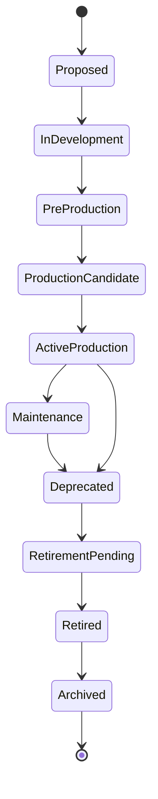
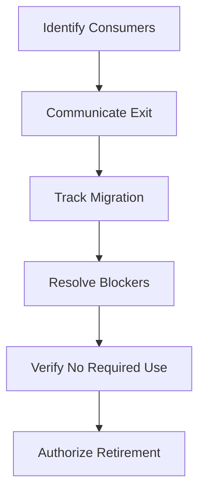

# Service Lifecycle States

> A service lifecycle model defines the controlled states through which a service moves, the evidence required at each transition, the responsibilities that remain active, and the authority required to change its production status.

## Section Purpose

A production service does not begin when its first deployment succeeds, and ownership does not end when customer traffic stops.

Services begin as proposals. They are designed, built, tested, approved, operated, maintained, deprecated, retired, and sometimes archived for years. Each stage creates different responsibilities, risks, restrictions, and evidence requirements.

Without a lifecycle model:

- Experimental systems become permanent production services
- Production begins before ownership is accepted
- Deprecated services continue without investment or support
- Retirement decisions remain incomplete
- Data and dependencies survive after applications disappear
- Catalog records describe intended state instead of actual state
- Teams transfer or dissolve without preserving accountability
- Emergency exceptions become normal operating conditions

This section defines ten lifecycle states:

1. Proposed
2. In Development
3. Pre-Production
4. Production Candidate
5. Active Production
6. Maintenance
7. Deprecated
8. Retirement Pending
9. Retired
10. Archived

For each state, it defines:

- Purpose
- Entry criteria
- Exit criteria
- Ownership requirements
- Permitted activity
- Production restrictions
- Evidence requirements
- Transition authority
- Common failure patterns

The practical output is a complete service lifecycle model.

This section governs service states and transitions. It does not replace detailed production-readiness reviews, ownership-transfer procedures, data-retention policies, or technical decommissioning runbooks. Those artifacts connect to the lifecycle model but have their own procedures.

---

## Learning Objectives

After completing this section, you should be able to:

1. Explain why production ownership begins before launch and continues after traffic ends.
2. Distinguish lifecycle state from lifecycle posture, service type, criticality, and environment.
3. Define the ten recommended service lifecycle states.
4. Establish entry and exit criteria for every state.
5. Define ownership requirements throughout the lifecycle.
6. Set production restrictions appropriate to each state.
7. Assign state-transition authority.
8. Identify evidence required to approve a transition.
9. Control emergency exceptions.
10. Prevent experiments from becoming permanent production services without review.
11. Prevent deprecated services from becoming abandoned services.
12. Preserve data, records, obligations, and accountability after technical shutdown.
13. Model backward, skipped, failed, and disputed transitions.
14. Produce a governed service lifecycle model.

---

## 1. What a Service Lifecycle State Is

A lifecycle state is the service's formally recognized position in its managed existence.

The state answers:

- Is the service only an idea?
- Is it being built?
- Is it being validated outside production?
- Is it ready for a controlled production decision?
- Is it actively serving production consumers?
- Is it supported without major capability growth?
- Have consumers been told to leave?
- Is shutdown authorized and being prepared?
- Has production operation stopped?
- Are only preserved records and artifacts retained?

A state must have operational consequences. If changing the state changes nothing about authority, ownership, restrictions, evidence, or required work, the lifecycle model is only decorative.

---

## 2. Lifecycle State Versus Lifecycle Posture

Section 3 introduced lifecycle posture. State and posture answer different questions.

| Concept | Question | Examples |
| --- | --- | --- |
| Lifecycle state | Where is the service in its managed lifecycle? | Proposed, Active Production, Deprecated, Retired |
| Lifecycle posture | What strategic or operational condition shapes the service? | Experimental, Standard, Legacy, Transitional |

Examples:

- Proposed state, experimental posture
- Active Production state, experimental posture
- Active Production state, legacy posture
- Deprecated state, legacy posture
- Maintenance state, transitional posture

Do not use `legacy` as a substitute for `deprecated`. A legacy service may remain actively supported. A deprecated service has an approved direction away from continued use.

---

## 3. Lifecycle State Versus Environment

Environment and lifecycle state are not the same.

Environments may include:

- Development
- Test
- Integration
- Staging
- Production
- Recovery

A service can have several environments while remaining in one lifecycle state.

Examples:

- A service in development may have development and integration environments.
- A production candidate may already have a limited production deployment.
- An active production service may also maintain staging and recovery environments.
- A retired service may retain an isolated archive environment.

Do not infer lifecycle state from an environment label alone.

---

## 4. Lifecycle State Versus Deployment Status

A successful deployment does not automatically make a service active production.

A deployed system may be:

- A pre-production test environment
- A production candidate under limited exposure
- An inactive standby
- A deprecated service still serving consumers
- A retirement-pending service being drained
- A retired system that was not completely removed

Lifecycle state is a governed service decision. Deployment status is technical evidence.

---

## 5. Lifecycle State Versus Criticality

State does not determine criticality.

Examples:

- A production candidate may affect a small approved cohort but still process sensitive data.
- A maintenance service may remain business-critical.
- A deprecated service may continue supporting a regulatory obligation.
- A retirement-pending service may remain critical until its last consumer leaves.

Criticality must be assessed separately in Section 5.

Lifecycle controls should become stricter as potential consequence increases.

---

## 6. The Recommended Lifecycle



This is the normal forward path. Real services may:

- Return to an earlier state
- Skip a state under an approved exception
- Move directly from Active Production to Retirement Pending
- Remain Active Production without entering Maintenance
- Be cancelled before reaching production
- Be restored temporarily after retirement

Every alternative path requires defined authority and evidence.

---

## 7. The Lifecycle State Record

Every service should record:

- Current state
- State owner
- Effective date
- Previous state
- Transition decision
- Approving authority
- Supporting evidence
- Exceptions
- Restrictions
- Open conditions
- Next review trigger
- Target state, if known

The current state should be discoverable from the service catalog or authoritative ownership record.

---

## 8. Universal Ownership Rule

Every service has an accountable owner in every lifecycle state.

This includes:

- Proposals
- Experiments
- Deprecated services
- Retirement-pending services
- Retired services with remaining data or obligations
- Archived records

The nature of ownership changes, but accountability does not disappear.

Weak statement:

> The service is deprecated, so nobody owns it.

Correct principle:

> Deprecation changes the owner's obligations from expansion toward consumer migration, risk control, support clarity, and retirement preparation.

---

## 9. Universal Transition Rule

A lifecycle transition requires:

1. A transition request or trigger.
2. Evidence that entry criteria for the target state are met.
3. Confirmation that unresolved conditions are understood.
4. An accountable owner for the target state.
5. Approval from the defined authority.
6. Communication to affected consumers and teams.
7. An effective date.
8. Update of authoritative records.
9. Verification that the service actually entered the target state.

A checkbox or status-field change alone is not a complete transition.

---

## 10. Proposed

The Proposed state represents a service concept that has not yet entered committed implementation.

Its purpose is to determine whether the organization should create the service and under what ownership, risk, and resource assumptions.

Examples:

- A proposed customer notification service
- A proposed internal deployment platform
- A proposed replacement for a legacy reconciliation service
- A proposed external partner integration

### Required Ownership

- Proposal sponsor
- Proposed accountable team
- Product, business, or capability owner
- Decision authority for approval or cancellation

The proposed team does not need to accept production ownership yet, but its expected responsibilities must be visible.

---

## 11. Proposed Entry Criteria

A candidate enters Proposed when:

- A defined need or opportunity exists
- A sponsor is named
- The intended consumers are identified
- A preliminary outcome is stated
- The proposal is recorded
- Initial scope is clear enough for evaluation

Evidence may include:

- Problem statement
- Consumer need
- Business or engineering rationale
- Initial risk statement
- Alternative analysis
- Preliminary service boundary

---

## 12. Proposed Restrictions

While Proposed:

- No production consumer should depend on the service
- No production commitment should be made
- Real production data should not be processed without separate authorization
- Permanent production infrastructure should not be assumed approved
- The proposed owner should not be presented as having accepted operation
- Public or internal service promises should remain provisional

Prototypes may exist, but they must not create undeclared production dependency.

---

## 13. Proposed Exit Criteria

The service may move to In Development when:

- The need is approved
- Consumers and intended outcome are understood
- A provisional service boundary exists
- Funding or capacity is authorized
- A development owner is named
- The likely production owner is identified
- Initial security, data, legal, and dependency questions are recorded
- Cancellation conditions are known

Alternative exits:

- Cancelled
- Deferred
- Merged into an existing service proposal
- Returned for further discovery

Cancelled and deferred proposals should remain recorded for decision history where useful.

---

## 14. Proposed Transition Authority

Authority depends on scope and risk.

Possible approvers:

- Product or business sponsor
- Engineering leadership
- Platform governance
- Architecture authority
- Security or data authority
- Investment or portfolio authority

No single universal approval role fits every organization. The lifecycle model must name the applicable authority for each service class or risk level.

---

## 15. In Development

The In Development state represents a service being designed and implemented without approved production use.

The service may have:

- Source repositories
- Development environments
- Automated tests
- Infrastructure definitions
- Initial documentation
- Prototype interfaces

It has not yet demonstrated that it can operate safely under production conditions.

### Required Ownership

- Accountable development team
- Named delivery owner
- Proposed production owner
- Security and data contacts where applicable
- Product or business owner

The future production owner should participate early enough to influence operability.

---

## 16. In Development Entry Criteria

Required evidence:

- Approved proposal
- Initial service classification
- Provisional boundary record
- Named development owner
- Named intended consumers
- Initial dependency list
- Initial risk and security considerations
- Development plan
- Exit expectations

The state begins when committed implementation starts, not when an informal prototype first exists.

---

## 17. In Development Restrictions

While In Development:

- Production consumers must not rely on the service
- Production traffic must not be accepted without an approved exception
- Production data use must follow authorization and protection rules
- Reliability commitments must remain provisional
- The service must not appear as Active Production in the catalog
- Operational gaps should not be deferred silently to the future owner

Development speed does not remove the requirement to design for operation.

---

## 18. In Development Evidence

Evidence should grow to include:

- Service design
- Updated boundary record
- Consumer contract
- Data model
- Security design
- Dependency map
- Failure assumptions
- Deployment method
- Rollback approach
- Telemetry plan
- Operational ownership proposal
- Test strategy
- Capacity assumptions
- Recovery expectations

These do not need to be production-complete at entry. They must be sufficient at exit.

---

## 19. In Development Exit Criteria

The service may move to Pre-Production when:

- Core behavior can be tested as an integrated service
- The boundary and classification are reviewable
- Non-production environments exist
- Test data handling is approved
- Deployment and rollback can be exercised
- Dependencies are available or represented safely
- Major security risks have owners
- Operational documentation has begun
- Production ownership discussions are active

The transition confirms readiness for service-level validation, not production use.

---

## 20. Pre-Production

The Pre-Production state represents an integrated service being validated under production-like conditions without general production dependency.

Typical activities include:

- Functional testing
- Integration testing
- Load and capacity testing
- Security testing
- Failure testing
- Deployment testing
- Rollback testing
- Backup and restoration testing
- Operational procedure validation
- Consumer acceptance testing

### Required Ownership

- Accountable service team
- Identified production owner
- Test and validation owners
- Security and data reviewers
- Dependency contacts
- Launch or readiness coordinator where required

---

## 21. Pre-Production Entry Criteria

Required evidence:

- Integrated service build
- Stable enough interfaces for validation
- Defined test scope
- Representative non-production environment
- Approved test data
- Known dependencies
- Initial operational procedures
- Initial telemetry
- Named validation owners
- Recorded production assumptions

---

## 22. Pre-Production Restrictions

While Pre-Production:

- General production traffic is prohibited
- Real users must not depend on the service unless a controlled pilot is separately authorized
- Production data use must be explicitly approved
- External commitments must not assume launch approval
- Test success must not be represented as production reliability evidence without qualification
- Temporary controls must be identified as temporary

Production-like is not production-equivalent.

---

## 23. Pre-Production Evidence

The service should produce evidence for:

- Expected functional behavior
- Failure handling
- Deployment repeatability
- Rollback or mitigation
- Security controls
- Data protection
- Dependency behavior
- Capacity assumptions
- Telemetry coverage
- Operational procedures
- Support readiness
- Recovery capability
- Known limitations

Evidence should state test conditions and differences from production.

---

## 24. Pre-Production Exit Criteria

The service may become a Production Candidate when:

- Intended behavior is demonstrated
- Critical risks have treatment or authorized acceptance
- Production owner accepts the review obligation
- Service boundary is approved or formally provisional
- Classification is recorded
- Production dependencies are known
- Change and rollback mechanisms are validated
- Required telemetry exists
- Support and escalation plans are defined
- Security and data approvals are complete
- Production exposure plan is documented
- Remaining conditions are explicit

The transition does not authorize broad production use. It authorizes a production-readiness decision.

---

## 25. Production Candidate

The Production Candidate state represents a service that may enter production after final readiness review and controlled exposure.

It is the decision gate between testing and accepted production operation.

A candidate may:

- Remain completely outside production
- Receive synthetic production traffic
- Serve internal test consumers
- Serve a limited approved cohort
- Operate in shadow mode
- Receive mirrored traffic without affecting outcomes

The exact model must be approved.

### Required Ownership

- Accountable service owner
- Accepted production owner
- Launch decision authority
- Incident and rollback authority
- Security and data owners
- Product or business decision owner

---

## 26. Production Candidate Entry Criteria

Entry requires:

- Pre-production exit evidence
- Production readiness review package
- Defined exposure scope
- Named launch owner
- Named production owner
- Support coverage
- Incident and escalation path
- Rollback or containment plan
- Verification plan
- Consumer communication plan
- Decision on known residual risks

---

## 27. Production Candidate Restrictions

Restrictions should include:

- Limited approved traffic or consumers
- Defined exposure duration
- No unapproved critical dependency
- No expansion beyond tested capacity
- No use outside documented conditions
- Required monitoring during exposure
- Immediate rollback or containment conditions
- Expiry date for candidate status
- No automatic promotion based only on elapsed time

The candidate state must not become an indefinite production shortcut.

---

## 28. Production Candidate Evidence

Required evidence may include:

- Readiness decision
- Service ownership acceptance
- Boundary and classification records
- Critical user or consumer outcome
- Production indicators
- Exposure safeguards
- Change and rollback evidence
- Security approval
- Data-handling approval
- Capacity evidence
- Dependency confirmation
- Recovery evidence
- Support and escalation test
- Known limitations
- Residual risk decisions

Evidence depth should match service criticality and potential harm.

---

## 29. Production Candidate Exit Criteria

The service may enter Active Production when:

- Controlled production evidence meets the approved criteria
- The expected consumer outcome is verified
- Production ownership is accepted
- Support coverage is active
- Escalation is tested
- Change and rollback are usable
- Required security and data controls operate
- Dependencies and owners are confirmed
- Known limitations are documented
- Residual risk is within tolerance or formally accepted
- Catalog and operational records are current
- Launch authority approves general production use

Alternative exits:

- Return to Pre-Production
- Return to In Development
- Remain candidate under a time-limited approved extension
- Cancel or retire the candidate

---

## 30. Active Production

The Active Production state represents a service approved to provide its defined outcome to production consumers under accepted ownership and operating conditions.

Active Production does not mean:

- Finished forever
- Free from risk
- Available to every possible consumer
- Exempt from review
- Guaranteed to receive unlimited feature development

It means the organization has accepted the service into normal production operation.

### Required Ownership

- Accountable service team
- Product or business owner where applicable
- Production support owner
- Change and rollback authority
- Incident authority
- Data and security responsibilities
- Dependency escalation routes
- Risk-acceptance authority

---

## 31. Active Production Entry Criteria

Entry requires completion of the Production Candidate exit criteria.

The transition record should contain:

- Approval
- Effective date
- Supported consumers
- Supported conditions
- Ownership acceptance
- Production restrictions
- Known risks
- Review triggers
- Initial operating evidence

---

## 32. Active Production Obligations

The owner must maintain:

- Service knowledge
- Consumer documentation
- Accurate ownership records
- Change capability
- Production telemetry
- Incident participation
- Security and data controls
- Dependency relationships
- Capacity awareness
- Recovery capability
- Operational documentation
- Corrective work
- Lifecycle review

Specific mechanisms are covered in later chapters. The lifecycle model makes their continued ownership mandatory.

---

## 33. Active Production Restrictions

Restrictions depend on the service, but may include:

- Supported consumer groups
- Supported interfaces
- Geographic limits
- Data restrictions
- Capacity limits
- Approved dependency use
- Maintenance conditions
- Change windows
- Security requirements
- Contractual or regulatory constraints

Active Production is not permission for unbounded use.

---

## 34. Active Production Exit Paths

An active service may move to:

- Maintenance
- Deprecated
- Retirement Pending
- A temporary restricted production condition under emergency governance
- Production Candidate after substantial redesign, if the organization requires renewed validation

Triggers include:

- Product strategy change
- Replacement service
- Reduced investment
- Major architecture transition
- Regulatory change
- Security risk
- Loss of support capability
- Consumer decline
- Merger with another service
- Unacceptable operating condition

---

## 35. Maintenance

The Maintenance state represents a supported production service that remains in use but receives limited capability development.

Typical permitted work includes:

- Reliability correction
- Security updates
- Compliance changes
- Dependency upgrades
- Capacity maintenance
- Defect correction
- Operational improvement
- Required compatibility work

Major new capabilities are normally restricted unless separately approved.

### Required Ownership

Maintenance services retain:

- Accountable service owner
- Production support
- Change authority
- Security and data ownership
- Incident participation
- Recovery responsibility
- Lifecycle decision authority

Maintenance is not abandonment.

---

## 36. Maintenance Entry Criteria

Entry should require:

- Decision to limit feature investment
- Confirmed continued consumers
- Confirmed service obligations
- Named accountable owner
- Defined supported changes
- Known dependencies
- Risk review
- Support and recovery confirmation
- Consumer communication where relevant
- Review trigger for future deprecation or renewed development

---

## 37. Maintenance Restrictions

While in Maintenance:

- New consumers may require approval
- Major scope expansion may require return to Active Production governance
- Unsupported feature development should not occur silently
- Risk must not accumulate without review
- Staffing and knowledge must remain adequate
- Security and compliance obligations remain active
- Reliability obligations remain explicit

The organization must state what maintenance includes. Otherwise, the term becomes a way to avoid investment while preserving expectations.

---

## 38. Maintenance Exit Criteria

Possible exits:

### Return to Active Production

Requires renewed product investment, ownership capacity, and review of accumulated constraints.

### Move to Deprecated

Requires an approved direction away from use, migration expectations, and consumer communication.

### Move to Retirement Pending

Appropriate when use can end without a long deprecation period and authorized conditions are met.

### Remain in Maintenance

Requires continued ownership, risk review, and evidence that obligations remain sustainable.

---

## 39. Maintenance Versus Legacy

Maintenance is a lifecycle state. Legacy is a lifecycle posture.

Possible combinations:

- Maintenance state, standard posture
- Active Production state, legacy posture
- Maintenance state, legacy posture
- Deprecated state, legacy posture

A service can enter Maintenance because the product is stable, not because the technology is old.

A legacy service may remain in Active Production because it continues to receive significant investment and critical use.

---

## 40. Deprecated

The Deprecated state represents a production service that remains available for existing approved consumers while the organization directs consumers away from future use.

Deprecation is a managed commitment.

It should define:

- Replacement or alternative
- Affected consumers
- New-consumer restrictions
- Migration expectations
- Support conditions
- Target retirement date or decision trigger
- Exceptions
- Owner

### Required Ownership

The accountable owner remains responsible for safe operation, communication, migration support, risk control, and retirement preparation.

---

## 41. Deprecated Entry Criteria

Entry requires:

- Approved deprecation decision
- Named accountable owner
- Complete known-consumer inventory or discovery plan
- Replacement, workaround, or accepted loss of capability
- Consumer communication plan
- New-consumer policy
- Support policy
- Migration owner
- Target retirement date or decision trigger
- Data and dependency review
- Exception authority

Do not announce deprecation before a credible ownership and migration model exists.

---

## 42. Deprecated Restrictions

Recommended restrictions:

- No new consumers without exception
- No major new features
- Changes limited to reliability, security, compliance, migration, and essential compatibility
- No new long-term dependency without approval
- No ownership transfer that removes retirement accountability
- No reduction in essential support without risk acceptance
- Required migration reporting

Restrictions must account for criticality. A deprecated service can still create severe production harm.

---

## 43. Deprecated Evidence

Required evidence includes:

- Deprecation decision
- Consumer inventory
- Communication record
- Replacement or exit path
- Migration tracking
- Support commitment
- Known risks
- Exception register
- Target date or trigger
- Ownership and authority
- Data disposition considerations
- Dependency migration considerations

The evidence must show more than a banner saying deprecated.

---

## 44. Preventing Abandoned Deprecated Services

A deprecated service becomes abandoned when the organization reduces ownership before consumers and obligations have ended.

Prevent abandonment through:

- One accountable owner until retirement is verified
- Complete consumer tracking
- Named migration owners
- Regular review of blocked migrations
- Continued incident and security responsibilities
- Explicit maintenance funding
- Escalation for missed deadlines
- Controlled exceptions
- Executive or product authority for unresolved business dependency
- Retirement criteria based on evidence, not dates alone

Track:

- Remaining consumers
- Traffic and usage
- Migration blockers
- Outstanding risks
- Unsupported dependencies
- Target-date variance
- Exception age

Deprecation without funded exit work is an indefinite risk transfer.

---

## 45. Deprecated Exit Criteria

The service may enter Retirement Pending when:

- All required consumers have migrated or accepted loss of access
- Remaining exceptions are closed or formally resolved
- New traffic is blocked or controlled
- Replacement outcomes are verified where required
- Data obligations are understood
- Dependencies can be removed safely
- Shutdown plan exists
- Rollback or restoration window is defined
- Retirement authority approves preparation

A calendar date alone is not sufficient evidence.

---

## 46. Retirement Pending

The Retirement Pending state represents a service approved for shutdown but not yet verified as retired.

The service may be:

- Draining traffic
- Blocking new requests
- Running final data exports
- Completing retention actions
- Removing dependencies
- Revoking access
- Preserving rollback capability
- Awaiting a shutdown window

### Required Ownership

- Accountable retirement owner
- Production operator until shutdown
- Data disposition owner
- Security and access owner
- Consumer migration owner
- Verification authority
- Restoration decision authority during the rollback period

---

## 47. Retirement Pending Entry Criteria

Entry requires:

- Approved retirement decision
- Verified consumer status
- Shutdown plan
- Data disposition plan
- Dependency removal plan
- Access revocation plan
- Communication plan
- Rollback or restoration decision
- Verification checklist
- Named retirement owner
- Scheduled execution or completion trigger
- Known residual risk

---

## 48. Retirement Pending Restrictions

While Retirement Pending:

- New consumers are prohibited
- New features are prohibited
- Nonessential changes are restricted
- Data destruction requires specific authorization
- Infrastructure removal must follow dependency validation
- Ownership cannot be removed before verification
- Monitoring needed to detect residual use must remain active
- Emergency restoration conditions must be explicit

The service is still a production responsibility until retirement is verified.

---

## 49. Retirement Verification Evidence

Evidence may include:

- No approved consumers remain
- Traffic has stopped for the required observation period
- Scheduled invocations are removed
- Event producers and consumers are disconnected safely
- Dependencies are updated
- Data is transferred, retained, or destroyed according to authority
- Secrets and credentials are revoked
- Administrative access is removed
- Infrastructure is shut down or reassigned
- Alerts and support routes are updated
- Cost activity is reviewed
- Vendor commitments are ended where applicable
- Restoration or rollback window is recorded
- Catalog status is updated

The required observation period depends on seasonal, monthly, quarterly, emergency, and regulatory use.

---

## 50. Retirement Pending Exit Criteria

The service may become Retired when:

- Shutdown actions are complete
- Production traffic and scheduled work have ended
- Consumer dependencies are removed
- Data disposition is complete or transferred to an accountable custodian
- Access and credentials are revoked or transferred
- Residual infrastructure is documented
- Recovery or restoration obligations are decided
- Verification evidence is approved
- The authoritative catalog is updated
- Remaining records have an owner

If any material condition fails, the service remains Retirement Pending or returns to Deprecated or Active Production under an authorized decision.

---

## 51. Retired

The Retired state represents a service that no longer provides its production outcome and whose production operation has been verified as stopped.

Retired does not necessarily mean every artifact has been deleted.

The organization may retain:

- Source code
- Infrastructure history
- Incident records
- Architecture decisions
- Audit evidence
- Data under retention rules
- Recovery images
- Legal records
- Migration records

### Required Ownership

Ownership moves from active operation to residual obligations.

Possible owners include:

- Record custodian
- Data retention owner
- Legal or compliance owner
- Security owner
- Archive owner
- Restoration authority

---

## 52. Retired Restrictions

While Retired:

- Production traffic is prohibited
- New consumers are prohibited
- Production changes are prohibited unless restoration is authorized
- Credentials should remain revoked
- Service endpoints should remain disabled or redirected according to policy
- Retained data and artifacts must follow access controls
- The name must not be reused in a misleading way

A retired service found serving traffic has a state-integrity failure and requires investigation.

---

## 53. Retired Evidence

The record should include:

- Retirement approval
- Effective date
- Final owner
- Verification results
- Final consumers
- Data disposition
- Remaining artifacts
- Access status
- Vendor status
- Residual costs
- Restoration policy
- Record-retention period
- Archive trigger
- Known exceptions

---

## 54. Restoring a Retired Service

Restoration should be exceptional.

Possible reasons:

- Migration failure
- Legal requirement
- Recovery of historical data
- Replacement-service failure
- Incorrect retirement decision

Restoration requires:

- Authorized reason
- Named owner
- Security review
- Data-integrity review
- Dependency validation
- Production readiness appropriate to current conditions
- Limited exposure plan
- New effective state
- Time limit where temporary

Do not change the catalog from Retired directly to Active Production without evidence that the service remains safe and supportable.

---

## 55. Archived

The Archived state represents the final managed state in which active service operation has ended and only approved historical records, artifacts, or retained data remain.

Archived materials may support:

- Audit
- Legal retention
- Incident learning
- Historical analysis
- Intellectual property
- Future reference
- Restoration under exceptional authority

### Required Ownership

- Archive custodian
- Data or records owner
- Access-control owner
- Retention and destruction authority

The former service team may no longer own the archive, but a named custodian must.

---

## 56. Archived Entry Criteria

Entry requires:

- Retired state verified
- Active operational obligations ended
- Records selected for preservation
- Retention period defined
- Archive location approved
- Access controls applied
- Data classification retained
- Destruction authority named
- Restoration conditions documented
- Catalog and record links updated

---

## 57. Archived Restrictions

While Archived:

- No production execution is permitted
- No production traffic is permitted
- Access is limited to authorized purposes
- Changes are limited to preservation, security, metadata, retention, or approved extraction
- Restoration requires formal authorization
- Retention expiration must trigger review or destruction under policy

Archive does not mean public or unrestricted.

---

## 58. Archived Exit

Possible final outcomes:

- Approved destruction after retention expires
- Continued retention under renewed authority
- Transfer to another records custodian
- Exceptional restoration for investigation or legal need

The lifecycle model should define whether destruction removes the service record entirely or preserves minimal metadata such as:

- Service identifier
- Name
- Ownership history
- Lifecycle dates
- Destruction decision

Minimal historical metadata can prevent accidental reuse and preserve auditability.

---

## 59. Lifecycle Transition Matrix

| From | Normal target | Required authority | Core evidence |
| --- | --- | --- | --- |
| Proposed | In Development | Proposal or investment authority | Approved need, owner, boundary, plan |
| In Development | Pre-Production | Engineering delivery authority | Integrated build, test environment, risks, owners |
| Pre-Production | Production Candidate | Readiness authority | Validation evidence, production plan, accepted owner |
| Production Candidate | Active Production | Launch authority | Production evidence, support, risk decision, verification |
| Active Production | Maintenance | Product and service authority | Investment decision, continued obligations, support plan |
| Active Production | Deprecated | Product or lifecycle authority | Consumer plan, replacement, support, target exit |
| Maintenance | Deprecated | Product or lifecycle authority | Migration direction, ownership, support, risks |
| Deprecated | Retirement Pending | Retirement authority | Consumer exit, data plan, shutdown plan |
| Retirement Pending | Retired | Verification authority | Shutdown and residual-obligation evidence |
| Retired | Archived | Records or archive authority | Retention, custody, access, archive verification |

Organizations should adapt authority names without weakening decision accountability.

---

## 60. Backward Transitions

Backward transitions are valid when evidence shows the service is not ready for the current state.

Examples:

- Production Candidate to Pre-Production after a failed exposure test
- Pre-Production to In Development after architecture changes
- Retirement Pending to Deprecated after an unknown consumer is found
- Maintenance to Active Production after renewed investment
- Deprecated to Active Production when a replacement is cancelled and full support is restored

A backward transition requires:

- Reason
- Risk assessment
- Owner
- Authority
- New restrictions
- Consumer communication
- Effective date
- Corrective plan

Returning to an earlier state is not failure. Remaining in an unsupported state despite contradictory evidence is failure.

---

## 61. Skipped States

Skipping a state should be rare and explicit.

Examples:

- A low-risk internal service may move from Pre-Production directly to Active Production under a combined review.
- A service with no remaining consumers may move from Active Production to Retirement Pending without a long deprecation period.
- A cancelled development effort may move directly to Archived records.

Skipping a state does not remove the target state's entry criteria.

The exception must record:

- State skipped
- Reason
- Evidence still required
- Risk created
- Compensating controls
- Approving authority
- Expiry or review date

---

## 62. Failed Transitions

A transition fails when entry criteria are not met or verification contradicts the decision.

Examples:

- Support coverage is not active at launch
- A production dependency has no owner
- The rollback procedure fails
- A supposedly retired endpoint still receives traffic
- A deprecated service gains new consumers
- Archived data remains accessible without control

The lifecycle model must define:

- Who can stop the transition
- Which state remains authoritative
- How evidence is recorded
- What corrective actions are required
- Who decides when review may resume

---

## 63. State-Transition Authority

Authority should match the consequence of the transition.

Possible decision roles:

- Proposal sponsor
- Engineering owner
- Product or business owner
- Production readiness authority
- Security authority
- Data authority
- Risk-acceptance authority
- Service owner
- Retirement authority
- Records custodian

One person or group may hold several roles. The record should describe the authority, not merely a job title.

---

## 64. Separation of Transition Roles

For higher-risk transitions, separate:

- Requester
- Evidence provider
- Reviewer
- Approver
- Executor
- Verifier

Example:

- Service team requests Active Production.
- Engineering and SRE provide readiness evidence.
- Security reviews controls.
- Product and risk owners review consequences.
- Launch authority approves.
- Service team executes exposure.
- A named reviewer verifies the outcome.

Separation reduces self-approval and unverified status changes.

---

## 65. Evidence Standards

Transition evidence should be:

- Relevant to the target state
- Current
- Traceable
- Reviewable
- Proportional to risk
- Explicit about limitations
- Owned
- Protected appropriately

Weak evidence:

> Testing completed.

Stronger evidence:

> Version 1.4 passed the approved integration, rollback, access-control, and recovery tests in the pre-production environment on 2026-09-10. Capacity testing covered 1.5 times expected initial load. Regional failure was not tested and remains a launch condition.

---

## 66. Evidence Categories

Depending on the transition, evidence may cover:

- Consumer need
- Service boundary
- Classification
- Ownership acceptance
- Functional behavior
- Security
- Data
- Dependencies
- Capacity
- Performance
- Change
- Rollback
- Telemetry
- Incident readiness
- Support
- Recovery
- Risk acceptance
- Communication
- Consumer migration
- Shutdown
- Retention

The lifecycle model should define mandatory evidence by transition and criticality tier.

---

## 67. Transition Conditions

An approval may include conditions.

Examples:

- Production Candidate limited to five percent of traffic
- Active Production limited to one region
- Maintenance status reviewed after six months
- Deprecation exception expires on a defined date
- Retirement requires one full quarterly cycle without use
- Archived records destroyed after retention expiry

Conditions must include:

- Owner
- Deadline or trigger
- Verification method
- Consequence if unmet

Unowned conditions become forgotten risk.

---

## 68. Emergency Exceptions

An emergency may require a transition or production action before normal evidence is complete.

Examples:

- Temporary activation of a recovery service
- Emergency restoration of a retired service
- Immediate deprecation after a severe security issue
- Accelerated retirement of a compromised endpoint
- Production use of a replacement service during a major incident

Emergency exception does not mean uncontrolled action.

At minimum, record:

- Emergency condition
- Decision maker
- Scope
- Temporary owner
- Known risks
- Compensating controls
- Start time
- Expiry time
- Verification
- Required retrospective review
- Required target state after the emergency

---

## 69. Emergency Authority

The lifecycle model should define who may:

- Activate a candidate temporarily
- Restore a retired service
- Restrict an active service
- Stop production use
- Extend an exception
- End emergency status

Authority should be available when the emergency occurs. An exception process that depends on an unavailable committee is not operational.

Emergency decisions must remain bounded by security, legal, safety, and business authority.

---

## 70. Emergency Exception Expiry

Every emergency exception needs a fixed expiry or a clear terminating event.

Before expiry, the organization must:

- Return to the previous approved state
- Complete normal entry criteria for the new state
- Extend the exception through authorized review
- Shut down the temporary service

Automatic indefinite extension is prohibited.

Track emergency exceptions until closure. Include them in post-incident review when relevant.

---

## 71. Preventing Permanent Experimental Services

Experimental posture can coexist with Production Candidate or limited Active Production. It must remain controlled.

Every production experiment requires:

- Named accountable owner
- Defined hypothesis
- Approved consumers or traffic percentage
- Data restrictions
- Risk assessment
- Monitoring and containment
- Promotion criteria
- Termination criteria
- Expiry date
- Decision authority

At expiry, the service must:

- Become a standard supported service
- Continue under a renewed time-limited experiment
- Return to non-production
- Enter retirement

No-response should not count as approval.

---

## 72. Experimental Service Warning Signs

Warning signs include:

- Real users depend on the experiment without knowing it
- Traffic exposure has expanded beyond approval
- No owner can state the hypothesis
- The expiry date passed
- Temporary infrastructure became permanent
- Production data use exceeds the approved scope
- No promotion or shutdown decision exists
- Support teams respond to incidents without formal ownership
- The service appears in dependencies but not in the catalog

These indicate that an experiment may have become an unmanaged production service.

---

## 73. Preventing Abandoned Deprecated Services

Use a deprecation control loop:



Required controls:

- Consumer inventory
- Migration ownership
- Target date
- Exception authority
- Continued service owner
- Minimum support definition
- Security and dependency maintenance
- Blocker escalation
- Usage verification
- Retirement funding

Deprecation must be treated as active lifecycle work.

---

## 74. State Duration

Some states should have expected maximum durations.

Candidates for time limits:

- Proposed
- Production Candidate
- Experimental posture
- Transitional posture
- Deprecated
- Retirement Pending
- Emergency exception

Active Production and Maintenance may continue indefinitely if ownership and obligations remain valid.

A time limit should trigger review, not automatic unsafe transition.

---

## 75. State Aging

Track how long services remain in each state.

Useful measures:

- Age in current state
- Time since last review
- Time beyond target transition date
- Number of expired conditions
- Number of blocked transitions
- Number of unowned transition actions

State age is a signal, not proof of failure.

A long-lived active service may be healthy. A production candidate that has remained temporary for two years requires investigation.

---

## 76. Lifecycle State Integrity

State integrity means the recorded state matches actual service behavior.

Examples of integrity failure:

- Proposed service already receives production traffic
- Development service processes customer data
- Production Candidate serves all users
- Maintenance service receives uncontrolled feature growth
- Deprecated service accepts new consumers
- Retirement Pending service has no shutdown work
- Retired service still runs scheduled jobs
- Archived service exposes an active endpoint

Verify state through:

- Runtime evidence
- Traffic
- Deployment records
- Consumer records
- Cost records
- Data activity
- Support work
- Ownership confirmation

---

## 77. Lifecycle Catalog Integration

The authoritative service catalog should store:

- Current state
- Effective date
- Transition record
- Accountable owner
- Target state
- Review trigger
- Restrictions
- Exceptions
- Evidence link

Catalog views should allow teams to find:

- Production Candidates nearing expiry
- Active services without current ownership
- Maintenance services without review
- Deprecated services with remaining consumers
- Retirement Pending services past target date
- Retired services still producing cost or traffic
- Archived records nearing retention expiry

---

## 78. Lifecycle Automation

Automation can support lifecycle governance by:

- Validating required fields
- Detecting expired states
- Checking evidence links
- Finding deprecated services with new consumers
- Finding retired services with traffic
- Blocking unapproved deployment states
- Opening review tasks
- Recording transition history
- Notifying owners

Automation should not make high-consequence lifecycle decisions without defined authority.

For example, do not automatically delete infrastructure because a retirement target date passed.

---

## 79. Lifecycle Metrics

Useful measures include:

- Services by lifecycle state
- Services without accountable owners
- Average time in Production Candidate
- Experiments past expiry
- Deprecated services past target date
- Remaining consumers per deprecated service
- Retirement Pending services without completed actions
- Retired services with traffic, data writes, or cost
- Archived records past retention review
- Emergency exceptions still open
- Failed transition rate
- Transition evidence completeness

Metrics should drive review and correction.

Do not reward teams simply for moving services forward quickly. Safe evidence matters more than transition volume.

---

## 80. Lifecycle Governance

Governance should define:

- Lifecycle owner
- State definitions
- Transition authority
- Evidence standards
- Criticality-based requirements
- Exception process
- Review triggers
- Catalog integration
- Audit process
- Escalation
- Versioning

Governance must remain usable by production teams. Excessive approval can encourage teams to bypass the lifecycle model.

Controls should be proportional to risk while preserving non-negotiable ownership and evidence.

---

## 81. Lifecycle Decision Rights

Example decision-rights model:

| Decision | Requester | Approver | Required consultation |
| --- | --- | --- | --- |
| Enter In Development | Sponsor or team | Portfolio or engineering authority | Proposed owner |
| Enter Pre-Production | Service team | Engineering authority | Security, data, dependencies |
| Enter Production Candidate | Service team | Readiness authority | Production owner, SRE where applicable |
| Enter Active Production | Launch owner | Product and production authority | Security, data, risk |
| Enter Maintenance | Service or product owner | Product and engineering authority | Consumers, support owner |
| Enter Deprecated | Product or lifecycle owner | Business and service authority | Consumers, support, risk |
| Enter Retirement Pending | Service owner | Retirement authority | Data, security, consumers |
| Enter Retired | Retirement owner | Verification authority | Data, security, platform |
| Enter Archived | Records owner | Archive authority | Legal, compliance, security |

Adapt titles to the organization. Preserve the decision responsibilities.

---

## 82. Lifecycle Exceptions

An exception record should contain:

- Service
- Current state
- Target state or requirement
- Requirement not met
- Reason
- Risk
- Compensating control
- Owner
- Approver
- Start date
- Expiry date
- Closure criteria
- Review result

Exceptions should be:

- Specific
- Time-limited
- Visible
- Reviewable
- Proportional to risk
- Closed through evidence

An exception is not a hidden waiver.

---

## 83. Lifecycle Disputes

Disputes may concern:

- Whether the service is truly production
- Whether readiness evidence is sufficient
- Whether a service is in Maintenance or Deprecated
- Whether all consumers have migrated
- Whether shutdown is complete
- Who owns residual data
- Who has transition authority

Resolve disputes through:

1. Actual consumer and runtime evidence
2. Approved state definitions
3. Service ownership records
4. Risk and data authority
5. Named escalation path

Do not resolve a dispute by changing the label while production behavior remains unchanged.

---

## 84. Lifecycle Anti-Patterns

### Launch Equals Deployment

The first successful deployment is treated as production approval.

### Owner After Launch

Production ownership is assigned only after consumers depend on the service.

### Permanent Candidate

Limited production status continues without an expiry or decision.

### Permanent Experiment

Temporary exposure expands until it becomes an ungoverned service.

### Maintenance Means No Investment

Security, reliability, and operational work stop while consumers remain.

### Deprecated Means Unsupported

Ownership disappears before migration completes.

### Retirement by Date

The catalog changes to Retired even though traffic, data, or dependencies remain.

### Archive Means Forgotten

Retained records have no custodian or access control.

### State by Environment Name

Lifecycle state is inferred from deployment labels.

### Unverified Exception

Emergency status continues after the incident without review.

---

## 85. Production Scenario: The Two-Year Experiment

A recommendation service began as a three-month experiment serving five percent of users. Two years later it serves 80 percent of users. The original sponsor left. The service remains marked Experimental and Production Candidate. It has no formal on-call rotation, but the application team responds when it fails.

### Findings

- Recorded state does not match actual production dependency.
- Experimental scope expanded without authority.
- Candidate status became permanent.
- Ownership exists informally but has not been accepted.
- Support and risk controls may be inadequate.

### Required Response

1. Name a temporary accountable owner.
2. Restrict further exposure changes.
3. Assess current users, data, risk, dependencies, and support.
4. Decide whether to approve Active Production, reduce exposure, or retire.
5. Complete missing readiness evidence.
6. Record the decision and expiry of any temporary exception.

Changing the label alone is not enough.

---

## 86. Production Scenario: The Abandoned Deprecated API

An API was deprecated 18 months ago. The replacement is available, but seven consumers remain. The original team was reorganized. Security patches are delayed because no team has accepted responsibility. The retirement date has passed twice.

### Findings

- The service remains production-active despite deprecation.
- Ownership transfer is incomplete.
- Consumer migration lacks accountable owners.
- Security risk is accumulating.
- Retirement dates are not supported by exit evidence.

### Required Response

1. Assign an accountable owner through organizational authority.
2. Confirm consumers and consequences.
3. Restore minimum security and support obligations.
4. Assign migration owners and blockers.
5. Review exceptions.
6. Approve a credible retirement path or restore full Active Production support.

Deprecation cannot be used to justify ownerless production.

---

## 87. Production Scenario: Retired but Still Running

A catalog lists a reporting service as Retired. Cost review finds running compute and database charges. Traffic records show one request at the end of every financial quarter.

### Findings

- Retirement verification failed.
- A seasonal consumer may remain.
- Data and runtime obligations are unresolved.
- The catalog state is inaccurate.

### Required Response

1. Restore an accountable investigation owner.
2. Identify the quarterly consumer.
3. Determine whether production operation must continue.
4. Move the service back to the accurate state.
5. Rebuild retirement evidence.
6. Use a sufficient observation period before future retirement approval.

---

## 88. Production Scenario: Emergency Replacement

A severe vulnerability requires immediate shutdown of an active file-transfer service. A new replacement has passed functional tests but has not completed normal Production Candidate review.

### Emergency Decision

The organization may authorize limited production use when:

- The threat and business consequence are understood
- Emergency authority approves
- Consumers and scope are limited
- Security compensating controls exist
- A temporary owner is named
- Monitoring and rollback are available
- The exception expires
- Full readiness evidence follows

The emergency does not automatically promote the replacement to permanent Active Production.

---

## 89. Service Lifecycle Model Template

Use this template for the practical output.

```markdown
# Service Lifecycle Model

## Model Control

- Model name:
- Version:
- Effective date:
- Model owner:
- Approving authority:
- Review trigger:
- Previous version:

## Purpose

This model defines service lifecycle states, ownership requirements, production restrictions, transition evidence, authority, exceptions, and verification.

## Core Principles

1. Every service has an owner in every state.
2. State changes require evidence and authority.
3. Production dependency cannot be created by an unapproved state.
4. Lifecycle state is separate from environment, criticality, type, and posture.
5. Emergency exceptions are bounded and time-limited.
6. Deprecation retains ownership until retirement is verified.
7. Retirement does not remove residual data and record obligations.
8. The recorded state must match production reality.

## Approved States

| Code | State | Definition | Production use | Maximum or review duration |
| --- | --- | --- | --- | --- |
| PRO | Proposed |  | None |  |
| DEV | In Development |  | None |  |
| PRE | Pre-Production |  | Prohibited except controlled validation |  |
| CAN | Production Candidate |  | Limited approved exposure |  |
| ACT | Active Production |  | Approved supported use |  |
| MNT | Maintenance |  | Continued supported use |  |
| DEP | Deprecated |  | Existing approved consumers only |  |
| RPN | Retirement Pending |  | Restricted while shutdown completes |  |
| RET | Retired |  | Prohibited |  |
| ARC | Archived |  | Prohibited |  |

## State Definition Record

### State

- Name:
- Code:
- Purpose:
- Definition:
- Permitted activities:
- Prohibited activities:
- Production restrictions:
- Ownership requirements:
- Required evidence:
- Entry criteria:
- Exit criteria:
- Normal previous states:
- Normal next states:
- Backward transitions:
- Transition authority:
- Verification owner:
- Review duration:
- Exception conditions:
- Common failure patterns:

## Transition Matrix

| From | To | Trigger | Entry evidence | Requester | Approver | Executor | Verifier | Communication |
| --- | --- | --- | --- | --- | --- | --- | --- | --- |
|  |  |  |  |  |  |  |  |  |

## Evidence Matrix

| Evidence category | DEV | PRE | CAN | ACT | MNT | DEP | RPN | RET | ARC |
| --- | --- | --- | --- | --- | --- | --- | --- | --- | --- |
| Accountable owner |  |  |  |  |  |  |  |  |  |
| Service boundary |  |  |  |  |  |  |  |  |  |
| Classification |  |  |  |  |  |  |  |  |  |
| Consumer record |  |  |  |  |  |  |  |  |  |
| Security |  |  |  |  |  |  |  |  |  |
| Data |  |  |  |  |  |  |  |  |  |
| Dependencies |  |  |  |  |  |  |  |  |  |
| Change and rollback |  |  |  |  |  |  |  |  |  |
| Support |  |  |  |  |  |  |  |  |  |
| Recovery |  |  |  |  |  |  |  |  |  |
| Consumer migration |  |  |  |  |  |  |  |  |  |
| Shutdown verification |  |  |  |  |  |  |  |  |  |
| Retention and archive |  |  |  |  |  |  |  |  |  |

## Service State Record

- Service ID:
- Service name:
- Current state:
- Lifecycle posture:
- Effective date:
- Previous state:
- Target state:
- Accountable owner:
- Transition requester:
- Approving authority:
- Verification owner:
- Evidence links:
- Production restrictions:
- Open conditions:
- Exceptions:
- Next review date or trigger:
- State confidence:

## Emergency Exception Record

- Service:
- Normal state:
- Emergency condition:
- Temporary state or permission:
- Scope:
- Decision authority:
- Temporary owner:
- Risks:
- Compensating controls:
- Start time:
- Expiry time:
- Verification:
- Required end state:
- Retrospective review:
- Closure evidence:

## Governance

- Model owner:
- State-definition authority:
- Transition authorities:
- Exception authority:
- Dispute authority:
- Audit frequency:
- Metrics:
- Escalation process:
- Versioning process:
```

---

## 90. Practical Exercise: Build the Lifecycle Model

### Objective

Create a lifecycle model and apply it to real or fictional production services.

### Step 1: Define the States

For all ten states, write:

- Definition
- Purpose
- Permitted activity
- Restrictions
- Ownership requirements
- Entry criteria
- Exit criteria

### Step 2: Define Transition Authority

For every normal transition, name:

- Requester
- Reviewer
- Approver
- Executor
- Verifier

### Step 3: Define Evidence

Create an evidence matrix appropriate to service criticality.

### Step 4: Define Exception Rules

Include:

- Emergency scope
- Authority
- Temporary ownership
- Expiry
- Compensating controls
- Retrospective review

### Step 5: Define Time Controls

Set review durations for:

- Proposed
- Production Candidate
- Experimental posture
- Deprecated
- Retirement Pending
- Emergency exceptions

### Step 6: Apply the Model

Classify at least ten services or scenarios across the lifecycle.

Include:

- One proposal
- One development service
- One production candidate
- One active production service
- One maintenance service
- One deprecated service
- One retirement-pending service
- One retired or archived service
- One experimental posture
- One legacy posture

### Step 7: Test State Integrity

Compare recorded state with runtime, traffic, consumer, deployment, cost, and ownership evidence.

### Step 8: Analyze One Failed Transition

Document:

- Intended transition
- Missing evidence
- Risk
- Correct state
- Corrective action
- Authority required to resume

### Step 9: Analyze One Emergency Exception

Confirm that it is bounded, owned, verified, and time-limited.

### Step 10: Publish Version 1.0

Record the model owner, approving authority, effective date, and review trigger.

---

## 91. Exercise Acceptance Criteria

The lifecycle model is complete when:

- All ten states have distinct operational meanings.
- State is separate from environment, posture, type, and criticality.
- Every state requires an accountable owner.
- Entry and exit criteria are explicit.
- Production restrictions are defined.
- Normal and backward transitions are defined.
- Skipped states require exceptions.
- Transition authority is assigned.
- Request, approval, execution, and verification roles are clear.
- Evidence standards are proportional to risk.
- Emergency exceptions are bounded and expire.
- Production Candidate cannot become permanent by inaction.
- Experimental posture has promotion and shutdown decisions.
- Deprecated services retain ownership and migration work.
- Retirement requires verified consumer, data, dependency, access, and runtime closure.
- Archived records have custody and retention authority.
- State integrity can be tested against production evidence.
- Governance, metrics, versioning, and disputes are covered.

---

## 92. Lifecycle Review Checklist

### State Definition

- [ ] Each state answers a distinct lifecycle question.
- [ ] Permitted and prohibited activities are stated.
- [ ] Production use is clear.
- [ ] Entry and exit criteria are testable.

### Ownership

- [ ] Every state has an accountable owner.
- [ ] Target-state ownership is accepted before transition.
- [ ] Residual data and archive obligations have owners.
- [ ] Deprecation does not remove support accountability.

### Authority

- [ ] Transition request authority is clear.
- [ ] Approval authority matches risk.
- [ ] Execution and verification roles are clear.
- [ ] Emergency authority is available.

### Evidence

- [ ] Evidence categories are defined by transition.
- [ ] Evidence limitations are recorded.
- [ ] Conditions have owners and deadlines.
- [ ] State changes are verified after execution.

### Exceptions

- [ ] Exceptions are specific.
- [ ] Exceptions have compensating controls.
- [ ] Exceptions expire.
- [ ] Exceptions require closure evidence.

### Lifecycle Integrity

- [ ] Candidate and experimental services cannot continue indefinitely.
- [ ] Maintenance retains minimum investment.
- [ ] Deprecated consumers and migrations are tracked.
- [ ] Retirement is based on evidence.
- [ ] Archived records retain access and destruction controls.

---

## 93. Knowledge Check

1. What is a service lifecycle state?
2. How does lifecycle state differ from lifecycle posture?
3. Why is environment not the same as lifecycle state?
4. Why does a deployment not automatically create Active Production status?
5. Why must every state retain an owner?
6. What is the purpose of Proposed?
7. What restrictions apply during In Development?
8. What distinguishes Pre-Production from Production Candidate?
9. What does Production Candidate authorize?
10. What evidence is needed before Active Production?
11. What is the purpose of Maintenance?
12. How does Maintenance differ from Legacy?
13. What does Deprecated mean?
14. Why must a deprecated service remain supported?
15. What is the purpose of Retirement Pending?
16. When is a service Retired?
17. How does Retired differ from Archived?
18. Why may a retired service still need an owner?
19. What is a backward transition?
20. Can a state be skipped?
21. What makes transition evidence strong?
22. What must an emergency exception contain?
23. How do you prevent a permanent experimental service?
24. How do you prevent an abandoned deprecated service?
25. What is lifecycle state integrity?

---

## 94. Knowledge Check Answers

1. It is the service's formally governed position in its managed existence, with defined ownership, restrictions, evidence, and transitions.
2. State describes lifecycle position. Posture describes a strategic or operating condition such as experimental, legacy, standard, or transitional.
3. Environment is a deployment context. One service may have several environments while remaining in one lifecycle state.
4. Deployment is technical evidence. Active Production requires ownership, readiness, authority, supported consumers, and verified operating conditions.
5. Risk, data, records, decisions, and consumer obligations exist before launch and after traffic ends.
6. To evaluate whether the service should be created and establish its initial outcome, sponsor, scope, and ownership assumptions.
7. No unapproved production dependency, traffic, data use, or production commitment should be created.
8. Pre-Production validates the integrated service outside general production use. Production Candidate is the controlled gate for production exposure and launch decision.
9. Only the approved readiness review and limited production exposure defined in its conditions.
10. Verified outcome, accepted owner, support, escalation, change, rollback, security, data, dependencies, risk decisions, and current records.
11. To continue supported production operation while limiting major capability development.
12. Maintenance is a formal state. Legacy is an evidence-based posture describing constraints.
13. The service remains available to approved existing consumers while the organization directs consumers away from future use.
14. Consumers and production consequences remain until migration and retirement are verified.
15. To execute and verify an approved shutdown while retaining full retirement accountability.
16. When production operation has stopped and consumer, runtime, data, access, dependency, and residual obligations are verified.
17. Retired means operation has ended. Archived means approved historical materials remain under records custody after active operational obligations end.
18. Data, legal, compliance, security, restoration, cost, and record obligations may remain.
19. A controlled move to an earlier state when the current state's conditions are not met or strategy changes.
20. Yes, under explicit authority, evidence, risk review, and an exception. Target-state criteria still apply.
21. It is relevant, current, traceable, reviewable, proportional to risk, explicit about limitations, and owned.
22. Condition, scope, authority, temporary owner, risk, controls, timing, expiry, verification, end state, and retrospective review.
23. Require ownership, scope, hypothesis, safeguards, expiry, promotion criteria, and shutdown criteria.
24. Retain an accountable owner, track consumers and migration, fund minimum support, escalate blockers, and retire only through evidence.
25. The recorded state matches actual runtime, traffic, consumers, data activity, support, and ownership.

---

## 95. Reflection Questions

1. Which service entered production without a formal ownership decision?
2. Which service is marked development but already has production consumers?
3. Which Production Candidate has exceeded its intended duration?
4. Which experiment has no expiry or promotion criteria?
5. Which Active Production service lacks accepted support ownership?
6. Which Maintenance service is accumulating unmanaged risk?
7. Which legacy service is incorrectly marked Deprecated?
8. Which deprecated service continues accepting new consumers?
9. Which migration blocker has no accountable owner?
10. Which Retirement Pending service has no verified data disposition?
11. Which Retired service still generates traffic, writes, cost, or support work?
12. Which archive has no retention or access owner?
13. Which emergency exception remains open after the emergency ended?
14. Which transition authority is unclear?
15. Which state definition would two teams interpret differently?

---

## 96. Key Takeaways

- A service lifecycle begins before development and continues after production ends.
- Lifecycle state must be separate from environment, posture, service type, and criticality.
- Every state requires accountable ownership.
- State transitions require evidence, authority, communication, record updates, and verification.
- Proposed and In Development services must not create undeclared production dependency.
- Pre-Production validates service behavior without granting general production use.
- Production Candidate is a controlled launch gate, not a permanent state.
- Active Production requires accepted ownership and continuing operating obligations.
- Maintenance limits capability growth without ending reliability, security, or support responsibilities.
- Deprecation directs consumers away while retaining ownership and minimum support.
- Retirement Pending preserves accountability until shutdown is verified.
- Retired services may retain data, records, costs, and restoration obligations.
- Archived materials require custody, access, retention, and destruction authority.
- Emergency exceptions must be bounded, owned, verified, and time-limited.
- Experimental services require expiry, promotion, and shutdown decisions.
- Deprecated services require funded migration and retirement work.
- The recorded lifecycle state must match production reality.

---

## Related SRE World Sections

- [Identifying Production Services](./01-Identifying-Production-Services.md)
- [Defining Service Boundaries](./02-Defining-Service-Boundaries.md)
- [Service Taxonomy and Classification](./03-Service-Taxonomy-and-Classification.md)
- [Production Responsibility](../01-SRE-Foundations/08-Production-Responsibility.md)
- [Service Ownership](../01-SRE-Foundations/09-Service-Ownership.md)
- [Risk Tolerance](../01-SRE-Foundations/11-Risk-Tolerance.md)
- [When an Organization Is Not Ready for SRE](../01-SRE-Foundations/21-When-an-Organization-Is-Not-Ready-for-SRE.md)
- [Service Ownership](./README.md)

---

## Next Section

[Section 5: Service Criticality and Tiering](./05-Service-Criticality-and-Tiering.md)

---

## Maintained by VERIQTA

SRE World is created and maintained by [VERIQTA](https://github.com/veriqta).

- Website: [veriqta.com](https://www.veriqta.com/)
- GitHub: [github.com/veriqta](https://github.com/veriqta)
- Instagram: [@veriqta](https://www.instagram.com/veriqta/)
- Medium: [veriqta.medium.com](https://veriqta.medium.com/)

> A lifecycle state is trustworthy only when ownership, production behavior, restrictions, evidence, and the authoritative record all agree.
