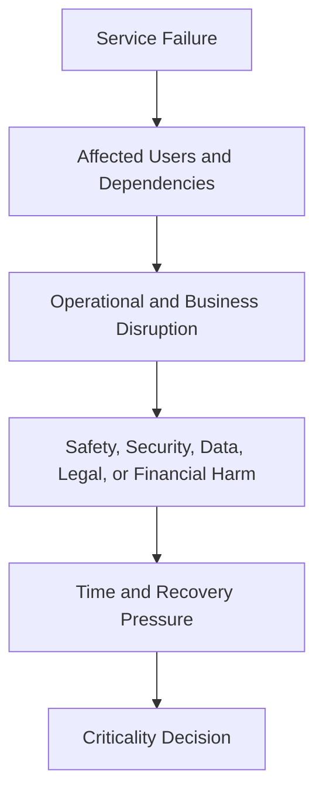

# Service Criticality and Tiering

> Service criticality classifies the consequence of losing, degrading, corrupting, or failing to recover a service. Tiering converts that consequence into explicit ownership, support, governance, and evidence obligations.

## Section Purpose

Not every production service requires the same operating model.

A service that controls emergency access, patient information, financial settlement, production identity, or a widely shared control plane should not receive the same ownership obligations as a temporary internal reporting service with a safe manual alternative.

At the same time, criticality must not become a status contest.

When every team assigns its service the highest tier:

- The classification stops distinguishing risk
- Expensive controls spread without justification
- Review teams become overloaded
- High-consequence services receive no meaningful priority
- Support commitments become impossible to staff
- Exceptions become routine
- Ownership records lose credibility

This section defines a consequence-based method for evaluating:

- User impact
- Business impact
- Safety
- Security
- Data integrity
- Regulatory obligations
- Contractual commitments
- Revenue exposure
- Dependency concentration
- Recovery requirements
- Time sensitivity
- Alternative service availability
- Criticality versus popularity
- Tiering criteria
- Ownership obligations by tier
- Reclassification triggers
- Inflation and misuse of the highest tier

The practical output is a service criticality assessment.

This section classifies importance and establishes ownership obligations. It does not design SLIs, SLOs, error budgets, or alert thresholds. Those mechanisms belong in the service-level engineering chapter.

---

## Learning Objectives

After completing this section, you should be able to:

1. Define service criticality in terms of consequences and recovery needs.
2. Distinguish criticality from popularity, incident severity, availability targets, and technical complexity.
3. Evaluate user, business, safety, security, data, legal, contractual, and financial consequences.
4. Identify dependency concentration and systemic importance.
5. Evaluate time sensitivity and available alternatives.
6. Distinguish inherent criticality from current control strength.
7. Apply a consistent tiering model.
8. Translate tiers into ownership and governance obligations.
9. Use quantitative evidence without pretending that every consequence can be reduced to money.
10. Record uncertainty, peak conditions, and affected populations.
11. Identify triggers that require reclassification.
12. Prevent highest-tier inflation.
13. Produce a complete service criticality assessment.

---

## 1. What Service Criticality Means

Service criticality describes how important a service is based on the consequences of failing to provide its required outcome and the urgency of restoring or replacing that outcome.

Failure may include:

- Complete unavailability
- Partial unavailability
- Excessive latency
- Incorrect results
- Data corruption
- Data loss
- Duplicate processing
- Unauthorized behavior
- Loss of administrative control
- Delayed completion
- Failed recovery

Criticality is not determined by one technical symptom.

It is determined by the harm that service failure can create under defined conditions.

---

## 2. Why Criticality Affects Ownership

Higher criticality normally requires stronger ownership capabilities.

These may include:

- More explicit accountability
- Broader support coverage
- Faster escalation
- Stronger production authority
- More rigorous change review
- Better dependency knowledge
- Tested recovery
- Stronger security controls
- More frequent ownership verification
- Formal risk acceptance
- Greater leadership visibility

Tiering should answer:

> What must the owner be able to know, decide, operate, recover, and prove for a service with this level of consequence?

---

## 3. Criticality Is a Service Property

Classify the service outcome, not merely its components.

A small technical component may support a critical service. A large cluster may support low-impact workloads.

Examples:

- A low-volume identity signing service may be critical because many systems depend on its decisions.
- A large analytics environment may be lower criticality if processing can pause safely for a day.
- One validation function may be critical if failure creates incorrect regulatory submissions.
- A popular marketing page may be high traffic but have a safe alternative and limited harm.

Component size, cost, traffic, and visibility are evidence. They are not the final classification.

---

## 4. Criticality Is Not Popularity

Popularity describes how often or how widely a service is used.

Criticality describes the consequence of failure.

| Service | Popularity | Possible criticality reasoning |
| --- | --- | --- |
| Product recommendation | Very high use | Failure may reduce conversion but preserve core purchase journey |
| Emergency account recovery | Low use | Failure during need may block access completely |
| Payroll calculation | Periodic use | Failure near payroll deadline can cause severe employee harm |
| Certificate revocation | Low routine use | Failure during compromise can create broad security exposure |
| Decorative profile image | High views | Failure may have limited core-product consequence |

A rarely used service can be critical because its moment of use is important.

---

## 5. Criticality Is Not Incident Severity

Criticality is a relatively stable classification of potential service consequence.

Incident severity describes the actual or expected consequence of a specific event.

Examples:

- A Tier 1 payment service may have a low-severity incident affecting one internal test merchant.
- A Tier 3 reporting service may have a severe incident if it corrupts a legally required report before filing.

Criticality informs incident preparation and default response expectations. It does not determine the severity of every incident automatically.

---

## 6. Criticality Is Not an SLO

Criticality states how consequential service failure is.

An SLO defines a measurable reliability target for selected service behavior over a defined window.

A high-criticality service may require several carefully designed objectives. The tier alone cannot determine:

- Which user behavior should be measured
- Which indicator is valid
- Which target is appropriate
- Which window should apply
- Which failures count

This section may state that higher tiers require approved service-level objectives. It does not design them.

---

## 7. Criticality Is Not Technical Complexity

A technically simple service can be critical.

Example:

A small service distributes a configuration value used to disable unsafe transactions during an incident. Its code is simple, but failure removes an important containment mechanism.

A technically complex service can be lower criticality when:

- Work can wait
- Data is reproducible
- Consumers have alternatives
- Failure creates limited harm

Complexity influences operational risk and cost. It does not define business importance by itself.

---

## 8. Criticality Is Not Team Importance

Tiering evaluates services, not organizational status.

High tier does not mean:

- The team is more valuable
- The service deserves every investment request
- Other services do not matter
- Leadership owns the service directly

Low tier does not mean:

- The service can be ownerless
- Security can be ignored
- Data may be lost
- Production changes need no control

Every production service retains minimum ownership obligations.

---

## 9. The Consequence Model

Use several dimensions.



The assessment should trace the full chain rather than assign a tier from intuition.

---

## 10. Inherent Criticality

Inherent criticality is the consequence associated with losing the service outcome before considering the strength of current controls.

It asks:

- What depends on the service?
- What harm can occur?
- How quickly does harm grow?
- What happens if recovery controls fail?
- What alternatives exist?

Inherent criticality should remain relatively stable while the service outcome and consumers remain stable.

---

## 11. Controls and Residual Risk

Controls can reduce the likelihood or consequence of failure.

Examples:

- Redundancy
- Graceful degradation
- Manual alternatives
- Recovery procedures
- Independent backups
- Security controls
- Consumer retries
- Financial reconciliation
- Capacity headroom

Strong controls do not necessarily reduce the service's inherent criticality.

A critical payment service remains critical even when well protected.

Record control effectiveness and residual risk separately. Otherwise, successful engineering may cause a service to be downgraded until its protections are weakened.

---

## 12. Assessment Context

Criticality must be evaluated under defined conditions.

Record:

- Time of day
- Business calendar
- Geography
- Consumer population
- Transaction type
- Data sensitivity
- Regulatory deadline
- Peak demand
- Dependency state
- Duration
- Failure mode

Ten minutes of failure may have different consequences:

- During ordinary traffic
- During payroll cutoff
- During an emergency
- During a financial reporting deadline
- During peak retail demand

Use credible worst-case conditions, not impossible scenarios or average conditions alone.

---

## 13. User Impact

User impact measures how service failure harms people or dependent consumers.

Consider:

- Number of users affected
- Percentage of users affected
- Type of user affected
- Importance of the blocked outcome
- Duration
- Reversibility
- Financial harm
- Loss of access
- Incorrect decisions
- Discrimination or unequal impact
- Vulnerable populations
- Support burden

Questions:

- Can users complete the critical outcome?
- Is harm temporary or permanent?
- Can users understand and recover from failure?
- Are some user groups affected more severely?
- Can support teams provide a safe workaround?

---

## 14. User Count Is Not Enough

Large affected populations often increase criticality, but user count alone is incomplete.

Compare:

- One million users cannot change profile colors.
- Twenty clinicians cannot retrieve current medication records.

The smaller population may face greater harm.

Evaluate:

- Outcome importance
- User vulnerability
- Timing
- Reversibility
- Alternative access
- Safety and legal consequence

---

## 15. Internal User Impact

Employees and internal teams are users.

Internal failure may:

- Stop customer support
- Prevent production recovery
- Delay payroll
- Block order fulfillment
- Prevent regulatory submission
- Stop deployments
- Remove security administration
- Interrupt financial close

Do not discount internal impact because customers do not see the first failure directly.

Trace downstream consequences.

---

## 16. Business Impact

Business impact describes disruption to organizational outcomes.

Consider:

- Sales
- Fulfillment
- Customer service
- Financial operations
- Employee productivity
- Partner relationships
- Market operations
- Strategic launches
- Business continuity
- Reputation
- Decision making

Questions:

- Which business process stops?
- How long can it pause?
- Can work accumulate safely?
- Does delay create permanent loss?
- Which teams must switch to manual work?
- Does failure affect future operations after recovery?

---

## 17. Direct and Indirect Business Impact

Direct impact occurs immediately in the affected process.

Examples:

- Transactions fail
- Shipments stop
- Employees cannot submit payroll

Indirect impact appears through secondary effects.

Examples:

- Support demand rises
- Customer trust declines
- Partners miss commitments
- Staff work overtime
- Reconciliation costs increase
- Future sales fall

Criticality assessment should include credible indirect consequences without inventing unsupported numbers.

---

## 18. Safety Impact

Safety impact concerns potential injury, loss of life, environmental harm, or unsafe physical operation.

Examples may include:

- Clinical decision support
- Emergency communication
- Industrial control
- Transportation coordination
- Public warning systems
- Worker safety monitoring

Assess:

- Severity of possible harm
- Population exposed
- Speed of harm
- Detectability
- Reversibility
- Human intervention
- Safe-state behavior
- Regulatory responsibility

Safety consequence can justify the highest tier even with low traffic.

Safety assessment should involve qualified safety and domain authorities.

---

## 19. Security Impact

Security impact includes failure of confidentiality, integrity, authentication, authorization, accountability, and administrative control.

Consider:

- Unauthorized access
- Privilege escalation
- Credential exposure
- Secret compromise
- Incorrect authorization
- Loss of audit evidence
- Inability to revoke access
- Supply-chain compromise
- Loss of security monitoring
- Broad control-plane compromise

A security service may be critical even if its temporary unavailability does not affect ordinary user traffic.

Example:

Failure of credential revocation during active compromise can allow harm to continue.

---

## 20. Security Dependency Criticality

A service may inherit criticality through security dependence.

Examples:

- Central identity used by all production systems
- Secrets service required for deployment and recovery
- Certificate authority used across customer endpoints
- Security policy service controlling access
- Audit service required to investigate incidents

Assess both:

- Normal service operation
- Emergency security operation

Some security services are most critical during another failure.

---

## 21. Data Integrity Impact

Data integrity concerns whether information remains correct, complete, consistent, attributable, and fit for its purpose.

Failure may cause:

- Incorrect balances
- Duplicate charges
- Missing transactions
- Corrupted records
- Wrong clinical information
- Incorrect entitlements
- Incomplete audit history
- Stale decisions
- Irreconcilable state

Questions:

- Is the data authoritative?
- Can incorrect data be detected?
- Can it be reconstructed?
- Can users act on the wrong result before correction?
- Does corruption propagate?
- Is correction legally or operationally possible?

Data integrity can matter more than availability.

---

## 22. Data Loss and Recoverability

Assess:

- Maximum credible data loss
- Irreplaceable data
- Reproducible data
- Reconciliation sources
- Recovery evidence
- Time required for correction
- Downstream propagation
- Legal retention
- User notification requirements

A service with reproducible analytical data may tolerate loss differently from a service storing unique financial transactions.

Do not assign criticality from database size alone.

---

## 23. Regulatory Obligations

Regulatory obligations may increase criticality when service failure affects:

- Required reporting
- Record retention
- Privacy rights
- Financial controls
- Market operations
- Healthcare obligations
- Safety duties
- Evidence production
- Notification deadlines
- Access control

Record:

- Applicable obligation
- Regulated entity or process
- Deadline
- Consequence of failure
- Decision authority
- Legal or compliance interpretation

SRE and engineering teams should not invent legal conclusions. Use authorized legal, compliance, and risk owners.

---

## 24. Regulatory Scope Is Not Automatic Highest Tier

A service may be in regulatory scope without being the highest criticality.

Assess:

- Which obligation is affected
- Whether an alternative process exists
- Time available
- Data consequence
- Enforcement or reporting exposure
- Dependency on the service

Regulatory relevance is a serious dimension. It is not a shortcut that removes analysis.

---

## 25. Contractual Commitments

Contracts may define:

- Availability commitments
- Support hours
- Response obligations
- Recovery commitments
- Data handling
- Reporting
- Service credits
- Termination rights
- Notification duties

Assess:

- Number and importance of affected agreements
- Financial exposure
- Customer remedies
- Repeat-failure consequences
- Strategic relationship impact
- Whether the service directly supports the commitment

The existence of an SLA does not automatically define criticality. It provides evidence about consequence and obligation.

---

## 26. Contract Versus Actual Consequence

A weak contract may understate actual user harm. A strict contract may overstate operational importance relative to other services.

Criticality assessment should consider both:

- Formal commitments
- Real service consequences

Example:

A free emergency-notification service may have limited contractual penalties but severe safety consequences.

A reporting service may have expensive service credits but a safe alternative process.

Do not replace consequence analysis with contract lookup.

---

## 27. Revenue Exposure

Revenue exposure may include:

- Transactions prevented
- Transactions delayed
- Orders abandoned
- Subscription cancellation
- Advertising interruption
- Usage-based revenue loss
- Partner settlement delays
- Refunds
- Compensation
- Long-term customer loss

Record:

- Revenue mechanism
- Exposure rate
- Peak conditions
- Recoverable versus permanently lost revenue
- Estimation method
- Uncertainty

Avoid false precision.

Example:

> Estimated exposure is based on average completed transactions during the peak hour. It excludes later customer return and therefore represents delayed plus potentially lost revenue, not confirmed permanent loss.

---

## 28. Revenue Is Not the Only Business Measure

Services supporting safety, security, regulation, data integrity, public trust, and internal continuity may be critical without direct revenue.

Do not allow revenue-rich services to dominate tiering when other consequences are more severe.

Use a multidimensional assessment.

---

## 29. Dependency Concentration

Dependency concentration measures how many important outcomes rely on one service or failure domain.

Examples:

- Central identity
- Domain name resolution
- Shared network control
- Secrets management
- Certificate issuance
- Payment gateway
- Messaging backbone
- Shared data store
- Deployment control plane

Assess:

- Number of dependent services
- Criticality of dependents
- Diversity of business domains
- Common failure mode
- Substitutability
- Recovery order
- Hidden or transitive dependence

A service can be systemically critical because it concentrates dependency, even when no customer interacts with it directly.

---

## 30. Dependency Criticality Is Not Simple Inheritance

A dependency does not automatically receive the highest tier of every consumer.

Consider:

- Whether the consumer can continue without it
- Cached or degraded operation
- Alternative providers
- Duration of tolerance
- Which functions depend on it
- Whether failures are contained
- Recovery sequence

Example:

Ten Tier 1 services use a reporting service only for noncritical analytics. The reporting service does not become Tier 1 merely because its consumers are Tier 1.

Classify the consequence of the dependency's actual failure path.

---

## 31. Systemic Importance

A service has systemic importance when its failure can affect many services, teams, regions, tenants, or recovery capabilities at once.

Indicators:

- Shared control plane
- Central administrative access
- Common configuration
- Shared identity
- Common network path
- Cross-domain dependency
- Recovery prerequisite
- High fan-out
- Limited substitution

Systemic importance may justify a higher tier than direct user count suggests.

---

## 32. Recovery Requirements

Criticality assessment must consider how quickly the outcome must return and how much state loss can be tolerated.

Record business needs such as:

- Maximum tolerable disruption
- Maximum tolerable data loss
- Recovery order
- Minimum degraded capability
- Manual continuity period
- Required recovery dependencies
- Verification needs

Do not design technical recovery architecture here.

The assessment states the consequence-based need. Later resilience and service-level work translates that need into engineered objectives and controls.

---

## 33. Recovery Order

Some services must recover before others.

Examples:

- Identity before administrative access
- Network and name resolution before applications
- Data store before transaction processing
- Configuration control before safe traffic restoration
- Communication service before coordinated recovery

Recovery order can reveal hidden criticality.

A service with few ordinary users may be essential to restoring many higher-impact services.

---

## 34. Time Sensitivity

Time sensitivity describes how quickly harm begins and how it grows.

Possible patterns:

- Immediate harm
- Rapidly increasing harm
- Deadline-triggered harm
- Gradual accumulation
- Recoverable backlog
- Permanent loss after a threshold
- Seasonal or event-specific exposure

Examples:

| Service | Time pattern |
| --- | --- |
| Payment authorization | Revenue and user impact begin immediately |
| Payroll calculation | Harm may remain low until payroll cutoff approaches |
| Data pipeline | Backlog may be recoverable until downstream deadline |
| Emergency alerting | Consequence may be immediate during an event |
| Analytics reporting | Delay may be acceptable for several hours |

---

## 35. Duration Bands

An organization may assess consequences at standard durations.

Example bands:

- 5 minutes
- 30 minutes
- 2 hours
- 8 hours
- 24 hours
- 3 days
- 7 days

For each dimension, record how harm changes.

Do not assume linear growth. Some consequences remain low until a deadline and then rise sharply.

---

## 36. Alternative Service Availability

An alternative can reduce the consequence of failure when it is:

- Available
- Safe
- Authorized
- Scalable enough
- Understood by users
- Tested
- Accessible during the same failure
- Capable of preserving required data and controls

Alternatives include:

- Manual process
- Secondary provider
- Degraded mode
- Read-only access
- Offline workflow
- Delayed processing
- Alternative channel

An undocumented workaround is not a dependable alternative.

---

## 37. Alternative Capacity and Duration

Record:

- Maximum users supported
- Maximum duration
- Required staffing
- Data synchronization needs
- Security limitations
- Geographic limits
- Activation time
- Testing evidence

Example:

> Support staff can process 200 urgent account recoveries per day manually for 48 hours. Normal demand is 3,000 per day. The alternative reduces harm for priority cases but does not replace the service.

---

## 38. Alternatives With Shared Failure Modes

An alternative does not reduce criticality when it depends on the same failure domain.

Examples:

- Backup communication channel uses the same identity service
- Secondary region uses the same control plane
- Manual process requires the unavailable database
- Alternative provider uses the same network path
- Recovery credentials are stored in the failed secrets service

Verify independence before giving an alternative credit in the assessment.

---

## 39. Geographic Impact

Assess whether failure affects:

- One site
- One region
- One country
- Several countries
- All service locations

Also consider:

- Local regulatory requirements
- Time zones
- Regional peak periods
- Data residency
- Local alternatives
- Cross-region dependencies

A service may have different consequence profiles by geography. Record the highest credible consequence and important regional differences.

---

## 40. Tenant and Segment Impact

Aggregate classification can hide concentrated harm.

Consider:

- Enterprise customers
- Small customers
- Government users
- Healthcare users
- High-value transactions
- Vulnerable populations
- Internal privileged users
- Specific partner groups

A failure affecting a small segment may still justify high criticality when the consequence is severe.

---

## 41. Irreversibility

Irreversible harm increases criticality.

Examples:

- Lost unique data
- Incorrect financial transfer
- Exposure of confidential data
- Missed legal deadline
- Safety event
- Permanent deletion
- Public release of incorrect information

Compare with reversible harm:

- Delayed report that can be regenerated
- Temporary feature loss with no data effect
- Backlog that can be processed safely later

Reversibility must include the cost and time of correction. Technically reversible does not mean practically harmless.

---

## 42. Detection and Hidden Harm

Criticality can increase when failure is difficult to detect.

Examples:

- Silent data corruption
- Incorrect authorization
- Missing events
- Stale results
- Partial tenant failure
- Duplicate processing
- Failed audit logging

Record:

- Who detects failure
- Expected detection delay
- Whether users discover it first
- Whether harm continues after technical recovery
- Whether historical correction is possible

Do not lower a tier because incidents are rare when detection is weak.

---

## 43. Peak and Special-Event Conditions

Assess criticality during:

- Peak transaction periods
- Payroll or financial close
- Regulatory filing
- Major product launch
- Election or public event
- Emergency response
- Seasonal retail activity
- Scheduled maintenance elsewhere

A service may require a stable tier with documented peak conditions rather than changing tiers every week.

Use the highest credible normal or planned condition. Treat extraordinary temporary conditions through additional risk controls where appropriate.

---

## 44. The Tier Model

This section recommends five tiers.

| Tier | Name | Summary |
| --- | --- | --- |
| Tier 0 | Systemic or Safety-Critical | Failure can create catastrophic, safety, security, or broad recovery consequences |
| Tier 1 | Mission-Critical | Failure quickly stops a primary user or business outcome with severe harm |
| Tier 2 | Business-Critical | Failure creates major impact, but limited tolerance or alternatives exist |
| Tier 3 | Standard Production | Failure creates contained impact with practical recovery time or alternatives |
| Tier 4 | Limited-Impact Production | Failure creates low, reversible, and narrowly contained impact |

Tier numbers vary across organizations. Publish the meaning. Never assume that every reader interprets Tier 0 or Tier 1 the same way.

---

## 45. Tier 0: Systemic or Safety-Critical

Tier 0 is reserved for services whose failure, corruption, or compromise can create catastrophic or systemic consequences.

Possible indicators:

- Credible loss of life or serious safety harm
- Broad security compromise
- Loss of production administrative control
- Failure of recovery across many critical services
- Irreversible corruption of essential authoritative data
- Organization-wide dependency concentration
- Severe legal or societal consequence

Examples may include:

- Emergency safety control
- Central production identity
- Critical secrets control plane
- Foundational network control
- System of record for irreplaceable high-consequence data

Use Tier 0 sparingly. Many organizations may have no Tier 0 services.

---

## 46. Tier 0 Ownership Obligations

Possible requirements:

- Executive or designated risk ownership
- One clearly accountable engineering team
- Continuous support coverage
- Tested escalation and emergency authority
- Named recovery leadership
- Strong separation of duties
- Independent recovery access
- Frequent ownership and dependency review
- Formal change controls proportionate to risk
- Verified continuity and recovery evidence
- Security and data authority participation
- Explicit successor and continuity planning
- Formal exception approval

These are baseline ownership expectations. Technical implementation depends on the service.

---

## 47. Tier 1: Mission-Critical

Tier 1 applies when failure rapidly causes severe user or business harm to a primary outcome.

Possible indicators:

- Core customer journey stops
- Major revenue activity stops
- Large customer population loses essential access
- Severe contractual exposure begins quickly
- Important authoritative data is at risk
- Few practical alternatives exist
- Recovery is time-sensitive
- Several critical services depend on it

Examples may include:

- Payment authorization
- Customer authentication
- Order acceptance
- Critical transaction processing
- High-impact partner gateway

---

## 48. Tier 1 Ownership Obligations

Possible requirements:

- Verified accountable team
- Defined continuous or risk-appropriate support
- Tested escalation
- Clear incident and change authority
- Current dependency ownership
- Production readiness review
- Tested rollback and recovery
- Security and data ownership
- Formal risk exceptions
- Frequent ownership verification
- Consumer and business-owner participation
- Capacity to perform corrective engineering

---

## 49. Tier 2: Business-Critical

Tier 2 applies when failure creates major consequences, but the organization has some time, containment, or alternative capability.

Possible indicators:

- Important business process is materially degraded
- Revenue is delayed or partially lost
- Many users are affected but core service can degrade
- Manual or secondary alternatives exist for limited time
- Backlog can be recovered within a defined window
- Contractual or regulatory consequence exists but is not immediate
- Dependency impact is significant but contained

Examples may include:

- Customer notification
- Order fulfillment coordination
- Important internal finance processing
- Customer-support administration
- Data pipeline feeding next-day operations

---

## 50. Tier 2 Ownership Obligations

Possible requirements:

- Named accountable team
- Support coverage aligned to time sensitivity
- Documented escalation
- Change and rollback ownership
- Dependency inventory
- Recovery procedure and periodic verification
- Security and data ownership
- Consumer communication route
- Scheduled ownership review
- Documented manual alternatives
- Exceptions approved by service and business authority

---

## 51. Tier 3: Standard Production

Tier 3 applies when failure creates contained, reversible impact and practical recovery time exists.

Possible indicators:

- Limited user or team impact
- Work can wait safely
- Data can be regenerated
- A tested alternative exists
- Financial impact is modest
- Dependencies are limited
- Recovery can occur during normal support hours

Examples may include:

- Nonurgent internal reporting
- Team documentation search
- Optional product enhancement
- Low-impact internal workflow

Tier 3 remains production. Ownership, security, data, and lifecycle responsibilities still apply.

---

## 52. Tier 3 Ownership Obligations

Possible requirements:

- Named accountable team
- Business-hours or defined support
- Escalation route
- Safe change ownership
- Basic dependency record
- Recovery or rebuild procedure
- Security and data controls
- Periodic ownership verification
- Known consumer record
- Documented exception process

---

## 53. Tier 4: Limited-Impact Production

Tier 4 applies when failure is low-impact, reversible, narrowly contained, and does not block important outcomes.

Possible indicators:

- Small approved user group
- Optional capability
- Safe removal or delay
- No sensitive or irreplaceable data
- No critical downstream dependency
- No meaningful contractual or regulatory exposure
- Simple alternative exists

Examples may include:

- Limited internal experiment
- Optional team productivity service
- Nonessential preview feature

Do not assign Tier 4 merely because the service is small or experimental. Evaluate real data, consumers, and failure consequences.

---

## 54. Tier 4 Ownership Obligations

Minimum requirements still include:

- Named owner
- Defined consumer scope
- Production data restrictions
- Support expectation
- Safe shutdown authority
- Basic security controls
- Lifecycle expiry or review
- Dependency record
- No unapproved critical consumer

Tier 4 cannot mean ungoverned production.

---

## 55. Tier Comparison

| Dimension | Tier 0 | Tier 1 | Tier 2 | Tier 3 | Tier 4 |
| --- | --- | --- | --- | --- | --- |
| Consequence | Catastrophic or systemic | Severe and rapid | Major but partly tolerable | Contained and reversible | Low and narrow |
| Alternative | None or severely limited | Limited | Partial or time-limited | Practical | Readily available |
| Support | Continuous | Continuous or near-continuous | Time-sensitive coverage | Defined business-hours or appropriate coverage | Limited but explicit |
| Escalation | Immediate, tested | Rapid, tested | Defined and periodically tested | Documented | Basic documented route |
| Recovery evidence | Frequent and rigorous | Regular and tested | Periodic | Documented and verified as appropriate | Rebuild or shutdown path |
| Ownership review | Frequent | Regular | Scheduled | Periodic | Lifecycle-based |
| Exception authority | Senior risk authority | Formal service and business authority | Service and business authority | Service authority | Named owner within policy |

Exact obligations should be adapted without weakening the distinction between tiers.

---

## 56. Tiering Criteria

Assess at least these dimensions:

1. User impact
2. Business impact
3. Safety
4. Security
5. Data integrity
6. Regulatory obligation
7. Contractual commitment
8. Revenue exposure
9. Dependency concentration
10. Recovery requirement
11. Time sensitivity
12. Alternative availability
13. Irreversibility
14. Detection difficulty

Document both:

- Most likely significant failure
- Highest credible consequence

Do not use an impossible catastrophe to inflate the tier.

---

## 57. Dimension Rating Scale

Use a common consequence scale.

| Rating | Meaning |
| ---: | --- |
| 0 | No material consequence identified |
| 1 | Low, local, reversible consequence |
| 2 | Moderate, contained consequence |
| 3 | Major consequence requiring urgent coordinated response |
| 4 | Severe consequence to core outcomes, important obligations, or broad dependencies |
| 5 | Catastrophic, systemic, irreversible, or safety-critical consequence |

Every rating needs a rationale and evidence.

---

## 58. Criticality Scoring

Scoring can support consistency. It should not replace judgment.

A simple method:

- Rate every dimension from 0 to 5.
- Record uncertainty.
- Identify any override conditions.
- Review the result with business, risk, security, data, and service owners as relevant.

Do not simply total all scores and assign a tier without interpretation.

Why:

- Safety consequences should not be diluted by low scores elsewhere.
- Dependency concentration may create systemic importance.
- A severe regulatory or data-integrity consequence may justify an override.
- Several moderate dimensions may collectively justify a higher tier.

---

## 59. Override Conditions

Possible automatic review or minimum-tier conditions:

- Credible loss of life or severe safety harm
- Organization-wide production control dependency
- Irreversible loss of essential authoritative data
- Broad unauthorized access or security compromise
- Critical legal or regulatory obligation
- Recovery prerequisite for several Tier 1 services
- No alternative for an essential public or customer outcome

An override should trigger authoritative review. It should not be applied through an undocumented individual judgment.

---

## 60. Tier Decision Method

Use this sequence:

1. Confirm the service boundary.
2. Confirm current lifecycle state.
3. Identify consumers and dependents.
4. Define credible failure conditions.
5. Assess consequence by dimension.
6. Assess how harm grows over time.
7. Test alternatives and their independence.
8. Identify dependency concentration.
9. Record uncertainty and evidence limitations.
10. Apply override conditions.
11. Propose a tier.
12. Map the tier to ownership obligations.
13. Obtain approval.
14. Record reclassification triggers.
15. Verify the catalog record.

---

## 61. Criticality Evidence

Evidence may include:

- Critical User Journeys
- Business process maps
- Consumer inventory
- Transaction data
- User research
- Incident history
- Dependency maps
- Data classification
- Security risk assessments
- Regulatory analysis
- Contracts
- Revenue analysis
- Continuity plans
- Recovery tests
- Support records
- Seasonal demand
- Manual workaround tests

Evidence should be current, traceable, and explicit about limitations.

---

## 62. Evidence Confidence

Use confidence levels:

| Confidence | Meaning |
| --- | --- |
| High | Several reliable sources support the consequence assessment |
| Medium | Evidence is plausible but incomplete or indirect |
| Low | Important assumptions, conflicts, or missing data remain |
| Unknown | The dimension has not been assessed |

A high proposed tier with low evidence confidence requires further review. A low proposed tier with low confidence may create hidden under-classification.

---

## 63. Quantitative and Qualitative Evidence

Quantitative evidence includes:

- Users affected
- Transactions per minute
- Revenue rate
- Backlog growth
- Recovery duration
- Contract penalties
- Dependency count
- Data volume

Qualitative evidence includes:

- Safety consequence
- Trust damage
- Legal interpretation
- User vulnerability
- Strategic partner impact
- Loss of administrative control

Use both. Do not discard important consequences because they are difficult to express as one number.

---

## 64. Avoiding False Precision

Weak assessment:

> The service will lose exactly $218,442 per hour.

Stronger assessment:

> During peak weekday traffic, the service processes approximately $180,000 to $240,000 in transactions per hour. Historical retry behavior suggests some volume will be delayed rather than permanently lost. Permanent loss remains uncertain.

Use:

- Ranges
- Assumptions
- Scenarios
- Confidence
- Sensitivity analysis

Criticality classification should be defensible, not mathematically theatrical.

---

## 65. Criticality and Ownership Obligations

The assessment should produce explicit ownership consequences.

For every tier, define requirements for:

- Accountable team
- Business or product owner
- Support coverage
- Escalation
- Change authority
- Incident authority
- Dependency ownership
- Data responsibility
- Security responsibility
- Recovery responsibility
- Documentation
- Ownership review
- Exception approval

If the tier changes no ownership requirement, the model is not operational.

---

## 66. Accountable Team Requirements

All tiers require a named accountable team.

Higher tiers may additionally require:

- Minimum staffing depth
- Successor coverage
- Cross-training
- Multiple authorized responders
- Leadership owner
- Named deputy
- Dependency coordination capacity
- Protected engineering capacity

A highly critical service cannot depend on one person's knowledge or availability.

---

## 67. Support Coverage Requirements

Support coverage should follow consequence and time sensitivity.

Possible models:

- Continuous on-call
- Extended-hours support
- Business-hours support with emergency escalation
- Next-business-day response
- Owner notification without immediate response commitment

Tier alone should not force identical support for every service.

Example:

A Tier 2 overnight batch service may require support during its processing window rather than continuous daytime paging.

---

## 68. Escalation Requirements

Higher tiers should require:

- Tested contact routes
- Primary and secondary escalation
- Management or business escalation
- Security and data escalation
- Vendor escalation
- Authority available during support hours
- Regular verification

An escalation list that has never been tested is weak evidence.

---

## 69. Change Authority Requirements

Criticality should influence:

- Who may approve high-risk changes
- Who may roll back
- Who may stop traffic
- Who may disable features
- Which changes require additional review
- Which emergency actions are preauthorized

Higher tier does not always mean more manual approval.

Safe automation, progressive exposure, fast rollback, and clear authority may provide stronger control than slow committees.

Detailed change engineering belongs in a later chapter.

---

## 70. Recovery Ownership Requirements

Criticality should determine the strength of recovery ownership evidence.

Possible requirements:

- Named recovery owner
- Recovery dependency map
- Data restoration authority
- Recovery access
- Periodic test
- Business verification
- Communication responsibility
- Failback authority

This section defines who must own and prove recovery. It does not design the technical recovery architecture.

---

## 71. Dependency Ownership Requirements

Higher-tier services should have stronger evidence for:

- Upstream dependency owners
- Downstream consumers
- Escalation routes
- Shared failure domains
- External-provider contacts
- Recovery order
- Dependency changes

Unknown critical dependencies may invalidate the tier assessment or require a temporary higher control posture.

---

## 72. Documentation Requirements

Documentation depth should be proportionate to consequence.

Possible requirements:

- Service boundary
- Ownership record
- Consumer record
- Dependency map
- Change and rollback information
- Recovery information
- Security and data responsibilities
- Known risks
- Escalation
- Lifecycle state
- Criticality rationale

Higher tiers normally require more frequent verification, not merely more pages.

---

## 73. Review Frequency

Review frequency may increase with tier.

Example:

| Tier | Recommended ownership and criticality review |
| --- | --- |
| Tier 0 | Quarterly and after every material trigger |
| Tier 1 | At least twice yearly and after material triggers |
| Tier 2 | Annually and after material triggers |
| Tier 3 | Every 18 to 24 months or after material triggers |
| Tier 4 | Lifecycle-based and after material triggers |

These are examples. Regulatory, contractual, or organizational policies may require different intervals.

Event-driven review matters more than calendar review alone.

---

## 74. Reclassification Triggers

Review criticality when:

- A new critical consumer appears
- User population changes materially
- A Critical User Journey changes
- Revenue exposure changes
- Regulatory scope changes
- Contractual commitments change
- Data classification or authority changes
- Safety use is introduced
- Security responsibility expands
- Dependency concentration increases
- A service becomes a recovery prerequisite
- Alternatives are added, removed, or fail testing
- Recovery needs change
- Geographic scope expands
- Architecture changes blast radius
- A major incident reveals hidden consequence
- A service enters Maintenance, Deprecated, or Retirement Pending
- Ownership capacity changes materially

---

## 75. Reclassification Is Not Automatic Downgrade

New controls may reduce residual risk without changing inherent criticality.

Before lowering a tier, confirm that:

- The service outcome is less important
- Consequences have genuinely changed
- Dependents have left
- Independent alternatives exist
- Data and security obligations changed
- Recovery urgency decreased
- Changes are durable and verified

Do not downgrade merely because incident count decreased. Strong ownership may be the reason the service performs well.

---

## 76. Reclassification Process

1. Record the trigger.
2. Confirm the current service boundary.
3. Reassess all consequence dimensions.
4. Review changed evidence.
5. Test alternative-service claims.
6. Review dependency concentration.
7. Compare current and proposed ownership obligations.
8. Identify risks created by the change.
9. Obtain authorized approval.
10. Update the catalog and history.
11. Communicate changed obligations.
12. Verify implementation.

---

## 77. Temporary Criticality Elevation

Some events create temporary higher consequence.

Examples:

- Product launch
- Financial close
- Payroll period
- Public emergency
- Major migration
- Regulatory deadline
- Peak retail season

Instead of changing the permanent tier repeatedly, record a temporary elevated operating posture with:

- Start and end conditions
- Additional support
- Change restrictions
- Escalation changes
- Capacity or recovery precautions
- Owner

The base tier remains documented.

---

## 78. Risks of Assigning Every Service the Highest Tier

Highest-tier inflation creates:

- Unfunded support commitments
- Excessive review queues
- Unnecessary complexity
- Alert overload
- Weak prioritization
- Exception normalization
- Loss of confidence in governance
- Misallocation of engineering effort
- Inability to distinguish systemic services
- Burnout

If every service is critical, the organization has not classified consequence. It has declared anxiety.

---

## 79. Causes of Tier Inflation

Common causes include:

- Teams believe high tier secures funding
- Owners fear being blamed for under-classification
- Internal policy gives low tiers inadequate support
- Leaders call every product essential
- Revenue is counted without recoverability
- Worst-case scenarios ignore probability and credibility
- Dependency count is treated as automatic inheritance
- Contracts are interpreted without context
- No authority is willing to approve lower tiers

Fix the incentive and governance problem, not only the labels.

---

## 80. Controlling Tier Inflation

Controls include:

- Published criteria
- Required evidence
- Independent review for Tier 0 and Tier 1
- Ownership-cost disclosure
- Comparison with known reference services
- Highest-credible-consequence analysis
- Alternative and time-sensitivity testing
- Periodic portfolio calibration
- Approval for overrides
- Downgrade review when outcomes change

Ask:

> Can the organization actually meet every obligation attached to the proposed tier?

If not, either the tier, controls, or operating capacity must change.

---

## 81. Risks of Under-Classification

Under-classification can create:

- Inadequate support coverage
- Missing recovery evidence
- Weak ownership
- Slow escalation
- Unsafe change authority
- Hidden regulatory exposure
- Unrecognized dependency concentration
- Insufficient investment

Under-classification often affects internal, low-traffic, control-plane, batch, and legacy services.

Use evidence from incidents, business processes, and dependencies to reveal hidden importance.

---

## 82. Portfolio Calibration

Review tiers across the service portfolio, not only one service at a time.

Compare:

- Similar consequences
- Similar consumer outcomes
- Similar data obligations
- Similar dependency concentration
- Similar recovery needs
- Similar alternatives

Questions:

- Are similar services classified differently without reason?
- Is one business unit using Tier 1 for everything?
- Are internal control planes under-classified?
- Are optional customer features over-classified?
- Can ownership obligations be funded?

Calibration improves consistency without replacing service-specific judgment.

---

## 83. Criticality Governance

Governance should define:

- Tier definitions
- Assessment dimensions
- Evidence requirements
- Override conditions
- Approval authority
- Review triggers
- Reclassification process
- Exception process
- Portfolio calibration
- Audit and reporting
- Model versioning

Governance should include technical, product, business, security, data, risk, and compliance participation where relevant.

---

## 84. Criticality Decision Rights

Recommended roles:

| Role | Responsibility |
| --- | --- |
| Service owner | Provides technical, dependency, and operational evidence |
| Product or business owner | Provides user, process, revenue, and strategic consequence |
| Security owner | Assesses security consequence and control dependence |
| Data owner | Assesses integrity, loss, privacy, and retention consequence |
| Risk or compliance owner | Interprets risk, regulatory, and policy obligations |
| Criticality authority | Approves tier under the organizational model |
| Governance steward | Maintains definitions and portfolio consistency |

The service team should not unilaterally accept business, safety, legal, or regulatory consequences outside its authority.

---

## 85. Criticality Exceptions

An exception may be required when a service cannot yet meet its tier obligations.

Record:

- Required obligation
- Current gap
- Consequence
- Compensating control
- Remediation owner
- Approver
- Deadline
- Verification
- Escalation if overdue

Do not lower the tier merely to hide a capability gap.

---

## 86. Criticality During Lifecycle Changes

Lifecycle state does not remove criticality immediately.

### Production Candidate

Criticality depends on exposure, data, and possible consequence.

### Maintenance

Criticality remains while consumers and outcomes remain.

### Deprecated

Criticality may remain high until migration completes.

### Retirement Pending

Criticality remains until operation, data, and dependencies are safely resolved.

### Retired

Operational criticality ends, but data, legal, security, or archive obligations may remain important.

---

## 87. Production Scenario: Low Traffic, Highest Consequence

A certificate-revocation service receives few routine requests. During a security incident, it is required to revoke compromised production identities across the organization. It has no tested alternative.

### Assessment

- Popularity: Low
- Security consequence: Severe
- Dependency concentration: Broad
- Time sensitivity: Immediate during compromise
- Alternative: None verified
- Recovery importance: High

The service may justify Tier 0 or Tier 1 depending on the organization's definitions.

Traffic volume would produce the wrong answer.

---

## 88. Production Scenario: High Traffic, Limited Consequence

A recommendation service handles millions of requests each day. If unavailable, the product displays popular items instead. Checkout and search continue. No sensitive data is lost.

### Assessment

- Popularity: High
- Core user impact: Limited
- Revenue effect: Possible reduction, not complete stop
- Alternative: Automatic and tested
- Data consequence: Low
- Recovery urgency: Moderate

The service may be Tier 2 or Tier 3 rather than Tier 1, depending on measured business impact.

High request volume does not determine criticality.

---

## 89. Production Scenario: The Payroll Deadline

A payroll service is used intensively for two days each month. Most of the month, failure creates little immediate impact. Failure during payroll cutoff could delay employee payment and create legal or contractual consequences.

### Assessment

- User impact: High during deadline
- Time sensitivity: Deadline-triggered
- Alternative: Manual process supports only a small percentage of employees
- Regulatory and contractual impact: Requires authorized review
- Popularity: Periodic

The stable tier should reflect the credible payroll deadline consequence. A temporary elevated operating posture may add controls during payroll processing.

---

## 90. Production Scenario: The Shared Logging Service

A central logging service supports 200 applications. Most applications continue serving traffic when logging fails. Security investigations, audit evidence, and incident diagnosis become weaker. Some regulated systems require retained logs.

### Assessment Questions

- Which consumers require logs for compliance?
- Does failure cause data loss or temporary delay?
- Can logs buffer locally?
- Can security detection continue?
- Does recovery depend on the same service?
- Are obligations different by consumer?

The service should not inherit the highest tier of every application automatically. Its own security, data, regulatory, and recovery consequences determine the tier.

---

## 91. Production Scenario: Every Service Is Tier 1

An organization has 140 production services. Teams classified 126 as Tier 1 because Tier 1 services receive priority funding. The organization can staff continuous support for only 25 services.

### Findings

- Tier definitions do not distinguish consequence.
- Funding incentives encourage inflation.
- Ownership obligations are not credible.
- Truly critical services cannot be prioritized.

### Required Response

1. Review incentive design.
2. Publish evidence-based criteria.
3. Calibrate against reference services.
4. Require obligation-cost acknowledgement.
5. Reassess dependency concentration and alternatives.
6. Approve exceptions for genuine capability gaps.
7. Do not downgrade solely to fit staffing without accepting the resulting risk.

---

## 92. Service Criticality Assessment Template

Use this template for the practical output.

```markdown
# Service Criticality Assessment

## Record Control

- Service ID:
- Service name:
- Assessment version:
- Assessment date:
- Current tier:
- Proposed tier:
- Accountable service owner:
- Assessment owner:
- Approving authority:
- Next review date or trigger:

## Service Context

- Service outcome:
- Service boundary record:
- Lifecycle state:
- Lifecycle posture:
- Primary service type:
- Primary consumers:
- Critical User Journeys supported:
- Geographic scope:
- Peak or special conditions:

## Credible Failure Conditions

1.
2.
3.

## Consequence Assessment

| Dimension | Rating 0 to 5 | Evidence | Consequence | Time pattern | Confidence |
| --- | ---: | --- | --- | --- | --- |
| User impact |  |  |  |  |  |
| Business impact |  |  |  |  |  |
| Safety |  |  |  |  |  |
| Security |  |  |  |  |  |
| Data integrity |  |  |  |  |  |
| Regulatory |  |  |  |  |  |
| Contractual |  |  |  |  |  |
| Revenue |  |  |  |  |  |
| Dependency concentration |  |  |  |  |  |
| Recovery requirement |  |  |  |  |  |
| Time sensitivity |  |  |  |  |  |
| Alternative availability |  |  |  |  |  |
| Irreversibility |  |  |  |  |  |
| Detection difficulty |  |  |  |  |  |

## User Impact

- Users affected:
- Important segments:
- Outcome blocked or degraded:
- Reversibility:
- User workaround:
- Support consequence:

## Business Impact

- Business process:
- Direct impact:
- Indirect impact:
- Strategic impact:
- Manual continuity:
- Backlog recovery:

## Safety, Security, and Data

- Safety consequence:
- Security consequence:
- Authoritative data affected:
- Maximum credible data loss:
- Corruption or propagation risk:
- Recovery and reconciliation capability:

## Regulatory and Contractual

- Regulatory obligations:
- Regulatory owner interpretation:
- Contractual commitments:
- Notification obligations:
- Financial or legal consequence:

## Revenue Exposure

- Revenue mechanism:
- Exposure range:
- Peak period:
- Recoverable delay:
- Permanent-loss estimate:
- Assumptions:

## Dependency Concentration

- Direct dependents:
- Critical dependents:
- Transitive dependents:
- Shared failure domains:
- Recovery-order importance:
- Systemic consequence:

## Recovery and Time Sensitivity

- Harm begins after:
- Harm becomes severe after:
- Maximum tolerable disruption:
- Maximum tolerable data loss:
- Minimum degraded capability:
- Required recovery order:

## Alternatives

| Alternative | Capacity | Duration | Activation time | Independence | Limitations | Test evidence |
| --- | --- | --- | --- | --- | --- | --- |
|  |  |  |  |  |  |  |

## Inherent Criticality

- Highest credible consequence:
- Most likely significant consequence:
- Proposed inherent tier:
- Override conditions:
- Rationale:

## Current Controls and Residual Risk

| Control | Consequence reduced | Evidence | Limitation | Owner |
| --- | --- | --- | --- | --- |
|  |  |  |  |  |

- Residual risk summary:
- Control gaps:
- Risk-acceptance authority:

## Ownership Obligations

- Accountable team requirement:
- Support coverage:
- Escalation:
- Change authority:
- Incident authority:
- Recovery ownership:
- Security ownership:
- Data ownership:
- Dependency ownership:
- Documentation requirement:
- Review frequency:
- Exception authority:

## Tier Decision

- Approved tier:
- Decision rationale:
- Conditions:
- Exceptions:
- Effective date:
- Approver:
- Dissenting views:

## Reclassification Triggers

- Consumer change:
- Business change:
- Safety, security, or data change:
- Regulatory or contractual change:
- Dependency change:
- Recovery change:
- Alternative change:
- Lifecycle change:
- Incident trigger:

## Verification

- Catalog updated:
- Ownership obligations implemented:
- Support coverage verified:
- Escalation tested:
- Exceptions recorded:
- Review scheduled:
```

---

## 93. Practical Exercise: Assess Service Criticality

### Objective

Assess one production service and produce an evidence-based tier decision.

### Step 1: Confirm the Service

Use the approved or provisional boundary record.

### Step 2: Define Failure Conditions

Include at least:

- Unavailability
- Incorrect behavior or corruption
- Failed recovery

### Step 3: Identify Consumers and Dependencies

Record direct users, internal consumers, downstream services, and recovery dependents.

### Step 4: Assess Every Dimension

Rate all required dimensions and document evidence, time pattern, and confidence.

### Step 5: Analyze Alternatives

Test capacity, duration, safety, independence, and activation time.

### Step 6: Assess Time

Describe consequences at several duration bands.

### Step 7: Propose the Inherent Tier

Use consequence before giving credit for controls.

### Step 8: Review Controls

Record how controls reduce residual risk without automatically changing inherent criticality.

### Step 9: Define Ownership Obligations

Translate the proposed tier into support, escalation, authority, recovery, documentation, and review requirements.

### Step 10: Calibrate

Compare the service with at least two reference services.

### Step 11: Obtain Review

Include technical, product, business, security, data, risk, or compliance reviewers as relevant.

### Step 12: Record Reclassification Triggers

Define the evidence that would require reassessment.

---

## 94. Exercise Acceptance Criteria

The criticality assessment is complete when:

- The service boundary is clear.
- Credible failure conditions include more than unavailability.
- User and business consequences are traced.
- Safety, security, and data integrity are assessed.
- Regulatory and contractual conclusions involve authorized owners.
- Revenue estimates show assumptions and uncertainty.
- Dependency concentration and systemic importance are reviewed.
- Recovery and time sensitivity are explicit.
- Alternatives are tested for capacity, duration, and independence.
- Popularity is not used as a substitute for consequence.
- Inherent criticality is separated from current control strength.
- The tier follows published criteria.
- Override conditions are reviewed.
- Ownership obligations are assigned.
- The decision has an authority and effective date.
- Reclassification triggers are recorded.
- Highest-tier inflation has been challenged.

---

## 95. Criticality Review Checklist

### Context

- [ ] Service boundary is approved or explicitly provisional.
- [ ] Lifecycle state is current.
- [ ] Consumers and dependencies are known.
- [ ] Peak and special conditions are included.

### Consequences

- [ ] User impact is assessed by outcome, not count alone.
- [ ] Business processes are traced.
- [ ] Safety impact is reviewed.
- [ ] Security impact is reviewed.
- [ ] Data integrity and loss are reviewed.
- [ ] Regulatory and contractual obligations are reviewed.
- [ ] Revenue exposure uses ranges and assumptions.

### Time and Alternatives

- [ ] Harm growth over time is stated.
- [ ] Recovery order is known.
- [ ] Alternatives are tested.
- [ ] Shared failure modes are considered.
- [ ] Irreversible harm is identified.

### Tier Decision

- [ ] Primary evidence is cited.
- [ ] Confidence is recorded.
- [ ] Override conditions are checked.
- [ ] Reference services are compared.
- [ ] Ownership obligations can be met.
- [ ] Approval authority is recorded.

### Governance

- [ ] Exceptions are owned and time-limited.
- [ ] Reclassification triggers are defined.
- [ ] The catalog is updated.
- [ ] The decision history is preserved.
- [ ] Portfolio inflation and under-classification are reviewed.

---

## 96. Knowledge Check

1. What does service criticality classify?
2. Why should criticality affect ownership obligations?
3. How does criticality differ from popularity?
4. How does criticality differ from incident severity?
5. Why is criticality not an SLO?
6. Why is technical complexity not a reliable tiering rule?
7. What is inherent criticality?
8. Why should strong controls not automatically lower the tier?
9. Why must assessment context include time and peak conditions?
10. Why is user count insufficient?
11. How can an internal service be critical?
12. What types of safety impact require specialist authority?
13. How can a security control plane be systemically important?
14. Why can data integrity matter more than availability?
15. How should regulatory obligations be assessed?
16. Why does a contract not determine criticality alone?
17. What is dependency concentration?
18. Why does a dependency not automatically inherit every consumer's tier?
19. What does time sensitivity describe?
20. What makes an alternative credible?
21. Why can shared failure modes invalidate an alternative?
22. What is an override condition?
23. Why should scoring not determine the tier automatically?
24. What ownership obligations should tiering influence?
25. What should trigger reclassification?
26. Why is lower incident count insufficient reason to downgrade?
27. What harm does highest-tier inflation create?
28. Why should service portfolios be calibrated?

---

## 97. Knowledge Check Answers

1. The consequence of losing, degrading, corrupting, or failing to recover the service outcome under defined conditions.
2. Higher consequences require stronger accountability, support, authority, recovery, dependency, security, and evidence capabilities.
3. Popularity measures use. Criticality measures consequence.
4. Criticality is a standing service classification. Incident severity evaluates one event's actual or expected impact.
5. It classifies importance. An SLO is a measurable target for selected behavior over a defined window.
6. Simple systems can support essential outcomes, while complex systems may support work that can wait safely.
7. The consequence before considering the effectiveness of current controls.
8. Controls may be the reason the critical service remains safe. Removing the classification can weaken the protections.
9. Consequences vary by duration, deadline, geography, demand, and event conditions.
10. A small vulnerable group may face severe harm while millions may lose only an optional feature.
11. It may support payroll, recovery, regulation, finance, identity, security, or another essential process.
12. Credible injury, loss of life, environmental harm, or unsafe physical operation.
13. Its failure can remove access, policy, recovery, or control across many important services.
14. A service can remain reachable while returning incorrect, duplicated, corrupted, or stale results that create greater harm.
15. Record the obligation, affected process, deadline, consequence, and interpretation from authorized legal, compliance, or risk owners.
16. Contracts provide obligation evidence but may understate or overstate actual user, safety, security, data, or business consequence.
17. The degree to which many important services or outcomes rely on one service or shared failure domain.
18. The dependent service may tolerate failure, degrade safely, cache results, or use alternatives. Assess the actual failure path.
19. How soon harm begins and how it grows or changes over time.
20. It is safe, authorized, tested, independent, scalable enough, and usable for the required duration.
21. The alternative may fail at the same time as the primary service.
22. A severe dimension that requires minimum-tier or authoritative review regardless of an aggregate score.
23. Severe single dimensions and systemic consequences can be hidden by totals, while several moderate consequences may combine materially.
24. Accountable ownership, support, escalation, change, incident authority, dependencies, security, data, recovery, documentation, review, and exceptions.
25. Material change in users, outcomes, business, safety, security, data, regulation, contracts, dependencies, recovery, alternatives, geography, architecture, incidents, or lifecycle.
26. Strong controls and ownership may have reduced incidents without reducing the consequence of future failure.
27. It destroys prioritization, creates unfunded obligations, overloads review, normalizes exceptions, and increases burnout.
28. It reveals inconsistent decisions, inflation, under-classification, and obligations the organization cannot support.

---

## 98. Reflection Questions

1. Which low-traffic service has the highest hidden consequence?
2. Which popular service has a safe alternative?
3. Which internal service would block customer recovery?
4. Which service creates the greatest data-integrity exposure?
5. Which safety or security conclusion requires specialist review?
6. Which service is critical mainly because of dependency concentration?
7. Which alternative shares a failure domain with the primary service?
8. Which failure becomes severe only near a deadline?
9. Which revenue estimate confuses delayed and permanently lost revenue?
10. Which deprecated service remains highly critical?
11. Which service has a high tier but cannot meet the associated support obligation?
12. Which service is under-classified because it is internal or legacy?
13. Which tier decision relies on weak evidence?
14. Which control reduced residual risk without reducing inherent importance?
15. Which event should trigger the next reclassification?

---

## 99. Key Takeaways

- Service criticality classifies consequence, not prestige, popularity, traffic, complexity, or team importance.
- Failure includes unavailability, delay, incorrectness, corruption, duplication, compromise, and failed recovery.
- User, business, safety, security, data, regulatory, contractual, revenue, dependency, recovery, time, and alternative dimensions must be assessed together.
- Internal and low-volume services can be highly critical.
- Inherent criticality should be separated from current control strength and residual risk.
- Dependency concentration can create systemic importance.
- Alternatives reduce consequence only when they are safe, tested, sufficient, and independent.
- Criticality is separate from incident severity, SLOs, lifecycle state, and service type.
- Tiering must translate into explicit ownership obligations.
- Tier 0 should be rare and reserved for catastrophic, systemic, or safety-critical consequences.
- High-tier inflation destroys prioritization and creates obligations the organization cannot meet.
- Under-classification hides risk in internal, batch, control-plane, and legacy services.
- Reclassification requires evidence, authority, history, and implementation of changed obligations.
- Strong reliability performance is not evidence that a critical service has become unimportant.
- SLO design belongs in the service-level engineering chapter.

---

## Related SRE World Sections

- [Identifying Production Services](./01-Identifying-Production-Services.md)
- [Defining Service Boundaries](./02-Defining-Service-Boundaries.md)
- [Service Taxonomy and Classification](./03-Service-Taxonomy-and-Classification.md)
- [Service Lifecycle States](./04-Service-Lifecycle-States.md)
- [Reliability as a Product Feature](../01-SRE-Foundations/04-Reliability-as-a-Product-Feature.md)
- [Reliability and Business Risk](../01-SRE-Foundations/05-Reliability-and-Business-Risk.md)
- [Critical User Journeys](../01-SRE-Foundations/10-Critical-User-Journeys.md)
- [Risk Tolerance](../01-SRE-Foundations/11-Risk-Tolerance.md)
- [Service Ownership](./README.md)

---

## Next Section

[Section 6: Accountable Teams and Named Owners](./06-Accountable-Teams-and-Named-Owners.md)

---

## Maintained by VERIQTA

SRE World is created and maintained by [VERIQTA](https://github.com/veriqta).

- Website: [veriqta.com](https://www.veriqta.com/)
- GitHub: [github.com/veriqta](https://github.com/veriqta)
- Instagram: [@veriqta](https://www.instagram.com/veriqta/)
- Medium: [veriqta.medium.com](https://veriqta.medium.com/)

> A criticality tier is credible only when the organization can explain the consequence, meet the ownership obligations, and change the classification when the evidence changes.
