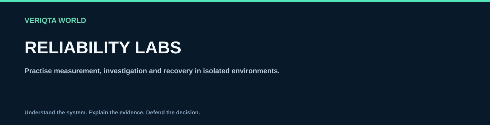

# Reliability labs

Practise measurement, investigation and recovery in isolated environments.

## Explore

- [Service level measurement](01-service-level-measurement)
- [Observability and alerting](02-observability-and-alerting)
- [Incident investigation](03-incident-investigation)
- [Dependencies and resilience](04-dependencies-and-resilience)
- [Capacity and release safety](05-capacity-and-release-safety)
- [Backup and recovery](06-backup-and-recovery)

[Return to SRE-WORLD](../README.md)
