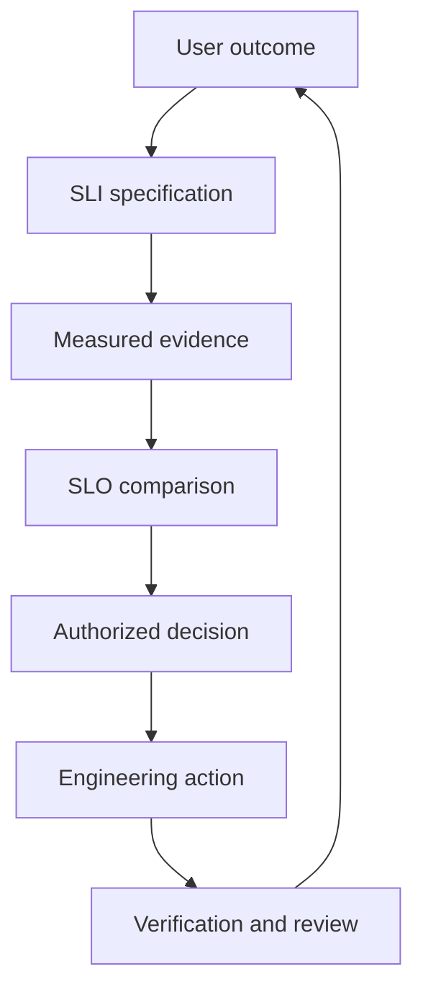

# Service Level Engineering

> Service-level engineering converts important user outcomes into trustworthy measurements, explicit reliability objectives, and decisions that control production risk.

## Section Purpose

Reliability statements often begin as aspirations: the service should be available, fast, correct, or dependable. Those statements express intent, but they cannot guide engineering until the organization defines what is being protected, how performance will be measured, what level is acceptable, and what decision follows from the evidence.

This section establishes service-level engineering as a complete operating discipline. It does not repeat the meaning or history of SRE, teach service discovery, or redefine service ownership. Those subjects belong to SRE Foundations and Service Ownership. Here, the service and its accountable owner are inputs. The work begins when that owner must make reliability measurable.

## Learning Objectives

After completing this section, you should be able to:

1. Define service-level engineering and explain why it is more than monitoring.
2. Trace a user outcome through an SLI, SLO, decision, and review cycle.
3. Distinguish measurement, objective, commitment, and operational action.
4. Identify the minimum evidence required before an SLO is credible.
5. Explain the roles of service, product, SRE, data, commercial, and legal participants.
6. Recognize when a service is not ready for a formal SLO.
7. Establish a small service-level system that can mature without becoming administrative overhead.

## 1. What Service-Level Engineering Means

Service-level engineering is the structured work of answering six connected questions:

1. Which user or consumer outcome matters?
2. Which observable events represent that outcome?
3. Which events count as successful, failed, excluded, or unknown?
4. What performance level is acceptable over a defined period?
5. What decision changes when performance approaches or misses that level?
6. How will the definition and its evidence remain correct as the service changes?

The answers form a production control system. A measurement without an objective describes behavior but does not establish acceptability. An objective without a decision creates a report but does not control risk. A decision without trustworthy measurement acts on opinion. A target without review eventually describes a service that no longer exists.



The loop begins and ends with the user outcome. This prevents the monitoring platform from becoming the source of truth about what reliability should mean.

## 2. Why Monitoring Alone Is Not Enough

Monitoring collects and presents observations. Service-level engineering decides which observations represent delivered service and how those observations affect decisions.

Consider a payment API with these signals:

- all application processes are running;
- CPU utilization is below 50 percent;
- 99.99 percent of HTTP requests return status `200`;
- payment confirmations are delivered within 300 milliseconds.

These signals appear healthy. They still do not prove that valid payments were authorized correctly, recorded once, associated with the correct account, or recoverable after failure. If the API returns `200` with an incorrect business result, transport monitoring reports success while the service fails its purpose.

A monitoring metric becomes an SLI only after the team defines:

- the service behavior it represents;
- the eligible population;
- the success criteria;
- the measurement boundary;
- the source and calculation;
- the treatment of missing and uncertain evidence;
- the decisions the result supports.

The same raw metric may serve different purposes. Request count may be a capacity signal, a business activity measure, or the denominator of an availability SLI. Its meaning comes from the specification and decision context.

## 3. The Service-Level Decision Chain

Four layers must remain distinct.

| Layer | Question | Typical artifact | Primary authority |
| --- | --- | --- | --- |
| User outcome | What must the consumer accomplish? | CUJ-to-service-level map | Product and service owners |
| Indicator | What evidence represents delivery? | SLI specification | Service, SRE, and data owners |
| Objective | What performance is acceptable? | SLO document | Authorized service and product leadership |
| Commitment | What has been promised, to whom, and with what consequence? | SLA or internal agreement | Commercial, legal, business, and service authorities |

An operational decision sits across these layers. For example:

> If the 28-day checkout availability SLO consumes more error budget than the approved policy permits, the service owner pauses nonessential checkout changes and prioritizes the dominant failure mode.

The SLI supplies evidence. The SLO defines acceptable performance. The policy defines the decision. The service owner holds the authority. None of those elements can safely substitute for another.

## 4. Reliability Dimensions

Availability is common, but it is not a complete model of reliability. The protected outcome determines the dimensions that matter.

| Dimension | Core question | Example failure |
| --- | --- | --- |
| Availability | Can the user attempt and complete the required action? | Valid checkout is rejected. |
| Latency | Does the outcome complete within useful time? | Authentication succeeds after the session has expired. |
| Correctness | Is the returned or recorded result right? | A transfer posts to the wrong account. |
| Quality | Is the result useful at the delivered level? | Video connects but is too degraded for conversation. |
| Freshness | Is information current enough for its purpose? | Inventory data is six hours old. |
| Durability | Does committed data remain correct and retrievable? | A confirmed document disappears after storage failure. |
| Completeness | Was all expected work processed? | A pipeline silently omits one partition. |
| Timeliness | Did scheduled work finish by the required deadline? | Payroll completes after the submission cutoff. |

A service may need several SLIs because different failure classes cause different user harm. Combining all dimensions into one score can conceal the reason the service is unsafe. A payment system with excellent availability and weak correctness should not average those properties into an acceptable result.

## 5. Evidence Before Targets

Teams frequently begin by proposing `99.9%`. That reverses the design order. A target is meaningful only after the indicator is credible.

Before approving an SLO, verify that the team can answer:

- Which service and version of its behavior are in scope?
- Who is the consumer?
- What is the protected outcome?
- What starts and ends an eligible event?
- How are retries and duplicates treated?
- Which failures are bad?
- Which events may be excluded, and why?
- What happens when data is missing?
- Which source is authoritative?
- Can the calculation be independently reproduced?
- Which segments can experience materially different harm?
- Who owns the SLI, SLO, source data, and decision?

If these questions are unanswered, a precise percentage creates false confidence. It does not create precision.

## 6. Worked Example: Checkout

Assume an online store wants to protect completed checkout.

### User Outcome

An eligible customer submits a valid order and receives durable confirmation that exactly one order was accepted.

### Candidate Event

One checkout attempt identified by an idempotency key. Network retries using the same key belong to the same logical attempt.

### Candidate Good Event

The system authorizes payment, creates one order with the correct amount and items, and returns a durable order identifier within 2 seconds.

### Candidate Bad Events

- payment is authorized but the order is absent;
- more than one order is created;
- the amount differs from the submitted order;
- completion exceeds 2 seconds;
- the outcome remains ambiguous to the customer;
- a valid attempt is rejected by an internal failure.

### Candidate Exclusions

A request that fails documented eligibility validation before entering checkout may be outside the SLI population. A dependency failure that affects a valid checkout is not excluded merely because another provider caused it. The customer still experienced failure.

### Candidate Objective

At least 99.95 percent of eligible checkout attempts complete correctly, exactly once, and within 2 seconds over a rolling 28-day window.

This draft still needs baseline evidence, segmentation, data-quality controls, target justification, and approval. The example shows why a single HTTP availability metric cannot represent the complete outcome.

## 7. Roles and Authority

Service-level engineering is collaborative, but collaboration does not remove accountability.

### Accountable Service Team

Owns the production outcome and ensures that objectives influence service priorities. It cannot delegate accountability simply by asking SRE to build a dashboard.

### SRE or Reliability Engineering

Helps design measurable outcomes, tests assumptions, evaluates target feasibility, identifies failure modes, and connects evidence to operational decisions. SRE does not unilaterally decide business risk or contractual terms.

### Product and Business Owners

Provide evidence about user expectations, harm, business timing, segmentation, and trade-offs. They participate in target decisions because reliability competes with cost and delivery priorities.

### Data or Telemetry Owners

Maintain source integrity, lineage, coverage, retention, schema, and access. They define how measurement failure becomes visible.

### Commercial and Legal Authorities

Control external commitments, remedies, claims, and contract language. Engineering evaluates measurability and feasibility but does not replace authorized review.

### Consumers

Internal and external consumers provide evidence about real expectations. An internal platform should not define objectives solely from what the provider currently delivers.

## 8. Readiness for Service-Level Engineering

A service is ready to begin when it has:

- an identifiable consumer and outcome;
- a defined service boundary from the ownership collection;
- an accountable team with authority to act;
- observable events that can approximate the outcome;
- enough evidence to establish an initial baseline;
- a reason that a service-level decision will change behavior.

A service may begin with a provisional SLO when data is limited. Provisional does not mean arbitrary. It means the assumptions, confidence limits, review date, and evidence-gathering plan are explicit.

Do not create a formal objective merely to fill a catalog field. If the service has no owner, no stable definition, or no usable evidence, record the readiness gap. A false objective makes the problem harder to see.

## 9. Starting Small Without Becoming Shallow

A useful first implementation normally contains:

1. one high-value journey;
2. one or two reliability dimensions;
3. one complete SLI specification per dimension;
4. a provisional evidence-based target;
5. one decision that uses the result;
6. data-quality controls;
7. a scheduled review.

This is small in scope, not weak in definition. Ten vague objectives are less mature than one reproducible objective that changes an authorized decision.

## 10. Production Scenario: The Green Dashboard

A document-signing service reports 99.99 percent availability from server responses. Support receives complaints that signed documents sometimes cannot be downloaded. Investigation finds that the API returns success before the storage write is durably confirmed. The availability SLI ends at the API response and cannot see the lost document.

### Analysis

- **User outcome:** sign and later retrieve the completed document.
- **Measurement defect:** the boundary ends before the promised durable effect.
- **Misleading evidence:** transport success is presented as completed service.
- **Immediate action:** identify affected documents, stop unsafe acknowledgements if necessary, and communicate known impact.
- **Durable correction:** define separate completion and durability SLIs or extend the end-to-end boundary with a correlation key.
- **Authority:** the service owner controls the production correction; product and risk owners assess user consequences.
- **Verification:** acknowledge a controlled test document only after confirmed storage, retrieve it through the user path, and reconcile acknowledgement records with stored objects.

## Practical Output: Service-Level Engineering Charter

```markdown
# Service-Level Engineering Charter

## Context
- Service ID:
- Accountable team:
- Consumers:
- Critical outcome in scope:
- Business or user harm being controlled:

## Scope
- Journeys and operations included:
- Reliability dimensions:
- Explicit exclusions from this charter:

## Roles and Authority
| Decision | Responsible contributor | Approval authority |
| --- | --- | --- |
| Approve SLI specification | | |
| Approve SLO target and window | | |
| Change measurement source | | |
| Accept temporary exception | | |
| Approve external commitment | | |

## Evidence
- Authoritative event sources:
- Current evidence period:
- Known blind spots:
- Data-quality owners:

## Decision Use
- Healthy state decision:
- At-risk state decision:
- Missed-objective decision:
- Required escalation:

## Lifecycle
- Status: proposed / provisional / approved
- Effective date:
- Review cadence:
- Event-driven review triggers:
- Version-controlled location:
```

## Exercise

Choose one service already identified in the Service Ownership collection. Write one paragraph for each of the following: consumer, intended outcome, material failure, candidate evidence, decision that would change, and known uncertainty. Then draft the charter.

### Verification Criteria

- The outcome describes user value, not a component state.
- The evidence can contain both good and bad observations.
- The named decision is within the authority of the identified owner.
- Unknown evidence remains visible.
- The charter does not create an SLA without commercial and legal authority.

## Knowledge Check

1. Why is a dashboard not an SLO?
2. When can a system metric legitimately become part of an SLI?
3. Why should a team define the indicator before selecting the target?
4. Which participant has authority to approve contractual consequences?
5. What makes a provisional SLO responsible rather than arbitrary?

## Key Takeaways

- Service-level engineering connects user outcomes, measurement, targets, authority, decisions, and review.
- Monitoring provides evidence; it does not decide what reliability means.
- The protected outcome determines the reliability dimensions.
- A precise target cannot repair an invalid indicator.
- Start with a small number of complete, decision-bearing objectives.

## Further Reading

- [Google SRE, Service Level Objectives](https://sre.google/sre-book/service-level-objectives/)
- [Google SRE Workbook, Implementing SLOs](https://sre.google/workbook/implementing-slos/)

## Navigation

- Previous collection: [Service Ownership](../02-Service-Ownership/README.md)
- Next: [SLI, SLO, and SLA Terminology](02-SLI-SLO-and-SLA-Terminology.md)
- Collection: [SLIs, SLOs, and SLAs](README.md)

---

Part of **SRE World**, maintained by **VERIQTA**.
