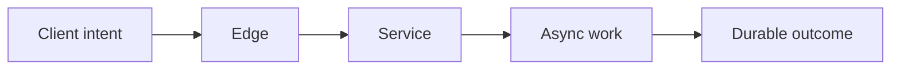

# Service Boundaries and Measurement Boundaries

> Choose where service behavior should be observed so the indicator represents the intended user experience.

## Section Purpose

Choose where service behavior should be observed so the indicator represents the intended user experience.

Service boundaries were defined in Service Ownership. This section uses those boundaries while deciding where evidence is collected.

The practical output is a **Service-level measurement boundary record**.

---

## Learning Objectives

After completing this section, you should be able to:

1. Explain the role of two different boundaries in a service-level system.
2. Explain the role of client-side measurement in a service-level system.
3. Explain the role of edge measurement in a service-level system.
4. Explain the role of server-side measurement in a service-level system.
5. Explain the role of end-to-end measurement in a service-level system.
6. Explain the role of provider and consumer views in a service-level system.
7. Explain the role of control and data planes in a service-level system.
8. Explain the role of third-party and shared boundaries in a service-level system.

---

## Two different boundaries

The service boundary defines accountability and included behavior. The measurement boundary defines where an observation is made. They may align, but they solve different problems.

---

## Client-side measurement

Client measurements include network, edge, rendering, local retries, and final user-visible outcome. They are close to experience but may be sampled, delayed, privacy-sensitive, or unavailable for some clients.

---

## Edge measurement

Load balancers, gateways, and CDN edges see externally received traffic and response behavior. They may miss client-side failures before arrival and semantic failure after a response.

---

## Server-side measurement

Application instrumentation offers rich classification and ownership context. It can overstate success when traffic never arrives or the application records success before downstream completion.

---

## End-to-end measurement

Journey-level evidence follows work from trigger to durable outcome. It best represents multi-service behavior but requires correlation, ownership, and careful treatment of delayed completion.

---

## Provider and consumer views

A provider can measure its interface correctly while a consumer remains unable to complete the journey. Both views may be necessary, with separate ownership and decisions.

---

## Control and data planes

A control-plane action can be rarely used but critical. Its measurement population, latency, and failure consequences differ from the data plane it manages.

---

## Third-party and shared boundaries

When data comes from a vendor or platform, record which layer is measured, who controls the query, how disputes are resolved, and which failures remain invisible.

---

## Choosing the boundary

Prefer the point closest to user-visible success that remains accurate, available, affordable, and governable. When no single source is sufficient, define corroborating indicators and limitations.

---

## Detailed Boundary Design

The service boundary was established in the Service Ownership collection. It describes what the team owns. The measurement boundary answers a different question: where does observation begin and end for a specific service-level claim?

These boundaries may align, but they often do not. A team may own an API while the user outcome begins in a mobile application and ends after an asynchronous worker commits a record.

### Boundary Components

A complete measurement boundary records:

1. **consumer:** whose experience is represented;
2. **entry point:** the observable condition that begins an eligible event;
3. **terminal point:** the observable condition that completes it;
4. **observation point:** where evidence is collected;
5. **correlation method:** how records across stages represent one logical event;
6. **time basis:** clocks, time zones, deadlines, and timeout treatment;
7. **population rule:** which attempts enter the denominator;
8. **blind spots:** failures that cannot be seen from the selected point.

Each observation point sees a different portion of this path. No point is automatically correct for every decision.

## Client, Edge, Server, and End-to-End Views

| View | What it sees well | What it may miss | Common operational use |
| --- | --- | --- | --- |
| Client | user-perceived reachability and rendering | abandoned attempts, blocked telemetry, privacy-limited populations | real-user experience |
| Edge | requests reaching the provider perimeter | client failures before arrival and semantic failures after response | external request availability |
| Server | application processing and internal result | DNS, routing, client rendering, downstream effect | service-owned processing |
| Downstream effect | completed business or data outcome | early-stage experience unless correlated | correctness and completion |
| Synthetic journey | controlled end-to-end behavior | full population diversity and real traffic mix | independent detection |

Use multiple sources when one view cannot represent the claim. One source should still be authoritative for compliance, and the others should have defined corroborating roles.

## Boundary Selection by Claim

Consider four different claims about an order service:

1. “The API accepted the request.” The boundary may end at a validated acknowledgement.
2. “The order was created.” The boundary ends when the authoritative order record exists.
3. “The customer received confirmation.” The boundary extends through the notification channel.
4. “The order will be fulfilled.” The boundary may extend into a business process far beyond the API.

The measurement boundary must match the words of the claim. It is unsafe to measure the first condition while reporting the fourth.

## Failures Before the Boundary

Server-side SLIs normally miss attempts that never arrive because of:

- DNS failure;
- routing or TLS failure;
- edge rejection;
- client library failure;
- mobile connectivity;
- browser execution errors.

These failures may still belong to the user outcome. Options include client telemetry, edge logs, independent probes, or a carefully stated limitation. Do not claim “user availability” when the measure begins after these failure modes.

## Failures After the Boundary

An API may respond successfully before:

- a message is consumed;
- a document is stored durably;
- a notification is delivered;
- a transaction is reconciled;
- a data pipeline produces the final dataset.

If the promise includes the later effect, extend the boundary or define a separate completion SLI joined by a stable correlation key.

## Control Plane and Data Plane

Control-plane failure and data-plane failure create different experiences. Existing workloads may continue serving while customers cannot create or modify them. A single availability figure can hide this distinction.

For a cloud database platform, separate journeys might include:

- connect to an existing database, data plane;
- create a database instance, control plane;
- change access policy, control plane;
- restore a backup, recovery plane.

Each requires its own boundary when failure consequences and populations differ.

## Boundary Mathematics

Changing the boundary changes both numerator and denominator. Suppose:

- 100,000 valid client attempts occur;
- 500 fail before reaching the edge;
- 300 fail between edge and service;
- 200 receive an incorrect application result.

Server-observed success may be:

$$
\frac{99{,}000}{99{,}200} = 99.798\%
$$

End-to-end client success is:

$$
\frac{99{,}000}{100{,}000} = 99.0\%
$$

Both calculations can be mathematically correct. Only one represents the complete client attempt. The difference is a boundary decision, not a rounding error.

## Correlation and Identity

End-to-end measurement often fails because records cannot be joined safely. Select a logical event identifier that:

- remains stable across retries;
- does not expose sensitive data;
- propagates across asynchronous stages;
- distinguishes separate user intentions;
- supports deduplication;
- survives the required retention period.

A request ID generated on every retry is not enough to represent one logical payment attempt. An idempotency key or business transaction identifier may be more appropriate.

## Boundary Decision Test

Before approval, inject or replay failures at each stage:

1. before the edge;
2. at the edge;
3. inside the service;
4. at a dependency;
5. after acknowledgement;
6. during telemetry interruption.

For each failure, state whether the SLI should become good, bad, excluded, or unknown. If the observed result differs, either the implementation or the boundary claim is wrong.

## Production Scenario

The API server reports 99.99 percent success, but a mobile client version cannot parse the response. Server-side measurement is accurate for the API boundary and wrong for the complete user journey.

### Analysis Questions

1. Which user outcome is at risk?
2. What is the correct measurement population and boundary?
3. Which evidence is authoritative?
4. Which assumption could make the result misleading?
5. Who owns the indicator and decision?
6. What immediate correction is required?
7. How will the corrected design be verified?

---

## Practical Output: Service-level measurement boundary record

Create a record containing:

- Service and journey:
- Service boundary reference:
- Candidate points:
- Selected point:
- User experience represented:
- Blind spots:
- Source owner:
- Privacy and cost:
- Corroborating evidence:
- Review trigger:

Unknown information must remain visible with an investigation owner and due date. Do not use “not applicable” to hide missing evidence.

---

## Review Checklist

- [ ] The protected user outcome is explicit.
- [ ] The evaluated population is defined.
- [ ] The measurement boundary is defensible.
- [ ] Good, bad, excluded, and unknown behavior cannot be confused.
- [ ] The calculation can be reproduced from authoritative evidence.
- [ ] Segments with materially different harm remain visible.
- [ ] Limitations and uncertainty are documented.
- [ ] Ownership, approval, version, and review triggers are recorded.
- [ ] The result supports a named production decision.

---

## Key Takeaways

- Choose where service behavior should be observed so the indicator represents the intended user experience.
- A percentage without a precise population, calculation, window, and owner is not a trustworthy service level.
- User-visible outcomes take priority over convenient infrastructure signals.
- Unknown and excluded events require explicit treatment.
- Every service-level artifact needs validation and lifecycle control.

---

## Navigation

[Previous: From Critical User Journeys to Service Levels](./03-From-Critical-User-Journeys-to-Service-Levels.md)

[Next: Anatomy of an SLI Specification](./05-Anatomy-of-an-SLI-Specification.md)

Return to the [SLIs, SLOs, and SLAs README](./README.md).

---

## Maintained by VERIQTA

SRE World is created and maintained by [VERIQTA](https://github.com/veriqta).

- Website: [veriqta.com](https://www.veriqta.com/)
- GitHub: [github.com/veriqta](https://github.com/veriqta)
- Instagram: [@veriqta](https://www.instagram.com/veriqta/)
- Medium: [veriqta.medium.com](https://veriqta.medium.com/)
