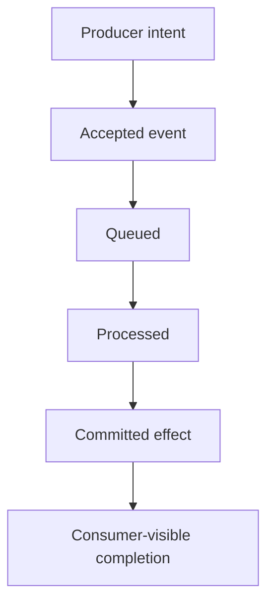

# Asynchronous and Event-Driven SLIs

> Measure systems where acceptance, delivery, processing, and the user-visible outcome occur at different times.

## Section Purpose

Measure systems where acceptance, delivery, processing, and the user-visible outcome occur at different times.

This section defines event-driven indicators. Messaging-platform architecture and consumer implementation are separate topics.

The practical output is a **Event-driven service SLI specification**.

---

## Learning Objectives

After completing this section, you should be able to:

1. Explain acceptance is not completion and its effect on service-level accuracy.
2. Explain stage model and its effect on service-level accuracy.
3. Explain end-to-end latency and its effect on service-level accuracy.
4. Explain backlog age and its effect on service-level accuracy.
5. Explain loss and duplication and its effect on service-level accuracy.
6. Explain ordering and its effect on service-level accuracy.
7. Explain dead-letter handling and its effect on service-level accuracy.
8. Explain eventual consistency and its effect on service-level accuracy.
9. Apply the section to a realistic production service.
10. Produce and verify the required practical artifact.

---

## Acceptance is not completion

A successful producer acknowledgement proves only that one boundary accepted work. It does not prove persistence, delivery, processing, or final outcome.

---

## Stage model

Separate producer acceptance, broker persistence, delivery, consumer processing, state change, and user-visible confirmation.

---

## End-to-end latency

Measure from the initiating event to the required completed state. Queue delay and consumer duration help diagnosis but are component indicators.

---

## Backlog age

Queue depth can grow with traffic. Age of the oldest eligible work often represents user delay more directly.

---

## Loss and duplication

At-least-once delivery tolerates duplicates only when consumers handle them safely. Measure lost logical events and duplicate side effects.

---

## Ordering

Some services require ordering by entity or stream. Define the scope and observable consequence of an ordering violation.

---

## Dead-letter handling

Moving an event to a dead-letter queue is not completion. Track unresolved age, owner, retry, and final disposition.

---

## Eventual consistency

Define the maximum acceptable convergence time and what users see before convergence. “Eventually” is not a measurable commitment.

---

## Correlation

Stable identifiers connect producer intent, retries, deliveries, side effects, and confirmation. Missing correlation creates measurement uncertainty.

---

## Acceptance Is Not Completion

An asynchronous service often acknowledges work before producing the promised effect. Measure acceptance and completion separately.

- **Acceptance SLI:** could the producer submit a valid event?
- **Completion SLI:** did the event reach the required terminal state?
- **Latency SLI:** did completion occur before the deadline?
- **Correctness SLI:** was the resulting state correct and unique?

An excellent acceptance SLI can coexist with complete downstream failure.

## Event Lifecycle

The specification must identify which terminal state fulfills the promise. “Message consumed” may not equal “business effect committed.”

## Correlation and Terminal States

Use a stable event or business-operation identifier across every stage. Define allowed terminal states such as completed, rejected by a documented business rule, permanently failed, expired, or unknown. A message that remains “processing” beyond its deadline is bad even if it may eventually succeed.

## Duplicate Delivery and Idempotency

At-least-once delivery can produce duplicate technical events. The SLI should evaluate the promised business effect. If duplicate delivery is safely absorbed, the logical outcome may remain good. If it creates duplicate charges or records, the event is bad.

## Worked Example

One million valid events are accepted:

- 985,000 produce the correct terminal effect within 60 seconds;
- 8,000 complete correctly after 60 seconds;
- 3,000 create duplicate effects;
- 2,000 fail permanently;
- 1,000 remain pending beyond the deadline;
- 1,000 cannot be correlated because tracing metadata is lost.

Recorded timely completion is:

$$
\frac{985{,}000}{999{,}000} \approx 98.60\%
$$

The 1,000 uncorrelated events are unknown, not successful. Depending on policy, compliance may require uncertainty bounds using the full accepted population.

## Backlog and Age

Queue depth alone is not a user-centered SLI. Combine it with age of oldest eligible work, completion latency, and arrival rate. A large fast-moving queue may be healthy, while a small queue containing permanently stuck high-priority events may be unsafe.

## Production Scenario

An order API returns accepted, the broker stores the message, and the consumer repeatedly fails. The system reports successful ingestion while no order is created.

### Analysis Questions

1. Which user or consumer outcome matters?
2. Which population and measurement boundary apply?
3. Which evidence should be trusted?
4. What could make the reported value misleading?
5. Which owner has authority to correct the design?
6. What should be changed now?
7. How will the change be verified?

---

## Practical Output: Event-driven service SLI specification

Create a record containing:

- Logical event:
- Acceptance boundary:
- Persistence evidence:
- Completion boundary:
- Correlation key:
- Latency threshold:
- Loss rule:
- Duplicate rule:
- Ordering rule:
- Dead-letter treatment:

Record unknowns, limitations, owners, dates, and validation evidence. Never improve a result by silently removing difficult observations.

---

## Review Checklist

- [ ] User outcome and population are explicit.
- [ ] Measurement and service boundaries are distinguished.
- [ ] Calculation rules are reproducible.
- [ ] Missing, duplicate, delayed, excluded, and unknown evidence is handled.
- [ ] Relevant segments remain visible.
- [ ] Limitations and uncertainty are stated.
- [ ] The accountable owner accepted the design.
- [ ] Test cases include failure and edge conditions.
- [ ] Review triggers and version history are recorded.

---

## Key Takeaways

- Measure systems where acceptance, delivery, processing, and the user-visible outcome occur at different times.
- Convenient telemetry is not automatically reliable evidence.
- Aggregate success must not hide a materially harmed population.
- Measurement failure is itself an operational risk.
- Every material definition or query change requires controlled review.

---

## Navigation

[Previous: Batch and Data Pipeline SLIs](./14-Batch-and-Data-Pipeline-SLIs.md)

[Next: SLI Measurement Sources](./16-SLI-Measurement-Sources.md)

Return to the [SLIs, SLOs, and SLAs README](./README.md).

---

## Maintained by VERIQTA

SRE World is created and maintained by [VERIQTA](https://github.com/veriqta).

- Website: [veriqta.com](https://www.veriqta.com/)
- GitHub: [github.com/veriqta](https://github.com/veriqta)
- Instagram: [@veriqta](https://www.instagram.com/veriqta/)
- Medium: [veriqta.medium.com](https://veriqta.medium.com/)
