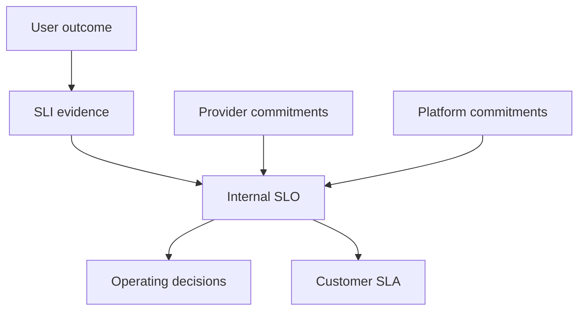

# Aligning SLIs, SLOs, SLAs, and Internal Commitments

> Build a coherent hierarchy from raw measurement through internal engineering objectives to customer, vendor, and cross-team commitments.

## Section Purpose

Build a coherent hierarchy from raw measurement through internal engineering objectives to customer, vendor, and cross-team commitments.

This section aligns commitments. It does not renegotiate contracts or define full provider-management processes.

The practical output is a **SLI-SLO-SLA alignment matrix**.

---

## Learning Objectives

After completing this section, you should be able to:

1. Explain measurement layer and its role in a defensible service-level system.
2. Explain internal objective and its role in a defensible service-level system.
3. Explain external commitment and its role in a defensible service-level system.
4. Explain headroom and its role in a defensible service-level system.
5. Explain vendor alignment and its role in a defensible service-level system.
6. Explain platform commitments and its role in a defensible service-level system.
7. Explain operational level agreements and its role in a defensible service-level system.
8. Explain window and source mismatch and its role in a defensible service-level system.
9. Apply the section to an ambiguous production scenario.
10. Produce and defend the required artifact.

---

## Measurement layer

The SLI defines what is observed. Every target or agreement should map to a reproducible indicator, even when several views are required.

---

## Internal objective

The SLO expresses the reliability level the organization intends to operate. It should enable corrective action before customer consequences occur.

---

## External commitment

The SLA expresses selected commitments to another party and may use different scope, exclusions, period, or consequences.

---

## Headroom

An internal SLO stronger than the SLA can provide time and budget to act before contractual breach. Headroom must be supported by architecture and evidence.

---

## Vendor alignment

A vendor SLA may be weaker, differently measured, or subject to exclusions. Map the gap between provider commitment and consumer SLO.

---

## Platform commitments

Internal platforms should state supported capability, consumer responsibilities, and service-level interfaces without assuming ownership of every workload.

---

## Operational Level Agreements

An OLA can coordinate internal teams that support an SLA. It must connect responsibilities and evidence without replacing end-to-end accountability.

---

## Window and source mismatch

Two targets with the same percentage may not align when they use different populations, sources, exclusions, or periods. Compare definitions field by field.

---

## Cascading commitments

Do not promise externally what the combined architecture and supplier commitments cannot support. Identify concentration and correlated failure.

---

## Renegotiation

When service, market, architecture, or dependency conditions change, review the hierarchy and obtain authorized changes before continuing an unsupported promise.

---

## Commitment Stack

Alignment does not require identical percentages. It requires every dependency and commitment to be sufficient for the promise above it, with differences understood.

## Compare Complete Definitions

For each layer, compare:

- consumer and operation population;
- measurement boundary;
- success rule and threshold;
- source and query;
- rolling or calendar window;
- timezone and rounding;
- exclusions and unknowns;
- owner and authority;
- consequence;
- headroom.

Two commitments both labeled 99.9 percent may be incompatible because every other field differs.

## Headroom Analysis

If the customer SLA is 99.9 percent monthly, an internal 99.95 percent rolling SLO may provide operating margin. Test whether source, scope, and periods align enough for that margin to be real. A stricter number on a narrower server-side population may not protect a broader edge-based SLA.

## Cascading Commitments

Do not promise more than dependencies and architecture can support. A platform SLO can inform a product SLO, and a vendor SLA can inform risk analysis, but neither transfers accountability for the end-to-end customer journey.

## Conflict Resolution

When commitments conflict:

1. identify the exact incompatible fields;
2. quantify exposure using historical and modeled evidence;
3. determine whether architecture, measurement, operating practice, or contract must change;
4. assign authorized owners;
5. record temporary controls and deadline;
6. renegotiate unsupported promises before renewal where necessary.

## Production Scenario

The internal SLO is 99.9 percent over a rolling 28-day window, while the customer SLA is 99.95 percent per calendar month. The external promise is stronger than the operating target.

### Analysis Questions

1. What user outcome or commitment is affected?
2. Which definition, target, source, or authority is missing?
3. What can be concluded from the current evidence?
4. What cannot be concluded?
5. Who owns the decision?
6. What correction is required?
7. What evidence will prove that the correction works?

---

## Practical Output: SLI-SLO-SLA alignment matrix

Create a record containing:

- Service behavior:
- SLI definition:
- Internal target:
- Internal window:
- SLA commitment:
- SLA window:
- Sources:
- Exclusions:
- Headroom:
- Vendor dependency:
- Decision owner:
- Gap action:

Every target, exception, or commitment must identify its authority. Unknown evidence must remain visible with an owner and resolution date.

---

## Review Checklist

- [ ] The protected outcome or commitment is explicit.
- [ ] The SLI definition is versioned and reproducible.
- [ ] Target and time window are justified.
- [ ] Scope, segments, exclusions, and unknowns are visible.
- [ ] Measurement quality is sufficient for the decision.
- [ ] Dependencies and mismatched commitments are recorded.
- [ ] The accountable owner and approving authority are named.
- [ ] Review triggers, effective dates, and history are preserved.
- [ ] The artifact supports a real decision rather than reporting alone.

---

## Key Takeaways

- Build a coherent hierarchy from raw measurement through internal engineering objectives to customer, vendor, and cross-team commitments.
- A target is defensible only when its measurement, rationale, owner, and decision are explicit.
- Strong governance preserves meaning as services and data change.
- Internal objectives and external commitments must be compared field by field.
- Contractual authority remains outside a technical team acting alone.

---

## Navigation

[Previous: SLA Terms, Exclusions, Consequences, and Claims](./29-SLA-Terms-Exclusions-Consequences-and-Claims.md)

[Next: Service Level Anti-Patterns](./31-Service-Level-Anti-Patterns.md)

Return to the [SLIs, SLOs, and SLAs README](./README.md).

---

## Maintained by VERIQTA

SRE World is created and maintained by [VERIQTA](https://github.com/veriqta).

- Website: [veriqta.com](https://www.veriqta.com/)
- GitHub: [github.com/veriqta](https://github.com/veriqta)
- Instagram: [@veriqta](https://www.instagram.com/veriqta/)
- Medium: [veriqta.medium.com](https://veriqta.medium.com/)
