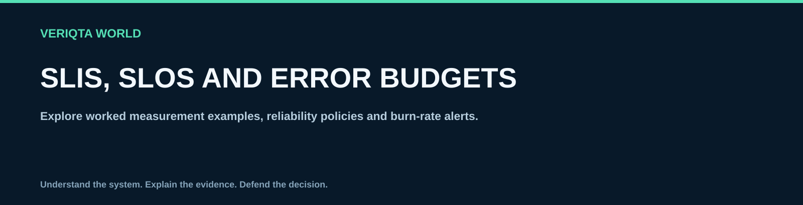

# SLIs, SLOs and error budgets

Explore worked measurement examples, reliability policies and burn-rate alerts.

## Explore

- [Choose user centred slis](choose-user-centred-slis.md)
- [Define a service slo](define-a-service-slo.md)
- [Calculate an error budget](calculate-an-error-budget.md)
- [Design burn rate alerts](design-burn-rate-alerts.md)
- [Write an error budget policy](write-an-error-budget-policy.md)
- [Review slo measurement problems](review-slo-measurement-problems.md)
- [Request based slo worked examples](request-based-slo-worked-examples.md)
- [Time based slo worked examples](time-based-slo-worked-examples.md)
- [Latency slo worked examples](latency-slo-worked-examples.md)
- [Dependency and end to end slos](dependency-and-end-to-end-slos.md)

[Return to SRE-WORLD](../README.md)
