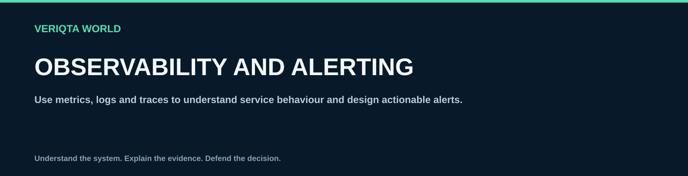

# Observability and alerting

Use metrics, logs and traces to understand service behaviour and design actionable alerts.

## Explore

- [Choose service health signals](choose-service-health-signals.md)
- [Instrument a service](instrument-a-service.md)
- [Design operational dashboards](design-operational-dashboards.md)
- [Correlate metrics logs and traces](correlate-metrics-logs-and-traces.md)
- [Design actionable alerts](design-actionable-alerts.md)
- [Reduce alert noise](reduce-alert-noise.md)
- [Validate alert behaviour](validate-alert-behaviour.md)
- [Investigate missing telemetry](investigate-missing-telemetry.md)
- [Manage cardinality and telemetry cost](manage-cardinality-and-telemetry-cost.md)
- [Observability coverage checklist](observability-coverage-checklist.md)

[Return to SRE-WORLD](../README.md)
