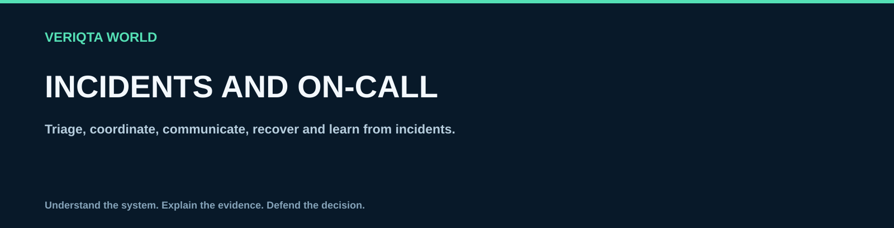

# Incidents and on-call

Triage, coordinate, communicate, recover and learn from incidents.

## Explore

- [Incident triage and severity](incident-triage-and-severity.md)
- [Incident roles and coordination](incident-roles-and-coordination.md)
- [On call readiness](on-call-readiness.md)
- [Escalation and handover](escalation-and-handover.md)
- [Incident evidence collection](incident-evidence-collection.md)
- [Status updates and stakeholder communication](status-updates-and-stakeholder-communication.md)
- [Mitigation and recovery decisions](mitigation-and-recovery-decisions.md)
- [Incident timelines](incident-timelines.md)
- [Blameless postmortems](blameless-postmortems.md)
- [Incident action tracking](incident-action-tracking.md)
- [Sustainable on call practices](sustainable-on-call-practices.md)

[Return to SRE-WORLD](../README.md)
