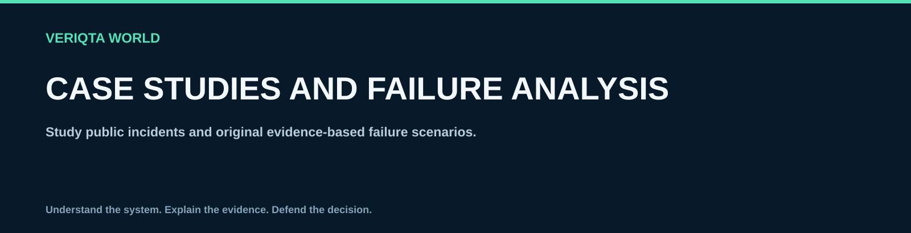

# Case studies and failure analysis

Study public incidents and original evidence-based failure scenarios.

## Explore

- [Latency after deployment](latency-after-deployment)
- [Retry storm during dependency failure](retry-storm-during-dependency-failure)
- [Database connection exhaustion](database-connection-exhaustion)
- [Misleading availability dashboard](misleading-availability-dashboard)
- [Failed restore during recovery](failed-restore-during-recovery)
- [Noisy alerts hide an incident](noisy-alerts-hide-an-incident)
- [Capacity limit during traffic growth](capacity-limit-during-traffic-growth)
- [Regional outage and shared dependency](regional-outage-and-shared-dependency)
- [How to analyse a public postmortem](how-to-analyse-a-public-postmortem.md)
- [Public incident case studies](public-incident-case-studies.md)
- [Cross incident patterns and lessons](cross-incident-patterns-and-lessons.md)

[Return to SRE-WORLD](../README.md)
