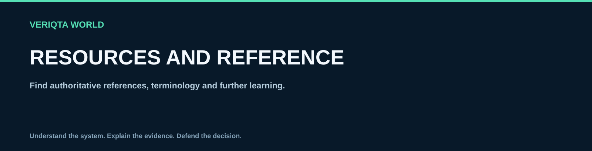

# Resources and reference

Find authoritative references, terminology and further learning.

## Explore

- [Sre official documentation](sre-official-documentation.md)
- [Sre books and courses](sre-books-and-courses.md)
- [Reliability research papers](reliability-research-papers.md)
- [Engineering talks and publications](engineering-talks-and-publications.md)
- [Sre glossary](sre-glossary.md)
- [Reliability tools reference](reliability-tools-reference.md)
- [Sre career development](sre-career-development.md)
- [Sre interview preparation](sre-interview-preparation.md)
- [Public postmortem directory](public-postmortem-directory.md)

[Return to SRE-WORLD](../README.md)
