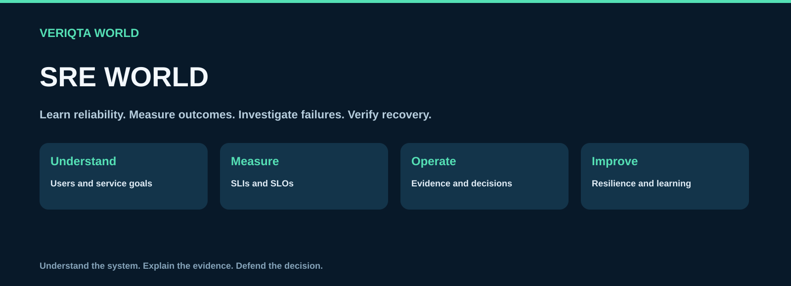
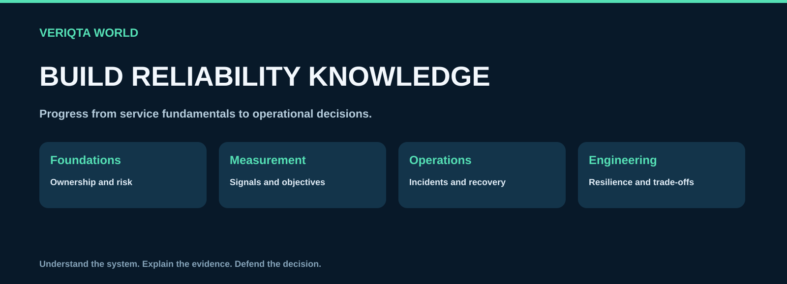
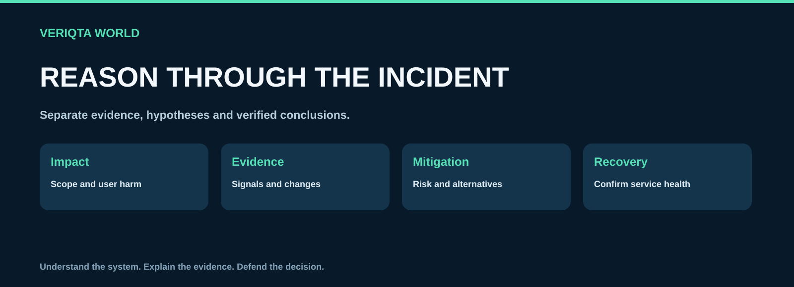

# SRE-WORLD

**Learn reliability engineering, measure service outcomes and practise evidence-based operations.**

[Start here](00-start-here) · [Learn SRE](01-beginner-to-advanced) · [Practise labs](02-labs) · [Build projects](03-projects) · [Explore service levels](04-slis-slos-and-error-budgets)

SRE-WORLD connects reliability concepts with practical measurement, operational decisions and verified recovery. Explore service ownership, SLIs, SLOs, error budgets, observability, on-call, incidents, safe changes, capacity, resilience and disaster recovery.

## Explore SRE World

| Collection | Engineering focus |
| --- | --- |
| [Start here](00-start-here) | Set up a practice environment and choose your reliability learning path. |
| [Beginner to advanced](01-beginner-to-advanced) | Develop SRE knowledge through a progressive learning sequence. |
| [Reliability labs](02-labs) | Practise measurement, investigation and recovery in isolated environments. |
| [SRE portfolio projects](03-projects) | Build working reliability systems and demonstrate verified outcomes. |
| [SLIs, SLOs and error budgets](04-slis-slos-and-error-budgets) | Explore worked measurement examples, reliability policies and burn-rate alerts. |
| [Observability and alerting](05-observability-and-alerting) | Use metrics, logs and traces to understand service behaviour and design actionable alerts. |
| [Incidents and on-call](06-incidents-and-on-call) | Triage, coordinate, communicate, recover and learn from incidents. |
| [Reliability and recovery](07-reliability-and-recovery) | Explore dependencies, resilience, capacity, safe changes and disaster recovery. |
| [Production playbooks and templates](08-production-playbooks-and-templates) | Use reusable operational procedures and engineering documents. |
| [Case studies and failure analysis](09-case-studies-and-failure-analysis) | Study public incidents and original evidence-based failure scenarios. |
| [Resources and reference](10-resources-and-reference) | Find authoritative references, terminology and further learning. |

## Develop reliability knowledge

Start with user journeys, service ownership and risk. Learn to select indicators and objectives, inspect signals and coordinate incident response. Progress to release safety, dependency behaviour, capacity, recovery and organisational decisions.

The learning sequence teaches in order. Specialist collections provide worked examples, operational references and reusable documents. Use them together to connect understanding with practice.

[Explore the learning sequence](01-beginner-to-advanced)

## Measure outcomes users care about

Choose indicators linked to user experience and make measurement assumptions explicit. Define objectives, calculate error budgets and review how missing data, exclusions and aggregation affect your conclusions. Use reliability policy to guide decisions rather than treating a target as a guarantee.

[Explore SLIs, SLOs and error budgets](04-slis-slos-and-error-budgets)

## Practise and build

Labs provide focused setup, tasks, verification, troubleshooting and cleanup. Portfolio projects combine services, infrastructure, measurement, automation and failure recovery in a thirteen-step build.

- [Reliability labs](02-labs)
- [Junior projects](03-projects/01-junior)
- [Mid-level projects](03-projects/02-mid-level)
- [Senior projects](03-projects/03-senior)

Document the architecture, test results, observed failure behaviour and verified recovery. Explain your independent extension and distinguish guided practice from professional experience.

## Investigate incidents with evidence

Define impact, collect relevant signals, test hypotheses and compare mitigation options. Communicate uncertainty and verify service health before concluding recovery. Use postmortems to identify contributing conditions and actionable improvements.

[Incidents and on-call](06-incidents-and-on-call) · [Case studies and failure analysis](09-case-studies-and-failure-analysis)

## Engineer for failure and change

Explore timeouts, retries, graceful degradation, redundancy, capacity, release verification and tested restoration. Assess reliability alongside security, cost and operational complexity. Conduct failure experiments only in authorised isolated environments.

[Reliability and recovery](07-reliability-and-recovery)

## Use operational references

Adapt playbooks, checklists and templates to your service and organisational controls. Record ownership, assumptions, expected results, escalation boundaries and recovery criteria.

[Production playbooks and templates](08-production-playbooks-and-templates)

## Continue your preparation

Find documentation, books, research, terminology and career resources. Practise explaining the evidence and trade-offs behind your work.

[Resources and reference](10-resources-and-reference) · [DEVOPS-INTERVIEW-WORLD](https://github.com/VERIQTA-WORLD/DEVOPS-INTERVIEW-WORLD)

## Contribute

Improve explanations, worked examples, reproducible exercises and operational guidance. Include assumptions, relevant versions, verification evidence and cleanup.

[Contribution guide](CONTRIBUTING.md) · [Content standard](CONTENT-STANDARD.md)

## About VERIQTA WORLD

VERIQTA WORLD shares engineering resources that connect learning with practical work.

[Explore VERIQTA WORLD](https://github.com/VERIQTA-WORLD)

These are educational resources. Practice projects do not establish professional production experience or guarantee employment. Names and trademarks belong to their owners.
